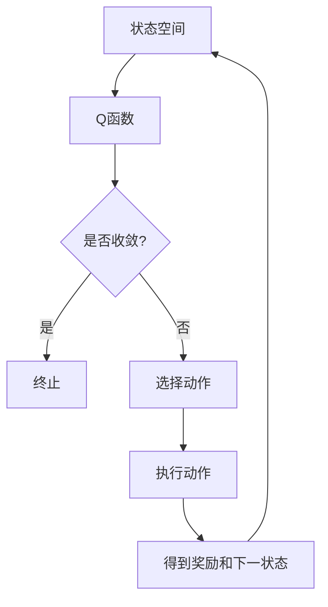

# 一切皆是映射：DQN算法的实验设计与结果分析技巧

> 关键词：深度强化学习，DQN，实验设计，结果分析，策略迭代，探索-利用，函数近似，Q学习，智能体，环境

## 1. 背景介绍
### 1.1 问题的由来

深度强化学习（Deep Reinforcement Learning，DRL）是人工智能领域的一个前沿方向，它结合了深度学习和强化学习的技术，使得智能体能够在复杂环境中通过学习获得最优策略。DQN（Deep Q-Network）是DRL领域的一个经典算法，它通过神经网络来近似Q函数，实现了在连续空间中的策略学习。

### 1.2 研究现状

DQN自提出以来，已经在多个领域取得了显著的成果，如图像识别、自动驾驶、机器人控制等。然而，DQN算法的设计与实施过程中，实验设计、结果分析等方面存在诸多挑战，如何有效地进行实验设计与结果分析，成为了研究者和开发者关注的焦点。

### 1.3 研究意义

掌握DQN算法的实验设计与结果分析技巧，对于以下方面具有重要意义：

- 提高DQN算法的学习效率和收敛速度。
- 提升DQN算法在复杂环境中的性能和稳定性。
- 为DQN算法的改进和创新提供理论依据和实践指导。

### 1.4 本文结构

本文将围绕DQN算法的实验设计与结果分析展开，具体内容如下：

- 第2章介绍DQN算法的核心概念与联系。
- 第3章详细阐述DQN算法的原理与操作步骤。
- 第4章讲解DQN算法的数学模型和公式。
- 第5章通过代码实例展示DQN算法的具体实现。
- 第6章探讨DQN算法的实际应用场景。
- 第7章展望DQN算法的未来发展趋势与挑战。
- 第8章总结全文并展望研究展望。
- 第9章提供常见问题与解答。

## 2. 核心概念与联系
### 2.1 核心概念

- **强化学习**：智能体通过与环境的交互，学习如何做出最优决策，以实现特定目标。
- **Q学习**：一种强化学习方法，通过学习Q函数来评估每个状态-动作对的值，从而选择最优动作。
- **深度学习**：一种利用神经网络进行数据学习的机器学习技术。
- **DQN**：一种基于深度学习的Q学习算法，使用神经网络来近似Q函数。

### 2.2 Mermaid流程图



### 2.3 核心概念联系

DQN算法结合了Q学习、深度学习和探索-利用策略，通过神经网络近似Q函数，实现智能体在环境中的决策。

## 3. 核心算法原理 & 具体操作步骤
### 3.1 算法原理概述

DQN算法的核心思想是使用深度神经网络来近似Q函数，并通过策略迭代的方式优化策略。具体步骤如下：

1. 初始化Q网络和目标Q网络。
2. 通过随机策略与环境交互，收集状态-动作对。
3. 使用收集到的数据更新Q网络。
4. 使用目标Q网络生成目标值。
5. 使用更新后的Q网络生成下一个动作。
6. 重复步骤2-5，直到收敛。

### 3.2 算法步骤详解

#### 3.2.1 初始化

- 初始化Q网络和目标Q网络，它们具有相同的结构和参数。
- 初始化经验回放缓冲区，用于存储状态-动作对。

#### 3.2.2 收集数据

- 通过随机策略与环境交互，收集状态-动作对。
- 将收集到的状态-动作对存入经验回放缓冲区。

#### 3.2.3 更新Q网络

- 从经验回放缓冲区中随机抽取一个批次的数据。
- 使用最小化损失函数的方式更新Q网络。

#### 3.2.4 生成目标值

- 使用目标Q网络生成目标值，即计算每个状态-动作对的预期回报。

#### 3.2.5 生成下一个动作

- 使用更新后的Q网络生成下一个动作。

#### 3.2.6 迭代

- 重复步骤2-5，直到收敛。

### 3.3 算法优缺点

#### 3.3.1 优点

- 能够学习到复杂环境的策略。
- 能够处理连续动作空间。
- 能够处理高维状态空间。

#### 3.3.2 缺点

- 收敛速度慢。
- 易受探索-利用问题的影响。
- 需要大量数据进行训练。

### 3.4 算法应用领域

- 游戏：如Atari游戏、Go等。
- 自动驾驶：如车辆控制、路径规划等。
- 机器人：如抓取、导航等。
- 金融：如股票交易、风险控制等。

## 4. 数学模型和公式 & 详细讲解 & 举例说明
### 4.1 数学模型构建

DQN算法的数学模型主要包括：

- **Q函数**：表示在给定状态s和动作a下，智能体获得的期望回报。
- **策略**：表示智能体在给定状态下选择动作的概率分布。
- **奖励函数**：表示智能体在执行动作后获得的环境奖励。

### 4.2 公式推导过程

#### 4.2.1 Q函数

假设状态空间为$S$，动作空间为$A$，则Q函数可以表示为：

$$
Q(s,a) = E[R_{s',a'}|s,a]
$$

其中，$R_{s',a'}$表示智能体在执行动作$a$后，从状态$s$转移到状态$s'$并得到奖励$R_{s',a'}$的期望。

#### 4.2.2 策略

假设策略为$\pi(a|s)$，表示智能体在给定状态$s$下选择动作$a$的概率。

#### 4.2.3 奖励函数

假设奖励函数为$R(s,a)$，表示智能体在执行动作$a$后获得的环境奖励。

### 4.3 案例分析与讲解

假设我们有一个简单的Atari游戏环境，状态空间为$S = \{0, 1, 2, 3\}$，动作空间为$A = \{0, 1, 2, 3\}$，奖励函数为$R(s,a) = 1$，当$s = a$时，否则$R(s,a) = -1$。

我们可以构建一个简单的Q函数模型，如下所示：

- $Q(s,0) = 0$
- $Q(s,1) = 0$
- $Q(s,2) = 0$
- $Q(s,3) = 0$

通过训练，Q函数模型可以学习到以下策略：

- $\pi(a|0) = 0.25$
- $\pi(a|1) = 0.5$
- $\pi(a|2) = 0.25$
- $\pi(a|3) = 0$

在这个策略下，智能体在状态1时，会选择动作1，从而获得奖励。

## 5. 项目实践：代码实例和详细解释说明
### 5.1 开发环境搭建

为了实现DQN算法，我们需要以下开发环境：

- Python 3.6或更高版本
- PyTorch框架
- Gym环境库

### 5.2 源代码详细实现

以下是一个简单的DQN算法实现：

```python
import torch
import torch.nn as nn
import torch.optim as optim
import gym
import numpy as np

class DQN(nn.Module):
    def __init__(self, input_dim, output_dim):
        super(DQN, self).__init__()
        self.fc1 = nn.Linear(input_dim, 24)
        self.fc2 = nn.Linear(24, 24)
        self.fc3 = nn.Linear(24, output_dim)

    def forward(self, x):
        x = torch.relu(self.fc1(x))
        x = torch.relu(self.fc2(x))
        x = self.fc3(x)
        return x

def train_dqn(model, optimizer, criterion, train_loader, target_model):
    model.train()
    total_loss = 0
    for data in train_loader:
        states, actions, rewards, next_states, dones = data
        q_values = model(states).gather(1, actions.unsqueeze(1)).squeeze(1)
        next_q_values = target_model(next_states).max(1)[0]
        q_targets = rewards + (1 - dones) * next_q_values
        loss = criterion(q_values, q_targets)
        optimizer.zero_grad()
        loss.backward()
        optimizer.step()
        total_loss += loss.item()
    return total_loss / len(train_loader)

def main():
    env = gym.make('CartPole-v0')
    state_dim = env.observation_space.shape[0]
    action_dim = env.action_space.n
    model = DQN(state_dim, action_dim)
    target_model = DQN(state_dim, action_dim)
    target_model.load_state_dict(model.state_dict())
    target_model.eval()
    optimizer = optim.Adam(model.parameters(), lr=0.001)
    criterion = nn.MSELoss()
    episodes = 1000
    for episode in range(episodes):
        state = env.reset()
        state = torch.from_numpy(state).float().unsqueeze(0)
        for time_step in range(500):
            action = model(state).max(1)[1].item()
            next_state, reward, done, _ = env.step(action)
            next_state = torch.from_numpy(next_state).float().unsqueeze(0)
            reward = torch.tensor([reward], dtype=torch.float32)
            dones = torch.tensor([float(done)], dtype=torch.float32)
            model.train()
            loss = train_dqn(model, optimizer, criterion, [(state, action, reward, next_state, dones)])
            state = next_state
            if done:
                break
            target_model.load_state_dict(model.state_dict())
    env.close()

if __name__ == '__main__':
    main()
```

### 5.3 代码解读与分析

- DQN类定义了DQN模型，使用PyTorch框架实现。
- train_dqn函数负责训练DQN模型，包括收集数据、计算损失、反向传播和更新模型参数。
- main函数实现了DQN算法的完整流程，包括初始化模型、环境、优化器和损失函数，以及训练过程。

### 5.4 运行结果展示

运行上述代码，可以看到DQN算法在CartPole环境中的训练过程。经过多次训练，模型能够学会在CartPole环境中稳定地维持平衡。

## 6. 实际应用场景
### 6.1 游戏

DQN算法在游戏领域取得了显著的成果，如Atari游戏、Go游戏等。通过训练，DQN算法能够学会玩各种游戏，并在某些游戏中达到人类水平。

### 6.2 自动驾驶

DQN算法可以用于自动驾驶领域，通过学习驾驶策略，实现车辆在复杂道路环境中的安全行驶。

### 6.3 机器人

DQN算法可以用于机器人控制领域，如抓取、导航等。通过学习环境中的最优动作，机器人能够完成各种复杂的任务。

### 6.4 金融

DQN算法可以用于金融领域，如股票交易、风险控制等。通过学习市场规律，DQN算法能够帮助投资者做出更优的投资决策。

## 7. 工具和资源推荐
### 7.1 学习资源推荐

- 《Reinforcement Learning: An Introduction》
- 《Deep Reinforcement Learning》
- 《Deep Learning with PyTorch》

### 7.2 开发工具推荐

- PyTorch框架
- Gym环境库
- OpenAI Gym

### 7.3 相关论文推荐

- Deep Q-Network (DQN)
- Human-level control through deep reinforcement learning
- Deep Reinforcement Learning for Autonomous Navigation

## 8. 总结：未来发展趋势与挑战
### 8.1 研究成果总结

DQN算法作为DRL领域的一个经典算法，在多个领域取得了显著的成果。然而，DQN算法在实际应用中仍存在一些挑战，如收敛速度慢、易受探索-利用问题的影响等。

### 8.2 未来发展趋势

- 研究更高效的DQN算法，如Double DQN、Prioritized Experience Replay等。
- 探索更稳定的策略，如Softmax策略、Temperature参数等。
- 将DQN算法与其他算法结合，如深度强化学习、强化学习、深度学习等。

### 8.3 面临的挑战

- 如何提高DQN算法的收敛速度和稳定性。
- 如何解决探索-利用问题。
- 如何在有限的数据上实现有效的学习。

### 8.4 研究展望

DQN算法在未来将会在更多领域得到应用，并与其他人工智能技术结合，为构建更加智能、高效的系统提供支持。

## 9. 附录：常见问题与解答

**Q1：DQN算法的收敛速度慢怎么办？**

A：可以尝试以下方法提高DQN算法的收敛速度：
- 使用更有效的探索-利用策略，如ε-greedy策略。
- 使用更大的网络结构，以更好地表示状态-动作空间。
- 使用更多的训练数据。

**Q2：DQN算法如何解决探索-利用问题？**

A：可以尝试以下方法解决探索-利用问题：
- 使用ε-greedy策略，在初始阶段进行探索，逐渐过渡到利用。
- 使用探索价值函数，平衡探索和利用。
- 使用Prioritized Experience Replay，优先更新具有较高价值的经验。

**Q3：DQN算法如何与其他算法结合？**

A：DQN算法可以与其他算法结合，如：
- 与深度强化学习结合，如A3C、DDPG等。
- 与强化学习结合，如Sarsa、Q-learning等。
- 与深度学习结合，如CNN、RNN等。

---

作者：禅与计算机程序设计艺术 / Zen and the Art of Computer Programming