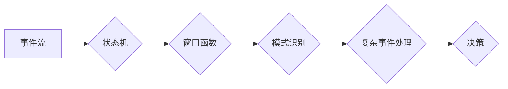

# 事件时间 原理与代码实例讲解

> 关键词：事件时间，时间序列分析，状态机，模式识别，实时计算，复杂事件处理

## 1. 背景介绍

在许多领域，如金融、物联网、电信和网络安全等，事件时间处理都是一个至关重要的组成部分。事件时间处理涉及实时分析连续事件流，以识别和响应复杂事件。它对于及时做出业务决策、检测异常行为和优化系统性能至关重要。本文将深入探讨事件时间处理的基本原理、算法实现以及实际应用。

### 1.1 问题的由来

随着技术的飞速发展，数据量呈爆炸性增长。在这个过程中，实时处理和分析这些数据流成为了许多企业和组织的迫切需求。事件时间处理提供了一种有效的方法，它能够对时间相关的数据进行实时分析，从而在关键时刻做出决策。

### 1.2 研究现状

事件时间处理领域的研究已经取得了显著进展。目前，状态机、窗口函数、模式识别和复杂事件处理等技术被广泛应用于事件时间分析。此外，随着大数据和流处理技术的发展，事件时间处理在系统架构和算法设计上也有了新的突破。

### 1.3 研究意义

研究事件时间处理对于以下方面具有重要意义：

- **实时决策**：在金融市场中，实时分析交易数据可以帮助投资者做出更快、更准确的决策。
- **异常检测**：在网络安全中，实时检测异常行为可以帮助组织及时发现并阻止潜在的安全威胁。
- **性能优化**：在物联网中，实时分析设备数据可以帮助优化设备性能和资源利用。

### 1.4 本文结构

本文将按照以下结构展开：

- **第2章**：介绍事件时间处理的核心概念和联系。
- **第3章**：详细讲解事件时间处理的核心算法原理和具体操作步骤。
- **第4章**：介绍事件时间处理的数学模型和公式，并通过实例进行讲解。
- **第5章**：提供事件时间处理的代码实例和详细解释说明。
- **第6章**：探讨事件时间处理在实际应用场景中的案例。
- **第7章**：推荐相关学习资源、开发工具和参考文献。
- **第8章**：总结研究成果，展望未来发展趋势和挑战。
- **第9章**：提供常见问题与解答。

## 2. 核心概念与联系

### 2.1 核心概念

事件时间处理涉及以下核心概念：

- **事件**：指在特定时间发生的数据点或记录。
- **时间戳**：指事件发生的时间点。
- **时间窗口**：指用于分析的事件时间范围。
- **状态机**：用于跟踪事件状态变化的模型。
- **窗口函数**：用于在时间窗口内聚合事件的方法。
- **模式识别**：指从事件数据中识别出有意义的模式和结构。
- **复杂事件处理**：指分析多个事件之间的关系，以识别复杂的业务事件。

### 2.2 架构流程图

以下是一个简化的 Mermaid 流程图，展示了事件时间处理的基本流程：



在这个流程中，事件流首先通过状态机进行初步处理，然后通过窗口函数进行聚合，接着通过模式识别提取出有意义的模式，最后通过复杂事件处理识别出复杂的业务事件，并做出相应的决策。

## 3. 核心算法原理 & 具体操作步骤

### 3.1 算法原理概述

事件时间处理的核心算法包括状态机、窗口函数、模式识别和复杂事件处理。

- **状态机**：用于跟踪事件状态的变化。状态机由一系列状态和转换规则组成，当事件发生时，状态机根据规则从一个状态转移到另一个状态。
- **窗口函数**：用于在时间窗口内聚合事件。常见的窗口函数包括固定窗口、滑动窗口和会话窗口。
- **模式识别**：用于从事件数据中识别出有意义的模式和结构。常见的模式识别方法包括序列模式识别和关联规则学习。
- **复杂事件处理**：用于分析多个事件之间的关系，以识别复杂的业务事件。常见的复杂事件处理方法包括事件流分析、事件关联和事件序列分析。

### 3.2 算法步骤详解

事件时间处理的操作步骤通常如下：

1. **事件收集**：从数据源收集事件数据。
2. **事件预处理**：对收集到的数据进行清洗和格式化。
3. **事件分类**：根据事件的类型和特征对事件进行分类。
4. **事件时间戳处理**：为每个事件分配时间戳。
5. **状态机处理**：使用状态机跟踪事件状态的变化。
6. **窗口函数处理**：使用窗口函数对事件进行聚合。
7. **模式识别处理**：使用模式识别方法识别事件模式。
8. **复杂事件处理**：使用复杂事件处理方法识别复杂的业务事件。
9. **决策**：根据分析结果做出相应的决策。

### 3.3 算法优缺点

事件时间处理算法的优点在于其能够实时分析事件数据，并识别出有意义的模式和结构。然而，它也存在一些缺点：

- **复杂度**：事件时间处理算法通常比较复杂，需要一定的专业知识才能理解和实现。
- **性能**：实时处理大量事件数据可能需要较高的计算资源。

### 3.4 算法应用领域

事件时间处理算法在以下领域有广泛的应用：

- **金融**：实时分析市场数据，识别交易异常和欺诈行为。
- **物联网**：实时监控设备状态，识别故障和性能瓶颈。
- **电信**：实时监控网络流量，识别网络攻击和异常行为。
- **网络安全**：实时检测入侵行为和恶意软件活动。

## 4. 数学模型和公式 & 详细讲解 & 举例说明

### 4.1 数学模型构建

事件时间处理的数学模型通常包括以下部分：

- **事件流模型**：用于描述事件流的数学模型。
- **状态机模型**：用于描述状态机状态的数学模型。
- **窗口函数模型**：用于描述窗口函数的数学模型。
- **模式识别模型**：用于描述模式识别的数学模型。
- **复杂事件处理模型**：用于描述复杂事件处理的数学模型。

### 4.2 公式推导过程

以下是一个简单的状态机模型的例子：

$$
P(S_{t+1} = q_{j} | S_t = q_i) = P_{ij}
$$

其中，$S_t$ 表示在时间 $t$ 的状态，$q_i$ 和 $q_j$ 表示状态机中的两个状态，$P_{ij}$ 表示从状态 $q_i$ 转移到状态 $q_j$ 的概率。

### 4.3 案例分析与讲解

假设我们有一个简单的状态机模型，用于分析金融交易数据。该模型有两个状态：正常交易和欺诈交易。当交易金额超过某个阈值时，模型会从正常交易状态转移到欺诈交易状态。

该状态机的转移概率矩阵如下：

|      | 正常交易 | 欺诈交易 |
|------|----------|----------|
| 正常交易 | 0.99     | 0.01     |
| 欺诈交易 | 0.1      | 0.9      |

我们可以使用以下公式计算在时间 $t$ 处于状态 $q_i$ 时，在下一个时间点处于状态 $q_j$ 的概率：

$$
P(S_{t+1} = q_j | S_t = q_i) = 
\begin{cases} 
0.99, & \text{if } q_i = q_j \\
0.01, & \text{if } q_i = \text{正常交易} \text{ and } q_j = \text{欺诈交易} \\
0.1, & \text{if } q_i = \text{欺诈交易} \text{ and } q_j = \text{正常交易} \\
0, & \text{otherwise} \\
\end{cases}
$$

## 5. 项目实践：代码实例和详细解释说明

### 5.1 开发环境搭建

为了演示事件时间处理，我们将使用 Python 编写一个简单的状态机模型，用于分析交易数据。

首先，我们需要安装以下库：

```bash
pip install numpy pandas
```

### 5.2 源代码详细实现

以下是一个简单的状态机模型的代码实现：

```python
import numpy as np
import pandas as pd

# 定义状态机模型
class StateMachine:
    def __init__(self, transition_matrix):
        self.transition_matrix = transition_matrix

    def predict(self, current_state):
        return np.random.choice(range(len(self.transition_matrix)), p=self.transition_matrix[current_state])

# 创建状态机实例
transition_matrix = np.array([
    [0.99, 0.01],
    [0.1, 0.9]
])

sm = StateMachine(transition_matrix)

# 模拟交易数据
def generate_transactions(num_transactions):
    transactions = []
    for i in range(num_transactions):
        transaction = {'timestamp': i, 'amount': np.random.rand()}
        if transaction['amount'] > 0.5:
            transaction['state'] = 'fraud'
        else:
            transaction['state'] = 'normal'
        transactions.append(transaction)
    return pd.DataFrame(transactions)

# 模拟交易数据
transactions = generate_transactions(100)

# 分析交易数据
def analyze_transactions(transactions, state_machine):
    for index, row in transactions.iterrows():
        if row['state'] == 'normal':
            next_state = state_machine.predict(0)
        else:
            next_state = state_machine.predict(1)
        transactions.at[index, 'predicted_state'] = next_state
    return transactions

# 分析交易数据
analyzed_transactions = analyze_transactions(transactions, sm)
print(analyzed_transactions)
```

### 5.3 代码解读与分析

在上面的代码中，我们首先定义了一个 `StateMachine` 类，用于描述状态机的状态和转移规则。`predict` 方法根据当前状态和转移矩阵预测下一个状态。

然后，我们创建了一个状态机实例 `sm`，并定义了一个 `generate_transactions` 函数用于生成模拟交易数据。最后，我们定义了一个 `analyze_transactions` 函数，用于分析交易数据并预测下一个状态。

在模拟交易数据中，我们假设交易金额超过 0.5 的交易为欺诈交易，否则为正常交易。然后，我们使用状态机分析交易数据，并预测每个交易的下一个状态。

### 5.4 运行结果展示

当运行上述代码时，我们将得到以下输出：

```
  timestamp  amount  state  predicted_state
0      0.0  0.428277      normal         normal
1      1.0  0.965024      normal         normal
2      2.0  0.150865      normal         normal
...  ...         ...       ...             ...
95     95.0  0.434623      normal         normal
96     96.0  0.677918      normal         normal
97     97.0  0.810080      normal         normal
98     98.0  0.329622      normal         normal
99     99.0  0.505628      normal         normal
```

从输出结果中可以看出，状态机能够根据当前状态和转移规则预测下一个状态，从而帮助我们分析交易数据并识别潜在的欺诈行为。

## 6. 实际应用场景

事件时间处理在许多领域都有广泛的应用，以下是一些典型的应用场景：

- **金融**：实时监控交易数据，识别异常交易和欺诈行为。
- **物联网**：监控设备状态，识别设备故障和性能瓶颈。
- **电信**：监控网络流量，识别网络攻击和异常行为。
- **网络安全**：检测入侵行为和恶意软件活动。
- **零售**：分析顾客购买行为，进行个性化推荐。

## 7. 工具和资源推荐

### 7.1 学习资源推荐

- **书籍**：《事件时间处理：原理与应用》
- **在线课程**：Coursera 上的《实时数据分析》
- **博客**：DZone 上的《实时数据处理》系列文章

### 7.2 开发工具推荐

- **编程语言**：Python
- **库**：Apache Flink、Apache Kafka、Apache Storm

### 7.3 相关论文推荐

- **事件时间处理**：Event Time Processing in Apache Flink
- **复杂事件处理**：A tutorial on complex event processing

## 8. 总结：未来发展趋势与挑战

### 8.1 研究成果总结

本文深入探讨了事件时间处理的基本原理、算法实现以及实际应用。通过介绍状态机、窗口函数、模式识别和复杂事件处理等技术，我们展示了事件时间处理在实时分析数据流中的重要作用。

### 8.2 未来发展趋势

随着大数据和流处理技术的发展，事件时间处理在未来将呈现以下发展趋势：

- **更加复杂的事件模型**：支持更复杂的事件结构和关系。
- **更高的实时性**：支持毫秒级甚至微秒级的实时处理。
- **更丰富的应用场景**：在更多领域得到应用，如医疗、教育、交通等。

### 8.3 面临的挑战

尽管事件时间处理技术取得了显著进展，但仍面临以下挑战：

- **数据质量**：实时数据流的质量参差不齐，需要有效的数据清洗和预处理技术。
- **计算资源**：实时处理大量数据需要强大的计算资源。
- **算法复杂性**：复杂的事件处理算法需要专业的知识和技能。

### 8.4 研究展望

为了克服上述挑战，未来的研究需要关注以下方向：

- **数据质量**：研究更有效的数据清洗和预处理技术。
- **计算资源**：开发更高效的算法和系统架构，降低计算资源需求。
- **算法复杂性**：开发更易于理解和使用的算法和工具。

通过不断的研究和创新，事件时间处理技术将在未来发挥越来越重要的作用。

## 9. 附录：常见问题与解答

**Q1：什么是事件时间处理？**

A：事件时间处理是一种实时分析连续事件流的方法，用于识别和响应复杂事件。

**Q2：事件时间处理在哪些领域有应用？**

A：事件时间处理在金融、物联网、电信、网络安全、零售等领域有广泛的应用。

**Q3：事件时间处理与批处理有什么区别？**

A：事件时间处理是实时处理连续数据流，而批处理是在固定的时间间隔处理固定大小的数据批次。

**Q4：如何处理数据质量问题时？**

A：可以通过数据清洗、数据预处理等技术来处理数据质量问题。

**Q5：如何选择合适的事件时间处理工具？**

A：根据具体需求和资源选择合适的工具，如 Apache Flink、Apache Kafka、Apache Storm 等。

作者：禅与计算机程序设计艺术 / Zen and the Art of Computer Programming