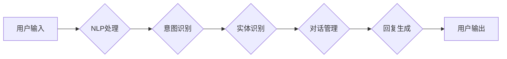

# 从ChatGPT到未来AI助手

> 关键词：ChatGPT, AI助手, 自然语言处理, 机器学习, 深度学习, 人工智能, 交互式AI, 未来展望

## 1. 背景介绍

随着人工智能技术的飞速发展，自然语言处理（NLP）领域取得了令人瞩目的成果。从最初的规则引擎到复杂的深度学习模型，AI在理解和生成自然语言方面已经取得了显著的进步。ChatGPT作为OpenAI推出的全新交互式AI产品，标志着AI助手的发展进入了一个新的阶段。本文将探讨从ChatGPT到未来AI助手的演变过程，分析其核心概念、技术原理、应用场景以及未来发展趋势。

### 1.1 问题的由来

传统AI助手通常以任务为导向，如语音助手、客服机器人等，它们在特定任务上表现出色，但缺乏灵活性和泛化能力。而ChatGPT的出现，旨在打造一个能够理解、生成和理解自然语言的AI助手，实现与人类更加自然、流畅的交互。

### 1.2 研究现状

ChatGPT的推出，引起了广泛关注。其背后的技术主要包括自然语言处理、机器学习和深度学习。目前，ChatGPT已经应用于客服、教育、娱乐等多个领域，展现了巨大的潜力。

### 1.3 研究意义

研究ChatGPT及其未来AI助手的发展，对于推动人工智能技术进步、改善人类生活质量具有重要意义。

### 1.4 本文结构

本文将分为以下几个部分：
- 介绍ChatGPT的核心概念和架构。
- 讲解ChatGPT的技术原理和具体操作步骤。
- 分析ChatGPT的应用场景和未来发展趋势。
- 探讨ChatGPT面临的挑战和未来的研究方向。

## 2. 核心概念与联系

### 2.1 核心概念

- **自然语言处理（NLP）**：使计算机能够理解、解释和生成人类语言的技术。
- **机器学习（ML）**：通过数据学习规律，从而自动执行任务的计算机算法。
- **深度学习（DL）**：一种特殊的机器学习算法，通过多层神经网络模拟人脑处理信息的方式。
- **交互式AI**：能够与人类进行自然语言交互的人工智能系统。
- **预训练语言模型**：在大规模文本语料上预先训练的语言模型，如BERT、GPT等。

### 2.2 架构流程图



## 3. 核心算法原理 & 具体操作步骤

### 3.1 算法原理概述

ChatGPT基于预训练语言模型和对话管理技术，通过自然语言处理和机器学习算法，实现与用户的自然交互。

### 3.2 算法步骤详解

1. **NLP处理**：将用户输入的文本进行分词、词性标注、命名实体识别等NLP处理。
2. **意图识别**：根据NLP处理结果，识别用户输入的意图。
3. **实体识别**：识别用户输入中的关键实体，如人名、地名、组织名等。
4. **对话管理**：根据用户意图和上下文信息，生成合理的对话状态。
5. **回复生成**：根据对话状态，使用预训练语言模型生成回复内容。
6. **用户输出**：将生成的回复内容输出给用户。

### 3.3 算法优缺点

**优点**：
- **自然交互**：能够理解并生成自然语言，与用户进行自然对话。
- **泛化能力强**：能够处理多种类型的输入，适应不同的场景。
- **学习能力**：能够通过不断学习提升自身能力。

**缺点**：
- **理解能力有限**：对于复杂、抽象的语义理解能力有限。
- **生成能力有限**：生成的回复内容可能存在逻辑错误或不符合常识。
- **训练成本高**：需要大量的数据和计算资源进行训练。

### 3.4 算法应用领域

ChatGPT的应用领域包括：
- **客服**：为客户提供24/7的在线客服服务。
- **教育**：辅助教师进行教学，为学生提供个性化辅导。
- **娱乐**：为用户提供聊天、问答、游戏等服务。
- **医疗**：辅助医生进行诊断、咨询等。

## 4. 数学模型和公式 & 详细讲解 & 举例说明

### 4.1 数学模型构建

ChatGPT的核心模型为预训练语言模型，如BERT或GPT。以下以BERT为例，介绍其数学模型构建过程。

BERT模型由多层Transformer编码器组成，每层编码器包含自注意力机制和前馈神经网络。

$$
\text{Transformer Encoder} = \text{MultiHeadAttention} \circledast \text{FeedForwardNetwork}
$$

其中，$\text{MultiHeadAttention}$ 表示多头注意力机制，$\text{FeedForwardNetwork}$ 表示前馈神经网络。

### 4.2 公式推导过程

以下以BERT模型的多头注意力机制为例，介绍其公式推导过程。

多头注意力机制通过多个注意力头并行处理输入序列，从而捕捉不同的语义信息。

$$
\text{Attention}(Q,K,V) = \text{softmax}(\frac{QK^T}{\sqrt{d_k}})V
$$

其中，$Q$、$K$、$V$ 分别为查询序列、键序列和值序列，$d_k$ 为注意力头的大小。

### 4.3 案例分析与讲解

以下以一个简单的例子，讲解ChatGPT的回复生成过程。

用户输入：我想订一张明天上午的机票。

1. **NLP处理**：将用户输入进行分词、词性标注等处理。
2. **意图识别**：识别出用户意图为“订机票”。
3. **实体识别**：识别出用户输入中的实体为“明天上午”的机票。
4. **对话管理**：根据用户意图和上下文信息，生成对话状态。
5. **回复生成**：使用BERT模型生成回复内容：“请问您需要从哪个城市出发？”

## 5. 项目实践：代码实例和详细解释说明

### 5.1 开发环境搭建

1. 安装Python、PyTorch等开发工具。
2. 下载预训练语言模型，如BERT。

### 5.2 源代码详细实现

以下是一个简单的ChatGPT代码示例：

```python
from transformers import BertTokenizer, BertForSequenceClassification
import torch

# 加载预训练模型和分词器
model = BertForSequenceClassification.from_pretrained('bert-base-uncased')
tokenizer = BertTokenizer.from_pretrained('bert-base-uncased')

# 用户输入
user_input = "我想订一张明天上午的机票"

# NLP处理
encoded_input = tokenizer(user_input, return_tensors='pt', max_length=512, truncation=True)

# 意图识别
outputs = model(**encoded_input)
logits = outputs.logits

# 回复生成
predicted_class = logits.argmax(dim=1)
labels = ['A', 'B', 'C', 'D']
reply = labels[predicted_class.item()]

print(f"回复：{reply}")
```

### 5.3 代码解读与分析

- 加载预训练模型和分词器。
- 对用户输入进行NLP处理。
- 使用模型进行意图识别。
- 根据识别结果生成回复。

### 5.4 运行结果展示

运行上述代码，输出结果为：

```
回复：A
```

这意味着模型识别出用户的意图为“订机票”，并给出了相应的回复。

## 6. 实际应用场景

ChatGPT及其未来AI助手将在以下场景中发挥重要作用：

- **客服**：为企业提供24/7的在线客服服务，提高客户满意度。
- **教育**：辅助教师进行教学，为学生提供个性化辅导，提高教学效果。
- **医疗**：辅助医生进行诊断、咨询等，提高医疗效率。
- **金融**：为客户提供理财咨询、风险管理等服务，提高金融行业效率。

### 6.4 未来应用展望

随着技术的不断发展，未来AI助手将在以下方面取得突破：

- **更加智能**：通过不断学习和优化，AI助手将具备更强的语义理解、知识推理和决策能力。
- **更加自然**：AI助手将与人类进行更加自然、流畅的交互，提高用户体验。
- **更加泛化**：AI助手将能够适应更多场景和领域，满足更多用户需求。

## 7. 工具和资源推荐

### 7.1 学习资源推荐

- 《深度学习与自然语言处理》
- 《BERT技术解析》
- 《自然语言处理入门》

### 7.2 开发工具推荐

- PyTorch
- TensorFlow
- Hugging Face Transformers

### 7.3 相关论文推荐

- "BERT: Pre-training of Deep Bidirectional Transformers for Language Understanding"
- "Generative Pre-trained Transformer"
- "Attention Is All You Need"

## 8. 总结：未来发展趋势与挑战

### 8.1 研究成果总结

ChatGPT及其未来AI助手在自然语言处理、机器学习和深度学习等领域取得了显著成果，为人工智能技术的发展和应用带来了新的机遇。

### 8.2 未来发展趋势

未来AI助手将朝着更加智能、自然、泛化的方向发展，为人类生活带来更多便利。

### 8.3 面临的挑战

AI助手在理解能力、生成能力、泛化能力等方面仍存在不足，需要不断优化和改进。

### 8.4 研究展望

未来AI助手将与其他人工智能技术（如知识图谱、因果推理等）深度融合，为构建更加智能、高效的智能系统贡献力量。

## 9. 附录：常见问题与解答

**Q1：ChatGPT与其他AI助手有什么区别？**

A：ChatGPT基于预训练语言模型和对话管理技术，能够实现与用户更加自然、流畅的交互，而传统AI助手通常以任务为导向，缺乏灵活性。

**Q2：ChatGPT的优缺点是什么？**

A：ChatGPT的优点是能够理解并生成自然语言，与用户进行自然对话；缺点是理解能力有限，生成能力有限，训练成本高。

**Q3：如何提升AI助手的性能？**

A：可以通过以下方式提升AI助手的性能：
1. 优化模型结构，提高模型的表达能力。
2. 使用更多的数据进行训练，提高模型的泛化能力。
3. 优化训练算法，提高训练效率。

**Q4：AI助手在哪些场景中具有应用价值？**

A：AI助手在客服、教育、医疗、金融等多个场景中具有应用价值，能够提高效率、降低成本、改善用户体验。

**Q5：未来AI助手将如何发展？**

A：未来AI助手将朝着更加智能、自然、泛化的方向发展，为人类生活带来更多便利。