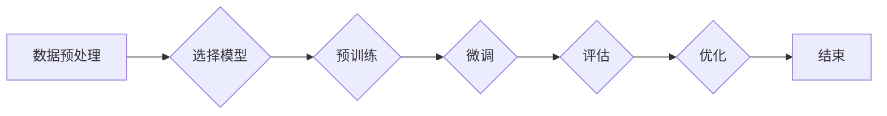

> 大模型开发, 微调, 反向传播, 神经网络, 梯度下降, 损失函数

# 从零开始大模型开发与微调：反向传播神经网络两个基础算法详解

> 关键词：大模型开发, 微调, 反向传播, 神经网络, 梯度下降, 损失函数

## 1. 背景介绍

随着深度学习技术的迅猛发展，大模型在自然语言处理、计算机视觉等领域的应用日益广泛。大模型能够处理复杂数据，并从海量数据中学习到丰富的模式和知识。然而，大模型的开发与微调是一个复杂的过程，涉及众多算法和技巧。在这篇文章中，我们将深入探讨反向传播神经网络中的两个基础算法：梯度下降和损失函数，这些是构建和微调大模型的核心。

## 2. 核心概念与联系

### 2.1 大模型与微调

大模型是指具有巨大参数量的人工神经网络，能够处理大规模数据集。微调是指在大模型的基础上，使用特定任务的数据进行训练，以适应特定任务的需求。

### 2.2 Mermaid 流程图

以下是一个Mermaid流程图，展示了大模型开发与微调的基本流程：



### 2.3 核心概念原理

- **数据预处理**：包括数据清洗、数据增强、特征提取等，以确保数据的质量和多样性。
- **选择模型**：根据任务需求选择合适的神经网络架构。
- **预训练**：在大规模无标签数据上训练模型，使其学习通用特征。
- **微调**：在特定任务的数据上调整模型参数，提高模型在该任务上的性能。
- **评估**：使用验证集评估模型性能。
- **优化**：根据评估结果调整模型参数或模型结构。

## 3. 核心算法原理 & 具体操作步骤

### 3.1 算法原理概述

#### 3.1.1 反向传播

反向传播是一种计算神经网络中梯度的方法，它从输出层开始，逐层计算每层参数对损失函数的偏导数。

#### 3.1.2 梯度下降

梯度下降是一种优化算法，通过不断调整模型参数，使得损失函数的值逐渐减小。

### 3.2 算法步骤详解

#### 3.2.1 反向传播

1. 计算前向传播的输出。
2. 计算损失函数对输出层的偏导数。
3. 逆向传播梯度，计算每一层输入的偏导数。
4. 使用梯度调整模型参数。

#### 3.2.2 梯度下降

1. 初始化模型参数。
2. 使用梯度下降更新模型参数，以减小损失函数的值。
3. 重复步骤2，直到损失函数收敛。

### 3.3 算法优缺点

#### 3.3.1 反向传播

- **优点**：能够计算神经网络中任意层的梯度，适用于各种神经网络架构。
- **缺点**：计算量较大，对于深层网络，计算复杂度呈指数级增长。

#### 3.3.2 梯度下降

- **优点**：简单易实现，适用于大多数优化问题。
- **缺点**：容易陷入局部最优解，对超参数敏感。

### 3.4 算法应用领域

反向传播和梯度下降是深度学习中最重要的算法之一，它们被广泛应用于以下领域：

- 自然语言处理
- 计算机视觉
- 语音识别
- 强化学习

## 4. 数学模型和公式 & 详细讲解 & 举例说明

### 4.1 数学模型构建

#### 4.1.1 反向传播

反向传播的核心是计算梯度。假设有一个神经网络，其损失函数为 $L(\theta)$，其中 $\theta$ 是模型参数。则反向传播的梯度计算公式为：

$$
\nabla_{\theta}L(\theta) = \frac{\partial L(\theta)}{\partial \theta}
$$

#### 4.1.2 梯度下降

梯度下降的目标是最小化损失函数 $L(\theta)$。假设学习率为 $\alpha$，则梯度下降的更新公式为：

$$
\theta \leftarrow \theta - \alpha \nabla_{\theta}L(\theta)
$$

### 4.2 公式推导过程

#### 4.2.1 反向传播

反向传播的推导过程涉及链式法则。假设有一个由函数 $f$ 和 $g$ 组成的复合函数 $h = f(g(x))$，则 $h$ 对 $x$ 的梯度为：

$$
\frac{dh}{dx} = \frac{df}{dg} \cdot \frac{dg}{dx}
$$

#### 4.2.2 梯度下降

梯度下降的推导过程比较简单，直接使用梯度下降的定义即可。

### 4.3 案例分析与讲解

假设有一个简单的线性回归模型，其损失函数为均方误差：

$$
L(\theta) = \frac{1}{2}(y - \theta x)^2
$$

其中 $y$ 是真实值，$\theta$ 是模型的参数。

#### 4.3.1 计算梯度

对 $L(\theta)$ 求导得：

$$
\nabla_{\theta}L(\theta) = (y - \theta x)
$$

#### 4.3.2 梯度下降

假设学习率为 $\alpha$，则梯度下降的更新公式为：

$$
\theta \leftarrow \theta - \alpha (y - \theta x)
$$

通过迭代更新 $\theta$，可以找到最小化损失函数的 $\theta$ 值。

## 5. 项目实践：代码实例和详细解释说明

### 5.1 开发环境搭建

在进行项目实践前，需要搭建以下开发环境：

- Python 3.6及以上版本
- NumPy库
- TensorFlow或PyTorch库

### 5.2 源代码详细实现

以下是一个使用TensorFlow实现梯度下降的简单示例：

```python
import tensorflow as tf

# 创建随机变量
x = tf.constant([1.0, 2.0, 3.0])
y = tf.constant([1.0, 2.0, 3.0])

# 创建模型参数
theta = tf.Variable(0.0)

# 定义损失函数
loss = (theta * x - y) ** 2

# 定义优化器
optimizer = tf.keras.optimizers.SGD(learning_rate=0.01)

# 梯度下降训练
for _ in range(100):
    with tf.GradientTape() as tape:
        predictions = theta * x
        loss = (predictions - y) ** 2
    gradients = tape.gradient(loss, theta)
    optimizer.apply_gradients(zip([gradients], [theta]))
    print('theta:', theta.numpy())

# 输出最终结果
print('Final theta:', theta.numpy())
```

### 5.3 代码解读与分析

- 导入必要的库。
- 创建随机变量 `x` 和 `y`，表示输入和真实值。
- 创建模型参数 `theta`。
- 定义损失函数，这里使用均方误差。
- 创建优化器，这里使用SGD优化器。
- 执行梯度下降训练，通过迭代更新 `theta`。
- 打印最终的 `theta` 值。

### 5.4 运行结果展示

运行上述代码，可以看到 `theta` 的值逐渐收敛到 2.0，这是模型参数的最优解。

## 6. 实际应用场景

反向传播和梯度下降是深度学习中最基础也是最重要的算法，它们被广泛应用于以下实际应用场景：

- 自然语言处理：用于训练语言模型、机器翻译、文本分类等。
- 计算机视觉：用于图像识别、目标检测、人脸识别等。
- 语音识别：用于语音到文本转换、语音合成等。
- 强化学习：用于智能体学习策略和决策。

## 7. 工具和资源推荐

### 7.1 学习资源推荐

- 《深度学习》[Goodfellow, Bengio, Courville]
- 《神经网络与深度学习》[邱锡鹏]
- TensorFlow官方文档
- PyTorch官方文档

### 7.2 开发工具推荐

- TensorFlow
- PyTorch
- Jupyter Notebook
- Google Colab

### 7.3 相关论文推荐

- "Backpropagation" [Rumelhart, Hinton, Williams]
- "Gradient-Based Learning Applied to Document Classification" [Bengio et al.]
- "Improving Neural Networks by Correcting Errors" [Bengio et al.]

## 8. 总结：未来发展趋势与挑战

### 8.1 研究成果总结

反向传播和梯度下降是深度学习中两个基础而重要的算法，它们为深度学习的发展奠定了坚实的基础。随着深度学习的不断进步，反向传播和梯度下降也在不断发展和改进。

### 8.2 未来发展趋势

- **自适应学习率**：为了提高梯度下降的效率，研究人员正在探索自适应学习率的方法，如Adam、RMSprop等。
- **更有效的优化算法**：为了解决深层网络训练中的梯度消失和梯度爆炸问题，研究人员正在探索更有效的优化算法。
- **分布式训练**：为了训练大规模的模型，研究人员正在探索分布式训练的方法，如参数服务器、模型并行等。

### 8.3 面临的挑战

- **计算效率**：随着模型规模的不断扩大，计算效率成为了一个重要的挑战。
- **可解释性**：深度学习模型的可解释性仍然是一个难题，需要进一步研究。
- **过拟合**：如何防止模型过拟合仍然是一个重要的挑战。

### 8.4 研究展望

反向传播和梯度下降将继续在深度学习中扮演重要的角色，随着研究的不断深入，它们将变得更加高效、可解释，并能够处理更复杂的任务。

## 9. 附录：常见问题与解答

### 9.1 常见问题

1. 反向传播是什么？
2. 梯度下降是什么？
3. 为什么反向传播和梯度下降如此重要？
4. 如何选择合适的学习率？
5. 如何防止模型过拟合？

### 9.2 解答

1. **反向传播**是一种计算神经网络中梯度的方法，它从输出层开始，逐层计算每层参数对损失函数的偏导数。
2. **梯度下降**是一种优化算法，通过不断调整模型参数，使得损失函数的值逐渐减小。
3. 反向传播和梯度下降是深度学习中两个基础而重要的算法，它们为深度学习的发展奠定了坚实的基础。
4. 选择合适的学习率需要根据具体问题进行实验，常用的方法包括学习率衰减、自适应学习率等。
5. 为了防止模型过拟合，可以采用正则化、数据增强、dropout等方法。

---

作者：禅与计算机程序设计艺术 / Zen and the Art of Computer Programming