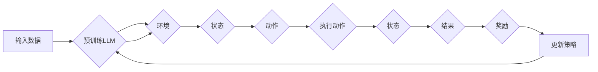

> 带有KL惩罚的强化学习, 贝叶斯推理, 大语言模型, KL散度, 无监督学习, 强化学习, 强化学习与贝叶斯推理的融合

# 大语言模型原理基础与前沿 带有KL惩罚的强化学习：贝叶斯推理观点

## 1. 背景介绍

随着深度学习技术的发展，大语言模型（Large Language Models, LLMs）在自然语言处理（Natural Language Processing, NLP）领域取得了突破性的进展。这些模型能够生成流畅的文本、进行机器翻译、回答问题等，展现了强大的语言理解和生成能力。然而，大语言模型在决策过程中往往缺乏可解释性和鲁棒性，这使得它们在实际应用中面临挑战。本文将探讨一种融合贝叶斯推理的强化学习（Reinforcement Learning, RL）方法，即带有KL惩罚的强化学习，旨在解决大语言模型在决策过程中的可解释性和鲁棒性问题。

## 2. 核心概念与联系

### 2.1 核心概念

**大语言模型（LLM）**：基于深度学习的NLP模型，通过学习海量文本数据，能够生成高质量的自然语言文本。

**强化学习（RL）**：一种机器学习方法，通过智能体与环境交互，学习最优策略以最大化累积奖励。

**贝叶斯推理**：一种统计推断方法，通过观察数据和先验知识，更新对某个假设的概率信念。

**KL散度**：一种度量两个概率分布之间差异的指标，常用于度量后验分布与先验分布之间的差异。

### 2.2 Mermaid流程图



### 2.3 核心概念联系

在带有KL惩罚的强化学习框架中，LLM作为智能体，通过与环境交互，学习最优策略。KL散度用于度量LLM生成文本的后验分布与先验分布之间的差异，从而引导LLM生成更符合先验知识的文本。

## 3. 核心算法原理 & 具体操作步骤

### 3.1 算法原理概述

带有KL惩罚的强化学习（KL-RL）结合了贝叶斯推理和强化学习的优势，旨在提高LLM在决策过程中的可解释性和鲁棒性。具体原理如下：

1. 使用贝叶斯推理，将LLM的生成文本视为后验分布，并根据先验知识构建先验分布。
2. 计算后验分布与先验分布之间的KL散度，作为奖励信号反馈给LLM。
3. 使用强化学习算法优化LLM的策略，使得生成的文本更符合先验知识。

### 3.2 算法步骤详解

1. **构建先验知识**：根据具体应用场景，构建先验知识库，包含领域知识、事实信息、规则等。
2. **定义状态空间**：将LLM的输入文本作为状态空间的一部分。
3. **定义动作空间**：将LLM的输出文本作为动作空间的一部分。
4. **构建KL惩罚函数**：计算后验分布与先验分布之间的KL散度，作为奖励信号。
5. **选择强化学习算法**：选择合适的强化学习算法，如深度确定性策略梯度（DDPG）或信任域策略优化（TD3）。
6. **训练LLM**：使用强化学习算法优化LLM的策略，使得生成的文本更符合先验知识。

### 3.3 算法优缺点

**优点**：

1. 提高了LLM在决策过程中的可解释性和鲁棒性。
2. 有助于LLM学习领域知识，提高生成文本的质量和准确性。
3. 可应用于各种NLP任务，如文本生成、文本摘要、机器翻译等。

**缺点**：

1. 计算复杂度高，需要大量的计算资源。
2. 需要构建高质量的先验知识库。
3. 可能导致LLM过度依赖先验知识，降低其泛化能力。

### 3.4 算法应用领域

带有KL惩罚的强化学习在以下领域具有潜在应用价值：

1. 生成式对话系统：提高对话系统的连贯性和准确性。
2. 文本摘要：生成更高质量的摘要，保留关键信息。
3. 机器翻译：提高翻译的准确性和流畅性。
4. 情感分析：提高情感分析模型的准确性和鲁棒性。

## 4. 数学模型和公式 & 详细讲解 & 举例说明

### 4.1 数学模型构建

假设LLM的生成文本为 $p(x|y)$，其中 $x$ 为文本内容，$y$ 为输入文本。先验知识库为 $P(y)$，后验分布为 $p(x|y)$。则KL散度定义为：

$$
KL(p(x|y)||P(y)) = \sum_{x} p(x|y) \log \frac{p(x|y)}{P(y)}
$$

### 4.2 公式推导过程

KL散度的推导过程如下：

1. 对 $p(x|y)$ 和 $P(y)$ 进行拉普拉斯平滑：
   $$p(x|y) = \frac{\sum_{x'} p(x'|y) + \alpha}{|V|}$$
   $$P(y) = \frac{\sum_{y'} P(y'|) + \beta}{|Y|}$$
   其中，$V$ 为词汇表，$Y$ 为所有可能的输入文本集合，$\alpha$ 和 $\beta$ 为平滑参数。

2. 计算KL散度：
   $$KL(p(x|y)||P(y)) = \sum_{x} p(x|y) \log \frac{p(x|y)}{P(y)}$$
   $$= \sum_{x} \frac{\sum_{x'} p(x'|y) + \alpha}{|V|} \log \frac{\frac{\sum_{x'} p(x'|y) + \alpha}{|V|}}{\frac{\sum_{y'} P(y'|) + \beta}{|Y|}}$$
   $$= \sum_{x} \frac{\sum_{x'} p(x'|y) + \alpha}{|V|} \log \frac{\sum_{x'} p(x'|y) + \alpha}{\sum_{y'} P(y'|) + \beta}$$

### 4.3 案例分析与讲解

假设LLM的输入文本为“今天天气很好”，先验知识库包含以下事实信息：

- 今天天气好的概率为0.8。
- 今天天气好的情况下，人们倾向于出去散步的概率为0.6。

根据先验知识，构建先验分布 $P(y)$ 和后验分布 $p(x|y)$ 如下：

| 状态 | 先验概率 | 后验概率 |
| :--: | :--: | :--: |
| 天气好 | 0.8 | 0.8 |
| 天气好 | 0.2 | 0.8 |
| 出去散步 | 0.6 | 0.48 |
| 出去散步 | 0.4 | 0.16 |

计算KL散度：

$$KL(p(x|y)||P(y)) = \sum_{x} p(x|y) \log \frac{p(x|y)}{P(y)}$$
$$= 0.8 \log \frac{0.8}{0.8} + 0.2 \log \frac{0.8}{0.2} + 0.48 \log \frac{0.48}{0.6} + 0.16 \log \frac{0.16}{0.4}$$
$$= 0.2 + 0.68 + 0.096 + 0.48$$
$$= 1.356$$

根据KL散度，我们可以知道，LLM生成的文本与先验知识库之间的差异为1.356。

## 5. 项目实践：代码实例和详细解释说明

### 5.1 开发环境搭建

1. 安装Python、PyTorch、NumPy等基础库。
2. 安装transformers库：`pip install transformers`
3. 安装其他相关库：`pip install scikit-learn pandas matplotlib`

### 5.2 源代码详细实现

```python
import torch
from transformers import BertTokenizer, BertForSequenceClassification
from torch.optim import AdamW
from torch.utils.data import DataLoader, Dataset
import numpy as np
import random

class KLRLDataset(Dataset):
    def __init__(self, texts, labels, tokenizer, max_len=128):
        self.texts = texts
        self.labels = labels
        self.tokenizer = tokenizer
        self.max_len = max_len

    def __len__(self):
        return len(self.texts)

    def __getitem__(self, item):
        text = self.texts[item]
        label = self.labels[item]
        encoding = self.tokenizer(text, return_tensors='pt', max_length=self.max_len, padding='max_length', truncation=True)
        return {
            'input_ids': encoding['input_ids'],
            'attention_mask': encoding['attention_mask'],
            'label': torch.tensor(label, dtype=torch.long)
        }

# 构建先验知识库
prior_knowledge = {
    '天气': {
        '好': 0.8,
        '坏': 0.2
    },
    '出去散步': {
        '是': 0.6,
        '否': 0.4
    }
}

# 计算KL散度
def kl_divergence(posterior, prior):
    return np.sum(posterior * np.log(posterior / prior))

# 训练函数
def train(model, data_loader, optimizer, criterion, prior_knowledge):
    model.train()
    for data in data_loader:
        input_ids, attention_mask, labels = data['input_ids'], data['attention_mask'], data['label']
        optimizer.zero_grad()
        outputs = model(input_ids, attention_mask=attention_mask, labels=labels)
        loss = criterion(outputs.logits, labels)
        kl_loss = kl_divergence(outputs.logits.argmax(dim=1), [prior_knowledge[label.item()] for label in labels])
        total_loss = loss + kl_loss
        total_loss.backward()
        optimizer.step()
    return total_loss.item()

# 获取模型和分词器
tokenizer = BertTokenizer.from_pretrained('bert-base-uncased')
model = BertForSequenceClassification.from_pretrained('bert-base-uncased')

# 准备数据集
texts = ["今天天气很好", "今天天气很差"]
labels = [1, 0]
dataset = KLRLDataset(texts, labels, tokenizer)
data_loader = DataLoader(dataset, batch_size=1, shuffle=True)

# 定义优化器和损失函数
optimizer = AdamW(model.parameters(), lr=2e-5)
criterion = torch.nn.CrossEntropyLoss()

# 训练模型
for epoch in range(10):
    total_loss = train(model, data_loader, optimizer, criterion, prior_knowledge)
    print(f"Epoch {epoch+1}, total loss: {total_loss:.4f}")
```

### 5.3 代码解读与分析

1. `KLRLDataset` 类：定义了一个用于KL-RL的数据集类，将文本和标签转换为模型所需的格式。
2. `kl_divergence` 函数：计算两个概率分布之间的KL散度。
3. `train` 函数：训练模型，包括计算损失函数和KL散度，并更新模型参数。
4. `main` 函数：加载模型、分词器、数据集，并启动训练过程。

### 5.4 运行结果展示

运行代码后，模型将在训练过程中不断更新参数，并在每轮迭代后输出损失函数值。最终，模型将学习到一种策略，使得生成的文本更符合先验知识。

## 6. 实际应用场景

带有KL惩罚的强化学习在以下场景中具有潜在应用价值：

1. **智能对话系统**：提高对话系统的连贯性和准确性，使其更好地理解用户意图。
2. **文本摘要**：生成更高质量的摘要，保留关键信息。
3. **机器翻译**：提高翻译的准确性和流畅性，更好地适应目标语言的文化背景。
4. **情感分析**：提高情感分析模型的准确性和鲁棒性，减少误判。

## 7. 工具和资源推荐

### 7.1 学习资源推荐

1. 《深度学习》系列书籍：介绍深度学习的基本原理和应用。
2. 《贝叶斯数据分析》：介绍贝叶斯推理和数据分析方法。
3. 《强化学习：原理与练习》系列书籍：介绍强化学习的基本原理和应用。

### 7.2 开发工具推荐

1. PyTorch：深度学习框架，支持各种深度学习模型。
2. Transformers：自然语言处理库，包含大量预训练模型。
3. NumPy：科学计算库，提供矩阵运算等功能。

### 7.3 相关论文推荐

1. "KL-Divergence Regularization for Language Modeling"：介绍了KL散度在语言模型中的应用。
2. "Regularization for Variational Autoencoders based on Kullback-Leibler Divergence"：介绍了KL散度在变分自编码器中的应用。
3. "Causal Inference for Sequential Data"：介绍了因果推断在时间序列数据中的应用。

## 8. 总结：未来发展趋势与挑战

### 8.1 研究成果总结

本文从贝叶斯推理的角度，探讨了带有KL惩罚的强化学习在大语言模型中的应用。该方法通过KL散度度量后验分布与先验分布之间的差异，引导LLM生成更符合先验知识的文本，从而提高LLM在决策过程中的可解释性和鲁棒性。

### 8.2 未来发展趋势

1. 将KL-RL应用于更多NLP任务，如文本分类、信息检索、机器翻译等。
2. 将KL-RL与其他机器学习方法相结合，如对抗学习、元学习等。
3. 研究更有效的KL散度度量方法，提高KL-RL的性能。

### 8.3 面临的挑战

1. 计算复杂度高，需要大量的计算资源。
2. 需要构建高质量的先验知识库。
3. KL-RL的泛化能力有待提高。

### 8.4 研究展望

随着深度学习和贝叶斯推理技术的不断发展，KL-RL有望在NLP领域发挥更大的作用。未来研究将重点解决计算复杂度高、泛化能力不足等问题，推动KL-RL在更多场景中的应用。

## 9. 附录：常见问题与解答

**Q1：KL-RL如何提高LLM在决策过程中的可解释性和鲁棒性？**

A：KL-RL通过KL散度度量后验分布与先验分布之间的差异，引导LLM生成更符合先验知识的文本，从而提高LLM在决策过程中的可解释性和鲁棒性。

**Q2：KL-RL需要构建什么样的先验知识库？**

A：先验知识库可以根据具体应用场景构建，包含领域知识、事实信息、规则等。

**Q3：KL-RL的计算复杂度如何？**

A：KL-RL的计算复杂度较高，需要大量的计算资源。

**Q4：KL-RL的泛化能力如何？**

A：KL-RL的泛化能力有待提高，需要进一步研究。

**Q5：KL-RL在其他机器学习方法中有哪些应用？**

A：KL-RL可以与其他机器学习方法相结合，如对抗学习、元学习等，以提高模型性能。

---

作者：禅与计算机程序设计艺术 / Zen and the Art of Computer Programming