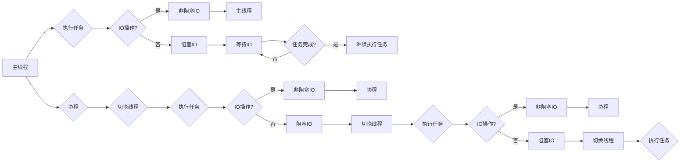

# 异步处理技术的实现与优化

> 关键词：异步编程，并发，多线程，事件驱动，非阻塞IO，协程，性能优化，并发模型

## 1. 背景介绍

随着互联网和云计算的快速发展，系统架构逐渐从单体应用向分布式、微服务架构演变。在这样的架构下，系统需要处理的海量并发请求对性能提出了更高的要求。传统的同步编程模型由于线程竞争、锁等待等问题，难以满足高并发场景的需求。因此，异步处理技术应运而生，它能够有效地提高系统的响应速度和吞吐量。

异步处理技术通过将耗时的IO操作和计算任务从主线程中分离出来，让主线程专注于处理其他任务，从而提升系统的并发性能。本文将深入探讨异步处理技术的实现原理、优化方法以及在实际应用中的实践。

## 2. 核心概念与联系

### 2.1 异步编程

异步编程是一种编程范式，允许程序在等待耗时的操作（如IO、网络请求等）完成时，执行其他任务。在异步编程中，程序不会阻塞主线程，而是使用回调函数、事件监听、Future对象等机制来处理异步操作的结果。

### 2.2 并发

并发是指同时处理多个任务的能力。在计算机科学中，并发可以通过多线程、多进程或事件驱动等机制实现。并发编程能够充分利用多核CPU资源，提高系统的吞吐量和响应速度。

### 2.3 多线程

多线程是一种并发机制，允许多个线程在单个进程中并发执行。线程共享进程的地址空间和资源，但每个线程拥有独立的堆栈和程序计数器。多线程编程可以提高程序的并发性能，但需要注意线程同步和死锁等问题。

### 2.4 事件驱动

事件驱动是一种编程范式，程序通过监听外部事件（如IO操作完成、用户操作等）来执行相应的处理逻辑。事件驱动编程能够提高系统的响应速度，并减少线程的使用。

### 2.5 非阻塞IO

非阻塞IO是一种IO模型，允许程序在等待IO操作完成时执行其他任务。非阻塞IO可以提高IO操作的效率，并减少线程的占用。

### 2.6 协程

协程是一种比线程更轻量级的并发单位，它允许程序在单个线程中模拟多线程的执行效果。协程通过协作式切换的方式，实现高效的并发控制。

### 2.7 Mermaid 流程图

以下是基于异步编程和并发模型的Mermaid流程图：



## 3. 核心算法原理 & 具体操作步骤

### 3.1 算法原理概述

异步处理技术主要基于以下原理：

1. **任务分解**：将耗时的操作分解为多个独立的子任务，并让它们并行执行。
2. **事件通知**：通过事件监听机制，在子任务完成时通知主线程。
3. **线程切换**：当主线程空闲时，切换到其他子任务继续执行。

### 3.2 算法步骤详解

异步处理技术的实现步骤如下：

1. **任务分解**：将需要执行的任务分解为多个独立的子任务。
2. **启动子任务**：创建子任务，并启动异步执行。
3. **注册事件监听**：注册事件监听器，等待子任务完成。
4. **处理事件**：当子任务完成时，处理事件并继续执行主任务。

### 3.3 算法优缺点

#### 优点：

- 提高系统响应速度和吞吐量。
- 减少线程和进程的使用，降低系统开销。
- 更好的资源利用率，特别是在多核CPU环境下。

#### 缺点：

- 编程复杂度较高，需要处理回调函数、事件监听等问题。
- 异步编程模型下，程序的执行顺序难以控制。

### 3.4 算法应用领域

异步处理技术适用于以下领域：

- 高并发Web服务器
- 分布式系统
- 客户端应用程序
- 云计算平台

## 4. 数学模型和公式 & 详细讲解 & 举例说明

### 4.1 数学模型构建

异步处理技术可以通过以下数学模型进行描述：

$$
P = \frac{T}{T_{\text{CPU}} + T_{\text{IO}}}
$$

其中，$P$ 为程序的性能，$T$ 为程序的执行时间，$T_{\text{CPU}}$ 为CPU执行时间，$T_{\text{IO}}$ 为IO操作时间。

### 4.2 公式推导过程

根据异步处理技术的原理，可以将程序执行时间 $T$ 分解为CPU执行时间 $T_{\text{CPU}}$ 和IO操作时间 $T_{\text{IO}}$：

$$
T = T_{\text{CPU}} + T_{\text{IO}}
$$

由于IO操作是不可预测的，我们可以通过并行执行IO操作来降低 $T_{\text{IO}}$。假设有 $n$ 个IO操作，则 $T_{\text{IO}}$ 可以表示为：

$$
T_{\text{IO}} = \frac{T_{\text{IO}}}{n}
$$

将 $T_{\text{IO}}$ 代入 $T$ 的表达式中，得到：

$$
T = T_{\text{CPU}} + \frac{T_{\text{IO}}}{n}
$$

因此，程序的性能 $P$ 可以表示为：

$$
P = \frac{T}{T_{\text{CPU}} + \frac{T_{\text{IO}}}{n}}
$$

### 4.3 案例分析与讲解

以下是一个简单的异步编程示例：

```python
import asyncio

async def fetch_data():
    # 模拟IO操作，耗时1秒
    await asyncio.sleep(1)
    return "data"

async def main():
    # 启动异步任务
    loop = asyncio.get_event_loop()
    data = await loop.run_in_executor(None, fetch_data)
    print(data)

# 运行异步主函数
asyncio.run(main())
```

在上面的代码中，`fetch_data` 函数模拟了一个耗时的IO操作，使用 `asyncio.sleep(1)` 来模拟1秒的延迟。在 `main` 函数中，使用 `await` 关键字等待 `fetch_data` 函数执行完成，并获取返回的数据。

通过异步编程，我们可以避免在等待IO操作完成时阻塞主线程，从而提高程序的执行效率。

## 5. 项目实践：代码实例和详细解释说明

### 5.1 开发环境搭建

为了演示异步处理技术的实现，我们需要搭建一个简单的开发环境。以下是使用Python和asyncio库的示例：

1. 安装Python 3.7及以上版本。
2. 创建一个名为 `asyncio_example` 的Python虚拟环境：
   ```bash
   python -m venv asyncio_example
   ```
3. 激活虚拟环境：
   ```bash
   . asyncio_example/bin/activate
   ```
4. 安装 `asyncio` 库：
   ```bash
   pip install asyncio
   ```

### 5.2 源代码详细实现

以下是一个简单的异步HTTP请求示例：

```python
import asyncio
import aiohttp

async def fetch(session, url):
    async with session.get(url) as response:
        return await response.text()

async def main():
    async with aiohttp.ClientSession() as session:
        html = await fetch(session, 'http://example.com')
        print(html[:100])

# 运行异步主函数
asyncio.run(main())
```

在上面的代码中，我们使用 `aiohttp` 库发送异步HTTP请求。`fetch` 函数负责发送请求并获取响应内容。`main` 函数使用 `aiohttp.ClientSession` 创建一个客户端会话，并通过调用 `fetch` 函数获取网页内容。

### 5.3 代码解读与分析

- `import asyncio` 导入 `asyncio` 模块，提供异步编程的相关功能。
- `import aiohttp` 导入 `aiohttp` 模块，用于发送异步HTTP请求。
- `async def fetch(session, url):` 定义一个异步函数 `fetch`，用于发送HTTP请求。
- `async with session.get(url) as response:` 使用 `async with` 语句创建一个异步上下文管理器，自动处理会话的关闭。
- `await response.text():` 等待响应内容加载完成。
- `async def main():` 定义一个异步主函数 `main`。
- `async with aiohttp.ClientSession() as session:` 创建一个客户端会话。
- `await fetch(session, 'http://example.com'):` 调用 `fetch` 函数发送请求。
- `print(html[:100]):` 打印网页内容的前100个字符。
- `asyncio.run(main()):` 运行异步主函数。

### 5.4 运行结果展示

运行上述代码，将输出示例网站 `http://example.com` 的网页内容的前100个字符：

```
<!DOCTYPE html>
<html>
<head>
```

## 6. 实际应用场景

### 6.1 Web服务器

异步Web服务器能够同时处理大量并发请求，提高服务器的吞吐量和响应速度。例如，使用 `asyncio` 库可以轻松构建基于Python的异步Web服务器。

### 6.2 分布式系统

在分布式系统中，异步处理技术可以用于构建高性能、可扩展的服务。通过异步调用远程服务接口，可以降低系统的延迟，并提高系统的可用性。

### 6.3 客户端应用程序

在客户端应用程序中，异步处理技术可以用于实现高效的IO操作、网络通信等功能。例如，使用 `asyncio` 库可以构建异步Web客户端，实现网络请求的高效发送和接收。

### 6.4 云计算平台

在云计算平台中，异步处理技术可以用于构建高性能、可扩展的计算服务。例如，使用 `asyncio` 库可以构建基于Node.js的云函数，实现高效的函数执行和响应。

## 7. 工具和资源推荐

### 7.1 学习资源推荐

- 《Python异步编程实战》：介绍Python异步编程的相关知识和实践技巧。
- 《Node.js并发模型》：讲解Node.js的异步编程模型和最佳实践。
- 《异步JavaScript：核心概念与最佳实践》：介绍异步JavaScript编程的相关知识和实践技巧。

### 7.2 开发工具推荐

- PyCharm：支持Python异步编程的集成开发环境。
- Visual Studio Code：支持多种编程语言的轻量级代码编辑器，支持异步编程插件。
- Node.js的Node REPL：可以实时测试Node.js异步代码。

### 7.3 相关论文推荐

- "Asynchronous I/O with libevent": 介绍libevent库的异步IO机制。
- "Node.js Concurrency Guide": Node.js的并发模型和最佳实践。
- "Event-driven Architecture": 介绍事件驱动架构的相关知识和实践。

## 8. 总结：未来发展趋势与挑战

### 8.1 研究成果总结

异步处理技术已经成为现代系统架构的重要组成部分，为提高系统性能和响应速度提供了强有力的支持。随着异步编程模型的不断发展，异步处理技术在各个领域的应用越来越广泛。

### 8.2 未来发展趋势

- 异步编程语言和框架的成熟：未来会有更多支持异步编程的语言和框架出现，降低异步编程的门槛。
- 异步编程模型的优化：针对不同的应用场景，会对异步编程模型进行优化，提高系统的并发性能。
- 异步编程与多核CPU的融合：随着多核CPU的普及，异步编程将与多核CPU的特性相结合，进一步提高系统性能。

### 8.3 面临的挑战

- 异步编程的复杂性：异步编程的编程模型相对复杂，需要开发者具备一定的编程技巧和经验。
- 异步编程的调试难度：异步编程的调试难度较大，需要使用专门的调试工具和技巧。
- 异步编程的安全性问题：异步编程中存在潜在的并发安全问题，需要开发者注意数据竞争和死锁等问题。

### 8.4 研究展望

异步处理技术的研究将朝着以下方向发展：

- 异步编程模型的标准化：推动异步编程模型的标准化，降低异步编程的复杂性。
- 异步编程的自动化工具：开发自动化的异步编程工具，简化异步编程的开发过程。
- 异步编程与智能化的融合：将异步编程与智能化技术相结合，构建更加智能、高效的系统。

## 9. 附录：常见问题与解答

**Q1：异步编程和同步编程的区别是什么？**

A: 异步编程和同步编程的主要区别在于执行方式。同步编程中，程序按照顺序执行，直到所有任务完成。而异步编程中，程序在等待耗时的操作完成时，可以执行其他任务。

**Q2：异步编程适合哪些场景？**

A: 异步编程适合需要处理大量并发请求的场景，如Web服务器、分布式系统、客户端应用程序等。

**Q3：如何提高异步编程的性能？**

A: 提高异步编程性能的方法包括：
- 使用高效的异步框架和库。
- 优化异步编程模型，减少阻塞操作。
- 使用多核CPU和分布式计算资源。
- 优化数据结构和算法，提高程序效率。

**Q4：异步编程的调试方法有哪些？**

A: 异步编程的调试方法包括：
- 使用专门的调试工具，如Visual Studio Code的调试插件。
- 分析日志文件，定位问题原因。
- 使用断点和单步执行，逐步分析程序执行过程。

**Q5：异步编程的安全性问题有哪些？**

A: 异步编程的安全性问题包括：
- 数据竞争：多个线程或协程同时访问和修改同一份数据。
- 死锁：多个线程或协程在等待对方释放资源时陷入无限循环。
- 资源泄露：未正确释放资源，导致内存泄漏或资源耗尽。

---

作者：禅与计算机程序设计艺术 / Zen and the Art of Computer Programming