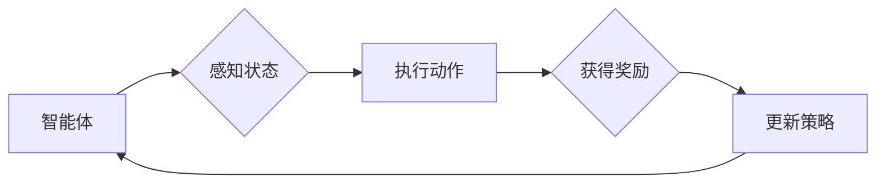

# 强化学习：在智能城市构建中的应用

> 关键词：强化学习，智能城市，交通管理，资源优化，环境监测，安全监控，机器学习，深度学习

## 1. 背景介绍

随着城市化进程的加快，智能城市建设成为全球发展趋势。智能城市通过集成物联网、大数据、云计算等技术，实现城市运行的智能化管理，提升城市效率、环境质量、居民生活质量。强化学习作为机器学习的一个重要分支，因其独特的决策和优化能力，在智能城市构建中扮演着越来越重要的角色。本文将探讨强化学习在智能城市各个领域的应用，展望其未来发展趋势与挑战。

## 2. 核心概念与联系

### 2.1 核心概念

#### 强化学习（Reinforcement Learning, RL）
强化学习是一种通过与环境交互，并基于奖励信号学习最优策略的机器学习方法。它由智能体（Agent）、环境（Environment）、状态（State）、动作（Action）、奖励（Reward）和策略（Policy）等核心概念组成。

- **智能体**：执行动作、感知环境、选择策略的实体。
- **环境**：智能体所处的环境，提供状态信息和奖励信号。
- **状态**：智能体在某一时刻的观察结果。
- **动作**：智能体可执行的操作。
- **奖励**：环境对智能体动作的反馈，用于指导智能体学习。
- **策略**：智能体决策动作的规则。

#### Mermaid 流程图


### 2.2 核心联系

强化学习在智能城市中的应用，主要基于以下联系：

- **动态决策**：智能城市中的许多问题需要实时决策，如交通信号控制、能源管理、应急响应等，强化学习能够适应动态环境变化。
- **多目标优化**：智能城市涉及多个领域，如交通、环境、安全等，强化学习能够同时优化多个目标。
- **数据驱动**：智能城市产生海量数据，强化学习能够从数据中学习最优策略。

## 3. 核心算法原理 & 具体操作步骤

### 3.1 算法原理概述

强化学习算法通过智能体与环境的交互，不断学习最优策略。常见的强化学习算法包括：

- **值函数方法**：通过学习值函数来近似最优策略，常用的算法有Q-Learning和Deep Q-Network（DQN）。
- **策略梯度方法**：直接学习策略函数来近似最优策略，常用的算法有Policy Gradient和Actor-Critic。
- **基于模型的强化学习**：通过构建环境模型来加速学习过程，常用的算法有Model-Based RL和Model-Free RL。

### 3.2 算法步骤详解

强化学习算法的基本步骤如下：

1. 初始化智能体、环境、策略。
2. 智能体在环境中进行动作选择。
3. 环境根据动作提供状态和奖励。
4. 智能体根据状态和奖励更新策略。
5. 重复步骤2-4，直到达到终止条件。

### 3.3 算法优缺点

#### 优点

- **适用于动态环境**：能够适应环境变化，学习最优策略。
- **多目标优化**：能够同时优化多个目标。
- **数据驱动**：能够从数据中学习，无需人工设计特征。

#### 缺点

- **收敛速度慢**：需要大量数据进行训练。
- **样本效率低**：需要收集大量样本才能学习到有效的策略。
- **可解释性差**：难以解释学习到的策略。

### 3.4 算法应用领域

强化学习在智能城市中的应用领域广泛，以下列举几个典型应用：

- **交通管理**：优化交通信号控制、缓解交通拥堵、提高道路安全。
- **能源管理**：优化电力、燃气等能源分配，降低能源消耗。
- **环境监测**：监测空气质量、水质等环境指标，提升环境质量。
- **安全监控**：监控城市安全事件，提高公共安全。

## 4. 数学模型和公式 & 详细讲解 & 举例说明

### 4.1 数学模型构建

强化学习的数学模型主要由以下部分组成：

- **状态空间（State Space）**：$S$，所有可能状态组成的集合。
- **动作空间（Action Space）**：$A$，所有可能动作组成的集合。
- **状态转移函数（State Transition Function）**：$P(s',a|s)$，给定当前状态 $s$ 和动作 $a$，转移至下一个状态 $s'$ 的概率。
- **奖励函数（Reward Function）**：$R(s,a)$，智能体在状态 $s$ 执行动作 $a$ 所获得的奖励。
- **策略（Policy）**：$\pi(a|s)$，在状态 $s$ 下采取动作 $a$ 的概率。

### 4.2 公式推导过程

以下以Q-Learning为例，简要介绍强化学习算法的推导过程。

#### Q-Learning
Q-Learning是一种基于值函数的强化学习算法，通过学习Q值来近似最优策略。

- **Q值**：$Q(s,a)$，在状态 $s$ 下执行动作 $a$ 的期望回报。
- **目标函数**：$\mathbb{E}[G_t] = R(s_t,a_t) + \gamma \mathbb{E}[G_{t+1}]$，从时刻 $t$ 开始的累积回报。

#### 推导过程
1. 初始化 $Q(s,a)$ 为随机值。
2. 在状态 $s$ 下，根据策略 $\pi(a|s)$ 选择动作 $a$。
3. 执行动作 $a$，获得奖励 $R(s,a)$，进入状态 $s'$。
4. 更新Q值：
   $$Q(s,a) \leftarrow Q(s,a) + \alpha [R(s,a) + \gamma \max_{a'} Q(s',a') - Q(s,a)]$$
   其中，$\alpha$ 为学习率，$\gamma$ 为折扣因子。
5. 重复步骤2-4，直到达到终止条件。

### 4.3 案例分析与讲解

以下以交通信号控制为例，介绍强化学习在智能城市中的应用。

**案例背景**
某城市某路口存在交通拥堵问题，需要设计一个智能交通信号控制系统，以优化交通流量，减少拥堵。

**模型构建**
- **状态空间**：状态由当前红绿灯状态、车辆数量、车辆类型、天气等因素组成。
- **动作空间**：动作包括红绿灯切换、放行时间调整等。
- **状态转移函数**：根据交通规则、车辆类型等因素计算下一状态的概率分布。
- **奖励函数**：奖励与交通流畅度、事故率、排放量等因素相关。

**算法选择**
选择基于值函数的强化学习算法，如Q-Learning或Deep Q-Network（DQN）。

**训练过程**
1. 初始化Q值表。
2. 根据策略选择动作，执行动作，获得奖励，进入下一状态。
3. 更新Q值，直到达到终止条件。

**模型评估**
通过模拟实验或实际交通数据进行评估，对比不同策略下的交通流畅度、事故率、排放量等指标。

## 5. 项目实践：代码实例和详细解释说明

### 5.1 开发环境搭建

由于篇幅限制，此处不详细阐述开发环境搭建过程。通常需要以下环境：

- 编程语言：Python
- 深度学习框架：TensorFlow或PyTorch
- 其他工具：NumPy、Matplotlib等

### 5.2 源代码详细实现

以下以PyTorch为例，展示一个简单的交通信号控制强化学习项目。

```python
import torch
import torch.nn as nn
import torch.optim as optim
from collections import deque

# 定义DQN模型
class DQN(nn.Module):
    def __init__(self, input_size, output_size):
        super(DQN, self).__init__()
        self.fc1 = nn.Linear(input_size, 24)
        self.fc2 = nn.Linear(24, 24)
        self.fc3 = nn.Linear(24, output_size)

    def forward(self, x):
        x = torch.relu(self.fc1(x))
        x = torch.relu(self.fc2(x))
        x = self.fc3(x)
        return x

# DQN训练过程
class DQNTrainer:
    def __init__(self, model, optimizer, loss_fn):
        self.model = model
        self.optimizer = optimizer
        self.loss_fn = loss_fn

    def train(self, data):
        for state, action, reward, next_state, done in data:
            q_value = self.model(state)
            next_q_value = self.model(next_state).detach()
            target = reward + (1 - done) * next_q_value.max(1)[0]

            loss = self.loss_fn(q_value, target)
            self.optimizer.zero_grad()
            loss.backward()
            self.optimizer.step()

# 实例化模型和训练器
model = DQN(input_size=state_size, output_size=action_size)
optimizer = optim.Adam(model.parameters(), lr=0.001)
loss_fn = nn.MSELoss()

# 训练模型
trainer = DQNTrainer(model, optimizer, loss_fn)
trainer.train(data)
```

### 5.3 代码解读与分析

- **DQN模型**：定义了DQN模型的神经网络结构，包括三个全连接层。
- **DQNTrainer类**：封装了DQN模型的训练过程，包括模型更新、损失计算、反向传播等操作。
- **实例化模型和训练器**：创建DQN模型、优化器和损失函数实例。
- **训练模型**：使用训练数据训练模型，更新模型参数。

### 5.4 运行结果展示

根据训练过程和评估指标，可以分析模型性能，并进行参数调优，以获得更好的效果。

## 6. 实际应用场景

### 6.1 交通管理

强化学习在交通管理领域具有广泛的应用，以下列举几个典型应用：

- **交通信号控制**：优化交通信号灯配时，缓解交通拥堵，提高道路通行效率。
- **自动驾驶**：辅助自动驾驶汽车进行决策，确保行车安全。
- **停车管理**：优化停车资源分配，提高停车效率。

### 6.2 能源管理

强化学习在能源管理领域可以应用于以下场景：

- **电力调度**：优化电力资源分配，提高供电效率，降低成本。
- **智能电网**：预测电力需求，提高电网稳定性，降低故障率。

### 6.3 环境监测

强化学习在环境监测领域可以应用于以下场景：

- **空气质量监测**：预测空气质量变化，提前预警污染事件。
- **水质监测**：监测水质变化，保障饮用水安全。

### 6.4 安全监控

强化学习在安全监控领域可以应用于以下场景：

- **公共安全**：监控城市安全事件，提高公共安全水平。
- **网络安全**：检测和防御网络安全攻击，保障网络安全。

## 7. 工具和资源推荐

### 7.1 学习资源推荐

- 《深度强化学习》（Deep Reinforcement Learning，DRL）课程：介绍强化学习的基本概念、算法和应用。
- 《深度学习与强化学习：理论与实践》（Deep Learning and Reinforcement Learning：A Technical Perspective）书籍：全面介绍深度学习和强化学习的理论知识和技术实践。
- OpenAI Gym：一个开源的强化学习环境平台，提供多种仿真环境和工具，方便研究者进行实验。

### 7.2 开发工具推荐

- TensorFlow：一个开源的深度学习框架，支持强化学习算法的实现。
- PyTorch：一个开源的深度学习框架，支持强化学习算法的实现。
- Unity ML-Agents：一个开源的强化学习平台，提供多种仿真环境和工具，方便开发者进行实验。

### 7.3 相关论文推荐

- Deep Reinforcement Learning：A Survey（深度强化学习综述）：介绍了深度强化学习的基本概念、算法和应用。
- Deep Q-Network（DQN）：一种基于深度学习的强化学习算法。
- Actor-Critic Methods（AC方法）：一种基于策略梯度方法的强化学习算法。

## 8. 总结：未来发展趋势与挑战

### 8.1 研究成果总结

本文介绍了强化学习在智能城市构建中的应用，探讨了核心概念、算法原理、具体操作步骤、数学模型、项目实践和实际应用场景。通过强化学习，智能城市可以实现更加智能化的管理，提高城市效率、环境质量、居民生活质量。

### 8.2 未来发展趋势

- **多智能体强化学习**：研究多智能体协同决策的算法和策略，提高智能城市系统的整体性能。
- **强化学习与知识图谱的融合**：利用知识图谱提供先验知识，提高强化学习算法的鲁棒性和效率。
- **强化学习在复杂场景中的应用**：将强化学习应用于更加复杂的场景，如城市交通、环境监测、安全监控等。

### 8.3 面临的挑战

- **计算复杂度高**：强化学习算法需要大量的计算资源，限制了其在实际应用中的推广。
- **数据依赖性强**：强化学习算法需要大量数据进行训练，获取高质量数据成本较高。
- **可解释性差**：强化学习算法的决策过程难以解释，影响了其在关键领域的应用。

### 8.4 研究展望

未来，强化学习在智能城市构建中将发挥越来越重要的作用。通过攻克计算、数据、可解释性等挑战，强化学习有望实现更多应用场景，推动智能城市建设迈向更高水平。

## 9. 附录：常见问题与解答

**Q1：强化学习在智能城市中的应用前景如何？**

A：强化学习在智能城市中的应用前景十分广阔，可以解决交通管理、能源管理、环境监测、安全监控等多个领域的复杂问题，提高城市运行效率、环境质量和居民生活质量。

**Q2：如何解决强化学习在智能城市中的数据依赖问题？**

A：可以通过以下方法解决强化学习在智能城市中的数据依赖问题：
1. 利用知识图谱提供先验知识，减少数据需求。
2. 采用数据增强技术，扩充训练数据。
3. 采用无监督或半监督学习技术，降低对标注数据的依赖。

**Q3：强化学习在智能城市中与其他技术的结合有哪些优势？**

A：强化学习可以与以下技术结合，发挥协同效应：
1. 物联网：收集实时数据，为强化学习提供数据来源。
2. 大数据：分析海量数据，辅助强化学习模型学习和决策。
3. 云计算：提供强大的计算能力，满足强化学习的计算需求。

**Q4：强化学习在智能城市中如何保证决策的鲁棒性和安全性？**

A：可以通过以下方法保证强化学习在智能城市中的决策鲁棒性和安全性：
1. 设计具有鲁棒性的强化学习算法，提高模型对噪声和异常数据的处理能力。
2. 对学习到的策略进行安全性分析，确保其符合伦理道德和法律法规。
3. 建立模型可解释性，便于监督和控制模型的决策过程。

**Q5：未来强化学习在智能城市中会有哪些新的应用？**

A：未来，强化学习在智能城市中的应用将更加广泛，以下是一些可能的新应用：
1. 智能规划：根据历史数据、预测数据和优化算法，制定城市规划和建设方案。
2. 智能服务：为居民提供个性化的服务，如智能家居、智能医疗等。
3. 智能治理：利用强化学习优化城市治理，提高城市管理水平。

作者：禅与计算机程序设计艺术 / Zen and the Art of Computer Programming