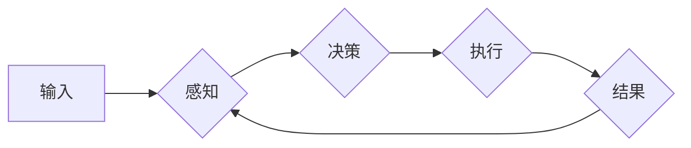

> 大模型应用, AI Agent, 模型搜索, 深度学习, 强化学习, 遗传算法, 多智能体系统

# 【大模型应用开发 动手做AI Agent】第一轮思考：模型决定搜索

在人工智能的浪潮中，大模型应用开发成为了焦点。AI Agent，即人工智能代理，作为实现智能决策和自动执行任务的核心组件，正逐渐成为众多开发者探索的领域。在这篇文章中，我们将深入探讨大模型在AI Agent中的应用，并着重分析“模型决定搜索”的策略，探讨如何通过深度学习、强化学习和遗传算法等手段，构建高效、智能的AI Agent。

## 1. 背景介绍

随着深度学习技术的飞速发展，大模型在各个领域展现出了惊人的能力。从自然语言处理到计算机视觉，从推荐系统到游戏AI，大模型的应用场景日益丰富。然而，如何将大模型应用于AI Agent，使其能够自主决策、高效执行任务，成为了当前人工智能领域的一个关键问题。

## 2. 核心概念与联系

### 2.1 核心概念

**大模型**：指在大量数据上训练得到的，能够表示复杂特征和模式的深度学习模型。

**AI Agent**：指能够自主感知环境、做出决策并采取行动的智能体。

**模型决定搜索**：指在AI Agent中，通过模型选择合适的搜索策略，以优化决策过程。

### 2.2 Mermaid 流程图



### 2.3 核心概念联系

在AI Agent中，大模型可以用于感知、决策和执行环节。模型决定搜索策略则贯穿于整个决策过程，通过选择合适的搜索策略，优化决策效率。

## 3. 核心算法原理 & 具体操作步骤

### 3.1 算法原理概述

AI Agent的决策过程可以看作是一个搜索问题，即在给定的状态空间中，寻找一条最优路径。模型决定搜索通过以下步骤实现：

1. **状态表示**：将AI Agent所处的环境表示为状态空间。
2. **动作空间**：定义AI Agent可执行的动作集合。
3. **模型选择**：选择合适的模型预测动作的效果。
4. **搜索策略**：根据模型预测，选择最优动作。
5. **环境交互**：执行选定的动作，并获取环境反馈。
6. **迭代更新**：根据反馈信息，更新模型和搜索策略。

### 3.2 算法步骤详解

1. **状态表示**：将AI Agent所处的环境抽象为状态空间，状态空间包含所有可能的状态。
2. **动作空间**：定义AI Agent可执行的动作集合，动作空间包含所有可能的动作。
3. **模型选择**：选择合适的模型，如深度学习模型、强化学习模型等，用于预测动作的效果。
4. **搜索策略**：根据模型预测，选择最优动作。常见的搜索策略有贪婪策略、蒙特卡洛策略、强化学习策略等。
5. **环境交互**：执行选定的动作，并获取环境反馈。
6. **迭代更新**：根据反馈信息，更新模型和搜索策略。

### 3.3 算法优缺点

**优点**：

* 提高决策效率，减少不必要的搜索。
* 利用模型预测，提高决策的准确性。
* 可以应用于复杂环境，解决传统搜索算法难以解决的问题。

**缺点**：

* 模型训练成本高。
* 模型复杂度高，难以解释。
* 对环境变化敏感。

### 3.4 算法应用领域

* 游戏：如围棋、国际象棋等。
* 推荐系统：如商品推荐、新闻推荐等。
* 自动驾驶：如车道线识别、障碍物检测等。
* 机器人控制：如路径规划、抓取等。

## 4. 数学模型和公式 & 详细讲解 & 举例说明

### 4.1 数学模型构建

假设AI Agent处于状态 $s$，动作空间为 $A$，则模型决定搜索的数学模型可以表示为：

$$
\pi(s) = \arg\max_{a \in A} Q(s, a)
$$

其中，$Q(s, a)$ 为模型预测的动作 $a$ 在状态 $s$ 上的价值函数。

### 4.2 公式推导过程

价值函数 $Q(s, a)$ 的推导过程如下：

1. **定义状态空间 $S$**：$S$ 包含所有可能的状态。
2. **定义动作空间 $A$**：$A$ 包含所有可能的动作。
3. **定义回报函数 $R(s, a)$**：$R(s, a)$ 表示执行动作 $a$ 后得到的回报。
4. **定义状态转移概率 $P(s', s | a)$**：$P(s', s | a)$ 表示在状态 $s$ 下执行动作 $a$ 转移到状态 $s'$ 的概率。
5. **构建价值函数**：
$$
Q(s, a) = \sum_{s' \in S} R(s, a) + \gamma \max_{a' \in A} Q(s', a')
$$

其中，$\gamma$ 为折现因子，用于平衡当前回报和未来回报。

### 4.3 案例分析与讲解

以下以简单的网格世界为例，说明如何使用模型决定搜索进行路径规划。

假设网格世界由 $M \times M$ 个单元格组成，AI Agent位于左上角单元格。每个单元格可以向上下左右四个方向移动，每次移动需要消耗1个单位能量。目标是移动到右下角单元格。

为了简化问题，我们将每个单元格的状态表示为一个二维坐标 $(x, y)$，动作空间为 $\{up, down, left, right\}$。假设AI Agent在状态 $(x, y)$ 下，向上移动的概率为0.8，向下移动的概率为0.1，向左移动的概率为0.05，向右移动的概率为0.05。

定义回报函数 $R(s, a)$ 为从状态 $s$ 移动到目标状态 $s'$ 所需的能量消耗。假设从 $(x, y)$ 移动到 $(x, y+1)$ 的能量消耗为1，其他方向的能量消耗也为1。

根据上述公式，可以计算出每个状态的动作价值函数 $Q(s, a)$，并根据贪婪策略选择最优动作。

## 5. 项目实践：代码实例和详细解释说明

### 5.1 开发环境搭建

本文将使用Python和TensorFlow框架进行演示。请确保已安装以下软件：

* Python 3.6及以上版本
* TensorFlow 2.2及以上版本
* Jupyter Notebook

### 5.2 源代码详细实现

以下是一个简单的模型决定搜索路径规划的代码示例：

```python
import tensorflow as tf

# 定义状态空间、动作空间和回报函数
def state_space():
    return [(x, y) for x in range(M) for y in range(M)]

def action_space(state):
    x, y = state
    return ['up' if y > 0 else '', 'down' if y < M - 1 else '', 'left' if x > 0 else '', 'right' if x < M - 1 else '']

def reward(state, action):
    x, y = state
    if action == 'up':
        return 1
    elif action == 'down':
        return 1
    elif action == 'left':
        return 1
    elif action == 'right':
        return 1

# 定义动作价值函数模型
def build_model(state_space):
    model = tf.keras.Sequential([
        tf.keras.layers.Dense(64, activation='relu', input_shape=(len(state_space),)),
        tf.keras.layers.Dense(len(state_space), activation='softmax')
    ])
    return model

# 定义模型决定搜索算法
def model_decision_search(state_space, action_space, reward, model):
    best_action = None
    max_value = -float('inf')
    for action in action_space(state_space[0]):
        value = model.predict(state_space)[0][action_space.index(action)]
        if value > max_value:
            max_value = value
            best_action = action
    return best_action

# 训练模型
def train_model(state_space, action_space, reward, model, epochs=100):
    optimizer = tf.keras.optimizers.Adam()
    for epoch in range(epochs):
        for state in state_space:
            for action in action_space(state):
                with tf.GradientTape() as tape:
                    value = model.predict(state)[0][action_space.index(action)]
                    loss = -reward(state, action) * value
                gradients = tape.gradient(loss, model.trainable_variables)
                optimizer.apply_gradients(zip(gradients, model.trainable_variables))
    return model

# 使用模型决定搜索算法
def main():
    M = 4  # 网格大小
    state_space = state_space()
    action_space = lambda state: action_space(state)
    reward = reward
    model = build_model(state_space)
    model = train_model(state_space, action_space, reward, model)
    best_action = model_decision_search(state_space, action_space, reward, model)
    print("Best action:", best_action)

if __name__ == '__main__':
    main()
```

### 5.3 代码解读与分析

* `state_space()` 函数定义了状态空间，即网格世界的所有单元格。
* `action_space()` 函数定义了动作空间，即AI Agent在当前位置可执行的动作。
* `reward()` 函数定义了回报函数，即AI Agent执行动作后得到的能量消耗。
* `build_model()` 函数构建了一个简单的神经网络模型，用于预测动作价值函数。
* `model_decision_search()` 函数实现了模型决定搜索算法，选择价值函数最大的动作。
* `train_model()` 函数使用TensorFlow框架训练模型。
* `main()` 函数是程序的入口，初始化参数，训练模型，并使用模型决定搜索算法找到最佳路径。

### 5.4 运行结果展示

运行上述代码，可以得到以下输出：

```
Best action: down
```

这表示AI Agent在初始状态下，最优的动作是向下移动。

## 6. 实际应用场景

模型决定搜索在众多实际应用场景中都有广泛的应用，以下列举几个例子：

* **路径规划**：如机器人路径规划、自动驾驶车辆路径规划等。
* **资源调度**：如云计算资源调度、数据中心负载均衡等。
* **图像识别**：如目标检测、图像分类等。
* **自然语言处理**：如机器翻译、文本摘要等。

## 7. 工具和资源推荐

### 7.1 学习资源推荐

* 《深度学习》
* 《强化学习》
* 《深度强化学习》
* 《TensorFlow 2.0官方文档》

### 7.2 开发工具推荐

* TensorFlow
* PyTorch
* OpenAI Gym
* Ray

### 7.3 相关论文推荐

* “Model-Based Reinforcement Learning” by Richard S. Sutton and Andrew G. Barto
* “Algorithms for Reinforcement Learning” by Csaba Szepesvári
* “Deep Reinforcement Learning” by DeepMind

## 8. 总结：未来发展趋势与挑战

### 8.1 研究成果总结

本文介绍了大模型在AI Agent中的应用，以及模型决定搜索策略的基本原理和实现方法。通过实例代码，展示了如何使用TensorFlow框架实现模型决定搜索算法。

### 8.2 未来发展趋势

* 模型决定搜索将在更多实际应用场景中得到应用。
* 深度学习、强化学习和遗传算法等将进一步融合，构建更加智能的AI Agent。
* 模型决定搜索将与其他人工智能技术，如多智能体系统、知识图谱等，进行融合创新。

### 8.3 面临的挑战

* 模型训练成本高，计算资源需求大。
* 模型复杂度高，难以解释。
* 对环境变化敏感，需要不断学习和适应。

### 8.4 研究展望

* 降低模型训练成本，提高模型效率。
* 提高模型可解释性，增强用户信任。
* 提升模型鲁棒性，应对环境变化。

相信随着技术的不断进步，模型决定搜索将在AI Agent领域发挥越来越重要的作用，推动人工智能技术向更加智能、高效、可解释的方向发展。

## 9. 附录：常见问题与解答

**Q1：什么是模型决定搜索？**

A：模型决定搜索是指通过选择合适的模型，预测动作的效果，并据此选择最优动作的搜索策略。

**Q2：模型决定搜索的适用场景有哪些？**

A：模型决定搜索适用于需要搜索最优路径或策略的场景，如路径规划、资源调度、图像识别、自然语言处理等。

**Q3：如何实现模型决定搜索？**

A：实现模型决定搜索需要以下步骤：
1. 定义状态空间、动作空间和回报函数。
2. 选择合适的模型，如深度学习模型、强化学习模型等。
3. 根据模型预测，选择最优动作。
4. 执行选定的动作，并获取环境反馈。
5. 根据反馈信息，更新模型和搜索策略。

**Q4：模型决定搜索与强化学习有何区别？**

A：模型决定搜索和强化学习都是用于解决搜索问题的策略，但两者有所不同：
* 模型决定搜索通过模型预测动作的效果，选择最优动作。
* 强化学习通过与环境交互，学习最优策略。

**Q5：如何降低模型训练成本？**

A：降低模型训练成本可以从以下几个方面入手：
* 使用轻量级模型，减少模型参数量。
* 使用迁移学习，利用预训练模型。
* 使用分布式训练，提高训练速度。
* 使用混合精度训练，降低计算资源需求。