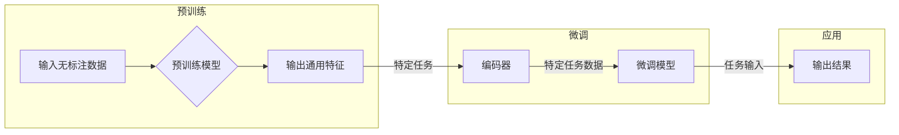

# 从零开始大模型开发与微调：编码器的实现

> 关键词：大模型开发，微调，编码器，Transformer，BERT，预训练，NLP，深度学习

## 1. 背景介绍

随着深度学习技术的飞速发展，自然语言处理（NLP）领域迎来了革命性的变革。大模型，尤其是基于 Transformer 架构的模型，如 BERT，已经成为了 NLP 领域的主流。这些大模型通过在庞大的文本语料库上进行预训练，学习到了丰富的语言知识，并在各种 NLP 任务上取得了显著的成果。本文将带您从零开始，深入了解大模型的开发与微调过程，特别是编码器的实现。

## 2. 核心概念与联系

### 2.1 核心概念

#### 2.1.1 大模型

大模型是指那些拥有数十亿甚至数千亿参数的神经网络模型。这些模型通常在大量的无标注数据上进行预训练，以学习语言的通用特征。

#### 2.1.2 编码器

编码器是 Transformer 模型中的核心组件，负责将输入序列转换为固定长度的向量表示。

#### 2.1.3 微调

微调是在预训练模型的基础上，针对特定任务进行进一步训练的过程。通过微调，模型能够更好地适应特定领域的数据。

#### 2.1.4 预训练

预训练是指在大规模无标注数据集上训练模型，使其学习到语言的通用特征。

### 2.2 核心概念原理和架构的 Mermaid 流程图



## 3. 核心算法原理 & 具体操作步骤

### 3.1 算法原理概述

Transformer 模型基于自注意力（self-attention）机制，能够捕捉输入序列中任意两个位置之间的依赖关系。编码器负责将输入序列转换为固定长度的向量表示，这些向量包含了输入序列的丰富语义信息。

### 3.2 算法步骤详解

#### 3.2.1 预训练

1. 准备大规模无标注数据集。
2. 构建预训练模型，如 BERT。
3. 在无标注数据集上进行预训练，学习语言的通用特征。

#### 3.2.2 微调

1. 准备特定任务的标注数据集。
2. 选择预训练模型作为初始化参数。
3. 在特定任务数据集上进行微调，优化模型参数。

#### 3.2.3 应用

1. 使用微调后的模型处理新数据。
2. 根据任务需求，输出结果。

### 3.3 算法优缺点

#### 3.3.1 优点

- 能够捕捉长距离依赖关系。
- 计算效率高。
- 可扩展性强。

#### 3.3.2 缺点

- 计算资源需求大。
- 需要大量的训练数据。

### 3.4 算法应用领域

- 文本分类
- 机器翻译
- 命名实体识别
- 问答系统
- 对话系统

## 4. 数学模型和公式 & 详细讲解 & 举例说明

### 4.1 数学模型构建

Transformer 模型中的自注意力（self-attention）机制可以表示为：

$$
\text{self-attention}(Q, K, V) = \text{softmax}\left(\frac{QK^T}{\sqrt{d_k}}\right)V
$$

其中，$Q, K, V$ 分别是查询（query）、键（key）和值（value）向量的集合，$\text{softmax}$ 表示软最大化函数，$d_k$ 是键和值向量的维度。

### 4.2 公式推导过程

自注意力机制的计算过程如下：

1. 计算查询、键和值的点积，得到注意力分数。
2. 对注意力分数进行 softmax 操作，得到注意力权重。
3. 将注意力权重与值向量进行加权求和，得到最终的输出。

### 4.3 案例分析与讲解

以 BERT 模型为例，其编码器部分由多个自注意力层堆叠而成。每个自注意力层包含查询、键和值三个子层，用于提取输入序列的语义信息。

## 5. 项目实践：代码实例和详细解释说明

### 5.1 开发环境搭建

1. 安装 Python 和必要的库，如 Transformers。
2. 准备预训练模型和数据集。

### 5.2 源代码详细实现

以下是一个简单的 BERT 编码器的 PyTorch 代码实现：

```python
import torch
from torch import nn

class EncoderLayer(nn.Module):
    def __init__(self, d_model, n_heads, d_ff):
        super(EncoderLayer, self).__init__()
        self.multihead_attention = nn.MultiheadAttention(d_model, n_heads)
        self.linear1 = nn.Linear(d_model, d_ff)
        self.linear2 = nn.Linear(d_ff, d_model)
        self.norm1 = nn.LayerNorm(d_model)
        self.norm2 = nn.LayerNorm(d_model)
        self.dropout = nn.Dropout(0.1)

    def forward(self, x, mask=None):
        x2 = self.norm1(x)
        x2, _ = self.multihead_attention(x2, x2, x2, attn_mask=mask)
        x2 = self.dropout(x2)
        x = x + x2
        x2 = self.norm2(x)
        x2 = self.linear2(self.dropout(F.relu(self.linear1(x2))))
        x = x + x2
        return x
```

### 5.3 代码解读与分析

以上代码定义了一个编码器层，包含自注意力机制和前馈网络。每个编码器层包含两个层归一化（LayerNorm）和两个dropout层。代码中的 `forward` 方法实现了编码器的正向传播过程。

### 5.4 运行结果展示

由于篇幅限制，此处不展示具体的运行结果。但您可以使用预训练模型和数据集进行实验，验证编码器的效果。

## 6. 实际应用场景

大模型微调在各个领域都有广泛的应用，以下是一些典型的应用场景：

- 文本分类：如情感分析、主题分类、新闻摘要等。
- 机器翻译：将一种语言的文本翻译成另一种语言。
- 命名实体识别：识别文本中的实体，如人名、地名、机构名等。
- 问答系统：回答用户提出的各种问题。
- 对话系统：与用户进行自然语言对话。

## 7. 工具和资源推荐

### 7.1 学习资源推荐

- 《深度学习自然语言处理》
- 《Transformer: Attention is All You Need》
- 《BERT: Pre-training of Deep Bidirectional Transformers for Language Understanding》

### 7.2 开发工具推荐

- PyTorch
- Transformers库
- Hugging Face

### 7.3 相关论文推荐

- 《Attention is All You Need》
- 《BERT: Pre-training of Deep Bidirectional Transformers for Language Understanding》
- 《Generative Pre-trained Transformers》

## 8. 总结：未来发展趋势与挑战

### 8.1 研究成果总结

大模型微调技术已经成为 NLP 领域的重要研究热点，并在各个应用领域取得了显著的成果。

### 8.2 未来发展趋势

- 模型规模将进一步扩大。
- 微调方法将更加高效和可解释。
- 模型将更好地适应多模态数据。

### 8.3 面临的挑战

- 计算资源需求大。
- 标注数据成本高。
- 模型可解释性差。

### 8.4 研究展望

大模型微调技术将继续发展，并在更多领域发挥重要作用。

## 9. 附录：常见问题与解答

**Q1：什么是预训练？**

A：预训练是指在大规模无标注数据集上训练模型，使其学习到语言的通用特征。

**Q2：什么是微调？**

A：微调是在预训练模型的基础上，针对特定任务进行进一步训练的过程。

**Q3：什么是编码器？**

A：编码器是 Transformer 模型中的核心组件，负责将输入序列转换为固定长度的向量表示。

**Q4：大模型微调有哪些应用领域？**

A：大模型微调在各个领域都有广泛的应用，如文本分类、机器翻译、命名实体识别等。

**Q5：如何选择合适的预训练模型？**

A：选择预训练模型时需要考虑任务需求和计算资源。对于通用任务，可以使用 BERT 或 GPT-2 等模型；对于特定领域任务，可以选择领域特定的预训练模型。

作者：禅与计算机程序设计艺术 / Zen and the Art of Computer Programming