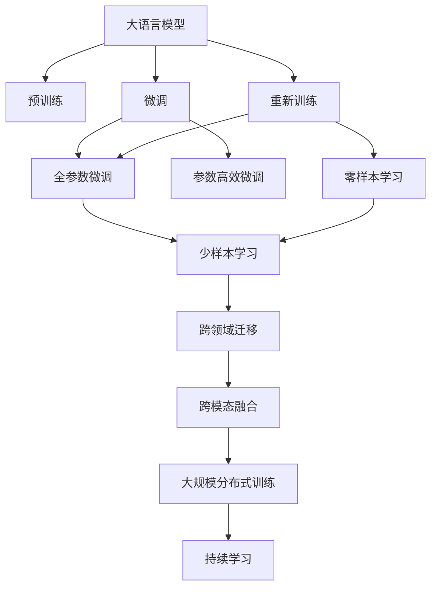
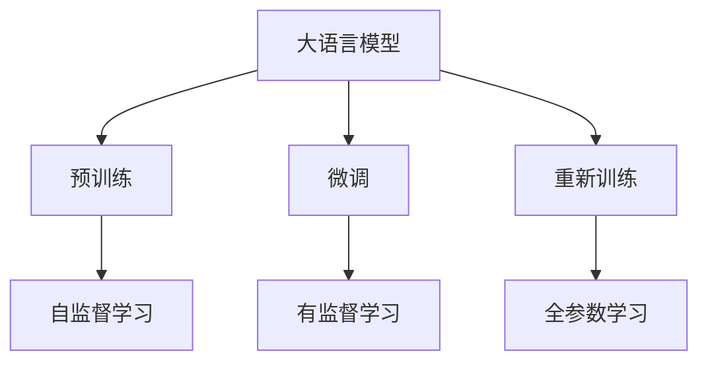
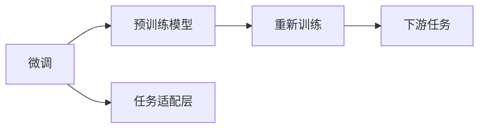
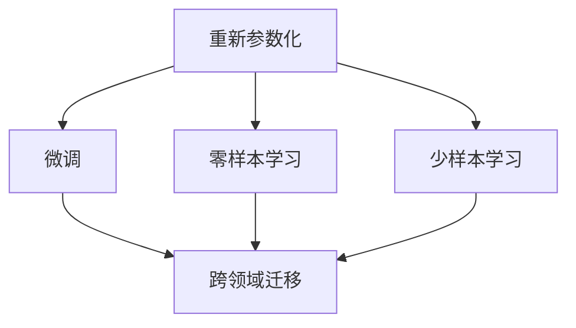
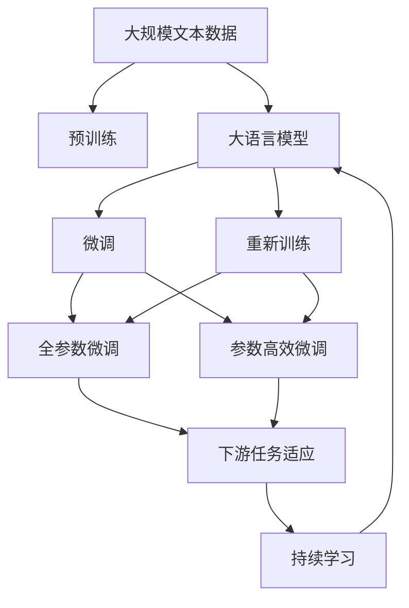

                 

# 大语言模型原理基础与前沿 基于重新参数化的方法

> 关键词：大语言模型, 重新参数化, 自回归模型, 语言生成, 神经网络, 计算机视觉, 自然语言处理(NLP)

## 1. 背景介绍

### 1.1 问题由来

在人工智能领域，大语言模型（Large Language Models, LLMs）已经逐渐成为核心技术之一。这些模型通过对海量无标签文本数据进行预训练，学习到丰富的语言知识，能够理解和生成人类自然语言。然而，预训练模型虽然能够很好地适应通用语言理解，但在特定领域的应用上，由于知识域的局限，仍然存在性能瓶颈。因此，如何在大模型基础上进行特定领域知识的增强，成为目前研究的重要方向。

### 1.2 问题核心关键点

基于重新参数化的方法，即为在预训练大模型基础上，通过微调或重新训练的方式，向模型注入特定领域知识，提升模型在特定任务上的性能。这种方法的核心理念是通过增加模型参数，引入特定领域的特征表示，提高模型对新任务的适应能力。具体来说，方法包括微调（Fine-tuning）和重新训练（Retraining）两种，前者在预训练模型的基础上添加任务相关的输出层和损失函数，后者则完全重新训练模型，使其完全适配特定任务。

### 1.3 问题研究意义

研究基于重新参数化的方法，对于拓展大模型的应用范围，提升特定任务的性能，加速人工智能技术的产业化进程，具有重要意义：

1. 降低应用开发成本。通过在大模型基础上进行微调或重新训练，可以显著减少从头开发所需的数据、计算和人力等成本投入。
2. 提升模型效果。微调和重新训练使得通用大模型更好地适应特定任务，在应用场景中取得更优表现。
3. 加速开发进度。利用大模型作为基础，可以快速实现任务适配，缩短开发周期。
4. 带来技术创新。基于微调和重新训练的范式，催生了提示学习、少样本学习等新的研究方向。
5. 赋能产业升级。将大模型技术应用到各行各业，为传统行业数字化转型升级提供新的技术路径。

## 2. 核心概念与联系

### 2.1 核心概念概述

为了更好地理解基于重新参数化的方法，本节将介绍几个密切相关的核心概念：

- **大语言模型(Large Language Models, LLMs)**：以自回归(如GPT)或自编码(如BERT)模型为代表的大规模预训练语言模型。通过在大规模无标签文本语料上进行预训练，学习通用的语言表示，具备强大的语言理解和生成能力。

- **预训练(Pre-training)**：指在大规模无标签文本语料上，通过自监督学习任务训练通用语言模型的过程。常见的预训练任务包括言语建模、遮挡语言模型等。预训练使得模型学习到语言的通用表示。

- **微调(Fine-tuning)**：指在预训练模型的基础上，使用下游任务的少量标注数据，通过有监督学习优化模型在该任务上的性能。通常只需要调整顶层分类器或解码器，并以较小的学习率更新全部或部分的模型参数。

- **重新训练(Retraining)**：指在预训练模型的基础上，重新训练模型以适配下游任务的特定需求。这通常意味着更新大部分或全部的模型参数。

- **重新参数化(Reparameterization)**：一种技术，通过增加新的参数或重新分配现有参数，使得模型能够更好地适应新的任务。包括微调和重新训练。

- **神经网络(Neural Network)**：由大量神经元组成的网络结构，能够通过学习数据特征进行模式识别和预测。在大模型中，神经网络通常采用Transformer结构。

- **自回归模型(Autoregressive Model)**：一种通过顺序预测序列中下一个元素的方式来生成序列的模型。常见的自回归模型包括GPT系列。

- **自编码器(Autocoder)**：一种通过编码-解码的方式，将输入数据压缩为低维表示，再解码为原始数据结构的模型。常见的自编码器包括BERT。

这些核心概念之间的逻辑关系可以通过以下Mermaid流程图来展示：



这个流程图展示了大语言模型的核心概念及其之间的关系：

1. 大语言模型通过预训练获得基础能力。
2. 微调和重新训练是对预训练模型进行任务特定的优化，可以分为全参数微调和参数高效微调（PEFT）。
3. 重新训练方法更激进，重新训练整个模型以适配特定任务。
4. 重新参数化包括微调和重新训练，可以改变模型参数，使得模型能够更好地适应新任务。
5. 神经网络通过增量参数优化，提高对新任务的适应能力。
6. 自回归和自编码模型分别通过不同的方式进行序列生成和数据压缩。
7. 微调、重新训练、零样本和少样本学习等方法可以增强模型的泛化能力。
8. 跨领域和跨模态迁移可以拓展模型的应用范围。
9. 大规模分布式训练和持续学习可以提升模型的稳定性和鲁棒性。

这些概念共同构成了大语言模型的学习和应用框架，使其能够在各种场景下发挥强大的语言理解和生成能力。通过理解这些核心概念，我们可以更好地把握大语言模型的工作原理和优化方向。

### 2.2 概念间的关系

这些核心概念之间存在着紧密的联系，形成了大语言模型学习的完整生态系统。下面我通过几个Mermaid流程图来展示这些概念之间的关系。

#### 2.2.1 大语言模型的学习范式



这个流程图展示了大语言模型的三种主要学习范式：预训练、微调和重新训练。预训练主要采用自监督学习方法，而微调和重新训练则是有监督学习的过程。

#### 2.2.2 微调与重新训练的关系



这个流程图展示了微调与重新训练的关系。微调是在预训练模型的基础上进行有监督学习，而重新训练则是完全重新训练模型，使其完全适配特定任务。

#### 2.2.3 重新参数化方法



这个流程图展示了重新参数化的不同方法。微调和重新训练都属于重新参数化，零样本和少样本学习则是基于重新参数化的其他技术。

### 2.3 核心概念的整体架构

最后，我们用一个综合的流程图来展示这些核心概念在大语言模型学习过程中的整体架构：



这个综合流程图展示了从预训练到微调，再到重新训练的完整过程。大语言模型首先在大规模文本数据上进行预训练，然后通过微调（包括全参数微调和参数高效微调）或重新训练（包括全参数重新训练）来适配下游任务。最后，通过持续学习技术，模型可以不断更新和适应新的任务和数据。 通过这些流程图，我们可以更清晰地理解大语言模型学习过程中各个核心概念的关系和作用，为后续深入讨论具体的微调方法和技术奠定基础。

## 3. 核心算法原理 & 具体操作步骤
### 3.1 算法原理概述

基于重新参数化的方法，通过在预训练模型基础上添加或修改部分模型参数，使得模型能够更好地适应特定任务。具体来说，微调通过在预训练模型的顶部添加一个或多个全连接层，并将损失函数和优化器针对任务进行更新，从而使得模型能够学习到特定任务的特征表示。而重新训练则是完全重新训练模型，使其完全适应新的任务需求。

微调和重新训练的共同点在于，它们都是通过增加模型参数或重新分配现有参数，使得模型能够更好地适应新任务。不同点在于，微调通常在预训练模型的基础上进行，而重新训练则可能需要重新训练整个模型。

### 3.2 算法步骤详解

基于重新参数化的方法一般包括以下几个关键步骤：

**Step 1: 准备预训练模型和数据集**
- 选择合适的预训练语言模型 $M_{\theta}$ 作为初始化参数，如 BERT、GPT 等。
- 准备下游任务 $T$ 的标注数据集 $D=\{(x_i,y_i)\}_{i=1}^N$，划分为训练集、验证集和测试集。一般要求标注数据与预训练数据的分布不要差异过大。

**Step 2: 设计任务适配层**
- 根据任务类型，在预训练模型顶层设计合适的输出层和损失函数。
- 对于分类任务，通常在顶层添加线性分类器和交叉熵损失函数。
- 对于生成任务，通常使用语言模型的解码器输出概率分布，并以负对数似然为损失函数。

**Step 3: 设置微调或重新训练超参数**
- 选择合适的优化算法及其参数，如 AdamW、SGD 等，设置学习率、批大小、迭代轮数等。
- 设置正则化技术及强度，包括权重衰减、Dropout、Early Stopping 等。
- 确定冻结预训练参数的策略，如仅微调顶层，或全部参数都参与微调或重新训练。

**Step 4: 执行梯度训练**
- 将训练集数据分批次输入模型，前向传播计算损失函数。
- 反向传播计算参数梯度，根据设定的优化算法和学习率更新模型参数。
- 周期性在验证集上评估模型性能，根据性能指标决定是否触发 Early Stopping。
- 重复上述步骤直到满足预设的迭代轮数或 Early Stopping 条件。

**Step 5: 测试和部署**
- 在测试集上评估微调后模型 $M_{\hat{\theta}}$ 的性能，对比微调前后的精度提升。
- 使用微调后的模型对新样本进行推理预测，集成到实际的应用系统中。
- 持续收集新的数据，定期重新微调或重新训练模型，以适应数据分布的变化。

以上是基于重新参数化的方法的一般流程。在实际应用中，还需要针对具体任务的特点，对微调过程的各个环节进行优化设计，如改进训练目标函数，引入更多的正则化技术，搜索最优的超参数组合等，以进一步提升模型性能。

### 3.3 算法优缺点

基于重新参数化的方法具有以下优点：
1. 能够更好地适应特定任务。通过在预训练模型的基础上进行微调或重新训练，模型能够学习到特定任务的相关知识，提升在特定任务上的表现。
2. 参数效率高。微调和重新训练通常只需要更新部分模型参数，能够有效避免过拟合。
3. 可解释性强。微调和重新训练方法通常比全模型微调更容易解释，有助于理解模型内部机制。
4. 可以学习任务特定特征。通过微调或重新训练，模型可以学习到特定任务的重要特征，从而在新的任务上取得更好的效果。

同时，该方法也存在一定的局限性：
1. 需要大量标注数据。微调和重新训练通常需要更多的标注数据，获取高质量标注数据的成本较高。
2. 训练成本高。微调和重新训练需要较长的训练时间和计算资源，特别是在大规模模型上。
3. 模型泛化能力可能受限。当目标任务与预训练数据的分布差异较大时，微调和重新训练的性能提升有限。
4. 参数增加可能导致过拟合。微调和重新训练增加了模型参数，可能会增加过拟合的风险。

尽管存在这些局限性，但就目前而言，基于重新参数化的方法仍然是有效提升模型在特定任务上性能的重要手段。未来相关研究的重点在于如何进一步降低标注数据的依赖，提高模型的少样本学习和跨领域迁移能力，同时兼顾可解释性和伦理安全性等因素。

### 3.4 算法应用领域

基于重新参数化的方法在NLP领域已经得到了广泛的应用，覆盖了几乎所有常见任务，例如：

- 文本分类：如情感分析、主题分类、意图识别等。通过微调使模型学习文本-标签映射。
- 命名实体识别：识别文本中的人名、地名、机构名等特定实体。通过微调使模型掌握实体边界和类型。
- 关系抽取：从文本中抽取实体之间的语义关系。通过微调使模型学习实体-关系三元组。
- 问答系统：对自然语言问题给出答案。将问题-答案对作为微调数据，训练模型学习匹配答案。
- 机器翻译：将源语言文本翻译成目标语言。通过微调使模型学习语言-语言映射。
- 文本摘要：将长文本压缩成简短摘要。将文章-摘要对作为微调数据，使模型学习抓取要点。
- 对话系统：使机器能够与人自然对话。将多轮对话历史作为上下文，微调模型进行回复生成。

除了上述这些经典任务外，基于重新参数化的方法也被创新性地应用到更多场景中，如可控文本生成、常识推理、代码生成、数据增强等，为NLP技术带来了全新的突破。随着预训练模型和重新参数化方法的不断进步，相信NLP技术将在更广阔的应用领域大放异彩。

## 4. 数学模型和公式 & 详细讲解 & 举例说明

### 4.1 数学模型构建

本节将使用数学语言对基于重新参数化的方法进行更加严格的刻画。

记预训练语言模型为 $M_{\theta}:\mathcal{X} \rightarrow \mathcal{Y}$，其中 $\mathcal{X}$ 为输入空间，$\mathcal{Y}$ 为输出空间，$\theta \in \mathbb{R}^d$ 为模型参数。假设微调任务的训练集为 $D=\{(x_i,y_i)\}_{i=1}^N, x_i \in \mathcal{X}, y_i \in \mathcal{Y}$。

定义模型 $M_{\theta}$ 在数据样本 $(x,y)$ 上的损失函数为 $\ell(M_{\theta}(x),y)$，则在数据集 $D$ 上的经验风险为：

$$
\mathcal{L}(\theta) = \frac{1}{N} \sum_{i=1}^N \ell(M_{\theta}(x_i),y_i)
$$

微调的优化目标是最小化经验风险，即找到最优参数：

$$
\theta^* = \mathop{\arg\min}_{\theta} \mathcal{L}(\theta)
$$

在实践中，我们通常使用基于梯度的优化算法（如SGD、Adam等）来近似求解上述最优化问题。设 $\eta$ 为学习率，$\lambda$ 为正则化系数，则参数的更新公式为：

$$
\theta \leftarrow \theta - \eta \nabla_{\theta}\mathcal{L}(\theta) - \eta\lambda\theta
$$

其中 $\nabla_{\theta}\mathcal{L}(\theta)$ 为损失函数对参数 $\theta$ 的梯度，可通过反向传播算法高效计算。

### 4.2 公式推导过程

以下我们以二分类任务为例，推导交叉熵损失函数及其梯度的计算公式。

假设模型 $M_{\theta}$ 在输入 $x$ 上的输出为 $\hat{y}=M_{\theta}(x) \in [0,1]$，表示样本属于正类的概率。真实标签 $y \in \{0,1\}$。则二分类交叉熵损失函数定义为：

$$
\ell(M_{\theta}(x),y) = -[y\log \hat{y} + (1-y)\log (1-\hat{y})]
$$

将其代入经验风险公式，得：

$$
\mathcal{L}(\theta) = -\frac{1}{N}\sum_{i=1}^N [y_i\log M_{\theta}(x_i)+(1-y_i)\log(1-M_{\theta}(x_i))]
$$

根据链式法则，损失函数对参数 $\theta_k$ 的梯度为：

$$
\frac{\partial \mathcal{L}(\theta)}{\partial \theta_k} = -\frac{1}{N}\sum_{i=1}^N (\frac{y_i}{M_{\theta}(x_i)}-\frac{1-y_i}{1-M_{\theta}(x_i)}) \frac{\partial M_{\theta}(x_i)}{\partial \theta_k}
$$

其中 $\frac{\partial M_{\theta}(x_i)}{\partial \theta_k}$ 可进一步递归展开，利用自动微分技术完成计算。

在得到损失函数的梯度后，即可带入参数更新公式，完成模型的迭代优化。重复上述过程直至收敛，最终得到适应下游任务的最优模型参数 $\theta^*$。

### 4.3 案例分析与讲解

我们以情感分析任务为例，解释如何使用微调和重新训练方法进行大语言模型的适配。

**微调方法**：
假设我们已经有了一个BERT模型，现在我们想要让它进行情感分析任务。我们首先准备好情感分析的数据集，包含带有情感标签的文本。然后，我们在BERT模型的顶部添加一个全连接层，用于将模型输出映射到情感标签上。接着，我们定义交叉熵损失函数，并使用AdamW优化器进行训练。训练过程中，我们只更新全连接层和softmax层的参数，而冻结BERT模型的底层参数，以避免破坏其通用语言表示。

**重新训练方法**：
另一种方法是，我们直接使用数据集对BERT模型进行重新训练。我们将数据集作为输入，使用交叉熵损失函数进行训练，并使用AdamW优化器更新所有参数。在重新训练过程中，我们不再冻结任何预训练参数，而是对所有参数进行更新。这种方法通常需要更长的训练时间和更大的计算资源，但可以获得更好的性能提升。

## 5. 项目实践：代码实例和详细解释说明

### 5.1 开发环境搭建

在进行微调或重新训练实践前，我们需要准备好开发环境。以下是使用Python进行PyTorch开发的环境配置流程：

1. 安装Anaconda：从官网下载并安装Anaconda，用于创建独立的Python环境。

2. 创建并激活虚拟环境：
```bash
conda create -n pytorch-env python=3.8 
conda activate pytorch-env
```

3. 安装PyTorch：根据CUDA版本，从官网获取对应的安装命令。例如：
```bash
conda install pytorch torchvision torchaudio cudatoolkit=11.1 -c pytorch -c conda-forge
```

4. 安装Transformers库：
```bash
pip install transformers
```

5. 安装各类工具包：
```bash
pip install numpy pandas scikit-learn matplotlib tqdm jupyter notebook ipython
```

完成上述步骤后，即可在`pytorch-env`环境中开始微调或重新训练实践。

### 5.2 源代码详细实现

下面我们以情感分析任务为例，给出使用Transformers库对BERT模型进行微调的PyTorch代码实现。

首先，定义情感分析任务的数据处理函数：

```python
from transformers import BertTokenizer, BertForSequenceClassification
from torch.utils.data import Dataset
import torch

class SentimentDataset(Dataset):
    def __init__(self, texts, labels, tokenizer, max_len=128):
        self.texts = texts
        self.labels = labels
        self.tokenizer = tokenizer
        self.max_len = max_len
        
    def __len__(self):
        return len(self.texts)
    
    def __getitem__(self, item):
        text = self.texts[item]
        label = self.labels[item]
        
        encoding = self.tokenizer(text, return_tensors='pt', max_length=self.max_len, padding='max_length', truncation=True)
        input_ids = encoding['input_ids'][0]
        attention_mask = encoding['attention_mask'][0]
        
        # 将标签转换为id
        label_id = label2id[label]
        labels = torch.tensor(label_id, dtype=torch.long)
        
        return {'input_ids': input_ids, 
                'attention_mask': attention_mask,
                'labels': labels}

# 标签与id的映射
label2id = {'positive': 1, 'negative': 0}
id2label = {v: k for k, v in label2id.items()}

# 创建dataset
tokenizer = BertTokenizer.from_pretrained('bert-base-cased')

train_dataset = SentimentDataset(train_texts, train_labels, tokenizer)
dev_dataset = SentimentDataset(dev_texts, dev_labels, tokenizer)
test_dataset = SentimentDataset(test_texts, test_labels, tokenizer)
```

然后，定义模型和优化器：

```python
from transformers import AdamW

model = BertForSequenceClassification.from_pretrained('bert-base-cased', num_labels=len(label2id))

optimizer = AdamW(model.parameters(), lr=2e-5)
```

接着，定义训练和评估函数：

```python
from torch.utils.data import DataLoader
from tqdm import tqdm
from sklearn.metrics import accuracy_score

device = torch.device('cuda') if torch.cuda.is_available() else torch.device('cpu')
model.to(device)

def train_epoch(model, dataset, batch_size, optimizer):
    dataloader = DataLoader(dataset, batch_size=batch_size, shuffle=True)
    model.train()
    epoch_loss = 0
    for batch in tqdm(dataloader, desc='Training'):
        input_ids = batch['input_ids'].to(device)
        attention_mask = batch['attention_mask'].to(device)
        labels = batch['labels'].to(device)
        model.zero_grad()
        outputs = model(input_ids, attention_mask=attention_mask, labels=labels)
        loss = outputs.loss
        epoch_loss += loss.item()
        loss.backward()
        optimizer.step()
    return epoch_loss / len(dataloader)

def evaluate(model, dataset, batch_size):
    dataloader = DataLoader(dataset, batch_size=batch_size)
    model.eval()
    preds, labels = [], []
    with torch.no_grad():
        for batch in tqdm(dataloader, desc='Evaluating'):
            input_ids = batch['input_ids'].to(device)
            attention_mask = batch['attention_mask'].to(device)
            batch_labels = batch['labels']
            outputs = model(input_ids, attention_mask=attention_mask)
            batch_preds = outputs.logits.argmax(dim=1).to('cpu').tolist()
            batch_labels = batch_labels.to('cpu').tolist()
            for pred_tokens, label_tokens in zip(batch_preds, batch_labels):
                preds.append(pred_tokens)
                labels.append(label_tokens)
                
    print(accuracy_score(labels, preds))
```

最后，启动训练流程并在测试集上评估：

```python
epochs = 5
batch_size = 16

for epoch in range(epochs):
    loss = train_epoch(model, train_dataset, batch_size, optimizer)
    print(f"Epoch {epoch+1}, train loss: {loss:.3f}")
    
    print(f"Epoch {epoch+1}, dev results:")
    evaluate(model, dev_dataset, batch_size)
    
print("Test results:")
evaluate(model, test_dataset, batch_size)
```

以上就是使用PyTorch对BERT进行情感分析任务微调的完整代码实现。可以看到，得益于Transformers库的强大封装，我们可以用相对简洁的代码完成BERT模型的加载和微调。

### 5.3 代码解读与分析

让我们再详细解读一下关键代码的实现细节：

**SentimentDataset类**：
- `__init__`方法：初始化文本、标签、分词器等关键组件。
- `__len__`方法：返回数据集的样本数量。
- `__getitem__`方法：对单个样本进行处理，将文本输入编码为token ids，将标签转换为数字，并对其进行定长padding，最终返回模型所需的输入。

**label2id和id2label字典**：
- 定义了标签与数字id之间的映射关系，用于将标签解码回原始文本标签。

**训练和评估函数**：
- 使用PyTorch的DataLoader对数据集进行批次化加载，供模型训练和推理使用。
- 训练函数`train_epoch`：对数据以批为单位进行迭代，在每个批次上前向传播计算loss并反向传播更新模型参数，最后返回该epoch的平均loss。
- 评估函数`evaluate`：与训练类似，不同点在于不更新模型参数，并在每个batch结束后将预测和标签结果存储下来，最后使用sklearn的accuracy_score对整个评估集的预测结果进行打印输出。

**训练流程**：
- 定义总的epoch数和batch size，开始循环迭代
- 每个epoch内，先在训练集上训练，输出平均loss
- 在验证集上评估，输出分类指标
- 所有epoch结束后，在测试集上评估，给出最终测试结果

可以看到，PyTorch配合Transformers库使得BERT微调的代码实现变得简洁高效。开发者可以将更多精力放在数据处理、

