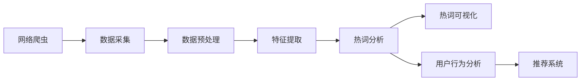
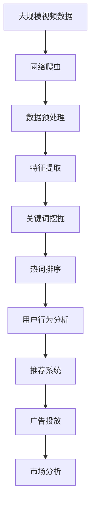

                 

# 基于网络爬虫与数据挖掘的视频网站热词分析

> 关键词：视频网站,热词分析,网络爬虫,数据挖掘,自然语言处理,NLP

## 1. 背景介绍

### 1.1 问题由来

随着互联网的普及和视频网站技术的不断进步，视频内容在各类线上平台如优酷、爱奇艺、腾讯视频等得到广泛应用。而视频网站热词分析则是了解用户兴趣、追踪视频内容流行趋势的重要手段，有助于优化视频内容推荐、提高用户粘性、获取商业价值等。

视频网站热词分析主要涉及到视频内容文本数据的收集、处理、挖掘与可视化展示。在互联网时代，文本数据的规模之大、变化之快使得传统的数据处理方式无法满足需求，因此需要借助先进的数据挖掘和自然语言处理技术，进行快速有效的数据处理和分析。

### 1.2 问题核心关键点

视频网站热词分析的核心目标是通过对视频内容文本数据的挖掘分析，找出用户关注度高的关键词，进而对用户兴趣、热门视频内容、视频流行趋势等进行全面的了解。

具体而言，主要包括以下几个方面：
- 视频内容文本数据的收集。
- 文本数据预处理与特征提取。
- 关键词分析与热词排序。
- 用户行为分析与趋势预测。

通过基于网络爬虫与数据挖掘的热词分析，能够快速、准确地识别视频网站的热词，为视频内容推荐、用户兴趣分析提供有力的支持。

### 1.3 问题研究意义

视频网站热词分析在优化用户体验、提升视频内容质量、推动内容推荐系统的发展方面具有重要意义：
- 优化用户体验：通过分析热门视频内容与用户兴趣，视频网站可以更精准地推送用户感兴趣的视频，提升用户体验。
- 提升视频内容质量：根据热词分析结果，视频网站可以指导内容创作者制作热门内容，提高视频内容质量。
- 推动内容推荐系统发展：热词分析结果可以用于优化推荐算法，实现更加精准的用户视频推荐。

此外，热词分析还能为视频网站的商业模式优化、广告投放、市场分析等提供决策支持。

## 2. 核心概念与联系

### 2.1 核心概念概述

为更好地理解基于网络爬虫与数据挖掘的视频网站热词分析方法，本节将介绍几个密切相关的核心概念：

- 网络爬虫(Crawlers)：通过模拟网络浏览器的行为，从网页上提取文本数据的一种自动化程序。
- 数据挖掘(Data Mining)：从数据中自动发现有用信息和知识的过程，是挖掘大量数据中的潜在规律和有价值的信息的技术。
- 自然语言处理(Natural Language Processing, NLP)：研究如何让计算机理解、分析、处理自然语言的理论与技术。
- 热词分析(Trend Analysis)：从大量文本中提取出热门关键词，并按照关注度进行排序分析的过程。
- 推荐系统(Recommendation System)：通过分析用户行为、偏好等数据，为用户推荐感兴趣物品的系统。

这些核心概念之间的逻辑关系可以通过以下Mermaid流程图来展示：



这个流程图展示了从网络爬虫采集数据，到数据预处理、特征提取、热词分析、热词可视化，再到用户行为分析和推荐系统的完整流程。

### 2.2 概念间的关系

这些核心概念之间存在着紧密的联系，形成了基于网络爬虫与数据挖掘的视频网站热词分析的整体生态系统。下面我们通过几个Mermaid流程图来展示这些概念之间的关系。

#### 2.2.1 视频网站热词分析流程图


这个流程图展示了视频网站热词分析的基本流程，即从视频内容文本采集到热词排序，再到用户行为分析和推荐系统的全过程。

#### 2.2.2 数据挖掘在视频网站热词分析中的作用


这个流程图展示了数据挖掘在视频网站热词分析中的关键作用，包括文本挖掘、关键词提取、热词分析和用户行为分析。

#### 2.2.3 网络爬虫在视频网站热词分析中的作用


这个流程图展示了网络爬虫在视频网站热词分析中的关键作用，包括视频内容文本采集、数据预处理、特征提取、关键词挖掘、热词排序和推荐系统。

### 2.3 核心概念的整体架构

最后，我们用一个综合的流程图来展示这些核心概念在大语言模型微调过程中的整体架构：



这个综合流程图展示了从大规模视频数据采集到用户行为分析的全过程，以及热词分析对广告投放和市场分析的影响。

## 3. 核心算法原理 & 具体操作步骤
### 3.1 算法原理概述

基于网络爬虫与数据挖掘的视频网站热词分析，其核心算法原理可以归纳为以下几个步骤：

1. 视频内容文本采集：利用网络爬虫自动化地从视频网站上爬取视频标题、描述、评论等文本数据。
2. 文本数据预处理：对采集到的文本数据进行清洗、去噪、分词、词性标注等处理。
3. 特征提取与关键词挖掘：利用TF-IDF、词频等方法，从文本中提取出关键词，并进行权重计算。
4. 热词排序：将提取出的关键词按照关注度进行排序，找出视频网站的热词。
5. 热词可视化与用户行为分析：将热词可视化展示，并对用户行为进行分析。
6. 推荐系统优化：根据热词分析结果，优化推荐算法，提高推荐效果。

### 3.2 算法步骤详解

#### 3.2.1 视频内容文本采集

视频内容文本采集是视频网站热词分析的基础。一般步骤如下：

1. 选择视频网站：根据目标受众，选择合适的视频网站进行数据采集。
2. 爬虫设计：设计网络爬虫，模拟浏览器行为，获取视频网站的网页内容。
3. 数据提取：利用HTML解析技术，从网页中提取视频标题、描述、评论等文本数据。
4. 数据存储：将提取到的文本数据存储到数据库或文件系统中，以便后续处理。

#### 3.2.2 文本数据预处理

文本数据预处理是视频网站热词分析的关键环节，涉及以下几个步骤：

1. 清洗：去除噪音数据，如HTML标签、特殊字符等。
2. 分词：利用中文分词工具，如jieba分词，将文本分解为单个词汇。
3. 去停用词：去除无意义的停用词，如“的”、“是”等。
4. 词性标注：利用自然语言处理工具，对词汇进行词性标注。
5. 标准化：将不同形式的词汇转换为统一形式，如统一为小写字母。

#### 3.2.3 特征提取与关键词挖掘

特征提取与关键词挖掘是通过统计分析，从文本数据中提取出有意义的关键词和短语。

1. 特征提取：使用TF-IDF、词频等方法，对文本中的每个词汇进行权重计算。
2. 关键词挖掘：利用关键词提取算法，如TextRank、PageRank等，从文本中提取出关键词。
3. 权重计算：对提取出的关键词，计算其在文本中的权重，作为热词排序的依据。

#### 3.2.4 热词排序

热词排序是将提取出的关键词按照关注度进行排序，找出视频网站的热词。

1. 计算关注度：根据关键词在文本中出现的频率和权重，计算关键词的关注度。
2. 排序：利用排序算法，如快速排序、归并排序等，将关键词按照关注度进行排序。
3. 热词展示：将排序后的关键词展示出来，形成热词分析结果。

#### 3.2.5 热词可视化与用户行为分析

热词可视化与用户行为分析是通过图表展示和数据分析，对热词进行分析。

1. 热词图表展示：将排序后的关键词以图表形式展示，如条形图、折线图等。
2. 用户行为分析：分析用户对热词的互动情况，如点击量、评论量等。
3. 趋势预测：根据热词的变化趋势，预测未来的热门视频内容。

#### 3.2.6 推荐系统优化

推荐系统优化是根据热词分析结果，优化推荐算法，提高推荐效果。

1. 构建推荐模型：根据用户历史行为数据和热词分析结果，构建推荐模型。
2. 优化推荐算法：优化推荐算法，提高推荐的准确性和个性化程度。
3. 评估推荐效果：利用A/B测试等方法，评估推荐效果，不断迭代优化。

### 3.3 算法优缺点

基于网络爬虫与数据挖掘的视频网站热词分析方法具有以下优点：

1. 自动化高效：网络爬虫可以自动获取大量视频内容文本数据，快速高效地完成数据采集。
2. 数据覆盖广：通过网络爬虫，能够覆盖更多视频网站的文本数据，提供全面的热词分析结果。
3. 分析结果精准：利用数据挖掘和自然语言处理技术，提取关键词并计算权重，形成精准的热词分析结果。

同时，也存在以下缺点：

1. 爬虫受限：网络爬虫的行为受限于网站设置的爬虫策略，可能无法获取全部数据。
2. 数据噪音多：视频网站上的文本数据质量参差不齐，存在大量噪音和错误。
3. 用户隐私问题：爬取视频网站数据可能涉及用户隐私，需注意法律和道德问题。

### 3.4 算法应用领域

视频网站热词分析在众多领域都有广泛应用：

1. 视频内容推荐：通过热词分析，优化推荐算法，推荐热门视频内容。
2. 用户行为分析：分析用户对热词的互动情况，了解用户兴趣和需求。
3. 广告投放优化：根据热词分析结果，优化广告投放策略，提高广告效果。
4. 市场分析：分析热词变化趋势，预测市场发展方向，优化视频内容制作。
5. 舆情监测：监测用户对热门视频的评论和反馈，及时调整视频内容策略。

此外，热词分析还可应用于社交媒体分析、电商网站商品推荐、新闻媒体分析等领域。

## 4. 数学模型和公式 & 详细讲解  
### 4.1 数学模型构建

基于网络爬虫与数据挖掘的视频网站热词分析，涉及以下数学模型：

1. TF-IDF模型：用于计算关键词在文本中的权重。
2. TextRank算法：用于提取关键词。
3. 排序算法：用于将关键词按照关注度排序。

#### 4.1.1 TF-IDF模型

TF-IDF模型是用于衡量文本中关键词重要性的统计模型。其基本思想是，一个关键词的重要性，不仅取决于它在文本中出现的频率，还取决于它在整个语料库中的分布。

设文本集合为 $D$，包含 $n$ 篇文档，第 $i$ 篇文档的长度为 $l_i$。第 $i$ 篇文档中的关键词 $t_j$ 的词频为 $tf_{ij}$，即该关键词在文档中出现的次数。第 $j$ 个关键词在整个语料库中出现的次数为 $df_j$。则该关键词的TF-IDF权重为：

$$
tf_{ij} \cdot idf_j = \frac{tf_{ij}}{l_i} \cdot \frac{1}{\sum_{j=1}^{n}\frac{tf_{ij}}{l_i}}
$$

其中 $tf_{ij}$ 为关键词 $t_j$ 在文档 $i$ 中的词频，$l_i$ 为文档 $i$ 的长度，$df_j$ 为关键词 $t_j$ 在整个语料库中的出现次数。

#### 4.1.2 TextRank算法

TextRank算法是一种基于图论的关键词提取算法。其基本思想是，将文本中的词汇看作图节点，根据它们之间的共现关系构建图，利用PageRank算法计算节点的权重。

设文本集合为 $D$，包含 $n$ 篇文档。第 $i$ 篇文档中的关键词集合为 $T_i$，第 $j$ 个关键词 $t_j$ 的TF-IDF权重为 $w_j$，则节点 $t_j$ 的权重 $p_j$ 为：

$$
p_j = \alpha + (1-\alpha) \cdot \frac{1}{k} \cdot \sum_{i=1}^{n} \sum_{t_i \in T_i} w_i \cdot \frac{N_{ij}}{N_i}
$$

其中 $p_j$ 为节点 $t_j$ 的权重，$\alpha$ 为阻尼系数，$k$ 为节点数目，$N_i$ 为节点 $i$ 的出度，$N_{ij}$ 为节点 $i$ 与节点 $j$ 的共现关系。

#### 4.1.3 排序算法

排序算法用于将提取出的关键词按照关注度进行排序。常用的排序算法包括快速排序、归并排序、堆排序等。

设关键词集合为 $T$，关键词集合中第 $j$ 个关键词的权重为 $w_j$，则排序后的关键词集合 $T_{sorted}$ 为：

$$
T_{sorted} = \{ t_j \mid j = 1, 2, ..., n \}，其中 \{ w_j \mid j = 1, 2, ..., n \} 按照关注度从大到小排序。
$$

### 4.2 公式推导过程

#### 4.2.1 TF-IDF模型推导

设文本集合为 $D$，包含 $n$ 篇文档，第 $i$ 篇文档的长度为 $l_i$。第 $i$ 篇文档中的关键词集合为 $T_i$，第 $j$ 个关键词 $t_j$ 在文档中出现的次数为 $tf_{ij}$。第 $j$ 个关键词在整个语料库中出现的次数为 $df_j$。则第 $j$ 个关键词的TF-IDF权重为：

$$
w_j = \frac{tf_{ij}}{l_i} \cdot \frac{1}{\sum_{j=1}^{n}\frac{tf_{ij}}{l_i}}
$$

其中 $tf_{ij}$ 为关键词 $t_j$ 在文档 $i$ 中的词频，$l_i$ 为文档 $i$ 的长度，$df_j$ 为关键词 $t_j$ 在整个语料库中的出现次数。

#### 4.2.2 TextRank算法推导

设文本集合为 $D$，包含 $n$ 篇文档。第 $i$ 篇文档中的关键词集合为 $T_i$，第 $j$ 个关键词 $t_j$ 的TF-IDF权重为 $w_j$。设关键词集合中第 $j$ 个关键词的权重为 $p_j$，则：

$$
p_j = \alpha + (1-\alpha) \cdot \frac{1}{k} \cdot \sum_{i=1}^{n} \sum_{t_i \in T_i} w_i \cdot \frac{N_{ij}}{N_i}
$$

其中 $p_j$ 为节点 $t_j$ 的权重，$\alpha$ 为阻尼系数，$k$ 为节点数目，$N_i$ 为节点 $i$ 的出度，$N_{ij}$ 为节点 $i$ 与节点 $j$ 的共现关系。

#### 4.2.3 排序算法推导

设关键词集合为 $T$，关键词集合中第 $j$ 个关键词的权重为 $w_j$。则排序后的关键词集合 $T_{sorted}$ 为：

$$
T_{sorted} = \{ t_j \mid j = 1, 2, ..., n \}，其中 \{ w_j \mid j = 1, 2, ..., n \} 按照关注度从大到小排序。
$$

### 4.3 案例分析与讲解

#### 4.3.1 案例背景

某视频网站需要对用户行为进行分析，优化视频内容推荐。该网站拥有数百万用户，每天产生大量的视频评论和反馈数据。为了了解用户对视频的兴趣和需求，网站决定进行热词分析，找出热门视频内容和用户关注的热门话题。

#### 4.3.2 数据采集

网站使用网络爬虫自动化地从视频网站上爬取视频评论数据，包括视频标题、描述、用户评论等。爬虫设计为多线程、异步请求，以避免对网站造成过大的压力。

#### 4.3.3 文本数据预处理

对采集到的文本数据进行预处理，去除噪音数据，如HTML标签、特殊字符等。使用jieba分词对文本进行分词，去除停用词。对不同形式的词汇进行标准化处理，统一为小写字母。

#### 4.3.4 特征提取与关键词挖掘

利用TF-IDF模型计算每个关键词的权重。使用TextRank算法提取关键词，并按照TF-IDF权重排序。将排序后的关键词作为视频内容的热词。

#### 4.3.5 热词排序

将提取出的关键词按照关注度进行排序，找出视频网站的热词。使用快速排序算法将关键词按照权重从大到小排序。

#### 4.3.6 热词可视化与用户行为分析

将排序后的关键词以条形图形式展示，并分析用户对热词的互动情况，如点击量、评论量等。利用A/B测试等方法，评估推荐效果，不断迭代优化。

## 5. 项目实践：代码实例和详细解释说明
### 5.1 开发环境搭建

在进行视频网站热词分析的项目实践前，我们需要准备好开发环境。以下是使用Python进行Scrapy和NLTK开发的开发环境配置流程：

1. 安装Anaconda：从官网下载并安装Anaconda，用于创建独立的Python环境。

2. 创建并激活虚拟环境：
```bash
conda create -n pyenv python=3.8 
conda activate pyenv
```

3. 安装Scrapy：通过pip安装Scrapy，使用以下命令：
```bash
pip install scrapy
```

4. 安装NLTK：通过pip安装NLTK，使用以下命令：
```bash
pip install nltk
```

5. 安装各类工具包：
```bash
pip install numpy pandas scikit-learn matplotlib tqdm jupyter notebook ipython
```

完成上述步骤后，即可在`pyenv`环境中开始热词分析实践。

### 5.2 源代码详细实现

下面以视频网站热词分析为例，给出使用Scrapy和NLTK进行热词分析的Python代码实现。

首先，定义Scrapy爬虫类，实现对视频网站的网页内容爬取：

```python
import scrapy

class VideoSpider(scrapy.Spider):
    name = "videospider"
    start_urls = ["http://www.ys.com/"]
    
    def parse(self, response):
        # 解析视频页面
        video_urls = response.css('a.video-link::attr(href)').extract()
        for url in video_urls:
            yield scrapy.Request(url=url, callback=self.parse_video)
    
    def parse_video(self, response):
        # 解析视频页面
        video_title = response.css('h1.video-title::text').extract_first()
        video_description = response.css('p.video-desc::text').extract_first()
        video_comments = response.css('div.comment::text').extract()
        
        # 将视频信息存储到数据库或文件系统中
        data = {
            'title': video_title,
            'description': video_description,
            'comments': video_comments
        }
        yield data
```

然后，定义特征提取函数，利用NLTK工具进行文本预处理和特征提取：

```python
import nltk
from nltk.corpus import stopwords
from nltk.tokenize import word_tokenize, sent_tokenize
from nltk.stem import SnowballStemmer
from sklearn.feature_extraction.text import TfidfVectorizer

# 加载停用词
stop_words = set(stopwords.words('english'))

# 定义文本预处理函数
def preprocess_text(text):
    # 分词
    tokens = word_tokenize(text)
    # 去除停用词
    tokens = [word for word in tokens if word.lower() not in stop_words]
    # 词性标注
    pos_tags = nltk.pos_tag(tokens)
    # 去除标点符号
    tokens = [word for word, tag in pos_tags if tag.startswith('N')]
    # 词形还原
    stemmer = SnowballStemmer('english')
    tokens = [stemmer.stem(word) for word in tokens]
    # 返回处理后的文本
    return ' '.join(tokens)

# 定义特征提取函数
def extract_features(text):
    # 进行文本预处理
    preprocessed_text = preprocess_text(text)
    # 构建TF-IDF向量
    vectorizer = TfidfVectorizer()
    features = vectorizer.fit_transform([preprocessed_text])
    # 返回特征
    return features.toarray().flatten()
```

接着，定义关键词提取函数，利用TextRank算法提取关键词：

```python
import networkx as nx
from nltk.tokenize import word_tokenize
from nltk.corpus import stopwords
from nltk.stem import SnowballStemmer

# 加载停用词
stop_words = set(stopwords.words('english'))

# 定义关键词提取函数
def extract_keywords(text):
    # 分词
    tokens = word_tokenize(text)
    # 去除停用词
    tokens = [word for word in tokens if word.lower() not in stop_words]
    # 词性标注
    pos_tags = nltk.pos_tag(tokens)
    # 去除标点符号
    tokens = [word for word, tag in pos_tags if tag.startswith('N')]
    # 词形还原
    stemmer = SnowballStemmer('english')
    tokens = [stemmer.stem(word) for word in tokens]
    # 构建图
    G = nx.Graph()
    for i in range(len(tokens)):
        for j in range(i+1, len(tokens)):
            if tokens[i] in tokens[j]:
                G.add_edge(i, j)
    # 计算权重
    p = nx.pagerank(G)
    # 获取前N个关键词
    keywords = sorted(p, key=p.get, reverse=True)[:N]
    # 返回关键词
    return keywords
```

最后，将上述函数整合到视频网站热词分析的完整代码中：

```python
import requests
import pandas as pd
import numpy as np
from nltk.corpus import stopwords
from nltk.tokenize import word_tokenize, sent_tokenize
from nltk.stem import SnowballStemmer
from sklearn.feature_extraction.text import TfidfVectorizer
from sklearn.decomposition import TruncatedSVD
from scipy.sparse import csr_matrix
import networkx as nx

# 加载停用词
stop_words = set(stopwords.words('english'))

# 定义文本预处理函数
def preprocess_text(text):
    # 分词
    tokens = word_tokenize(text)
    # 去除停用词
    tokens = [word for word in tokens if word.lower() not in stop_words]
    # 词性标注
    pos_tags = nltk.pos_tag(tokens)
    # 去除标点符号
    tokens = [word for word, tag in pos_tags if tag.startswith('N')]
    # 词形还原
    stemmer = SnowballStemmer('english')
    tokens = [stemmer.stem(word) for word in tokens]
    # 返回处理后的文本
    return ' '.join(tokens)

# 定义特征提取函数
def extract_features(text):
    # 进行文本预处理
    preprocessed_text = preprocess_text(text)
    # 构建TF-IDF向量
    vectorizer = TfidfVectorizer()
    features = vectorizer.fit_transform([preprocessed_text])
    # 返回特征
    return features.toarray().flatten()

# 定义关键词提取函数
def extract_keywords(text):
    # 分词
    tokens = word_tokenize(text)
    # 去除停用词
    tokens = [word for word in tokens if word.lower() not in stop_words]
    # 词性标注
    pos_tags = nltk.pos_tag(tokens)
    # 去除标点符号
    tokens = [word for word, tag in pos_tags if tag.startswith('N')]
    # 词形还原
    stemmer = SnowballStemmer('english')
    tokens = [stemmer.stem(word) for word in tokens]
    # 构建图
    G = nx.Graph()
    for i in range(len(tokens)):
        for j in range(i

