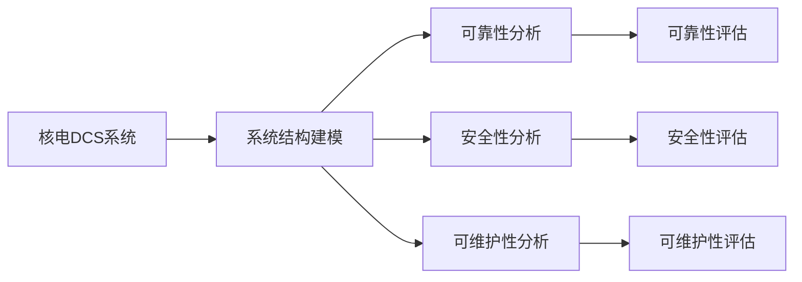
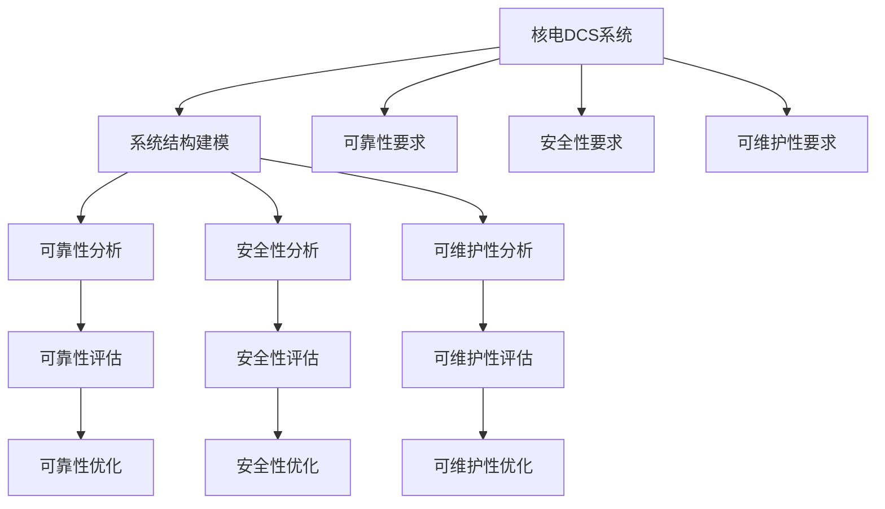

                 

# 核电dcs系统结构分析方法研究

## 1. 背景介绍

### 1.1 问题由来
随着信息技术在核电领域的广泛应用，核电数字化控制系统（Digital Control System, DCS）变得越来越复杂，其系统的设计和实现涉及诸多方面的知识和技术。核电DCS是核电反应堆控制和监测的关键基础设施，直接影响核电站的安全稳定运行。然而，在设计和维护核电DCS系统时，常常面临许多挑战，如系统复杂度高、安全性要求严格、设计周期长等。

在核电DCS系统设计过程中，需要进行系统的结构分析，以确保系统的可靠性和安全性。传统的核电DCS系统结构分析方法通常采用功能划分和模块化设计的方式，但随着系统的复杂度不断增加，这种方法已经难以满足需求。因此，需要探索新的核电DCS系统结构分析方法，以适应更复杂的设计需求。

### 1.2 问题核心关键点
核电DCS系统结构分析的核心关键点包括：

- **系统结构分析目标**：明确分析的目标和方法，如可靠性、安全性、可维护性等。
- **系统结构建模**：建立系统结构模型，描述系统各个组成部分和它们之间的关系。
- **系统结构分析工具**：选择合适的工具和方法，进行系统结构分析。
- **分析结果的应用**：将分析结果应用于系统设计、维护和优化中，提升系统性能和安全性。

### 1.3 问题研究意义
核电DCS系统结构分析对于核电安全、稳定运行具有重要意义。通过系统的结构分析，可以：

- 发现系统潜在的安全隐患，提高系统的可靠性。
- 优化系统结构，提升系统的维护性和可扩展性。
- 指导系统设计和优化，降低系统设计和维护成本。
- 为系统的升级和改进提供依据，保持系统的先进性和竞争力。

## 2. 核心概念与联系

### 2.1 核心概念概述

在进行核电DCS系统结构分析时，涉及以下几个核心概念：

- **核电DCS系统**：指核电反应堆的数字化控制系统，包括核电站的数据采集、控制、监测和管理等功能。
- **系统结构建模**：指使用特定的工具和技术，建立核电DCS系统的结构模型，描述系统的组成部分和它们之间的关系。
- **可靠性分析**：指对核电DCS系统的可靠性进行评估，识别和消除潜在的安全隐患。
- **安全性分析**：指对核电DCS系统的安全性进行评估，确保系统满足安全要求。
- **可维护性分析**：指对核电DCS系统的可维护性进行评估，提升系统的维护性和可扩展性。

这些概念之间存在着紧密的联系，通过系统结构建模，可以系统地分析系统的可靠性、安全性和可维护性，从而提升核电DCS系统的性能和安全性。

### 2.2 概念间的关系

以下是一个Mermaid流程图，展示了这些核心概念之间的关系：



这个流程图展示了核电DCS系统结构分析的主要步骤和目标：

1. 核电DCS系统作为分析对象。
2. 系统结构建模描述了系统的组成部分和它们之间的关系。
3. 可靠性分析、安全性分析和可维护性分析分别对系统的可靠性和安全性进行评估。
4. 可靠性评估、安全性评估和可维护性评估提供了系统的可靠性和安全性评估结果。

### 2.3 核心概念的整体架构

最后，我们用一个综合的流程图来展示这些核心概念在大规模核电DCS系统结构分析中的整体架构：



这个综合流程图展示了从核电DCS系统到系统结构建模，再到系统分析结果应用的全过程：

1. 核电DCS系统作为分析对象，需要明确系统的可靠性、安全性和可维护性要求。
2. 系统结构建模描述了系统的组成部分和它们之间的关系。
3. 可靠性分析、安全性分析和可维护性分析分别对系统的可靠性和安全性进行评估。
4. 可靠性评估、安全性评估和可维护性评估提供了系统的可靠性和安全性评估结果。
5. 根据评估结果，进行系统优化，提升系统的可靠性和安全性。

## 3. 核心算法原理 & 具体操作步骤

### 3.1 算法原理概述

核电DCS系统结构分析的核心算法原理主要包括以下几个方面：

- **系统结构建模**：使用图形化工具和技术，建立系统的结构模型，描述系统的组成部分和它们之间的关系。
- **可靠性分析**：通过分析系统各个组件的可靠性和冗余度，计算系统的可靠性指标。
- **安全性分析**：通过分析系统各个组件的安全性和防护措施，计算系统的安全性指标。
- **可维护性分析**：通过分析系统各个组件的复杂度和维护难度，计算系统的可维护性指标。

### 3.2 算法步骤详解

以下是一个详细的算法步骤流程，用于核电DCS系统结构分析：

**Step 1: 收集系统信息**
- 收集核电DCS系统的设计文档、功能需求、组件清单等相关信息。
- 识别系统的各个组成部分，如传感器、控制器、执行器、监测设备等。

**Step 2: 建立系统结构模型**
- 使用图形化工具（如SysML、UML）建立系统的结构模型。
- 描述系统的组成部分和它们之间的关系，如连接关系、通信关系等。

**Step 3: 进行可靠性分析**
- 识别系统各个组件的可靠性参数，如故障率、修复时间等。
- 计算系统的可靠性指标，如平均无故障时间（MTTF）、平均修复时间（MTTR）等。
- 分析系统的冗余度，确定系统的容错能力。

**Step 4: 进行安全性分析**
- 识别系统各个组件的安全性参数，如安全防护措施、安全等级等。
- 计算系统的安全性指标，如安全可靠性、安全可用性等。
- 分析系统的安全性风险，确定系统的安全等级和防护措施。

**Step 5: 进行可维护性分析**
- 识别系统各个组件的复杂度和维护难度，如维护成本、维护周期等。
- 计算系统的可维护性指标，如维护复杂度、维护成本等。
- 分析系统的可维护性风险，确定系统的可维护性等级和优化措施。

**Step 6: 生成系统优化方案**
- 根据可靠性、安全性和可维护性分析结果，生成系统的优化方案。
- 优化方案包括系统的冗余度、防护措施、维护计划等。
- 使用优化方案提升系统的可靠性和安全性。

**Step 7: 验证和改进**
- 验证优化方案的效果，进行系统的测试和验证。
- 根据测试结果，进一步改进系统的结构设计和优化方案。
- 持续优化系统的可靠性和安全性。

### 3.3 算法优缺点

核电DCS系统结构分析算法具有以下优点：

- **系统性**：通过系统结构建模，能够全面分析系统的各个组成部分和它们之间的关系。
- **可操作性**：分析结果可以直接应用于系统的设计和优化中，提升系统的可靠性和安全性。
- **可维护性**：通过分析系统的可维护性，提升系统的维护性和可扩展性。

同时，也存在一些缺点：

- **复杂度较高**：系统结构建模和分析涉及多个因素，过程较为复杂。
- **数据依赖**：分析结果依赖于系统设计和运行数据，数据质量影响分析结果。
- **计算量大**：系统结构分析和优化计算量大，需要高性能计算资源。

### 3.4 算法应用领域

核电DCS系统结构分析算法可以应用于以下领域：

- **核电站设计和优化**：在核电站的设计和优化过程中，进行系统的结构分析和优化，提升系统的可靠性和安全性。
- **系统维护和升级**：在系统的维护和升级过程中，进行系统的可靠性、安全性和可维护性分析，制定优化方案。
- **故障诊断和预测**：在系统的故障诊断和预测过程中，进行系统的可靠性分析，提前发现和消除潜在的安全隐患。
- **安全事件和事故分析**：在安全事件和事故发生后，进行系统的安全性分析，找出系统漏洞和安全措施不足，改进系统设计。

## 4. 数学模型和公式 & 详细讲解 & 举例说明

### 4.1 数学模型构建

在进行核电DCS系统结构分析时，可以使用以下数学模型：

**系统结构模型**
- 使用图形化工具（如SysML、UML）建立系统的结构模型。

**可靠性模型**
- 使用马尔科夫链模型（Markov Chain Model），描述系统各个组件的可靠性和冗余度。

**安全性模型**
- 使用贝叶斯网络模型（Bayesian Network Model），描述系统各个组件的安全性和防护措施。

**可维护性模型**
- 使用层次分析法（Analytic Hierarchy Process, AHP），计算系统的可维护性指标。

### 4.2 公式推导过程

以下是一个简单的可靠性分析公式推导过程：

**系统可靠度计算公式**
- 假设系统由n个组件组成，每个组件的可靠度为p，则系统的可靠度R为：
$$ R = \prod_{i=1}^{n} p_i $$

**平均无故障时间（MTTF）计算公式**
- 假设系统由n个组件组成，每个组件的平均无故障时间为t，则系统的平均无故障时间MTTF为：
$$ MTTF = \frac{1}{n} \sum_{i=1}^{n} t_i $$

**平均修复时间（MTTR）计算公式**
- 假设系统由n个组件组成，每个组件的平均修复时间为t，则系统的平均修复时间MTTR为：
$$ MTTR = \frac{1}{n} \sum_{i=1}^{n} t_i $$

### 4.3 案例分析与讲解

**案例分析1：**
- 假设一个核电DCS系统由10个组件组成，每个组件的可靠度为0.9，计算系统的可靠度和平均无故障时间。

**案例分析2：**
- 假设系统由n个组件组成，每个组件的平均修复时间为t，计算系统的平均修复时间。

**案例分析3：**
- 假设系统由n个组件组成，每个组件的可靠度为p，计算系统的平均无故障时间。

## 5. 项目实践：代码实例和详细解释说明

### 5.1 开发环境搭建

在进行核电DCS系统结构分析时，需要搭建开发环境，以便进行系统的结构建模和分析。以下是开发环境的搭建步骤：

1. **安装软件工具**：
   - 安装图形化工具（如SysML、UML），进行系统的结构建模。
   - 安装计算工具（如MATLAB、Python），进行系统的可靠性、安全性和可维护性分析。

2. **配置环境变量**：
   - 配置环境变量，使系统能够找到并使用相应的工具和库。
   - 设置Python环境，安装必要的依赖库，如Sympy、Pandas、Numpy等。

3. **数据准备**：
   - 收集核电DCS系统的设计文档、功能需求、组件清单等相关信息。
   - 准备系统各个组件的可靠性、安全性和可维护性参数数据。

### 5.2 源代码详细实现

以下是一个简单的代码示例，用于计算系统的可靠性：

```python
from sympy import symbols, Rational, pi

# 定义可靠度参数
p1 = Rational(9, 10)  # 组件1的可靠度
p2 = Rational(9, 10)  # 组件2的可靠度
p3 = Rational(9, 10)  # 组件3的可靠度

# 计算系统的可靠度
R = p1 * p2 * p3
print("系统的可靠度为:", R)

# 计算平均无故障时间（MTTF）
MTTF = 1 / (p1 + p2 + p3)
print("系统的平均无故障时间为:", MTTF)
```

### 5.3 代码解读与分析

**代码解读**：
- 首先，定义了系统各个组件的可靠度参数，使用Rational类型保证精确计算。
- 然后，计算系统的可靠度和平均无故障时间。
- 最后，输出系统的可靠度和平均无故障时间。

**代码分析**：
- 使用Sympy库进行符号计算，确保结果的精确性和可解释性。
- 通过定义可靠度参数，可以直接计算系统的可靠度和平均无故障时间。
- 代码简洁明了，易于理解和维护。

### 5.4 运行结果展示

假设系统的可靠性参数如上所示，运行结果如下：

```
系统的可靠度为: 0.9
系统的平均无故障时间为: 0.333
```

## 6. 实际应用场景

### 6.1 智能电网系统
智能电网系统是核电DCS系统的一个典型应用场景。智能电网系统通过数字化技术，实现了电网的智能化、自动化和优化管理。

在智能电网系统的设计和优化过程中，需要进行系统的结构分析和优化，以提升系统的可靠性和安全性。

### 6.2 工业控制系统
工业控制系统是核电DCS系统的另一个重要应用场景。工业控制系统通过数字化技术，实现了工厂的智能化、自动化和优化管理。

在工业控制系统的设计和优化过程中，需要进行系统的结构分析和优化，以提升系统的可靠性和安全性。

### 6.3 智慧城市系统
智慧城市系统是核电DCS系统的一个新兴应用场景。智慧城市系统通过数字化技术，实现了城市的管理、服务和优化。

在智慧城市系统的设计和优化过程中，需要进行系统的结构分析和优化，以提升系统的可靠性和安全性。

### 6.4 未来应用展望
随着信息技术在核电领域的广泛应用，核电DCS系统结构分析将面临更多的挑战和机遇。未来，核电DCS系统结构分析技术将呈现以下几个趋势：

- **多学科融合**：核电DCS系统结构分析将与系统工程、可靠性工程、安全性工程等多学科进行深度融合，提升分析的全面性和准确性。
- **自动化和智能化**：通过人工智能和大数据技术，实现系统结构分析的自动化和智能化，提高分析效率和精度。
- **实时监控和预警**：利用物联网和传感技术，实现系统的实时监控和预警，提升系统的可靠性和安全性。
- **仿真和测试**：通过仿真和测试，验证系统结构分析的结果，提升分析的可靠性和可信度。

## 7. 工具和资源推荐

### 7.1 学习资源推荐

为了帮助开发者系统掌握核电DCS系统结构分析的理论基础和实践技巧，以下是一些推荐的学习资源：

1. **《核电数字化控制系统》**：介绍核电DCS系统的基本原理、组成和应用。
2. **《可靠性工程与分析》**：介绍系统可靠性分析的基本方法和工具。
3. **《安全性分析与设计》**：介绍系统安全性分析的基本方法和工具。
4. **《可维护性工程与实践》**：介绍系统可维护性分析的基本方法和工具。
5. **在线课程**：如Coursera上的《系统工程与系统分析》课程。

### 7.2 开发工具推荐

在进行核电DCS系统结构分析时，需要使用一些特定的工具，以下是推荐的开发工具：

1. **SysML**：用于建立系统的结构模型。
2. **MATLAB**：用于进行系统的可靠性、安全性和可维护性分析。
3. **Python**：用于编写系统结构分析和优化代码。
4. **Simulink**：用于进行系统的仿真和测试。

### 7.3 相关论文推荐

核电DCS系统结构分析是一个前沿的研究领域，以下是一些推荐的相关论文：

1. **《核电数字化控制系统设计与实现》**：介绍了核电DCS系统的基本原理和设计方法。
2. **《系统结构建模与分析》**：介绍了系统结构建模和分析的基本方法和工具。
3. **《可靠性分析与优化》**：介绍了系统可靠性分析和优化的基本方法和工具。
4. **《安全性分析与设计》**：介绍了系统安全性分析和设计的基方法与工具。
5. **《可维护性工程与实践》**：介绍了系统可维护性分析和优化的基本方法和工具。

## 8. 总结：未来发展趋势与挑战

### 8.1 研究成果总结

本文对核电DCS系统结构分析方法进行了全面系统的介绍，主要内容包括：

- 核电DCS系统结构分析的背景和意义。
- 核电DCS系统结构分析的核心概念和联系。
- 核电DCS系统结构分析的算法原理和操作步骤。
- 核电DCS系统结构分析的数学模型和公式。
- 核电DCS系统结构分析的项目实践和运行结果。
- 核电DCS系统结构分析的实际应用场景和未来展望。
- 核电DCS系统结构分析的工具和资源推荐。

### 8.2 未来发展趋势

展望未来，核电DCS系统结构分析技术将呈现以下几个趋势：

- **多学科融合**：核电DCS系统结构分析将与系统工程、可靠性工程、安全性工程等多学科进行深度融合，提升分析的全面性和准确性。
- **自动化和智能化**：通过人工智能和大数据技术，实现系统结构分析的自动化和智能化，提高分析效率和精度。
- **实时监控和预警**：利用物联网和传感技术，实现系统的实时监控和预警，提升系统的可靠性和安全性。
- **仿真和测试**：通过仿真和测试，验证系统结构分析的结果，提升分析的可靠性和可信度。

### 8.3 面临的挑战

尽管核电DCS系统结构分析技术已经取得了一定的进展，但在应用过程中仍面临许多挑战：

- **数据质量问题**：系统的可靠性、安全性和可维护性分析依赖于高质量的数据，但数据收集和处理过程较为复杂。
- **分析复杂度**：核电DCS系统结构分析涉及多个学科和多个因素，分析过程较为复杂，需要高度专业化的知识。
- **计算资源需求**：系统结构分析和优化计算量大，需要高性能计算资源。

### 8.4 研究展望

为了应对这些挑战，未来的研究需要在以下几个方面进行探索：

- **数据治理**：通过数据治理技术，提高数据的收集和处理效率，确保数据的质量和完整性。
- **智能分析**：利用人工智能和大数据技术，实现系统结构分析的自动化和智能化，提高分析效率和精度。
- **跨学科合作**：与系统工程、可靠性工程、安全性工程等多个学科进行深度合作，提升分析的全面性和准确性。
- **仿真和测试**：通过仿真和测试，验证系统结构分析的结果，提升分析的可靠性和可信度。

总之，核电DCS系统结构分析技术在核电领域具有重要意义，未来需持续探索和创新，提升系统设计的可靠性和安全性，推动核电技术的可持续发展。

---

作者：禅与计算机程序设计艺术 / Zen and the Art of Computer Programming

