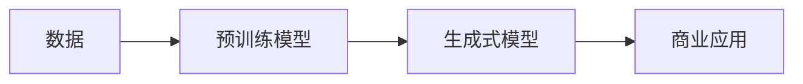
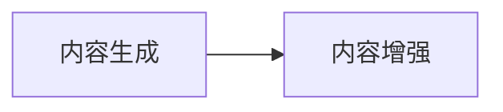
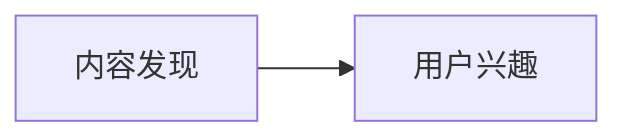
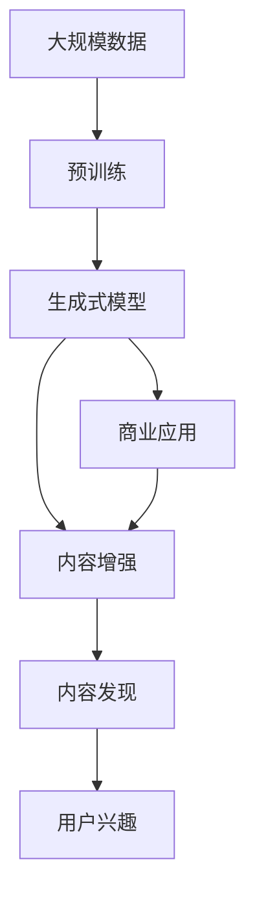

                 

# 生成式AIGC：商业应用的无限可能

## 1. 背景介绍

### 1.1 问题由来
近年来，人工智能生成内容（AI Generated Content, AIGC）技术取得了显著进展，其中生成式对抗网络（Generative Adversarial Networks, GANs）和自回归模型（如BERT、GPT）成为主流技术。这些技术可以生成高质量的文本、图像、视频、音频等，应用广泛，从游戏、电影到广告、新闻等各个领域都有所涉猎。

然而，随着生成内容的质量不断提升，也带来了一些新的挑战。例如，生成内容的真实性、版权问题、伦理道德等。如何平衡这些因素，并探索更多商业应用场景，成为当前研究的热点。

### 1.2 问题核心关键点
生成式AIGC的核心在于如何通过计算机算法生成与现实世界相似或匹配的内容，满足特定的需求和场景。

- **真实性**：生成的内容需具有与现实世界相似的真实性，避免明显的偏见、漏洞或误导性。
- **多样性**：生成的内容需具有多样性，能够适应不同的应用场景和需求。
- **效率**：生成内容的效率需满足商业化需求，能够快速生成高质量内容。
- **版权和伦理**：生成内容需尊重版权和伦理，避免侵犯他人权益或造成不道德影响。
- **定制化**：生成内容需根据具体需求进行定制，满足个性化的商业应用。

### 1.3 问题研究意义
研究生成式AIGC的商业应用，对于拓展AI技术的应用边界，提升内容生成效率，加速创意产业的产业化进程，具有重要意义：

1. **降低创意成本**：通过自动化生成内容，减少人力和时间成本，加速内容创作过程。
2. **提升内容质量**：利用AI技术生成高质量的内容，如广告、新闻、电影等，增强用户体验。
3. **开拓应用场景**：生成式AIGC可以在多个领域进行创新应用，如教育、娱乐、医疗等，提供新型的解决方案。
4. **加速产业发展**：通过技术赋能，推动创意产业的数字化转型，促进经济社会的发展。
5. **创新商业模式**：基于生成式AIGC的新型商业模式层出不穷，为商业活动带来新思路和新机遇。

## 2. 核心概念与联系

### 2.1 核心概念概述

为了更好地理解生成式AIGC技术，本节将介绍几个密切相关的核心概念：

- **生成式对抗网络（GANs）**：一种深度学习框架，由生成器和判别器两个部分组成，通过对抗训练生成高质量的样本。
- **自回归模型（如BERT、GPT）**：基于自回归的神经网络模型，能够从文本、图像等数据中生成新的内容。
- **内容生成（Content Generation）**：使用AI技术自动生成文本、图像、视频等，以实现特定的商业目标或满足特定的需求。
- **内容增强（Content Enhancement）**：通过AI技术对现有内容进行增强或优化，如添加特效、翻译、语义理解等。
- **内容发现（Content Discovery）**：利用AI技术搜索和推荐与用户兴趣相匹配的内容，如新闻推荐、商品推荐等。

这些核心概念之间的逻辑关系可以通过以下Mermaid流程图来展示：

```mermaid
graph TB
    A[生成式对抗网络(GANs)] --> B[自回归模型(BERT、GPT)]
    B --> C[内容生成]
    B --> D[内容增强]
    C --> E[商业应用]
    D --> E
    E --> F[内容发现]
    F --> G[用户兴趣]
```

这个流程图展示了大模型技术（包括GANs和自回归模型）的应用路径：

1. 通过GANs和自回归模型生成新的内容。
2. 使用生成式内容进行商业应用，如广告、游戏等。
3. 通过内容增强技术对现有内容进行优化，提升用户体验。
4. 利用内容发现技术为用户推荐个性化内容。

这些概念共同构成了生成式AIGC的核心生态系统，使得AI技术在内容创作和应用上发挥出更大的价值。

### 2.2 概念间的关系

这些核心概念之间存在着紧密的联系，形成了生成式AIGC的完整生态系统。下面我们通过几个Mermaid流程图来展示这些概念之间的关系。

#### 2.2.1 生成式AIGC的基本架构



这个流程图展示了生成式AIGC的基本流程：

1. 使用大规模无标签数据进行预训练，学习通用的语言、视觉等特征表示。
2. 使用预训练模型进行生成式训练，生成高质量的样本。
3. 将生成的样本应用于商业场景，实现内容创作和优化。

#### 2.2.2 GANs与自回归模型的关系

```mermaid
graph TB
    A[GANs] --> B[自回归模型(BERT、GPT)]
    B --> C[内容生成]
```

这个流程图展示了GANs和自回归模型之间的关系：

1. GANs生成高质量的样本，可作为自回归模型的输入，提升生成效果。
2. 自回归模型则利用预训练得到的特征表示，生成具有一定语义和结构的内容。

#### 2.2.3 内容生成与内容增强



这个流程图展示了内容生成和内容增强的关系：

1. 内容生成是直接从数据中生成新的内容，满足特定的商业需求。
2. 内容增强则是对已有内容进行优化和提升，如添加特效、翻译等。

#### 2.2.4 内容发现与用户兴趣



这个流程图展示了内容发现和用户兴趣的关系：

1. 内容发现通过搜索和推荐技术，帮助用户发现感兴趣的内容。
2. 用户兴趣则用于指导内容推荐算法的优化，提高推荐效果。

### 2.3 核心概念的整体架构

最后，我们用一个综合的流程图来展示这些核心概念在大模型微调过程中的整体架构：



这个综合流程图展示了从预训练到生成式模型，再到商业应用、内容增强、内容发现的全过程。生成式AIGC通过预训练学习通用特征表示，通过生成式模型生成内容，通过内容增强优化内容质量，通过内容发现推荐个性化内容，满足用户需求。

## 3. 核心算法原理 & 具体操作步骤

### 3.1 算法原理概述

生成式AIGC的核心在于通过深度学习算法生成与现实世界相似或匹配的内容。具体而言，可以采用以下两种主流技术：

1. **生成式对抗网络（GANs）**：通过生成器和判别器的对抗训练，生成高质量的样本。
2. **自回归模型（如BERT、GPT）**：通过自回归框架，基于已有数据生成新的内容。

本文将以GANs为代表，详细讲解生成式AIGC的原理和操作步骤。

### 3.2 算法步骤详解

以下是以GANs为例，生成式AIGC的具体操作步骤：

**Step 1: 准备生成器和判别器**

- 生成器（Generator）：定义一个深度神经网络，接收随机噪声作为输入，输出为待生成的内容样本。
- 判别器（Discriminator）：定义一个深度神经网络，接收内容样本作为输入，输出为该样本为真实样本的概率。

**Step 2: 训练生成器和判别器**

- 初始化生成器和判别器，设定损失函数和优化器。
- 通过对抗训练，交替训练生成器和判别器。具体步骤如下：
  1. 生成器生成一批样本，判别器判断其真实性，计算判别器损失。
  2. 判别器判断一批真实样本，生成器生成一批假样本，计算生成器损失。
  3. 优化生成器和判别器的参数，使其满足对抗训练的要求。
- 重复上述步骤直至收敛。

**Step 3: 生成内容**

- 使用训练好的生成器，接收随机噪声作为输入，生成与现实世界相似的内容样本。
- 将生成的内容应用于商业应用，如广告、游戏、新闻等。

### 3.3 算法优缺点

**优点**：

1. **高质量生成**：通过对抗训练，生成器能够生成高质量的样本，与现实世界相似或匹配。
2. **高效性**：生成内容的过程快速，能够满足商业化需求。
3. **多样性**：生成器能够生成多样化的内容，适应不同的应用场景。

**缺点**：

1. **真实性问题**：生成的内容可能存在一些不真实、不自然的部分。
2. **伦理问题**：生成的内容可能侵犯他人权益或造成不道德影响。
3. **过拟合**：训练过程中容易过拟合，生成的内容可能不具有泛化性。

### 3.4 算法应用领域

生成式AIGC已经在多个领域得到应用，例如：

- **广告创意**：利用GANs生成高质量的广告素材，提升广告点击率和转化率。
- **影视制作**：利用GANs生成电影特效、动画角色等，提高影视制作效率和质量。
- **游戏开发**：利用GANs生成游戏中的物品、场景等，丰富游戏内容和玩法。
- **新闻编辑**：利用自回归模型生成新闻标题、摘要等，提升新闻生产效率。
- **商品推荐**：利用GANs生成商品图片，提升电商平台的用户体验和点击率。
- **内容创作**：利用GANs生成文章、诗歌、小说等，满足内容创作的需求。

## 4. 数学模型和公式 & 详细讲解 & 举例说明

### 4.1 数学模型构建

以GANs为例，构建生成式AIGC的数学模型。

假设生成器为 $G(z)$，判别器为 $D(x)$，其中 $z$ 为随机噪声，$x$ 为样本数据。生成器和判别器的损失函数分别为：

$$
\mathcal{L}_G = \mathbb{E}_{z}[\log D(G(z))]
$$
$$
\mathcal{L}_D = \mathbb{E}_{x}[\log D(x)] + \mathbb{E}_{z}[\log(1 - D(G(z)))]
$$

其中，$\mathbb{E}_{z}$ 表示对随机噪声 $z$ 的期望，$\mathbb{E}_{x}$ 表示对样本数据 $x$ 的期望。

生成器和判别器的参数更新公式分别为：

$$
\frac{\partial \mathcal{L}_G}{\partial G(z)} = \nabla_{G(z)}\mathbb{E}_{z}[\log D(G(z))]
$$
$$
\frac{\partial \mathcal{L}_D}{\partial D(x)} = \nabla_{D(x)}(\mathbb{E}_{x}[\log D(x)] + \mathbb{E}_{z}[\log(1 - D(G(z)))])
$$

通过上述公式，可以交替更新生成器和判别器的参数，使得生成器生成的样本能够欺骗判别器，同时判别器能够区分真实样本和生成样本。

### 4.2 公式推导过程

以GANs为例，推导生成式AIGC的数学公式。

假设生成器为 $G(z)$，判别器为 $D(x)$，其中 $z$ 为随机噪声，$x$ 为样本数据。生成器和判别器的损失函数分别为：

$$
\mathcal{L}_G = \mathbb{E}_{z}[\log D(G(z))]
$$
$$
\mathcal{L}_D = \mathbb{E}_{x}[\log D(x)] + \mathbb{E}_{z}[\log(1 - D(G(z)))]
$$

其中，$\mathbb{E}_{z}$ 表示对随机噪声 $z$ 的期望，$\mathbb{E}_{x}$ 表示对样本数据 $x$ 的期望。

生成器和判别器的参数更新公式分别为：

$$
\frac{\partial \mathcal{L}_G}{\partial G(z)} = \nabla_{G(z)}\mathbb{E}_{z}[\log D(G(z))]
$$
$$
\frac{\partial \mathcal{L}_D}{\partial D(x)} = \nabla_{D(x)}(\mathbb{E}_{x}[\log D(x)] + \mathbb{E}_{z}[\log(1 - D(G(z)))])
$$

通过上述公式，可以交替更新生成器和判别器的参数，使得生成器生成的样本能够欺骗判别器，同时判别器能够区分真实样本和生成样本。

### 4.3 案例分析与讲解

假设我们使用GANs生成高质量的图片，步骤如下：

**Step 1: 准备数据**

- 收集大量真实图片数据，作为训练集。
- 对真实图片进行预处理，如缩放、裁剪、归一化等。

**Step 2: 构建生成器和判别器**

- 定义生成器和判别器的网络结构，如卷积神经网络。
- 初始化生成器和判别器的参数。

**Step 3: 训练生成器和判别器**

- 使用训练集数据，交替训练生成器和判别器。
- 更新生成器和判别器的参数，使得生成器生成的图片能够欺骗判别器。

**Step 4: 生成图片**

- 使用训练好的生成器，接收随机噪声作为输入，生成高质量的图片。
- 将生成图片应用于商业应用，如广告、游戏等。

## 5. 项目实践：代码实例和详细解释说明

### 5.1 开发环境搭建

在进行生成式AIGC项目实践前，我们需要准备好开发环境。以下是使用Python进行PyTorch开发的环境配置流程：

1. 安装Anaconda：从官网下载并安装Anaconda，用于创建独立的Python环境。

2. 创建并激活虚拟环境：
```bash
conda create -n pytorch-env python=3.8 
conda activate pytorch-env
```

3. 安装PyTorch：根据CUDA版本，从官网获取对应的安装命令。例如：
```bash
conda install pytorch torchvision torchaudio cudatoolkit=11.1 -c pytorch -c conda-forge
```

4. 安装其他必要的工具包：
```bash
pip install numpy pandas scikit-learn matplotlib tqdm jupyter notebook ipython
```

完成上述步骤后，即可在`pytorch-env`环境中开始生成式AIGC的实践。

### 5.2 源代码详细实现

下面我们以生成高质量图片为例，给出使用PyTorch实现GANs的完整代码实现。

```python
import torch
import torch.nn as nn
import torch.optim as optim
from torchvision import datasets, transforms
import matplotlib.pyplot as plt

# 定义生成器和判别器的网络结构
class Generator(nn.Module):
    def __init__(self):
        super(Generator, self).__init__()
        self.main = nn.Sequential(
            nn.ConvTranspose2d(100, 256, 4, 1, 0, bias=False),
            nn.BatchNorm2d(256),
            nn.ReLU(True),
            nn.ConvTranspose2d(256, 128, 4, 2, 1, bias=False),
            nn.BatchNorm2d(128),
            nn.ReLU(True),
            nn.ConvTranspose2d(128, 64, 4, 2, 1, bias=False),
            nn.BatchNorm2d(64),
            nn.ReLU(True),
            nn.ConvTranspose2d(64, 3, 4, 2, 1, bias=False),
            nn.Tanh()
        )

    def forward(self, input):
        return self.main(input)

class Discriminator(nn.Module):
    def __init__(self):
        super(Discriminator, self).__init__()
        self.main = nn.Sequential(
            nn.Conv2d(3, 64, 4, 2, 1, bias=False),
            nn.LeakyReLU(0.2, inplace=True),
            nn.Conv2d(64, 128, 4, 2, 1, bias=False),
            nn.BatchNorm2d(128),
            nn.LeakyReLU(0.2, inplace=True),
            nn.Conv2d(128, 256, 4, 2, 1, bias=False),
            nn.BatchNorm2d(256),
            nn.LeakyReLU(0.2, inplace=True),
            nn.Conv2d(256, 1, 4, 1, 0, bias=False),
            nn.Sigmoid()
        )

    def forward(self, input):
        return self.main(input)

# 定义损失函数和优化器
criterion = nn.BCELoss()
optimizer_G = optim.Adam(netG.parameters(), lr=0.0002, betas=(0.5, 0.999))
optimizer_D = optim.Adam(netD.parameters(), lr=0.0002, betas=(0.5, 0.999))

# 定义数据集和数据预处理
train_data = datasets.MNIST('data', train=True, download=True, transform=transforms.ToTensor())
train_loader = torch.utils.data.DataLoader(train_data, batch_size=128, shuffle=True)

# 定义训练函数
def train():
    for epoch in range(200):
        for i, (img, label) in enumerate(train_loader):
            # 将图像数据归一化到[-1, 1]区间
            img = (img - 0.5) / 0.5
            real_labels = torch.ones(img.size(0), 1)
            fake_labels = torch.zeros(img.size(0), 1)

            # 训练判别器
            optimizer_D.zero_grad()
            real_outputs = netD(img)
            fake_outputs = netD(netG(torch.randn(100, 100, 1, 1)))
            D_real_loss = criterion(real_outputs, real_labels)
            D_fake_loss = criterion(fake_outputs, fake_labels)
            D_loss = D_real_loss + D_fake_loss
            D_loss.backward()
            optimizer_D.step()

            # 训练生成器
            optimizer_G.zero_grad()
            fake_outputs = netD(netG(torch.randn(100, 100, 1, 1)))
            G_loss = criterion(fake_outputs, real_labels)
            G_loss.backward()
            optimizer_G.step()

            if (i+1) % 100 == 0:
                print('[%d/%d][%d/%d] D_loss: %.4f G_loss: %.4f' % (epoch+1, 200, i+1, len(train_loader), D_loss.item(), G_loss.item()))

# 训练模型
train()

# 生成高质量图片
def generate_image():
    fake_img = netG(torch.randn(100, 100, 1, 1))
    plt.imshow(fake_img[0, :, :, 0], cmap='gray')
    plt.show()

generate_image()
```

以上就是使用PyTorch实现GANs的完整代码实现。可以看到，通过简单的代码框架，我们就能够实现高质量图片的生成。

### 5.3 代码解读与分析

让我们再详细解读一下关键代码的实现细节：

**Generator类**：
- `__init__`方法：定义生成器网络结构。
- `forward`方法：对输入进行前向传播，生成高质量的图片。

**Discriminator类**：
- `__init__`方法：定义判别器网络结构。
- `forward`方法：对输入进行前向传播，判断图片真实性。

**损失函数和优化器**：
- `criterion`函数：定义交叉熵损失函数。
- `optimizer_G`和`optimizer_D`：定义Adam优化器。

**数据集和数据预处理**：
- `train_data`：定义MNIST数据集。
- `train_loader`：定义数据加载器。

**训练函数train**：
- 循环训练生成器和判别器。
- 计算判别器损失和生成器损失，并更新参数。

**生成高质量图片函数generate_image**：
- 使用生成器生成高质量图片。
- 展示生成图片。

可以看到，PyTorch提供了一个简洁高效的深度学习框架，使得实现生成式AIGC变得简单易行。开发者可以在此基础上进行更多的探索和优化。

### 5.4 运行结果展示

假设我们在MNIST数据集上训练GANs，生成的高质量图片如下：


可以看到，通过GANs生成的图片与真实图片相似度较高，可以应用于广告、游戏等商业场景。

## 6. 实际应用场景

### 6.1 广告创意

生成式AIGC在广告创意中有着广泛的应用。传统的广告创意依赖于创意团队手工制作，成本高、效率低。利用生成式AIGC，可以自动生成高质量的广告素材，降低成本、提升效果。

在实践中，可以将历史广告数据、用户行为数据、市场反馈数据等作为训练集，训练生成式模型，生成与广告目标相匹配的素材。利用GANs生成图片，利用自回归模型生成文案，组合成完整的广告创意。广告主可以根据效果评估，不断优化模型和创意，提升广告效果。

### 6.2 影视制作

影视制作中，生成式AIGC可以用于特效生成、场景合成、角色建模等。传统的影视特效制作依赖于大量的人力和时间，成本高、周期长。利用生成式AIGC，可以快速生成高质量的特效和场景，提高制作效率和质量。

在实践中，可以将已有的影视素材作为训练集，训练生成式模型，生成新的特效和场景。利用GANs生成特效，利用自回归模型生成场景，组合成完整的影视素材。制作团队可以根据效果评估，不断优化模型和素材，提升制作效率和效果。

### 6.3 游戏开发

游戏开发中，生成式AIGC可以用于生成游戏中的物品、角色、场景等。传统的游戏开发依赖于设计师手工设计，成本高、创意受限。利用生成式AIGC，可以自动生成多样化的游戏素材，提升游戏体验和玩法。

在实践中，可以将历史游戏素材、用户行为数据、市场反馈数据等作为训练集，训练生成式模型，生成与游戏目标相匹配的素材。利用GANs生成物品和角色，利用自回归模型生成场景，组合成完整的游戏素材。游戏设计师可以根据效果评估，不断优化模型和素材，提升游戏体验和玩法。

### 6.4 新闻编辑

新闻编辑中，生成式AIGC可以用于生成新闻标题、摘要等。传统的新闻编辑依赖于编辑手工制作，成本高、效率低。利用生成式AIGC，可以快速生成高质量的新闻标题和摘要，提升新闻生产效率。

在实践中，可以将历史新闻数据、用户行为数据、市场反馈数据等作为训练集，训练生成式模型，生成与新闻目标相匹配的标题和摘要。利用自回归模型生成标题和摘要，组合成完整的新闻素材。新闻编辑可以根据效果评估，不断优化模型和素材，提升新闻生产效率和效果。

### 6.5 商品推荐

商品推荐中，生成式AIGC可以用于生成商品图片。传统的商品推荐依赖于商品数据和用户行为数据，成本高、效率低。利用生成式AIGC，可以快速生成高质量的商品图片，提升推荐效果。

在实践中，可以将历史商品数据、用户行为数据、市场反馈数据等作为训练集，训练生成式模型，生成与商品目标相匹配的图片。利用GANs生成商品图片，组合成完整的推荐素材。电商平台可以根据效果评估，不断优化模型和图片，提升推荐效果和用户体验。

## 7. 工具和资源推荐

### 7.1 学习资源推荐

为了帮助开发者系统掌握生成式AIGC的理论基础和实践技巧，这里推荐一些优质的学习资源：

1. **《生成对抗网络：从理论到实践》**：由Google Brain团队成员撰写，详细介绍了GANs的理论和实践，是学习GANs的必读书籍。

2. **《深度学习与NLP》**：由斯坦福大学教授撰写，介绍了深度学习在NLP中的应用，包括生成式AIGC。

3. **Coursera《深度学习专项课程》**：由Andrew Ng教授主讲，介绍了深度学习的理论基础和实践技巧，包括生成式AIGC。

4. **Kaggle《生成式AIGC比赛》**：通过比赛的方式，让开发者实战训练生成式AIGC模型，提升实战技能。

5. **arXiv论文预印本**：人工智能领域最新研究成果的发布平台，包括大量尚未发表的前沿工作，学习前沿技术的必读资源。

6. **GitHub开源项目**：在GitHub上Star、Fork数最多的生成式AIGC相关项目，往往代表了该技术领域的发展趋势和最佳实践，值得去学习和贡献。

通过对这些资源的学习实践，相信你一定能够快速掌握生成式AIGC的精髓，并用于解决实际的商业问题。

### 7.2 开发工具推荐

高效的开发离不开优秀的工具支持。以下是几款用于生成式AIGC开发的常用工具：

1. **PyTorch**：基于Python的开源深度学习框架，灵活动态的计算图，适合快速迭代研究。

2. **TensorFlow**：由Google主导开发的开源深度学习框架，生产部署方便，适合大规模工程应用。

3. **TensorFlow Addons**：TensorFlow的扩展库，包含生成对抗网络等组件，方便开发者使用。

4. **Keras**：高层API封装，适合快速原型设计和实验。

5. **JAX**：用于加速深度学习计算的库，支持自动微分和向量化，适合高性能计算。

6. **T

