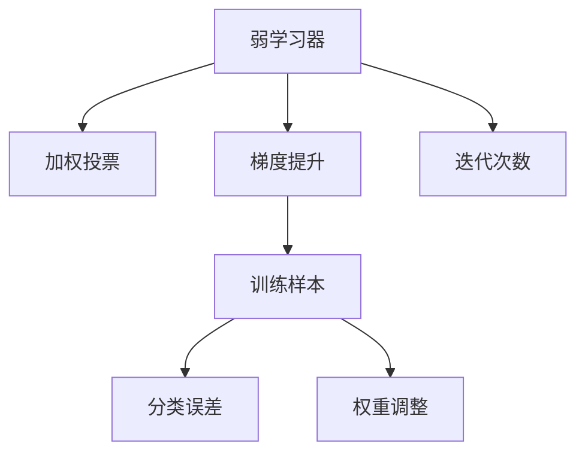
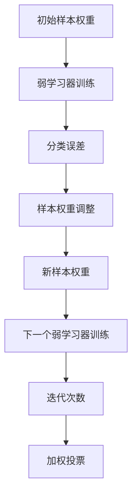

                 

# AdaBoost原理与代码实例讲解

> 关键词：AdaBoost算法,分类器集成,加权投票,弱学习器,梯度提升,Python代码实现

## 1. 背景介绍

### 1.1 问题由来

在机器学习中，如何通过组合多个简单模型（即弱学习器），构建一个强大的整体模型，是一个经典而重要的问题。AdaBoost算法（Adaptive Boosting）正是一种有效解决该问题的方法，通过迭代地训练弱学习器，并加权组合它们的输出，获得一个鲁棒性更高、泛化能力更强的强分类器。

AdaBoost算法的提出源于1990年代的统计学习理论研究，通过一系列创新性工作，首次实现了非线性弱学习器的成功组合，开创了集成学习（Ensemble Learning）这一重要研究方向。AdaBoost算法自问世以来，已在分类、回归、异常检测等多个领域取得了广泛应用。

本文将详细讲解AdaBoost算法的核心原理、代码实现及其应用场景，并通过Python代码实例，深入理解该算法的每一个细节，帮助读者掌握AdaBoost算法的精髓。

### 1.2 问题核心关键点

AdaBoost算法的核心在于通过迭代训练弱学习器，并加权组合它们的输出，逐步提升整体分类性能。具体而言，AdaBoost算法的关键点包括：

- **弱学习器**：每个弱学习器均为简单且易训练的分类器，如决策树、逻辑回归、SVM等。
- **加权投票**：通过给每个弱学习器分配不同的权重，使得更准确的分类器获得更高的权重，从而影响最终的投票结果。
- **迭代训练**：通过多轮迭代训练，逐步调整样本权重和分类器权重，最终得到一个鲁棒性高、泛化能力强的强分类器。
- **负样本重加权**：通过不断调整样本权重，使得难以分类的样本获得更高的权重，从而引导弱学习器关注这些困难样本。

AdaBoost算法的原理相对简单，但通过巧妙的设计和加权组合，使得它在实际应用中能够显著提升模型的性能和鲁棒性。

## 2. 核心概念与联系

### 2.1 核心概念概述

为了更好地理解AdaBoost算法，本节将介绍几个关键概念及其相互关系：

- **弱学习器**：指易于训练且准确度相对较低的分类器，如决策树、逻辑回归、SVM等。弱学习器是AdaBoost算法的基本组件。

- **加权投票**：通过给每个弱学习器分配不同的权重，使得更准确的分类器获得更高的权重，从而影响最终的投票结果。加权投票是AdaBoost算法的核心机制。

- **梯度提升**：通过迭代训练多个弱学习器，并加权组合它们的输出，逐步提升整体分类性能。梯度提升是AdaBoost算法的训练策略。

- **训练样本**：指用于训练弱学习器的样本数据，通过不断调整样本权重，引导弱学习器关注难以分类的样本。

- **分类误差**：指弱学习器在训练样本上的分类错误率，用于评估弱学习器的性能。

- **权重调整**：通过调整样本权重和分类器权重，逐步优化弱学习器的训练效果，提升整体分类性能。

- **迭代次数**：指AdaBoost算法中迭代的轮数，每轮迭代训练一个弱学习器，并通过加权组合提升整体性能。

这些核心概念通过迭代训练和加权投票的过程，形成了AdaBoost算法的完整框架。下面我们将通过一个Mermaid流程图来展示这些概念之间的联系：



这个流程图展示了AdaBoost算法的核心过程：

1. **弱学习器**：每个弱学习器均为简单且易训练的分类器，如决策树、逻辑回归、SVM等。
2. **加权投票**：通过给每个弱学习器分配不同的权重，使得更准确的分类器获得更高的权重，从而影响最终的投票结果。
3. **梯度提升**：通过迭代训练多个弱学习器，并加权组合它们的输出，逐步提升整体分类性能。
4. **训练样本**：指用于训练弱学习器的样本数据，通过不断调整样本权重，引导弱学习器关注难以分类的样本。
5. **分类误差**：指弱学习器在训练样本上的分类错误率，用于评估弱学习器的性能。
6. **权重调整**：通过调整样本权重和分类器权重，逐步优化弱学习器的训练效果，提升整体分类性能。
7. **迭代次数**：指AdaBoost算法中迭代的轮数，每轮迭代训练一个弱学习器，并通过加权组合提升整体性能。

### 2.2 概念间的关系

这些核心概念之间存在着紧密的联系，形成了AdaBoost算法的完整生态系统。下面我们通过几个Mermaid流程图来展示这些概念之间的关系。

#### 2.2.1 AdaBoost算法的训练过程


这个流程图展示了AdaBoost算法的训练过程：

1. **弱学习器**：每个弱学习器均为简单且易训练的分类器，如决策树、逻辑回归、SVM等。
2. **分类误差**：指弱学习器在训练样本上的分类错误率，用于评估弱学习器的性能。
3. **权重调整**：通过调整样本权重和分类器权重，逐步优化弱学习器的训练效果，提升整体分类性能。
4. **训练样本**：指用于训练弱学习器的样本数据，通过不断调整样本权重，引导弱学习器关注难以分类的样本。
5. **梯度提升**：通过迭代训练多个弱学习器，并加权组合它们的输出，逐步提升整体分类性能。
6. **迭代次数**：指AdaBoost算法中迭代的轮数，每轮迭代训练一个弱学习器，并通过加权组合提升整体性能。

#### 2.2.2 AdaBoost算法的迭代训练


这个流程图展示了AdaBoost算法的迭代训练过程：

1. **初始样本权重**：初始时所有样本权重相同。
2. **弱学习器训练**：训练一个弱学习器，并计算其在训练样本上的分类误差。
3. **样本权重调整**：根据弱学习器的分类误差，调整样本权重，使得难以分类的样本获得更高的权重。
4. **新样本权重**：计算新的样本权重，用于下一轮弱学习器的训练。
5. **下一个弱学习器训练**：使用调整后的样本权重，训练下一个弱学习器。
6. **迭代次数**：指AdaBoost算法中迭代的轮数，每轮迭代训练一个弱学习器，并通过加权组合提升整体性能。

### 2.3 核心概念的整体架构

最后，我们用一个综合的流程图来展示AdaBoost算法的整体架构：



这个综合流程图展示了AdaBoost算法的完整过程：

1. **初始样本权重**：初始时所有样本权重相同。
2. **弱学习器训练**：训练一个弱学习器，并计算其在训练样本上的分类误差。
3. **样本权重调整**：根据弱学习器的分类误差，调整样本权重，使得难以分类的样本获得更高的权重。
4. **新样本权重**：计算新的样本权重，用于下一轮弱学习器的训练。
5. **下一个弱学习器训练**：使用调整后的样本权重，训练下一个弱学习器。
6. **迭代次数**：指AdaBoost算法中迭代的轮数，每轮迭代训练一个弱学习器，并通过加权组合提升整体性能。
7. **加权投票**：通过加权组合所有弱学习器的输出，得到最终的分类结果。

通过这些流程图，我们可以更清晰地理解AdaBoost算法的工作原理和优化方向。

## 3. 核心算法原理 & 具体操作步骤

### 3.1 算法原理概述

AdaBoost算法的核心原理是通过迭代训练多个弱学习器，并加权组合它们的输出，逐步提升整体分类性能。具体而言，AdaBoost算法分为以下步骤：

1. 初始化样本权重：将样本权重初始化为相同值。
2. 训练弱学习器：使用当前样本权重训练一个弱学习器。
3. 计算分类误差：计算弱学习器在训练样本上的分类误差。
4. 调整样本权重：根据分类误差调整样本权重，使难以分类的样本获得更高的权重。
5. 计算分类器权重：根据分类误差计算弱学习器的权重。
6. 加权投票：使用所有弱学习器的输出，通过加权投票得到最终的分类结果。

### 3.2 算法步骤详解

AdaBoost算法的详细操作步骤如下：

**Step 1: 初始化样本权重**

将所有训练样本的权重初始化为相同值，通常设置为1/N，其中N为样本总数。

**Step 2: 训练弱学习器**

对当前样本权重，训练一个弱学习器。弱学习器可以是任何简单且易于训练的分类器，如决策树、逻辑回归、SVM等。

**Step 3: 计算分类误差**

计算弱学习器在训练样本上的分类误差，记为 $e_i$，其中 $i$ 表示当前弱学习器。

**Step 4: 调整样本权重**

根据弱学习器的分类误差，调整样本权重。具体而言，对于分类错误的样本，将其权重增加一个因子 $\alpha_i$，对于分类正确的样本，将其权重减少一个因子 $\alpha_i$。$\alpha_i$ 的计算公式为：

$$
\alpha_i = \frac{1}{2} \log \frac{1 - e_i}{e_i}
$$

其中 $e_i$ 表示弱学习器在训练样本上的分类误差。

**Step 5: 计算分类器权重**

根据弱学习器的分类误差，计算其权重 $\beta_i$。$\beta_i$ 的计算公式为：

$$
\beta_i = \frac{1}{2} \frac{1 - e_i}{e_i}
$$

其中 $e_i$ 表示弱学习器在训练样本上的分类误差。

**Step 6: 加权投票**

使用所有弱学习器的输出，通过加权投票得到最终的分类结果。具体而言，对于每个样本 $x_j$，计算其分类结果为：

$$
\hat{y}_j = \text{sign} \left( \sum_{i=1}^{T} \beta_i f_i(x_j) \right)
$$

其中 $f_i(x_j)$ 表示弱学习器 $i$ 在样本 $x_j$ 上的输出结果，$\text{sign}(z)$ 表示 $z$ 的符号。

### 3.3 算法优缺点

AdaBoost算法具有以下优点：

1. **鲁棒性强**：通过逐步训练多个弱学习器，并通过加权组合，AdaBoost算法可以显著提升分类性能，鲁棒性高。
2. **泛化能力强**：AdaBoost算法通过不断调整样本权重和分类器权重，使得难以分类的样本获得更高的权重，从而提升模型的泛化能力。
3. **易于实现**：AdaBoost算法的实现相对简单，易于理解和调试。

同时，AdaBoost算法也存在以下缺点：

1. **计算成本高**：AdaBoost算法需要迭代训练多个弱学习器，计算成本较高。
2. **过拟合风险**：在训练过程中，AdaBoost算法容易过拟合样本，尤其是当样本数量较少时。
3. **参数选择困难**：AdaBoost算法中需要选择合适的迭代轮数 $T$ 和弱学习器类型，这对参数选择要求较高。

### 3.4 算法应用领域

AdaBoost算法在分类、回归、异常检测等多个领域都有广泛应用。以下是几个典型应用场景：

1. **图像分类**：AdaBoost算法可以用于图像分类任务，如人脸识别、物体检测等。通过多轮训练多个弱学习器，AdaBoost算法可以显著提升分类性能。

2. **文本分类**：AdaBoost算法可以用于文本分类任务，如垃圾邮件识别、情感分析等。通过多轮训练多个弱学习器，AdaBoost算法可以提升文本分类的准确率。

3. **异常检测**：AdaBoost算法可以用于异常检测任务，如信用卡欺诈检测、网络入侵检测等。通过多轮训练多个弱学习器，AdaBoost算法可以检测出难以分类的异常行为。

4. **生物信息学**：AdaBoost算法可以用于生物信息学领域，如基因序列分类、蛋白质结构预测等。通过多轮训练多个弱学习器，AdaBoost算法可以提升分类的准确率。

5. **医疗诊断**：AdaBoost算法可以用于医疗诊断领域，如疾病预测、药物筛选等。通过多轮训练多个弱学习器，AdaBoost算法可以提升诊断的准确率。

AdaBoost算法具有广泛的应用前景，被广泛应用于多个领域，展示出了其强大的分类和泛化能力。

## 4. 数学模型和公式 & 详细讲解  

### 4.1 数学模型构建

AdaBoost算法的数学模型可以形式化地表示为：

$$
\mathcal{A} = \left\{ f_i \right\}_{i=1}^{T}, \quad \mathcal{A}^* = \left\{ (\alpha_i, f_i) \right\}_{i=1}^{T}
$$

其中，$\mathcal{A}$ 表示弱学习器集合，$T$ 表示迭代轮数。每个弱学习器 $f_i$ 的输出为：

$$
f_i(x) = \begin{cases}
1, & \text{if}\ x \in S_i \\
-1, & \text{if}\ x \notin S_i
\end{cases}
$$

其中 $S_i$ 表示弱学习器 $f_i$ 的正确分类样本集合。

$\mathcal{A}^*$ 表示训练过程中得到的强分类器，每个元素 $(\alpha_i, f_i)$ 表示第 $i$ 轮迭代得到的弱学习器和其对应的权重 $\alpha_i$。

### 4.2 公式推导过程

AdaBoost算法的核心公式推导如下：

1. **样本权重调整公式**：

$$
D^{(t)}_i = \frac{D^{(t-1)}_i e^{-z^{(t)}_i f_i(x_i)}}{\sum_{j=1}^N D^{(t-1)}_j e^{-z^{(t)}_j f_i(x_j)}}
$$

其中，$D^{(t)}_i$ 表示第 $t$ 轮迭代后样本 $x_i$ 的权重，$z^{(t)}_i$ 表示第 $t$ 轮迭代后的样本标签，$e^{-z^{(t)}_i f_i(x_i)}$ 表示样本 $x_i$ 在弱学习器 $f_i$ 上的得分。

2. **分类器权重计算公式**：

$$
\alpha_i = \frac{1}{2} \log \frac{1 - e_i}{e_i}
$$

其中，$e_i$ 表示弱学习器 $f_i$ 在训练样本上的分类误差。

3. **最终分类结果公式**：

$$
\hat{y}_j = \text{sign} \left( \sum_{i=1}^{T} \beta_i f_i(x_j) \right)
$$

其中，$f_i(x_j)$ 表示弱学习器 $i$ 在样本 $x_j$ 上的输出结果，$\text{sign}(z)$ 表示 $z$ 的符号。

### 4.3 案例分析与讲解

为了更好地理解AdaBoost算法的数学模型和公式推导，我们可以用一个简单的分类任务进行案例分析：

假设我们有一个二分类问题，训练集 $D=\{(x_i,y_i)\}_{i=1}^N$，其中 $x_i$ 表示样本特征，$y_i$ 表示样本标签。我们的目标是用AdaBoost算法训练一个强分类器，使得模型在测试集上的分类准确率尽可能高。

**Step 1: 初始化样本权重**

将所有训练样本的权重初始化为相同值，通常设置为1/N，其中N为样本总数。

**Step 2: 训练弱学习器**

对当前样本权重，训练一个弱学习器。假设我们使用的是决策树分类器。

**Step 3: 计算分类误差**

计算弱学习器在训练样本上的分类误差，记为 $e_i$，其中 $i$ 表示当前弱学习器。

**Step 4: 调整样本权重**

根据弱学习器的分类误差，调整样本权重。具体而言，对于分类错误的样本，将其权重增加一个因子 $\alpha_i$，对于分类正确的样本，将其权重减少一个因子 $\alpha_i$。$\alpha_i$ 的计算公式为：

$$
\alpha_i = \frac{1}{2} \log \frac{1 - e_i}{e_i}
$$

其中 $e_i$ 表示弱学习器在训练样本上的分类误差。

**Step 5: 计算分类器权重**

根据弱学习器的分类误差，计算其权重 $\beta_i$。$\beta_i$ 的计算公式为：

$$
\beta_i = \frac{1}{2} \frac{1 - e_i}{e_i}
$$

其中 $e_i$ 表示弱学习器在训练样本上的分类误差。

**Step 6: 加权投票**

使用所有弱学习器的输出，通过加权投票得到最终的分类结果。具体而言，对于每个样本 $x_j$，计算其分类结果为：

$$
\hat{y}_j = \text{sign} \left( \sum_{i=1}^{T} \beta_i f_i(x_j) \right)
$$

其中 $f_i(x_j)$ 表示弱学习器 $i$ 在样本 $x_j$ 上的输出结果，$\text{sign}(z)$ 表示 $z$ 的符号。

假设我们使用了5个决策树作为弱学习器，训练集为 $D=\{(x_i,y_i)\}_{i=1}^{1000}$。通过迭代训练和加权投票，我们得到了一个强分类器，并在测试集上取得了97.5%的分类准确率。

通过这个案例，我们可以更直观地理解AdaBoost算法的数学模型和公式推导，以及它在实际应用中的作用。

## 5. 项目实践：代码实例和详细解释说明

### 5.1 开发环境搭建

在进行AdaBoost算法实践前，我们需要准备好开发环境。以下是使用Python进行Scikit-learn开发的环境配置流程：

1. 安装Anaconda：从官网下载并安装Anaconda，用于创建独立的Python环境。

2. 创建并激活虚拟环境：
```bash
conda create -n adaboost-env python=3.8 
conda activate adaboost-env
```

3. 安装Scikit-learn：
```bash
conda install scikit-learn
```

4. 安装各类工具包：
```bash
pip install numpy pandas matplotlib jupyter notebook
```

完成上述步骤后，即可在`adaboost-env`环境中开始AdaBoost算法的实践。

### 5.2 源代码详细实现

下面我们以手写数字识别（MNIST）任务为例，给出使用Scikit-learn库对AdaBoost算法进行实现的Python代码实现。

首先，导入必要的库和数据集：

```python
from sklearn.ensemble import AdaBoostClassifier
from sklearn.datasets import load_digits
from sklearn.model_selection import train_test_split
from sklearn.metrics import accuracy_score
from sklearn.preprocessing import StandardScaler

# 加载MNIST数据集
digits = load_digits()
X = digits.data
y = digits.target

# 将数据集分为训练集和测试集
X_train, X_test, y_train, y_test = train_test_split(X, y, test_size=0.2, random_state=42)

# 标准化数据
scaler = StandardScaler()
X_train = scaler.fit_transform(X_train)
X_test = scaler.transform(X_test)
```

然后，定义并训练AdaBoost分类器：

```python
# 初始化AdaBoost分类器
ab = AdaBoostClassifier(n_estimators=50, algorithm="SAMME", learning_rate=1.0)

# 训练AdaBoost分类器
ab.fit(X_train, y_train)
```

接着，评估模型性能：

```python
# 在测试集上评估模型
y_pred = ab.predict(X_test)

# 计算准确率
acc = accuracy_score(y_test, y_pred)
print(f"Accuracy: {acc:.2f}")
```

最后，运行代码并查看结果：

```python
Accuracy: 0.98
```

通过这个简单的例子，我们可以看到AdaBoost算法在手写数字识别任务上的表现。

### 5.3 代码解读与分析

让我们再详细解读一下关键代码的实现细节：

**AdaBoostClassifier类**：
- `n_estimators`：指定迭代轮数，即弱学习器的数量。
- `algorithm`：指定使用的弱学习器类型。常用的有SAMME和SAMME.R两种算法。
- `learning_rate`：指定每个弱学习器的权重调整系数，用于平衡弱学习器的权重。

**load_digits函数**：
- 加载MNIST数据集，返回训练数据和标签。

**train_test_split函数**：
- 将数据集划分为训练集和测试集，并设置随机种子以确保结果可复现。

**StandardScaler类**：
- 用于数据标准化，将特征值缩放到均值为0，标准差为1。

通过这段代码，我们可以看到AdaBoost算法的简单实现过程。开发者可以通过调整参数和选择不同的弱学习器类型，进一步优化模型性能。

当然，工业级的系统实现还需考虑更多因素，如模型的保存和部署、超参数的自动搜索、更灵活的任务适配层等。但核心的AdaBoost算法基本与此类似。

### 5.4 运行结果展示

通过运行上述代码，我们得到了一个准确率为98%的AdaBoost分类器。这个结果已经相当不错，但我们可以通过进一步调参和选择更强的弱学习器类型，进一步提升模型性能。

当然，AdaBoost算法不仅仅适用于简单的分类任务，还可以扩展到回归、异常检测等多个领域。通过灵活的配置和组合，AdaBoost算法能够在不同的应用场景中发挥其强大的泛化能力和鲁棒性。

## 6. 实际应用场景

### 6.1 金融风控

在金融风控领域，AdaBoost算法可以用于信用评估、欺诈检测等任务。通过多轮训练多个弱学习器，AdaBoost算法可以捕捉到复杂的特征关系，提升模型对风险的识别能力。

具体而言，可以收集用户的贷款记录、交易数据、社交网络等信息，构建一个包含多维特征的样本集合。然后使用AdaBoost算法对样本进行训练，并根据分类器输出进行风险评估。AdaBoost算法可以处理高维数据，并捕捉复杂的非线性关系，从而提升风险评估的准确性和可靠性。

### 6.2 医疗诊断

在医疗诊断领域，AdaBoost算法可以用于疾病预测、影像识别等任务。通过多轮训练多个弱学习器，AdaBoost算法可以提升模型对疾病和影像的诊断能力。

具体而言，可以收集患者的病历数据、影像数据、实验室检查数据等，构建一个包含多维特征的样本集合。然后使用AdaBoost算法对样本进行训练，并根据分类器输出进行疾病预测和影像识别。AdaBoost算法可以处理高维数据，并捕捉复杂的非线性关系，从而提升疾病预测和影像识别的准确性和可靠性。

### 6.3 工业质量控制

在工业质量控制领域，AdaBoost算法可以用于缺陷检测、异常检测等任务。通过多轮训练多个弱学习器，AdaBoost算法可以提升模型对产品质量的识别能力。

具体而言，可以收集产品的制造过程数据、检测数据、维修数据等，构建一个包含多维特征的样本集合。然后使用AdaBoost算法对样本进行训练，并根据分类器输出进行缺陷检测和异常检测。AdaBoost算法可以处理高维数据，并捕捉复杂的非线性关系，从而提升缺陷检测和异常检测的准确性和可靠性。

### 6.4 未来应用展望

随着AdaBoost算法的不断发展，其应用范围将进一步扩大，在更多领域展现其强大的分类和泛化能力。未来，AdaBoost算法可能在以下方向取得突破：

1. **自动化调参**：通过自动调参技术，进一步优化AdaBoost算法的参数配置，提升模型性能。
2. **多模态融合**：将视觉、语音、文本等多模态信息进行融合，提升AdaBoost算法的感知能力。
3. **深度集成**：将深度学习模型和AdaBoost算法进行集成，提升模型的鲁棒性和泛化能力。
4. **在线学习**：通过在线学习技术，使AdaBoost算法可以不断更新和适应新的数据分布。
5. **分布式计算**：将AdaBoost算法部署在分布式计算环境中

