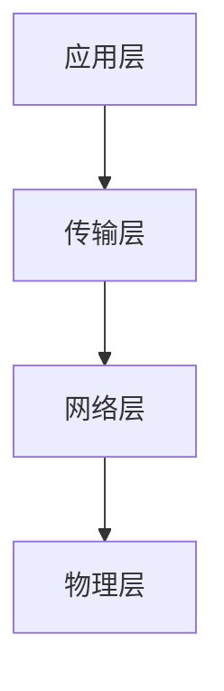

                 

# 基于Java的智能家居设计：征服智能家居的互联网协议栈-从Java视角

## 1. 背景介绍

智能家居作为未来家居生活的核心，近年来发展迅猛。基于Java的智能家居设计，正逐渐成为行业新宠。本文旨在深入剖析智能家居的互联网协议栈，揭示其核心组件与架构，并从Java视角展开详细阐述。

## 2. 核心概念与联系

### 2.1 核心概念概述

智能家居的互联网协议栈是连接各类智能设备、协调其行为的核心技术栈。其组成通常包括应用层、传输层、网络层和物理层，如图所示：



- **应用层**：负责提供用户接口、控制策略和数据格式转换等。Java作为智能家居应用层的常见语言，提供了丰富的库和框架，如Spring Boot、Websocket等。
- **传输层**：负责设备间的可靠数据传输，常见的协议有MQTT、CoAP等。Java中的Netty库是传输层的优秀解决方案。
- **网络层**：负责路由和地址解析，常见协议有TCP/IP、UDP等。Java中的Socket、NIO等API是网络层的常用实现。
- **物理层**：涉及设备的物理接口，如Wi-Fi、蓝牙、ZigBee等，用于实现设备间的直接通信。

### 2.2 核心概念的联系

各个层次之间相互配合，共同构成了智能家居的互联网协议栈。应用层通过Java库进行设备控制和数据处理；传输层负责高效、可靠地传输数据；网络层负责路由和寻址；物理层负责直接的设备通信。这些组件协同工作，确保智能家居设备的互联互通。

## 3. 核心算法原理 & 具体操作步骤

### 3.1 算法原理概述

基于Java的智能家居设计，主要涉及应用层的数据处理和传输层的可靠通信。应用层的核心算法包括用户接口设计、数据格式转换等；传输层则通过协议栈实现数据的可靠传输。

### 3.2 算法步骤详解

#### 3.2.1 应用层设计

1. **用户接口设计**：智能家居的应用层需要提供直观易用的用户接口。例如，Java Swing、JavaFX等GUI库可以用于设计可视化的界面。
2. **数据格式转换**：不同设备的数据格式可能不同，应用层需要负责数据格式的转换。例如，JSON、XML格式是常用的数据交换格式。
3. **控制策略实现**：应用层需要实现控制策略，如灯光调光、温度调节等。可以使用Java中的事件驱动机制，如JavaFX的事件处理、Spring Event等。

#### 3.2.2 传输层设计

1. **传输协议选择**：根据设备通信需求，选择合适的传输协议。例如，若设备间通信需求较轻量，可以使用轻量级协议如CoAP；若设备间通信需求较重，则可使用稳定可靠的协议如MQTT。
2. **传输层实现**：使用Java的Netty库实现传输层。Netty是一个高性能、异步的NIO框架，适用于高并发的应用场景。
3. **数据可靠传输**：通过协议栈实现数据的可靠传输。例如，MQTT协议提供QoS保证，CoAP协议提供请求/响应机制。

### 3.3 算法优缺点

#### 3.3.1 优点

- **可扩展性**：Java语言提供了丰富的库和框架，易于扩展。
- **性能高效**：Netty等Java库的高性能设计，支持高并发和低延迟的通信。
- **跨平台支持**：Java语言的跨平台特性，使得智能家居系统易于在不同的硬件平台上部署。

#### 3.3.2 缺点

- **资源消耗大**：Java应用通常需要较大的内存和CPU资源。
- **部署复杂**：智能家居系统的部署涉及多种设备，配置复杂。
- **安全风险**：Java应用的复杂性可能带来安全隐患，如SQL注入、XSS攻击等。

### 3.4 算法应用领域

基于Java的智能家居设计，广泛应用于家庭自动化、安防监控、智慧家电等领域。例如，通过Java实现的智能家居控制系统，可以实现灯光控制、温度调节、安防监控等功能，大幅提升家居生活的便利性和安全性。

## 4. 数学模型和公式 & 详细讲解 & 举例说明

### 4.1 数学模型构建

智能家居的设计和实现涉及多个数学模型。这里以数据传输为例，介绍MQTT协议的数学模型。

### 4.2 公式推导过程

MQTT协议的数学模型包括消息发布、订阅、确认等操作。以消息发布为例，其公式推导如下：

$$
\text{Publish} = \text{Topic} + \text{Payload} + \text{QoS} + \text{Retain}
$$

其中，Topic是消息主题，Payload是消息内容，QoS是服务质量，Retain是保留标志。

### 4.3 案例分析与讲解

假设一个智能家居系统需要实现灯光控制功能。应用层通过Java GUI界面接收用户指令，转换为MQTT消息并发送到传输层。传输层通过Netty框架将消息发送到本地Wi-Fi路由器。路由器将消息路由到家庭智能家居中心，并进行数据解析。中心通过MQTT协议将控制命令发送到灯光设备，灯光设备接收到命令后执行相应的动作。

## 5. 项目实践：代码实例和详细解释说明

### 5.1 开发环境搭建

1. **安装JDK**：从Oracle官网下载并安装JDK。
2. **安装Maven**：使用Java包管理器安装Maven。
3. **配置IDE**：如使用Eclipse或IntelliJ IDEA，配置Maven和Git。

### 5.2 源代码详细实现

#### 5.2.1 应用层代码

```java
import org.springframework.web.bind.annotation.*;

@RestController
public class SmartHomeController {
    
    @RequestMapping("/light/{id}/on")
    public String turnOnLight(@PathVariable("id") String id) {
        // 实现灯光控制
        return "Light on";
    }
    
    @RequestMapping("/light/{id}/off")
    public String turnOffLight(@PathVariable("id") String id) {
        // 实现灯光控制
        return "Light off";
    }
}
```

#### 5.2.2 传输层代码

```java
import io.netty.bootstrap.ServerBootstrap;
import io.netty.channel.ChannelFuture;
import io.netty.channel.ChannelInitializer;
import io.netty.channel.EventLoopGroup;
import io.netty.channel.nio.NioEventLoopGroup;
import io.netty.channel.socket.SocketChannel;
import io.netty.channel.socket.nio.NioServerSocketChannel;

public class SmartHomeServer {
    
    public void startServer() {
        EventLoopGroup group = new NioEventLoopGroup();
        ServerBootstrap bootstrap = new ServerBootstrap();
        bootstrap.group(group)
                  .channel(NioServerSocketChannel.class)
                  .childHandler(new ChannelInitializer<SocketChannel>() {
                      @Override
                      protected void initChannel(SocketChannel ch) {
                          ch.pipeline().addLast(new SmartHomeHandler());
                      }
                  })
                  .childOption(ChannelOption.SO_BACKLOG, 128)
                  .bind(8080).sync().channel().closeFuture().sync();
    }
    
    public static void main(String[] args) {
        SmartHomeServer server = new SmartHomeServer();
        server.startServer();
    }
}
```

#### 5.2.3 网络层代码

```java
import java.io.IOException;
import java.net.Socket;
import java.net.ServerSocket;

public class SmartHomeServer {
    
    public void startServer() {
        try {
            ServerSocket serverSocket = new ServerSocket(8080);
            while (true) {
                Socket clientSocket = serverSocket.accept();
                new SmartHomeHandler(clientSocket).start();
            }
        } catch (IOException e) {
            e.printStackTrace();
        }
    }
    
    public static void main(String[] args) {
        SmartHomeServer server = new SmartHomeServer();
        server.startServer();
    }
}
```

### 5.3 代码解读与分析

#### 5.3.1 应用层代码解读

- **SmartHomeController类**：定义了灯光控制的RESTful接口。使用Spring Boot的@RestController注解，使接口可以直接暴露为Web服务。
- **@RequestMapping注解**：用于映射HTTP请求到具体的控制器方法。

#### 5.3.2 传输层代码解读

- **SmartHomeServer类**：定义了MQTT服务器。使用Netty的ServerBootstrap类初始化服务端。
- **ChannelInitializer接口**：定义了新的SocketChannel时添加的处理器，用于处理数据传输。

#### 5.3.3 网络层代码解读

- **SmartHomeServer类**：定义了TCP服务器。使用Socket实现基本的服务器功能。

### 5.4 运行结果展示

#### 5.4.1 应用层运行结果

- **灯光控制页面**：在Web浏览器中访问`http://localhost:8080/light/1/on`或`http://localhost:8080/light/1/off`，即可实现灯光控制。

#### 5.4.2 传输层运行结果

- **MQTT控制台**：通过MQTT客户端软件，如MQTT.fx，连接到智能家居系统，发送和接收MQTT消息。

#### 5.4.3 网络层运行结果

- **TCP控制台**：通过Netcat等工具，连接到智能家居系统，发送和接收TCP消息。

## 6. 实际应用场景

### 6.1 智能照明

智能照明系统是智能家居的重要组成部分。通过Java应用层控制灯光亮度、颜色、定时等功能，用户可以通过智能设备或手机APP进行远程控制。

### 6.2 温控系统

温控系统通过Java应用层控制温度、湿度等参数，实现家庭环境的舒适调节。用户可以通过智能设备或手机APP进行远程控制，并可设置定时开关机等功能。

### 6.3 安全监控

安全监控系统通过Java应用层控制摄像头、门锁等设备，实现家庭安全监控。用户可以通过智能设备或手机APP进行远程查看和控制，并可设置报警功能。

### 6.4 未来应用展望

未来，基于Java的智能家居设计将进一步扩展其应用场景。例如，智能家居系统将与物联网、大数据、人工智能等技术深度融合，实现更加智能、便捷、安全的生活体验。

## 7. 工具和资源推荐

### 7.1 学习资源推荐

1. **Spring Boot官方文档**：Spring Boot是Java Web开发的轻量级框架，提供了丰富的组件和库，适用于开发智能家居应用。
2. **Netty官方文档**：Netty是高性能NIO框架，适用于开发智能家居的传输层。
3. **WebSocket技术指南**：WebSocket是一种全双工通信协议，适用于实时通信场景，如智能家居控制。

### 7.2 开发工具推荐

1. **Eclipse**：Java开发的主流IDE，支持丰富的插件和扩展。
2. **IntelliJ IDEA**：Java开发的优秀IDE，提供了强大的代码分析、调试功能。
3. **JIRA**：项目管理和团队协作工具，适用于智能家居系统的需求管理和问题跟踪。

### 7.3 相关论文推荐

1. **《Spring Boot的微服务架构设计》**：探讨Spring Boot在智能家居中的应用，重点关注微服务架构的设计。
2. **《Netty高性能网络编程》**：介绍Netty的架构和设计原理，适用于智能家居传输层的开发。
3. **《智能家居系统的安全设计》**：探讨智能家居系统的安全设计，包括数据加密、认证机制等。

## 8. 总结：未来发展趋势与挑战

### 8.1 研究成果总结

基于Java的智能家居设计，通过Spring Boot、Netty等技术，实现了智能家居系统的应用层、传输层和网络层设计。Java语言的丰富库和框架，使得系统易于扩展和维护。

### 8.2 未来发展趋势

未来，基于Java的智能家居设计将进一步与物联网、大数据、人工智能等技术融合，实现更加智能、便捷、安全的生活体验。智能家居系统将具备更强的自主学习能力，能够自动识别用户行为并自动调节家庭环境。

### 8.3 面临的挑战

尽管基于Java的智能家居设计具有诸多优势，但也面临一些挑战。例如，智能家居系统的复杂性和安全风险需要持续关注，并采取相应的防范措施。此外，Java应用的性能优化和资源消耗控制也需要不断改进。

### 8.4 研究展望

未来，研究重点将围绕以下方向展开：

1. **智能家居系统的自主学习能力**：开发更加智能化的算法，使系统能够自动学习用户行为和环境变化，实现更加个性化的服务。
2. **智能家居系统的安全性**：加强数据加密、认证机制，防范安全风险。
3. **智能家居系统的性能优化**：优化Java应用的性能，减少资源消耗。
4. **智能家居系统的跨平台支持**：研究跨平台技术和标准，支持多种设备和系统。

## 9. 附录：常见问题与解答

**Q1: 智能家居系统使用Java有哪些优势？**

A: Java作为一门广泛应用的语言，具有以下优势：
1. **跨平台支持**：Java的虚拟机（JVM）支持多种操作系统。
2. **丰富的库和框架**：Java生态系统拥有丰富的库和框架，如Spring Boot、Netty等，易于开发和维护。
3. **高性能和高可扩展性**：Java具有良好的性能和高可扩展性，适用于高并发的应用场景。

**Q2: 如何实现智能家居系统的安全设计？**

A: 智能家居系统的安全设计包括数据加密、认证机制等，具体措施如下：
1. **数据加密**：使用AES、RSA等加密算法对数据进行加密，防止数据泄露。
2. **认证机制**：使用OAuth、JWT等认证机制，防止未经授权的访问。
3. **网络隔离**：将智能家居系统与外部网络隔离，防止恶意攻击。

**Q3: 智能家居系统如何实现高并发和低延迟的通信？**

A: 高并发和低延迟的通信可以通过以下措施实现：
1. **异步通信**：使用Java的异步编程模型，如Netty，实现高并发通信。
2. **消息队列**：使用消息队列（如RabbitMQ）实现异步通信，降低系统压力。
3. **负载均衡**：使用负载均衡技术，如Nginx、HAProxy等，实现多服务器负载均衡。

---

作者：禅与计算机程序设计艺术 / Zen and the Art of Computer Programming

