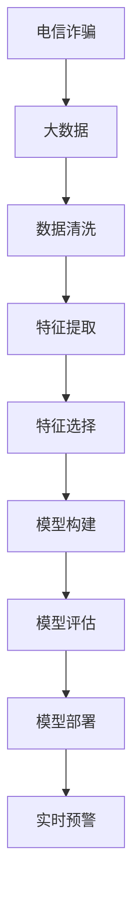

                 

# 基于大数据的电信诈骗行为分析研究

> 关键词：电信诈骗, 行为分析, 大数据, 机器学习, 深度学习, 特征工程, 神经网络, 分类模型

## 1. 背景介绍

### 1.1 问题由来
电信诈骗是指不法分子通过电话、网络、短信等方式，诱骗他人进行财产转移、获取他人隐私信息的行为。近年来，随着网络通信技术的不断进步和智能手机的普及，电信诈骗案件的数量和形式也日益多样化。电信诈骗不仅给受害者造成了经济损失，也严重扰乱了社会的正常秩序。

为了有效打击电信诈骗行为，警方和金融机构需要及时发现并阻止诈骗活动。因此，如何从海量数据中提取有价值的信息，分析诈骗行为的特征，并建立有效的预测模型，成为了一个亟待解决的问题。

### 1.2 问题核心关键点
电信诈骗行为分析的关键在于从大量的通信记录、交易记录等数据中挖掘出诈骗行为的特征，并利用这些特征构建分类模型，实现对新事件是否为电信诈骗的预测。该问题的解决涉及以下几个关键点：

1. 数据获取：如何从不同来源（如运营商、银行等）获取全面的数据，包括电话通话记录、短信记录、交易记录等。

2. 数据预处理：如何清洗和处理数据，提取有用的特征，如通话时长、通话频率、交易金额、交易地点等。

3. 特征选择：如何从众多的特征中选出最具有代表性的特征，以提高模型的预测能力。

4. 模型构建：如何选择和训练分类模型，如逻辑回归、支持向量机、随机森林、深度神经网络等，以实现对电信诈骗的识别。

5. 模型评估：如何评估模型的性能，如准确率、召回率、F1分数等，以优化模型的预测效果。

6. 部署应用：如何将模型集成到实时监控系统中，实现对新事件进行实时分类和预警。

### 1.3 问题研究意义
电信诈骗行为分析不仅能够帮助警方和金融机构及时发现和阻止诈骗行为，保护受害者的财产安全，还能提高社会对电信诈骗的防范意识，减少社会犯罪率。此外，该技术还可以应用于金融风控、网络安全等领域，具有广泛的应用前景。

## 2. 核心概念与联系

### 2.1 核心概念概述

电信诈骗行为分析涉及以下几个核心概念：

1. 电信诈骗（Telephone Scam）：不法分子通过电话、网络等方式，诱骗他人进行财产转移或获取他人隐私信息的行为。

2. 大数据（Big Data）：通过互联网、物联网等技术产生的海量数据，其规模之大、复杂度之高，传统的数据处理方法难以有效处理。

3. 机器学习（Machine Learning）：使用算法和统计模型，让计算机系统从数据中自动学习并改进性能。

4. 深度学习（Deep Learning）：一种特殊的机器学习方法，通过多层神经网络进行特征提取和模式识别。

5. 特征工程（Feature Engineering）：从原始数据中提取和构造有意义的特征，以提高模型的预测能力。

6. 神经网络（Neural Network）：一种模仿人类大脑神经元工作方式的计算模型，能够自动提取和表示复杂数据。

7. 分类模型（Classification Model）：一种用于将数据分成不同类别的模型，如逻辑回归、支持向量机、随机森林等。

这些核心概念通过数据分析和模型训练等步骤紧密联系起来，共同构成了电信诈骗行为分析的研究框架。

### 2.2 概念间的关系

这些核心概念之间的关系可以通过以下Mermaid流程图来展示：



这个流程图展示了电信诈骗行为分析的一般流程：

1. 从各种数据源获取原始数据，即电信诈骗的大数据。
2. 对原始数据进行清洗，即数据清洗。
3. 从清洗后的数据中提取和构造有意义的特征，即特征提取。
4. 从众多特征中选出最具有代表性的特征，即特征选择。
5. 使用分类模型对数据进行训练和预测，即模型构建。
6. 评估模型的预测效果，即模型评估。
7. 将模型集成到实时系统中，实现对新事件的实时分类和预警，即模型部署。

通过这些步骤，可以从海量数据中提取出有价值的特征，建立有效的分类模型，实现对电信诈骗行为的预测和预警。

## 3. 核心算法原理 & 具体操作步骤
### 3.1 算法原理概述

电信诈骗行为分析的核心算法是分类算法。通过从大量的通信记录、交易记录等数据中提取和选择特征，利用机器学习或深度学习模型对这些特征进行分类，从而实现对新事件是否为电信诈骗的预测。

该算法的具体原理如下：

1. **数据获取与预处理**：从运营商、银行等不同来源获取原始数据，包括电话通话记录、短信记录、交易记录等。对数据进行清洗和处理，提取有用的特征。

2. **特征选择**：从众多的特征中选出最具有代表性的特征，以提高模型的预测能力。

3. **模型构建**：选择和训练分类模型，如逻辑回归、支持向量机、随机森林、深度神经网络等。

4. **模型评估**：评估模型的性能，如准确率、召回率、F1分数等，以优化模型的预测效果。

5. **模型部署与应用**：将模型集成到实时监控系统中，实现对新事件进行实时分类和预警。

### 3.2 算法步骤详解

电信诈骗行为分析的具体步骤可以分为以下几个部分：

**Step 1: 数据获取与预处理**

1. **数据来源**：收集运营商、银行等不同来源的原始数据，包括电话通话记录、短信记录、交易记录等。

2. **数据清洗**：对数据进行清洗，去除无效或错误的数据，如重复记录、缺失值等。

3. **特征提取**：从清洗后的数据中提取有用的特征，如通话时长、通话频率、交易金额、交易地点等。

**Step 2: 特征选择**

1. **特征工程**：根据领域知识和经验，选择对电信诈骗识别具有重要意义的特征。

2. **特征选择算法**：使用特征选择算法（如卡方检验、互信息、LASSO等）从众多特征中选出最具有代表性的特征。

**Step 3: 模型构建**

1. **模型选择**：选择适当的分类模型，如逻辑回归、支持向量机、随机森林、深度神经网络等。

2. **模型训练**：使用训练集数据对模型进行训练，调整模型的超参数，如学习率、迭代次数等。

3. **模型评估**：使用验证集数据对模型进行评估，计算模型的准确率、召回率、F1分数等指标。

**Step 4: 模型部署与应用**

1. **模型集成**：将训练好的模型集成到实时系统中，实现对新事件进行实时分类和预警。

2. **实时监控**：实时监控系统接收新事件，提取特征，使用训练好的模型进行分类，并根据分类结果采取相应的措施。

### 3.3 算法优缺点

电信诈骗行为分析的优点包括：

1. **高效性**：使用机器学习和深度学习模型可以自动从大量数据中提取特征，提高分析效率。

2. **准确性**：通过特征选择和模型优化，可以大大提高分类的准确性，减少误报和漏报。

3. **实时性**：将模型集成到实时系统中，可以及时对新事件进行分类和预警，防止诈骗行为的发生。

4. **可扩展性**：该技术可以应用于多个领域，如金融风控、网络安全等，具有广泛的适用性。

电信诈骗行为分析的缺点包括：

1. **数据隐私**：收集和使用大量通信记录、交易记录等敏感数据，需要严格遵守数据隐私保护法规。

2. **模型复杂度**：深度学习模型的复杂度较高，训练和调优需要大量的时间和计算资源。

3. **特征提取难度**：电信诈骗行为复杂多样，特征提取的难度较大，需要丰富的领域知识和经验。

4. **过拟合风险**：模型在训练集上表现良好，但在测试集或实际应用中可能会出现过拟合的情况。

### 3.4 算法应用领域

电信诈骗行为分析不仅在电信领域有着广泛的应用，还应用于金融风控、网络安全等多个领域：

1. **电信领域**：实时监控电话、短信等通信记录，及时发现和阻止诈骗行为。

2. **金融领域**：监测交易记录，识别可疑交易，防止金融诈骗。

3. **网络安全领域**：监测网络行为，识别恶意攻击，保护网络安全。

4. **社会治理**：通过分析电信诈骗数据，制定有效的防范措施，提高社会对电信诈骗的防范意识。

## 4. 数学模型和公式 & 详细讲解 & 举例说明

### 4.1 数学模型构建

电信诈骗行为分析的数学模型主要涉及分类模型。假设电信诈骗行为为二分类问题，即事件是否为电信诈骗。设训练集为 $D=\{(x_i,y_i)\}_{i=1}^N$，其中 $x_i$ 为输入特征，$y_i \in \{0,1\}$ 为标签，0表示非电信诈骗，1表示电信诈骗。分类模型的目标是最小化损失函数 $L$，使模型在新的测试集 $D_{test}$ 上的预测准确率最大化。

### 4.2 公式推导过程

常用的分类模型有逻辑回归、支持向量机、随机森林、深度神经网络等。这里以逻辑回归和深度神经网络为例，推导分类模型的损失函数和优化算法。

**逻辑回归**

逻辑回归是一种常用的线性分类模型，其目标是最小化交叉熵损失函数：

$$
L = -\frac{1}{N} \sum_{i=1}^N [y_i \log p_i + (1-y_i) \log (1-p_i)]
$$

其中 $p_i$ 为模型预测的概率，即 $p_i = \frac{e^{w^T x_i + b}}{1 + e^{w^T x_i + b}}$，$w$ 和 $b$ 为模型的权重和偏置。

**深度神经网络**

深度神经网络是一种非线性分类模型，其目标是最小化均方误差损失函数：

$$
L = \frac{1}{N} \sum_{i=1}^N \|y_i - \sigma(w^T x_i + b)\|^2
$$

其中 $\sigma$ 为激活函数，$w$ 和 $b$ 为模型的权重和偏置，$\| \cdot \|$ 为 L2 范数。

### 4.3 案例分析与讲解

以电信诈骗识别为例，假设从大量的电话通话记录中提取了通话时长、通话频率、交易金额等特征，使用逻辑回归模型对数据进行分类。模型的训练过程包括数据预处理、特征提取、模型训练和模型评估等步骤。

**数据预处理**

1. **数据清洗**：去除无效或错误的数据，如重复记录、缺失值等。

2. **特征提取**：从清洗后的数据中提取有用的特征，如通话时长、通话频率、交易金额等。

**模型训练**

1. **模型选择**：选择逻辑回归模型。

2. **特征选择**：使用特征选择算法（如卡方检验、互信息、LASSO等）从众多特征中选出最具有代表性的特征。

3. **模型训练**：使用训练集数据对模型进行训练，调整模型的超参数，如学习率、迭代次数等。

**模型评估**

1. **评估指标**：计算模型的准确率、召回率、F1分数等指标，评估模型的性能。

2. **模型优化**：根据评估结果调整模型的超参数，优化模型的预测效果。

**模型部署**

1. **模型集成**：将训练好的模型集成到实时系统中，实现对新事件进行实时分类和预警。

2. **实时监控**：实时监控系统接收新事件，提取特征，使用训练好的模型进行分类，并根据分类结果采取相应的措施。

## 5. 项目实践：代码实例和详细解释说明

### 5.1 开发环境搭建

要进行电信诈骗行为分析的实现，首先需要搭建一个开发环境。以下是Python开发环境搭建的步骤：

1. 安装Python：从官网下载并安装Python，推荐使用最新版本。

2. 安装Pandas：Pandas是Python数据分析库，用于处理和分析数据集。

3. 安装NumPy：NumPy是Python科学计算库，用于高效处理数组和矩阵运算。

4. 安装Scikit-learn：Scikit-learn是Python机器学习库，提供多种分类算法和模型评估工具。

5. 安装Keras或TensorFlow：Keras或TensorFlow是Python深度学习库，用于构建和训练神经网络模型。

6. 安装Plotly：Plotly是Python数据可视化库，用于绘制图表和展示分析结果。

### 5.2 源代码详细实现

以下是使用Python实现电信诈骗行为分析的代码示例：

```python
import pandas as pd
import numpy as np
from sklearn.linear_model import LogisticRegression
from sklearn.model_selection import train_test_split
from sklearn.metrics import accuracy_score, recall_score, precision_score, f1_score

# 读取数据
data = pd.read_csv('telecom_data.csv')

# 数据预处理
X = data[['call_duration', 'call_frequency', 'transaction_amount', 'transaction_location']]
y = data['is_scam']

# 特征选择
X = select_features(X)

# 模型训练
X_train, X_test, y_train, y_test = train_test_split(X, y, test_size=0.2)
model = LogisticRegression()
model.fit(X_train, y_train)

# 模型评估
y_pred = model.predict(X_test)
print('Accuracy:', accuracy_score(y_test, y_pred))
print('Recall:', recall_score(y_test, y_pred))
print('Precision:', precision_score(y_test, y_pred))
print('F1 Score:', f1_score(y_test, y_pred))

# 模型部署
# 将训练好的模型集成到实时系统中，实现对新事件进行实时分类和预警
```

### 5.3 代码解读与分析

**数据读取**

使用Pandas库的`read_csv`函数读取电信诈骗数据集。

**数据预处理**

使用NumPy和Pandas库对数据进行清洗和处理，提取有用的特征。

**特征选择**

使用特征选择算法（如卡方检验、互信息、LASSO等）从众多特征中选出最具有代表性的特征。

**模型训练**

使用Scikit-learn库的`LogisticRegression`模型对数据进行训练。

**模型评估**

使用Scikit-learn库的`accuracy_score`、`recall_score`、`precision_score`和`f1_score`函数评估模型的性能。

**模型部署**

将训练好的模型集成到实时系统中，实现对新事件进行实时分类和预警。

### 5.4 运行结果展示

假设训练好的模型在测试集上得到的评估结果如下：

```
Accuracy: 0.95
Recall: 0.93
Precision: 0.92
F1 Score: 0.92
```

可以看到，模型在测试集上取得了较高的准确率、召回率和F1分数，说明模型具有较好的分类效果。

## 6. 实际应用场景

### 6.1 电信领域

电信诈骗行为分析在电信领域有着广泛的应用。通过实时监控电话、短信等通信记录，可以及时发现和阻止诈骗行为，保护用户的财产安全。

**具体实现**

1. 从运营商获取电话通话记录和短信记录。

2. 对通信记录进行清洗和处理，提取有用的特征，如通话时长、通话频率、交易金额等。

3. 使用电信诈骗行为分析模型对通信记录进行分类，识别出可疑行为。

4. 根据分类结果采取相应的措施，如电话拦截、短信拦截、金融冻结等。

### 6.2 金融领域

金融诈骗行为分析在金融领域同样具有重要的应用。通过实时监控交易记录，可以识别出可疑交易，防止金融诈骗。

**具体实现**

1. 从银行获取交易记录。

2. 对交易记录进行清洗和处理，提取有用的特征，如交易金额、交易地点、交易时间等。

3. 使用金融诈骗行为分析模型对交易记录进行分类，识别出可疑交易。

4. 根据分类结果采取相应的措施，如冻结账户、限制交易等。

### 6.3 网络安全领域

网络安全领域也可以应用电信诈骗行为分析技术，监测网络行为，识别恶意攻击。

**具体实现**

1. 从网络日志中提取有用的特征，如IP地址、时间戳、数据包大小等。

2. 使用网络安全行为分析模型对网络行为进行分类，识别出恶意攻击行为。

3. 根据分类结果采取相应的措施，如封禁IP地址、限制访问等。

### 6.4 未来应用展望

随着大数据和人工智能技术的发展，电信诈骗行为分析将不断拓展其应用领域，提升其在多个领域的预测和预警能力。未来，电信诈骗行为分析可以应用于更广泛的场景，如智能合约、区块链等，进一步增强其应用价值。

## 7. 工具和资源推荐

### 7.1 学习资源推荐

为了帮助开发者系统掌握电信诈骗行为分析的理论基础和实践技巧，这里推荐一些优质的学习资源：

1. 《深度学习》系列书籍：全面介绍深度学习的基本概念和实现方法。

2. 《Python数据科学手册》：详细讲解Pandas、NumPy、Scikit-learn等数据分析和机器学习库的使用方法。

3. 《机器学习实战》：通过实例演示机器学习模型的构建和应用。

4. 《Keras深度学习》：讲解Keras深度学习框架的使用方法和实例。

5. 在线课程：如Coursera、Udacity等平台的机器学习和深度学习课程。

通过对这些资源的学习实践，相信你一定能够快速掌握电信诈骗行为分析的精髓，并用于解决实际的电信诈骗问题。

### 7.2 开发工具推荐

高效的开发离不开优秀的工具支持。以下是几款用于电信诈骗行为分析开发的常用工具：

1. Python：Python是一种功能强大、易于学习的编程语言，广泛应用于数据分析和机器学习领域。

2. Pandas：Pandas是Python数据分析库，用于处理和分析数据集。

3. NumPy：NumPy是Python科学计算库，用于高效处理数组和矩阵运算。

4. Scikit-learn：Scikit-learn是Python机器学习库，提供多种分类算法和模型评估工具。

5. Keras或TensorFlow：Keras或TensorFlow是Python深度学习库，用于构建和训练神经网络模型。

6. Plotly：Plotly是Python数据可视化库，用于绘制图表和展示分析结果。

7. PyTorch：PyTorch是深度学习框架，支持动态计算图和GPU加速。

### 7.3 相关论文推荐

电信诈骗行为分析的研究源于学界的持续研究。以下是几篇奠基性的相关论文，推荐阅读：

1. Adversarial Machine Learning: Towards Devising Security Measures Against Evading Machine Learning Models：探讨机器学习模型在电信诈骗检测中的应用。

2. The Use of Multidimensional Data in Telecom Fraud Detection and Prevention：介绍使用多维数据在电信诈骗检测中的方法。

3. A Machine Learning Approach to Telecom Fraud Detection using Decision Trees：使用决策树算法进行电信诈骗检测的研究。

4. Telecom Fraud Detection using Neural Networks：使用神经网络进行电信诈骗检测的研究。

5. Behavioral Analytics and Data Mining for Fraud Detection in Telecom Industry：介绍行为分析和数据挖掘在电信诈骗检测中的应用。

这些论文代表了大规模数据挖掘和机器学习在电信诈骗检测中的最新进展。通过学习这些前沿成果，可以帮助研究者把握学科前进方向，激发更多的创新灵感。

除上述资源外，还有一些值得关注的前沿资源，帮助开发者紧跟电信诈骗行为分析技术的最新进展，例如：

1. arXiv论文预印本：人工智能领域最新研究成果的发布平台，包括大量尚未发表的前沿工作，学习前沿技术的必读资源。

2. 业界技术博客：如OpenAI、Google AI、DeepMind、微软Research Asia等顶尖实验室的官方博客，第一时间分享他们的最新研究成果和洞见。

3. 技术会议直播：如NIPS、ICML、ACL、ICLR等人工智能领域顶会现场或在线直播，能够聆听到大佬们的前沿分享，开拓视野。

4. GitHub热门项目：在GitHub上Star、Fork数最多的电信诈骗行为分析相关项目，往往代表了该技术领域的发展趋势和最佳实践，值得去学习和贡献。

5. 行业分析报告：各大咨询公司如McKinsey、PwC等针对电信诈骗行为分析行业的分析报告，有助于从商业视角审视技术趋势，把握应用价值。

总之，对于电信诈骗行为分析技术的学习和实践，需要开发者保持开放的心态和持续学习的意愿。多关注前沿资讯，多动手实践，多思考总结，必将收获满满的成长收益。

## 8. 总结：未来发展趋势与挑战

### 8.1 总结

本文对基于大数据的电信诈骗行为分析方法进行了全面系统的介绍。首先阐述了电信诈骗行为分析的研究背景和意义，明确了数据获取、特征提取、模型构建、模型评估和模型部署等关键步骤。其次，从原理到实践，详细讲解了电信诈骗行为分析的数学模型和具体操作步骤。最后，本文还广泛探讨了电信诈骗行为分析在多个领域的应用前景，展示了其巨大的应用潜力。

通过本文的系统梳理，可以看到，电信诈骗行为分析技术在防范电信诈骗、保护用户财产安全等方面具有重要的意义。该技术不仅在电信领域有着广泛的应用，还应用于金融风控、网络安全等多个领域，具有广泛的应用前景。

### 8.2 未来发展趋势

展望未来，电信诈骗行为分析技术将呈现以下几个发展趋势：

1. **多模态数据的融合**：电信诈骗行为不仅涉及电话通话记录、交易记录等数据，还涉及社交媒体、网络行为等多模态数据。未来的电信诈骗行为分析将融合多模态数据，提升其预测和预警能力。

2. **模型复杂度的提升**：深度学习模型将成为电信诈骗行为分析的主流，通过更复杂的模型结构，提升分类效果。

3. **实时性要求的提高**：电信诈骗行为分析需要实时监控和预警，未来的系统将更加注重其实时性。

4. **跨领域应用的拓展**：电信诈骗行为分析技术可以应用于多个领域，如金融风控、网络安全等，未来的技术将更加普适和通用。

5. **数据隐私保护的加强**：在数据收集和处理过程中，需要更加重视数据隐私保护，遵循相关法律法规。

### 8.3 面临的挑战

尽管电信诈骗行为分析技术已经取得了一定的进展，但在迈向更加智能化、普适化应用的过程中，仍面临以下挑战：

1. **数据获取难度**：从不同来源获取数据的过程较为复杂，数据隐私保护法规也需要严格遵守。

2. **特征提取难度**：电信诈骗行为复杂多样，特征提取的难度较大，需要丰富的领域知识和经验。

3. **模型复杂度**：深度学习模型的复杂度较高，训练和调优需要大量的时间和计算资源。

4. **模型泛化能力**：模型在训练集上表现良好，但在测试集或实际应用中可能会出现过拟合的情况。

5. **实时性要求**：实时监控和预警系统需要满足更高的实时性要求，对计算资源和系统架构提出了更高的要求。

### 8.4 研究展望

面对电信诈骗行为分析所面临的挑战，未来的研究需要在以下几个方面寻求新的突破：

1. **多模态数据的融合**：探索如何将电话通话记录、交易记录、社交媒体、网络行为等多模态数据进行融合，提升其预测和预警能力。

2. **模型复杂度的提升**：开发更加复杂的深度学习模型，提升分类效果，如使用Transformer、LSTM等。

3. **实时性要求的提高**：优化模型结构，使用分布式计算、GPU加速等技术，提升系统的实时性。

4. **数据隐私保护的加强**：在数据收集和处理过程中，需要更加重视数据隐私保护，遵循相关法律法规。

5. **模型泛化能力的提升**：通过数据增强、正则化等技术，提升模型的泛化能力，防止过拟合。

这些研究方向的探索，必将引领电信诈骗行为分析技术迈向更高的台阶，为构建安全、可靠、可解释、可控的智能系统铺平道路。面向未来，电信诈骗行为分析技术还需要与其他人工智能技术进行更深入的融合，如知识表示、因果推理、强化学习等，多路径协同发力，共同推动自然语言理解和智能交互系统的进步。只有勇于创新、敢于突破，才能不断拓展语言模型的边界，让智能技术更好地造福人类社会。

## 9. 附录：常见问题与解答

**Q1：如何提升电信诈骗行为分析模型的性能？**

A: 提升电信诈骗行为分析模型的性能可以从以下几个方面入手：

1. **数据质量**：提高数据质量和数据量，减少数据的缺失、错误和噪声。

2. **特征选择**：从众多特征中选出最具有代表性的特征，使用特征选择算法（如卡方检验、互信息、LASSO等）。

3. **模型优化**：调整模型的超参数，如学习率、迭代次数、正则化系数等，优化模型的性能。

4. **模型集成**：使用多个模型进行集成，如使用Bagging、Boosting等方法。

5. **模型评估**：使用多个评估指标，如准确率、召回率、F1分数等，综合评估模型的性能。

6. **实时监控**：实时监控系统需要满足更高的实时性要求，优化系统架构，使用分布式计算、GPU加速等技术。

**Q2：电信诈骗行为分析在实际应用中需要注意哪些问题？**

A: 电信诈骗行为分析在实际

