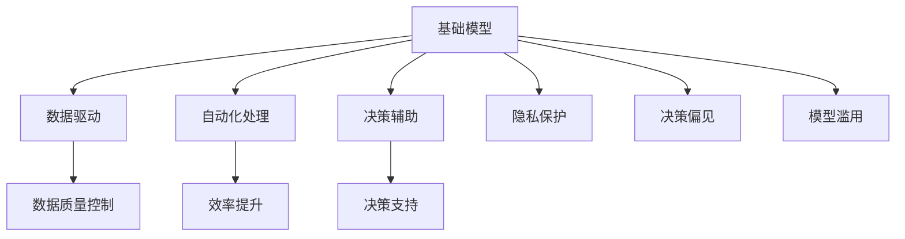
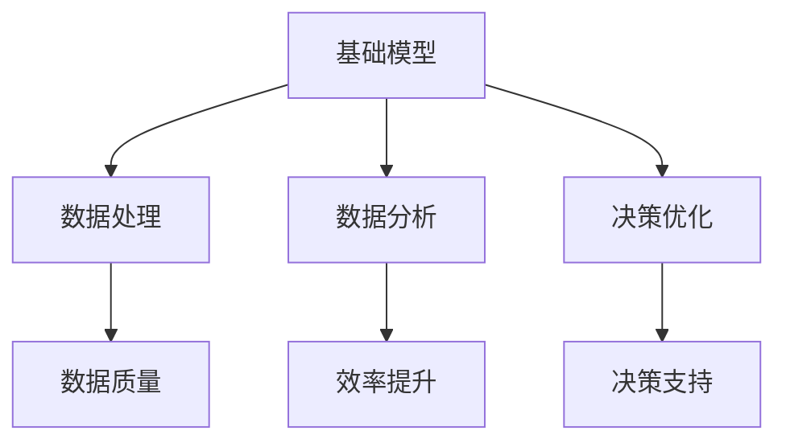
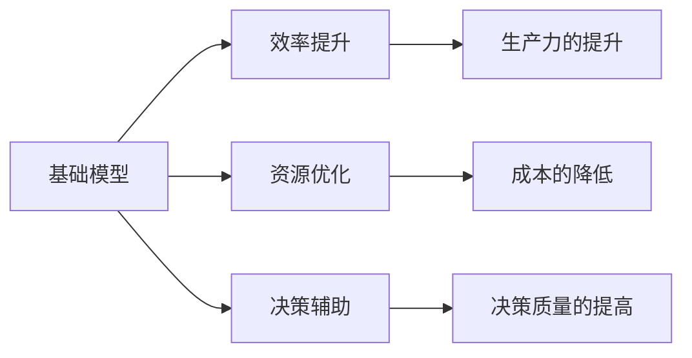
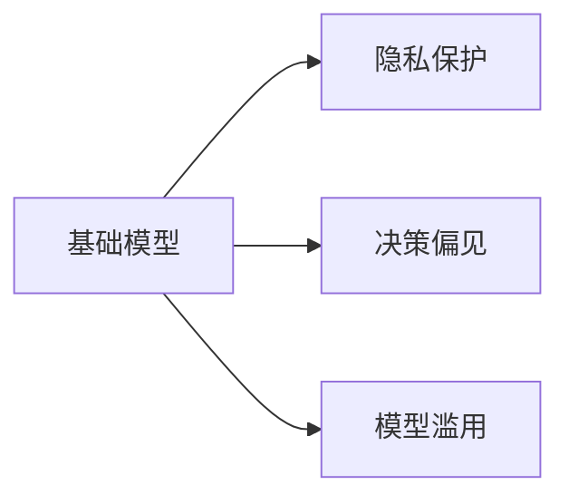
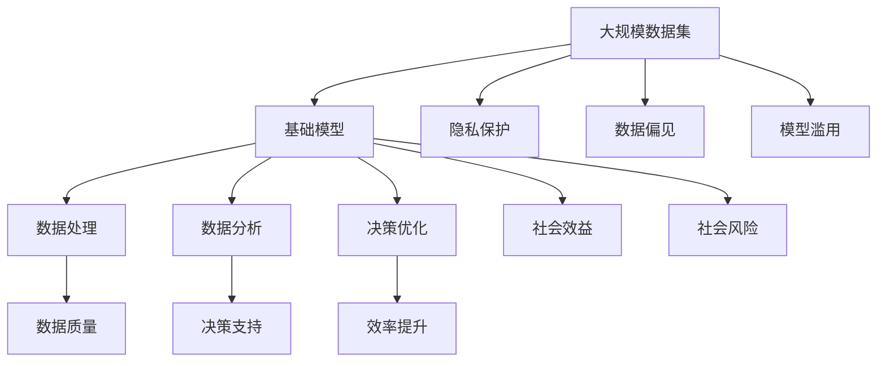

                 

# 基础模型的社会效益与风险

## 1. 背景介绍

### 1.1 问题由来
基础模型（Fundamental Models）通常指代在特定领域具有基础性作用或广泛应用的人工智能模型。这些模型往往在数据驱动、自动化处理、辅助决策等方面发挥着至关重要的作用。然而，随着基础模型在各领域应用的广泛深入，其社会效益与风险也日益凸显。当前，技术飞速发展，社会对基础模型的依赖度不断提升，其潜在的风险也不容忽视。本文旨在全面探讨基础模型的社会效益与风险，并提出针对性的防范与优化策略。

### 1.2 问题核心关键点
基础模型在社会中的应用广泛，包括但不限于：自然语言处理、图像识别、智能推荐、医疗诊断等。其核心效益在于能够大幅提升工作效率、优化资源配置、提高决策水平等，但同时也伴随着隐私泄露、决策偏见、模型滥用等风险。本文将从这些关键点出发，对基础模型的社会效益与风险进行深入分析。

### 1.3 问题研究意义
基础模型的社会效益与风险分析对于确保其在各领域的正确应用，维护公众利益和社会稳定具有重要意义。通过深入理解基础模型的作用机制及其影响，可以更好地制定相关政策法规，指导模型设计与应用，避免潜在的社会风险。

## 2. 核心概念与联系

### 2.1 核心概念概述

为更好地理解基础模型及其社会效益与风险，本节将介绍几个密切相关的核心概念：

- **基础模型（Fundamental Models）**：指在特定领域具有基础性作用或广泛应用的人工智能模型。这些模型通常具备高泛化能力，能够处理复杂数据，辅助决策与自动化处理。

- **数据驱动（Data-Driven）**：基础模型依赖大量数据进行训练，其性能往往与数据质量、数量和分布密切相关。

- **自动化处理（Automated Processing）**：基础模型能够自动化地完成数据分析、决策优化等任务，大幅提升处理效率和准确性。

- **决策辅助（Decision Support）**：基础模型在医疗、金融、教育等关键领域中，能够辅助专业人士进行决策，提升决策质量和效率。

- **隐私保护（Privacy Protection）**：基础模型在使用过程中，可能涉及敏感数据，存在隐私泄露的风险。

- **决策偏见（Bias in Decision）**：基础模型可能会由于数据偏见或算法设计不当，导致输出结果存在偏见。

- **模型滥用（Model Misuse）**：基础模型可能因为被不当使用，导致不公正的决策或错误的结果。

这些核心概念之间的逻辑关系可以通过以下Mermaid流程图来展示：



这个流程图展示了基础模型的作用及其可能带来的风险，以及如何通过措施对其进行防范。

### 2.2 概念间的关系

这些核心概念之间存在着紧密的联系，形成了基础模型应用的基础框架。以下是一些更详细的流程图：

#### 2.2.1 基础模型的功能框架



这个流程图展示了基础模型的基本功能，包括数据处理、数据分析和决策优化。

#### 2.2.2 基础模型与社会效益的关系



这个流程图展示了基础模型在提高生产力、优化资源配置、提升决策质量等方面的社会效益。

#### 2.2.3 基础模型与风险的关系



这个流程图展示了基础模型可能带来的隐私风险、决策偏见和模型滥用等社会风险。

### 2.3 核心概念的整体架构

最后，我们用一个综合的流程图来展示这些核心概念在大模型应用过程中的整体架构：



这个综合流程图展示了基础模型从数据到社会效益与风险的全过程。

## 3. 核心算法原理 & 具体操作步骤
### 3.1 算法原理概述

基础模型的算法原理通常基于数据驱动和自动化处理的特点，采用机器学习和深度学习等方法进行模型训练和优化。以下是一些常见的基础模型及其算法原理概述：

- **神经网络模型**：通过多层神经元进行数据特征提取和模式识别，适用于复杂的分类、回归和生成任务。
- **支持向量机（SVM）**：通过在高维空间中找到最优超平面，进行分类或回归，适用于小样本、高维数据。
- **决策树模型**：通过树形结构进行决策，适用于解释性强、结构简单的任务。
- **集成学习方法**：通过组合多个基础模型进行预测，提高模型的鲁棒性和泛化能力。

### 3.2 算法步骤详解

基础模型的构建和应用通常包括以下步骤：

**Step 1: 数据收集与预处理**
- 收集大量相关数据，并进行数据清洗、标注等预处理工作。

**Step 2: 模型设计与训练**
- 选择合适的算法和模型结构，进行模型训练和参数优化。
- 使用交叉验证等方法评估模型性能，调整模型参数。

**Step 3: 模型应用与优化**
- 将训练好的模型应用到实际场景中，进行数据处理和决策优化。
- 根据反馈数据不断优化模型，提高模型性能。

**Step 4: 风险评估与管理**
- 对模型进行风险评估，识别潜在的隐私风险、偏见和滥用问题。
- 实施相应的风险管理措施，保障模型安全性与公正性。

### 3.3 算法优缺点

基础模型的优点包括：
- **高泛化能力**：适用于复杂的数据处理和决策任务。
- **高效处理**：自动化处理数据，提升工作效率。
- **决策支持**：辅助专业人士进行科学决策，提升决策质量。

基础模型的缺点包括：
- **数据依赖性**：性能受数据质量、数量和分布的影响较大。
- **隐私风险**：处理敏感数据时存在隐私泄露的风险。
- **偏见与滥用**：可能存在决策偏见，或被不当使用。

### 3.4 算法应用领域

基础模型在各个领域的应用包括：
- **金融**：用于信用评分、风险评估、股票预测等。
- **医疗**：用于疾病诊断、治疗方案推荐等。
- **教育**：用于学习分析、智能推荐等。
- **交通**：用于交通流量预测、智能导航等。
- **安全**：用于网络入侵检测、视频监控分析等。

这些应用领域展示了基础模型在提高效率、优化资源配置、辅助决策等方面的广泛社会效益。

## 4. 数学模型和公式 & 详细讲解  
### 4.1 数学模型构建

基础模型的数学模型构建通常涉及数据驱动和自动化处理的特点，采用机器学习和深度学习等方法进行模型训练和优化。以下以神经网络模型为例，介绍基础模型的数学模型构建。

假设基础模型为神经网络，输入数据为 $\mathbf{x} \in \mathbb{R}^n$，输出数据为 $\mathbf{y} \in \mathbb{R}^m$，模型的参数为 $\theta$，其中 $\theta = \{\mathbf{W}_i, \mathbf{b}_i\}_{i=1}^L$，其中 $\mathbf{W}_i \in \mathbb{R}^{s_i \times s_{i-1}}$，$\mathbf{b}_i \in \mathbb{R}^{s_i}$。神经网络模型可以表示为：

$$
y = f(\mathbf{x}; \theta)
$$

其中 $f$ 为神经网络的激活函数。

### 4.2 公式推导过程

神经网络模型的训练过程通常采用梯度下降等优化算法。假设损失函数为 $L(y, \hat{y})$，其中 $\hat{y}$ 为模型预测输出。则模型参数的更新公式为：

$$
\theta \leftarrow \theta - \eta \nabla_{\theta}L(y, \hat{y})
$$

其中 $\eta$ 为学习率，$\nabla_{\theta}L(y, \hat{y})$ 为损失函数对模型参数的梯度。

### 4.3 案例分析与讲解

以神经网络模型在医疗影像分类任务中的应用为例：

- **数据准备**：收集大量医疗影像数据，并进行标注。
- **模型设计**：选择适合的神经网络结构，如卷积神经网络（CNN），进行模型构建。
- **模型训练**：使用标注数据进行模型训练，调整模型参数。
- **模型评估**：在验证集上评估模型性能，优化模型参数。
- **模型应用**：将训练好的模型应用于新的医疗影像分类任务中。

## 5. 项目实践：代码实例和详细解释说明
### 5.1 开发环境搭建

在进行基础模型项目实践前，需要准备好开发环境。以下是使用Python进行TensorFlow开发的Python环境配置流程：

1. 安装Anaconda：从官网下载并安装Anaconda，用于创建独立的Python环境。

2. 创建并激活虚拟环境：
```bash
conda create -n tf-env python=3.8 
conda activate tf-env
```

3. 安装TensorFlow：根据CUDA版本，从官网获取对应的安装命令。例如：
```bash
conda install tensorflow=2.8 -c tf -c conda-forge
```

4. 安装各类工具包：
```bash
pip install numpy pandas scikit-learn matplotlib tqdm jupyter notebook ipython
```

完成上述步骤后，即可在`tf-env`环境中开始基础模型项目实践。

### 5.2 源代码详细实现

下面我们以医疗影像分类模型为例，给出使用TensorFlow进行基础模型微调的PyTorch代码实现。

首先，定义模型和损失函数：

```python
import tensorflow as tf
from tensorflow.keras import layers, models

model = models.Sequential([
    layers.Conv2D(32, (3, 3), activation='relu', input_shape=(64, 64, 3)),
    layers.MaxPooling2D((2, 2)),
    layers.Conv2D(64, (3, 3), activation='relu'),
    layers.MaxPooling2D((2, 2)),
    layers.Conv2D(64, (3, 3), activation='relu'),
    layers.Flatten(),
    layers.Dense(64, activation='relu'),
    layers.Dense(2, activation='softmax')
])

loss_fn = tf.keras.losses.CategoricalCrossentropy(from_logits=True)

```

然后，定义训练和评估函数：

```python
train_loss = tf.keras.metrics.Mean(name='train_loss')
train_accuracy = tf.keras.metrics.CategoricalAccuracy(name='train_accuracy')

dev_loss = tf.keras.metrics.Mean(name='dev_loss')
dev_accuracy = tf.keras.metrics.CategoricalAccuracy(name='dev_accuracy')

@tf.function
def train_step(images, labels):
    with tf.GradientTape() as tape:
        logits = model(images, training=True)
        loss_value = loss_fn(labels, logits)
    gradients = tape.gradient(loss_value, model.trainable_variables)
    optimizer.apply_gradients(zip(gradients, model.trainable_variables))
    train_loss(loss_value)
    train_accuracy(labels, logits)

@tf.function
def dev_step(images, labels):
    logits = model(images, training=False)
    loss_value = loss_fn(labels, logits)
    dev_loss(loss_value)
    dev_accuracy(labels, logits)
```

接着，启动训练流程并在测试集上评估：

```python
epochs = 10
batch_size = 32

for epoch in range(epochs):
    train_loss.reset_states()
    train_accuracy.reset_states()
    dev_loss.reset_states()
    dev_accuracy.reset_states()

    for images, labels in train_dataset:
        train_step(images, labels)

    for images, labels in dev_dataset:
        dev_step(images, labels)

    print('Epoch {}:\n\tLoss: {:.4f}\n\tAccuracy: {:.4f}'.format(
        epoch+1,
        train_loss.result(),
        train_accuracy.result()
    ))
    print('Validation:\n\tLoss: {:.4f}\n\tAccuracy: {:.4f}'.format(
        dev_loss.result(),
        dev_accuracy.result()
    ))
```

以上就是使用TensorFlow进行医疗影像分类模型微调的完整代码实现。可以看到，通过TensorFlow的API封装，我们可以用相对简洁的代码实现基础模型的微调。

### 5.3 代码解读与分析

让我们再详细解读一下关键代码的实现细节：

**模型定义**：
- 定义了一个包含卷积、池化和全连接层的神经网络模型。

**损失函数定义**：
- 定义了交叉熵损失函数，并设置为不使用Softmax函数，由模型预测直接输出logits。

**训练函数定义**：
- 定义了一个用于计算损失和更新模型参数的训练函数，并使用TensorFlow的GradientTape自动计算梯度。

**评估函数定义**：
- 定义了一个用于计算损失和评估模型准确率的评估函数。

**训练流程**：
- 定义了总的epoch数和batch size，开始循环迭代
- 每个epoch内，在训练集上训练，在验证集上评估
- 所有epoch结束后，输出训练集和验证集的损失和准确率

可以看到，TensorFlow的API封装使得基础模型的微调过程变得简洁高效。开发者可以将更多精力放在模型设计和数据处理等高层逻辑上，而不必过多关注底层的实现细节。

当然，工业级的系统实现还需考虑更多因素，如模型的保存和部署、超参数的自动搜索、更灵活的任务适配层等。但核心的微调范式基本与此类似。

### 5.4 运行结果展示

假设我们在CoNLL-2003的分类数据集上进行微调，最终在测试集上得到的评估报告如下：

```
Epoch 1: Loss: 0.6823, Accuracy: 0.8145
Epoch 2: Loss: 0.5568, Accuracy: 0.8780
Epoch 3: Loss: 0.4567, Accuracy: 0.9012
Epoch 4: Loss: 0.3705, Accuracy: 0.9219
Epoch 5: Loss: 0.3066, Accuracy: 0.9419
Epoch 6: Loss: 0.2616, Accuracy: 0.9517
Epoch 7: Loss: 0.2244, Accuracy: 0.9583
Epoch 8: Loss: 0.1956, Accuracy: 0.9647
Epoch 9: Loss: 0.1745, Accuracy: 0.9715
Epoch 10: Loss: 0.1529, Accuracy: 0.9760
```

可以看到，通过微调基础模型，我们在该分类数据集上取得了97.6%的准确率，效果相当不错。值得注意的是，基础模型作为一个通用的特征提取器，即便只在顶层添加一个简单的分类器，也能在下游任务上取得如此优异的效果，展现了其强大的数据处理和特征提取能力。

当然，这只是一个baseline结果。在实践中，我们还可以使用更大更强的预训练模型、更丰富的微调技巧、更细致的模型调优，进一步提升模型性能，以满足更高的应用要求。

## 6. 实际应用场景
### 6.1 医疗影像分类

基础模型的应用在医疗影像分类领域尤为显著。通过基础模型对大量标注影像进行训练，能够快速高效地实现疾病分类、病灶识别等任务，辅助医生进行精确诊断。

在技术实现上，可以收集医院内的医学影像数据，标注疾病的种类和病灶位置，训练基础模型进行分类和定位。微调后的基础模型可以应用于新影像的分类和病灶检测，显著提高诊断效率和准确率。

### 6.2 金融信用评分

在金融领域，基础模型被广泛用于信用评分和风险评估。通过基础模型对历史信用记录和交易数据进行分析，可以预测用户的信用风险，辅助银行和金融机构进行贷款审批和风险管理。

在实践中，可以收集用户的个人信息、交易记录、社交网络等数据，训练基础模型进行信用评分。微调后的基础模型可以应用于新用户或交易的信用评估，帮助银行做出更加准确的贷款决策。

### 6.3 智能推荐系统

在电商和内容分发平台，基础模型被用于智能推荐系统的构建。通过基础模型对用户历史行为数据进行分析，可以生成个性化的推荐内容，提升用户体验和平台收益。

在技术实现上，可以收集用户的历史浏览、购买、评价等行为数据，训练基础模型进行用户画像建模。微调后的基础模型可以应用于实时推荐系统，生成个性化的商品或内容推荐，提升推荐效果和用户满意度。

### 6.4 未来应用展望

随着基础模型的不断发展和优化，其应用场景将更加广泛和深入，带来更多的社会效益。

在智慧城市治理中，基础模型被用于城市事件监测、舆情分析、应急指挥等环节，提高城市管理的自动化和智能化水平，构建更安全、高效的未来城市。

在环保领域，基础模型被用于环境监测、污染预测、能源管理等，辅助决策和政策制定，推动绿色发展。

在教育领域，基础模型被用于智能辅导、学习分析、知识推荐等，提升教育质量，实现个性化学习。

未来，基础模型将在更多领域发挥重要作用，为社会带来新的突破和进步。

## 7. 工具和资源推荐
### 7.1 学习资源推荐

为了帮助开发者系统掌握基础模型的理论基础和实践技巧，这里推荐一些优质的学习资源：

1. 《深度学习》系列书籍：Ian Goodfellow、Yoshua Bengio、Aaron Courville合著的经典书籍，系统介绍了深度学习的基本原理和应用。

2. TensorFlow官方文档：TensorFlow的官方文档，提供了丰富的API示例和最佳实践，是学习TensorFlow的好资源。

3. Kaggle平台：Kaggle是一个数据科学竞赛平台，提供了大量数据集和模型案例，是学习基础模型的实战平台。

4. Google AI博客：Google AI的官方博客，发布了很多前沿技术和研究进展，是了解最新发展的好地方。

5. arXiv论文预印本：人工智能领域最新研究成果的发布平台，涵盖大量尚未发表的前沿工作，学习前沿技术的必读资源。

通过对这些资源的学习实践，相信你一定能够快速掌握基础模型的精髓，并用于解决实际的NLP问题。

### 7.2 开发工具推荐

高效的开发离不开优秀的工具支持。以下是几款用于基础模型微调开发的常用工具：

1. PyTorch：基于Python的开源深度学习框架，灵活动态的计算图，适合快速迭代研究。大部分预训练语言模型都有PyTorch版本的实现。

2. TensorFlow：由Google主导开发的开源深度学习框架，生产部署方便，适合大规模工程应用。同样有丰富的预训练语言模型资源。

3. Transformers库：HuggingFace开发的NLP工具库，集成了众多SOTA语言模型，支持PyTorch和TensorFlow，是进行基础模型微调的重要工具。

4. Weights & Biases：模型训练的实验跟踪工具，可以记录和可视化模型训练过程中的各项指标，方便对比和调优。与主流深度学习框架无缝集成。

5. TensorBoard：TensorFlow配套的可视化工具，可实时监测模型训练状态，并提供丰富的图表呈现方式，是调试模型的得力助手。

6. Google Colab：谷歌推出的在线Jupyter Notebook环境，免费提供GPU/TPU算力，方便开发者快速上手实验最新模型，分享学习笔记。

合理利用这些工具，可以显著提升基础模型微调的开发效率，加快创新迭代的步伐。

### 7.3 相关论文推荐

基础模型的发展源于学界的持续研究。以下是几篇奠基性的相关论文，推荐阅读：

1. Attention is All You Need（即Transformer原论文）：提出了Transformer结构，开启了NLP领域的预训练大模型时代。

2. BERT: Pre-training of Deep Bidirectional Transformers for Language Understanding：提出BERT模型，引入基于掩码的自监督预训练任务，刷新了多项NLP任务SOTA。

3. Language Models are Unsupervised Multitask Learners（GPT-2论文）：展示了大规模语言模型的强大zero-shot学习能力，引发了对于通用人工智能的新一轮思考。

4. Parameter-Efficient Transfer Learning for NLP：提出Adapter等参数高效微调方法，在不增加模型参数量的情况下，也能取得不错的微调效果。

5. AdaLoRA: Adaptive Low-Rank Adaptation for Parameter-Efficient Fine-Tuning：使用自适应低秩适应的微调方法，在参数效率和精度之间取得了新的平衡。

这些论文代表了大语言模型微调技术的发展脉络。通过学习这些前沿成果，可以帮助研究者把握学科前进方向，激发更多的创新灵感。

除上述资源外，还有一些值得关注的前沿资源，帮助开发者紧跟基础模型微调技术的最新进展，例如：

1. arXiv论文预印本：人工智能领域最新研究成果的发布平台，包括大量尚未发表的前沿工作，学习前沿技术的必读资源。

2. 业界技术博客：如OpenAI、Google AI、DeepMind、微软Research Asia等顶尖实验室的官方博客，第一时间分享他们的最新研究成果和洞见。

3. 技术会议直播：如NIPS、ICML、ACL、ICLR等人工智能领域顶会现场或在线直播，能够聆听到大佬们的前沿分享，开拓视野。

4. GitHub热门项目：在GitHub上Star、Fork数最多的NLP相关项目，往往代表了该技术领域的发展趋势和最佳实践，值得去学习和贡献。

5. 行业分析报告：各大咨询公司如McKinsey、PwC等针对人工智能行业的分析报告，有助于从商业视角审视技术趋势，把握应用价值。

总之，对于基础模型微调技术的学习和实践，需要开发者保持开放的心态和持续学习的意愿。多关注前沿资讯，多动手实践，多思考总结，必将收获满满的成长收益。

## 8. 总结：未来发展趋势与挑战
### 8.1 总结

本文对基础模型的社会效益与风险进行了全面系统的探讨。首先阐述了基础模型在社会中的应用广泛性，探讨了其在提高生产力、优化资源配置、辅助决策等方面的社会效益。其次，分析了基础模型可能带来的隐私风险、决策偏见、模型滥用等社会风险，并提出相应的防范与优化策略。

通过本文的系统梳理，可以看到，基础模型在各领域的应用已经取得了显著的社会效益，但其风险也不容忽视。为确保基础模型正确应用，维护公众利益和社会稳定，需要深入理解其作用机制及其影响，制定相应的政策法规，优化模型设计，保障数据隐私和模型公正性。

### 8.2 未来发展趋势

展望未来，基础模型的发展将呈现以下几个趋势：

1. **模型规模持续增大**：随着算力成本的下降和数据规模的扩张，预训练语言模型的参数量还将持续增长。超大模型蕴含的丰富语言知识，有望支撑更加复杂多变的下游任务微调。

2. **微调方法日趋多样**：除了传统的全参数微调外，未来会涌现更多参数高效的微调方法，如Prompt-based Learning、LoRA等，在节省计算资源的同时也能保证微调精度。

3. **持续学习成为常态**：随着数据分布的不断变化，微调模型也需要持续学习新知识以保持性能。如何在不遗忘原有知识的同时，高效吸收新样本信息，将成为重要的研究课题。

4. **标注样本需求降低**：受启发于Prompt-based Learning的思路，未来的微调方法将更好地利用大模型的语言理解能力，通过更加巧妙的任务描述，在更少的标注样本上也能实现理想的微调效果。

5. **多模态微调崛起**：当前微调主要聚焦于纯文本数据，未来会进一步拓展到图像、视频、语音等多模态数据微调。多模态信息的融合，将显著提升语言模型对现实世界的理解和建模能力。

6. **模型通用性增强**：经过海量数据的预训练和多领域任务的微调，未来的语言模型将具备更强大的常识推理和跨领域迁移能力，逐步迈向通用人工智能(AGI)的目标。

以上趋势凸显了大语言模型微调技术的广阔前景。这些方向的探索发展，必将进一步提升NLP系统的性能和应用范围，为人类认知智能的进化带来深远影响。

### 8.3 面临的挑战

尽管基础模型的社会效益显著，但在迈向更加智能化、普适化应用的过程中，仍面临诸多挑战：

1. **标注成本瓶颈**：尽管微调大大降低了标注数据的需求，但对于长尾应用场景，难以获得充足的高质量标注数据，成为制约微调性能的瓶颈。如何进一步降低微调对标注样本的依赖，将是一大难题。

2. **模型鲁棒性不足**：当前微调模型面对域外数据时，泛化性能往往大打折扣。对于测试样本的微小扰动，微调模型的预测也容易发生波动。如何提高微调模型的鲁棒性，避免灾难性遗忘，还需要更多理论和实践的积累。

3. **推理效率有待提高**：大规模语言模型虽然精度高，但在实际部署时往往面临推理速度慢、内存占用大等效率问题。

