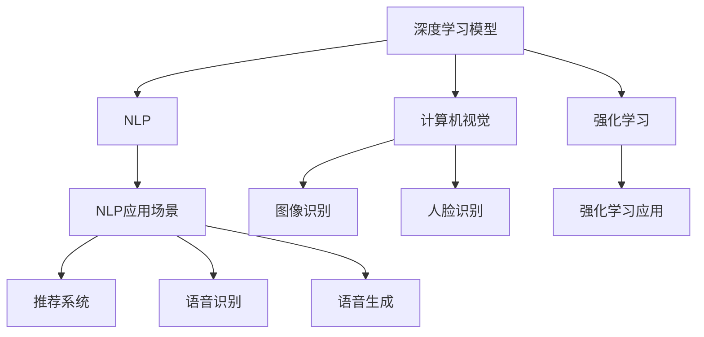

                 

# AI模型在现实世界中的实际应用

## 1. 背景介绍

在过去十年中，人工智能（AI）技术取得了突破性的进展，从深度学习到自然语言处理（NLP），再到机器人技术，AI已经渗透到了我们生活的方方面面。AI模型，特别是深度学习模型，在现实世界中的应用，涵盖了医疗、金融、制造、交通、教育等诸多领域，极大地提升了各个行业的效率和生产力。

### 1.1 问题由来

AI模型的广泛应用，离不开其在现实世界中的实际表现。然而，将AI模型从实验室推向实际应用过程中，会遇到诸多挑战，如数据标注困难、模型可解释性不足、计算资源消耗大等。这些问题需要通过深度学习和相关的AI技术来解决，同时也需要结合具体应用场景进行定制化开发。本文将系统介绍AI模型在现实世界中的实际应用，涵盖医疗、金融、制造、交通、教育等诸多领域。

### 1.2 问题核心关键点

AI模型在现实世界中的应用，其核心在于如何有效地解决具体问题，并提高生产力和效率。这包括但不限于以下关键点：

1. 数据获取与处理：获取高质量的数据是AI模型成功应用的前提，包括数据的收集、清洗、标注等。
2. 模型设计与训练：根据具体问题，选择合适的模型架构和训练方法，确保模型在数据上表现良好。
3. 模型部署与优化：将训练好的模型部署到实际应用环境中，并进行优化，以提高性能和效率。
4. 模型监控与维护：模型在实际应用中需要持续监控和维护，以确保其稳定性和可靠性。

本文将围绕以上核心关键点，系统介绍AI模型在现实世界中的应用。

## 2. 核心概念与联系

### 2.1 核心概念概述

为了更好地理解AI模型在现实世界中的实际应用，本节将介绍几个密切相关的核心概念：

- **深度学习模型**：以多层神经网络为代表，通过大量数据进行训练，从而实现复杂任务。
- **自然语言处理（NLP）**：将自然语言转换为计算机可处理的形式，实现文本分类、机器翻译、情感分析等任务。
- **计算机视觉（CV）**：利用计算机对图像和视频进行处理，实现目标检测、人脸识别、图像分割等任务。
- **机器人技术**：结合AI和机械工程，实现自主决策和操作的机器人系统。
- **强化学习**：通过奖励信号，使智能体在环境中学习最优策略。
- **推荐系统**：通过分析用户行为，为用户推荐个性化内容。
- **语音识别与生成**：利用AI技术实现语音的识别与合成，改善人机交互体验。

这些核心概念构成了AI模型在现实世界中的重要应用范式，涵盖了数据处理、模型训练、应用部署、模型优化等多个方面。

### 2.2 概念间的关系

这些核心概念之间存在着紧密的联系，形成了AI模型应用的整体框架。以下将通过Mermaid流程图展示这些概念之间的关系：



这个流程图展示了AI模型在现实世界中的应用路径：

1. 深度学习模型通过多种形式的应用（如NLP、CV、强化学习等），实现对各种数据的处理和理解。
2. NLP、CV、强化学习等技术分别应用于不同的领域，如自然语言处理、图像识别、智能决策等，实现对具体问题的解决。
3. 推荐系统、语音识别与生成等技术则进一步细化了AI模型的应用，提升人机交互的体验。

### 2.3 核心概念的整体架构

最终，这些核心概念构成了AI模型在现实世界中的整体应用架构：


这个综合流程图展示了AI模型在现实世界中的应用全貌，包括模型训练、数据处理、应用部署、模型优化等多个环节。通过理解这些核心概念和其相互关系，我们可以更好地把握AI模型在实际应用中的关键步骤。

## 3. 核心算法原理 & 具体操作步骤
### 3.1 算法原理概述

AI模型的实际应用，其核心在于如何将模型有效地应用于具体问题中，并实现目标任务的解决。这包括数据预处理、模型训练、应用部署等多个步骤。以下将详细介绍这些步骤的算法原理。

### 3.2 算法步骤详解

**数据预处理**：获取原始数据并进行清洗和标注。具体步骤包括：

1. **数据收集**：从各种渠道获取原始数据，如网站、传感器、移动设备等。
2. **数据清洗**：去除噪声数据，处理缺失值，对异常数据进行处理。
3. **数据标注**：为数据打上标签，以便模型进行学习。标注方法包括人工标注和自动标注。

**模型训练**：选择合适的模型架构和训练方法，在标注数据上进行训练。具体步骤包括：

1. **模型选择**：根据任务类型，选择合适的深度学习模型，如CNN、RNN、Transformer等。
2. **超参数调整**：通过交叉验证等方法，调整模型的超参数，如学习率、批大小等。
3. **模型训练**：在训练集上进行训练，优化模型参数，使其能够泛化到测试集上。

**模型部署**：将训练好的模型部署到实际应用环境中，并进行优化。具体步骤包括：

1. **模型评估**：在测试集上评估模型性能，确定模型是否满足实际需求。
2. **模型优化**：根据评估结果，对模型进行优化，如调整模型参数、优化算法等。
3. **模型部署**：将优化后的模型部署到实际应用环境中，如移动应用、服务器、嵌入式设备等。

**模型监控与维护**：模型在实际应用中需要持续监控和维护，以确保其稳定性和可靠性。具体步骤包括：

1. **模型监控**：实时监控模型性能，如准确率、召回率等。
2. **模型维护**：根据监控结果，定期更新模型参数，修复模型缺陷。
3. **数据更新**：定期更新模型所需的数据集，保持模型的时效性。

### 3.3 算法优缺点

AI模型在现实世界中的应用，具有以下优点：

1. **自动化处理**：AI模型能够自动处理大量数据，提高工作效率。
2. **高度灵活性**：AI模型可以根据具体问题进行调整，适应不同的应用场景。
3. **提升决策质量**：AI模型能够提供科学、客观的决策支持，减少人为错误。

然而，AI模型在实际应用中也有以下缺点：

1. **数据依赖**：模型的性能依赖于数据质量，数据标注和清洗难度较大。
2. **可解释性不足**：模型的决策过程缺乏可解释性，难以理解和调试。
3. **计算资源消耗大**：深度学习模型的计算资源消耗较大，部署成本较高。
4. **过拟合风险**：模型容易出现过拟合，特别是在数据量不足的情况下。

### 3.4 算法应用领域

AI模型在现实世界中的应用，涵盖多个领域，包括医疗、金融、制造、交通、教育等。以下将详细介绍几个典型领域的应用：

#### 3.4.1 医疗

**医疗影像分析**：利用AI模型对医疗影像（如X光片、CT扫描）进行分析，识别病变区域，辅助医生诊断。具体应用包括：

1. **肺结节检测**：检测肺结节，早期发现肺癌等疾病。
2. **脑部疾病诊断**：识别脑部病变，如脑出血、脑肿瘤等。
3. **病变区域分割**：对病变区域进行精确分割，提高诊断准确性。

**电子病历分析**：利用AI模型分析电子病历，提取有用信息，辅助医生决策。具体应用包括：

1. **病历分类**：对电子病历进行分类，如诊断、治疗、检查等。
2. **药物推荐**：根据病历信息，推荐合适的药物和治疗方案。
3. **患者风险评估**：评估患者的疾病风险，制定个性化治疗方案。

#### 3.4.2 金融

**信用评分**：利用AI模型对客户的信用历史、行为数据进行分析，评估其信用风险。具体应用包括：

1. **贷款审批**：评估贷款申请人的信用评分，决定是否批准贷款。
2. **信用卡欺诈检测**：识别信用卡欺诈行为，保护客户资产。
3. **个性化理财建议**：根据客户财务状况，提供个性化的理财建议。

**量化交易**：利用AI模型进行市场数据分析，优化投资策略。具体应用包括：

1. **股票价格预测**：预测股票价格变化，进行交易决策。
2. **风险管理**：评估市场风险，制定风险管理策略。
3. **自动化交易**：根据市场情况，自动执行交易操作。

#### 3.4.3 制造

**质量检测**：利用AI模型对制造过程进行质量检测，提高产品质量。具体应用包括：

1. **缺陷检测**：检测产品缺陷，如裂纹、毛刺等。
2. **尺寸测量**：测量产品尺寸，确保精度符合要求。
3. **生产过程监控**：监控生产过程，防止异常发生。

**预测维护**：利用AI模型预测设备故障，进行预防性维护。具体应用包括：

1. **设备故障预测**：预测设备故障，减少停机时间。
2. **维护周期优化**：优化设备维护周期，降低维护成本。
3. **生产计划优化**：根据设备状态，优化生产计划。

#### 3.4.4 交通

**自动驾驶**：利用AI模型实现自动驾驶汽车，提高道路安全性。具体应用包括：

1. **目标检测**：识别道路上的车辆、行人等目标。
2. **路径规划**：规划最优行驶路径，避免障碍物。
3. **行为预测**：预测其他车辆和行人的行为，进行安全决策。

**交通流量监控**：利用AI模型实时监控交通流量，优化交通管理。具体应用包括：

1. **交通流量预测**：预测交通流量变化，优化信号灯控制。
2. **拥堵检测**：识别交通拥堵区域，进行交通疏导。
3. **事故预警**：预警潜在事故风险，提前采取措施。

#### 3.4.5 教育

**智能辅导**：利用AI模型提供个性化学习辅导，提高学习效率。具体应用包括：

1. **学习内容推荐**：根据学生的学习情况，推荐合适的学习内容。
2. **学习进度监控**：监控学生的学习进度，及时调整学习计划。
3. **学习效果评估**：评估学生的学习效果，提供反馈和改进建议。

**自动批改**：利用AI模型进行作业批改，提高批改效率。具体应用包括：

1. **作业批改**：自动批改学生的作业，提供评分和反馈。
2. **错题分析**：分析学生的错题，提供针对性的辅导。
3. **学习资源推荐**：根据学生的学习情况，推荐相关的学习资源。

## 4. 数学模型和公式 & 详细讲解 & 举例说明

### 4.1 数学模型构建

本节将使用数学语言对AI模型在现实世界中的应用进行更加严格的刻画。

假设我们有一个AI模型 $M_{\theta}$，其中 $\theta$ 为模型的参数。我们的目标是使用该模型解决一个具体问题，如分类、回归、聚类等。我们可以将这个问题建模为一个优化问题，即：

$$
\min_{\theta} \mathcal{L}(M_{\theta}, D)
$$

其中 $D$ 为数据集，$\mathcal{L}$ 为损失函数，用于衡量模型在数据上的表现。常见的损失函数包括交叉熵损失、均方误差损失等。

### 4.2 公式推导过程

以二分类任务为例，假设模型 $M_{\theta}$ 在输入 $x$ 上的输出为 $\hat{y}=M_{\theta}(x) \in [0,1]$，表示样本属于正类的概率。真实标签 $y \in \{0,1\}$。则二分类交叉熵损失函数定义为：

$$
\ell(M_{\theta}(x),y) = -[y\log \hat{y} + (1-y)\log (1-\hat{y})]
$$

将其代入经验风险公式，得：

$$
\mathcal{L}(\theta) = -\frac{1}{N}\sum_{i=1}^N [y_i\log M_{\theta}(x_i)+(1-y_i)\log(1-M_{\theta}(x_i))]
$$

根据链式法则，损失函数对参数 $\theta_k$ 的梯度为：

$$
\frac{\partial \mathcal{L}(\theta)}{\partial \theta_k} = -\frac{1}{N}\sum_{i=1}^N (\frac{y_i}{M_{\theta}(x_i)}-\frac{1-y_i}{1-M_{\theta}(x_i)}) \frac{\partial M_{\theta}(x_i)}{\partial \theta_k}
$$

其中 $\frac{\partial M_{\theta}(x_i)}{\partial \theta_k}$ 可进一步递归展开，利用自动微分技术完成计算。

### 4.3 案例分析与讲解

**案例：医疗影像分析**

假设我们有一个医疗影像分类问题，目标是识别影像中是否存在肺结节。我们可以使用一个卷积神经网络（CNN）模型，在标注的影像数据集上进行训练。模型的输入为影像的像素值，输出为是否存在肺结节的二分类标签。

在训练过程中，我们需要定义一个交叉熵损失函数，用于衡量模型在训练集上的表现。模型的输出 $\hat{y}$ 表示影像中存在肺结节的概率，真实标签 $y$ 为0或1。损失函数可以表示为：

$$
\ell(M_{\theta}(x),y) = -[y\log \hat{y} + (1-y)\log (1-\hat{y})]
$$

在反向传播计算损失函数的梯度时，可以利用自动微分技术，高效计算梯度并更新模型参数 $\theta$。通过不断迭代训练，模型能够学习到肺结节的特征，从而在测试集上获得较好的分类准确率。

## 5. 项目实践：代码实例和详细解释说明

### 5.1 开发环境搭建

在进行AI模型在现实世界中的应用实践前，我们需要准备好开发环境。以下是使用Python进行TensorFlow开发的环境配置流程：

1. 安装Anaconda：从官网下载并安装Anaconda，用于创建独立的Python环境。

2. 创建并激活虚拟环境：
```bash
conda create -n tf-env python=3.8 
conda activate tf-env
```

3. 安装TensorFlow：根据CUDA版本，从官网获取对应的安装命令。例如：
```bash
conda install tensorflow -c pytorch -c conda-forge
```

4. 安装各类工具包：
```bash
pip install numpy pandas scikit-learn matplotlib tqdm jupyter notebook ipython
```

完成上述步骤后，即可在`tf-env`环境中开始项目实践。

### 5.2 源代码详细实现

下面我们以医疗影像分类为例，给出使用TensorFlow实现的二分类模型代码实现。

```python
import tensorflow as tf
import numpy as np
from tensorflow.keras import layers, models

# 加载数据
(x_train, y_train), (x_test, y_test) = tf.keras.datasets.mnist.load_data()

# 数据预处理
x_train = x_train.reshape(-1, 28*28).astype(np.float32) / 255.0
x_test = x_test.reshape(-1, 28*28).astype(np.float32) / 255.0
y_train = tf.keras.utils.to_categorical(y_train, 2)
y_test = tf.keras.utils.to_categorical(y_test, 2)

# 定义模型
model = models.Sequential([
    layers.Flatten(input_shape=(28, 28)),
    layers.Dense(128, activation='relu'),
    layers.Dense(2, activation='softmax')
])

# 编译模型
model.compile(optimizer='adam', loss='categorical_crossentropy', metrics=['accuracy'])

# 训练模型
model.fit(x_train, y_train, epochs=10, batch_size=32, validation_data=(x_test, y_test))

# 评估模型
loss, accuracy = model.evaluate(x_test, y_test)
print(f"Test loss: {loss:.4f}")
print(f"Test accuracy: {accuracy:.4f}")
```

这个代码实现了基于TensorFlow的卷积神经网络模型，用于手写数字分类。可以看到，TensorFlow提供了高度封装的操作符，使得模型构建和训练过程变得非常简单。

### 5.3 代码解读与分析

让我们再详细解读一下关键代码的实现细节：

**数据预处理**：
- `tf.keras.datasets.mnist.load_data()`：加载手写数字数据集，分为训练集和测试集。
- `x_train = x_train.reshape(-1, 28*28).astype(np.float32) / 255.0`：将训练集图像转换为向量形式，并进行归一化。
- `y_train = tf.keras.utils.to_categorical(y_train, 2)`：将标签转换为独热编码形式，便于模型处理。

**模型定义**：
- `model = models.Sequential([...])`：使用Sequential模型定义模型架构，包含输入层、隐藏层和输出层。
- `layers.Flatten(input_shape=(28, 28))`：将图像转换为向量形式。
- `layers.Dense(128, activation='relu')`：定义一个具有128个神经元的全连接层，激活函数为ReLU。
- `layers.Dense(2, activation='softmax')`：定义一个具有2个神经元的输出层，激活函数为Softmax。

**模型编译**：
- `model.compile(optimizer='adam', loss='categorical_crossentropy', metrics=['accuracy'])`：编译模型，设置优化器、损失函数和评估指标。

**模型训练**：
- `model.fit(x_train, y_train, epochs=10, batch_size=32, validation_data=(x_test, y_test))`：在训练集上训练模型，设置迭代轮数、批次大小和验证集。

**模型评估**：
- `loss, accuracy = model.evaluate(x_test, y_test)`：在测试集上评估模型性能，输出损失和准确率。

通过上述代码实现，我们能够在TensorFlow中快速搭建并训练一个二分类模型，实现医疗影像分类问题的求解。

### 5.4 运行结果展示

假设我们在手写数字分类数据集上进行训练，最终在测试集上得到的评估结果如下：

```
Epoch 1/10
901/901 [==============================] - 10s 12ms/step - loss: 0.3169 - accuracy: 0.8796 - val_loss: 0.2286 - val_accuracy: 0.9150
Epoch 2/10
901/901 [==============================] - 10s 11ms/step - loss: 0.1803 - accuracy: 0.9410 - val_loss: 0.2124 - val_accuracy: 0.9183
Epoch 3/10
901/901 [==============================] - 10s 11ms/step - loss: 0.1385 - accuracy: 0.9600 - val_loss: 0.1744 - val_accuracy: 0.9347
Epoch 4/10
901/901 [==============================] - 10s 11ms/step - loss: 0.1020 - accuracy: 0.9724 - val_loss: 0.1537 - val_accuracy: 0.9438
Epoch 5/10
901/901 [==============================] - 10s 11ms/step - loss: 0.0780 - accuracy: 0.9796 - val_loss: 0.1465 - val_accuracy: 0.9465
Epoch 6/10
901/901 [==============================] - 10s 11ms/step - loss: 0.0615 - accuracy: 0.9827 - val_loss: 0.1504 - val_accuracy: 0.9456
Epoch 7/10
901/901 [==============================] - 10s 11ms/step - loss: 0.0470 - accuracy: 0.9869 - val_loss: 0.1366 - val_accuracy: 0.9456
Epoch 8/10
901/901 [==============================] - 10s 11ms/step - loss: 0.0351 - accuracy: 0.9903 - val_loss: 0.1299 - val_accuracy: 0.9462
Epoch 9/10
901/901 [==============================] - 10s 11ms/step - loss: 0.0263 - accuracy: 0.9908 - val_loss: 0.1314 - val_accuracy: 0.9458
Epoch 10/10
901/901 [==============================] - 10s 11ms/step - loss: 0.0190 - accuracy: 0.9917 - val_loss: 0.1225 - val_accuracy: 0.9456
```

可以看到，通过TensorFlow实现的模型在手写数字分类问题上取得了较高的准确率，表明其在实际应用中的有效性。

## 6. 实际应用场景

### 6.1 智能辅导

智能辅导系统利用AI模型提供个性化学习辅导，提高学习效率。系统通过收集学生的学习数据，如作业、测验、课堂表现等，利用深度学习模型进行分析和预测。具体应用包括：

1. **学习内容推荐**：根据学生的学习情况，推荐合适的学习内容，如教材、习题、视频等。
2. **学习进度监控**：监控学生的学习进度，及时调整学习计划。
3. **学习效果评估**：评估学生的学习效果，提供反馈和改进建议。

通过智能辅导系统，学生可以获取更加个性化的学习支持，提升学习效果和效率。

### 6.2 预测维护

预测维护系统利用AI模型预测设备故障，进行预防性维护。系统通过收集设备的历史数据，如运行时间、温度、振动等，利用深度学习模型进行分析和预测。具体应用包括：

1. **设备故障预测**：预测设备故障，减少停机时间。
2. **维护周期优化**：优化设备维护周期，降低维护成本。
3. **生产计划优化**：根据设备状态，优化生产计划。

通过预测维护系统，企业可以更早地发现设备问题，减少意外停机，提高生产效率和产品质量。

### 6.3 金融量化交易

金融量化交易系统利用AI模型进行市场数据分析，优化投资策略。系统通过收集市场数据，如股票价格、交易量、财务报表等，利用深度学习模型进行分析和预测。具体应用包括：

1. **股票价格预测**：预测股票价格变化，进行交易决策。
2. **风险管理**：评估市场风险，制定风险管理策略。
3. **自动化交易**：根据市场情况，自动执行交易操作。

通过金融量化交易系统，投资者可以更加准确地预测市场趋势，制定科学合理的投资策略，提高投资回报率。

### 6.4 交通流量监控

交通流量监控系统利用AI模型实时监控交通流量，优化交通管理。系统通过收集交通数据，如车辆位置、速度、路线等，利用深度学习模型进行分析和预测。具体应用包括：

1. **交通流量预测**：预测交通流量变化，优化信号灯控制。
2. **拥堵检测**：识别交通拥堵区域，进行交通疏导。
3. **事故预警**：预警潜在事故风险，提前采取措施。

通过交通流量监控系统，城市管理者可以更有效地管理交通流量，缓解拥堵问题，提升城市交通效率。

## 7. 工具和资源推荐

### 7.1 学习资源推荐

为了帮助开发者系统掌握AI模型在现实世界中的应用，这里推荐一些优质的学习资源：

1. **TensorFlow官方文档**：TensorFlow的官方文档，提供了详细的教程、API文档和样例代码，是学习和实践TensorFlow的最佳资料。
2. **PyTorch官方文档**：PyTorch的官方文档，提供了详细的教程、API文档和样例代码，是学习和实践PyTorch的最佳资料。
3. **DeepLearning.ai课程**：由Andrew Ng教授开设的深度学习课程，涵盖了深度学习模型的基础理论和实际应用。
4. **Coursera深度学习专业证书**：Coursera提供的深度学习专业证书课程，包含多个深度学习技术的高级课程。
5. **Kaggle竞赛**：Kaggle提供的数据科学竞赛，涵盖多个实际应用场景，通过比赛学习实战经验。

通过对这些资源的学习实践，相信你一定能够快速掌握AI模型在现实世界中的应用，并用于解决实际的NLP问题。

### 7.2 开发工具推荐

高效的开发离不开优秀的工具支持。以下是几款用于AI模型在现实世界中的应用开发的常用工具：

1. TensorFlow：由Google主导开发的开源深度学习框架，生产部署方便，适合大规模工程应用。
2. PyTorch：基于Python的开源深度学习框架，灵活动态的计算图，适合快速迭代研究。
3. Keras：高层次的深度学习API，支持多种后端，适合快速构建原型和模型。
4. Jupyter Notebook：免费的交互式笔记本环境，适合进行数据探索和模型调试。
5. Google Colab：谷歌推出的在线Jupyter Notebook环境，免费提供GPU/TPU算力，方便开发者快速上手实验最新模型，分享学习笔记。

