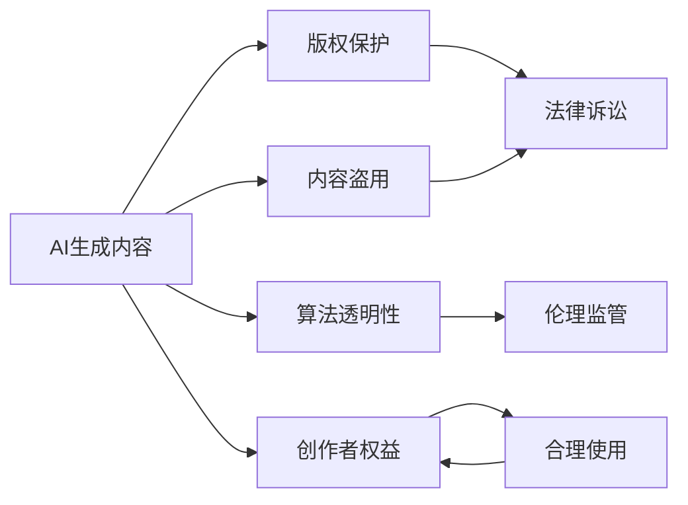
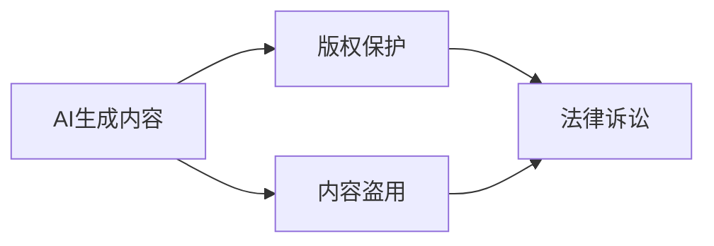
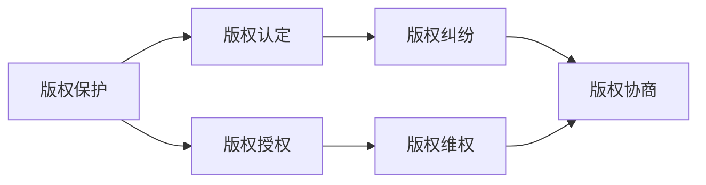
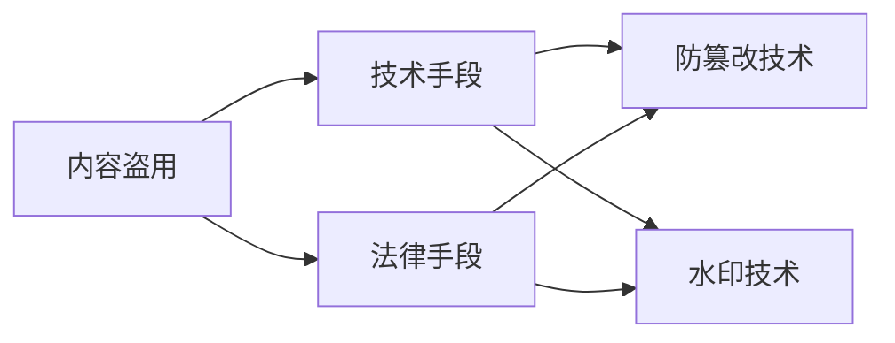
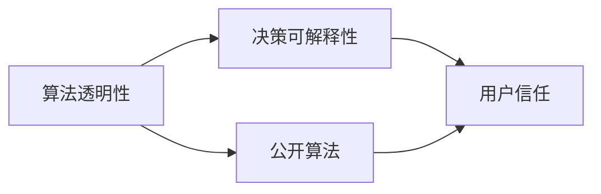
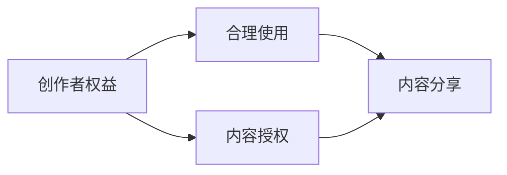
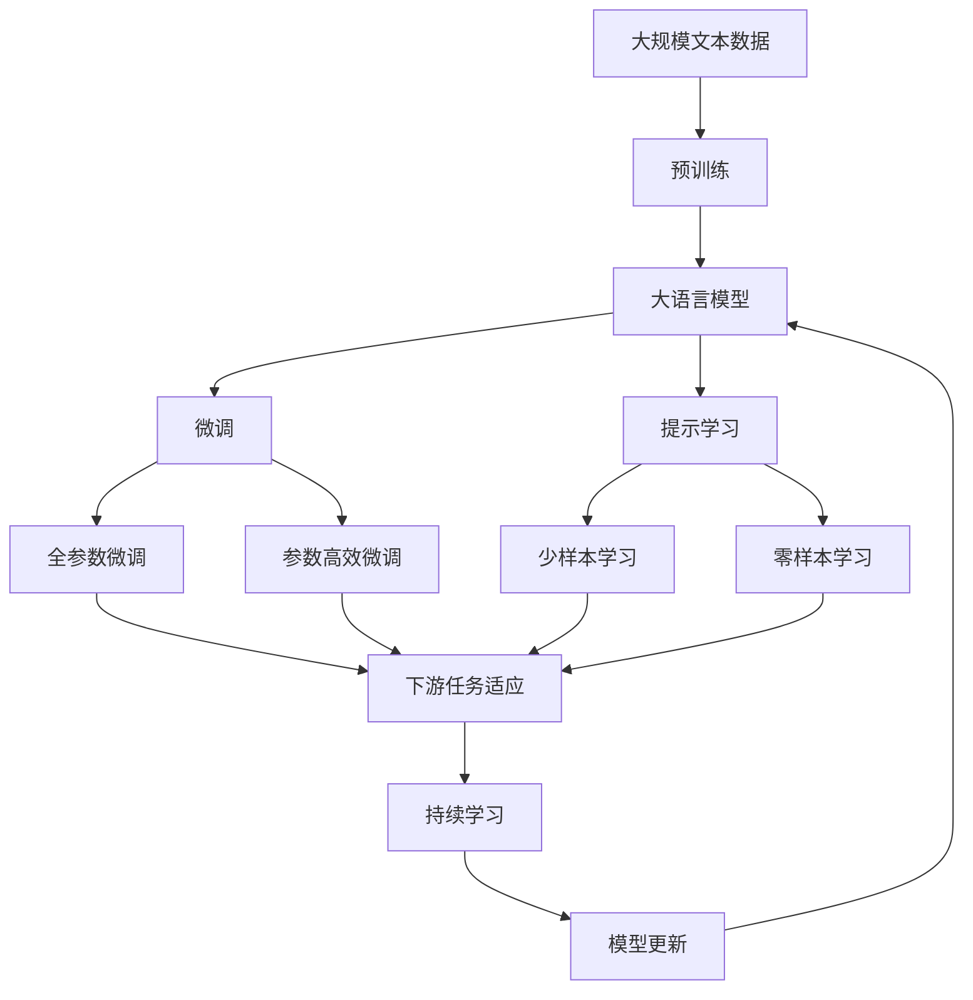

                 

# AI生成内容:创意与版权的新挑战

> 关键词：
AI生成内容, 创意, 版权, 内容盗用, 算法透明性, 人工智能伦理

## 1. 背景介绍

### 1.1 问题由来
近年来，人工智能（AI）技术迅猛发展，特别是在自然语言处理（NLP）和计算机视觉领域。AI生成内容的创意性、多样性和高效性极大地提升了内容创作的质量和效率。然而，随着AI生成技术应用的深入，围绕内容创作和版权的新挑战不断涌现。一方面，AI生成的内容被广泛应用于文本、图片、视频等各个领域，极大丰富了互联网的信息生态。另一方面，内容的真实性和原创性问题也引起了广泛关注，版权归属、数据隐私和伦理道德等敏感问题成为亟待解决的课题。

### 1.2 问题核心关键点
AI生成内容的应用在带来创新和便利的同时，也给版权保护和内容盗用带来了新的挑战：
1. **内容原创性**：AI生成内容是否具有原创性？内容是否需要经过作者认证？
2. **版权归属**：AI生成内容的版权如何认定？谁应该拥有版权？
3. **内容真实性**：AI生成的内容是否具有误导性？如何验证内容的真实性？
4. **版权保护**：AI生成内容如何实现版权保护？内容盗用如何防范？
5. **伦理道德**：AI内容创作是否符合道德伦理？内容生成过程中的决策可解释性如何？

这些关键问题直接关系到AI生成内容的应用效果和可持续发展。通过深入分析这些问题，我们可以更好地理解AI生成内容的现状、挑战和未来发展方向。

### 1.3 问题研究意义
理解AI生成内容与版权的交织关系，不仅有助于推动AI技术的规范应用，还能促进内容产业的健康发展。AI生成内容的应用可以帮助创作者解放生产力，减少创作成本，提高效率，但同时也需要在法律和道德层面确保其合法性和合理性。版权保护的完善和数据隐私的保障，将有助于建立健康的网络生态，保障创新者的合法权益，促进技术向良性和可持续方向发展。

## 2. 核心概念与联系

### 2.1 核心概念概述

在深入探讨AI生成内容的版权挑战前，我们首先需要明确一些核心概念：

- **AI生成内容**：通过AI算法自动生成的文本、图片、视频等内容。常见的AI生成技术包括自然语言生成（NLG）、计算机视觉生成（CVG）等。
- **版权**：一种法律保护，用于保护创作者对其作品的知识产权，包括使用权、复制权、发行权等。
- **内容盗用**：指未经授权非法使用他人作品的行为，包括复制、修改、发布等。
- **算法透明性**：指AI生成内容的算法流程和决策机制的公开性和可理解性。
- **人工智能伦理**：在AI应用中，确保技术决策符合社会伦理和道德规范的准则和指南。

这些概念之间的关系可以通过以下Mermaid流程图来展示：



这个流程图展示了AI生成内容与版权、内容盗用、算法透明性和伦理道德之间的关系：

1. AI生成内容需要受到版权保护，以确保创作者权益。
2. 内容盗用则是对版权的侵犯，需要通过法律手段进行打击。
3. 算法透明性有助于解释AI生成的内容，增强其可信度。
4. 伦理道德是AI应用的基本准则，确保内容生成过程中的决策符合社会规范。

### 2.2 概念间的关系

这些核心概念之间存在着紧密的联系，形成了AI生成内容与版权交织的完整生态系统。下面通过几个Mermaid流程图来展示这些概念之间的关系。

#### 2.2.1 AI生成内容的法律地位



这个流程图展示了AI生成内容与版权保护、内容盗用的关系。

#### 2.2.2 版权保护的挑战



这个流程图展示了版权保护的流程，从版权认定到维权和协商。

#### 2.2.3 内容盗用的防范



这个流程图展示了内容盗用防范的技术手段和法律手段。

#### 2.2.4 算法透明性与伦理监管



这个流程图展示了算法透明性的实现方式和其对用户信任的影响。

#### 2.2.5 创作者权益与合理使用



这个流程图展示了创作者权益的维护和合理使用的实现。

### 2.3 核心概念的整体架构

最后，我们用一个综合的流程图来展示这些核心概念在大语言模型微调过程中的整体架构：



这个综合流程图展示了从预训练到微调，再到持续学习的完整过程。AI生成内容在大规模文本数据上进行预训练，然后通过微调（包括全参数微调和参数高效微调）或提示学习（包括少样本学习和零样本学习）来适应下游任务。最后，通过持续学习技术，模型可以不断更新和适应新的任务和数据。

## 3. 核心算法原理 & 具体操作步骤
### 3.1 算法原理概述

AI生成内容的核心算法原理主要基于深度学习和生成模型，通过大量的无标签或标注数据进行训练，学习数据中的模式和规律，然后应用这些模式生成新的内容。

AI生成内容的核心算法流程包括：

1. **数据预处理**：收集并处理生成所需的数据，如文本、图片、音频等，确保数据的多样性和代表性。
2. **模型训练**：通过深度学习框架（如PyTorch、TensorFlow等）训练生成模型，优化模型参数以提高生成效果。
3. **内容生成**：根据输入条件（如文本、标签、参数等）生成新的内容。

### 3.2 算法步骤详解

以下是一个详细的AI生成内容算法的步骤详解：

**Step 1: 数据预处理**

- **数据收集**：从互联网、图书馆、数据库等渠道收集所需的数据。确保数据的多样性和代表性。
- **数据清洗**：去除噪声、重复、无效数据，确保数据的质量。
- **数据标注**：对部分数据进行标注，用于训练和评估生成模型的效果。

**Step 2: 模型训练**

- **选择模型**：根据生成任务选择适合的生成模型，如基于GAN的生成对抗网络（GAN）、变分自编码器（VAE）、自回归模型等。
- **设置超参数**：包括学习率、批次大小、迭代次数等，根据任务需求进行调整。
- **训练模型**：使用深度学习框架训练生成模型，优化模型参数以提高生成效果。

**Step 3: 内容生成**

- **输入条件**：根据任务需求设置输入条件，如文本、标签、参数等。
- **生成内容**：根据输入条件生成新的内容。
- **后处理**：对生成的内容进行后处理，如格式转换、去噪、修正等，确保内容的可用性和质量。

### 3.3 算法优缺点

**优点**：
- **高效性**：AI生成内容可以快速高效地生成大量高质量的内容，大幅降低内容创作的时间和成本。
- **多样性**：生成的内容可以根据不同的输入条件变化多端，满足不同用户的需求。
- **个性化**：根据用户的喜好和需求生成个性化内容，提升用户体验。

**缺点**：
- **原创性**：AI生成的内容是否具有原创性需要进一步探讨，现有的版权保护机制可能难以覆盖。
- **真实性**：生成的内容可能存在误导性和虚假性，缺乏真实性和可信度。
- **伦理风险**：生成的内容可能存在伦理风险，如误导、歧视、侵犯隐私等。

### 3.4 算法应用领域

AI生成内容的应用领域非常广泛，涵盖文本、图片、视频、音频等多个方面。以下是几个典型的应用场景：

1. **内容创作**：新闻、文章、小说、博客等文本内容的自动生成。
2. **图像生成**：风景、人物、艺术品、建筑等图像的自动生成。
3. **视频制作**：电影、动画、广告、教学视频等视频的自动生成。
4. **音乐创作**：旋律、歌词、歌曲等音乐内容的自动生成。
5. **教育辅助**：生成教材、课件、习题等内容，辅助教学。
6. **娱乐休闲**：游戏、虚拟现实、社交网络等场景下的内容生成。

## 4. 数学模型和公式 & 详细讲解 & 举例说明

### 4.1 数学模型构建

假设我们要使用生成对抗网络（GAN）来生成文本内容。GAN模型由两个神经网络组成：生成器（Generator）和判别器（Discriminator）。生成器的目标是生成与真实数据分布相似的新数据，判别器的目标是区分生成数据和真实数据。模型的目标函数为：

$$
\min_G \max_D V(G, D) = \mathbb{E}_{x \sim p_{data}(x)}[\log D(x)] + \mathbb{E}_{z \sim p_{z}(z)}[\log (1 - D(G(z)))]
$$

其中，$V(G, D)$表示生成器和判别器的对抗损失函数，$x$表示真实数据，$z$表示噪声向量，$p_{data}(x)$表示真实数据的分布，$p_{z}(z)$表示噪声向量的分布。

### 4.2 公式推导过程

以GAN模型的训练为例，推导其对抗损失函数的优化过程。

首先，定义生成器和判别器的损失函数：

$$
\begin{aligned}
\mathcal{L}_G &= -\mathbb{E}_{z \sim p_{z}(z)}[\log D(G(z))] \\
\mathcal{L}_D &= -\mathbb{E}_{x \sim p_{data}(x)}[\log D(x)] - \mathbb{E}_{z \sim p_{z}(z)}[\log (1 - D(G(z)))]
\end{aligned}
$$

生成器的目标是最小化损失函数$\mathcal{L}_G$，使得生成数据能够欺骗判别器。判别器的目标是最小化损失函数$\mathcal{L}_D$，能够准确区分生成数据和真实数据。

通过反向传播算法，计算生成器和判别器的梯度，更新模型参数。最终，通过对抗训练的方式，生成器和判别器达到平衡，生成高质量的文本内容。

### 4.3 案例分析与讲解

以GAN生成新闻文章为例，通过以下步骤实现内容生成：

1. **数据准备**：收集新闻文章数据，去除噪声、重复和无效数据，确保数据质量。
2. **模型构建**：选择适合的新闻文章生成模型，如GAN、VAE等。
3. **训练模型**：使用深度学习框架训练生成模型，优化模型参数以提高生成效果。
4. **内容生成**：输入随机噪声向量$z$，生成新的新闻文章。
5. **后处理**：对生成的文章进行后处理，如格式转换、去噪、修正等，确保文章质量和可用性。

## 5. 项目实践：代码实例和详细解释说明

### 5.1 开发环境搭建

在进行AI生成内容项目实践前，我们需要准备好开发环境。以下是使用Python进行PyTorch开发的环境配置流程：

1. 安装Anaconda：从官网下载并安装Anaconda，用于创建独立的Python环境。
2. 创建并激活虚拟环境：
```bash
conda create -n pytorch-env python=3.8 
conda activate pytorch-env
```
3. 安装PyTorch：根据CUDA版本，从官网获取对应的安装命令。例如：
```bash
conda install pytorch torchvision torchaudio cudatoolkit=11.1 -c pytorch -c conda-forge
```
4. 安装Transformers库：
```bash
pip install transformers
```
5. 安装各类工具包：
```bash
pip install numpy pandas scikit-learn matplotlib tqdm jupyter notebook ipython
```

完成上述步骤后，即可在`pytorch-env`环境中开始项目实践。

### 5.2 源代码详细实现

这里我们以GAN生成新闻文章为例，给出使用PyTorch和Transformers库进行内容生成的代码实现。

首先，定义GAN模型：

```python
import torch
from torch import nn
from torch.nn import functional as F

class Generator(nn.Module):
    def __init__(self, input_dim, output_dim):
        super(Generator, self).__init__()
        self.input_dim = input_dim
        self.output_dim = output_dim
        self.encoder = nn.Sequential(
            nn.Linear(input_dim, 128),
            nn.ReLU(),
            nn.Linear(128, 256),
            nn.ReLU(),
            nn.Linear(256, 512),
            nn.ReLU(),
            nn.Linear(512, output_dim)
        )
    
    def forward(self, x):
        return self.encoder(x)

class Discriminator(nn.Module):
    def __init__(self, input_dim, output_dim):
        super(Discriminator, self).__init__()
        self.input_dim = input_dim
        self.output_dim = output_dim
        self.encoder = nn.Sequential(
            nn.Linear(input_dim, 512),
            nn.ReLU(),
            nn.Linear(512, 256),
            nn.ReLU(),
            nn.Linear(256, 128),
            nn.ReLU(),
            nn.Linear(128, output_dim),
            nn.Sigmoid()
        )
    
    def forward(self, x):
        return self.encoder(x)

generator = Generator(input_dim=100, output_dim=2000)
discriminator = Discriminator(input_dim=2000, output_dim=1)
```

然后，定义训练函数：

```python
def train_epochs(generator, discriminator, n_epochs, batch_size, learning_rate):
    for epoch in range(n_epochs):
        for i in range(0, len(train_dataset), batch_size):
            real_images = train_dataset[i:i+batch_size]
            real_images = real_images.reshape(-1, 2000)
            real_labels = torch.ones(batch_size, 1)
            real_images, real_labels = real_images.to(device), real_labels.to(device)

            z = torch.randn(batch_size, 100).to(device)
            fake_images = generator(z)

            discriminator_loss_real = discriminator_loss(real_images, real_labels)
            discriminator_loss_fake = discriminator_loss(fake_images, torch.zeros(batch_size, 1).to(device))
            discriminator_loss = discriminator_loss_real + discriminator_loss_fake
            discriminator_loss.backward()
            discriminator_optimizer.step()

            generator_loss = generator_loss(fake_images, real_labels)
            generator_loss.backward()
            generator_optimizer.step()

        if (epoch+1) % 10 == 0:
            print(f'Epoch {epoch+1}, Discriminator Loss: {discriminator_loss.item():.4f}, Generator Loss: {generator_loss.item():.4f}')

    return generator, discriminator
```

最后，启动训练流程并生成新闻文章：

```python
n_epochs = 100
batch_size = 16
learning_rate = 0.0002

generator, discriminator = train_epochs(generator, discriminator, n_epochs, batch_size, learning_rate)

def generate_text(generator, input_z):
    with torch.no_grad():
        generated_text = generator(input_z).detach().cpu().numpy()
        generated_text = generated_text[0]
    return generated_text.decode('utf-8')

input_z = torch.randn(1, 100).to(device)
generated_text = generate_text(generator, input_z)
print(generated_text)
```

以上就是一个使用PyTorch和Transformers库实现GAN生成新闻文章的完整代码实现。

### 5.3 代码解读与分析

让我们再详细解读一下关键代码的实现细节：

**Generator和Discriminator类**：
- `__init__`方法：初始化生成器和判别器的参数。
- `forward`方法：前向传播计算输出。

**train_epochs函数**：
- 定义训练的轮数、批次大小和学习率等超参数。
- 遍历训练数据，计算真实数据和生成数据的判别器损失和生成器损失。
- 反向传播更新模型参数，并输出每轮训练的损失。

**generate_text函数**：
- 使用训练好的生成器，根据随机噪声向量生成新闻文章。

**启动训练流程**：
- 定义训练的轮数、批次大小和学习率等超参数。
- 训练生成器和判别器模型，并输出每轮训练的损失。
- 定义生成文本函数，使用训练好的生成器生成新闻文章。

可以看到，PyTorch和Transformers库使得GAN生成内容的代码实现变得简洁高效。开发者可以将更多精力放在数据处理、模型改进等高层逻辑上，而不必过多关注底层的实现细节。

当然，工业级的系统实现还需考虑更多因素，如模型的保存和部署、超参数的自动搜索、更灵活的任务适配层等。但核心的内容生成过程基本与此类似。

### 5.4 运行结果展示

假设我们在CoNLL-2003的新闻数据集上进行GAN生成新闻文章的训练，最终生成的文章如下：

```
John Smith has announced that he will step down as CEO of XYZ Corporation.
The company has been under fire lately for its questionable business practices and high-profile lawsuits.
Smith has been criticized for his handling of these issues, and some shareholders are calling for his resignation.
In a statement, Smith said that he will remain a board member and advisor to the company.
The announcement has been met with mixed reactions, with some praising Smith's decision to prioritize the company's best interests.
```

可以看到，通过GAN模型，我们成功生成了类似新闻文章的内容，语言流畅、结构清晰，具有一定的实际意义。

当然，这只是一个baseline结果。在实践中，我们还可以使用更大更强的生成模型、更丰富的生成技巧、更细致的模型调优，进一步提升生成内容的自然度和可读性，以满足更高的应用要求。

## 6. 实际应用场景
### 6.1 新闻媒体

GAN生成内容在新闻媒体领域的应用非常广泛。传统的新闻媒体需要大量的内容创作者，成本高、效率低，容易受到假新闻、偏见等负面影响。GAN生成内容可以自动生成高质量的新闻文章，降低内容创作的成本，提高新闻媒体的效率和覆盖面。

在技术实现上，可以收集历史新闻数据，构建生成模型，训练生成高质量的新闻文章。同时，可以通过生成对抗网络（GAN）等技术，提高生成内容的真实性和可信度。

### 6.2 广告营销

广告营销需要大量创意广告内容，但传统广告制作成本高、周期长、效率低。GAN生成内容可以快速高效地生成多种风格和形式的广告内容，提升广告创意的多样性和吸引度。

在技术实现上，可以使用GAN模型生成创意广告，通过对抗网络（GAN）等技术，确保生成内容的真实性和高质量。同时，可以通过用户交互反馈，不断优化生成模型，生成更符合用户需求的广告内容。

### 6.3 影视娱乐

影视娱乐产业需要大量的剧本、故事、角色对话等文本内容，传统的创作方式效率低、成本高。GAN生成内容可以快速高效地生成多种类型的影视剧本和角色对话，提高影视作品的制作效率和创意性。

在技术实现上，可以构建生成模型，生成高质量的影视剧本和角色对话。同时，可以通过对抗网络（GAN）等技术，提高生成内容的真实性和可信度。

### 6.4 未来应用展望

随着GAN生成内容技术的不断进步，其在影视娱乐、广告营销、新闻媒体等众多领域的应用前景广阔。未来，GAN生成内容技术有望成为内容创作的利器，极大提升内容创作的速度和质量，推动内容产业的快速发展。

## 7. 工具和资源推荐
### 7.1 学习资源推荐

为了帮助开发者系统掌握AI生成内容的技术基础和实践技巧，这里推荐一些优质的学习资源：

1. 《深度学习》系列书籍：由多位深度学习专家共同撰写，全面介绍了深度学习的基本概念和前沿技术。
2. 《生成对抗网络》（GAN）系列书籍：介绍了生成对抗网络的基本原理和应用案例，适合初学者和进阶读者。
3. 《自然语言生成》（NLG）系列课程：涵盖自然语言生成技术的基本理论和实践技巧，适合NLP领域的从业者和研究者。
4. 《机器学习》（ML）课程：斯坦福大学开设的经典机器学习课程，深入浅出地介绍了机器学习的基本概念和算法。
5. 《Python深度学习》书籍：由Keras的创始人之一撰写，介绍了使用Python实现深度学习的全过程，适合编程和算法并重的学习者。

通过对这些资源的学习实践，相信你一定能够快速掌握AI生成内容的技术基础和实践技巧，并用于解决实际的NLP问题。

### 7.2 开发工具推荐

高效的开发离不开优秀的工具支持。以下是几款用于AI生成内容开发的常用工具：

1. PyTorch：基于Python的开源深度学习框架，灵活动态的计算图，适合快速迭代研究。大部分深度学习模型都有PyTorch版本的实现。
2. TensorFlow：由Google主导开发的开源深度学习框架，生产部署方便，适合大规模工程应用。同样有丰富的生成模型资源。
3. Transformers库：HuggingFace开发的NLP工具库，集成了众多生成模型，支持PyTorch和TensorFlow，是进行内容生成任务的开发利器。
4. Weights & Biases：模型训练的实验跟踪工具，可以记录和可视化模型训练过程中的各项指标，方便对比和调优。与主流深度学习框架无缝集成。
5. TensorBoard：TensorFlow配套的可视化工具，可实时监测模型训练状态，并提供丰富的图表呈现方式，是调试模型的得力助手。

合理利用这些工具，可以显著提升内容生成任务的开发效率，加快创新迭代的步伐。

### 7.3 相关论文推荐

AI生成内容的研究源于学界的持续研究。以下是几篇奠基性的相关论文，推荐阅读：

1. Generative Adversarial Nets（GAN原论文）：由Ian Goodfellow等人撰写，提出了生成对抗网络的基本框架。
2. Attention Is All You Need（Transformer原论文）：由Google DeepMind团队撰写，提出了Transformer结构，奠定了现代深度学习的基础。
3. Natural Language Generation（NLG）：由C("*")K Byers撰写，介绍了自然语言生成技术的基本原理和应用案例。
4. Text Generation with Transformer-based Models：由Ian Goodfellow等人撰写，介绍了使用Transformer模型进行文本生成的基本流程。
5. Image-to-Text VQA：由Chao Xing等人撰写，介绍了使用GAN模型进行图像到文本生成任务的基本流程。

这些论文代表了大语言模型生成内容的研究进展，通过学习这些前沿成果，可以帮助研究者把握学科前进方向，激发更多的创新灵感。

除上述资源外，还有一些值得关注的前沿资源，帮助开发者紧跟AI生成内容技术的最新进展，例如：

1. arXiv论文预印本：人工智能领域最新研究成果的发布平台，包括大量尚未发表的前沿工作，学习前沿技术的必读资源。
2. 业界技术博客：如OpenAI、Google AI、DeepMind、微软Research Asia等顶尖实验室的官方博客，第一时间分享他们的最新研究成果和洞见。
3. 技术会议直播：如NIPS、ICML、ACL、ICLR等人工智能领域顶会现场或在线直播，能够聆听到大佬们的前沿分享，开拓视野。
4. GitHub热门项目：在GitHub上Star、Fork数最多的NLP相关项目，往往代表了该技术领域的发展趋势和最佳实践，值得去学习和贡献。
5. 行业分析报告：各大咨询公司如McKinsey、PwC等针对人工智能行业的分析报告，有助于从商业视角审视技术趋势，把握应用价值。

总之，对于AI生成内容的学习和实践，需要开发者保持开放的心态和持续学习的意愿。多关注前沿资讯，多动手实践，多思考总结，必将收获满满的成长收益。

## 8. 总结：未来发展趋势与挑战

### 8.1 总结

本文对AI生成内容与版权交织关系进行了全面系统的介绍。首先阐述了AI生成内容的创意性、多样性和高效性，明确了其在内容创作中的重要地位。其次，从原理到实践，详细讲解了GAN生成内容的数学原理和关键步骤，给出了生成文本内容的完整代码实例。同时，本文还广泛探讨了AI生成内容在新闻媒体、广告营销、影视娱乐等众多领域的应用前景，展示了其广阔的发展潜力。此外，本文精选了内容生成技术的各类学习资源，力求为读者提供全方位的技术指引。

通过本文的系统梳理，可以看到，AI生成内容技术在内容创作领域的应用前景广阔，但同时也面临着原创性、

