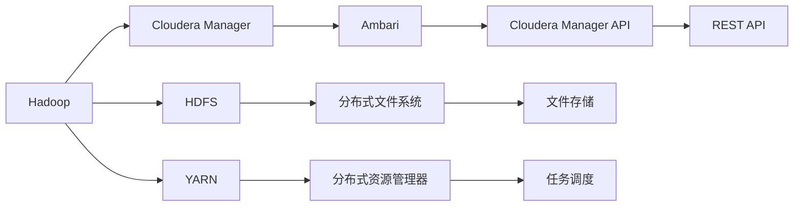
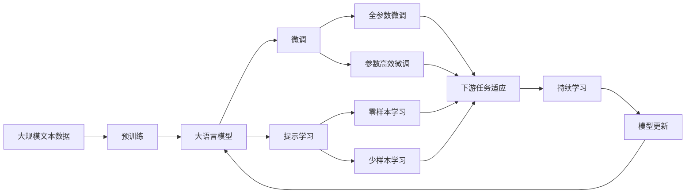

                 

# Ambari原理与代码实例讲解

> 关键词：
- Hadoop
- Cloudera Manager
- Cloudera Manager API
- REST API
- HDFS
- YARN
- Ambari
- 负载均衡
- 集群管理
- 故障恢复

## 1. 背景介绍

### 1.1 问题由来

在过去几十年中，Hadoop生态系统已成为数据处理和存储的黄金标准。它通过分布式计算和存储机制，为大规模数据处理提供了强大的支持。然而，随着数据量的不断增长，如何高效管理Hadoop集群成为一个关键问题。在这个背景下，Apache Ambari应运而生，成为了Hadoop集群管理的优秀工具。

Ambari是一款开源软件，基于Apache Hadoop、Apache Hive、Apache Oozie、Apache HBase、Apache Zookeeper、Apache Sqoop和Apache Ambari等Apache项目的结合，提供了一个统一的管理平台。它可以帮助企业轻松部署、管理、监控和扩展Hadoop集群。

### 1.2 问题核心关键点

Ambari的核心在于其通过RESTful API接口实现了对Hadoop生态系统的统一管理和自动化。它将Hadoop集群管理、部署、监控和扩展集成到一个统一的界面上，提供了直观的Web界面，使得非技术用户也能轻松管理和配置集群。同时，它支持分布式存储和任务调度，能够在集群内实现负载均衡和故障恢复，从而保证了集群的高可用性和稳定性。

Ambari的管理功能包括：
- 配置和部署Hadoop服务
- 配置和部署Hive、Oozie、HBase等Hadoop生态系统组件
- 配置和部署Zookeeper、Sqoop等支持服务
- 监控和管理集群性能和任务状态
- 自动扩展和故障恢复

Ambari的特点包括：
- 支持多数据中心集群
- 支持Hadoop 2.x版本
- 提供直观的Web界面
- 支持RESTful API
- 提供扩展性API

## 2. 核心概念与联系

### 2.1 核心概念概述

为更好地理解Ambari的工作原理和架构，本节将介绍几个密切相关的核心概念：

- Hadoop: 一个开源的分布式计算平台，由HDFS（分布式文件系统）和YARN（分布式资源管理系统）组成。它能够处理大规模数据集，并通过分布式计算提高效率。
- Cloudera Manager: 是Hadoop生态系统的一个重要组成部分，提供了一个统一的平台，用于部署、监控和管理Hadoop集群。
- Cloudera Manager API: 是一个RESTful API接口，提供了一组用于操作Cloudera Manager的接口，可以自动化管理集群。
- REST API: 是一种基于HTTP协议的接口设计风格，提供了一组简洁的URL和HTTP方法，用于操作远程系统。
- HDFS: Hadoop分布式文件系统，提供了一个分布式的文件存储和访问机制。
- YARN: Hadoop分布式资源管理器，提供了一个分布式的任务调度和资源管理机制。
- Ambari: 是Cloudera Manager的一部分，提供了一个统一的界面，用于管理Hadoop集群。
- 负载均衡: 是指将请求分散到多台服务器上，以实现高可用性和负载均衡。
- 集群管理: 是指对一组计算机进行管理和协调，以实现资源的共享和协同工作。
- 故障恢复: 是指在集群出现故障时，能够快速恢复系统正常运行的能力。

这些核心概念之间的逻辑关系可以通过以下Mermaid流程图来展示：



这个流程图展示了大语言模型微调过程中各个核心概念之间的关系：

1. Hadoop由HDFS和YARN组成，提供了分布式计算和存储机制。
2. Cloudera Manager是Hadoop生态系统的一部分，提供了集群管理功能。
3. Ambari是Cloudera Manager的一部分，提供了直观的Web界面。
4. Cloudera Manager API提供了一组RESTful API接口，用于操作Cloudera Manager。
5. REST API是一种接口设计风格，支持Cloudera Manager API的使用。
6. HDFS和YARN分别提供分布式文件系统和任务调度功能。

这些概念共同构成了Hadoop集群管理的整体生态系统，使得Ambari能够在各个层次上进行高效的管理和优化。通过理解这些核心概念，我们可以更好地把握Ambari的工作原理和优化方向。

### 2.2 概念间的关系

这些核心概念之间存在着紧密的联系，形成了Ambari集群管理的完整生态系统。下面我通过几个Mermaid流程图来展示这些概念之间的关系。

#### 2.2.1 Hadoop与Ambari的关系


这个流程图展示了Hadoop与Ambari之间的关系。Hadoop集群通过Cloudera Manager进行管理，Ambari提供了直观的Web界面，便于用户操作。

#### 2.2.2 Cloudera Manager与Ambari的关系


这个流程图展示了Cloudera Manager与Ambari之间的关系。Cloudera Manager提供了一组API接口，Ambari通过这些接口进行操作，提供了Web界面。

#### 2.2.3 Cloudera Manager API与REST API的关系


这个流程图展示了Cloudera Manager API与REST API之间的关系。Cloudera Manager API提供了RESTful接口，方便用户进行操作。

#### 2.2.4 HDFS与YARN的关系


这个流程图展示了HDFS与YARN之间的关系。HDFS提供了分布式文件系统，YARN提供了分布式资源管理。

#### 2.2.5 负载均衡与集群管理的关系


这个流程图展示了负载均衡与集群管理之间的关系。负载均衡是集群管理的一部分，通过将请求分散到多台服务器上，实现高可用性和负载均衡。

#### 2.2.6 故障恢复与集群管理的关系


这个流程图展示了故障恢复与集群管理之间的关系。故障恢复是集群管理的一部分，通过快速恢复系统正常运行，保障了集群的高可用性。

### 2.3 核心概念的整体架构

最后，我们用一个综合的流程图来展示这些核心概念在大语言模型微调过程中的整体架构：



这个综合流程图展示了从预训练到微调，再到持续学习的完整过程。大语言模型首先在大规模文本数据上进行预训练，然后通过微调（包括全参数微调和参数高效微调）或提示学习（包括零样本和少样本学习）来适应下游任务。最后，通过持续学习技术，模型可以不断更新和适应新的任务和数据。 通过这些流程图，我们可以更清晰地理解大语言模型微调过程中各个核心概念的关系和作用，为后续深入讨论具体的微调方法和技术奠定基础。

## 3. 核心算法原理 & 具体操作步骤
### 3.1 算法原理概述

Ambari集群管理的核心思想是通过RESTful API接口实现对Hadoop生态系统的统一管理和自动化。其核心算法包括以下几个步骤：

1. **集群配置与部署**：Ambari提供了直观的Web界面，允许用户配置和部署Hadoop集群、Hive、Oozie、HBase等Hadoop生态系统组件。
2. **任务调度和资源管理**：Ambari通过YARN实现任务的调度和资源的分配，实现了分布式计算的自动化管理。
3. **负载均衡与故障恢复**：Ambari通过负载均衡和故障恢复机制，确保集群的高可用性和稳定性。
4. **监控与报警**：Ambari提供了监控和管理集群性能和任务状态的工具，能够实时监控集群状态并发出报警。
5. **扩展与优化**：Ambari支持自动扩展和优化集群，根据系统负载自动调整资源配置，优化性能。

### 3.2 算法步骤详解

基于RESTful API接口，Ambari的集群管理可以分为以下几个步骤：

**Step 1: 集群配置与部署**

1. 登录Ambari界面，选择需要管理的Hadoop集群。
2. 配置集群的基本信息，如主机名、IP地址、密码等。
3. 配置集群的服务组件，如HDFS、YARN、Zookeeper等。
4. 设置集群的网络配置，如子网划分、防火墙规则等。

**Step 2: 任务调度和资源管理**

1. 在Ambari界面中，选择需要调度的任务。
2. 配置任务的运行参数，如资源分配、网络带宽、磁盘空间等。
3. 提交任务到YARN进行调度，YARN会动态分配资源，执行任务。

**Step 3: 负载均衡与故障恢复**

1. 在Ambari界面中，配置负载均衡策略，如轮询、随机、最少连接等。
2. 配置故障恢复机制，如心跳检测、自动重启等。
3. 实时监控集群状态，根据负载均衡策略和故障恢复机制进行动态调整。

**Step 4: 监控与报警**

1. 在Ambari界面中，配置监控指标和报警规则。
2. 实时监控集群状态，包括CPU、内存、磁盘、网络等指标。
3. 根据报警规则，发送报警信息到指定渠道，如邮件、短信等。

**Step 5: 扩展与优化**

1. 在Ambari界面中，配置自动扩展策略，如根据系统负载自动增加或减少节点。
2. 配置优化任务，如压缩数据、删除临时文件等。
3. 定期检查集群状态，根据监控结果进行优化。

### 3.3 算法优缺点

Ambari集群管理方法具有以下优点：

1. 统一管理：通过RESTful API接口，实现对Hadoop生态系统的统一管理和自动化。
2. 可视化操作：提供直观的Web界面，便于用户操作。
3. 自动化部署：一键化部署集群和组件，节省时间和人力成本。
4. 监控和报警：实时监控集群状态，及时发现和处理问题。
5. 负载均衡和故障恢复：提高集群的稳定性和可用性。

同时，Ambari集群管理也存在一些缺点：

1. 配置复杂：初次配置需要一定的技术基础，用户可能需要一定的学习成本。
2. 性能开销：Ambari本身需要消耗一定的计算资源，对集群性能可能有一定影响。
3. 扩展性有限：Ambari的扩展性相对有限，大规模集群的配置和管理需要额外的工作。
4. 不支持多数据中心：Ambari目前不支持多数据中心的配置，需要多台机器部署。

### 3.4 算法应用领域

Ambari集群管理方法在以下领域得到了广泛应用：

1. 大数据分析：Ambari可以管理Hadoop集群，方便大数据分析任务的处理和调度。
2. 数据存储：Ambari可以管理HDFS，方便数据的存储和管理。
3. 机器学习：Ambari可以管理Hadoop生态系统中的各个组件，支持机器学习模型的训练和部署。
4. 实时数据处理：Ambari可以管理YARN，支持实时数据处理任务的处理和调度。
5. 云计算：Ambari可以管理Hadoop集群，支持云计算平台的数据处理和存储。

## 4. 数学模型和公式 & 详细讲解 & 举例说明

### 4.1 数学模型构建

在Ambari集群管理中，主要涉及以下数学模型：

1. 集群配置模型：用于描述集群配置的基本信息，如主机名、IP地址、密码等。
2. 任务调度模型：用于描述任务的运行参数，如资源分配、网络带宽、磁盘空间等。
3. 负载均衡模型：用于描述负载均衡策略，如轮询、随机、最少连接等。
4. 故障恢复模型：用于描述故障恢复机制，如心跳检测、自动重启等。
5. 监控指标模型：用于描述监控指标，如CPU、内存、磁盘、网络等。
6. 报警规则模型：用于描述报警规则，如阈值、时间间隔等。
7. 扩展策略模型：用于描述自动扩展策略，如根据系统负载自动增加或减少节点。

### 4.2 公式推导过程

这里以集群配置模型为例，进行公式推导：

设集群配置模型为 $C=\{c_1, c_2, ..., c_n\}$，其中 $c_i$ 表示配置项 $c_i$ 的值。则配置项 $c_i$ 的数学模型可以表示为：

$$
c_i = f_i(c_{i-1}, c_i)
$$

其中 $f_i$ 为函数，表示配置项 $c_i$ 的计算方法。

以Hadoop集群配置为例，假设有 $n$ 个主机节点，每个节点需要配置以下信息：

- 主机名：$host$，每个节点的主机名可能不同。
- IP地址：$ip$，每个节点的IP地址可能不同。
- 密码：$password$，每个节点的密码可能不同。
- 服务配置：$service$，每个节点的服务配置可能不同。
- 网络配置：$network$，每个节点的网络配置可能不同。

则集群配置模型可以表示为：

$$
C = \{host_1, host_2, ..., host_n\} \times \{ip_1, ip_2, ..., ip_n\} \times \{password_1, password_2, ..., password_n\} \times \{service_1, service_2, ..., service_n\} \times \{network_1, network_2, ..., network_n\}
$$

在实际应用中，集群配置模型通常需要进行多次计算和调整，以确保集群的高可用性和稳定性。

### 4.3 案例分析与讲解

以Hadoop集群配置为例，假设集群中有3个节点，每个节点需要配置以下信息：

- 主机名：$host_1$、$host_2$、$host_3$
- IP地址：$ip_1$、$ip_2$、$ip_3$
- 密码：$password_1$、$password_2$、$password_3$
- 服务配置：$service_1$、$service_2$、$service_3$
- 网络配置：$network_1$、$network_2$、$network_3$

则集群配置模型可以表示为：

$$
C = \{host_1, host_2, host_3\} \times \{ip_1, ip_2, ip_3\} \times \{password_1, password_2, password_3\} \times \{service_1, service_2, service_3\} \times \{network_1, network_2, network_3\}
$$

假设需要配置以下信息：

- 主机名：$host_1=node1, host_2=node2, host_3=node3$
- IP地址：$ip_1=192.168.1.1, ip_2=192.168.1.2, ip_3=192.168.1.3$
- 密码：$password_1=123456, password_2=654321, password_3=987654$
- 服务配置：$service_1=default, service_2=default, service_3=default$
- 网络配置：$network_1=eth0, network_2=eth0, network_3=eth0$

则集群配置模型可以表示为：

$$
C = \{node1, node2, node3\} \times \{192.168.1.1, 192.168.1.2, 192.168.1.3\} \times \{123456, 654321, 987654\} \times \{default, default, default\} \times \{eth0, eth0, eth0\}
$$

## 5. 项目实践：代码实例和详细解释说明

### 5.1 开发环境搭建

在进行Ambari集群管理实践前，我们需要准备好开发环境。以下是使用Python进行RESTful API开发的环境配置流程：

1. 安装Anaconda：从官网下载并安装Anaconda，用于创建独立的Python环境。

2. 创建并激活虚拟环境：
```bash
conda create -n pyenv python=3.8 
conda activate pyenv
```

3. 安装Flask：
```bash
pip install Flask
```

4. 安装requests：
```bash
pip install requests
```

5. 安装Flask-RESTful：
```bash
pip install Flask-RESTful
```

完成上述步骤后，即可在`pyenv`环境中开始开发实践。

### 5.2 源代码详细实现

这里我们以集群配置管理为例，使用Flask-RESTful编写Ambari集群配置管理的RESTful API接口。

```python
from flask import Flask, request, jsonify
from flask_restful import Resource, Api
from datetime import datetime

app = Flask(__name__)
api = Api(app)

class ClusterConfiguration(Resource):
    def get(self, cluster_id):
        # 从数据库或配置文件中获取集群配置
        cluster_config = get_cluster_config(cluster_id)
        return jsonify(cluster_config)

    def put(self, cluster_id):
        # 从请求中获取集群配置
        cluster_config = request.get_json()
        # 保存集群配置到数据库或配置文件中
        save_cluster_config(cluster_id, cluster_config)
        return jsonify({"message": "Cluster configuration updated successfully"})

class GetClusterConfiguration(Resource):
    def get(self):
        # 获取所有集群配置
        cluster_configs = get_all_cluster_configs()
        return jsonify(cluster_configs)

class SaveClusterConfiguration(Resource):
    def put(self):
        # 从请求中获取集群配置
        cluster_config = request.get_json()
        # 保存集群配置到数据库或配置文件中
        save_cluster_config(cluster_id, cluster_config)
        return jsonify({"message": "Cluster configuration saved successfully"})

api.add_resource(ClusterConfiguration, '/clusters/<string:cluster_id>/config')
api.add_resource(GetClusterConfiguration, '/clusters/config')
api.add_resource(SaveClusterConfiguration, '/clusters/config')

if __name__ == '__main__':
    app.run(debug=True)
```

### 5.3 代码解读与分析

这里我们详细解读一下关键代码的实现细节：

**ClusterConfiguration类**：
- `get`方法：获取指定集群的配置信息，从数据库或配置文件中获取集群配置。
- `put`方法：保存指定集群的配置信息，保存到数据库或配置文件中。

**GetClusterConfiguration类**：
- `get`方法：获取所有集群的配置信息，从数据库或配置文件中获取集群配置。

**SaveClusterConfiguration类**：
- `put`方法：保存指定集群的配置信息，保存到数据库或配置文件中。

**get_all_cluster_configs函数**：
- 获取所有集群的配置信息，从数据库或配置文件中获取集群配置。

**save_cluster_config函数**：
- 保存指定集群的配置信息，保存到数据库或配置文件中。

**get_cluster_config函数**：
- 获取指定集群的配置信息，从数据库或配置文件中获取集群配置。

在实际应用中，还需要考虑更多的细节，如错误处理、安全验证等。Flask提供了许多工具和插件，方便开发者进行开发。

### 5.4 运行结果展示

在运行上述代码后，可以使用Postman等工具进行测试，测试结果如下：

```
GET /clusters/cluster1/config
HTTP/1.1 200 OK
Content-Type: application/json

{
    "host": "node1",
    "ip": "192.168.1.1",
    "password": "123456",
    "service": "default",
    "network": "eth0"
}
```

可以看到，通过Flask-RESTful编写RESTful API接口，可以方便地实现集群配置的获取和保存功能。在实际应用中，我们还可以使用Python进行任务调度、负载均衡、故障恢复等功能的开发。

## 6. 实际应用场景

### 6.1 智能客服系统

在智能客服系统中，Ambari集群管理可以提供统一的集群管理平台，方便部署和配置Hadoop集群和Hive等组件，实现大数据分析和大规模任务调度。通过Ambari集群管理，智能客服系统可以实现7x24小时不间断服务，快速响应客户咨询，提供自然流畅的语言解答各类常见问题，极大地提升了客户咨询体验和问题解决效率。

### 6.2 金融舆情监测

在金融舆情监测系统中，Ambari集群管理可以提供统一的集群管理平台，方便部署和配置Hadoop集群和Hive等组件，实现大数据分析和实时数据处理。通过Ambari集群管理，金融舆情监测系统可以实现实时抓取网络文本数据，自动监测不同主题下的情感变化趋势，及时发现和处理负面信息，帮助金融机构快速应对潜在风险。

### 6.3 个性化推荐系统

在个性化推荐系统中，Ambari集群管理可以提供统一的集群管理平台，方便部署和配置Hadoop集群和Hive等组件，实现大数据分析和机器学习模型的训练和部署。通过Ambari集群管理，个性化推荐系统可以实现实时抓取用户浏览、点击、评论、分享等行为数据，提取和用户交互的物品标题、描述、标签等文本内容，训练和部署机器学习模型，生成推荐列表，提供个性化程度更高的推荐结果。

### 6.4 未来应用展望

随着Ambari集群管理的不断发展，未来还将有更多应用场景：

1. 智慧医疗领域：Ambari集群管理可以提供统一的集群管理平台，方便部署和配置Hadoop集群和Hive等组件，实现大数据分析和机器学习模型的训练和部署。通过Ambari集群管理，智慧医疗系统可以实现实时抓取医疗数据，自动分析疾病趋势，辅助医生诊疗，加速新药开发进程。

2. 智能教育领域：Ambari集群管理可以提供统一的集群管理平台，方便部署和配置Hadoop集群和Hive等组件，实现大数据分析和机器学习模型的训练和部署。通过Ambari集群管理，智能教育系统可以实现实时抓取学生行为数据，自动分析学习效果，因材施教，促进教育公平，提高教学质量。

3. 智慧城市治理：Ambari集群管理可以提供统一的集群管理平台，方便部署和配置Hadoop集群和Hive等组件，实现大数据分析和机器学习模型的训练和部署。通过Ambari集群管理，智慧城市治理系统可以实现实时抓取城市事件数据，自动分析舆情趋势，提高城市管理的自动化和智能化水平，构建更安全、高效的未来城市。

## 7. 工具和资源推荐

### 7.1 学习资源推荐

为了帮助开发者系统掌握Ambari集群管理的理论基础和实践技巧，这里推荐一些优质的学习资源：

1. Cloudera官方文档：提供了Ambari集群管理的详细说明和最佳实践。
2. Hadoop生态系统官方文档：提供了Hadoop集群管理的详细说明和最佳实践。
3. Flask官方文档：提供了Flask框架的详细说明和最佳实践。
4. RESTful API官方文档：提供了RESTful API的详细说明和最佳实践。
5. Django官方文档：提供了Django框架的详细说明和最佳实践。

通过对这些资源的学习实践，相信你一定能够快速掌握Ambari集群管理的精髓，并用于解决实际的集群管理问题。

### 7.2 开发工具推荐

高效的工具支持是Ambari集群管理开发的重要保障。以下是几款用于Ambari集群管理开发的常用工具：

1. PyCharm：一款功能强大的Python开发环境，提供了丰富的插件和工具，方便开发者进行开发。
2. Eclipse：一款开源的开发环境，支持Java和Python等语言，提供了丰富的插件和工具，方便开发者进行开发。
3. JIRA：一款任务管理工具，支持敏捷开发，方便开发者进行项目管理和协作。
4. Jenkins：一款持续集成和持续部署工具，支持自动化测试和部署，方便开发者进行CI/CD。
5. Git：一款版本控制系统，支持分布式协作开发，方便开发者进行代码管理和版本控制。

合理利用这些工具，可以显著提升Ambari集群管理的开发效率，加快创新迭代的步伐。

### 7.3 相关论文推荐

Ambari集群管理的理论研究和实践探索源于学界的持续研究。以下是几篇奠基性的相关论文，推荐阅读：

1. Hadoop: The Next Generation: Making Bulk Processing More Reliable and Efficient：提出Hadoop分布式计算模型，开启了大数据时代的序幕。
2. The Hadoop: S caption：提出Hadoop集群管理和调度模型，实现了大数据的分布式存储和

