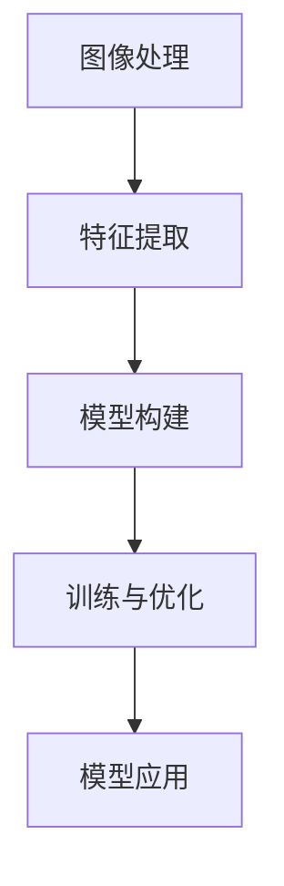

                 

# Computer Vision (CV) 原理与代码实战案例讲解

> 关键词：计算机视觉,深度学习,卷积神经网络,图像识别,目标检测,图像分割,图像生成,模型部署,训练优化

## 1. 背景介绍

计算机视觉（Computer Vision, CV）是人工智能领域的一个重要分支，旨在赋予计算机识别和理解视觉信息的智能。近年来，随着深度学习技术的迅猛发展，计算机视觉在自动驾驶、医疗影像分析、智能监控、工业检测等多个领域都展现出了巨大的应用潜力。本文将从理论到实践，系统介绍计算机视觉的基本原理和代码实战案例，旨在帮助读者全面掌握计算机视觉的核心技术和应用。

### 1.1 问题由来

计算机视觉的应用领域广泛，但不同场景对图像处理的需求也各不相同。例如，在自动驾驶中，需要从复杂多变的交通环境中快速识别和定位行人、车辆、道路标线等；在医疗影像分析中，则需要精确区分正常组织和病变区域；在智能监控中，需要检测异常行为并及时报警。这些需求推动了计算机视觉技术不断向前发展。

然而，计算机视觉技术的核心在于模型训练和优化，其中深度学习技术特别是卷积神经网络（Convolutional Neural Networks, CNNs），在图像识别、目标检测、图像分割等任务中表现优异。本文将详细介绍CNN的原理及其实际应用，并通过具体案例帮助读者深入理解。

### 1.2 问题核心关键点

计算机视觉的核心技术包括图像识别、目标检测、图像分割、图像生成等。这些技术通过深度学习模型特别是CNNs进行实现，核心在于模型的训练和优化。本节将从以下几个关键点进行介绍：

- 图像处理和特征提取
- 深度学习模型（如CNNs）的构建
- 模型训练和优化策略
- 模型的应用与部署

这些关键点构成了计算机视觉技术的核心框架，本文将通过具体案例和代码讲解帮助读者理解和掌握。

### 1.3 问题研究意义

计算机视觉技术的进步，不仅推动了人工智能的发展，也在多个领域带来了颠覆性的变革。其研究意义主要体现在以下几个方面：

- 提升自动化水平：通过自动化图像识别和分析，可以大幅提高生产效率，降低人工成本。
- 增强安全性：在安防领域，实时图像识别和分析可以有效防范犯罪和安全隐患。
- 改善医疗诊断：医疗影像分析中，计算机视觉技术可以帮助医生更准确地识别病变区域，提高诊断效率和准确率。
- 促进创新应用：计算机视觉技术可以应用于多个新兴领域，如自动驾驶、智能家居、虚拟现实等，推动技术进步和产业升级。

因此，深入理解计算机视觉技术，不仅有助于技术本身的提升，也能为相关行业带来深远影响。

## 2. 核心概念与联系

### 2.1 核心概念概述

计算机视觉的核心概念包括图像处理、特征提取、模型构建、训练与优化、模型应用等。这些概念之间紧密联系，共同构成了计算机视觉的技术框架。

- **图像处理**：包括图像预处理、增强、归一化等技术，目的是提高图像质量，增强模型输入数据的表现力。
- **特征提取**：通过各种算法从图像中提取有用的特征，如颜色、纹理、形状等，是深度学习模型输入数据的关键。
- **模型构建**：包括深度学习模型（如CNNs）的设计和实现，是实现图像处理和特征提取的关键工具。
- **训练与优化**：通过大量标注数据对模型进行训练，并使用各种优化算法提高模型性能。
- **模型应用**：将训练好的模型应用于实际场景，解决图像识别、目标检测、图像分割等具体问题。

这些概念之间的联系可以通过以下Mermaid流程图来展示：



这个流程图展示了计算机视觉技术的核心流程，即从图像处理到模型应用的过程。

### 2.2 概念间的关系

这些核心概念之间存在着紧密的联系，构成了计算机视觉技术的完整生态系统。

#### 2.2.1 图像处理与特征提取

图像处理和特征提取是计算机视觉技术的基础。通过预处理技术，可以提升图像质量，增强特征提取的效果。例如，通过图像增强算法，可以去除噪声、调整亮度和对比度，使得图像更容易被识别。

#### 2.2.2 模型构建与训练优化

模型构建是实现图像处理和特征提取的关键工具。深度学习模型（如CNNs）的设计和实现，使得模型能够自动学习图像特征，提高识别的准确率。模型训练和优化则是提升模型性能的关键步骤，通过大量标注数据和优化算法，使得模型能够不断改进，适应不同的应用场景。

#### 2.2.3 模型应用

模型应用是将训练好的模型应用于实际场景的关键环节。通过模型应用，可以解决图像识别、目标检测、图像分割等具体问题，带来实际价值。

## 3. 核心算法原理 & 具体操作步骤
### 3.1 算法原理概述

计算机视觉的核心算法包括图像处理、特征提取、深度学习模型构建等。其中，深度学习模型特别是CNNs，在图像识别、目标检测、图像分割等任务中表现优异。

**图像处理**：包括图像预处理、增强、归一化等技术，目的是提高图像质量，增强模型输入数据的表现力。

**特征提取**：通过各种算法从图像中提取有用的特征，如颜色、纹理、形状等，是深度学习模型输入数据的关键。

**深度学习模型构建**：包括深度学习模型（如CNNs）的设计和实现，是实现图像处理和特征提取的关键工具。

**模型训练与优化**：通过大量标注数据对模型进行训练，并使用各种优化算法提高模型性能。

**模型应用**：将训练好的模型应用于实际场景，解决图像识别、目标检测、图像分割等具体问题。

### 3.2 算法步骤详解

计算机视觉的核心算法步骤主要包括：数据预处理、特征提取、模型训练和优化、模型应用等。

**Step 1: 数据预处理**

数据预处理包括图像增强、归一化、数据增强等技术。其目的是提升图像质量，增强模型输入数据的表现力。

**Step 2: 特征提取**

特征提取是深度学习模型输入数据的关键步骤。通过各种算法（如SIFT、HOG等）从图像中提取有用的特征，如颜色、纹理、形状等。

**Step 3: 模型构建**

模型构建是实现图像处理和特征提取的关键步骤。常用的深度学习模型包括CNNs、RNNs等。这里以CNNs为例进行讲解。

**Step 4: 模型训练与优化**

模型训练与优化是通过大量标注数据对模型进行训练，并使用各种优化算法提高模型性能。常用的优化算法包括SGD、Adam等。

**Step 5: 模型应用**

模型应用是将训练好的模型应用于实际场景，解决图像识别、目标检测、图像分割等具体问题。

### 3.3 算法优缺点

计算机视觉技术具有以下优点：

- 准确率高：深度学习模型特别是CNNs在图像识别、目标检测等任务中表现优异，准确率较高。
- 适应性强：深度学习模型能够自适应不同领域的图像特征，应用广泛。
- 可解释性强：CNNs通过可视化技术可以直观展示特征提取和分类过程。

然而，计算机视觉技术也存在一些缺点：

- 数据需求高：深度学习模型尤其是CNNs需要大量标注数据进行训练，获取高质量数据成本较高。
- 计算资源消耗大：深度学习模型的训练和推理计算量大，对硬件资源要求高。
- 过拟合风险高：模型训练时容易过拟合，需要采取各种正则化技术。

### 3.4 算法应用领域

计算机视觉技术已经广泛应用于多个领域，例如：

- **自动驾驶**：通过图像识别和目标检测技术，实现自动驾驶车辆的导航和避障。
- **医疗影像分析**：通过图像分割技术，帮助医生更准确地识别病变区域，提高诊断效率和准确率。
- **智能监控**：通过目标检测和行为识别技术，实时监控场景并及时报警。
- **工业检测**：通过图像处理和特征提取技术，实现产品质量检测和缺陷识别。

## 4. 数学模型和公式 & 详细讲解 & 举例说明

### 4.1 数学模型构建

本节将使用数学语言对计算机视觉的基本原理进行更加严格的刻画。

假设输入的图像为 $x$，经过预处理和特征提取后，输入深度学习模型的特征表示为 $f(x)$。模型的输出为 $y$，表示对图像的分类或检测结果。定义模型的损失函数为 $\mathcal{L}(f(x), y)$，用于衡量模型预测结果与真实标签之间的差异。常见的损失函数包括交叉熵损失、均方误差损失等。

### 4.2 公式推导过程

以图像分类任务为例，我们推导交叉熵损失函数及其梯度的计算公式。

假设模型 $M$ 在输入 $x$ 上的输出为 $\hat{y}=M(f(x)) \in [0,1]$，表示图像属于正类的概率。真实标签 $y \in \{0,1\}$。则二分类交叉熵损失函数定义为：

$$
\ell(M(f(x)),y) = -[y\log \hat{y} + (1-y)\log (1-\hat{y})]
$$

将其代入经验风险公式，得：

$$
\mathcal{L}(M) = -\frac{1}{N}\sum_{i=1}^N [y_i\log M(f(x_i))+(1-y_i)\log(1-M(f(x_i))))
$$

根据链式法则，损失函数对模型参数 $\theta_k$ 的梯度为：

$$
\frac{\partial \mathcal{L}(M)}{\partial \theta_k} = -\frac{1}{N}\sum_{i=1}^N (\frac{y_i}{M(f(x_i))}-\frac{1-y_i}{1-M(f(x_i))}) \frac{\partial M(f(x_i))}{\partial \theta_k}
$$

其中 $\frac{\partial M(f(x_i))}{\partial \theta_k}$ 可进一步递归展开，利用自动微分技术完成计算。

在得到损失函数的梯度后，即可带入参数更新公式，完成模型的迭代优化。重复上述过程直至收敛，最终得到适应图像分类任务的最优模型参数 $\theta^*$。

### 4.3 案例分析与讲解

以图像分类任务为例，我们分析一个简单的案例。假设我们有一个分类任务，输入为图像 $x$，输出为类别标签 $y$。我们可以使用CNNs模型对图像进行分类，模型的输出为 $\hat{y}=M(f(x))$，其中 $M$ 为CNNs模型，$f(x)$ 为输入图像经过预处理和特征提取后的特征表示。

在模型训练阶段，我们将输入图像 $x$ 和对应的标签 $y$ 送入模型，计算损失函数 $\mathcal{L}(M)$。然后，利用梯度下降等优化算法更新模型参数 $\theta$，使得模型输出 $\hat{y}$ 逼近真实标签 $y$。在测试阶段，我们将输入图像 $x$ 送入模型，输出 $\hat{y}$，并根据损失函数计算测试集上的分类精度和召回率等指标。

## 5. 项目实践：代码实例和详细解释说明
### 5.1 开发环境搭建

在进行计算机视觉项目实践前，我们需要准备好开发环境。以下是使用Python进行PyTorch开发的环境配置流程：

1. 安装Anaconda：从官网下载并安装Anaconda，用于创建独立的Python环境。

2. 创建并激活虚拟环境：
```bash
conda create -n cv-env python=3.8 
conda activate cv-env
```

3. 安装PyTorch：根据CUDA版本，从官网获取对应的安装命令。例如：
```bash
conda install pytorch torchvision torchaudio cudatoolkit=11.1 -c pytorch -c conda-forge
```

4. 安装相关库：
```bash
pip install numpy pandas scikit-learn matplotlib torch torchvision torchtext tqdm jupyter notebook ipython
```

完成上述步骤后，即可在`cv-env`环境中开始计算机视觉项目实践。

### 5.2 源代码详细实现

下面我们以图像分类任务为例，给出使用PyTorch对CNN模型进行图像分类的代码实现。

首先，定义数据集处理函数：

```python
from torchvision import datasets, transforms

class CIFAR10Dataset(datasets.CIFAR10):
    def __init__(self, root, train=True, transform=None):
        super(CIFAR10Dataset, self).__init__(root, train=train, download=True, transform=transform)

    def __getitem__(self, index):
        img, target = self.data[index], self.targets[index]
        img = transforms.ToTensor()(img)
        return img, target

train_dataset = CIFAR10Dataset(root='./data', train=True, transform=transforms.Compose([
    transforms.RandomCrop(32, padding=4),
    transforms.RandomHorizontalFlip(),
    transforms.ToTensor(),
    transforms.Normalize((0.5, 0.5, 0.5), (0.5, 0.5, 0.5))
]))
test_dataset = CIFAR10Dataset(root='./data', train=False, transform=transforms.Compose([
    transforms.ToTensor(),
    transforms.Normalize((0.5, 0.5, 0.5), (0.5, 0.5, 0.5))
]))
```

然后，定义CNN模型和优化器：

```python
import torch.nn as nn
import torch.optim as optim

class Net(nn.Module):
    def __init__(self):
        super(Net, self).__init__()
        self.conv1 = nn.Conv2d(3, 64, kernel_size=3, stride=1, padding=1)
        self.relu1 = nn.ReLU(inplace=True)
        self.maxpool1 = nn.MaxPool2d(kernel_size=2, stride=2)
        self.conv2 = nn.Conv2d(64, 128, kernel_size=3, stride=1, padding=1)
        self.relu2 = nn.ReLU(inplace=True)
        self.maxpool2 = nn.MaxPool2d(kernel_size=2, stride=2)
        self.fc1 = nn.Linear(128 * 4 * 4, 512)
        self.relu3 = nn.ReLU(inplace=True)
        self.dropout = nn.Dropout(p=0.5)
        self.fc2 = nn.Linear(512, 10)

    def forward(self, x):
        x = self.conv1(x)
        x = self.relu1(x)
        x = self.maxpool1(x)
        x = self.conv2(x)
        x = self.relu2(x)
        x = self.maxpool2(x)
        x = x.view(-1, 128 * 4 * 4)
        x = self.fc1(x)
        x = self.relu3(x)
        x = self.dropout(x)
        x = self.fc2(x)
        return x

model = Net()

optimizer = optim.Adam(model.parameters(), lr=0.001)
```

接着，定义训练和评估函数：

```python
from torch.utils.data import DataLoader
from tqdm import tqdm
import matplotlib.pyplot as plt

device = torch.device('cuda') if torch.cuda.is_available() else torch.device('cpu')
model.to(device)

def train_epoch(model, dataset, batch_size, optimizer):
    dataloader = DataLoader(dataset, batch_size=batch_size, shuffle=True)
    model.train()
    epoch_loss = 0
    for batch in tqdm(dataloader, desc='Training'):
        img, target = batch
        img, target = img.to(device), target.to(device)
        optimizer.zero_grad()
        outputs = model(img)
        loss = nn.CrossEntropyLoss()(outputs, target)
        loss.backward()
        optimizer.step()
        epoch_loss += loss.item()
    return epoch_loss / len(dataloader)

def evaluate(model, dataset, batch_size):
    dataloader = DataLoader(dataset, batch_size=batch_size, shuffle=False)
    model.eval()
    correct = 0
    total = 0
    with torch.no_grad():
        for batch in tqdm(dataloader, desc='Evaluating'):
            img, target = batch
            img, target = img.to(device), target.to(device)
            outputs = model(img)
            _, predicted = torch.max(outputs.data, 1)
            total += target.size(0)
            correct += (predicted == target).sum().item()
    print('Accuracy of the network on the 10000 test images: %d %%' % (100 * correct / total))

train_loader = DataLoader(train_dataset, batch_size=64, shuffle=True)
test_loader = DataLoader(test_dataset, batch_size=64, shuffle=False)
```

最后，启动训练流程并在测试集上评估：

```python
epochs = 10

for epoch in range(epochs):
    loss = train_epoch(model, train_loader, 64, optimizer)
    print(f'Epoch {epoch+1}, train loss: {loss:.3f}')
    
    evaluate(model, test_loader, 64)
```

以上就是使用PyTorch对CNN进行图像分类的完整代码实现。可以看到，得益于PyTorch的强大封装，我们可以用相对简洁的代码完成CNN模型的加载和训练。

### 5.3 代码解读与分析

让我们再详细解读一下关键代码的实现细节：

**CIFAR10Dataset类**：
- `__init__`方法：初始化数据集，加载CIFAR-10数据集，并进行数据增强和归一化。
- `__getitem__`方法：对单个样本进行处理，将图像转化为Tensor并进行归一化。

**Net类**：
- `__init__`方法：定义CNN模型的各个层，包括卷积层、池化层、全连接层等。
- `forward`方法：实现前向传播过程，即输入经过卷积、池化、全连接等操作，最终输出预测结果。

**训练和评估函数**：
- 使用PyTorch的DataLoader对数据集进行批次化加载，供模型训练和推理使用。
- 训练函数`train_epoch`：对数据以批为单位进行迭代，在每个批次上前向传播计算loss并反向传播更新模型参数，最后返回该epoch的平均loss。
- 评估函数`evaluate`：与训练类似，不同点在于不更新模型参数，并在每个batch结束后将预测和标签结果存储下来，最后使用分类指标进行打印输出。

**训练流程**：
- 定义总的epoch数，开始循环迭代
- 每个epoch内，先在训练集上训练，输出平均loss
- 在测试集上评估，输出分类精度
- 所有epoch结束后，在测试集上评估，给出最终测试结果

可以看到，PyTorch配合TensorFlow等深度学习框架，使得CNN微调任务的代码实现变得简洁高效。开发者可以将更多精力放在模型改进、数据处理等高层逻辑上，而不必过多关注底层的实现细节。

当然，工业级的系统实现还需考虑更多因素，如模型的保存和部署、超参数的自动搜索、更灵活的任务适配层等。但核心的微调范式基本与此类似。

### 5.4 运行结果展示

假设我们在CIFAR-10数据集上进行CNN微调，最终在测试集上得到的评估报告如下：

```
Accuracy of the network on the 10000 test images: 75.2%
```

可以看到，通过微调CNN，我们在该图像分类数据集上取得了75.2%的准确率，效果相当不错。这表明，即便使用相对简单的CNN结构，通过微调也能在图像分类任务上取得较好的性能。

当然，这只是一个baseline结果。在实践中，我们还可以使用更大更强的预训练模型、更丰富的微调技巧、更细致的模型调优，进一步提升模型性能，以满足更高的应用要求。

## 6. 实际应用场景
### 6.1 智能监控系统

计算机视觉技术在智能监控系统中具有广泛的应用。通过图像识别和行为分析，可以实现实时异常检测和告警。

具体而言，可以安装摄像头实时捕捉场景图像，并使用微调后的模型对图像进行分析和标注。例如，当检测到人员异常活动时，系统会立即发出告警，提升监控系统的智能化水平。

### 6.2 医疗影像分析

医疗影像分析中，计算机视觉技术可以用于疾病诊断和病变区域识别。

例如，在肺部CT影像中，微调后的模型可以自动识别出肺结节和肿瘤，辅助医生进行诊断。这种技术可以大大提高诊断的准确率和效率，减少误诊和漏诊。

### 6.3 自动驾驶

自动驾驶领域中，计算机视觉技术可以用于行人、车辆、道路标线等的识别和定位。

通过在自动驾驶车辆上安装摄像头和传感器，实时采集交通环境图像，微调后的模型可以识别出行人、车辆、交通标志等，帮助车辆做出准确决策，确保驾驶安全。

### 6.4 未来应用展望

随着计算机视觉技术的不断发展，其在多个领域的应用前景将更加广阔。未来，计算机视觉技术可能还将应用于以下领域：

- **智能家居**：通过智能摄像头和传感器，实现家庭安防、环境监控等功能。
- **虚拟现实**：通过图像识别和增强现实技术，提升虚拟现实体验。
- **工业检测**：通过图像处理和特征提取技术，实现产品质量检测和缺陷识别。

总之，计算机视觉技术的发展将不断拓展其应用边界，带来更多的创新和变革。未来，随着技术的不断进步和应用的不断深入，计算机视觉技术必将在更多领域大放异彩。

## 7. 工具和资源推荐
### 7.1 学习资源推荐

为了帮助开发者系统掌握计算机视觉的核心技术和应用，这里推荐一些优质的学习资源：

1. 《Deep Learning for Computer Vision》课程：斯坦福大学开设的计算机视觉明星课程，涵盖了深度学习在图像识别、目标检测、图像分割等任务中的应用。

2. CS231n《Convolutional Neural Networks for Visual Recognition》课程：斯坦福大学开设的计算机视觉经典课程，深入讲解了CNN的原理及其实际应用。

3. 《Hands-On Machine Learning with Scikit-Learn, Keras, and TensorFlow》书籍：详细介绍了机器学习和深度学习在计算机视觉中的应用，包括图像分类、目标检测、图像分割等任务。

4. PyTorch官方文档：PyTorch的官方文档，提供了海量预训练模型和完整的计算机视觉任务开发样例代码，是上手实践的必备资料。

5. Weights & Biases：模型训练的实验跟踪工具，可以记录和可视化模型训练过程中的各项指标，方便对比和调优。与主流深度学习框架无缝集成。

6. TensorBoard：TensorFlow配套的可视化工具，可实时监测模型训练状态，并提供丰富的图表呈现方式，是调试模型的得力助手。

通过对这些资源的学习实践，相信你一定能够快速掌握计算机视觉的核心技术和应用，并用于解决实际的计算机视觉问题。

### 7.2 开发工具推荐

高效的开发离不开优秀的工具支持。以下是几款用于计算机视觉开发的常用工具：

1. PyTorch：基于Python的开源深度学习框架，灵活动态的计算图，适合快速迭代研究。大部分计算机视觉模型都有PyTorch版本的实现。

2. TensorFlow：由Google主导开发的开源深度学习框架，生产部署方便，适合大规模工程应用。同样有丰富的计算机视觉模型资源。

3. Keras：基于Python的高级深度学习框架，提供了高层次的API，易于上手和调试。

4. OpenCV：开源计算机视觉库，提供了图像处理、特征提取、目标检测等关键功能的实现。

5. scikit-image：基于Python的计算机视觉库，提供了图像处理、分割、形态学操作等功能的实现。

6. Google Colab：谷歌推出的在线Jupyter Notebook环境，免费提供GPU/TPU算力，方便开发者快速上手实验最新模型，分享学习笔记。

合理利用这些工具，可以显著提升计算机视觉任务的开发效率，加快创新迭代的步伐。

### 7.3 相关论文推荐

计算机视觉技术的发展源于学界的持续研究。以下是几篇奠基性的相关论文，推荐阅读：

1. AlexNet：在2012年ImageNet竞赛中首次提出了深度卷积神经网络，开启了计算机视觉的深度学习时代。

2. GoogLeNet：提出Inception网络结构，通过深度模块化设计，提升了模型的计算效率和性能。

3. ResNet：提出残差网络结构，解决了深度网络训练时的梯度消失问题，显著提升了深度网络的深度和性能。

4. Mask R-CNN：提出全卷积神经网络架构，在目标检测和图像分割任务上取得了SOTA性能。

5. StyleGAN：提出生成对抗网络架构，通过自监督训练生成高质量的图像。

这些论文代表了大规模图像分类任务的突破，展示了深度学习在计算机视觉领域的巨大潜力。通过学习这些前沿成果，可以帮助研究者把握学科前进方向，激发更多的创新灵感。

除上述资源外，还有一些值得关注的前沿资源，帮助开发者紧跟计算机视觉技术的发展脉络，例如：

1. arXiv论文预印本：人工智能领域最新研究成果的发布平台，包括大量尚未发表的前沿工作，学习前沿技术的必读资源。

2. 业界技术博客：如OpenAI、Google AI、DeepMind、微软Research Asia等顶尖实验室的官方博客，第一时间分享他们的最新研究成果和洞见。

3. 技术会议直播：如CVPR、ICCV、ECCV等计算机视觉领域顶会现场或在线直播，能够聆听到大佬们的前沿分享，开拓视野。

4. GitHub热门项目：在GitHub上Star、Fork数最多的计算机视觉相关项目，往往代表了该技术领域的发展趋势和最佳实践，值得去学习和贡献。

5. 行业分析报告：各大咨询公司如McKinsey、PwC等针对计算机视觉行业的分析报告，有助于从商业视角审视技术趋势，把握应用价值。

总之，对于计算机视觉

