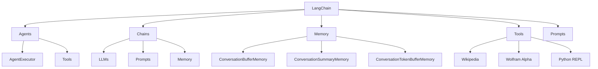

# 【LangChain编程：从入门到实践】对话场景

## 1. 背景介绍

### 1.1 问题的由来

在当今的人工智能时代，构建对话系统已经成为一个热门话题。随着自然语言处理(NLP)技术的不断进步,人们对于与机器进行自然、流畅的对话交互有着越来越高的期望。然而,传统的对话系统通常是基于规则或者模板的,缺乏灵活性和上下文理解能力,难以满足复杂场景下的需求。

### 1.2 研究现状

为了解决这一问题,研究人员提出了基于大型语言模型(LLM)的对话系统框架,例如OpenAI的GPT、谷歌的LaMDA等。这些模型通过在海量文本数据上进行预训练,获得了强大的自然语言理解和生成能力。然而,直接将LLM应用于对话系统仍然存在一些挑战,例如:

1. **上下文管理**:LLM难以有效地利用对话历史信息,导致生成的响应缺乏连贯性。
2. **知识库集成**:LLM的知识主要来自于训练数据,难以灵活地融入外部知识库。
3. **可解释性**:LLM的决策过程是一个黑箱,缺乏可解释性,难以调试和优化。

### 1.3 研究意义

为了解决上述挑战,LangChain作为一个新兴的开源框架应运而生。它旨在简化LLM与外部数据源(如知识库、API等)的集成,并提供了一系列模块化的组件,使得开发人员能够快速构建具有上下文理解能力、知识增强能力和可解释性的对话系统。

LangChain的出现为构建高质量的对话系统提供了新的思路和工具,有望推动对话系统的发展,并在诸多领域(如客户服务、教育、医疗等)发挥重要作用。

### 1.4 本文结构

本文将全面介绍LangChain框架,内容包括:

1. 核心概念与联系
2. 核心算法原理与具体操作步骤
3. 数学模型和公式详细讲解与举例说明
4. 项目实践:代码实例和详细解释说明
5. 实际应用场景
6. 工具和资源推荐
7. 总结:未来发展趋势与挑战
8. 附录:常见问题与解答

## 2. 核心概念与联系

在深入探讨LangChain的细节之前,我们需要先了解一些核心概念及其之间的联系。

1. **Agents**: 代理是LangChain中的一个关键概念,它将LLM与其他组件(如工具、内存等)结合在一起,以执行复杂的任务。代理可以通过AgentExecutor来实例化和运行。

2. **Chains**: 链是一系列组件的组合,用于完成特定的任务。链可以包含LLM、Prompts、内存等组件。

3. **Memory**: 内存模块用于存储和管理对话历史信息,以提供上下文理解能力。LangChain提供了多种内存实现,如ConversationBufferMemory、ConversationSummaryMemory等。

4. **Tools**: 工具是外部数据源或功能的抽象,如Wikipedia、Wolfram Alpha、Python REPL等。代理可以调用这些工具来获取额外的信息或执行特定的操作。

5. **Prompts**: Prompts是用于指导LLM生成输出的提示语句。LangChain提供了多种Prompt模板和工具,以简化Prompt的构建和管理。

6. **LLMs**: 大型语言模型(LLM)是LangChain的核心部分,用于自然语言理解和生成。LangChain支持多种LLM,如GPT-3、BERT等。

这些概念相互关联,共同构建了LangChain的核心框架。例如,一个代理可以利用链来执行任务,同时调用工具获取额外信息,并使用内存来管理对话历史。

## 3. 核心算法原理 & 具体操作步骤

### 3.1 算法原理概述

LangChain的核心算法是一种基于代理的方法,用于协调LLM、工具、内存等组件,以完成复杂的任务。该算法的主要思路如下:

1. **任务分解**: 将复杂的任务分解为一系列子任务。
2. **子任务执行**: 使用代理来执行每个子任务,代理可以调用LLM、工具和内存等组件来完成子任务。
3. **结果合并**: 将子任务的结果合并,形成最终的任务输出。

该算法的核心在于代理的设计和实现。LangChain提供了多种代理类型,如序列代理(SequentialAgent)、反思代理(ReflectingAgent)等,每种代理都有不同的任务分解和执行策略。

### 3.2 算法步骤详解

以序列代理(SequentialAgent)为例,我们详细介绍算法的具体步骤:

1. **初始化代理**: 创建一个序列代理实例,并设置相关参数(如LLM、工具、内存等)。

2. **任务分解**: 代理将输入任务分解为一系列子任务。具体分解策略由代理的task_splitter模块决定。

3. **子任务执行循环**:
   a. 代理选择当前要执行的子任务。
   b. 代理调用output_parser模块,根据子任务生成Prompt,并将Prompt输入LLM,获取LLM的输出。
   c. 代理调用input_parser模块,解析LLM的输出,并确定是否需要调用工具。
   d. 如果需要调用工具,代理执行相应的工具,并将工具输出作为观察结果。
   e. 代理将观察结果存储在内存中,并更新任务列表。
   f. 重复步骤a-e,直到所有子任务完成。

4. **结果合并**: 代理将所有子任务的结果合并,形成最终的输出。

以上是序列代理算法的基本流程。其他类型的代理(如反思代理)可能会有不同的任务分解和执行策略,但核心思路是相似的。

### 3.3 算法优缺点

LangChain的基于代理的算法具有以下优点:

1. **模块化设计**: 算法将不同的功能模块化,如LLM、工具、内存等,便于扩展和定制。
2. **灵活性**: 可以根据任务需求调整代理的行为,如任务分解策略、工具选择等。
3. **可解释性**: 代理的决策过程可以被记录和解释,提高了系统的透明度。

然而,该算法也存在一些缺点:

1. **性能开销**: 任务分解和多次调用LLM可能会增加计算开销。
2. **错误传播**: 如果任何一个子任务出现错误,可能会影响整个任务的执行。
3. **上下文管理**: 在长期对话中,有效管理上下文信息仍然是一个挑战。

### 3.4 算法应用领域

LangChain的基于代理的算法可以应用于多种场景,包括但不限于:

1. **问答系统**: 利用LLM的自然语言理解能力,结合外部知识库,构建高质量的问答系统。
2. **任务自动化**: 将复杂的任务分解为多个子任务,并利用代理协调LLM和工具的执行,实现任务自动化。
3. **决策支持系统**: 通过代理调用多个工具和数据源,为决策过程提供全面的信息支持。
4. **创意辅助**: 利用LLM的创意生成能力,结合外部数据和约束条件,为创意工作提供辅助。

总的来说,LangChain的算法为构建智能化的对话系统和决策支持系统提供了一种灵活、可扩展的解决方案。

## 4. 数学模型和公式 & 详细讲解 & 举例说明

虽然LangChain主要是一个基于代理的框架,但它也涉及一些数学模型和公式,特别是在评估和优化LLM输出时。本节将介绍一些常见的数学模型和公式,并详细讲解它们的原理和应用。

### 4.1 数学模型构建

#### 4.1.1 语言模型评估

语言模型评估是衡量LLM输出质量的关键步骤。常用的评估指标包括:

1. **Perplexity(PPL)**: 反映了模型对语料库的建模能力,PPL值越小,模型质量越好。PPL的计算公式如下:

$$PPL(W) = P(w_1, w_2, ..., w_N)^{-\frac{1}{N}} = \sqrt[N]{\frac{1}{\prod_{i=1}^N P(w_i|w_1, ..., w_{i-1})}}$$

其中,W表示语料库,N表示词数,$P(w_i|w_1, ..., w_{i-1})$表示第i个词在前i-1个词的条件下出现的概率。

2. **BLEU分数**: 常用于机器翻译领域,衡量候选译文与参考译文的相似度。BLEU分数的计算公式如下:

$$BLEU = BP \cdot \exp(\sum_{n=1}^N w_n \log p_n)$$

其中,BP是一个惩罚因子,用于惩罚过短的译文;$p_n$是n-gram的精确度;$w_n$是n-gram的权重。

#### 4.1.2 Prompt优化

Prompt优化是提高LLM输出质量的另一个重要方向。常用的优化方法包括:

1. **Prompt编辑距离**: 通过计算Prompt与目标输出之间的编辑距离,优化Prompt的表达。编辑距离的计算公式如下:

$$EditDistance(s_1, s_2) = \min\begin{cases}
EditDistance(s_1, s_2[:-1]) + 1 & \text{(删除操作)}\
EditDistance(s_1[:-1], s_2) + 1 & \text{(插入操作)}\
EditDistance(s_1[:-1], s_2[:-1]) + (s_1[-1] \neq s_2[-1]) & \text{(替换操作)}\
0 & \text{(s_1 和 s_2 为空)}
\end{cases}$$

其中,s_1和s_2分别表示两个字符串。

2. **Prompt蒸馏**: 通过知识蒸馏的方式,将大型LLM的知识迁移到更小的Prompt模型中,从而提高Prompt的效率和质量。蒸馏损失函数的公式如下:

$$\mathcal{L}_{distill} = \sum_{x \in \mathcal{D}} \text{KL}(p_T(y|x) || p_S(y|x))$$

其中,$\mathcal{D}$表示训练数据集,p_T和p_S分别表示教师模型(大型LLM)和学生模型(Prompt模型)的输出概率分布,KL表示KL散度。

上述数学模型和公式为LangChain提供了理论基础,有助于评估和优化LLM的输出质量。

### 4.2 公式推导过程

下面我们详细推导Perplexity(PPL)的计算公式:

根据概率论,对于一个序列$W = w_1, w_2, ..., w_N$,我们有:

$$P(W) = P(w_1, w_2, ..., w_N) = \prod_{i=1}^N P(w_i|w_1, ..., w_{i-1})$$

取对数,我们得到:

$$\log P(W) = \sum_{i=1}^N \log P(w_i|w_1, ..., w_{i-1})$$

定义PPL为序列概率的倒数的N次方根,即:

$$PPL(W) = P(W)^{-\frac{1}{N}} = \sqrt[N]{\frac{1}{\prod_{i=1}^N P(w_i|w_1, ..., w_{i-1})}}$$

将对数形式代入,我们得到:

$$\log PPL(W) = -\frac{1}{N} \sum_{i=1}^N \log P(w_i|w_1, ..., w_{i-1})$$

因此,PPL可以通过计算条件概率的对数值的平均值来近似估计