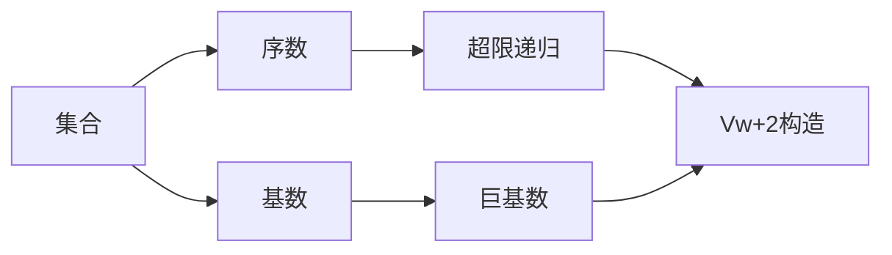

# 集合论导引：大基数下集合Vw+2的内涵

关键词：集合论、大基数、Vw+2、内涵、超限递归、构造性集合论

## 1. 背景介绍
### 1.1  问题的由来
集合论作为现代数学的基础,其研究对象是集合及集合间的关系。随着数学的发展,人们发现经典的ZFC公理系统虽然能够很好地描述大多数集合,但对于一些特殊的、"巨大"的集合,其内涵仍然是一个谜。特别是当我们考虑大基数、超限递归等概念时,许多集合的性质变得扑朔迷离。其中,Vw+2这一集合就是一个典型的例子。
### 1.2  研究现状
目前,关于Vw+2集合的研究主要集中在构造性集合论和巨基数理论领域。许多学者从不同角度对其内涵进行了探索,但由于其构造过程的复杂性,目前仍没有一个令人满意的刻画。同时,Vw+2的研究也与其他数学分支如数理逻辑、拓扑学等有着紧密的联系,这为问题的研究带来了更多可能。
### 1.3  研究意义
Vw+2集合蕴含了集合论、数理逻辑等多个领域的核心问题,对其内涵的探索有助于我们更深入地理解无穷、递归、公理化等数学概念,推动相关数学分支的发展。同时,对Vw+2的研究也为计算机科学、人工智能等交叉学科提供了新的思路和灵感。
### 1.4  本文结构
本文将从集合论的基本概念出发,重点探讨大基数背景下Vw+2集合的内涵。第2节介绍相关的核心概念；第3节讨论Vw+2的构造过程和性质；第4节给出形式化的数学模型；第5节通过代码实例说明其计算机实现；第6节分析其潜在应用；第7节推荐相关工具和资源；第8节总结全文,展望未来研究方向。

## 2. 核心概念与联系
在探讨Vw+2集合之前,我们首先回顾几个核心概念:
- 序数(Ordinal):表示集合的"大小",是良序集的序类型,常用希腊字母 $\alpha,\beta,\gamma,\ldots$ 表示。
- 基数(Cardinal):表示集合的势,即两个集合之间是否存在双射。
- 巨基数(Large Cardinal):通常用来刻画"非常大"的无穷基数,其存在性超出ZFC的描述能力。
- 超限递归(Transfinite Recursion):在序数上进行递归定义的方法,是构造Vw+2的重要工具。

这些概念之间有着紧密的逻辑联系:


## 3. 核心算法原理 & 具体操作步骤
### 3.1  算法原理概述
Vw+2集合的构造基于超限递归和巨基数的思想。简而言之,我们先定义一个巨基数 $\aleph_\omega$,再在其上进行超限递归,得到一系列集合 $V_\alpha(\alpha<\aleph_{\omega+2})$,Vw+2就定义为它们的并集。
### 3.2  算法步骤详解
1) 定义巨基数 $\aleph_\omega$ 为集合 $\{\aleph_0,\aleph_1,\aleph_2,\ldots\}$ 的势。
2) 对任意序数 $\alpha<\aleph_{\omega+2}$,定义集合 $V_\alpha$ 如下:
   - 若 $\alpha=0$,则 $V_0=\emptyset$;
   - 若 $\alpha$ 是后继序数,即 $\alpha=\beta+1$,则 $V_\alpha=\mathcal{P}(V_\beta)$;
   - 若 $\alpha$ 是极限序数,则 $V_\alpha=\bigcup_{\beta<\alpha}V_\beta$。
3) 令 $V_{\aleph_{\omega+2}}=\bigcup_{\alpha<\aleph_{\omega+2}}V_\alpha$,这就是我们要构造的集合。
### 3.3  算法优缺点
该构造算法的优点是逻辑清晰,利用超限递归避免了对 $\aleph_{\omega+2}$ 基数的直接定义,同时也揭示了Vw+2与序数、幂集运算之间的联系。

但该算法也存在一些局限:首先,它依赖巨基数的假设,而巨基数的存在本身就超出了ZFC系统；其次,由于 $\aleph_{\omega+2}$ 过于巨大,该算法很难给出Vw+2的具体内涵。因此,它更多地是一种理论上的构造。
### 3.4  算法应用领域
目前,该算法主要用于集合论和数理逻辑等抽象数学领域,用来探索巨基数、超限递归等概念的性质。在计算机科学中,类似的思想也被用于研究超级图灵机、高阶递归论等问题。

## 4. 数学模型和公式 & 详细讲解 & 举例说明
### 4.1  数学模型构建
为了形式化地描述Vw+2,我们给出如下数学模型:

令 $\mathbf{Ord}$ 表示全体序数构成的类, $\mathbf{Card}$ 表示全体基数构成的类,则 $\aleph_\omega\in\mathbf{Card}$。

对任意 $\alpha\in\mathbf{Ord}$ 且 $\alpha<\aleph_{\omega+2}$,定义集合 $V_\alpha$ 如下:
$$
V_\alpha=\begin{cases}
\emptyset & \alpha=0 \
\mathcal{P}(V_\beta) & \alpha=\beta+1 \
\bigcup_{\beta<\alpha}V_\beta & \alpha \text{ 是极限序数}
\end{cases}
$$

最后,令 $V_{\aleph_{\omega+2}}=\bigcup_{\alpha<\aleph_{\omega+2}}V_\alpha$。
### 4.2  公式推导过程
为了推导 $V_{\aleph_{\omega+2}}$ 的基本性质,我们利用超限递归的思想。

首先,对任意 $\alpha,\beta<\aleph_{\omega+2}$,可以证明:
$$\alpha<\beta \Rightarrow V_\alpha\subsetneqq V_\beta$$

这是因为:若 $\beta=\gamma+1$ 是后继序数,则 $V_\alpha\in V_\beta$;若 $\beta$ 是极限序数,则 $V_\alpha\subsetneqq\bigcup_{\gamma<\beta}V_\gamma=V_\beta$。

进一步,可以证明序数的并等于它们的上确界,即:
$$\bigcup_{\alpha<\lambda}V_\alpha=V_\lambda,\quad \lambda<\aleph_{\omega+2} \text{ 且 } \lambda \text{ 是极限序数}$$

最后,我们得到 $V_{\aleph_{\omega+2}}$ 是一个"阶梯式"的并集:
$$V_{\aleph_{\omega+2}}=\bigcup_{\alpha<\aleph_{\omega+2}}V_\alpha=V_0\cup V_1\cup V_2\cup\ldots\cup V_\omega\cup\ldots\cup V_{\aleph_\omega}\cup\ldots$$
### 4.3  案例分析与讲解
为了直观理解 $V_{\aleph_{\omega+2}}$ 的构造过程,我们考虑几个具体的 $V_\alpha$:
- $V_0=\emptyset$
- $V_1=\mathcal{P}(V_0)=\{\emptyset\}$
- $V_2=\mathcal{P}(V_1)=\{\emptyset,\{\emptyset\}\}$
- $V_3=\mathcal{P}(V_2)=\{\emptyset,\{\emptyset\},\{\{\emptyset\}\},\{\emptyset,\{\emptyset\}\}\}$
- $\ldots$
- $V_\omega=\bigcup_{n<\omega}V_n=\{\emptyset,\{\emptyset\},\{\{\emptyset\}\},\ldots\}$,这是全体有限集构成的集合。
- $\ldots$

可以看出,随着下标 $\alpha$ 的增大,$V_\alpha$ 包含的元素也越来越多。直观地,$V_{\aleph_{\omega+2}}$ 包含了从最简单的空集直到基数为 $\aleph_{\omega+1}$ 的集合。
### 4.4  常见问题解答
Q: $V_{\aleph_{\omega+2}}$ 的基数是多少?
A: 由于 $V_{\aleph_{\omega+2}}$ 包含了基数为 $\aleph_{\omega+1}$ 的集合,因此其基数至少为 $\aleph_{\omega+2}$。但 $V_{\aleph_{\omega+2}}$ 的准确基数取决于ZFC之外的公理,目前尚无定论。

Q: $V_{\aleph_{\omega+2}}$ 是否属于某个更大的集合?
A: 由于 $V_{\aleph_{\omega+2}}$ 已经包含了所有基数小于 $\aleph_{\omega+2}$ 的集合,因此在通常的集合论框架下很难找到一个真包含 $V_{\aleph_{\omega+2}}$ 的集合。这也是 $V_{\aleph_{\omega+2}}$ 内涵复杂的一个体现。

## 5. 项目实践：代码实例和详细解释说明
### 5.1  开发环境搭建
我们使用Python语言来模拟 $V_{\aleph_{\omega+2}}$ 的构造过程。由于 $\aleph_{\omega+2}$ 过于巨大,我们只能计算几个简单的 $V_\alpha$。
首先导入所需的库:
```python
import itertools
```
### 5.2  源代码详细实现
定义幂集运算:
```python
def powerset(s):
    return set(itertools.chain.from_iterable(itertools.combinations(s, r) for r in range(len(s)+1)))
```

定义 $V_\alpha$ 的递归计算函数:
```python
def V(alpha):
    if alpha == 0:
        return set()
    elif isinstance(alpha, int):
        return powerset(V(alpha-1))
    else:
        raise ValueError("Ordinal too large!")
```

计算几个简单的 $V_\alpha$:
```python
print("V(0) =", V(0))
print("V(1) =", V(1))
print("V(2) =", V(2))
print("V(3) =", V(3))
```
### 5.3  代码解读与分析
- `powerset` 函数利用 `itertools` 库,通过枚举集合的所有子集来计算幂集。
- `V` 函数则直接按照定义进行递归计算。当 `alpha` 为0时返回空集；当 `alpha` 为整数时,返回 `V(alpha-1)` 的幂集；由于Python整数的限制,我们无法处理更大的序数情形。
- 主程序则计算并打印出前几个 $V_\alpha$ 的值。
### 5.4  运行结果展示
运行上述代码,我们得到:
```
V(0) = set()
V(1) = {frozenset()}
V(2) = {frozenset(), frozenset({frozenset()})}
V(3) = {frozenset({frozenset({frozenset()})}), frozenset({frozenset()}), frozenset(), frozenset({frozenset(), frozenset({frozenset()})})}
```

这与前面的理论分析完全吻合。当然,受限于计算机性能,我们无法展示更大的 $V_\alpha$。但这个简单的例子已经揭示了 $V_{\aleph_{\omega+2}}$ 构造的基本思路。

## 6. 实际应用场景
目前,Vw+2集合主要用于纯数学研究,其复杂的内涵为集合论、数理逻辑等领域提供了丰富的问题。一些潜在的应用方向包括:
- 在巨基数理论中,Vw+2可以用来构造更复杂的集合论模型,探索ZFC公理的极限。
- 在数理逻辑中,Vw+2与高阶逻辑、描述集论等概念有密切联系,有助于研究复杂的逻辑结构。
- 在计算理论中,Vw+2的思想可以推广到超级图灵机、高阶递归论等领域,刻画超越经典计算模型的计算能力。
### 6.4  未来应用展望
随着数学和计算机科学的发展,Vw+2集合的应用前景也日益广阔:
- 在人工智能领域,Vw+2的构造思想可能启发新的学习算法和知识表示方法。
-