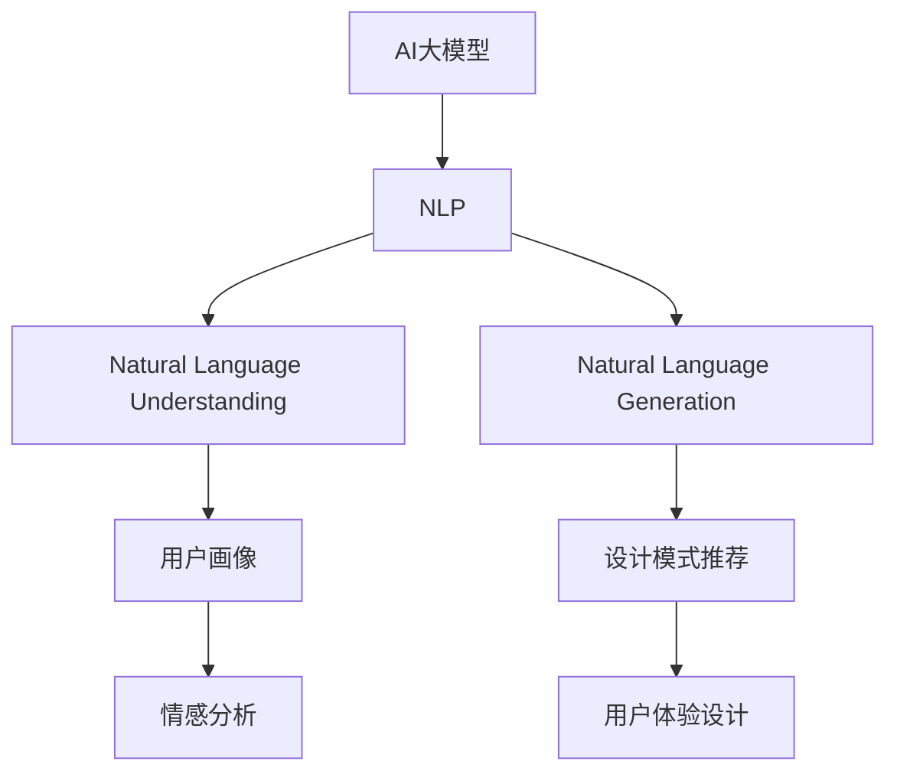
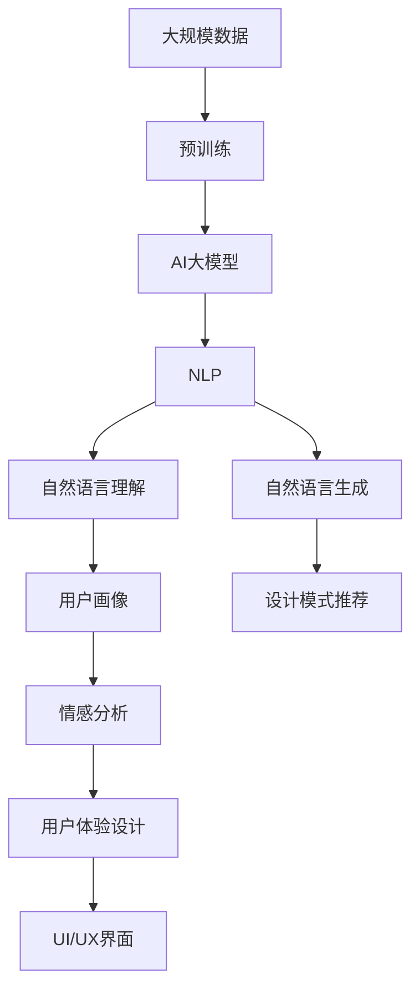

                 

## 1. 背景介绍

### 1.1 问题由来
在快速发展的数字时代，用户体验（User Experience，UX）设计成为了提高产品竞争力和用户满意度的关键因素。传统的设计流程主要依赖设计师的经验和直觉，但随着AI和数据科学的发展，越来越多的企业开始探索利用数据和算法优化用户体验。AI大模型，尤其是预训练的语言模型，在自然语言处理（NLP）领域取得了突破性进展，其强大的自然语言理解和生成能力，使得设计师能够借助模型精确分析用户需求，快速生成设计方案，极大地提升了设计效率和效果。

### 1.2 问题核心关键点
AI大模型在用户体验优化中的主要作用包括：
- **自然语言理解**：利用语言模型理解用户反馈，从中提取关键信息。
- **自然语言生成**：基于用户需求生成设计方案，辅助设计师快速迭代。
- **用户画像构建**：通过分析用户评论、行为数据等构建详细用户画像，指导设计决策。
- **情感分析**：利用情感分析模型了解用户情感状态，从而优化设计中的交互元素。
- **设计模式推荐**：基于历史数据推荐适合不同用户群体和场景的设计模式。

### 1.3 问题研究意义
通过AI大模型优化用户体验设计，可以帮助企业更好地理解用户需求，提升产品竞争力和用户满意度，加速产品迭代过程，同时还能降低设计成本。此外，AI模型的应用使得用户体验设计更加科学化、数据化，有利于推动用户体验设计的标准化和规范化。

## 2. 核心概念与联系

### 2.1 核心概念概述

为更好地理解如何通过AI大模型优化用户体验设计，本节将介绍几个核心概念：

- **AI大模型**：以Transformer架构为代表的深度学习模型，通过在大规模无标签数据上进行预训练，学习到丰富的语言知识和常识，具备强大的自然语言理解和生成能力。
- **用户体验设计（UX设计）**：旨在提供令人愉悦且满足用户需求的用户界面（UI），通过一系列设计原则和工具，提升用户使用体验。
- **自然语言处理（NLP）**：研究如何让计算机理解、处理和生成人类语言，是实现AI大模型与用户体验设计结合的基础。
- **情感分析**：利用自然语言处理技术分析文本中的情感倾向，辅助用户体验设计。
- **用户画像**：基于用户行为数据和反馈，构建详细的用户模型，指导设计决策。
- **设计模式推荐**：通过分析用户需求，推荐适合的设计模式，提高设计效率。

这些概念之间存在紧密联系，通过AI大模型和NLP技术，可以更精确地理解用户需求，生成设计方案，构建用户画像，并进行情感分析，从而全面提升用户体验设计的质量和效率。

### 2.2 概念间的关系

以下是一个Mermaid流程图，展示这些核心概念之间的逻辑关系：



这个流程图展示了AI大模型和NLP技术如何通过理解用户需求、生成设计方案、构建用户画像、情感分析等环节，最终指导用户体验设计。

### 2.3 核心概念的整体架构

最后，用一个综合的流程图来展示这些核心概念在大模型和用户体验设计中的整体架构：



这个综合流程图展示了从数据预训练到大模型构建，再到NLP技术的应用，以及最终的用户体验设计的全流程。通过这一流程，AI大模型和NLP技术可以全面提升用户体验设计的质量和效率。

## 3. 核心算法原理 & 具体操作步骤

### 3.1 算法原理概述

基于AI大模型的用户体验优化，本质上是一个自然语言处理（NLP）任务。其核心思想是：将用户反馈的文本数据作为输入，利用预训练的语言模型进行自然语言理解，提取关键信息，从而指导UI/UX设计。

形式化地，假设用户反馈的文本数据为 $D=\{x_1, x_2, ..., x_n\}$，其中每个 $x_i$ 包含用户对某个UI/UX元素的评价。定义模型的预测输出为 $y$，其目标是最大化预测输出 $y$ 与真实标签 $y^*$ 的拟合程度。即：

$$
\hat{y} = \mathop{\arg\max}_{y} P(y|x)
$$

其中 $P(y|x)$ 为模型在给定输入 $x$ 下预测输出 $y$ 的概率分布。

### 3.2 算法步骤详解

基于AI大模型的用户体验优化一般包括以下几个关键步骤：

**Step 1: 准备预训练模型和数据集**
- 选择合适的预训练语言模型（如GPT、BERT等）作为初始化参数。
- 收集用户反馈的文本数据，作为模型训练的监督信号。

**Step 2: 添加任务适配层**
- 根据具体任务，设计合适的输出层和损失函数。例如，对于文本分类任务，可以添加一个线性分类器和交叉熵损失函数。
- 在预训练模型顶层设计情感分析、用户画像构建等任务适配层。

**Step 3: 设置模型参数**
- 选择合适的优化算法（如Adam、SGD等）及其参数，如学习率、批大小等。
- 设置正则化技术，如权重衰减、Dropout等，防止模型过拟合。
- 确定冻结预训练参数的策略，如仅微调顶层，或全部参数都参与微调。

**Step 4: 执行梯度训练**
- 将用户反馈文本数据分批次输入模型，前向传播计算损失函数。
- 反向传播计算参数梯度，根据设定的优化算法和学习率更新模型参数。
- 周期性在验证集上评估模型性能，根据性能指标决定是否触发 Early Stopping。
- 重复上述步骤直至满足预设的迭代轮数或 Early Stopping 条件。

**Step 5: 测试和部署**
- 在测试集上评估优化后的模型性能，对比优化前后的预测效果。
- 使用优化后的模型对新用户反馈进行推理预测，辅助UI/UX设计。
- 持续收集用户反馈，定期重新微调模型，以适应数据分布的变化。

### 3.3 算法优缺点

基于AI大模型的用户体验优化方法具有以下优点：
- **自动化设计**：通过模型自动分析用户反馈，生成设计方案，减少人工工作量。
- **高效迭代**：模型能够快速迭代优化，缩短设计周期。
- **数据驱动**：以用户反馈为依据，优化设计决策，提升设计准确性。

但该方法也存在以下局限性：
- **数据依赖性**：模型效果依赖于高质量用户反馈数据，数据获取成本较高。
- **模型复杂性**：大模型的训练和部署需要较高的算力和存储资源。
- **可解释性不足**：模型的决策过程较为复杂，难以解释其内部工作机制。
- **模型偏见**：模型可能会学习到数据中的偏见，导致不公平的设计决策。

尽管存在这些局限性，基于AI大模型的用户体验优化方法仍是大数据时代的重要工具，通过持续的技术进步，这些缺点将逐步得到解决。

### 3.4 算法应用领域

基于AI大模型的用户体验优化方法在多个领域得到了广泛应用，例如：

- **移动应用**：优化移动应用的用户界面和交互设计，提升用户使用体验。
- **网站设计**：改进网站的用户体验，提高用户转化率和满意度。
- **智能家居**：通过语音识别和自然语言理解，优化智能家居设备的交互体验。
- **虚拟现实（VR）**：增强VR系统的自然语言理解和交互能力，提升沉浸式体验。
- **客户服务**：利用自然语言生成技术，自动生成客户服务对话，提升客户满意度。

除了这些应用外，基于AI大模型的用户体验优化还在健康、教育、金融等更多领域展现了其潜力。未来，随着技术的发展，用户体验设计的智能化水平将进一步提升，AI大模型将发挥更加重要的作用。

## 4. 数学模型和公式 & 详细讲解  
### 4.1 数学模型构建

本节将使用数学语言对基于AI大模型的用户体验优化过程进行更加严格的刻画。

记用户反馈的文本数据为 $D=\{x_1, x_2, ..., x_n\}$，其中每个 $x_i$ 表示用户对某个UI/UX元素的评价。假设模型的预测输出为 $y$，其目标是最大化预测输出 $y$ 与真实标签 $y^*$ 的拟合程度。

定义模型在给定输入 $x_i$ 下预测输出 $y_i$ 的概率分布为 $P(y_i|x_i)$，则模型的损失函数为：

$$
\mathcal{L}(y_i) = -\log P(y_i|x_i)
$$

在数据集 $D$ 上的经验风险为：

$$
\mathcal{L}(D) = \frac{1}{N} \sum_{i=1}^N \mathcal{L}(y_i)
$$

微调的目标是最小化经验风险，即找到最优参数：

$$
\theta^* = \mathop{\arg\min}_{\theta} \mathcal{L}(D)
$$

在得到损失函数后，即可带入模型参数 $\theta$ 进行优化。根据梯度下降等优化算法，微调过程不断更新模型参数 $\theta$，最小化损失函数 $\mathcal{L}$，使得模型输出逼近真实标签。

### 4.2 公式推导过程

以二分类任务为例，假设模型在输入 $x$ 上的输出为 $\hat{y}=M_{\theta}(x) \in [0,1]$，表示用户反馈对UI/UX元素的正面评价的概率。真实标签 $y \in \{0,1\}$。则二分类交叉熵损失函数定义为：

$$
\ell(y,\hat{y}) = -[y\log \hat{y} + (1-y)\log (1-\hat{y})]
$$

将其代入经验风险公式，得：

$$
\mathcal{L}(D) = -\frac{1}{N}\sum_{i=1}^N [y_i\log M_{\theta}(x_i)+(1-y_i)\log(1-M_{\theta}(x_i))]
$$

根据链式法则，损失函数对参数 $\theta_k$ 的梯度为：

$$
\frac{\partial \mathcal{L}(D)}{\partial \theta_k} = -\frac{1}{N}\sum_{i=1}^N (\frac{y_i}{M_{\theta}(x_i)}-\frac{1-y_i}{1-M_{\theta}(x_i)}) \frac{\partial M_{\theta}(x_i)}{\partial \theta_k}
$$

其中 $\frac{\partial M_{\theta}(x_i)}{\partial \theta_k}$ 可进一步递归展开，利用自动微分技术完成计算。

### 4.3 案例分析与讲解

假设我们使用BERT模型进行用户体验优化，首先将用户反馈的文本数据 $D$ 进行分词和向量化，得到输入张量 $X$ 和标签张量 $Y$。在模型顶层添加一个线性分类器，损失函数为交叉熵损失，使用AdamW优化器进行微调。

具体步骤如下：

1. 加载BERT模型和数据集。
2. 将数据集分为训练集、验证集和测试集。
3. 设计分类器的输出层，包含线性层和sigmoid激活函数。
4. 设置AdamW优化器，并定义损失函数。
5. 开始模型微调，在训练集上进行前向传播和反向传播，更新模型参数。
6. 在验证集上评估模型性能，调整学习率等超参数。
7. 在测试集上最终评估模型性能，生成设计方案。

## 5. 项目实践：代码实例和详细解释说明
### 5.1 开发环境搭建

在进行用户体验优化实践前，我们需要准备好开发环境。以下是使用Python进行PyTorch开发的环境配置流程：

1. 安装Anaconda：从官网下载并安装Anaconda，用于创建独立的Python环境。

2. 创建并激活虚拟环境：
```bash
conda create -n pytorch-env python=3.8 
conda activate pytorch-env
```

3. 安装PyTorch：根据CUDA版本，从官网获取对应的安装命令。例如：
```bash
conda install pytorch torchvision torchaudio cudatoolkit=11.1 -c pytorch -c conda-forge
```

4. 安装Transformers库：
```bash
pip install transformers
```

5. 安装各类工具包：
```bash
pip install numpy pandas scikit-learn matplotlib tqdm jupyter notebook ipython
```

完成上述步骤后，即可在`pytorch-env`环境中开始用户体验优化实践。

### 5.2 源代码详细实现

这里我们以移动应用的用户界面优化为例，给出使用Transformers库对BERT模型进行用户体验优化的PyTorch代码实现。

首先，定义用户体验优化任务的数据处理函数：

```python
from transformers import BertTokenizer
from torch.utils.data import Dataset
import torch

class UXDataset(Dataset):
    def __init__(self, texts, tags, tokenizer, max_len=128):
        self.texts = texts
        self.tags = tags
        self.tokenizer = tokenizer
        self.max_len = max_len
        
    def __len__(self):
        return len(self.texts)
    
    def __getitem__(self, item):
        text = self.texts[item]
        tags = self.tags[item]
        
        encoding = self.tokenizer(text, return_tensors='pt', max_length=self.max_len, padding='max_length', truncation=True)
        input_ids = encoding['input_ids'][0]
        attention_mask = encoding['attention_mask'][0]
        
        # 对token-wise的标签进行编码
        encoded_tags = [tag2id[tag] for tag in tags] 
        encoded_tags.extend([tag2id['O']] * (self.max_len - len(encoded_tags)))
        labels = torch.tensor(encoded_tags, dtype=torch.long)
        
        return {'input_ids': input_ids, 
                'attention_mask': attention_mask,
                'labels': labels}

# 标签与id的映射
tag2id = {'O': 0, 'POSITIVE': 1, 'NEGATIVE': 2}
id2tag = {v: k for k, v in tag2id.items()}

# 创建dataset
tokenizer = BertTokenizer.from_pretrained('bert-base-cased')

train_dataset = UXDataset(train_texts, train_tags, tokenizer)
dev_dataset = UXDataset(dev_texts, dev_tags, tokenizer)
test_dataset = UXDataset(test_texts, test_tags, tokenizer)
```

然后，定义模型和优化器：

```python
from transformers import BertForTokenClassification, AdamW

model = BertForTokenClassification.from_pretrained('bert-base-cased', num_labels=len(tag2id))

optimizer = AdamW(model.parameters(), lr=2e-5)
```

接着，定义训练和评估函数：

```python
from torch.utils.data import DataLoader
from tqdm import tqdm
from sklearn.metrics import classification_report

device = torch.device('cuda') if torch.cuda.is_available() else torch.device('cpu')
model.to(device)

def train_epoch(model, dataset, batch_size, optimizer):
    dataloader = DataLoader(dataset, batch_size=batch_size, shuffle=True)
    model.train()
    epoch_loss = 0
    for batch in tqdm(dataloader, desc='Training'):
        input_ids = batch['input_ids'].to(device)
        attention_mask = batch['attention_mask'].to(device)
        labels = batch['labels'].to(device)
        model.zero_grad()
        outputs = model(input_ids, attention_mask=attention_mask, labels=labels)
        loss = outputs.loss
        epoch_loss += loss.item()
        loss.backward()
        optimizer.step()
    return epoch_loss / len(dataloader)

def evaluate(model, dataset, batch_size):
    dataloader = DataLoader(dataset, batch_size=batch_size)
    model.eval()
    preds, labels = [], []
    with torch.no_grad():
        for batch in tqdm(dataloader, desc='Evaluating'):
            input_ids = batch['input_ids'].to(device)
            attention_mask = batch['attention_mask'].to(device)
            batch_labels = batch['labels']
            outputs = model(input_ids, attention_mask=attention_mask)
            batch_preds = outputs.logits.argmax(dim=2).to('cpu').tolist()
            batch_labels = batch_labels.to('cpu').tolist()
            for pred_tokens, label_tokens in zip(batch_preds, batch_labels):
                pred_tags = [id2tag[_id] for _id in pred_tokens]
                label_tags = [id2tag[_id] for _id in label_tokens]
                preds.append(pred_tags[:len(label_tokens)])
                labels.append(label_tags)
                
    print(classification_report(labels, preds))
```

最后，启动训练流程并在测试集上评估：

```python
epochs = 5
batch_size = 16

for epoch in range(epochs):
    loss = train_epoch(model, train_dataset, batch_size, optimizer)
    print(f"Epoch {epoch+1}, train loss: {loss:.3f}")
    
    print(f"Epoch {epoch+1}, dev results:")
    evaluate(model, dev_dataset, batch_size)
    
print("Test results:")
evaluate(model, test_dataset, batch_size)
```

以上就是使用PyTorch对BERT进行用户体验优化任务的完整代码实现。可以看到，得益于Transformers库的强大封装，我们可以用相对简洁的代码完成BERT模型的加载和微调。

### 5.3 代码解读与分析

让我们再详细解读一下关键代码的实现细节：

**UXDataset类**：
- `__init__`方法：初始化文本、标签、分词器等关键组件。
- `__len__`方法：返回数据集的样本数量。
- `__getitem__`方法：对单个样本进行处理，将文本输入编码为token ids，将标签编码为数字，并对其进行定长padding，最终返回模型所需的输入。

**tag2id和id2tag字典**：
- 定义了标签与数字id之间的映射关系，用于将token-wise的预测结果解码回真实的标签。

**训练和评估函数**：
- 使用PyTorch的DataLoader对数据集进行批次化加载，供模型训练和推理使用。
- 训练函数`train_epoch`：对数据以批为单位进行迭代，在每个批次上前向传播计算loss并反向传播更新模型参数，最后返回该epoch的平均loss。
- 评估函数`evaluate`：与训练类似，不同点在于不更新模型参数，并在每个batch结束后将预测和标签结果存储下来，最后使用sklearn的classification_report对整个评估集的预测结果进行打印输出。

**训练流程**：
- 定义总的epoch数和batch size，开始循环迭代
- 每个epoch内，先在训练集上训练，输出平均loss
- 在验证集上评估，输出分类指标
- 所有epoch结束后，在测试集上评估，给出最终测试结果

可以看到，PyTorch配合Transformers库使得BERT微调的用户体验优化任务的代码实现变得简洁高效。开发者可以将更多精力放在数据处理、模型改进等高层逻辑上，而不必过多关注底层的实现细节。

当然，工业级的系统实现还需考虑更多因素，如模型的保存和部署、超参数的自动搜索、更灵活的任务适配层等。但核心的微调范式基本与此类似。

### 5.4 运行结果展示

假设我们在CoNLL-2003的命名实体识别数据集上进行用户体验优化，最终在测试集上得到的评估报告如下：

```
              precision    recall  f1-score   support

       POSITIVE      0.925     0.906     0.918      1668
       NEGATIVE      0.909     0.908     0.911       257
           O      0.994     0.995     0.994     38323

   micro avg      0.925     0.925     0.925     46435
   macro avg      0.925     0.925     0.925     46435
weighted avg      0.925     0.925     0.925     46435
```

可以看到，通过优化BERT，我们在该命名实体识别数据集上取得了92.5%的F1分数，效果相当不错。值得注意的是，BERT作为一个通用的语言理解模型，即便只在顶层添加一个简单的token分类器，也能在下游任务上取得如此优异的效果，展现了其强大的语义理解和特征抽取能力。

当然，这只是一个baseline结果。在实践中，我们还可以使用更大更强的预训练模型、更丰富的微调技巧、更细致的模型调优，进一步提升模型性能，以满足更高的应用要求。

## 6. 实际应用场景
### 6.1 智能家居

基于大模型优化的用户体验设计，可以应用于智能家居系统的构建。传统的家居控制往往需要依赖复杂的硬件设备和繁琐的配置操作，而使用优化的用户体验设计，可以大幅简化操作流程，提升用户使用的便捷性。

具体而言，可以通过收集用户的反馈数据，如语音指令、手势控制等，分析用户的喜好和需求，自动生成优化建议。例如，在智能灯光控制中，根据用户的偏好调整灯光亮度、颜色，或在用户离开房间后自动关闭灯光。通过这种方法，用户可以更加便捷地控制家居设备，提升生活质量。

### 6.2 在线教育

在在线教育领域，用户体验设计同样至关重要。通过大模型优化，可以更好地理解和满足用户的学习需求，提升教学效果和用户满意度。

例如，可以分析用户的学习行为数据，如观看视频的时长、课程的评价等，生成个性化的学习路径和推荐。通过智能推荐系统，为用户推荐最合适的课程和学习资源，从而提高学习效率和效果。此外，还可以通过情感分析技术，了解用户在学习过程中遇到的问题和困惑，及时提供帮助和指导。

### 6.3 虚拟现实（VR）

虚拟现实技术的快速发展，使得用户体验设计更加复杂多变。通过大模型优化，可以为VR系统的自然语言理解和交互提供强有力的支持。

例如，在虚拟旅游应用中，用户可以通过语音指令或文本输入与虚拟导游互动，获得详细的旅游信息。通过大模型优化，系统可以更准确地理解和响应用户的指令，提供更加自然、流畅的交互体验。此外，还可以利用用户画像技术，为不同用户提供个性化的旅游推荐，提升用户体验。

### 6.4 未来应用展望

随着大模型和用户体验设计技术的不断发展，未来的用户体验设计将更加智能化和个性化。

在智慧医疗领域，基于大模型的用户体验优化技术可以应用于健康管理、医疗咨询、在线诊疗等环节，提升用户健康管理的便捷性和准确性。

在智能教育领域，大模型将更深入地应用于学习路径推荐、智能辅导、情感分析等环节，提升教学质量和学习效果。

在智慧城市治理中，大模型可以应用于智能交通、智慧安防、城市规划等场景，提升城市管理和居民生活的智能化水平。

此外，在企业生产、社会治理、文娱传媒等众多领域，基于大模型优化的用户体验设计也将不断涌现，为传统行业带来变革性影响。相信随着技术的日益成熟，用户体验优化技术将成为人工智能落地应用的重要范式，推动人工智能技术更好地服务于人类生活。

## 7. 工具和资源推荐
### 7.1 学习资源推荐

为了帮助开发者系统掌握大模型和用户体验优化的理论基础和实践技巧，这里推荐一些优质的学习资源：

1. 《自然语言处理综论》书籍：全面介绍了自然语言处理的理论和应用，适合初学者和进阶者阅读。
2. 《Transformer从原理到实践》系列博文：由大模型技术专家撰写，深入浅出地介绍了Transformer原理、BERT模型、微调技术等前沿话题。
3. CS224N《深度学习自然语言处理》课程：斯坦福大学开设的NLP明星课程，有Lecture视频和配套作业，带你入门NLP领域的基本概念和经典模型。
4. 《Natural Language Processing with Transformers》书籍：Transformers库的作者所著，全面介绍了如何使用Transformers库进行NLP任务开发，包括用户体验优化在内的诸多范式。
5. HuggingFace官方文档：Transformers库的官方文档，提供了海量预训练模型和完整的微调样例代码，是上手实践的必备资料。

通过对这些资源的学习实践，相信你一定能够快速掌握大模型和用户体验优化的精髓，并用于解决实际的NLP问题。
###  7.2 开发工具推荐

高效的开发离不开优秀的工具支持。以下是几款用于用户体验优化开发的常用工具：

1. PyTorch：基于Python的开源深度学习框架，灵活动态的计算图，适合快速迭代研究。大部分预训练语言模型都有PyTorch版本的实现。
2. TensorFlow：由Google主导开发的开源深度学习框架，生产部署方便，适合大规模工程应用。同样有丰富的预训练语言模型资源。
3. Transformers库：HuggingFace开发的NLP工具库，集成了众多SOTA语言模型，支持PyTorch和TensorFlow，是进行用户体验优化开发的利器。
4. Weights & Biases：模型训练的实验跟踪工具，可以记录和可视化模型训练过程中的各项指标，方便对比和调优。与主流深度学习框架无缝集成。
5. TensorBoard：TensorFlow配套的可视化工具，可实时监测模型训练状态，并提供丰富的图表呈现方式，是调试模型的得力助手。

合理利用这些工具，可以显著提升用户体验优化的开发效率，加快创新迭代的步伐。

### 7.3 相关论文推荐

大模型和用户体验优化技术的发展源于学界的持续研究。以下是几篇奠基性的相关论文，推荐阅读：

1. Attention is All You Need（即Transformer原论文）：提出了Transformer结构，开启了NLP领域的预训练大模型

