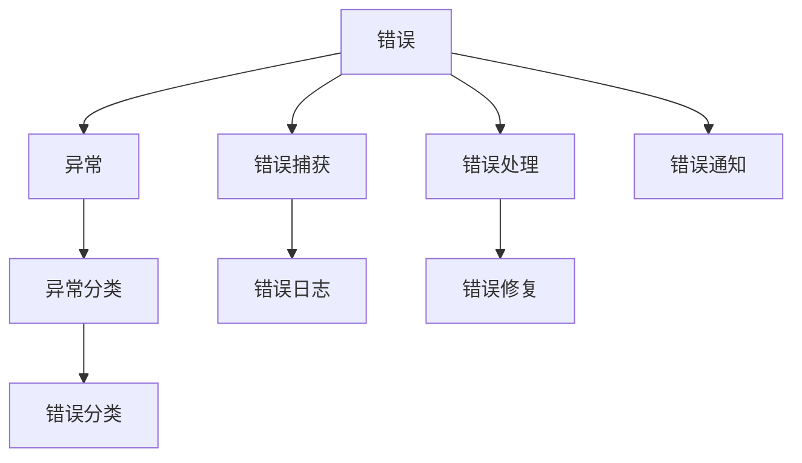
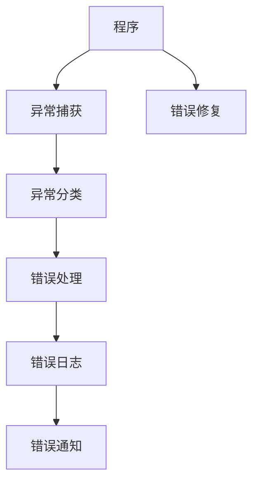

                 

## 1. 背景介绍

### 1.1 问题由来

在软件开发过程中，错误处理（Error Handling）是一个不可或缺的环节。良好的错误处理机制可以提高系统的健壮性、可靠性以及用户体验。然而，错误处理并非一个简单的技术问题，它涉及到了软件工程、用户体验、安全性等多个方面。一个设计得好的错误处理机制应该既能够快速定位和解决问题，又能够提供给用户友好的反馈信息，同时还能够保护系统的安全和稳定。

### 1.2 问题核心关键点

错误处理的核心关键点包括：

- **错误分类**：根据错误来源、类型、严重程度等因素，将错误进行分类。
- **错误捕获**：在程序运行过程中，及时捕获和记录错误信息。
- **错误处理**：根据错误类型和上下文，采取相应的处理策略。
- **错误通知**：将错误信息以友好且易于理解的方式通知用户。
- **错误修复**：及时修复错误，避免错误在系统中扩散。
- **错误日志**：记录错误信息，便于后续分析和调试。

### 1.3 问题研究意义

正确和有效地处理错误是软件工程中的重要组成部分，它对于提升软件的稳定性和可维护性、改善用户体验、以及减少技术债务都有积极的影响。

1. **提升系统稳定性**：错误处理机制能够保证系统在发生错误时，不会崩溃或产生不可预料的行为。
2. **改善用户体验**：友好的错误提示能够减少用户对系统的不信任和不满，提升用户满意度。
3. **提高开发效率**：良好的错误处理机制能够快速定位问题，减少排查和修复的时间。
4. **保护数据安全**：错误处理机制能够避免敏感数据泄露，保障系统安全。

## 2. 核心概念与联系

### 2.1 核心概念概述

为了更好地理解错误处理机制，我们首先介绍几个核心概念：

- **错误**：指程序运行时出现的异常情况，导致程序无法正常执行。
- **异常**：指程序运行时发生的各种意外情况，包括语法错误、逻辑错误、运行时错误等。
- **异常处理**：指程序在捕获异常后，采取的应对策略，包括错误捕获、错误分类、错误处理、错误通知等。
- **日志**：记录程序运行过程中发生的错误信息，便于后续分析和调试。

这些概念之间存在着紧密的联系，形成一个完整的错误处理系统。

### 2.2 概念间的关系

以下是一个Mermaid流程图，展示了错误处理机制中的各个概念之间的关系：



这个流程图展示了错误处理机制的基本流程：

1. **错误**发生后，程序进入异常处理流程。
2. **异常**被捕获并分类。
3. **错误**记录在日志中。
4. **错误**处理根据错误类型和上下文采取相应的处理策略。
5. **错误**修复后，系统恢复正常运行。
6. **错误**通知用户，并提供友好的错误提示。

### 2.3 核心概念的整体架构

最后，我们用一个综合的流程图来展示错误处理机制的整体架构：



这个综合流程图展示了从程序执行到错误处理的全过程。程序在执行过程中可能会产生异常，异常被捕获并分类，根据错误类型和上下文采取相应的处理策略，记录错误日志，并将错误信息通知用户，最终通过错误修复使系统恢复正常。

## 3. 核心算法原理 & 具体操作步骤
### 3.1 算法原理概述

错误处理机制的基本原理是通过异常捕获和错误分类，确定错误类型和严重程度，并采取相应的处理策略，记录错误日志，最后将错误信息以友好且易于理解的方式通知用户。

### 3.2 算法步骤详解

错误处理机制的基本步骤包括：

1. **异常捕获**：在程序运行过程中，及时捕获和记录错误信息。
2. **异常分类**：根据错误来源、类型、严重程度等因素，将错误进行分类。
3. **错误处理**：根据错误类型和上下文，采取相应的处理策略。
4. **错误通知**：将错误信息以友好且易于理解的方式通知用户。
5. **错误修复**：及时修复错误，避免错误在系统中扩散。
6. **错误日志**：记录错误信息，便于后续分析和调试。

### 3.3 算法优缺点

错误处理机制的优点包括：

- **提升系统稳定性**：能够保证系统在发生错误时，不会崩溃或产生不可预料的行为。
- **改善用户体验**：友好的错误提示能够减少用户对系统的不信任和不满，提升用户满意度。
- **提高开发效率**：能够快速定位问题，减少排查和修复的时间。

错误处理机制的缺点包括：

- **处理复杂度高**：错误处理涉及多个环节，需要综合考虑错误分类、错误处理策略等因素，增加了系统的复杂性。
- **开发成本高**：错误处理机制的开发和维护需要大量的工作量，特别是在错误种类繁多、情况复杂的应用场景中。
- **影响性能**：错误处理机制的引入可能会对系统的性能产生一定的影响，特别是错误处理过程中涉及大量日志记录和异常处理的情况。

### 3.4 算法应用领域

错误处理机制在软件开发中得到了广泛应用，适用于各种类型的软件系统，包括Web应用、移动应用、桌面应用等。以下是几个典型的应用领域：

- **Web应用**：在Web应用中，错误处理机制能够帮助开发者快速定位和解决问题，提升网站的用户体验。
- **移动应用**：在移动应用中，错误处理机制能够保证应用的稳定性和可靠性，减少用户的不满。
- **桌面应用**：在桌面应用中，错误处理机制能够提高应用的可维护性和用户体验。
- **大数据系统**：在大数据系统中，错误处理机制能够保证数据处理任务的稳定性和安全性。

## 4. 数学模型和公式 & 详细讲解 & 举例说明

### 4.1 数学模型构建

为了更好地理解错误处理机制，我们可以使用数学模型来描述错误处理的流程。

假设我们有一个程序 $P$，在执行过程中可能会发生错误 $E$。错误处理机制的核心思想是通过异常捕获和错误分类，确定错误类型 $T$ 和严重程度 $S$，并采取相应的处理策略 $H$，记录错误日志 $L$，最后将错误信息 $I$ 以友好且易于理解的方式通知用户 $U$。

错误处理的数学模型可以表示为：

$$
P \rightarrow E \rightarrow T \rightarrow S \rightarrow H \rightarrow L \rightarrow I \rightarrow U
$$

其中：

- $P$：程序
- $E$：错误
- $T$：错误类型
- $S$：错误严重程度
- $H$：错误处理策略
- $L$：错误日志
- $I$：错误信息
- $U$：用户

### 4.2 公式推导过程

以下我们以一个简单的例子来说明错误处理机制的基本流程。

假设程序 $P$ 执行一个简单的除法运算：

$$
\text{result} = \frac{x}{y}
$$

其中 $x$ 和 $y$ 是从用户输入中获取的值。如果 $y=0$，程序会产生一个错误，导致除法运算失败。

错误处理机制的基本流程如下：

1. **异常捕获**：程序捕获到错误后，进入异常处理流程。
2. **异常分类**：将错误分类为除法运算错误。
3. **错误处理**：根据错误类型和上下文，采取相应的处理策略。
4. **错误通知**：将错误信息以友好且易于理解的方式通知用户。
5. **错误修复**：如果用户输入合法，程序重新计算结果。
6. **错误日志**：记录错误信息，便于后续分析和调试。

错误处理的公式可以表示为：

$$
P \rightarrow \text{result} = \frac{x}{y} \rightarrow E = \text{ZeroDivisionError} \rightarrow T = \text{DivisionError} \rightarrow S = \text{High} \rightarrow H = \text{PromptUserForInput} \rightarrow I = \text{"Please enter a non-zero value for y"} \rightarrow U = \text{User}
$$

其中：

- $P$：程序
- $E$：错误
- $T$：错误类型
- $S$：错误严重程度
- $H$：错误处理策略
- $I$：错误信息
- $U$：用户

### 4.3 案例分析与讲解

下面以一个Web应用的错误处理机制为例，来说明错误处理机制的具体实现。

假设有一个简单的Web应用，用户可以输入两个数字进行加法运算。如果输入的数字为负数，程序将输出错误信息并提示用户重新输入。

错误处理机制的基本流程如下：

1. **异常捕获**：程序捕获到负数输入后，进入异常处理流程。
2. **异常分类**：将错误分类为负数输入错误。
3. **错误处理**：根据错误类型和上下文，采取相应的处理策略。
4. **错误通知**：将错误信息以友好且易于理解的方式通知用户。
5. **错误修复**：如果用户输入合法，程序重新计算结果。
6. **错误日志**：记录错误信息，便于后续分析和调试。

错误处理的代码实现如下：

```python
def add_numbers(x, y):
    if x < 0 or y < 0:
        raise ValueError("Invalid input: please enter non-negative numbers")
    return x + y
```

在上面的代码中，我们使用了Python的raise语句来捕获错误。如果输入的数字为负数，程序会抛出一个ValueError异常，并附带错误信息。

## 5. 项目实践：代码实例和详细解释说明

### 5.1 开发环境搭建

在进行错误处理实践前，我们需要准备好开发环境。以下是使用Python进行开发的环境配置流程：

1. 安装Python：下载并安装Python 3.x版本。
2. 安装必要的库：安装requests、Flask等库，用于开发Web应用。
3. 配置开发环境：设置开发环境，包括开发工具、编辑器、IDE等。

完成上述步骤后，即可在本地搭建开发环境。

### 5.2 源代码详细实现

下面我们以一个简单的Web应用为例，实现一个错误处理机制。

假设我们有一个简单的Web应用，用户可以输入两个数字进行加法运算。如果输入的数字为负数，程序将输出错误信息并提示用户重新输入。

```python
from flask import Flask, request, jsonify

app = Flask(__name__)

@app.route('/add', methods=['POST'])
def add_numbers():
    data = request.get_json()
    x = data['x']
    y = data['y']
    if x < 0 or y < 0:
        error_message = "Invalid input: please enter non-negative numbers"
        return jsonify({'error': error_message}), 400
    result = x + y
    return jsonify({'result': result}), 200

if __name__ == '__main__':
    app.run(debug=True)
```

在上面的代码中，我们使用了Flask框架来搭建Web应用。当用户发送POST请求到/add路径时，程序会接收用户输入的数字，并进行加法运算。如果输入的数字为负数，程序会抛出一个400错误，并附带错误信息。如果输入的数字合法，程序会返回加法结果。

### 5.3 代码解读与分析

让我们再详细解读一下关键代码的实现细节：

**Flask框架**：
Flask是一个轻量级的Web框架，提供了简单易用的API和工具，方便开发Web应用。

**request.get_json()**：
使用request.get_json()方法获取POST请求的JSON数据，方便获取用户输入的数字。

**if x < 0 or y < 0**：
如果输入的数字为负数，程序会抛出一个400错误，并附带错误信息。

**jsonify**：
使用jsonify方法将Python对象转换为JSON格式的响应，方便返回给用户。

### 5.4 运行结果展示

假设我们在测试服务器上运行上述代码，可以通过curl命令或浏览器访问以下URL：

```
http://localhost:5000/add?x=-1&y=3
```

程序将输出以下错误信息：

```
{
    "error": "Invalid input: please enter non-negative numbers"
}
```

这表明输入的数字为负数，程序抛出了一个400错误。

## 6. 实际应用场景

### 6.1 错误处理在Web应用中的应用

错误处理机制在Web应用中得到了广泛应用。以下是一个典型的Web应用错误处理场景：

**场景描述**：
用户登录Web应用，输入用户名和密码进行登录。如果用户名或密码错误，程序将输出错误信息并提示用户重新输入。

**实现流程**：
1. 用户输入用户名和密码进行登录。
2. 程序捕获到用户名或密码错误后，进入异常处理流程。
3. 将错误分类为登录错误。
4. 根据错误类型和上下文，采取相应的处理策略。
5. 将错误信息以友好且易于理解的方式通知用户。
6. 记录错误日志，便于后续分析和调试。

### 6.2 错误处理在移动应用中的应用

错误处理机制在移动应用中同样得到了广泛应用。以下是一个典型的移动应用错误处理场景：

**场景描述**：
用户在移动应用中上传图片，如果图片格式错误，程序将输出错误信息并提示用户重新上传。

**实现流程**：
1. 用户上传图片到移动应用。
2. 程序捕获到图片格式错误后，进入异常处理流程。
3. 将错误分类为文件格式错误。
4. 根据错误类型和上下文，采取相应的处理策略。
5. 将错误信息以友好且易于理解的方式通知用户。
6. 记录错误日志，便于后续分析和调试。

### 6.3 错误处理在大数据系统中的应用

错误处理机制在大数据系统中同样得到了广泛应用。以下是一个典型的大数据系统错误处理场景：

**场景描述**：
在数据处理任务中，如果输入数据格式错误，程序将输出错误信息并提示用户重新输入。

**实现流程**：
1. 用户输入数据进行数据处理。
2. 程序捕获到数据格式错误后，进入异常处理流程。
3. 将错误分类为数据格式错误。
4. 根据错误类型和上下文，采取相应的处理策略。
5. 将错误信息以友好且易于理解的方式通知用户。
6. 记录错误日志，便于后续分析和调试。

## 7. 工具和资源推荐

### 7.1 学习资源推荐

为了帮助开发者系统掌握错误处理机制的理论基础和实践技巧，这里推荐一些优质的学习资源：

1. 《深入理解Python异常处理》系列博文：由Python专家撰写，深入浅出地介绍了Python异常处理的各种细节和最佳实践。

2. 《JavaScript异常处理最佳实践》系列博文：由JavaScript专家撰写，介绍了JavaScript异常处理的各种细节和最佳实践。

3. 《Java异常处理指南》书籍：Java专家所著，全面介绍了Java异常处理的各种细节和最佳实践。

4. 《Ruby异常处理教程》：Ruby专家所著，介绍了Ruby异常处理的各种细节和最佳实践。

5. 《Go异常处理教程》：Go专家所著，介绍了Go异常处理的各种细节和最佳实践。

通过对这些资源的学习实践，相信你一定能够快速掌握错误处理机制的精髓，并用于解决实际的错误处理问题。

### 7.2 开发工具推荐

高效的开发离不开优秀的工具支持。以下是几款用于错误处理开发的常用工具：

1. Python的内置异常处理机制：Python提供了丰富的异常处理机制，包括try-except语句、raise语句等，方便开发者进行错误处理。

2. Java的异常处理机制：Java提供了丰富的异常处理机制，包括try-catch语句、throw语句等，方便开发者进行错误处理。

3. C#的异常处理机制：C#提供了丰富的异常处理机制，包括try-catch语句、throw语句等，方便开发者进行错误处理。

4. Swift的异常处理机制：Swift提供了丰富的异常处理机制，包括do-catch语句、throw语句等，方便开发者进行错误处理。

5. Kotlin的异常处理机制：Kotlin提供了丰富的异常处理机制，包括try-catch语句、throw语句等，方便开发者进行错误处理。

合理利用这些工具，可以显著提升错误处理任务的开发效率，加快创新迭代的步伐。

### 7.3 相关论文推荐

错误处理机制的研究源于学界的持续研究。以下是几篇奠基性的相关论文，推荐阅读：

1. "Python异常处理：最佳实践与陷阱"：深入探讨了Python异常处理的细节和最佳实践，帮助开发者避免常见陷阱。

2. "JavaScript异常处理：最佳实践与案例分析"：介绍了JavaScript异常处理的细节和最佳实践，并通过案例分析展示了错误处理的重要性。

3. "Java异常处理：最佳实践与案例研究"：介绍了Java异常处理的细节和最佳实践，并通过案例研究展示了错误处理的实际应用。

4. "Ruby异常处理：最佳实践与案例分析"：介绍了Ruby异常处理的细节和最佳实践，并通过案例分析展示了错误处理的重要性。

5. "Go异常处理：最佳实践与案例研究"：介绍了Go异常处理的细节和最佳实践，并通过案例研究展示了错误处理的实际应用。

这些论文代表了大语言模型微调技术的发展脉络。通过学习这些前沿成果，可以帮助研究者把握学科前进方向，激发更多的创新灵感。

除上述资源外，还有一些值得关注的前沿资源，帮助开发者紧跟错误处理技术的最新进展，例如：

1. arXiv论文预印本：人工智能领域最新研究成果的发布平台，包括大量尚未发表的前沿工作，学习前沿技术的必读资源。

2. 业界技术博客：如Microsoft、Google、Facebook等顶尖实验室的官方博客，第一时间分享他们的最新研究成果和洞见。

3. 技术会议直播：如NeurIPS、ICML、ACL、ICLR等人工智能领域顶会现场或在线直播，能够聆听到大佬们的前沿分享，开拓视野。

4. GitHub热门项目：在GitHub上Star、Fork数最多的异常处理相关项目，往往代表了该技术领域的发展趋势和最佳实践，值得去学习和贡献。

5. 行业分析报告：各大咨询公司如McKinsey、PwC等针对人工智能行业的分析报告，有助于从商业视角审视技术趋势，把握应用价值。

总之，对于错误处理机制的学习和实践，需要开发者保持开放的心态和持续学习的意愿。多关注前沿资讯，多动手实践，多思考总结，必将收获满满的成长收益。

## 8. 总结：未来发展趋势与挑战

### 8.1 总结

本文对错误处理机制进行了全面系统的介绍。首先阐述了错误处理机制的研究背景和意义，明确了错误处理在提升系统稳定性、改善用户体验、提高开发效率等方面的重要作用。其次，从原理到实践，详细讲解了错误处理的数学模型和实现步骤，给出了错误处理任务开发的完整代码实例。同时，本文还广泛探讨了错误处理机制在Web应用、移动应用、大数据系统等多个行业领域的应用前景，展示了错误处理机制的广泛应用价值。

通过本文的系统梳理，可以看到，错误处理机制在软件开发中扮演着重要角色，能够保证系统在发生错误时不会崩溃或产生不可预料的行为，从而提升系统的健壮性和可靠性。未来，伴随错误处理技术的持续演进，相信系统将变得更加稳定和高效，为人工智能技术的落地应用带来新的机遇。

### 8.2 未来发展趋势

展望未来，错误处理机制将呈现以下几个发展趋势：

1. **自动化异常检测**：通过机器学习和大数据分析，实现异常检测的自动化，提高异常处理的准确性和效率。
2. **智能化异常处理**：利用人工智能技术，实现异常处理的智能化，提高异常处理的精度和效率。
3. **跨平台异常处理**：实现跨平台异常处理，提升异常处理的一致性和可靠性。
4. **多层次异常处理**：实现多层次异常处理，从应用程序、系统级、硬件级等多个层次进行异常处理，提升系统的健壮性和可靠性。
5. **实时异常处理**：实现实时异常处理，提高异常处理的响应速度和用户体验。

以上趋势凸显了错误处理机制的广阔前景。这些方向的探索发展，必将进一步提升系统的健壮性和可靠性，为人工智能技术的落地应用提供更加坚实的保障。

### 8.3 面临的挑战

尽管错误处理机制已经取得了不少进展，但在迈向更加智能化、普适化应用的过程中，它仍面临着诸多挑战：

1. **处理复杂度高**：错误处理涉及多个环节，需要综合考虑错误分类、错误处理策略等因素，增加了系统的复杂性。
2. **开发成本高**：错误处理机制的开发和维护需要大量的工作量，特别是在错误种类繁多、情况复杂的应用场景中。
3. **影响性能**：错误处理机制的引入可能会对系统的性能产生一定的影响，特别是错误处理过程中涉及大量日志记录和异常处理的情况。
4. **可解释性不足**：当前的异常处理机制往往是"黑盒"系统，难以解释其内部工作机制和决策逻辑。

### 8.4 研究展望

面对错误处理机制面临的挑战，未来的研究需要在以下几个方面寻求新的突破：

1. **自动化异常检测**：探索自动化异常检测方法，利用机器学习和大数据分析技术，提高异常检测的准确性和效率。
2. **智能化异常处理**：研究智能化异常处理技术，利用人工智能技术，提高异常处理的精度和效率。
3. **跨平台异常处理**：探索跨平台异常处理技术，提高异常处理的一致性和可靠性。
4. **多层次异常处理**：研究多层次异常处理技术，从应用程序、系统级、硬件级等多个层次进行异常处理，提升系统的健壮性和可靠性。
5. **实时异常处理**：研究实时异常处理技术，提高异常处理的响应速度和用户体验。
6. **可解释性增强**：研究可解释性增强技术，提高异常处理的可解释性和可审计性。

这些研究方向的研究突破，将使错误处理机制更加高效、可靠、智能，为人工智能技术的落地应用提供更加坚实的保障。

## 9. 附录：常见问题与解答

**Q1: 什么是异常处理？**

A: 异常处理是指在程序运行过程中，及时捕获和记录错误信息，并采取相应的处理策略，保证程序能够继续运行。

**Q2: 异常和错误有什么区别？**

A: 异常和错误都是指程序运行时出现的问题，但它们的定义和处理方式有所不同。异常是指程序在运行过程中发生的各种意外情况，如语法错误、逻辑错误、运行时错误等；错误是指程序在运行过程中遇到的具体错误，如除数为零、空指针引用等。

**Q3: 异常处理有哪些常见的技术？**

A: 异常处理常见的技术包括try-except语句、raise语句、finally语句、try-finally语句、raise from语句等。

**Q4: 如何实现跨平台异常处理？**

A: 实现跨平台异常处理，需要考虑不同平台的异常处理机制和特性。可以使用平台无关的异常处理库，如Java的Exception类，C#的Exception类等。同时，也需要考虑不同平台间的异常映射和转换。

**Q5: 如何实现实时异常处理？**

A: 实现实时异常处理，需要考虑异常处理的响应速度和性能。可以使用异步处理、多线程处理、事件驱动处理等技术，提高异常处理的响应速度和性能。

**Q6: 如何实现异常处理的自动化？**

A: 实现异常处理的自动化，可以使用机器学习和大数据分析技术，提高异常检测和处理的准确性和效率。同时，也可以使用自动化的异常处理工具和框架，如ELK Stack、Splunk等。

通过上述问题与解答，相信你对异常处理机制有了更深入的了解。错误处理机制是一个复杂而重要的系统工程，需要开发者综合考虑多个方面进行设计，以确保系统的健壮性和可靠性。

---

作者：禅与计算机程序设计艺术 / Zen and the Art of Computer Programming

