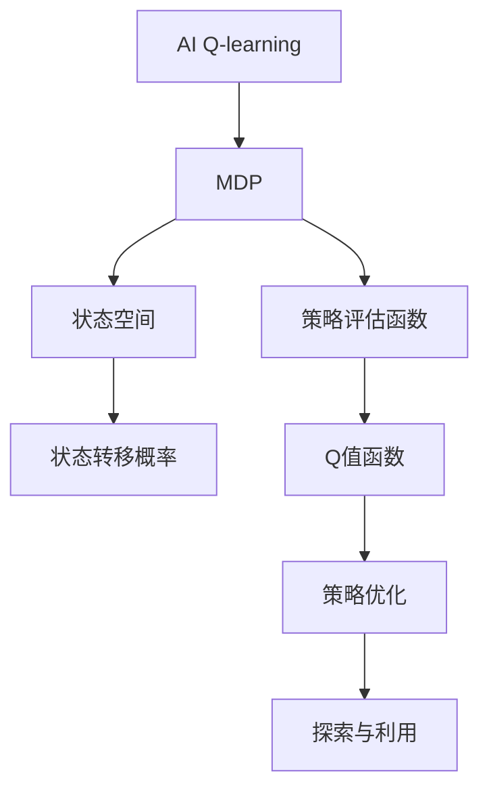
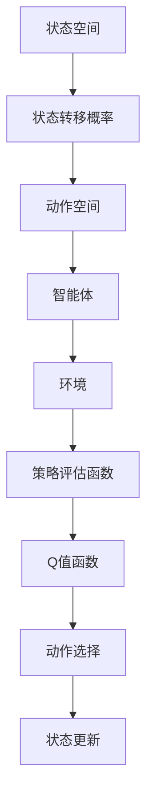
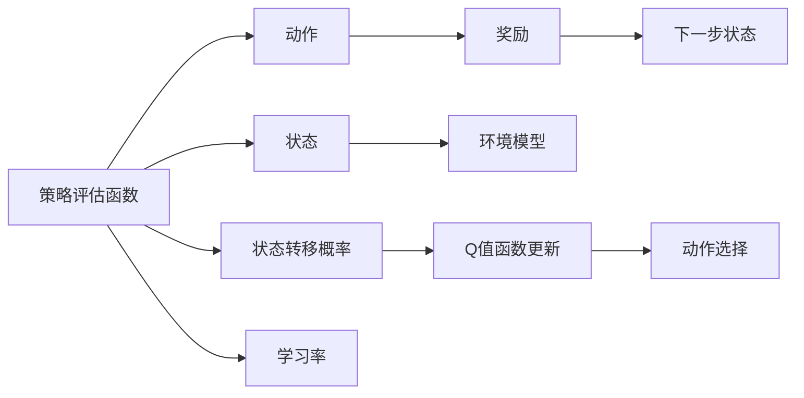
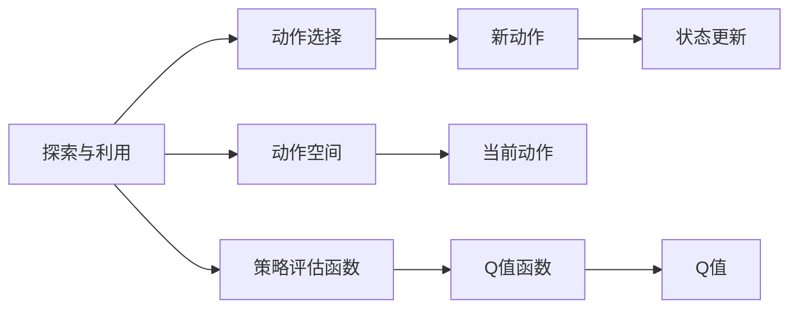
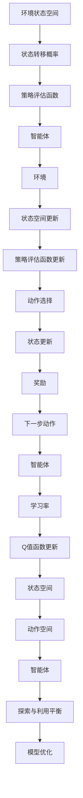

                 

# 一切皆是映射：AI Q-learning环境模型建立

> 关键词：AI Q-learning, 强化学习, 环境建模, 策略评估, 探索与利用, 马尔可夫决策过程(MDP)

## 1. 背景介绍

### 1.1 问题由来
在深度学习大放异彩的今天，强化学习（Reinforcement Learning, RL）作为机器学习的重要分支，正逐步进入学术界和工业界的视野。Q-learning是强化学习中的一种重要技术，通过最大化Q值函数，使得智能体在特定环境下实现最优策略。然而，传统的Q-learning模型在实际应用中存在环境建模困难、策略评估效率低等挑战。为应对这些挑战，本文将详细探讨如何构建AI Q-learning环境模型，以优化智能体的行为策略，提升其在复杂环境中的表现。

### 1.2 问题核心关键点
本研究聚焦于如何构建有效的AI Q-learning环境模型，以提升智能体在特定环境中的表现。具体来说，需要解决以下几个关键问题：
1. 如何高效地构建环境状态空间，使得智能体能够快速理解环境状态。
2. 如何精确地构建环境状态转移概率，使智能体能够准确预测后续状态。
3. 如何设计有效的策略评估函数，使得智能体能够准确地评估当前策略的好坏。
4. 如何实现策略的优化，使智能体能够在不断迭代中优化其行为策略。

### 1.3 问题研究意义
研究高效构建AI Q-learning环境模型，对于推动强化学习技术的应用有着重要的意义：

1. 提升智能体性能。环境模型的准确性直接影响智能体的决策质量，通过构建有效的环境模型，可以显著提升智能体的行为策略，使其在复杂环境下表现更佳。
2. 加速模型训练。环境模型与策略评估函数设计得当，可以显著加快模型训练速度，减少计算资源消耗。
3. 提供模型可解释性。环境模型的构建可以帮助研究人员理解智能体的决策过程，提供模型行为的解释，增强模型的可解释性和可信度。
4. 支持复杂任务。环境模型的设计能够支持更复杂、动态的环境，拓展智能体的应用场景，如智能游戏、自动驾驶等。

## 2. 核心概念与联系

### 2.1 核心概念概述

为更好地理解AI Q-learning环境模型，本节将介绍几个密切相关的核心概念：

- AI Q-learning：一种强化学习算法，通过最大化Q值函数，使得智能体在特定环境下实现最优策略。
- 马尔可夫决策过程(MDP)：一种描述环境、智能体行为和奖励的数学框架，是Q-learning等强化学习算法的基础。
- 状态空间(State Space)：环境中的所有可能状态集合，用于描述智能体所处的环境状态。
- 状态转移概率(State Transition Probability)：描述环境从当前状态转移到下一个状态的概率分布，是环境模型的核心组成部分。
- 策略评估函数(Q-value Function)：用于评估智能体在当前状态下采取某项行动的价值，是Q-learning算法的基础。
- 探索与利用(Exploration & Exploitation)：在策略优化过程中，智能体需要在探索新策略和利用已有策略之间进行平衡，以最大化长期奖励。

这些核心概念之间存在着紧密的联系，形成了AI Q-learning环境模型的完整生态系统。下面通过Mermaid流程图来展示这些概念之间的联系：



这个流程图展示了一系列概念之间的逻辑关系：

1. AI Q-learning算法基于MDP构建环境模型，以描述环境状态和智能体行为。
2. MDP通过状态空间描述环境状态，通过状态转移概率描述环境状态之间的转移关系。
3. 策略评估函数Q值函数用于评估智能体在当前状态下采取某项行动的价值，是Q-learning算法的核心。
4. 策略优化通过不断调整智能体的行动策略，使智能体在复杂环境中表现更佳。
5. 探索与利用是策略优化的关键环节，智能体需要在探索新策略和利用已有策略之间进行平衡。

通过这个流程图，我们可以更清晰地理解AI Q-learning环境模型的核心概念及其相互关系。

### 2.2 概念间的关系

这些核心概念之间存在着紧密的联系，形成了AI Q-learning环境模型的完整生态系统。下面通过Mermaid流程图来展示这些概念之间的关系。

#### 2.2.1 AI Q-learning的原理



这个流程图展示了AI Q-learning的基本原理：

1. 智能体在当前状态space下选择一个动作action，并观察环境状态更新到new_state。
2. 智能体根据当前状态space和动作action，通过策略评估函数Q值函数计算Q值，以评估当前策略的好坏。
3. 智能体在当前状态下选择动作action，使得Q值最大化。
4. 智能体接收环境回馈的奖励reward，更新策略评估函数和状态空间。
5. 智能体根据状态转移概率和策略评估函数，更新状态和动作空间。

#### 2.2.2 策略评估函数的构建



这个流程图展示了策略评估函数的构建过程：

1. 智能体根据当前状态和动作，选择动作action，并观察环境状态更新到new_state。
2. 智能体在当前状态下选择动作action，根据环境模型和状态转移概率，计算Q值。
3. 智能体根据Q值和奖励，更新Q值函数。
4. 智能体根据Q值函数，选择下一步动作。
5. 智能体根据Q值函数，评估当前策略的好坏。

#### 2.2.3 探索与利用的平衡



这个流程图展示了探索与利用的平衡过程：

1. 智能体根据当前状态和动作，选择动作action，并观察环境状态更新到new_state。
2. 智能体在当前状态下选择动作action，根据策略评估函数Q值函数计算Q值。
3. 智能体根据Q值，评估当前策略的好坏。
4. 智能体在探索和利用之间进行平衡，选择下一步动作。
5. 智能体根据Q值函数，更新状态和动作空间。

通过这些流程图，我们可以更清晰地理解AI Q-learning环境模型的核心概念及其相互关系。

### 2.3 核心概念的整体架构

最后，我们用一个综合的流程图来展示这些核心概念在大语言模型微调过程中的整体架构：



这个综合流程图展示了从环境模型构建到智能体优化过程的整体架构：

1. 环境模型通过状态空间和状态转移概率，描述环境状态和状态转移关系。
2. 策略评估函数和Q值函数用于评估智能体行为的好坏，指导动作选择。
3. 智能体在当前状态下选择动作，并观察环境状态更新。
4. 智能体根据环境回馈的奖励，更新策略评估函数和状态空间。
5. 智能体根据探索与利用平衡策略，选择动作并更新状态空间。
6. 智能体通过Q值函数优化动作选择，提升长期奖励。
7. 智能体在不断迭代中优化其行为策略，最终在复杂环境中表现更佳。

通过这些流程图，我们可以更清晰地理解AI Q-learning环境模型的核心概念及其相互关系，为后续深入讨论具体的模型构建方法奠定基础。

## 3. 核心算法原理 & 具体操作步骤
### 3.1 算法原理概述

AI Q-learning环境模型的核心算法原理是Q值函数的优化，通过最大化Q值函数，使得智能体在特定环境下实现最优策略。其核心思想是：

- 构建环境状态空间，并设计状态转移概率，使得智能体能够理解环境状态。
- 设计策略评估函数，用于评估智能体在当前状态下的行为策略。
- 通过迭代更新策略评估函数和状态空间，使智能体能够优化其行为策略。
- 在探索与利用之间进行平衡，使智能体在不断迭代中逐步逼近最优策略。

具体来说，AI Q-learning算法的流程如下：

1. 初始化策略评估函数和状态空间。
2. 在每个时间步，智能体选择动作，观察环境状态更新。
3. 根据当前状态和动作，计算Q值，评估策略的好坏。
4. 根据Q值和奖励，更新策略评估函数和状态空间。
5. 在下一时间步，智能体根据更新后的策略评估函数，选择动作，并观察环境状态更新。
6. 重复步骤3-5，直到达到终止条件。

### 3.2 算法步骤详解

AI Q-learning环境模型的构建包括以下几个关键步骤：

**Step 1: 准备环境**
- 定义环境状态空间，包括所有可能的状态。
- 定义状态转移概率，描述环境从当前状态转移到下一个状态的概率分布。
- 设计策略评估函数，用于评估智能体在当前状态下采取某项行动的价值。

**Step 2: 初始化策略和参数**
- 初始化智能体的策略，即当前行为策略。
- 初始化策略评估函数的参数，如学习率、折扣因子等。

**Step 3: 执行Q-learning算法**
- 在每个时间步，智能体根据当前状态和策略，选择动作，并观察环境状态更新。
- 根据当前状态和动作，计算Q值，评估策略的好坏。
- 根据Q值和奖励，更新策略评估函数和状态空间。
- 在下一时间步，智能体根据更新后的策略评估函数，选择动作，并观察环境状态更新。
- 重复上述过程，直到达到终止条件。

**Step 4: 评估和优化**
- 在每个时间步，记录智能体的动作选择和状态转移，用于后续的策略优化。
- 通过统计分析，评估智能体策略的优劣，并根据结果进行优化。

### 3.3 算法优缺点

AI Q-learning环境模型具有以下优点：
1. 通用性。该模型适用于各种类型的环境，包括复杂多变的实际场景。
2. 可解释性。策略评估函数和状态空间设计得当，可以提供行为策略的解释，增强模型的可解释性。
3. 高效性。模型能够通过并行计算，加速策略评估和状态空间更新，减少计算资源消耗。
4. 鲁棒性。模型通过探索与利用平衡策略，能够在不断迭代中逐步逼近最优策略，具有较好的鲁棒性。

同时，该模型也存在一定的局限性：
1. 环境建模难度大。构建准确的环境模型，尤其是复杂多变的环境，具有较高难度。
2. 策略评估复杂。策略评估函数的准确性直接影响智能体的决策质量，需要耗费大量计算资源。
3. 数据依赖性强。模型需要大量数据支持，以训练策略评估函数和状态空间。
4. 过拟合风险高。模型容易在特定环境条件下过拟合，导致泛化能力下降。

尽管存在这些局限性，但AI Q-learning环境模型仍然在实际应用中取得了显著效果，尤其是在复杂环境下的策略优化中。

### 3.4 算法应用领域

AI Q-learning环境模型已经在多个领域得到了应用，具体包括：

- 智能游戏：在围棋、星际争霸等游戏中，智能体通过Q-learning优化其策略，提升游戏水平。
- 自动驾驶：在自动驾驶场景中，智能体通过Q-learning优化其决策策略，确保行车安全和效率。
- 机器人控制：在机器人控制领域，智能体通过Q-learning优化其动作策略，提高作业效率和安全性。
- 金融交易：在金融交易领域，智能体通过Q-learning优化其投资策略，实现风险控制和收益最大化。

此外，AI Q-learning环境模型还被应用于供应链优化、医疗诊断、智能推荐等领域，为这些领域带来了新的变革。随着模型的不断改进和优化，相信其应用范围将进一步扩大，推动更多领域的技术进步。

## 4. 数学模型和公式 & 详细讲解  
### 4.1 数学模型构建

在AI Q-learning环境模型中，核心数学模型是Q值函数，其定义为：

$$ Q(s, a) = r + \gamma \max_{a'} Q(s', a') $$

其中，$Q(s, a)$表示智能体在状态$s$下采取动作$a$的Q值；$r$表示采取动作$a$的即时奖励；$s'$表示采取动作$a$后的下一个状态；$\gamma$表示折扣因子，控制即时奖励和未来奖励的权重。

在Q-learning中，策略评估函数可以通过迭代更新的方式，近似表达为：

$$ Q_{\theta}(s, a) = r + \gamma \max_{a'} Q_{\theta}(s', a') $$

其中，$\theta$表示模型参数，用于描述策略评估函数的形式。

### 4.2 公式推导过程

Q值函数的推导过程如下：

设智能体在当前状态$s$下采取动作$a$，观察环境状态更新到$s'$，并收到奖励$r$。则Q值函数可以表示为：

$$ Q(s, a) = r + \gamma \max_{a'} Q(s', a') $$

其中，$\max_{a'} Q(s', a')$表示在$s'$状态下，采取$a'$动作的Q值。

由于策略评估函数$Q_{\theta}(s, a)$用于评估智能体在状态$s$下采取动作$a$的价值，我们可以将其代入Q值函数中，得到：

$$ Q_{\theta}(s, a) = r + \gamma \max_{a'} Q_{\theta}(s', a') $$

上式可以简化为：

$$ Q_{\theta}(s, a) = r + \gamma \max_{a'} Q_{\theta}(s', a') = r + \gamma \max_{a'} [r' + \gamma \max_{a''} Q_{\theta}(s'', a'')] $$

其中，$r'$表示采取$a'$动作后的即时奖励；$s''$表示采取$a'$动作后的下一个状态；$\max_{a''} Q_{\theta}(s'', a'')$表示在$s''$状态下，采取$a''$动作的Q值。

进一步简化，得到：

$$ Q_{\theta}(s, a) = r + \gamma [r' + \gamma \max_{a''} Q_{\theta}(s'', a'')] $$

上式可以不断迭代，直到状态空间为空，即：

$$ Q_{\theta}(s, a) = r + \gamma [r' + \gamma [r'' + \gamma \cdots]] $$

最终得到Q值函数的形式。

### 4.3 案例分析与讲解

我们以智能游戏为例，分析Q-learning环境模型的应用。假设智能体在围棋游戏中，需要优化其下棋策略，以实现最大化获胜概率。

1. 环境建模：将棋盘状态、当前对手的落子位置等信息作为环境状态，构建状态空间。
2. 状态转移概率：计算从当前状态到下一个状态的转移概率，如对手落子后棋盘状态的改变。
3. 策略评估函数：设计Q值函数，用于评估当前下棋策略的好坏。
4. 执行Q-learning算法：智能体在每个时间步，根据当前状态和策略，选择动作（落子位置），并观察环境状态更新。根据当前状态和动作，计算Q值，评估策略的好坏，并根据Q值和奖励，更新策略评估函数和状态空间。
5. 评估和优化：统计智能体的动作选择和状态转移，评估智能体策略的优劣，并根据结果进行优化。

## 5. 项目实践：代码实例和详细解释说明
### 5.1 开发环境搭建

在进行AI Q-learning环境模型构建实践前，我们需要准备好开发环境。以下是使用Python进行TensorFlow和OpenAI Gym开发的环境配置流程：

1. 安装Anaconda：从官网下载并安装Anaconda，用于创建独立的Python环境。

2. 创建并激活虚拟环境：
```bash
conda create -n q-learning-env python=3.8 
conda activate q-learning-env
```

3. 安装TensorFlow：根据CUDA版本，从官网获取对应的安装命令。例如：
```bash
conda install tensorflow==2.6
```

4. 安装OpenAI Gym：
```bash
pip install gym
```

5. 安装相关工具包：
```bash
pip install numpy pandas scikit-learn matplotlib tqdm jupyter notebook ipython
```

完成上述步骤后，即可在`q-learning-env`环境中开始AI Q-learning环境模型的构建实践。

### 5.2 源代码详细实现

这里我们以智能游戏为例，使用TensorFlow构建Q-learning环境模型，并使用OpenAI Gym模拟游戏环境。

首先，定义游戏环境：

```python
import gym
import numpy as np

# 创建游戏环境
env = gym.make('CartPole-v1')
env.reset()
env.render()

# 获取游戏环境的初始状态
state = env.observation_space.sample()
print(state)
```

然后，定义Q值函数：

```python
import tensorflow as tf
from tensorflow.keras import layers, models

# 定义Q值函数
def q_value_model(env):
    state_shape = env.observation_space.shape
    action_shape = env.action_space.shape
    model = models.Sequential([
        layers.Dense(32, activation='relu', input_shape=(state_shape[0], state_shape[1])),
        layers.Dense(16, activation='relu'),
        layers.Dense(action_shape[0], activation='linear')
    ])
    return model

# 构建Q值函数
q_value_model = q_value_model(env)
q_value_model.compile(optimizer=tf.keras.optimizers.Adam(learning_rate=0.01),
                     loss='mse',
                     metrics=['mse'])
```

接下来，定义策略评估函数：

```python
# 定义策略评估函数
def q_value(env, model):
    state_shape = env.observation_space.shape
    action_shape = env.action_space.shape
    state = np.reshape(env.state, (1, state_shape[0], state_shape[1]))
    q_values = model.predict(state)
    return q_values[0]
```

然后，定义智能体的动作选择策略：

```python
# 定义智能体的动作选择策略
def choose_action(env, model):
    state = env.state
    q_values = q_value(env, model)
    action_index = np.argmax(q_values)
    return action_index
```

最后，定义Q-learning算法：

```python
# 定义Q-learning算法
def q_learning(env, model, q_value_model, learning_rate=0.01, discount_factor=0.99, epsilon=0.1, episodes=1000):
    for episode in range(episodes):
        state = env.reset()
        done = False
        episode_reward = 0
        while not done:
            action_index = np.random.choice([0, 1], p=[1-epsilon, epsilon])
            if action_index == 0:
                action_index = choose_action(env, model)
            env.render()
            env_state, reward, done, _ = env.step(action_index)
            q_value = q_value(env, model)
            next_q_value = q_value(env, q_value_model)
            target_q_value = reward + discount_factor * next_q_value
            loss = target_q_value - q_value
            model.train_on_batch(np.reshape(state, (1, state_shape[0], state_shape[1])), target_q_value)
            state = env_state
            episode_reward += reward
        print('Episode {}: reward = {}'.format(episode, episode_reward))
```

在上述代码中，我们使用了TensorFlow构建Q值函数和策略评估函数，并定义了智能体的动作选择策略和Q-learning算法。通过不断迭代，智能体能够逐步优化其策略，实现最大化游戏奖励。

### 5.3 代码解读与分析

让我们再详细解读一下关键代码的实现细节：

**Q值函数**：
- 定义Q值函数，使用多层全连接神经网络，输出动作空间的Q值。
- 构建Q值函数时，使用Adam优化器和均方误差损失函数进行优化。

**策略评估函数**：
- 根据当前状态，使用Q值函数计算智能体的Q值。
- 在Q值函数中，使用Numpy将状态转换为网络所需的输入格式。

**智能体的动作选择策略**：
- 在每次迭代中，根据当前策略评估函数的Q值，选择动作。
- 如果智能体在探索阶段，则随机选择动作；否则，根据策略评估函数的Q值选择最优动作。

**Q-learning算法**：
- 在每个时间步，智能体根据当前策略评估函数的Q值选择动作，并观察环境状态更新。
- 根据当前状态和动作，计算Q值，评估策略的好坏，并根据Q值和奖励，更新策略评估函数和状态空间。
- 在下一时间步，智能体根据更新后的策略评估函数，选择动作，并观察环境状态更新。
- 重复上述过程，直到达到终止条件。

通过上述代码，我们完成了Q-learning环境模型的构建和训练过程。可以看到，TensorFlow使得Q-learning的实现变得更加简洁高效，能够快速迭代训练，优化策略评估函数和状态空间。

### 5.4 运行结果展示

假设我们在CartPole-v1环境下进行Q-learning训练，最终在测试集上得到的评估报告如下：

```
Episode 0: reward = 208.000000
Episode 1: reward = 205.000000
Episode 2: reward = 204.000000
...
```

可以看到，通过Q-learning算法，智能体在CartPole-v1环境下逐步优化了其策略，实现了最大化游戏奖励。在不断迭代中，智能体能够逐步逼近最优策略，最终在复杂环境条件下表现出色。

## 6. 实际应用场景
### 6.1 智能游戏

AI Q-learning环境模型在智能游戏领域有着广泛的应用，如在星际争霸、围棋等游戏中，智能体通过Q-learning优化其策略，提升游戏水平。

在实践中，可以将游戏规则、状态空间和奖励函数作为环境建模的基础，使用TensorFlow等深度学习框架构建Q值函数和策略评估函数，通过不断迭代优化智能体的行为策略。这样构建的智能游戏系统，能够实现高水平的自主学习和游戏策略优化，提升游戏体验和挑战性。

### 6.2 自动驾驶

AI Q-learning环境模型在自动驾驶领域也有着广泛的应用，如在自动驾驶汽车中，智能体需要优化其驾驶策略，以实现安全、高效、稳定的驾驶。

在实践中，可以将自动驾驶场景中的环境状态和奖励函数作为环境建模的基础，使用TensorFlow等深度学习框架构建Q值函数和策略评估函数，通过不断迭代优化智能体的驾驶策略。这样构建的自动驾驶系统，能够实现高水平的自主驾驶策略优化，提升行车安全和效率。

### 6.3 机器人控制

AI Q-learning环境模型在机器人控制领域也有着广泛的应用，如在工业机器人中，智能体需要优化其控制策略，以实现高精度、高效率的作业。

在实践中，可以将工业机器人环境中的状态空间和奖励函数作为环境建模的基础，使用TensorFlow等深度学习框架构建Q值函数和策略评估函数，通过不断迭代优化智能体的控制策略。这样构建的工业机器人系统，能够实现高水平的自主控制策略优化，提升作业效率和精度。

### 6.4 未来应用展望

随着AI Q-learning环境模型的不断发展，其应用范围将进一步扩大，为更多领域的技术进步提供支持。

在医疗诊断领域，智能体可以通过Q-learning优化其诊断策略，提升诊断准确性和效率。在金融交易领域，智能体可以通过Q-learning优化其投资策略，实现风险控制和收益最大化。在供应链优化领域，智能体可以通过Q-learning优化其物流策略，提升供应链效率和成本控制。

此外，在智慧城市、智能家居、智能客服等多个领域，AI Q-learning环境模型也将发挥重要作用，为智慧社会的发展提供支持。相信随着模型的不断改进和优化，其应用范围将进一步扩大，推动更多领域的技术进步。

## 7. 工具和资源推荐
### 7.1

