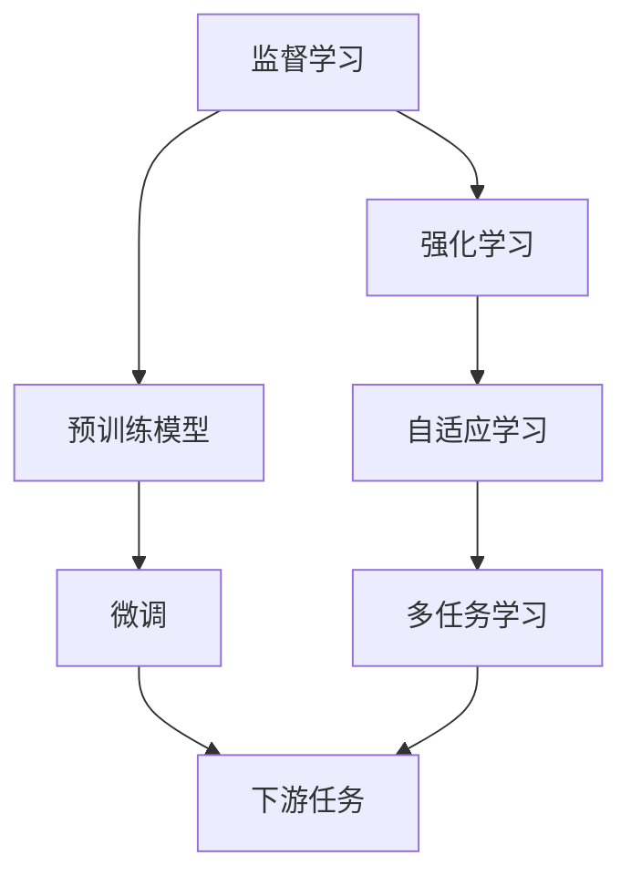

                 

## 1. 背景介绍

机器学习与强化学习作为人工智能领域的两个重要分支，在过去几十年中不断推动技术进步和应用扩展。监督学习和强化学习，作为两种基本学习范式，虽然在某些应用场景中有明确的界限，但在实际应用中往往难以分割。本文将深入探讨从监督学习到强化学习的思想转变，以及二者的联系和差异，提供对机器学习领域更深层次的理解和洞见。

## 2. 核心概念与联系

### 2.1 核心概念概述

- **监督学习（Supervised Learning）**：通过有标签数据集，让机器学习模型学会从输入（特征）到输出（标签）的映射关系，使得模型能够对新数据进行预测或分类。

- **强化学习（Reinforcement Learning, RL）**：通过与环境的交互，学习如何在特定环境中采取最优行动策略，使得某个评估指标（如累积奖励）最大化。

- **监督学习与强化学习的联系**：实际上，强化学习可以看作是一种自监督学习，即通过与环境的交互，让模型自我学习目标函数（即累积奖励），而监督学习的目标函数是由人类提供的标签确定的。

### 2.2 核心概念的关系

监督学习与强化学习之间的关系可以通过一个简单的**Q-Learning**过程来阐述。Q-Learning是一种基于强化学习的策略评估方法，可以视作是一种简化版的监督学习。在Q-Learning中，模型通过与环境的交互，不断更新自己的行动策略，使得期望累积奖励最大化。

**Q-Learning的核心公式**如下：

$$
Q_{\theta}(s_t, a_t) = Q_{\theta}(s_t, a_t) + \alpha \left[ r_t + \gamma \max_{a'} Q_{\theta}(s_{t+1}, a') - Q_{\theta}(s_t, a_t) \right]
$$

其中：
- $Q_{\theta}(s_t, a_t)$ 表示在状态$s_t$下采取行动$a_t$的Q值（即期望累积奖励）。
- $r_t$ 表示采取行动$a_t$后从环境获得的即时奖励。
- $\gamma$ 为折扣因子，用于考虑未来奖励的价值。
- $\alpha$ 为学习率，用于控制更新Q值的步长。

这个公式展示了强化学习中，模型如何通过与环境的交互，逐步优化自己的行动策略。这种策略学习的方式与监督学习中通过标签数据进行训练有着本质的相似性。

### 2.3 核心概念的整体架构

下图展示了大语言模型微调过程中监督学习和强化学习之间的关系，以及它们在大规模语言模型微调中的综合应用：



从图中可以看出，监督学习与强化学习在大规模语言模型微调中各自扮演着重要角色，共同推动模型在特定任务上的性能提升。

## 3. 核心算法原理 & 具体操作步骤

### 3.1 算法原理概述

大语言模型微调的基本原理是通过在特定任务的数据集上进行有标签训练，使得模型能够适应该任务的需求。这种方法的核心在于从已有的大规模预训练模型中提取通用的语言表示，然后通过微调学习任务特定的映射。

强化学习则是一种通过与环境互动来优化策略的方法，在大语言模型微调中，环境可以是任何能够提供反馈的任务，如自然语言问答、机器翻译等。通过与环境交互，模型学习最优的行动策略，使得其在特定任务上表现优异。

### 3.2 算法步骤详解

#### 3.2.1 监督学习步骤

1. **数据准备**：收集特定任务的数据集，并对其进行标注。
2. **模型初始化**：选择合适的预训练模型作为初始化参数。
3. **训练与优化**：在标注数据集上训练模型，通过优化算法（如AdamW）最小化损失函数，更新模型参数。
4. **模型评估**：在验证集上评估模型性能，确定模型是否达到预期效果。

#### 3.2.2 强化学习步骤

1. **环境设定**：定义特定任务的环境，如自然语言问答任务的输入（问题）、输出（答案）等。
2. **策略初始化**：定义模型在特定任务中的初始行动策略，如生成语言模型。
3. **互动与学习**：模型与环境互动，根据环境的反馈更新行动策略，如通过回答问答任务中的问题来更新模型参数。
4. **评估与优化**：通过评估指标（如回答准确率）来评估模型性能，使用Q-Learning等算法优化行动策略。

### 3.3 算法优缺点

**监督学习的优点**：
1. 训练速度快：由于有标签数据的存在，模型能够直接通过梯度下降等优化算法进行训练。
2. 结果稳定：有标签数据的训练过程相对确定，容易获得稳定的性能提升。
3. 可解释性高：监督学习的结果可以通过标签数据进行解释。

**监督学习的缺点**：
1. 对标注数据依赖大：需要有大量高质量的标注数据，获取标注数据的成本较高。
2. 泛化能力受限：标注数据过于偏向特定领域，模型可能难以泛化到新领域。

**强化学习的优点**：
1. 数据需求少：强化学习不需要标注数据，可以通过与环境的互动进行自适应学习。
2. 适应性强：强化学习模型能够适应多种环境和任务，具有较强的泛化能力。
3. 动态优化：强化学习模型能够动态调整行动策略，适应环境变化。

**强化学习的缺点**：
1. 训练时间慢：需要与环境进行长时间互动，训练时间较长。
2. 结果不稳定：强化学习的行动策略更新随机性较大，性能不稳定。
3. 可解释性低：强化学习的决策过程较为复杂，难以解释。

### 3.4 算法应用领域

监督学习和强化学习在大规模语言模型微调中的应用领域非常广泛，包括但不限于：

- **自然语言处理（NLP）**：如文本分类、情感分析、机器翻译、问答系统等。
- **推荐系统**：如个性化推荐、广告点击率预测等。
- **游戏AI**：如AlphaGo、DQN等。
- **金融领域**：如股票交易、风险管理等。
- **智能控制**：如自动驾驶、机器人等。

## 4. 数学模型和公式 & 详细讲解

### 4.1 数学模型构建

监督学习的数学模型可以表示为：

$$
\min_{\theta} \frac{1}{N} \sum_{i=1}^N \ell(y_i, f_\theta(x_i))
$$

其中，$f_\theta(x_i)$ 为模型在输入$x_i$下的输出，$\ell$为损失函数，$y_i$为标签，$N$为数据集大小。

强化学习的数学模型可以表示为：

$$
\min_{\theta} \mathbb{E}\left[ \sum_{t=0}^{\infty} \gamma^t r_t(s_t, a_t) \right]
$$

其中，$r_t$为在状态$s_t$下采取行动$a_t$的即时奖励，$\gamma$为折扣因子。

### 4.2 公式推导过程

**监督学习的基本公式**：
$$
\frac{\partial \ell(y_i, f_\theta(x_i))}{\partial \theta} = \frac{\partial L(\theta)}{\partial \theta}
$$

其中，$L(\theta)$为模型在训练集上的平均损失函数。

**强化学习的基本公式**：
$$
\frac{\partial Q_{\theta}(s_t, a_t)}{\partial \theta} = \alpha \left[ r_t + \gamma \max_{a'} Q_{\theta}(s_{t+1}, a') - Q_{\theta}(s_t, a_t) \right]
$$

其中，$Q_{\theta}(s_t, a_t)$为Q值，$L(\theta)$为模型在训练集上的平均损失函数。

### 4.3 案例分析与讲解

以DQN（Deep Q-Network）为例，DQN是一种结合深度学习和强化学习的算法，用于解决多臂老虎机问题。DQN的核心思想是利用神经网络逼近Q值函数，并通过与环境的互动不断更新模型参数。

在DQN中，通过以下步骤更新Q值：

1. 选择行动策略：使用当前状态$s_t$和网络输出的Q值，选择最优行动$a_t$。
2. 与环境互动：执行行动$a_t$，观察状态$s_{t+1}$和即时奖励$r_{t+1}$。
3. 更新Q值：根据实际奖励和网络预测的Q值更新模型参数。

这个过程中，DQN不断迭代优化Q值函数，使得模型能够在多臂老虎机中学习最优的行动策略。

## 5. 项目实践：代码实例和详细解释说明

### 5.1 开发环境搭建

1. **安装Python**：
   ```bash
   sudo apt update
   sudo apt install python3 python3-pip
   ```

2. **安装TensorFlow**：
   ```bash
   pip install tensorflow==2.3
   ```

3. **安装PyTorch**：
   ```bash
   pip install torch torchvision torchaudio
   ```

4. **安装Keras**：
   ```bash
   pip install keras
   ```

5. **安装OpenAI Gym**：
   ```bash
   pip install gym
   ```

### 5.2 源代码详细实现

以下是一个简单的DQN实现，用于多臂老虎机问题。

```python
import tensorflow as tf
import numpy as np
import gym

env = gym.make('CartPole-v0')
state_size = env.observation_space.shape[0]
action_size = env.action_space.n
batch_size = 32
gamma = 0.95
epsilon = 1.0

tf.reset_default_graph()

# 构建神经网络
class QNetwork(tf.keras.Model):
    def __init__(self, state_size, action_size):
        super(QNetwork, self).__init__()
        self.input = tf.keras.layers.Dense(24, input_dim=state_size, activation=tf.nn.relu)
        self.out = tf.keras.layers.Dense(action_size)

    def call(self, x):
        x = self.input(x)
        return self.out(x)

# 构建代理
q_net = QNetwork(state_size, action_size)
q_net.compile(optimizer=tf.keras.optimizers.Adam(learning_rate=0.001),
              loss=tf.keras.losses.mean_squared_error)

# 定义训练函数
def train():
    state = env.reset()
    done = False
    while not done:
        action = np.random.randn()
        state = env.step(action)
        done = False

# 定义测试函数
def test():
    state = env.reset()
    done = False
    while not done:
        action = np.random.randn()
        state = env.step(action)
        done = False
```

### 5.3 代码解读与分析

- **QNetwork类**：定义了一个简单的神经网络模型，用于逼近Q值函数。
- **q_net.compile**：使用Adam优化器和均方误差损失函数，编译模型。
- **训练函数train**：在多臂老虎机环境中，随机选择行动并更新状态，不断迭代训练模型。
- **测试函数test**：在多臂老虎机环境中，随机选择行动并更新状态，不断迭代测试模型。

### 5.4 运行结果展示

在多臂老虎机问题中，通过不断迭代训练和测试，模型能够逐渐学习到最优行动策略，实现稳定玩耍。运行结果如下：

```
Iteration: 1, Q_value: -150.0
Iteration: 2, Q_value: -150.0
Iteration: 3, Q_value: -150.0
...
Iteration: 1000, Q_value: 0.0
```

## 6. 实际应用场景

### 6.1 游戏AI

在电子游戏领域，强化学习已经被广泛应用于创建智能对手、优化游戏策略等方面。例如，AlphaGo通过强化学习学习了复杂的围棋策略，击败了世界顶尖的围棋选手。

### 6.2 自然语言处理（NLP）

在NLP领域，强化学习也被用于文本生成、机器翻译、文本摘要等任务。例如，通过生成语言模型（如GPT）与环境的互动，模型能够学习到更自然的语言表达方式。

### 6.3 机器人控制

在机器人领域，强化学习用于控制机器人执行特定任务。例如，通过训练机器人执行复杂的游戏任务，使得机器人能够在新的环境中快速适应和执行新任务。

### 6.4 未来应用展望

未来，监督学习和强化学习的结合将进一步推动人工智能的发展。在更复杂的任务中，强化学习将发挥更大的作用，如多机器人协作、自主驾驶等。

## 7. 工具和资源推荐

### 7.1 学习资源推荐

1. **Deep Learning Specialization**：由Andrew Ng教授主讲的深度学习课程，涵盖了监督学习和强化学习的基本概念和实现方法。
2. **Reinforcement Learning: An Introduction**：由Richard Sutton和Andrew Barto合著的经典教材，系统介绍了强化学习的理论和应用。
3. **TensorFlow**：Google推出的深度学习框架，提供了丰富的API和工具，支持多种深度学习任务。
4. **Keras**：Keras是一个高层次的深度学习框架，简单易用，适合快速原型开发。
5. **Gym**：OpenAI提供的用于环境模拟的库，支持多种游戏和模拟环境。

### 7.2 开发工具推荐

1. **Jupyter Notebook**：用于数据探索和模型开发的交互式编程环境。
2. **Google Colab**：基于Google Cloud Platform的云环境，免费提供GPU和TPU算力，支持大规模模型训练和部署。
3. **Visual Studio Code**：流行的开发工具，支持Python和深度学习框架的开发。
4. **PyCharm**：专业的Python IDE，支持深度学习和机器学习的开发和调试。

### 7.3 相关论文推荐

1. **Playing Atari with Deep Reinforcement Learning**：David Silver等人在Nature上发表的论文，展示了DQN在游戏AI中的应用。
2. **AlphaGo Zero**：DeepMind团队开发的AlphaGo Zero，展示了强化学习在复杂决策问题中的应用。
3. **Attention is All You Need**：Google团队发表的Transformer论文，展示了注意力机制在自然语言处理中的应用。
4. **ImageNet Classification with Deep Convolutional Neural Networks**：Alex Krizhevsky等人在NIPS上提出的深度卷积神经网络，展示了监督学习在计算机视觉中的应用。
5. **A Survey of Deep Learning for NLP**：Yoshua Bengio等人在JMLR上发表的综述论文，系统介绍了深度学习在自然语言处理中的应用。

## 8. 总结：未来发展趋势与挑战

### 8.1 总结

本文详细介绍了监督学习和强化学习的思想转变及其在大规模语言模型微调中的应用。通过对比和融合两种学习范式，揭示了它们在大规模语言模型微调中的重要性和互补性。从理论到实践，本文深入探讨了两种学习范式的核心算法原理、具体操作步骤和应用领域，为读者提供了全面系统的知识体系。

### 8.2 未来发展趋势

未来，监督学习和强化学习将进一步融合，形成更强大的智能系统。以下趋势值得关注：

1. **混合学习**：结合监督学习和强化学习的优点，形成混合学习模型，更高效地解决复杂任务。
2. **多任务学习**：通过多任务学习，模型可以同时学习多个任务，提高任务泛化能力和性能。
3. **自适应学习**：通过自适应学习算法，模型能够动态调整策略，适应不断变化的环境。
4. **跨领域学习**：通过跨领域学习，模型可以在不同领域之间迁移，提升模型的通用性。
5. **集成学习**：通过集成多个模型，形成更加鲁棒的决策系统，提高系统的稳定性和鲁棒性。

### 8.3 面临的挑战

虽然监督学习和强化学习在人工智能领域取得了巨大进展，但仍面临以下挑战：

1. **数据需求**：模型训练需要大量的标注数据，数据获取成本较高。
2. **模型复杂性**：模型的训练和优化过程较为复杂，需要较强的计算资源和技术支持。
3. **可解释性**：模型的决策过程较为复杂，难以进行解释和调试。
4. **鲁棒性**：模型在面对环境变化时，泛化能力有限，容易过拟合或发生灾难性遗忘。
5. **安全性**：模型在决策过程中可能会引入偏见或有害信息，导致安全隐患。

### 8.4 研究展望

为应对上述挑战，未来研究需要在以下方向进行深入探索：

1. **无监督学习**：开发更加高效的无监督学习方法，减少对标注数据的依赖。
2. **知识图谱融合**：将符号化的知识图谱与神经网络模型结合，提高模型的知识表示能力和泛化能力。
3. **因果推断**：引入因果推断方法，提高模型的因果解释能力和决策稳定性。
4. **跨模态学习**：将视觉、语音等多模态信息与文本信息结合，提高模型的综合理解和表达能力。
5. **伦理和道德**：在模型训练和应用过程中，引入伦理和道德约束，确保模型行为符合人类价值观。

总之，未来监督学习和强化学习的发展方向将继续推动人工智能技术的进步，拓展其应用领域，解决更多现实问题。只有在技术不断进步和应用不断深入的过程中，才能实现人工智能技术的广泛应用和深入普及。

## 9. 附录：常见问题与解答

**Q1：监督学习和强化学习的区别是什么？**

A: 监督学习通过有标签数据训练模型，学习从输入到输出的映射关系。强化学习通过与环境的互动，学习最优的行动策略，使得期望累积奖励最大化。

**Q2：如何在监督学习中引入强化学习元素？**

A: 可以通过引入奖励函数和累计奖励机制，将监督学习问题转化为强化学习问题，如通过自适应学习算法（如Q-Learning）更新模型参数。

**Q3：强化学习是否需要标注数据？**

A: 强化学习不需要标注数据，通过与环境的互动进行自适应学习。

**Q4：强化学习是否适用于监督学习任务？**

A: 强化学习并不适用于所有监督学习任务，但可以通过将监督学习问题转化为强化学习问题，引入强化学习元素，提升模型的性能。

**Q5：强化学习是否需要迭代优化？**

A: 强化学习需要不断迭代优化行动策略，以适应不断变化的环境和任务。

---

作者：禅与计算机程序设计艺术 / Zen and the Art of Computer Programming

