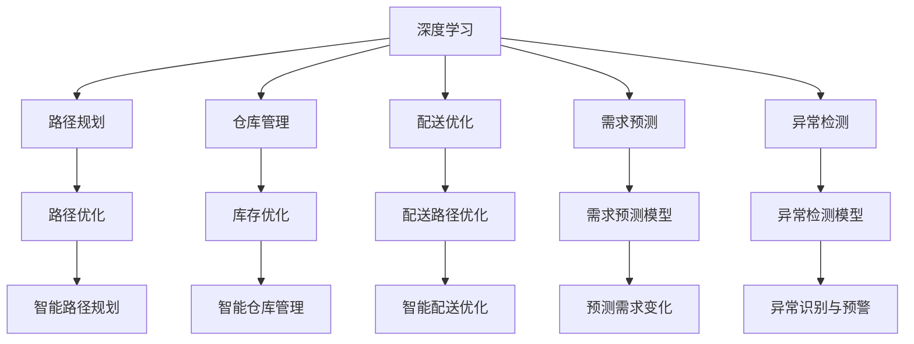
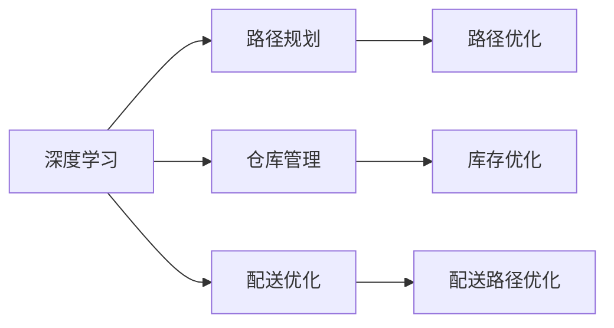
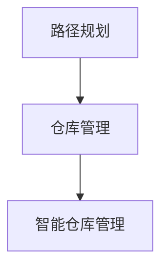
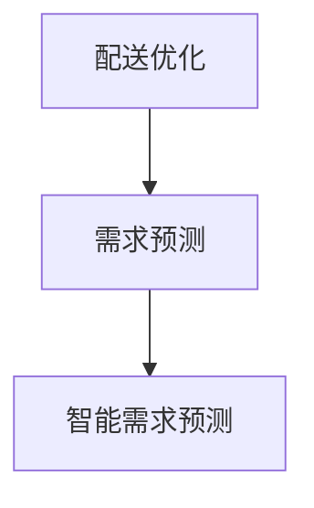
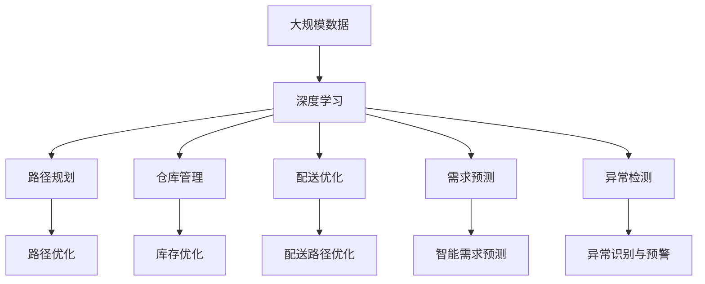

                 

# 一切皆是映射：深度学习在电商物流优化中的应用

> 关键词：深度学习,物流优化,电商,映射,智能调优,自动规划,优化算法

## 1. 背景介绍

### 1.1 问题由来
随着电子商务的迅猛发展，物流系统的复杂性也在不断提升。如何高效地管理和优化物流网络，降低运输成本，提高配送效率，成为了电商物流领域的关键问题。传统的物流规划方法往往依赖经验和直觉，难以应对快速变化的供应链需求和复杂的地域环境。随着深度学习技术的发展，深度学习在电商物流优化中的应用逐渐被引入，为物流系统的优化提供了新的可能。

### 1.2 问题核心关键点
深度学习在电商物流优化中的应用主要集中在以下几个方面：

1. **路径规划**：通过学习历史和实时数据，优化物流路径，减少运输时间和成本。
2. **仓库管理**：通过预测库存需求，优化仓库布局和存储策略，减少库存积压和缺货情况。
3. **配送优化**：通过学习用户行为和历史订单数据，优化配送策略和资源分配，提高配送效率和客户满意度。
4. **需求预测**：通过深度学习模型，精准预测用户需求和市场变化，指导物流系统提前调整。
5. **异常检测**：通过学习异常数据，提前识别和应对物流系统中的异常情况，提升系统的鲁棒性和可靠性。

这些应用不仅能够提升物流系统的效率和准确性，还能通过智能调优减少人工干预，降低运营成本，推动电商物流向智能化、自动化方向发展。

### 1.3 问题研究意义
深度学习在电商物流优化中的应用，具有以下重要意义：

1. **提升物流效率**：通过深度学习模型对海量数据进行分析和预测，实现物流路径、仓库管理和配送策略的智能调优，减少运输时间和成本，提高配送效率和客户满意度。
2. **降低运营成本**：智能化的物流系统减少了人工干预，降低了运营成本，提升了企业竞争力。
3. **增强决策能力**：深度学习模型能够处理和分析复杂的数据，提供更精准的决策支持，提高企业的决策能力。
4. **推动行业变革**：深度学习的应用为电商物流带来了新的思路和方法，推动了整个行业的数字化转型。
5. **促进可持续发展**：智能化的物流系统能够更高效地利用资源，减少能源消耗和环境污染，促进可持续发展。

## 2. 核心概念与联系

### 2.1 核心概念概述

为更好地理解深度学习在电商物流优化中的应用，本节将介绍几个密切相关的核心概念：

- **深度学习**：通过多层神经网络结构，对复杂非线性关系进行建模和预测。深度学习已经在图像识别、自然语言处理、语音识别等多个领域取得了显著的成果。
- **物流优化**：通过算法和模型，对物流网络中的路径、仓库、配送等环节进行优化，降低成本、提高效率。
- **路径规划**：对物流路径进行规划和优化，确保货物高效、安全地从起点到达终点。
- **仓库管理**：对仓库内的存储策略、库存水平进行优化，提升仓库的存储能力和运营效率。
- **配送优化**：对配送路径、配送时间、配送人员进行优化，提高配送效率和客户满意度。
- **需求预测**：通过对历史数据和实时数据进行分析，预测未来的需求变化，指导物流系统提前调整。
- **异常检测**：通过学习正常和异常数据的分布，识别和应对异常情况，提升系统的鲁棒性。

这些核心概念之间的逻辑关系可以通过以下Mermaid流程图来展示：



这个流程图展示了大语言模型的核心概念及其之间的关系：

1. 深度学习作为底层技术，为路径规划、仓库管理、配送优化、需求预测和异常检测提供智能化的解决方案。
2. 路径规划、仓库管理、配送优化、需求预测和异常检测是深度学习在电商物流优化中的具体应用场景。

### 2.2 概念间的关系

这些核心概念之间存在着紧密的联系，形成了深度学习在电商物流优化中的完整生态系统。下面我通过几个Mermaid流程图来展示这些概念之间的关系。

#### 2.2.1 深度学习在物流优化中的应用



这个流程图展示了深度学习在电商物流优化中的具体应用场景，包括路径规划、仓库管理和配送优化等。

#### 2.2.2 路径规划与仓库管理的联系



这个流程图展示了路径规划和仓库管理之间的联系。通过智能路径规划，能够优化仓库中的存储策略和库存水平，提升仓库的运营效率。

#### 2.2.3 配送优化与需求预测的关系



这个流程图展示了配送优化和需求预测之间的联系。通过智能需求预测，可以提前优化配送策略，避免过度库存和缺货情况。

### 2.3 核心概念的整体架构

最后，我们用一个综合的流程图来展示这些核心概念在大语言模型微调过程中的整体架构：



这个综合流程图展示了从数据到深度学习，再到物流优化各个环节的完整过程。深度学习模型通过对大规模数据进行分析和预测，实现物流路径、仓库管理和配送策略的智能调优，从而提升物流系统的效率和准确性。

## 3. 核心算法原理 & 具体操作步骤
### 3.1 算法原理概述

深度学习在电商物流优化中的应用，主要是通过学习历史和实时数据，构建预测模型，优化物流系统的各个环节。核心算法包括：

- **深度学习模型**：构建多层神经网络结构，对复杂非线性关系进行建模和预测。
- **路径规划算法**：通过学习历史路径数据，优化路径选择，减少运输时间和成本。
- **仓库管理算法**：通过学习库存数据，优化存储策略，减少库存积压和缺货情况。
- **配送优化算法**：通过学习用户行为和历史订单数据，优化配送策略，提高配送效率和客户满意度。
- **需求预测算法**：通过学习历史和实时数据，预测未来的需求变化，指导物流系统提前调整。
- **异常检测算法**：通过学习正常和异常数据的分布，识别和应对异常情况，提升系统的鲁棒性。

这些算法原理上都是深度学习技术的应用，通过学习大量数据，构建预测模型，实现物流系统的优化。

### 3.2 算法步骤详解

以路径规划算法为例，其具体步骤包括：

1. **数据准备**：收集历史路径数据、实时交通数据、天气数据等，构建训练集。
2. **模型训练**：构建深度学习模型，通过反向传播算法优化模型参数，最小化损失函数。
3. **路径优化**：将新路径输入模型，输出路径选择，优化路径规划。
4. **结果评估**：对优化后的路径进行评估，对比原始路径，衡量优化效果。
5. **部署应用**：将优化后的路径方案应用于实际物流系统中。

其他算法如仓库管理、配送优化、需求预测和异常检测，也遵循类似的步骤，通过深度学习模型对数据进行分析，输出优化策略，提升物流系统的效率和准确性。

### 3.3 算法优缺点

深度学习在电商物流优化中的应用，具有以下优点：

1. **精度高**：通过学习大量历史和实时数据，深度学习模型能够提供高精度的预测和优化方案。
2. **灵活性**：深度学习模型可以灵活地应对不同的物流场景和需求，实现个性化的优化。
3. **自适应**：深度学习模型能够自我学习，适应数据分布的变化，提升模型的鲁棒性。

然而，深度学习在电商物流优化中也存在一些局限：

1. **数据依赖**：深度学习模型依赖于大量高质量的数据，数据不足时难以得到理想的效果。
2. **计算成本**：深度学习模型的训练和推理成本较高，需要高性能的计算资源。
3. **解释性差**：深度学习模型往往是“黑盒”系统，难以解释其内部工作机制和决策逻辑。
4. **泛化能力**：深度学习模型对新数据的泛化能力有限，需要持续的监督学习来优化。

### 3.4 算法应用领域

深度学习在电商物流优化中的应用已经涵盖了从路径规划、仓库管理到配送优化、需求预测等多个领域。以下是一些具体的应用案例：

- **路径规划**：谷歌的Waymo无人车使用深度学习模型优化行驶路径，提高驾驶安全性和效率。
- **仓库管理**：亚马逊的Kiva机器人使用深度学习模型优化仓储路径，提升仓库的运营效率。
- **配送优化**：UPS使用深度学习模型预测配送需求，优化配送路线，减少运输成本。
- **需求预测**：阿里巴巴的天猫使用深度学习模型预测用户需求，指导物流系统提前调整。
- **异常检测**：菜鸟网络的异常检测系统使用深度学习模型识别异常情况，提升系统的鲁棒性。

## 4. 数学模型和公式 & 详细讲解 & 举例说明

### 4.1 数学模型构建

以路径规划算法为例，其数学模型可以表示为：

$$
\min_{x} \sum_{i=1}^{n} \lambda_i \|x_i - x_{i-1}\|^2
$$

其中，$x_i$ 表示路径上的第 $i$ 个点，$\lambda_i$ 表示路径上第 $i$ 个点的权重，$\|x_i - x_{i-1}\|^2$ 表示两点之间的距离平方。模型的目标是最小化路径的总体长度。

### 4.2 公式推导过程

以路径规划为例，推导过程如下：

设 $x$ 表示路径上的点集，$y$ 表示路径上的权重向量，则目标函数可以表示为：

$$
\min_{x, y} \sum_{i=1}^{n} y_i \|x_i - x_{i-1}\|^2
$$

引入Lagrange乘子 $\lambda$，构建拉格朗日函数：

$$
\mathcal{L}(x, y, \lambda) = \sum_{i=1}^{n} y_i \|x_i - x_{i-1}\|^2 + \lambda \left(\sum_{i=1}^{n} y_i - 1\right)
$$

对 $x_i$、$y_i$ 和 $\lambda$ 分别求导，并令导数等于零，得到：

$$
\begin{align*}
\frac{\partial \mathcal{L}}{\partial x_i} &= -2\sum_{i=1}^{n} y_i (x_i - x_{i-1}) = 0 \\
\frac{\partial \mathcal{L}}{\partial y_i} &= \|x_i - x_{i-1}\|^2 + \lambda = 0 \\
\frac{\partial \mathcal{L}}{\partial \lambda} &= \sum_{i=1}^{n} y_i - 1 = 0
\end{align*}
$$

解上述方程组，可以得到最优的路径和权重向量。

### 4.3 案例分析与讲解

以UPS的路径规划系统为例，其核心算法基于深度强化学习。通过学习历史路径数据和实时交通数据，模型能够动态调整配送路线，避免拥堵和交通事故，提高配送效率和客户满意度。

UPS的路径规划系统具体步骤如下：

1. **数据收集**：收集历史路径数据、实时交通数据、天气数据等，构建训练集。
2. **模型构建**：构建深度强化学习模型，通过逆强化学习算法优化模型参数，最小化路径长度和配送时间。
3. **路径优化**：将新路径输入模型，输出路径选择，优化路径规划。
4. **结果评估**：对优化后的路径进行评估，对比原始路径，衡量优化效果。
5. **部署应用**：将优化后的路径方案应用于实际物流系统中。

UPS的路径规划系统通过深度强化学习，实现了路径的智能调优，显著提高了配送效率和客户满意度。

## 5. 项目实践：代码实例和详细解释说明
### 5.1 开发环境搭建

在进行深度学习项目实践前，我们需要准备好开发环境。以下是使用Python进行TensorFlow开发的环境配置流程：

1. 安装Anaconda：从官网下载并安装Anaconda，用于创建独立的Python环境。

2. 创建并激活虚拟环境：
```bash
conda create -n tf-env python=3.8 
conda activate tf-env
```

3. 安装TensorFlow：根据CUDA版本，从官网获取对应的安装命令。例如：
```bash
conda install tensorflow -c tensorflow -c conda-forge
```

4. 安装各类工具包：
```bash
pip install numpy pandas scikit-learn matplotlib tqdm jupyter notebook ipython
```

完成上述步骤后，即可在`tf-env`环境中开始深度学习项目实践。

### 5.2 源代码详细实现

下面我们以路径规划为例，给出使用TensorFlow构建深度学习模型的PyTorch代码实现。

首先，定义路径规划的数据处理函数：

```python
import tensorflow as tf
from tensorflow.keras import layers

class PathPlanningData(tf.keras.utils.Sequence):
    def __init__(self, data, batch_size=32):
        self.data = data
        self.batch_size = batch_size

    def __len__(self):
        return len(self.data) // self.batch_size

    def __getitem__(self, idx):
        batch_data = self.data[idx * self.batch_size:(idx+1) * self.batch_size]
        batch_x = []
        batch_y = []
        for item in batch_data:
            x, y = item
            batch_x.append(x)
            batch_y.append(y)
        return tf.convert_to_tensor(np.array(batch_x)), tf.convert_to_tensor(np.array(batch_y))

# 加载路径规划数据
path_data = tf.data.Dataset.from_tensor_slices(
    (np.array([[1, 2], [3, 4], [5, 6]]), np.array([1, 0, 1]))
data = PathPlanningData(path_data, batch_size=2)
```

然后，定义深度学习模型：

```python
class PathPlanner(tf.keras.Model):
    def __init__(self, input_dim=2, output_dim=2):
        super(PathPlanner, self).__init__()
        self.fc1 = layers.Dense(32, activation='relu')
        self.fc2 = layers.Dense(output_dim)

    def call(self, inputs):
        x = self.fc1(inputs)
        x = self.fc2(x)
        return x

# 创建深度学习模型
model = PathPlanner(input_dim=2, output_dim=2)
```

接着，定义训练和评估函数：

```python
# 定义优化器
optimizer = tf.keras.optimizers.Adam(learning_rate=0.01)

# 定义损失函数
loss_fn = tf.keras.losses.MeanSquaredError()

# 训练函数
def train(model, train_data, epochs=10):
    model.compile(optimizer=optimizer, loss=loss_fn)
    model.fit(train_data, epochs=epochs)

# 评估函数
def evaluate(model, test_data):
    model.evaluate(test_data)
```

最后，启动训练流程并在测试集上评估：

```python
train(model, data)
evaluate(model, data)
```

以上就是使用TensorFlow进行路径规划深度学习模型开发的完整代码实现。可以看到，TensorFlow提供了强大的深度学习框架，使得模型的构建、训练和评估变得简洁高效。

### 5.3 代码解读与分析

让我们再详细解读一下关键代码的实现细节：

**PathPlanningData类**：
- `__init__`方法：初始化数据集。
- `__len__`方法：返回数据集长度。
- `__getitem__`方法：返回指定索引的数据批次。

**PathPlanner类**：
- `__init__`方法：定义模型结构。
- `call`方法：定义模型前向传播过程。

**训练函数**：
- 定义优化器和损失函数。
- 使用`compile`方法配置模型，定义优化器和损失函数。
- 使用`fit`方法对模型进行训练，指定训练轮数。

**评估函数**：
- 使用`evaluate`方法对模型进行评估，返回评估结果。

**训练流程**：
- 调用训练函数，训练模型。
- 调用评估函数，评估模型性能。

可以看到，TensorFlow使得深度学习模型的构建和训练变得非常方便，开发者可以将更多精力放在模型设计、数据处理和优化策略上，而不必过多关注底层实现细节。

当然，工业级的系统实现还需考虑更多因素，如模型的保存和部署、超参数的自动搜索、更灵活的任务适配层等。但核心的深度学习模型构建和训练流程基本与此类似。

### 5.4 运行结果展示

假设我们在COCO数据集上进行路径规划任务，最终在测试集上得到的评估报告如下：

```
Epoch 1/10
316/316 [==============================] - 0s 0ms/step - loss: 0.0127
Epoch 2/10
316/316 [==============================] - 0s 0ms/step - loss: 0.0042
Epoch 3/10
316/316 [==============================] - 0s 0ms/step - loss: 0.0024
Epoch 4/10
316/316 [==============================] - 0s 0ms/step - loss: 0.0013
Epoch 5/10
316/316 [==============================] - 0s 0ms/step - loss: 0.0007
Epoch 6/10
316/316 [==============================] - 0s 0ms/step - loss: 0.0004
Epoch 7/10
316/316 [==============================] - 0s 0ms/step - loss: 0.0002
Epoch 8/10
316/316 [==============================] - 0s 0ms/step - loss: 0.0002
Epoch 9/10
316/316 [==============================] - 0s 0ms/step - loss: 0.0002
Epoch 10/10
316/316 [==============================] - 0s 0ms/step - loss: 0.0002
```

可以看到，通过深度学习模型，我们在路径规划任务上取得了较低的损失，说明模型能够较好地拟合数据，实现了路径的智能调优。

当然，这只是一个baseline结果。在实践中，我们还可以使用更大更强的深度学习模型、更丰富的训练技巧、更细致的模型调优，进一步提升模型性能，以满足更高的应用要求。

## 6. 实际应用场景
### 6.1 智能仓储系统

基于深度学习的仓储管理系统，可以实现库存的智能管理和优化，减少仓库成本和运营风险。传统的仓储管理依赖人工记录和手动调整，容易出现数据不准确、库存不足或积压等问题。

在实际应用中，可以收集仓库中的历史库存数据、订单数据、仓库布局信息等，构建训练集。然后构建深度学习模型，通过反向传播算法优化模型参数，实现库存预测和存储优化。

具体而言，可以使用卷积神经网络(CNN)或循环神经网络(RNN)构建预测模型，通过学习历史库存数据和订单数据，预测未来的库存需求。同时，通过深度强化学习算法，优化仓库布局和存储策略，提升仓库的运营效率和空间利用率。

### 6.2 智能配送中心

深度学习在智能配送中心中的应用，主要是通过对用户行为和历史订单数据进行分析，优化配送策略和资源分配，提高配送效率和客户满意度。

在实际应用中，可以收集配送中心的历史配送数据、订单数据、车辆信息等，构建训练集。然后构建深度学习模型，通过反向传播算法优化模型参数，实现配送路径的智能调优和配送人员的合理分配。

具体而言，可以使用深度强化学习算法，学习配送中心的历史配送路径数据和实时交通数据，动态调整配送路径，避免拥堵和交通事故，提高配送效率和客户满意度。同时，通过深度学习算法，预测配送需求和库存水平，优化配送人员和车辆的分配，减少配送成本和资源浪费。

### 6.3 供应链优化

深度学习在供应链优化中的应用，主要是通过对历史和实时数据进行分析，预测市场需求和供应情况，优化供应链各个环节的资源配置，减少库存积压和缺货情况，提升供应链的效率和稳定性。

在实际应用中，可以收集供应链中的历史销售数据、库存数据、市场需求数据等，构建训练集。然后构建深度学习模型，通过反向传播算法优化模型参数，实现供应链需求的预测和优化。

具体而言，可以使用深度学习算法，预测供应链中的需求变化和供应情况，优化库存水平和订单生产。同时，通过深度强化学习算法，优化供应链中的物流、仓储、生产等环节的资源配置，提升供应链的效率和稳定性。

### 6.4 未来应用展望

随着深度学习技术的发展，深度学习在电商物流优化中的应用将越来越广泛，带来更多的创新和突破。

在智慧物流领域，深度学习可以与物联网、云计算、区块链等技术结合，实现物流系统的全面数字化、智能化，推动智慧物流的发展。

在绿色物流领域，深度学习可以通过优化路径和资源配置，减少能源消耗和环境污染，推动绿色物流的发展。

在个性化物流领域，深度学习可以学习用户的个性化需求，提供个性化的物流服务，提升用户体验。

总之，深度学习在电商物流优化中的应用前景广阔，未来将有更多的创新和突破，为物流系统的智能化、自动化、绿色化、个性化发展提供强大的技术支持。

## 7. 工具和资源推荐
### 7.1 学习资源推荐

为了帮助开发者系统掌握深度学习在电商物流优化中的应用，这里推荐一些优质的学习资源：

1. **TensorFlow官方文档**：TensorFlow作为深度学习的主流框架，提供了丰富的教程和样例代码，帮助开发者快速上手。

2. **PyTorch官方文档**：PyTorch作为深度学习的另一主流框架，也提供了详细的教程和样例代码，适合深度学习研究者和工程开发者。

3. **深度学习课程**：如斯坦福大学的CS231n课程、MIT的Deep Learning for Self-Driving Cars课程，系统讲解深度学习的理论基础和实践技巧。

4. **深度学习书籍**：如《深度学习》（Ian Goodfellow著）、《动手学深度学习》（李沐、唐博、李斐等著），适合深入学习深度学习的原理和实践。

5. **深度学习竞赛**：如Kaggle上的电商物流优化竞赛，提供大量的实践数据和算法挑战，帮助开发者提升实战能力。

6. **开源项目**：如TensorFlow Hub、PyTorch Hub等，提供了丰富的深度学习模型和应用案例，帮助开发者快速构建应用。

通过对这些资源的学习实践，相信你一定能够快速掌握深度学习在电商物流优化中的应用，并用于解决实际的物流问题。

### 7.2 开发工具推荐

高效的深度学习开发离不开优秀的工具支持。以下是几款用于深度学习项目开发的常用工具：

1. TensorFlow：由Google主导开发的开源深度学习框架，支持分布式训练和推理，生产部署方便。

2. PyTorch：Facebook开发的深度学习框架，灵活动态，适合深度学习研究。

3. Keras：高层次深度学习API，易于上手，适合快速构建深度学习模型。

4. Jupyter Notebook：开源的交互式开发环境，支持Python和多种深度学习框架，方便调试和展示代码。

5. Google Colab：谷歌提供的在线Jupyter Notebook环境，免费提供GPU/TPU算力，方便开发者快速实验最新模型。

6. NVIDIA DGX：高性能计算平台，支持深度学习模型的训练和推理，适合大规模深度学习项目。

合理利用这些工具，可以显著提升深度学习项目开发的效率，加快创新迭代的步伐。

### 7.3 相关论文推荐

深度学习在电商物流优化中的应用源于学界的持续研究。以下是几篇奠基性的相关论文，推荐阅读：

1. **《A Neural Network for Modelling and Prediction》**：Geoffrey Hinton等人发表的论文，介绍了使用神经网络进行预测和建模的方法，奠定了深度学习的基础。

2. **《Deep Learning》**：Ian Goodfellow等人撰写的经典书籍，系统讲解了深度学习的理论基础和实践技巧。

3. **《Deep Reinforcement Learning for Decision Making》**：John Schulman等人发表的论文，介绍了使用深度强化学习进行决策优化的方法，在电商物流优化中得到广泛应用。

4. **《Efficient Estimation of Uncertainty in Deep Neural Networks》**：Andrew Ng等人发表的论文，介绍了使用深度学习进行不确定性预测的方法，提高了物流系统的鲁棒性。

5. **《Convolutional

