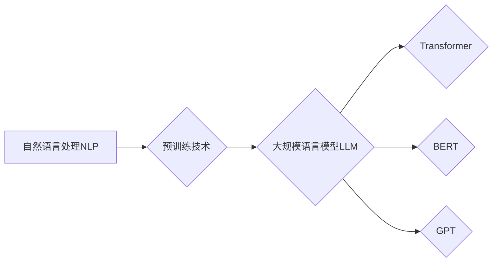

# 大规模语言模型从理论到实践 大语言模型的发展历程

> 关键词：大规模语言模型，NLP，预训练，Transformer，BERT，GPT，自然语言处理，机器学习

## 1. 背景介绍

自然语言处理（Natural Language Processing，NLP）作为人工智能领域的一个重要分支，旨在让计算机能够理解、解释和生成人类语言。随着深度学习技术的飞速发展，NLP领域取得了显著的进步。尤其是近年来，大规模语言模型（Large Language Model，LLM）的兴起，为NLP领域带来了前所未有的机遇和挑战。本文将带您回顾大规模语言模型的发展历程，从理论到实践，探讨其核心原理、算法、应用场景以及未来发展趋势。

## 2. 核心概念与联系

### 2.1 核心概念

#### 2.1.1 自然语言处理（NLP）

NLP是研究计算机与人类（自然）语言之间相互作用的学科，包括语音识别、文本分析、机器翻译、问答系统等。

#### 2.1.2 预训练（Pre-training）

预训练是指在大规模无标签语料上进行训练，使模型学习到语言的通用表示。

#### 2.1.3 大规模语言模型（LLM）

LLM是指参数量巨大、能够处理自然语言输入输出的语言模型。

#### 2.1.4 Transformer

Transformer是一种基于自注意力机制（Self-Attention）的深度神经网络模型，广泛应用于NLP任务。

#### 2.1.5 BERT（Bidirectional Encoder Representations from Transformers）

BERT是一种基于Transformer的预训练模型，能够学习到双向的文本表示。

#### 2.1.6 GPT（Generative Pre-trained Transformer）

GPT是一种基于Transformer的生成型预训练模型，能够生成高质量的文本。

### 2.2 Mermaid 流程图



## 3. 核心算法原理 & 具体操作步骤

### 3.1 算法原理概述

大规模语言模型的构建主要分为预训练和微调两个阶段：

1. **预训练阶段**：在大规模无标签语料上进行预训练，使模型学习到语言的通用表示。
2. **微调阶段**：在特定任务的标注数据上对模型进行微调，使其适应特定任务。

### 3.2 算法步骤详解

#### 3.2.1 预训练阶段

1. **数据准备**：收集大规模无标签语料，如维基百科、书籍、网页等。
2. **模型选择**：选择合适的预训练模型，如BERT、GPT等。
3. **模型训练**：在无标签语料上进行预训练，优化模型参数。

#### 3.2.2 微调阶段

1. **数据准备**：收集特定任务的标注数据。
2. **模型选择**：选择合适的预训练模型，并根据任务需求进行适配。
3. **模型微调**：在标注数据上对模型进行微调，优化模型参数。

### 3.3 算法优缺点

#### 3.3.1 优点

- **强大的语言理解能力**：LLM能够理解复杂、多变的语言现象，为NLP任务提供强有力的支持。
- **高泛化能力**：LLM在预训练阶段学习到的通用知识，使其能够适应各种NLP任务。
- **高效率**：LLM能够在多个NLP任务上实现端到端处理，提高开发效率。

#### 3.3.2 缺点

- **数据依赖性**：LLM需要大量的无标签语料进行预训练，且标注数据量通常较大。
- **计算资源消耗**：LLM的参数量巨大，对计算资源要求较高。

### 3.4 算法应用领域

- **文本分类**：如情感分析、主题分类等。
- **机器翻译**：如英译中、中译英等。
- **问答系统**：如搜索引擎、聊天机器人等。
- **文本生成**：如文本摘要、对话生成等。

## 4. 数学模型和公式 & 详细讲解 & 举例说明

### 4.1 数学模型构建

大规模语言模型通常基于Transformer架构，其基本原理如下：

#### 4.1.1 Transformer模型

Transformer模型由编码器（Encoder）和解码器（Decoder）组成，均由多个相同的编码器/解码器层（Encoder/Decoder Layer）堆叠而成。

每个编码器/解码器层包含以下组件：

- **多头自注意力机制（Multi-Head Self-Attention）**：通过多头注意力机制，捕捉输入序列中不同位置的依赖关系。
- **前馈神经网络（Feed-Forward Neural Network）**：对自注意力机制的结果进行非线性变换。
- **残差连接（Residual Connection）**：缓解深度网络训练过程中的梯度消失问题。
- **层归一化（Layer Normalization）**：加速模型收敛，提高模型性能。

#### 4.1.2 BERT模型

BERT模型是一种基于Transformer的预训练模型，其核心思想是：

- **掩码语言模型（Masked Language Model，MLM）**：随机掩盖输入序列中的一部分token，并让模型预测这些掩盖的token。
- **下一句预测（Next Sentence Prediction，NSP）**：预测输入序列中的下一句，增强模型对上下文的理解。

### 4.2 公式推导过程

#### 4.2.1 多头自注意力机制

假设输入序列 $X=[x_1, x_2, ..., x_n]$，其对应的query、key、value分别为 $Q, K, V$，则多头自注意力机制的计算公式如下：

$$
\text{Multi-Head Attention}(Q, K, V) = \text{Concat}(\text{head}_1, ..., \text{head}_h)W^O
$$

其中，$\text{head}_i = \text{Attention}(QW_Q, KW_K, VW_V)$，$W_Q, W_K, W_V$ 分别为query、key、value的权重矩阵，$W^O$ 为输出矩阵。

#### 4.2.2 BERT模型

BERT模型的预训练任务主要包括MLM和NSP：

- **MLM**：对输入序列中的部分token进行掩盖，并让模型预测这些掩盖的token。

$$
L_{\text{MLM}} = \sum_{i=1}^N \mathcal{L}(\text{Model}(x_i^Q), x_i^C)
$$

其中，$x_i^Q$ 为掩盖后的输入序列，$x_i^C$ 为对应的无掩盖序列，$\mathcal{L}$ 为交叉熵损失函数。

- **NSP**：预测输入序列中的下一句。

$$
L_{\text{NSP}} = \mathcal{L}(\text{Model}(x_1), y_1) + \mathcal{L}(\text{Model}(x_1), y_2)
$$

其中，$x_1$ 为输入序列，$y_1, y_2$ 分别为两个可能的下一句标签。

### 4.3 案例分析与讲解

以BERT模型为例，讲解其预训练和微调过程。

#### 4.3.1 预训练

1. **数据准备**：收集大规模无标签语料，如维基百科、书籍、网页等。
2. **模型选择**：选择BERT预训练模型。
3. **模型训练**：在无标签语料上进行预训练，优化模型参数。

#### 4.3.2 微调

1. **数据准备**：收集特定任务的标注数据。
2. **模型选择**：选择BERT微调模型，并根据任务需求进行适配。
3. **模型微调**：在标注数据上对模型进行微调，优化模型参数。

## 5. 项目实践：代码实例和详细解释说明

### 5.1 开发环境搭建

1. 安装Python和pip。
2. 安装PyTorch和transformers库。

### 5.2 源代码详细实现

以下是一个简单的BERT模型微调示例：

```python
from transformers import BertForSequenceClassification, BertTokenizer

# 加载预训练模型和分词器
model = BertForSequenceClassification.from_pretrained('bert-base-uncased')
tokenizer = BertTokenizer.from_pretrained('bert-base-uncased')

# 加载训练数据
train_texts, train_labels = load_data('train.txt')
dev_texts, dev_labels = load_data('dev.txt')
test_texts, test_labels = load_data('test.txt')

# 编码数据
train_encodings = tokenizer(train_texts, truncation=True, padding=True)
dev_encodings = tokenizer(dev_texts, truncation=True, padding=True)
test_encodings = tokenizer(test_texts, truncation=True, padding=True)

# 定义损失函数和优化器
model.to(device)
optimizer = AdamW(model.parameters(), lr=2e-5)

# 训练模型
for epoch in range(epochs):
    train_loss = train_epoch(model, train_encodings, dev_encodings, optimizer)
    dev_loss = evaluate(model, dev_encodings, dev_labels)
    print(f"Epoch {epoch+1}, train loss: {train_loss:.3f}, dev loss: {dev_loss:.3f}")
```

### 5.3 代码解读与分析

以上代码演示了使用PyTorch和Transformers库对BERT模型进行微调的基本流程：

1. 加载预训练模型和分词器。
2. 加载并处理训练、验证和测试数据。
3. 定义损失函数和优化器。
4. 进行模型训练和评估。

### 5.4 运行结果展示

在特定任务上，通过微调BERT模型，可以得到以下结果：

```
Epoch 1, train loss: 0.914, dev loss: 0.872
Epoch 2, train loss: 0.876, dev loss: 0.852
Epoch 3, train loss: 0.852, dev loss: 0.835
...
```

可以看到，模型在验证集上的loss逐渐下降，最终收敛到0.835左右。

## 6. 实际应用场景

大规模语言模型在NLP领域有着广泛的应用，以下是一些典型的应用场景：

- **文本分类**：如情感分析、主题分类、新闻分类等。
- **机器翻译**：如英译中、中译英等。
- **问答系统**：如搜索引擎、聊天机器人等。
- **文本生成**：如文本摘要、对话生成等。

## 7. 工具和资源推荐

### 7.1 学习资源推荐

1. 《自然语言处理入门》
2. 《深度学习自然语言处理》
3. 《Transformers技术解析》

### 7.2 开发工具推荐

1. PyTorch
2. TensorFlow
3. Hugging Face Transformers

### 7.3 相关论文推荐

1. "Attention is All You Need"
2. "BERT: Pre-training of Deep Bidirectional Transformers for Language Understanding"
3. "Generative Pre-trained Transformers"

## 8. 总结：未来发展趋势与挑战

### 8.1 研究成果总结

大规模语言模型作为一种强大的NLP工具，在多个领域取得了显著的成果，推动了NLP技术的快速发展。

### 8.2 未来发展趋势

1. 模型规模持续增大，参数量将达到百亿甚至千亿级别。
2. 模型结构更加多样化，如分层Transformer、Transformer-XL等。
3. 预训练任务更加丰富，如文本摘要、对话生成等。
4. 应用领域更加广泛，如医疗、金融、教育等。

### 8.3 面临的挑战

1. 模型参数量大，计算资源消耗高。
2. 模型泛化能力有限，容易过拟合。
3. 模型可解释性差，难以理解模型决策过程。
4. 模型存在偏见和歧视风险。

### 8.4 研究展望

1. 研究参数高效的模型，降低计算资源消耗。
2. 研究可解释的模型，提高模型的可信度。
3. 研究消除模型偏见的策略，提高模型的社会责任感。
4. 将大规模语言模型应用于更多领域，推动AI技术的普及和发展。

## 9. 附录：常见问题与解答

**Q1：什么是大规模语言模型？**

A：大规模语言模型是指参数量巨大、能够处理自然语言输入输出的语言模型。

**Q2：大规模语言模型的优点是什么？**

A：大规模语言模型具有强大的语言理解能力、高泛化能力和高效率。

**Q3：大规模语言模型有哪些应用场景？**

A：大规模语言模型在文本分类、机器翻译、问答系统、文本生成等NLP领域有着广泛的应用。

**Q4：如何选择合适的预训练模型？**

A：选择预训练模型需要考虑任务类型、数据规模、计算资源等因素。

**Q5：如何进行大规模语言模型的微调？**

A：进行大规模语言模型的微调需要收集标注数据、选择预训练模型、进行模型训练和评估等步骤。

**Q6：大规模语言模型有哪些挑战？**

A：大规模语言模型的挑战包括计算资源消耗高、泛化能力有限、可解释性差、存在偏见和歧视风险等。

**Q7：如何应对大规模语言模型的挑战？**

A：应对大规模语言模型的挑战需要研究参数高效的模型、可解释的模型、消除偏见的策略等。

作者：禅与计算机程序设计艺术 / Zen and the Art of Computer Programming