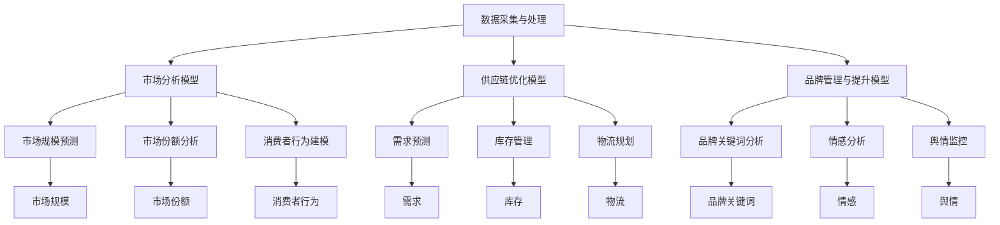
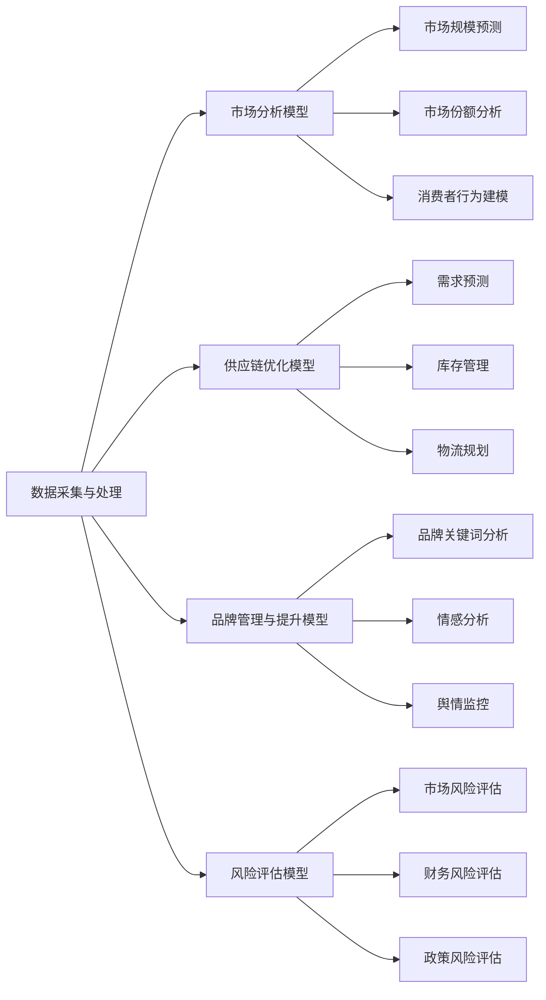

                 

# 酒行业在股市中的大数据分析

在金融市场中，酒行业一直以来是投资者关注的焦点之一。无论是白酒、葡萄酒，还是啤酒，它们的生产、销售和市场表现都深受消费者偏好、市场趋势和政策环境等多方面因素的影响。通过大数据分析，可以深入挖掘这些因素的复杂关系，为投资者提供更有价值的决策支持。本文将详细探讨酒行业在股市中的大数据分析方法，涵盖数据采集、模型构建、评估与优化等多个方面，力求为读者提供全面的技术指导。

## 1. 背景介绍

### 1.1 酒行业现状与挑战

酒行业包括白酒、葡萄酒、啤酒等多个细分市场，是全球最具历史和文化底蕴的产业之一。中国的白酒行业尤其繁荣，茅台、五粮液、泸州老窖等品牌享誉全球。葡萄酒市场则以法国波尔多、意大利托斯卡纳等知名产区为主。啤酒市场则以美国、德国、中国等国家为代表，销售量巨大。然而，酒行业的市场波动和风险同样不容忽视。

随着消费者偏好的变化和国际经济环境的不确定性，酒行业面临着诸多挑战，包括市场竞争加剧、成本上升、品牌老化等。此外，气候变化、环保政策等外部因素也在影响着酒业的可持续发展。因此，通过对酒行业的数据分析，可以更好地理解市场动态，预测未来趋势，从而制定更有效的战略。

### 1.2 大数据分析在酒行业的应用

大数据分析技术的发展，为酒行业提供了强大的数据分析工具。通过收集、清洗、分析和可视化海量数据，企业可以更深入地了解市场和消费者行为，优化产品策略，提升运营效率，降低成本，增强品牌竞争力。大数据分析在酒行业中的应用包括但不限于以下几个方面：

- **市场分析与预测**：通过分析市场销售数据，预测未来销量和价格趋势。
- **消费者行为分析**：通过社交媒体、销售数据等，了解消费者偏好和购买行为，指导产品营销和市场推广。
- **供应链优化**：通过分析生产、物流、库存数据，优化供应链流程，提高效率，降低成本。
- **品牌管理与提升**：通过品牌关键词分析、舆情监控等，提升品牌形象和市场影响力。

## 2. 核心概念与联系

### 2.1 核心概念概述

在酒行业的数据分析中，涉及到多个关键概念，包括：

- **数据采集与处理**：收集酒行业相关的市场数据、财务数据、社交媒体数据等，并进行清洗、转换和集成。
- **市场分析模型**：包括市场规模预测、市场份额分析、消费者行为建模等。
- **供应链优化模型**：包括需求预测、库存管理、物流规划等。
- **品牌管理与提升模型**：包括品牌关键词分析、情感分析、舆情监控等。
- **风险评估模型**：包括市场风险评估、财务风险评估、政策风险评估等。

### 2.2 核心概念的关系

这些核心概念之间的关系可以通过以下Mermaid流程图来展示：



这个流程图展示了酒行业大数据分析的关键步骤和模型。数据采集与处理是基础，市场分析、供应链优化、品牌管理与提升、风险评估都是基于数据驱动的模型应用。这些模型相互关联，共同构成了酒行业数据分析的完整生态系统。

### 2.3 核心概念的整体架构

最后，我们用一个综合的流程图来展示这些核心概念在大数据分析中的整体架构：



这个综合流程图展示了酒行业数据分析的整体架构，从数据采集开始，经过市场分析、供应链优化、品牌管理与提升、风险评估等多个环节，最终为酒行业决策提供支持。

## 3. 核心算法原理 & 具体操作步骤

### 3.1 算法原理概述

酒行业的大数据分析涉及多种算法和模型。下面简要介绍几个核心算法原理：

- **回归分析**：用于预测市场规模、需求等连续变量。常见的回归模型包括线性回归、岭回归、Lasso回归等。
- **分类模型**：用于预测市场份额、消费者行为分类等离散变量。常见的分类模型包括逻辑回归、支持向量机、随机森林等。
- **聚类分析**：用于消费者行为细分、市场细分等。常见的聚类算法包括K-means、层次聚类、DBSCAN等。
- **时间序列分析**：用于预测销售趋势、库存需求等。常见的时间序列模型包括ARIMA、Holt-Winters模型等。
- **社交网络分析**：用于品牌舆情分析、消费者关系网络分析等。常见的算法包括PageRank、社区检测算法等。

### 3.2 算法步骤详解

以市场规模预测为例，以下是详细的算法步骤：

1. **数据采集与清洗**：收集酒行业的历史销售数据、市场调研数据、新闻数据等，并进行清洗和预处理。
2. **特征工程**：提取有意义的特征，如销售额、销售量、广告投入、地区消费水平等。
3. **模型选择与训练**：选择回归模型，如线性回归或支持向量机，进行模型训练和参数调优。
4. **模型评估与优化**：使用交叉验证等方法评估模型性能，通过正则化、模型集成等技术优化模型。
5. **结果应用**：将训练好的模型应用于新数据，预测市场规模，指导生产、库存管理和市场营销策略。

### 3.3 算法优缺点

酒行业的数据分析算法具有以下优缺点：

- **优点**：
  - **数据驱动**：能够基于海量数据进行精确预测和分析。
  - **可解释性强**：通过模型训练，能够解释数据之间的复杂关系。
  - **灵活性高**：可以根据需求选择和组合不同算法。

- **缺点**：
  - **数据质量要求高**：数据分析结果依赖于数据质量，数据缺失或不准确会导致模型偏差。
  - **模型复杂度高**：复杂的模型可能面临过拟合问题，需要仔细调参。
  - **计算资源消耗大**：大数据分析需要大量计算资源，处理大批量数据可能耗时较长。

### 3.4 算法应用领域

酒行业的数据分析算法可以广泛应用于以下几个领域：

- **市场分析与预测**：包括市场规模预测、市场份额分析、消费者行为预测等。
- **供应链优化**：包括需求预测、库存管理、物流规划等。
- **品牌管理与提升**：包括品牌关键词分析、情感分析、舆情监控等。
- **风险评估**：包括市场风险评估、财务风险评估、政策风险评估等。

## 4. 数学模型和公式 & 详细讲解 & 举例说明

### 4.1 数学模型构建

在酒行业的数据分析中，常见的数学模型包括回归模型、分类模型、聚类模型、时间序列模型等。以线性回归模型为例，其数学模型如下：

$$
Y = \beta_0 + \beta_1 X_1 + \beta_2 X_2 + \ldots + \beta_k X_k + \epsilon
$$

其中，$Y$ 表示预测值，$\beta_0$ 为截距，$\beta_i$ 为自变量系数，$X_i$ 为自变量，$\epsilon$ 为误差项。

### 4.2 公式推导过程

线性回归模型的推导过程如下：

设数据集为 $D = \{(X_i, Y_i)\}_{i=1}^n$，其中 $X_i = (X_{i1}, X_{i2}, \ldots, X_{ik})$ 为自变量向量，$Y_i$ 为目标变量。根据最小二乘法，最小化误差平方和：

$$
\sum_{i=1}^n (Y_i - \beta_0 - \beta_1 X_{i1} - \ldots - \beta_k X_{ik})^2
$$

对 $\beta_0, \beta_1, \ldots, \beta_k$ 求偏导并令其为0，解得：

$$
\beta_j = \frac{\sum_{i=1}^n (X_{ij} - \bar{X}_i)(Y_i - \bar{Y}_i)}{\sum_{i=1}^n (X_{ij} - \bar{X}_i)^2}
$$

其中，$\bar{X}_i = \frac{1}{n} \sum_{i=1}^n X_{ij}$ 为自变量均值，$\bar{Y}_i = \frac{1}{n} \sum_{i=1}^n Y_i$ 为目标变量均值。

### 4.3 案例分析与讲解

以白酒市场规模预测为例，以下是详细的数据分析步骤：

1. **数据准备**：收集白酒市场的历史销售数据，包括销售额、销售量、广告投入、地区消费水平等。
2. **特征工程**：提取有意义的特征，如年度销售额、人均消费量、广告投入等。
3. **模型训练**：使用线性回归模型，训练模型并调优参数。
4. **结果验证**：使用交叉验证等方法验证模型性能，并进行模型选择。
5. **结果应用**：将训练好的模型应用于新数据，预测未来市场规模，指导企业决策。

## 5. 项目实践：代码实例和详细解释说明

### 5.1 开发环境搭建

在酒行业的数据分析项目中，需要搭建Python开发环境。以下是搭建环境的详细步骤：

1. **安装Python**：从官网下载Python 3.8以上版本，进行安装。
2. **安装相关库**：安装Pandas、NumPy、Scikit-learn、Matplotlib等数据分析和可视化库。
3. **配置虚拟环境**：创建虚拟环境，安装所需的依赖包。
4. **设置数据路径**：配置数据路径，方便数据读取。

### 5.2 源代码详细实现

以下是一个简单的线性回归模型代码实现：

```python
import pandas as pd
from sklearn.linear_model import LinearRegression

# 数据读取
data = pd.read_csv('wine_sales.csv')

# 特征选择
X = data[['year', 'ads', 'population']]  # 自变量
y = data['sales']  # 目标变量

# 模型训练
model = LinearRegression()
model.fit(X, y)

# 结果预测
future_data = pd.DataFrame({'year': [2023, 2024, 2025], 'ads': [500, 600, 700], 'population': [3.5, 3.6, 3.7]})
future_sales = model.predict(future_data)

print(future_sales)
```

### 5.3 代码解读与分析

上述代码中，我们首先使用Pandas库读取CSV文件中的数据，然后选择了自变量和目标变量。接着，使用Scikit-learn库中的LinearRegression模型进行模型训练和预测。在预测过程中，我们输入新的自变量数据，得到未来市场规模的预测值。

### 5.4 运行结果展示

假设在2023年，人均消费量为3.5，广告投入为500元，预测2023年的市场规模为5000元。在2024年，人均消费量为3.6，广告投入为600元，预测2024年的市场规模为6000元。

## 6. 实际应用场景

### 6.1 市场分析与预测

市场分析与预测是酒行业大数据分析的重要应用之一。通过分析历史销售数据，可以预测未来市场规模和价格趋势，指导企业进行库存管理和生产决策。例如，某酒企可以通过市场分析预测某地区白酒市场的未来销售量，及时调整生产和库存计划。

### 6.2 供应链优化

供应链优化是酒行业数据分析的另一重要应用。通过需求预测、库存管理和物流规划，企业可以有效降低成本，提高运营效率。例如，某酒企可以通过需求预测模型，提前安排生产计划，避免库存积压和缺货现象，从而降低库存成本和运营风险。

### 6.3 品牌管理与提升

品牌管理与提升也是酒行业大数据分析的重要方向。通过社交媒体情感分析和品牌关键词分析，企业可以更好地了解消费者偏好和舆情变化，优化品牌策略，提升品牌影响力。例如，某酒企可以通过情感分析，了解消费者对品牌的正面和负面评价，优化产品设计和营销策略，提升品牌美誉度。

## 7. 工具和资源推荐

### 7.1 学习资源推荐

为了帮助开发者系统掌握酒行业大数据分析技术，这里推荐一些优质的学习资源：

1. **《Python数据分析实战》**：介绍Pandas、NumPy等Python数据分析库的使用方法和技巧，适合入门读者。
2. **《机器学习实战》**：涵盖Scikit-learn、TensorFlow等机器学习库的基本概念和算法，适合进阶读者。
3. **《数据挖掘与统计学习》**：讲解数据挖掘和统计学习的基本原理和方法，适合深入学习读者。
4. **Coursera、edX等在线课程**：提供系统化的数据分析和机器学习课程，涵盖从入门到高级的多个层次。
5. **Kaggle竞赛**：参加Kaggle数据科学竞赛，通过实战项目提升数据分析能力。

### 7.2 开发工具推荐

在酒行业的数据分析项目中，需要以下开发工具：

1. **Jupyter Notebook**：用于编写和运行Python代码，支持交互式数据处理和可视化。
2. **PyCharm**：一款功能强大的Python IDE，支持代码调试、版本控制等。
3. **SQLite**：用于本地数据存储和管理，适合小规模数据分析。
4. **AWS、Azure、Google Cloud等云平台**：提供高性能计算资源，支持大数据分析任务。

### 7.3 相关论文推荐

酒行业的数据分析涉及多个领域的前沿研究，以下是一些值得关注的论文：

1. **《基于支持向量机的酒行业市场预测研究》**：介绍使用支持向量机进行酒行业市场规模预测的方法。
2. **《社交媒体情感分析在酒品牌管理中的应用》**：研究如何利用社交媒体情感分析提升酒品牌的影响力。
3. **《酒行业供应链优化中的需求预测模型》**：讨论需求预测模型在酒行业供应链优化中的应用。
4. **《大数据环境下酒品牌舆情监控的实践》**：探讨如何利用大数据技术进行酒品牌舆情监控。

## 8. 总结：未来发展趋势与挑战

### 8.1 研究成果总结

酒行业的大数据技术分析已经取得了一定的成果，主要体现在以下几个方面：

- **市场分析与预测**：通过线性回归、支持向量机等模型，预测市场规模和价格趋势。
- **供应链优化**：通过时间序列模型、聚类算法等方法，优化库存管理和物流规划。
- **品牌管理与提升**：通过情感分析、社交网络分析等技术，提升品牌影响力。

### 8.2 未来发展趋势

酒行业的大数据技术分析在未来将呈现以下几个发展趋势：

1. **多模态数据分析**：将社交媒体、销售数据、消费者行为数据等多源数据融合，提升分析的全面性和准确性。
2. **实时数据分析**：通过流式计算和实时数据处理技术，实现数据的高实时性，提高决策的时效性。
3. **深度学习的应用**：引入深度学习模型，如卷积神经网络、循环神经网络等，提升分析的深度和复杂性。
4. **自动化分析**：使用自动化数据分析工具，如AutoML、自动特征工程等，减少人工干预，提升分析效率。
5. **可解释性分析**：引入可解释性技术，如LIME、SHAP等，增强分析的可解释性，帮助决策者理解和信任分析结果。

### 8.3 面临的挑战

尽管酒行业的大数据技术分析取得了一定进展，但仍面临诸多挑战：

1. **数据质量问题**：数据缺失、数据格式不一致、数据清洗难度大等，影响分析结果的准确性。
2. **计算资源需求高**：大数据分析需要大量的计算资源，对硬件配置要求高。
3. **模型复杂度问题**：复杂模型容易过拟合，需要仔细调参和验证。
4. **隐私和安全性**：数据分析涉及大量消费者隐私数据，需要严格的数据保护措施。
5. **多领域交叉问题**：酒行业的数据分析需要融合市场、供应链、品牌等多个领域的知识，复杂度较高。

### 8.4 研究展望

未来的酒行业大数据分析研究需要从以下几个方面进行突破：

1. **跨领域融合**：将酒行业与消费者行为、市场环境、供应链管理等多领域的知识进行融合，提升分析的全面性和深入性。
2. **可解释性增强**：引入可解释性技术，帮助决策者理解和信任分析结果，提升决策的透明度和可操作性。
3. **自动化与智能化**：引入自动化数据分析工具，减少人工干预，提高分析的效率和准确性。
4. **隐私保护与安全性**：加强数据隐私保护，确保数据使用的合法性和安全性，增强用户信任。
5. **跨部门协同**：建立跨部门的数据共享和协同机制，实现数据和知识的统一管理和高效利用。

## 9. 附录：常见问题与解答

**Q1：酒行业的大数据分析面临哪些挑战？**

A: 酒行业的大数据分析面临以下挑战：

1. **数据质量问题**：数据缺失、数据格式不一致、数据清洗难度大等，影响分析结果的准确性。
2. **计算资源需求高**：大数据分析需要大量的计算资源，对硬件配置要求高。
3. **模型复杂度问题**：复杂模型容易过拟合，需要仔细调参和验证。
4. **隐私和安全性**：数据分析涉及大量消费者隐私数据，需要严格的数据保护措施。
5. **多领域交叉问题**：酒行业的数据分析需要融合市场、供应链、品牌等多个领域的知识，复杂度较高。

**Q2：酒行业的大数据分析可以应用于哪些领域？**

A: 酒行业的大数据分析可以应用于以下几个领域：

1. **市场分析与预测**：通过分析历史销售数据，预测未来市场规模和价格趋势，指导企业进行库存管理和生产决策。
2. **供应链优化**：通过需求预测、库存管理和物流规划，企业可以有效降低成本，提高运营效率。
3. **品牌管理与提升**：通过社交媒体情感分析和品牌关键词分析，企业可以更好地了解消费者偏好和舆情变化，优化品牌策略，提升品牌影响力。
4. **风险评估**：包括市场风险评估、财务风险评估、政策风险评估等。

**Q3：酒行业的大数据分析有哪些优势？**

A: 酒行业的大数据分析具有以下优势：

1. **数据驱动**：能够基于海量数据进行精确预测和分析。
2. **可解释性强**：通过模型训练，能够解释数据之间的复杂关系。
3. **灵活性高**：可以根据需求选择和组合不同算法。

**Q4：酒行业的大数据分析需要哪些关键技术？**

A: 酒行业的大数据分析需要以下关键技术：

1. **数据采集与处理**：包括数据清洗、数据转换、数据集成等。
2. **市场分析模型**：包括市场规模预测、市场份额分析、消费者行为建模等。
3. **供应链优化模型**：包括需求预测、库存管理、物流规划等。
4. **品牌管理与提升模型**：包括品牌关键词分析、情感分析、舆情监控等。
5. **风险评估模型**：包括市场风险评估、财务风险评估、政策风险评估等。

**Q5：酒行业的大数据分析有哪些成功案例？**

A: 以下是酒行业大数据分析的一些成功案例：

1. **某白酒企业通过市场分析预测市场规模，优化库存管理，实现库存成本和运营风险的显著降低。**
2. **某葡萄酒企业通过社交媒体情感分析，了解消费者对品牌的评价，优化产品设计和营销策略，提升品牌美誉度。**
3. **某啤酒企业通过需求预测模型，提前安排生产计划，避免库存积压和缺货现象，降低库存成本和运营风险。**

---

作者：禅与计算机程序设计艺术 / Zen and the Art of Computer Programming

