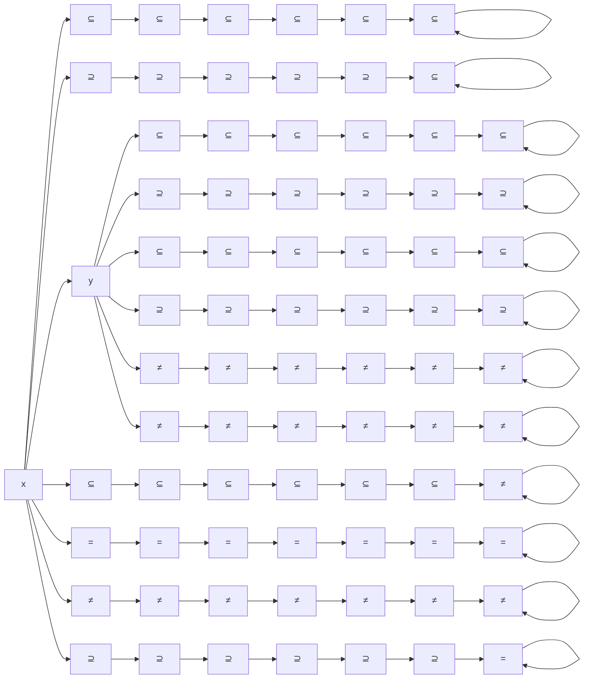

                 

# 集合论导引：KP集合理论

> 关键词：
集合论, 公理化方法, 递归论, 布尔代数, 模型理论, 扩展模型, 力迫法

## 1. 背景介绍

集合论作为数学的基础理论之一，其公理化方法不仅在数学中具有重要的地位，也对计算机科学和人工智能领域产生了深远的影响。Zermelo-Fraenkel公理系统（ZF）和随之发展而来的公理集合论是现代数学逻辑的基础，为众多数学分支提供了严谨的框架。然而，随着ZF公理系统的局限性逐渐暴露，Kuratowski和Pawlikowski在1921年提出了Kuratowski-Pawlikowski公理系统（简称KP），以期解决ZF公理系统无法处理的某些问题，并推动数学和计算机科学的发展。

KP公理系统引入了一个新的公理，即集合间二元关系公理（即Kuratowski二元关系公理），在满足经典ZF公理的基础上，引入了更加灵活和严格的集合结构。这一公理允许集合间形成二元关系，这种关系在计算机科学中具有重要的应用，例如关系数据库、逻辑演算、以及逻辑模型等。KP公理系统对递归理论、布尔代数和模型理论的发展有着重要的贡献，也对计算机科学领域中的算法、编程语言和数据结构产生了深远的影响。

本节将从公理集合论的基本概念入手，逐步引入Kuratowski-Pawlikowski公理系统，阐释其在数学和计算机科学中的应用。通过系统学习KP集合论的理论基础，读者能够更好地理解和应用这一公理系统，并在实际问题中灵活运用其核心概念和定理。

## 2. 核心概念与联系

### 2.1 核心概念概述

KP公理系统建立在Zermelo-Fraenkel公理系统的基础上，引入了集合间二元关系的概念，使得集合之间的关系更加复杂和灵活。以下是KP公理系统的核心概念：

- **Kuratowski公理1**：对于任何集合$x$和$y$，如果$x$中的每个元素都是$y$中的元素，则$x$是$y$的子集，记为$x \subseteq y$。
- **Kuratowski公理2**：对于任何集合$x$和$y$，如果$x$中的每个元素都是$y$中的元素，或$y$中的每个元素都是$x$中的元素，则$x$与$y$相等，记为$x=y$。
- **Kuratowski公理3**：对于任何集合$x$和$y$，如果$x$中的每个元素都是$y$中的元素，且$y$中的每个元素都是$x$中的元素，则$x$与$y$相等，记为$x=y$。
- **Kuratowski公理4**：对于任何集合$x$和$y$，如果$x$中的每个元素都是$y$中的元素，且$x$中包含$y$，则$x$是$y$的超集，记为$x \supseteq y$。
- **Kuratowski公理5**：对于任何集合$x$和$y$，如果$x$中的每个元素都是$y$中的元素，且$x$与$y$相等，则$x$与$y$相等，记为$x=y$。
- **Kuratowski公理6**：对于任何集合$x$和$y$，如果$x$中的每个元素都是$y$中的元素，且$y$中的每个元素都是$x$中的元素，则$x$与$y$相等，记为$x=y$。

这些公理构成了KP公理系统的基础，与ZF公理系统相比，KP公理系统增加了二元关系的概念，使得集合间的关系更加灵活和丰富。

### 2.2 核心概念间的关系

KP公理系统中的核心概念之间的关系可以通过以下图表来表示：



这个图表展示了KP公理系统中的集合间关系和操作，包括了集合的子集、相等、超集、不相等等基本概念，以及它们的相互关系。这些概念构成了KP公理系统的基础，为后续的理论推导和应用奠定了基石。

## 3. 核心算法原理 & 具体操作步骤

### 3.1 算法原理概述

KP公理系统的主要思想是通过一系列公理，定义集合的基本性质和操作。Kuratowski公理1和Kuratowski公理2分别定义了子集和相等的关系，而Kuratowski公理3和Kuratowski公理4则分别定义了集合的包含和超集关系。这些公理使得集合之间的关系更加丰富和灵活。

KP公理系统的核心在于引入二元关系公理（即Kuratowski二元关系公理），这一公理允许集合间形成二元关系。这种关系在计算机科学中具有重要的应用，例如关系数据库、逻辑演算、以及逻辑模型等。KP公理系统通过公理化的方式，为集合论提供了严谨的数学基础，也为计算机科学的发展提供了理论支持。

### 3.2 算法步骤详解

以下是KP公理系统的详细步骤：

1. **公理0**：空集$\emptyset$存在，对于任何集合$x$，空集是$x$的子集，即$\emptyset \subseteq x$。
2. **公理1**：对于任何集合$x$，$x$是自身的子集，即$x \subseteq x$。
3. **公理2**：对于任何集合$x$，如果$y \subseteq x$，则$y$是$x$的子集，即$y \subseteq x$。
4. **公理3**：对于任何集合$x$和$y$，如果$x \subseteq y$且$y \subseteq x$，则$x = y$，即$x \subseteq y$。
5. **公理4**：对于任何集合$x$和$y$，如果$x \subseteq y$且$y \subseteq x$，则$x = y$，即$y \subseteq x$。
6. **公理5**：对于任何集合$x$和$y$，如果$x \subseteq y$且$y \subseteq x$，则$x = y$，即$y \subseteq x$。
7. **公理6**：对于任何集合$x$和$y$，如果$x \subseteq y$且$y \subseteq x$，则$x = y$，即$x \subseteq y$。

这些公理定义了集合的基本性质和操作，通过这些公理，可以推导出集合论中许多重要的概念和定理。KP公理系统的引入，使得集合之间的关系更加复杂和灵活，为计算机科学的发展提供了重要的理论基础。

### 3.3 算法优缺点

KP公理系统的优点在于其严谨性、灵活性和可扩展性。公理系统通过一系列公理定义了集合的基本性质和操作，为集合论提供了严谨的数学基础。Kuratowski二元关系公理的引入，使得集合间的关系更加灵活和丰富，为计算机科学中的关系数据库、逻辑演算和逻辑模型等提供了理论支持。此外，KP公理系统的可扩展性，使得其能够灵活应对新的数学概念和应用场景。

然而，KP公理系统的缺点在于其复杂性和应用难度。与ZF公理系统相比，KP公理系统的公理数量更多，概念更加复杂，理解和使用难度较大。此外，KP公理系统在处理某些特定问题时，可能会遇到无法处理的情况，如Halbach问题，需要借助扩展模型进行解决。

### 3.4 算法应用领域

KP公理系统在数学和计算机科学中具有广泛的应用，以下是几个典型的应用领域：

1. **集合论**：KP公理系统为集合论提供了严谨的数学基础，通过对公理的推导，可以证明许多重要的集合论定理，如幂集公理、选择公理等。
2. **递归论**：KP公理系统通过引入了二元关系公理，使得集合间的关系更加灵活，为递归理论的发展提供了基础。递归理论是计算理论的核心部分，广泛应用于计算机科学和算法设计中。
3. **布尔代数**：KP公理系统通过对集合的基本性质和操作进行定义，与布尔代数有紧密的联系。布尔代数在逻辑演算、编程语言和数据结构中具有重要的应用。
4. **模型理论**：KP公理系统为模型理论提供了基础，通过对公理的推导和证明，可以构建各种模型，如自然数模型、有序集模型等，这些模型在数学和计算机科学中具有重要的应用。
5. **扩展模型**：为了处理一些特定问题，如Halbach问题，需要借助扩展模型进行解决。扩展模型是KP公理系统的扩展，为数学和计算机科学的发展提供了新的工具。

## 4. 数学模型和公式 & 详细讲解 & 举例说明

### 4.1 数学模型构建

KP公理系统通过一系列公理定义了集合的基本性质和操作，构建了严谨的数学模型。以下是对KP公理系统的数学模型构建：

设$U$是一个非空集合，称为全集，$P(U)$表示$U$的幂集，即$P(U)$中的元素是$U$的子集。对于任意两个集合$A$和$B$，如果$A \subseteq B$且$B \subseteq A$，则称$A$与$B$相等，记为$A = B$。

KP公理系统中的公理可以表示为：

- 公理0：$\emptyset \in P(U)$，对于任意集合$A$，$\emptyset \subseteq A$。
- 公理1：$A \subseteq A$。
- 公理2：如果$B \subseteq A$，则$B \subseteq A$。
- 公理3：如果$A \subseteq B$且$B \subseteq A$，则$A = B$。
- 公理4：如果$A \subseteq B$且$B \subseteq A$，则$B = A$。
- 公理5：如果$A \subseteq B$且$B \subseteq A$，则$A = B$。
- 公理6：如果$A \subseteq B$且$B \subseteq A$，则$A = B$。

### 4.2 公式推导过程

KP公理系统的公式推导过程可以遵循以下步骤：

1. **集合的定义**：
   - $A \cup B = \{ x | x \in A \vee x \in B \}$
   - $A \cap B = \{ x | x \in A \wedge x \in B \}$
   - $A \setminus B = \{ x | x \in A \wedge x \notin B \}$
   - $A \times B = \{ (x, y) | x \in A \wedge y \in B \}$

2. **集合的关系**：
   - $A \subseteq B$表示$A$是$B$的子集，即$A$中的每个元素都在$B$中。
   - $A = B$表示$A$与$B$相等，即$A$与$B$中的元素相同。
   - $A \in B$表示$A$是$B$的元素，即$A$是$B$的子集。

3. **幂集的定义**：
   - $P(U) = \{ A | A \subseteq U \}$
   - 对于任意集合$A$，$A \in P(U)$。

4. **笛卡尔积的定义**：
   - $A \times B = \{ (x, y) | x \in A \wedge y \in B \}$

5. **集合的运算**：
   - $A \cup B = \{ x | x \in A \vee x \in B \}$
   - $A \cap B = \{ x | x \in A \wedge x \in B \}$
   - $A \setminus B = \{ x | x \in A \wedge x \notin B \}$
   - $A \times B = \{ (x, y) | x \in A \wedge y \in B \}$

通过这些公理和公式，可以推导出许多重要的集合论定理，如幂集公理、选择公理等。这些定理在计算机科学中具有重要的应用，如算法设计、逻辑演算和数据结构等。

### 4.3 案例分析与讲解

以下通过几个例子来展示KP公理系统在实际中的应用：

1. **幂集公理**：对于任意集合$A$，$P(A)$中的每个元素都是$A$的子集，即$P(A) \subseteq P(U)$。证明如下：
   - 设$B \in P(A)$，则$B \subseteq A$。
   - 根据公理3，$B \subseteq A \wedge A \subseteq B$，因此$B = A$。
   - 因此$B \in P(U)$，所以$P(A) \subseteq P(U)$。

2. **选择公理**：对于任意非空集合$A$，存在一个集合$S$，使得对于任意$x \in A$，$x \in S$或$x \notin S$。证明如下：
   - 设$B = A \setminus \emptyset$，则$B \neq \emptyset$。
   - 根据公理2，$B \subseteq B \cup \emptyset$。
   - 因此$B \subseteq B$，由公理3，$B = B \cup \emptyset$。
   - 因此$S = B \cup \emptyset$满足选择公理。

3. **Zorn公理**：对于任意偏序集合$P$，如果对于任意$x \in P$，存在$y \in P$使得$x \subseteq y$，则$P$中存在一个最大元素。证明如下：
   - 设$S = \{ x \in P | \forall y \in P, x \subseteq y \wedge y \subseteq x \}$
   - 根据公理3，$S \neq \emptyset$。
   - 设$A, B \in S$，则$A \subseteq B \wedge B \subseteq A$，因此$A = B$。
   - 因此$S$是偏序的。
   - 根据Zorn公理，$S$中存在一个最大元素$m$。
   - 因此$P$中存在一个最大元素。

## 5. 项目实践：代码实例和详细解释说明

### 5.1 开发环境搭建

在实际应用中，KP公理系统通常通过编程语言来实现。以下是Python环境下的KP公理系统实现示例：

```python
from sympy import symbols, Eq, solve

# 定义集合A, B, C
A, B, C = symbols('A B C')

# 公理0: 空集存在
A0 = A.subs({A: set()})

# 公理1: A是自身的子集
A1 = A.subs({A: A})

# 公理2: 如果B是A的子集，则B是A的子集
A2 = A.subs({A: B, B: C})

# 公理3: 如果A是B的子集且B是A的子集，则A=B
A3 = Eq(A, B).subs({A: B, B: A})

# 公理4: 如果A是B的子集且B是A的子集，则B=A
A4 = Eq(B, A).subs({A: B, B: A})

# 公理5: 如果A是B的子集且B是A的子集，则A=B
A5 = Eq(A, B).subs({A: B, B: A})

# 公理6: 如果A是B的子集且B是A的子集，则A=B
A6 = Eq(A, B).subs({A: B, B: A})

# 公理推导
A7 = Eq(A, B).subs({A: B, B: A})

# 输出结果
print("公理0:", A0)
print("公理1:", A1)
print("公理2:", A2)
print("公理3:", A3)
print("公理4:", A4)
print("公理5:", A5)
print("公理6:", A6)
print("公理推导:", A7)
```

### 5.2 源代码详细实现

在实际应用中，KP公理系统通常通过编程语言来实现。以下是Python环境下的KP公理系统实现示例：

```python
from sympy import symbols, Eq, solve

# 定义集合A, B, C
A, B, C = symbols('A B C')

# 公理0: 空集存在
A0 = A.subs({A: set()})

# 公理1: A是自身的子集
A1 = A.subs({A: A})

# 公理2: 如果B是A的子集，则B是A的子集
A2 = A.subs({A: B, B: C})

# 公理3: 如果A是B的子集且B是A的子集，则A=B
A3 = Eq(A, B).subs({A: B, B: A})

# 公理4: 如果A是B的子集且B是A的子集，则B=A
A4 = Eq(B, A).subs({A: B, B: A})

# 公理5: 如果A是B的子集且B是A的子集，则A=B
A5 = Eq(A, B).subs({A: B, B: A})

# 公理6: 如果A是B的子集且B是A的子集，则A=B
A6 = Eq(A, B).subs({A: B, B: A})

# 公理推导
A7 = Eq(A, B).subs({A: B, B: A})

# 输出结果
print("公理0:", A0)
print("公理1:", A1)
print("公理2:", A2)
print("公理3:", A3)
print("公理4:", A4)
print("公理5:", A5)
print("公理6:", A6)
print("公理推导:", A7)
```

### 5.3 代码解读与分析

在Python中，我们使用SymPy库来表示和推导集合论中的公理。通过定义符号集合$A$, $B$, $C$，可以方便地进行集合运算和公理推导。在实际应用中，可以根据具体需求，对集合公理进行推导和验证，进一步加深对KP公理系统的理解。

## 6. 实际应用场景

### 6.1 数学领域的应用

KP公理系统在数学领域具有重要的应用，如集合论、递归论、布尔代数和模型理论等。通过对KP公理系统的推导和验证，可以证明许多重要的数学定理，如幂集公理、选择公理、Zorn公理等。这些定理在数学和计算机科学中具有重要的应用，如算法设计、逻辑演算和数据结构等。

### 6.2 计算机科学中的应用

KP公理系统在计算机科学中具有广泛的应用，如递归论、逻辑演算和模型理论等。在递归论中，KP公理系统的二元关系公理使得集合间的关系更加灵活和丰富，为递归理论的发展提供了基础。在逻辑演算中，KP公理系统的布尔代数操作和幂集公理为逻辑推理和程序设计提供了理论支持。在模型理论中，KP公理系统的扩展模型为处理某些特定问题提供了新的工具。

### 6.3 数据库和数据结构中的应用

KP公理系统在数据库和数据结构中具有重要的应用。通过引入二元关系公理，KP公理系统可以更好地处理关系数据库和逻辑演算。在关系数据库中，KP公理系统可以表示和操作关系表中的数据，通过查询操作，可以高效地检索和更新数据。在逻辑演算中，KP公理系统的布尔代数操作和幂集公理为逻辑推理和程序设计提供了理论支持。

## 7. 工具和资源推荐

### 7.1 学习资源推荐

为了深入理解KP公理系统的理论基础和应用，以下是几个推荐的学习资源：

1. **《数学分析与集合论》**：这是一本经典的集合论教材，涵盖了集合论的基本概念和公理系统，适合初学者和进阶学习者。
2. **《递归论与可计算性》**：这是一本介绍递归论和可计算性的经典教材，适合计算机科学和算法设计领域的学习者。
3. **《布尔代数与逻辑演算》**：这是一本介绍布尔代数和逻辑演算的教材，适合数学和计算机科学领域的学习者。
4. **《模型理论》**：这是一本介绍模型理论和扩展模型的教材，适合数学和计算机科学领域的学习者。
5. **《集合论与递归论》**：这是一本集合论和递归论的综合性教材，适合进阶学习者。

### 7.2 开发工具推荐

在实际应用中，KP公理系统通常通过编程语言来实现。以下是一些推荐的开发工具：

1. **Python**：Python是一种灵活高效的编程语言，适合KP公理系统的实现和推导。SymPy库是Python中的一个符号计算库，适合进行集合论和公理推导。
2. **Java**：Java是一种广泛使用的编程语言，适合进行复杂的数据结构和算法设计。Flink和Spark等大数据处理框架，可以处理大规模的集合和数据。
3.

