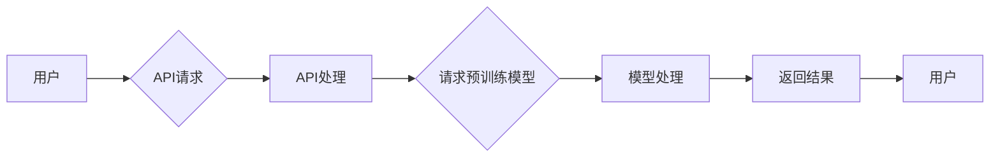

# 强大的OpenAI API

> 关键词：OpenAI, API, GPT-3, NLP, 人工智能, 自然语言处理, 自动化, 开发者工具

## 1. 背景介绍

随着人工智能技术的飞速发展，自然语言处理（NLP）成为了AI领域的一个热门方向。OpenAI，作为一家专注于推动人工智能研究的公司，推出了强大的OpenAI API，为开发者提供了丰富的NLP工具和服务。本文将深入探讨OpenAI API的核心概念、工作原理、应用场景以及未来发展趋势。

## 2. 核心概念与联系

### 2.1 OpenAI API简介

OpenAI API是一个集成了多种NLP模型的接口，通过这个API，开发者可以轻松访问到GPT-3、GPT-2、BERT等强大的预训练模型，实现文本生成、情感分析、机器翻译等复杂功能。

### 2.2 OpenAI API架构

OpenAI API的架构主要由以下几个部分组成：

```
+------------------+     +------------------+     +------------------+
| 用户              |     | OpenAI API       |     | 预训练模型      |
|                   | --> |                   | --> | (如GPT-3, BERT)  |
+------------------+     +------------------+     +------------------+
```

用户通过API发送请求，API将请求转发到预训练模型，模型处理请求并返回结果。

### 2.3 Mermaid流程图



## 3. 核心算法原理 & 具体操作步骤

### 3.1 算法原理概述

OpenAI API背后的核心算法是深度学习，特别是神经网络。预训练模型通过在大规模语料库上进行训练，学习到了丰富的语言知识和模式，能够进行复杂的语言理解、生成和翻译等任务。

### 3.2 算法步骤详解

1. 用户通过API发送请求，请求内容可以是文本、音频、图像等。
2. API将请求转发到预训练模型。
3. 模型根据请求内容，调用相应的算法进行处理。
4. 处理完成后，模型将结果返回给API。
5. API将结果包装后返回给用户。

### 3.3 算法优缺点

**优点**：
- **强大的语言处理能力**：预训练模型经过海量数据训练，能够处理各种复杂的语言任务。
- **易于使用**：API接口简单，开发者可以快速上手。
- **可定制性强**：API支持定制化参数，满足不同应用场景的需求。

**缺点**：
- **成本较高**：API使用需要付费，对于初创公司来说可能是一笔不小的开支。
- **延迟**：由于模型处理需要时间，API调用可能存在一定的延迟。

### 3.4 算法应用领域

OpenAI API在以下领域有着广泛的应用：

- **文本生成**：自动生成文章、代码、故事等。
- **机器翻译**：将一种语言的文本翻译成另一种语言。
- **情感分析**：分析文本的情感倾向。
- **问答系统**：根据用户提问，自动生成答案。
- **聊天机器人**：与用户进行自然语言对话。

## 4. 数学模型和公式 & 详细讲解 & 举例说明

### 4.1 数学模型构建

OpenAI API使用的核心数学模型是神经网络，特别是深度神经网络。神经网络由多个神经元组成，每个神经元都通过权重与输入数据进行线性变换，并通过激活函数进行非线性变换。

### 4.2 公式推导过程

假设有一个包含 $L$ 层的神经网络，第 $i$ 层的输入和输出关系可以表示为：

$$
\mathbf{h}^{(i)} = \sigma(\mathbf{W}^{(i)} \cdot \mathbf{h}^{(i-1)} + \mathbf{b}^{(i)})
$$

其中，$\mathbf{W}^{(i)}$ 是第 $i$ 层的权重矩阵，$\mathbf{b}^{(i)}$ 是第 $i$ 层的偏置向量，$\sigma$ 是激活函数，$\mathbf{h}^{(i)}$ 是第 $i$ 层的输出。

### 4.3 案例分析与讲解

以文本生成为例，我们可以使用一个简单的神经网络模型来生成文本。

1. 输入：文本序列 $X = [x_1, x_2, \ldots, x_n]$。
2. 输出：文本序列 $Y = [y_1, y_2, \ldots, y_n]$。
3. 模型：使用循环神经网络（RNN）或长短期记忆网络（LSTM）。
4. 训练过程：通过反向传播算法更新模型参数，使得模型生成的文本序列与真实文本序列之间的差异最小。

## 5. 项目实践：代码实例和详细解释说明

### 5.1 开发环境搭建

1. 安装Python环境。
2. 安装OpenAI API客户端。

```bash
pip install openai
```

### 5.2 源代码详细实现

```python
import openai

# 初始化API客户端
openai.api_key = '你的API密钥'

# 使用GPT-3生成文本
def generate_text(prompt):
    response = openai.Completion.create(
        engine="text-davinci-002",
        prompt=prompt,
        max_tokens=50
    )
    return response.choices[0].text.strip()

# 测试生成文本
prompt = "给定一个句子，生成一个与之相关的句子。"
text = generate_text(prompt)
print(text)
```

### 5.3 代码解读与分析

- `openai` 模块提供了OpenAI API的接口。
- `Completion.create` 方法用于生成文本。
- `prompt` 是生成文本的提示。
- `max_tokens` 是生成文本的最大长度。

### 5.4 运行结果展示

假设我们输入的提示是："给定一个句子，生成一个与之相关的句子。"，那么模型可能会生成如下文本：

> "在这个句子中，我们可以看到许多细节，比如……"

## 6. 实际应用场景

### 6.1 文本生成

使用OpenAI API可以轻松实现文本生成，如自动生成新闻、文章、故事等。

### 6.2 机器翻译

OpenAI API提供的机器翻译功能可以实现多种语言的互译，帮助企业进行国际化运营。

### 6.3 情感分析

OpenAI API可以用于分析用户评论、社交媒体帖子等文本的情感倾向，帮助企业了解用户需求。

### 6.4 问答系统

OpenAI API可以构建智能问答系统，为用户提供及时、准确的答案。

### 6.5 聊天机器人

OpenAI API可以用于构建智能聊天机器人，与用户进行自然语言对话。

## 7. 工具和资源推荐

### 7.1 学习资源推荐

- OpenAI官网文档：https://openai.com/docs/
- 《深度学习自然语言处理》书籍：https://www.deeplearningbook.org/

### 7.2 开发工具推荐

- OpenAI API客户端：https://github.com/openai/openai-python

### 7.3 相关论文推荐

- "Language Models are Unsupervised Multitask Learners"（GPT-2论文）：https://arxiv.org/abs/1909.01337
- "BERT: Pre-training of Deep Bidirectional Transformers for Language Understanding"（BERT论文）：https://arxiv.org/abs/1810.04805

## 8. 总结：未来发展趋势与挑战

### 8.1 研究成果总结

OpenAI API为开发者提供了强大的NLP工具和服务，极大地推动了NLP技术的发展和应用。通过预训练模型和API接口，开发者可以轻松实现各种复杂的语言任务，如文本生成、机器翻译、情感分析等。

### 8.2 未来发展趋势

- **模型规模持续增大**：随着计算能力的提升，预训练模型的规模将越来越大，能够处理更加复杂的语言任务。
- **模型可解释性增强**：随着研究的深入，模型的可解释性将得到提升，用户可以更好地理解模型的决策过程。
- **多模态融合**：未来，NLP将与图像、音频等其他模态数据融合，实现更加丰富的智能应用。

### 8.3 面临的挑战

- **数据隐私和安全**：随着NLP技术的应用越来越广泛，如何保护用户数据隐私和安全将成为重要挑战。
- **模型偏见和歧视**：如何消除模型偏见和歧视，确保公平公正将成为重要挑战。
- **模型可解释性**：如何提升模型的可解释性，让用户更好地理解模型的决策过程将成为重要挑战。

### 8.4 研究展望

随着NLP技术的不断发展，OpenAI API将继续为开发者提供更加丰富、强大的功能，推动NLP技术在各个领域的应用，为人类社会创造更多价值。

---

作者：禅与计算机程序设计艺术 / Zen and the Art of Computer Programming