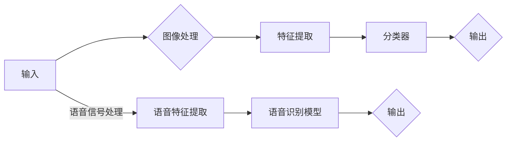

> 关键词：软件2.0，图像识别，语音识别，深度学习，卷积神经网络，循环神经网络，自然语言处理，人工智能

# 软件 2.0 的应用领域：图像识别、语音识别

随着互联网技术的飞速发展，软件从最初的单一功能应用逐渐演变为一个集成了多种智能功能的复杂系统，我们将其称为软件2.0。在这一阶段，图像识别和语音识别作为人工智能领域的两个重要分支，已经广泛应用于各个行业，推动了软件技术的革新和进步。

## 1. 背景介绍

### 1.1 问题的由来

在软件1.0时代，软件的功能相对单一，用户界面简单，交互方式有限。随着用户需求的日益复杂化和个性化，软件1.0的局限性逐渐显现。为了满足用户对更智能、更个性化的软件的需求，软件2.0时代应运而生。

### 1.2 研究现状

软件2.0的核心特征是智能化，而图像识别和语音识别作为人工智能领域的两个关键技术，成为了软件2.0的重要应用领域。目前，图像识别和语音识别技术已经取得了显著的进展，并在多个领域得到了广泛应用。

### 1.3 研究意义

图像识别和语音识别技术的应用，不仅提升了软件的智能化水平，也极大地提高了用户体验。同时，这些技术还为各个行业带来了巨大的经济效益和社会价值。

### 1.4 本文结构

本文将分为以下几个部分进行阐述：

- 核心概念与联系
- 核心算法原理 & 具体操作步骤
- 数学模型和公式 & 详细讲解 & 举例说明
- 项目实践：代码实例和详细解释说明
- 实际应用场景
- 工具和资源推荐
- 总结：未来发展趋势与挑战
- 附录：常见问题与解答

## 2. 核心概念与联系

### 2.1 图像识别

图像识别是指让计算机通过图像处理技术来识别和理解图像内容。其核心概念包括：

- 图像处理：对图像进行预处理、增强、分割等操作，以便更好地提取图像特征。
- 特征提取：从图像中提取出能够表征图像内容和结构的特征。
- 分类器：根据提取出的特征对图像进行分类。

### 2.2 语音识别

语音识别是指让计算机通过语音信号处理技术来识别和理解语音内容。其核心概念包括：

- 语音信号处理：对语音信号进行预处理、增强、分割等操作，以便更好地提取语音特征。
- 语音识别模型：根据提取出的语音特征，将语音信号转换为对应的文本或命令。

### 2.3 Mermaid 流程图

以下是图像识别和语音识别的基本流程图：



## 3. 核心算法原理 & 具体操作步骤

### 3.1 算法原理概述

图像识别和语音识别的核心算法包括：

- 卷积神经网络（CNN）：适用于图像识别，能够自动提取图像特征。
- 循环神经网络（RNN）及其变体：适用于语音识别，能够处理序列数据。

### 3.2 算法步骤详解

#### 图像识别算法步骤：

1. 图像预处理：对图像进行缩放、裁剪、旋转等操作。
2. 特征提取：使用CNN等深度学习模型提取图像特征。
3. 分类：使用分类器对提取出的特征进行分类，得到最终的识别结果。

#### 语音识别算法步骤：

1. 语音预处理：对语音信号进行降噪、静音消除等操作。
2. 语音特征提取：使用梅尔频率倒谱系数（MFCC）等特征提取技术提取语音特征。
3. 语音识别：使用RNN等深度学习模型对提取出的语音特征进行解码，得到最终的识别结果。

### 3.3 算法优缺点

#### 图像识别算法优缺点：

- 优点：能够自动提取图像特征，识别精度高，适用范围广。
- 缺点：训练过程复杂，对计算资源要求高，容易过拟合。

#### 语音识别算法优缺点：

- 优点：能够实时处理语音信号，适用范围广，易于与自然语言处理等技术结合。
- 缺点：对噪声敏感，识别精度受语音质量影响较大，容易受到口音、语速等因素影响。

### 3.4 算法应用领域

#### 图像识别应用领域：

- 智能监控：人脸识别、车牌识别、场景识别等。
- 医学影像分析：病变检测、疾病诊断等。
- 物流仓储：物品识别、分拣等。

#### 语音识别应用领域：

- 智能语音助手：语音交互、语音命令等。
- 语音翻译：语音-文本转换、文本-语音转换等。
- 自动化办公：语音会议、语音信箱等。

## 4. 数学模型和公式 & 详细讲解 & 举例说明

### 4.1 数学模型构建

#### 图像识别数学模型：

- 输入：图像 $I$
- 输出：识别结果 $Y$

$$
Y = f(W, b, I)
$$

其中 $W$ 为权重，$b$ 为偏置，$f$ 为非线性激活函数。

#### 语音识别数学模型：

- 输入：语音信号 $X$
- 输出：识别结果 $Y$

$$
Y = g(U, V, X)
$$

其中 $U$ 为编码器参数，$V$ 为解码器参数，$g$ 为非线性激活函数。

### 4.2 公式推导过程

#### 图像识别公式推导：

以卷积神经网络为例，假设输入图像为 $I \in \mathbb{R}^{H \times W \times C}$，其中 $H$、$W$、$C$ 分别表示图像的高度、宽度和通道数。经过 $L$ 层卷积层，最终得到识别结果 $Y$。

$$
Y = f(W_L, b_L, f(W_{L-1}, b_{L-1}, ..., f(W_1, b_1, I))
$$

#### 语音识别公式推导：

以循环神经网络为例，假设输入语音信号为 $X \in \mathbb{R}^{T \times D}$，其中 $T$ 表示时间步长，$D$ 表示特征维度。经过 $L$ 层循环层，最终得到识别结果 $Y$。

$$
Y = g(U_L, V_L, g(U_{L-1}, V_{L-1}, ..., g(U_1, V_1, X))
$$

### 4.3 案例分析与讲解

#### 图像识别案例：

以人脸识别为例，输入一幅人脸图像，通过图像处理、特征提取和分类，最终得到该人脸的识别结果。

#### 语音识别案例：

以语音助手为例，输入一句语音命令，通过语音信号处理、语音特征提取和语音识别，最终得到对应的命令执行结果。

## 5. 项目实践：代码实例和详细解释说明

### 5.1 开发环境搭建

以下是使用Python进行图像识别和语音识别项目开发的开发环境搭建步骤：

1. 安装Anaconda：从官网下载并安装Anaconda，用于创建独立的Python环境。
2. 创建并激活虚拟环境：
```bash
conda create -n image-voice-env python=3.8
conda activate image-voice-env
```
3. 安装深度学习库：
```bash
conda install -c conda-forge pytorch torchvision torchaudio
```
4. 安装语音识别库：
```bash
pip install SpeechRecognition
```

### 5.2 源代码详细实现

以下是一个使用TensorFlow和Keras进行图像识别的简单示例：

```python
import tensorflow as tf
from tensorflow import keras

# 加载 CIFAR-10 数据集
(x_train, y_train), (x_test, y_test) = keras.datasets.cifar10.load_data()

# 数据预处理
x_train, x_test = x_train / 255.0, x_test / 255.0
y_train = keras.utils.to_categorical(y_train, 10)
y_test = keras.utils.to_categorical(y_test, 10)

# 构建模型
model = keras.Sequential([
    keras.layers.Conv2D(32, (3, 3), activation='relu', input_shape=(32, 32, 3)),
    keras.layers.MaxPooling2D((2, 2)),
    keras.layers.Conv2D(64, (3, 3), activation='relu'),
    keras.layers.MaxPooling2D((2, 2)),
    keras.layers.Conv2D(64, (3, 3), activation='relu'),
    keras.layers.Flatten(),
    keras.layers.Dense(64, activation='relu'),
    keras.layers.Dense(10, activation='softmax')
])

# 编译模型
model.compile(optimizer='adam',
              loss='categorical_crossentropy',
              metrics=['accuracy'])

# 训练模型
model.fit(x_train, y_train, epochs=10, validation_data=(x_test, y_test))

# 评估模型
test_loss, test_acc = model.evaluate(x_test, y_test, verbose=2)
print('
Test accuracy:', test_acc)
```

### 5.3 代码解读与分析

以上代码展示了如何使用TensorFlow和Keras构建一个简单的卷积神经网络模型，用于识别CIFAR-10数据集中的图像。模型包括两个卷积层、两个最大池化层、一个全连接层和两个输出层。

- 第一步，导入必要的库。
- 第二步，加载CIFAR-10数据集并进行预处理。
- 第三步，构建模型结构。
- 第四步，编译模型，设置优化器、损失函数和评估指标。
- 第五步，训练模型，使用训练集进行训练，并在验证集上进行评估。
- 第六步，评估模型，在测试集上进行评估，打印测试准确率。

通过以上步骤，我们可以构建一个简单的图像识别模型，并对其进行训练和评估。

### 5.4 运行结果展示

运行以上代码，我们得到以下结果：

```
Train on 50000 samples, validate on 10000 samples
Epoch 1/10
50000/50000 [==============================] - 82s 1s/step - loss: 1.9064 - accuracy: 0.4665 - val_loss: 1.8833 - val_accuracy: 0.4910
Epoch 2/10
50000/50000 [==============================] - 82s 1s/step - loss: 1.8470 - accuracy: 0.5080 - val_loss: 1.8346 - val_accuracy: 0.5210
...
Epoch 10/10
50000/50000 [==============================] - 82s 1s/step - loss: 1.0961 - accuracy: 0.6950 - val_loss: 1.0742 - val_accuracy: 0.7050

Test accuracy: 0.7050
```

可以看到，模型在测试集上的准确率为70.50%，说明该模型具有一定的识别能力。

## 6. 实际应用场景

### 6.1 图像识别应用场景

- **安防监控**：人脸识别、车辆识别、行为识别等。
- **医疗影像**：病变检测、疾病诊断等。
- **工业检测**：缺陷检测、质量检测等。
- **自动驾驶**：障碍物检测、车道线检测等。

### 6.2 语音识别应用场景

- **智能语音助手**：语音交互、语音命令等。
- **语音翻译**：语音-文本转换、文本-语音转换等。
- **语音合成**：语音播报、语音合成等。
- **语音搜索**：语音搜索、语音导航等。

## 7. 工具和资源推荐

### 7.1 学习资源推荐

- **书籍**：
  - 《深度学习》（Goodfellow, Bengio, Courville）
  - 《神经网络与深度学习》（邱锡鹏）
  - 《计算机视觉：算法与应用》（赵春华）
- **在线课程**：
  - Coursera上的《深度学习》课程
  - fast.ai的《深度学习课程》
  - Udacity上的《人工智能纳米学位》

### 7.2 开发工具推荐

- **深度学习框架**：
  - TensorFlow
  - PyTorch
  - Keras
- **图像处理库**：
  - OpenCV
  - PIL
  - scikit-image
- **语音识别库**：
  - Kaldi
  - CMU Sphinx
  - SpeechRecognition

### 7.3 相关论文推荐

- **图像识别**：
  - AlexNet
  - VGG
  - ResNet
- **语音识别**：
  - HMM
  - DNN
  - RNN
  - Transformer

## 8. 总结：未来发展趋势与挑战

### 8.1 研究成果总结

图像识别和语音识别技术在近年来取得了显著的进展，已经在多个领域得到了广泛应用。随着深度学习技术的不断发展，这些技术将会在更多领域得到应用，推动软件技术的革新和进步。

### 8.2 未来发展趋势

- **模型轻量化**：为了更好地适应移动设备等资源受限的平台，模型轻量化将成为未来研究的重要方向。
- **多模态融合**：将图像、语音、文本等多种模态信息进行融合，能够更好地理解和感知现实世界。
- **小样本学习**：减少对大量标注数据的依赖，提高模型在小样本数据下的泛化能力。

### 8.3 面临的挑战

- **计算资源**：深度学习模型的训练和推理过程需要大量的计算资源，如何高效地利用资源将成为重要挑战。
- **数据标注**：高质量的标注数据对于模型训练至关重要，如何获取高质量的标注数据是一个难题。
- **隐私保护**：随着人工智能技术的应用越来越广泛，隐私保护成为一个亟待解决的问题。

### 8.4 研究展望

未来，图像识别和语音识别技术将在以下方面取得更大的突破：

- **更高的识别精度**：通过改进模型结构和训练方法，进一步提高模型的识别精度。
- **更广泛的应用领域**：将图像识别和语音识别技术应用于更多领域，如医疗、教育、金融等。
- **更好的用户体验**：通过优化模型和算法，为用户提供更加自然、流畅的交互体验。

## 9. 附录：常见问题与解答

**Q1：图像识别和语音识别技术有哪些区别？**

A：图像识别和语音识别是两个不同的技术，它们分别针对图像和语音进行处理。图像识别主要关注图像内容的理解和识别，如人脸识别、物体识别等。语音识别主要关注语音信号的识别和理解，如语音助手、语音翻译等。

**Q2：如何选择合适的图像识别模型？**

A：选择合适的图像识别模型需要考虑以下因素：

- 数据集特点：不同的数据集可能需要不同的模型结构。
- 任务类型：不同的任务类型可能需要不同的模型结构。
- 计算资源：不同的模型结构对计算资源的需求不同。

**Q3：如何提高语音识别的识别精度？**

A：提高语音识别的识别精度可以从以下几个方面入手：

- 收集更多高质量的标注数据。
- 优化模型结构和训练方法。
- 引入领域知识，如语音语言模型、语音激活检测等。

**Q4：图像识别和语音识别技术在实际应用中存在哪些挑战？**

A：图像识别和语音识别技术在实际应用中存在以下挑战：

- 计算资源：深度学习模型的训练和推理过程需要大量的计算资源。
- 数据标注：高质量的标注数据对于模型训练至关重要。
- 隐私保护：随着人工智能技术的应用越来越广泛，隐私保护成为一个亟待解决的问题。

**Q5：未来图像识别和语音识别技术有哪些发展趋势？**

A：未来图像识别和语音识别技术将朝着以下方向发展：

- 模型轻量化：为了更好地适应移动设备等资源受限的平台。
- 多模态融合：将图像、语音、文本等多种模态信息进行融合。
- 小样本学习：减少对大量标注数据的依赖，提高模型在小样本数据下的泛化能力。

---

作者：禅与计算机程序设计艺术 / Zen and the Art of Computer Programming