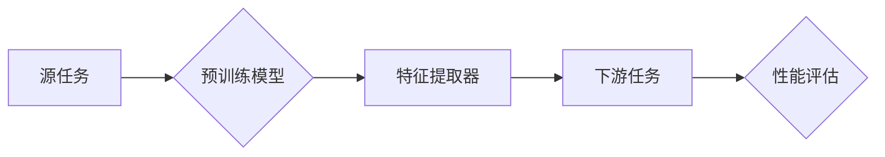

# 迁移学习Transfer Learning原理与代码实例讲解

> 关键词：迁移学习，预训练模型，迁移策略，特征提取，下游任务，多任务学习，元学习，少样本学习

## 1. 背景介绍

迁移学习（Transfer Learning）是机器学习领域的一项重要技术，它利用在不同任务中共享的特征来提高模型在特定任务上的性能。在大多数情况下，训练模型需要大量的标注数据，但获取高质量标注数据往往成本高昂且耗时。迁移学习通过将预训练模型的知识迁移到新的任务，有效地解决了这一问题。本文将深入探讨迁移学习的原理、策略、实现方法以及在实际应用中的实例讲解。

### 1.1 问题的由来

传统的机器学习模型通常需要针对每个任务从头开始训练，这要求大量标注数据。然而，在实际应用中，许多任务的数据量往往有限，难以满足模型训练的需求。此外，数据的收集、标注和清洗等前期准备工作也耗费了大量时间和资源。迁移学习正是为了解决这些问题而诞生的。

### 1.2 研究现状

迁移学习的研究已经取得了显著的进展，主要分为以下几个方向：

- **基于特征提取的迁移学习**：通过迁移预训练模型的特征提取器，将特征用于新的任务。
- **基于参数共享的迁移学习**：共享预训练模型的某些层，并针对新任务调整其余层。
- **基于微调的迁移学习**：在预训练模型的基础上进行微调，优化模型在特定任务上的参数。
- **基于元学习的迁移学习**：通过学习如何迁移知识来提高模型在新的任务上的迁移能力。

### 1.3 研究意义

迁移学习具有重要的研究意义和应用价值：

- **降低数据需求**：通过迁移预训练模型的知识，可以在少量数据上训练出高性能的模型。
- **节省计算资源**：利用预训练模型可以减少训练时间，降低计算成本。
- **提高模型泛化能力**：通过迁移学习，模型可以在多个任务上表现良好，提高泛化能力。

### 1.4 本文结构

本文将按照以下结构进行：

- **第2章**：介绍迁移学习的核心概念和联系。
- **第3章**：阐述迁移学习的核心算法原理和具体操作步骤。
- **第4章**：讲解迁移学习中的数学模型和公式，并通过实例进行说明。
- **第5章**：提供迁移学习的代码实例和详细解释。
- **第6章**：探讨迁移学习的实际应用场景和未来应用展望。
- **第7章**：推荐迁移学习相关的学习资源、开发工具和论文。
- **第8章**：总结迁移学习的研究成果、未来发展趋势和面临的挑战。
- **第9章**：提供常见问题的解答。

## 2. 核心概念与联系

### 2.1 核心概念

- **迁移学习（Transfer Learning）**：将一个任务（源任务）学习到的知识迁移到另一个相关任务（目标任务）上。
- **预训练模型（Pre-trained Model）**：在大量未标注数据上预先训练好的模型，通常具有强大的特征提取能力。
- **特征提取器（Feature Extractor）**：从数据中提取特征的部分，通常位于模型的底层。
- **下游任务（Downstream Task）**：需要使用迁移学习方法进行训练的任务。
- **元学习（Meta Learning）**：学习如何学习，即学习如何快速适应新任务。
- **少样本学习（Few-shot Learning）**：在非常少的样本上训练模型。

### 2.2 架构的 Mermaid 流程图



在上述流程图中，源任务通过预训练模型学习到特征提取器C，然后将这些特征用于下游任务的训练，并最终评估性能。

## 3. 核心算法原理 & 具体操作步骤

### 3.1 算法原理概述

迁移学习的核心思想是将源任务学习到的知识迁移到目标任务上。具体来说，可以从以下几个方面进行：

- **共享特征提取器**：在源任务和目标任务中使用相同的特征提取器，这样可以利用源任务学习到的通用特征。
- **参数共享**：在源任务和目标任务中共享某些层的参数，这样可以减少模型的参数量，提高训练效率。
- **微调**：在预训练模型的基础上进行微调，调整特定层的参数以适应目标任务。

### 3.2 算法步骤详解

迁移学习的一般步骤如下：

1. **选择预训练模型**：根据目标任务的特点选择合适的预训练模型。
2. **预训练模型特征提取**：将预训练模型转换为特征提取器。
3. **数据预处理**：对目标任务的数据进行预处理，包括数据清洗、归一化等。
4. **特征提取**：使用特征提取器对目标任务的数据进行特征提取。
5. **模型训练**：在提取的特征上训练模型，包括分类器、回归器等。
6. **性能评估**：评估模型在目标任务上的性能。

### 3.3 算法优缺点

#### 优点

- **降低数据需求**：在数据量有限的情况下，迁移学习可以显著提高模型的性能。
- **节省计算资源**：利用预训练模型可以减少训练时间和计算资源。
- **提高模型泛化能力**：通过迁移学习，模型可以在多个任务上表现良好。

#### 缺点

- **模型适应性**：预训练模型可能在某些任务上不适合。
- **特征提取能力**：预训练模型的特征提取器可能在某些任务上不够强大。

### 3.4 算法应用领域

迁移学习在许多领域都有广泛的应用，包括：

- **计算机视觉**：图像分类、目标检测、图像分割等。
- **自然语言处理**：文本分类、机器翻译、情感分析等。
- **语音识别**：语音识别、语音合成等。

## 4. 数学模型和公式 & 详细讲解 & 举例说明

### 4.1 数学模型构建

迁移学习的数学模型可以表示为：

$$
\theta_{target} = \theta_{source} + \Delta \theta_{target}
$$

其中，$\theta_{source}$ 表示源任务的模型参数，$\theta_{target}$ 表示目标任务的模型参数，$\Delta \theta_{target}$ 表示对目标任务的参数进行微调后的增量。

### 4.2 公式推导过程

假设源任务的损失函数为 $L_{source}(\theta_{source})$，目标任务的损失函数为 $L_{target}(\theta_{target})$，则迁移学习的目标是：

$$
\theta_{target} = \mathop{\arg\min}_{\theta_{target}} L_{target}(\theta_{target}) + \lambda L_{source}(\theta_{source})
$$

其中，$\lambda$ 是正则化系数，用于平衡源任务和目标任务的损失。

### 4.3 案例分析与讲解

以下是一个简单的图像分类任务的迁移学习实例：

1. **选择预训练模型**：使用VGG16作为预训练模型。
2. **特征提取**：将VGG16的输出作为特征提取器。
3. **模型训练**：在提取的特征上训练一个简单的全连接层作为分类器。
4. **性能评估**：评估模型在目标数据集上的分类性能。

## 5. 项目实践：代码实例和详细解释说明

### 5.1 开发环境搭建

为了进行迁移学习实践，我们需要以下开发环境：

- Python 3.6+
- PyTorch 1.6+
- torchvision 0.9+
- PIL

### 5.2 源代码详细实现

以下是一个简单的图像分类任务的迁移学习代码实例：

```python
import torch
import torchvision
import torchvision.transforms as transforms
from torch.utils.data import DataLoader
from torch import nn

# 加载预训练模型
model = torchvision.models.vgg16(pretrained=True)
num_ftrs = model.classifier[6].in_features
model.classifier[6] = nn.Linear(num_ftrs, num_classes)  # 修改最后一层为特定类别数

# 数据预处理
transform = transforms.Compose([
    transforms.Resize((224, 224)),
    transforms.ToTensor(),
])

train_dataset = torchvision.datasets.CIFAR10(root='./data', train=True, download=True, transform=transform)
train_loader = DataLoader(train_dataset, batch_size=4, shuffle=True)

# 训练模型
device = torch.device("cuda" if torch.cuda.is_available() else "cpu")
model = model.to(device)
criterion = nn.CrossEntropyLoss()
optimizer = torch.optim.SGD(model.parameters(), lr=0.001, momentum=0.9)

model.train()
for epoch in range(num_epochs):
    running_loss = 0.0
    for i, data in enumerate(train_loader, 0):
        inputs, labels = data
        inputs, labels = inputs.to(device), labels.to(device)

        optimizer.zero_grad()

        outputs = model(inputs)
        loss = criterion(outputs, labels)
        loss.backward()
        optimizer.step()

        running_loss += loss.item()
        if i % 2000 == 1999:    # 每2000个batch打印一次
            print(f'[{epoch + 1}, {i + 1:5d}] loss: {running_loss / 2000:.3f}')
            running_loss = 0.0

print('Finished Training')

# 评估模型
model.eval()
correct = 0
total = 0
with torch.no_grad():
    for data in test_loader:
        images, labels = data
        images, labels = images.to(device), labels.to(device)
        outputs = model(images)
        _, predicted = torch.max(outputs.data, 1)
        total += labels.size(0)
        correct += (predicted == labels).sum().item()

print(f'Accuracy of the network on the 10000 test images: {100 * correct // total}%')
```

### 5.3 代码解读与分析

上述代码首先加载了预训练的VGG16模型，并修改了最后一层以适应特定类别的数量。然后，对CIFAR-10数据集进行预处理，并使用DataLoader进行批次加载。接下来，使用SGD优化器和交叉熵损失函数对模型进行训练。最后，在测试集上评估模型的准确率。

### 5.4 运行结果展示

运行上述代码后，我们可以在控制台看到训练过程中的loss和准确率，最终输出模型在测试集上的准确率。

## 6. 实际应用场景

迁移学习在实际应用中具有广泛的应用场景，以下是一些例子：

- **医疗图像分析**：使用预训练的卷积神经网络对医学图像进行分类或检测，如癌症检测、病变检测等。
- **自动驾驶**：使用预训练的计算机视觉模型识别道路标志、行人、车辆等，辅助自动驾驶系统进行决策。
- **语音识别**：使用预训练的语音识别模型进行语音到文本的转换，如智能客服、语音助手等。

## 7. 工具和资源推荐

### 7.1 学习资源推荐

- **《深度学习》**：Goodfellow等著，详细介绍了深度学习的基本概念、原理和应用。
- **《Python深度学习》**：François Chollet等著，介绍了使用Python进行深度学习的实践方法。
- **《PyTorch深度学习》**：Eoin Odhubhain等著，介绍了使用PyTorch进行深度学习的实践方法。

### 7.2 开发工具推荐

- **PyTorch**：基于Python的开源深度学习框架，适合快速迭代研究。
- **TensorFlow**：由Google主导开发的开源深度学习框架，适合生产部署。
- **Keras**：一个高级神经网络API，可以与TensorFlow和Theano等后端结合使用。

### 7.3 相关论文推荐

- **《ImageNet Classification with Deep Convolutional Neural Networks》**：VGG16的原始论文。
- **《Very Deep Convolutional Networks for Large-Scale Image Recognition》**：VGG模型的改进版本。
- **《GoogLeNet: Going Deeper with Convolutions》**：GoogLeNet模型的论文。

## 8. 总结：未来发展趋势与挑战

### 8.1 研究成果总结

迁移学习作为一种重要的机器学习技术，在多个领域取得了显著的成果。通过迁移学习，我们可以利用预训练模型的知识来提高模型在特定任务上的性能，从而降低数据需求和计算资源。

### 8.2 未来发展趋势

未来，迁移学习的发展趋势包括：

- **更强大的预训练模型**：随着计算能力的提升，预训练模型的规模和复杂性将不断提高。
- **更有效的迁移策略**：开发更有效的迁移策略，以提高模型在目标任务上的迁移能力。
- **多模态迁移学习**：将迁移学习扩展到多模态数据，如图像、文本、语音等。

### 8.3 面临的挑战

迁移学习面临的挑战包括：

- **数据分布差异**：源任务和目标任务的数据分布可能存在差异，导致迁移效果不佳。
- **模型适应性**：预训练模型可能在某些任务上不适合。
- **可解释性**：迁移学习模型的决策过程通常缺乏可解释性。

### 8.4 研究展望

未来，迁移学习的研究需要关注以下方面：

- **开发更有效的迁移策略**：针对不同类型的数据和任务，开发更有效的迁移策略。
- **提高模型适应性**：提高模型在数据分布差异较大的任务上的适应性。
- **增强可解释性**：提高迁移学习模型的可解释性，增强用户对模型的信任。

## 9. 附录：常见问题与解答

### 9.1 常见问题

- **Q1：迁移学习适用于所有任务吗？**
  A1：迁移学习适用于大多数任务，但在某些特定领域可能效果不佳。

- **Q2：如何选择预训练模型？**
  A2：选择预训练模型时需要考虑任务类型、数据规模和计算资源等因素。

- **Q3：迁移学习是否可以提高模型的泛化能力？**
  A3：迁移学习可以提高模型的泛化能力，尤其是在数据量有限的情况下。

### 9.2 解答

- **Q1：迁移学习适用于所有任务吗？**
  迁移学习适用于大多数任务，但在某些特定领域可能效果不佳。例如，对于需要高度专业知识的任务，如医学图像分析，迁移学习可能不如从头开始训练的模型效果好。

- **Q2：如何选择预训练模型？**
  选择预训练模型时需要考虑任务类型、数据规模和计算资源等因素。例如，对于图像分类任务，可以使用VGG16、ResNet等预训练模型；对于文本分类任务，可以使用BERT、GPT等预训练模型。

- **Q3：迁移学习是否可以提高模型的泛化能力？**
  迁移学习可以提高模型的泛化能力，尤其是在数据量有限的情况下。通过迁移学习，模型可以学习到更通用的特征表示，从而提高在目标任务上的泛化能力。

作者：禅与计算机程序设计艺术 / Zen and the Art of Computer Programming