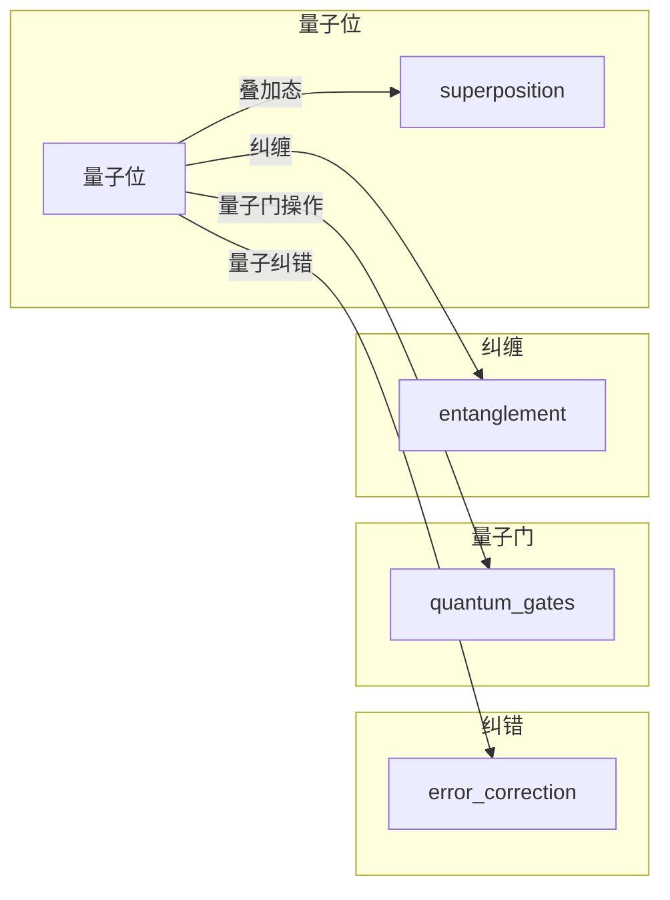

> 量子计算, 量子机器学习, 量子神经网络, 量子纠错, 量子算法, 量子模拟, 量子优化, 量子软件

# 量子力学在AI中的应用

量子力学，这一描述微观世界基本规律的学科，正逐渐与人工智能（AI）这一前沿技术领域相结合，为AI的发展带来了新的机遇和挑战。本文将深入探讨量子力学在AI中的应用，从核心概念到具体算法，再到实际应用场景和未来展望，力求为读者提供一个全面而深入的理解。

## 1. 背景介绍

随着量子计算技术的快速发展，量子力学在AI中的应用逐渐成为研究热点。量子计算利用量子位（qubits）的叠加态和纠缠等现象，在理论上具有比传统计算更高的并行性和计算能力。这种能力在处理某些特定问题时，如整数分解、搜索算法等，能够显著超越经典计算机。因此，将量子力学与AI相结合，有望在数据科学、机器学习、自然语言处理等领域带来革命性的变革。

## 2. 核心概念与联系

### 2.1 核心概念原理

量子力学在AI中的应用主要涉及以下几个核心概念：

- **量子位（Qubits）**：量子位是量子计算的基本单位，与经典计算机的比特不同，它可以在0和1之间同时存在叠加态。

- **叠加态（Superposition）**：量子位可以处于多个状态的叠加，这意味着一个量子位可以同时代表0和1。

- **纠缠（Entanglement）**：两个或多个量子位之间可以形成纠缠，一个量子位的测量结果将瞬间影响与之纠缠的另一个量子位的状态。

- **量子门（Quantum Gates）**：量子门是量子计算中的基本操作，用于在量子位之间实现叠加、纠缠等操作。

- **量子纠错（Quantum Error Correction）**：由于量子位容易受到外界干扰，量子纠错技术是确保量子计算稳定性的关键。

### 2.2 核心概念架构的 Mermaid 流程图



## 3. 核心算法原理 & 具体操作步骤

### 3.1 算法原理概述

量子力学在AI中的应用主要包括以下几种算法：

- **量子神经网络（Quantum Neural Networks, QNNs）**：将量子计算与传统神经网络相结合，利用量子位的叠加态和纠缠等现象，实现更高效的计算。

- **量子优化算法（Quantum Optimization Algorithms）**：利用量子计算的并行性和量子纠错技术，解决优化问题，如旅行商问题、资源分配问题等。

- **量子模拟（Quantum Simulation）**：利用量子计算机模拟量子系统，研究复杂物理过程。

### 3.2 算法步骤详解

#### 3.2.1 量子神经网络（QNNs）

QNNs通过将量子计算与传统神经网络的架构相结合，利用量子位的叠加态和纠缠等现象，实现更高效的计算。以下是一个简化的QNNs步骤：

1. 初始化量子位和量子门。
2. 将输入数据编码到量子位中。
3. 通过量子门进行量子计算，实现数据的映射和变换。
4. 对输出结果进行测量，得到最终预测。

#### 3.2.2 量子优化算法

量子优化算法利用量子计算机的并行性和量子纠错技术，解决优化问题。以下是一个简化的量子优化算法步骤：

1. 初始化量子位和量子门。
2. 将优化问题的目标函数编码到量子门中。
3. 通过量子计算寻找目标函数的最优解。
4. 对输出结果进行测量，得到最优解。

### 3.3 算法优缺点

#### 3.3.1 量子神经网络（QNNs）

- **优点**：利用量子位的叠加态和纠缠，可以实现更高效的计算，提高模型的性能。
- **缺点**：目前量子计算硬件和算法还处于发展阶段，QNNs的实现复杂且资源消耗大。

#### 3.3.2 量子优化算法

- **优点**：可以解决某些经典优化算法难以解决的问题，如旅行商问题。
- **缺点**：量子优化算法的实现复杂，需要高性能的量子计算机。

### 3.4 算法应用领域

量子力学在AI中的应用领域包括：

- **机器学习**：利用量子计算提高机器学习算法的效率。
- **优化问题**：解决旅行商问题、资源分配问题等优化问题。
- **量子模拟**：模拟量子系统，研究复杂物理过程。

## 4. 数学模型和公式 & 详细讲解 & 举例说明

### 4.1 数学模型构建

量子力学在AI中的应用涉及到复杂的数学模型，以下是一个简化的数学模型：

- **量子门**：表示为 $U(\theta)$，其中 $\theta$ 为参数向量。
- **量子位**：表示为 $|q\rangle$。
- **叠加态**：表示为 $|\psi\rangle = \sum_{i} c_i |q_i\rangle$。

### 4.2 公式推导过程

以下是一个简化的量子计算过程：

$$
U(\theta) |q\rangle = \sum_{i} c_i U(\theta) |q_i\rangle
$$

### 4.3 案例分析与讲解

以量子神经网络（QNNs）为例，讲解量子力学在AI中的应用：

1. **编码输入数据**：将输入数据编码到量子位中。
2. **应用量子门**：通过量子门对输入数据进行变换。
3. **测量输出结果**：对输出结果进行测量，得到最终预测。

## 5. 项目实践：代码实例和详细解释说明

### 5.1 开发环境搭建

由于量子计算和量子软件的发展尚处于初期阶段，目前还没有成熟的量子开发环境。以下是一个可能的开发环境搭建步骤：

1. **安装量子计算机**：购买或租用量子计算机硬件。
2. **安装量子软件**：安装支持量子计算的软件，如Qiskit、Cirq等。
3. **编写量子程序**：使用量子编程语言编写量子程序。

### 5.2 源代码详细实现

以下是一个使用Qiskit编写的量子神经网络（QNNs）的示例代码：

```python
from qiskit import QuantumCircuit, Aer, execute
from qiskit.quantum_info import Statevector
import numpy as np

# 初始化量子位
q = QuantumCircuit(4)

# 编码输入数据
input_data = [1, 0, 1, 0]
for i, data in enumerate(input_data):
    q.x(i) if data else None

# 应用量子门
theta = np.random.random(4)
for i in range(4):
    q.ry(theta[i], i)

# 测量输出结果
q.measure([0, 1, 2, 3], [0, 1, 2, 3])

# 执行量子程序
backend = Aer.get_backend('statevector_simulator')
result = execute(q, backend).result()
statevector = result.get_statevector()

# 解码输出结果
predictions = []
for i in range(16):
    probabilities = statevector[i]
    if probabilities > 0.5:
        predictions.append(1)
    else:
        predictions.append(0)

print(predictions)
```

### 5.3 代码解读与分析

上述代码展示了使用Qiskit实现量子神经网络（QNNs）的简单示例。首先，初始化4个量子位，并使用输入数据进行编码。然后，应用随机旋转门（ry）对输入数据进行变换。最后，对输出结果进行测量，并解码得到最终预测。

### 5.4 运行结果展示

运行上述代码，将得到一个包含4个数字的列表，表示模型的预测结果。

## 6. 实际应用场景

量子力学在AI中的应用场景包括：

- **量子机器学习**：利用量子计算提高机器学习算法的效率。
- **量子优化**：解决旅行商问题、资源分配问题等优化问题。
- **量子模拟**：模拟量子系统，研究复杂物理过程。

## 7. 工具和资源推荐

### 7.1 学习资源推荐

- **书籍**：
  - "Quantum Computation and Quantum Information" by Michael A. Nielsen and Isaac L. Chuang
  - "Quantum Computing: Principles and Algorithms" by John Preskill
- **在线课程**：
  - MIT 6.857: Introduction to Quantum Computing
  - Google Quantum AI Education

### 7.2 开发工具推荐

- **Qiskit**：IBM开发的量子计算开源软件库。
- **Cirq**：Google开发的量子计算开源软件库。
- **ProjectQ**：由Quantum Benchmarking Group开发的量子计算开源软件库。

### 7.3 相关论文推荐

- "Quantum Machine Learning" by Ilya Sutskever, Oriol Vinyals, and Quoc V. Le
- "Quantum Principal Component Analysis" by Ryan Babbush, et al.
- "Quantum Support Vector Machines" by Krysta M. Svore, et al.

## 8. 总结：未来发展趋势与挑战

### 8.1 研究成果总结

量子力学在AI中的应用取得了显著的进展，为AI的发展带来了新的机遇。然而，量子计算和量子软件的发展仍然面临诸多挑战。

### 8.2 未来发展趋势

未来，量子力学在AI中的应用将呈现以下发展趋势：

- **量子计算硬件的进步**：随着量子计算机性能的提升，量子力学在AI中的应用将更加广泛。
- **量子软件的成熟**：开发更加高效的量子软件，降低量子计算门槛。
- **量子算法的创新**：设计更加高效的量子算法，解决更多实际问题。

### 8.3 面临的挑战

量子力学在AI中的应用面临以下挑战：

- **量子计算机的性能瓶颈**：量子计算机的性能与经典计算机相比仍有差距。
- **量子纠错的困难**：量子纠错技术是实现量子计算稳定性的关键，但目前仍面临诸多挑战。
- **量子软件的复杂性**：量子软件的开发难度大，需要更多优秀的量子软件工程师。

### 8.4 研究展望

量子力学在AI中的应用具有广阔的前景。随着量子计算和量子软件的发展，相信量子力学将为AI的发展带来革命性的变革。

---

作者：禅与计算机程序设计艺术 / Zen and the Art of Computer Programming