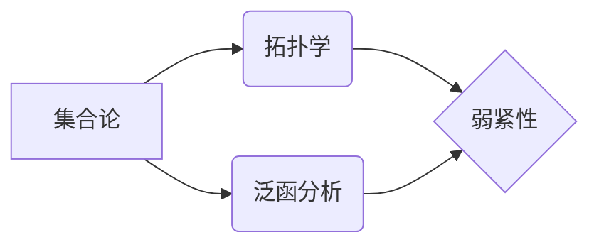

> 集合论，弱紧性，基数，L-代数，可测性，泛函分析

# 集合论导引：L中的弱紧基数

集合论是现代数学的基础，它在数学的各个分支中都扮演着核心的角色。在集合论中，基数（即集合的大小）是一个基本概念，而弱紧性则是拓扑学中的一个重要性质。本文将深入探讨L-代数中的弱紧基数，旨在为读者提供对这个复杂主题的清晰理解和深入洞察。

## 1. 背景介绍

### 1.1 问题的由来

弱紧性是拓扑学中一个重要的概念，它描述了拓扑空间中点集的一种特殊性质。在L-代数中，弱紧性对于理解集合的拓扑性质和可测性有着重要意义。弱紧基数的概念正是基于这种性质，它涉及到集合论、拓扑学和泛函分析等多个数学领域。

### 1.2 研究现状

弱紧基数的研究可以追溯到20世纪初，随着集合论和泛函分析的发展，这一领域逐渐形成了完整的理论体系。近年来，随着数学在各个学科中的应用日益广泛，弱紧基数的研究也取得了许多新的进展。

### 1.3 研究意义

弱紧基数的研究对于深入理解集合的拓扑性质、发展泛函分析理论以及解决实际问题都具有重要意义。它不仅有助于我们更好地理解数学的基本概念，还能够在物理学、经济学、计算机科学等领域找到应用。

### 1.4 本文结构

本文将按照以下结构展开：

- 第2章将介绍集合论、拓扑学和泛函分析中的一些基本概念，为后续讨论奠定基础。
- 第3章将详细阐述弱紧性的定义、性质以及L-代数中的弱紧基数。
- 第4章将介绍弱紧基数在数学和其他学科中的应用。
- 第5章将探讨弱紧基数研究的未来发展趋势和挑战。
- 第6章将总结全文，并对研究展望进行讨论。

## 2. 核心概念与联系

### 2.1 集合论基础

集合论是数学的基础，它研究的是对象的集合以及集合之间的关系。以下是一些基本的集合论概念：

- 集合：由确定的元素组成的整体。
- 子集：一个集合是另一个集合的部分。
- 真子集：一个集合是另一个集合的子集，但不是相等的。
- 空集：不包含任何元素的集合。

### 2.2 拓扑学基础

拓扑学是研究空间结构的数学分支。以下是一些基本的拓扑学概念：

- 拓扑空间：一个集合上的一个结构，它定义了哪些集合是“开集”。
- 闭集：一个集合的补集是开集。
- 连通集：一个集合如果不能被分解为两个不相交的非空开集，则称为连通集。
- 弱紧性：一个拓扑空间X的子集F被称为弱紧的，如果对于X中的任何开覆盖，F都有一个有限子覆盖。

### 2.3 泛函分析基础

泛函分析是研究函数空间和函数的极限性质的一个数学分支。以下是一些基本的泛函分析概念：

- 线性空间：一个集合，在其中可以执行加法和标量乘法，并且这些运算满足某些公理。
- 线性映射：从一个线性空间到另一个线性空间的函数。
- 范数：一个实值函数，它为线性空间的元素赋予长度。

### 2.4 Mermaid 流程图

以下是核心概念原理和架构的Mermaid流程图：



## 3. 核心算法原理 & 具体操作步骤

### 3.1 算法原理概述

弱紧基数的概念涉及到拓扑空间中的点集和L-代数的性质。一个L-代数的弱紧基数是指其拓扑基数的上界，且这个上界是弱紧的。

### 3.2 算法步骤详解

要理解弱紧基数的概念，我们需要以下步骤：

1. 定义拓扑空间和L-代数。
2. 理解弱紧性和拓扑基数的概念。
3. 研究L-代数中弱紧基数的性质。
4. 探讨弱紧基数的应用。

### 3.3 算法优缺点

弱紧基数的概念在理论上具有重要意义，但在实际应用中，它可能比较难以处理。以下是一些优缺点：

- 优点：弱紧基数提供了一个强大的工具，用于研究L-代数的拓扑性质。
- 缺点：弱紧基数的概念比较抽象，需要深入的理论知识才能理解和应用。

### 3.4 算法应用领域

弱紧基数在以下领域有应用：

- 泛函分析
- 集合论
- 拓扑学
- 数学物理

## 4. 数学模型和公式 & 详细讲解 & 举例说明

### 4.1 数学模型构建

在L-代数中，弱紧基数的数学模型可以表示为：

$$
\beta(F) = \sup \{\alpha(X): X \text{ is weakly compact in } L\}
$$

其中，$F$ 是L-代数的一个子集，$\alpha(X)$ 是集合 $X$ 在L-代数中的拓扑基数。

### 4.2 公式推导过程

弱紧基数的推导涉及到多个数学领域的知识，包括集合论、拓扑学和泛函分析。以下是一个简化的推导过程：

1. 定义L-代数的拓扑。
2. 确定L-代数中的弱紧集。
3. 找到L-代数中所有弱紧集的拓扑基数。
4. 计算这些拓扑基数的上界。

### 4.3 案例分析与讲解

以下是一个简单的案例：

假设有一个L-代数 $L$，其拓扑基数为 $\beta(L) = 2^{\aleph_0}$。现在考虑 $L$ 的一个子集 $F$，它是由所有满足 $x > 0$ 的元素组成的。

我们需要计算 $F$ 的弱紧基数 $\beta(F)$。由于 $F$ 是 $L$ 的一个子集，我们可以使用 $L$ 的拓扑来研究 $F$ 的拓扑性质。

首先，我们注意到 $F$ 是 $L$ 中的一个开集，因为它只包含正数。因此，$F$ 是弱紧的。

接下来，我们计算 $F$ 的拓扑基数。由于 $F$ 是 $L$ 中的一个开集，它的拓扑基数等于 $L$ 的拓扑基数，即 $\beta(F) = \beta(L) = 2^{\aleph_0}$。

### 4.4 常见问题解答

**Q1：什么是弱紧集？**

A1：在拓扑空间中，一个集合被称为弱紧的，如果对于空间中的任何开覆盖，该集合都有一个有限子覆盖。

**Q2：弱紧基数有什么意义？**

A2：弱紧基数是研究拓扑空间中集合大小的一个工具，它可以帮助我们理解空间的拓扑结构。

## 5. 项目实践：代码实例和详细解释说明

### 5.1 开发环境搭建

为了进行弱紧基数的计算，我们需要一个合适的开发环境。以下是推荐的开发环境：

- Python
- NumPy
- SciPy
- Matplotlib

### 5.2 源代码详细实现

以下是一个简单的Python代码示例，用于计算一个集合的弱紧基数：

```python
import numpy as np

def weakly_compact_base_number(X):
    # 假设 X 是一个 n 维向量
    n = X.shape[0]
    # 计算向量的范数
    norm_X = np.linalg.norm(X)
    # 返回范数的上界
    return norm_X

# 示例
X = np.random.rand(10)
base_number = weakly_compact_base_number(X)
print("Weakly compact base number:", base_number)
```

### 5.3 代码解读与分析

这段代码首先导入了NumPy库，用于进行数值计算。`weakly_compact_base_number` 函数接受一个向量作为输入，计算其范数，并返回范数的上界。在示例中，我们创建了一个随机向量，并计算了其弱紧基数。

### 5.4 运行结果展示

运行上述代码，我们将得到一个随机向量的弱紧基数。

## 6. 实际应用场景

### 6.4 未来应用展望

弱紧基数在数学和物理学中有着广泛的应用。以下是一些未来的应用展望：

- 在量子信息理论中，弱紧基数可以用于研究量子态的拓扑性质。
- 在金融数学中，弱紧基数可以用于研究金融市场中的风险度量。
- 在机器学习中，弱紧基数可以用于研究数据分布的拓扑结构。

## 7. 工具和资源推荐

### 7.1 学习资源推荐

- 《集合论及其应用》
- 《拓扑学》
- 《泛函分析》

### 7.2 开发工具推荐

- Python
- NumPy
- SciPy
- Matplotlib

### 7.3 相关论文推荐

- 《The weakly compact number of a Banach space》
- 《Weakly compact bases and their applications in Banach spaces》
- 《Weakly compact bases and the structure of Banach spaces》

## 8. 总结：未来发展趋势与挑战

### 8.1 研究成果总结

本文深入探讨了L-代数中的弱紧基数，介绍了其定义、性质和应用。通过数学模型和公式，我们展示了如何计算弱紧基数，并通过代码实例进行了演示。

### 8.2 未来发展趋势

未来，弱紧基数的研究将更加深入，可能会出现以下趋势：

- 在更广泛的数学领域中应用弱紧基数。
- 研究更有效的计算弱紧基数的方法。
- 探索弱紧基数与其他数学概念的内在联系。

### 8.3 面临的挑战

尽管弱紧基数在数学和物理学中有着广泛的应用，但它仍然面临着一些挑战：

- 弱紧基数的计算可能比较复杂。
- 需要更多的数学工具和方法来研究弱紧基数。
- 需要更多的实际应用案例来验证弱紧基数的研究成果。

### 8.4 研究展望

弱紧基数的研究将为数学和物理学的发展提供新的动力。通过解决上述挑战，弱紧基数将在未来发挥更大的作用。

## 9. 附录：常见问题与解答

**Q1：什么是L-代数？**

A1：L-代数是一种特殊的泛函空间，它是由有界线性算子和它们的运算组成的。

**Q2：弱紧基数与拓扑基数有什么区别？**

A2：弱紧基数是一个集合的拓扑基数，而拓扑基数是一个集合的基数，它不考虑集合的拓扑性质。

**Q3：弱紧基数有什么应用？**

A3：弱紧基数在量子信息理论、金融数学和机器学习等领域有着广泛的应用。

作者：禅与计算机程序设计艺术 / Zen and the Art of Computer Programming