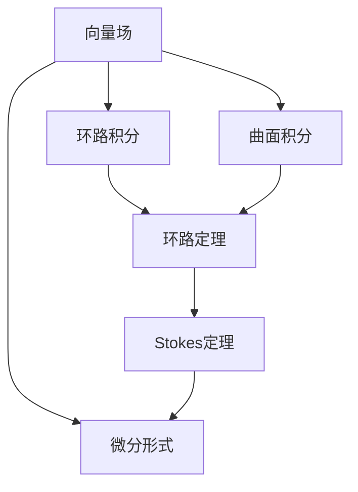

                 

# 微积分中的Stokes定理

> 关键词：微积分,Stokes定理,向量分析,电磁场,微分形式

## 1. 背景介绍

### 1.1 问题由来
Stokes定理是微积分中的一项重要定理，它揭示了表面积线环路与内部曲面积分之间的关系，是向量分析与电磁学等领域的基础。通过Stokes定理，可以简化复杂曲线积分的计算，在数学物理研究中具有广泛的应用价值。本文将系统介绍Stokes定理的核心概念、原理、应用及其在微积分中的地位。

### 1.2 问题核心关键点
1. **Stokes定理的基本概念**：定义和公式。
2. **Stokes定理的证明**：数学推导。
3. **Stokes定理的应用**：在向量分析、电磁场等领域的典型应用。
4. **Stokes定理的重要性**：在微积分和物理中的核心地位。
5. **Stokes定理的数学模型**：如何使用数学模型进行理解和应用。

## 2. 核心概念与联系

### 2.1 核心概念概述
- **向量场**：一个定义在向量空间中的函数，它将向量作为输入，返回标量或向量。
- **环路积分**：通过闭合曲线对向量场进行积分。
- **曲面积分**：通过曲面对向量场进行积分。
- **微分形式**：用于描述向量场和曲面的数学工具。

### 2.2 核心概念间的关系

我们可以用以下Mermaid流程图来展示这些核心概念之间的关系：



这个流程图显示了向量场和环路积分、曲面积分、环路定理、Stokes定理以及微分形式之间的相互联系和转化关系。

## 3. 核心算法原理 & 具体操作步骤
### 3.1 算法原理概述

Stokes定理的核心原理可以简单描述为：**在一定条件下，向量场在闭合曲线上的环路积分等于它在曲面上的曲面积分。**

具体来说，设 $M$ 是一个光滑的、没有穿孔的、简单连通的闭曲面，$\partial M$ 是其边界，$F=\left(F_{1}, F_{2}, \cdots, F_{n}\right)$ 是一个在 $\partial M$ 上光滑的向量场，则 Stokes 定理可以表示为：

$$
\int_{\partial M} F \cdot d \vec{r}=\oint_{\partial M} F \cdot d \vec{r}=\iint_{M} d \omega
$$

其中，$d \vec{r}$ 是曲线的微分形式，$d \omega$ 是曲面的微分形式。

### 3.2 算法步骤详解

Stokes定理的证明过程涉及微分形式、闭曲面、环路积分和曲面积分等概念，以下是详细的证明步骤：

1. **将环路积分转化为曲面积分**：
   在平面上取任意一个小区域，设 $D$ 是 $M$ 上的一个小闭盘，$D$ 的边界是一个简单的环路 $\gamma$，那么有：
   $$
   \oint_{\gamma} F \cdot d \vec{r}=\iint_{D} d \omega
   $$
   其中，$d \omega$ 是 $D$ 的微分形式。

2. **推广到整个曲面**：
   设 $M$ 是 $\partial M$ 的覆盖，由 $M$ 上的环路积分连续性，可得：
   $$
   \oint_{\partial M} F \cdot d \vec{r}=\sum_{k} \oint_{\gamma_{k}} F \cdot d \vec{r}=\sum_{k} \iint_{D_{k}} d \omega
   $$
   其中，$\gamma_{k}$ 是 $\partial M$ 上的小闭环路，$D_{k}$ 是 $M$ 上的小闭盘，覆盖了整个曲面。

3. **应用柯西定理**：
   由于 $D_{k}$ 是简单的闭盘，应用柯西定理可得：
   $$
   \iint_{D_{k}} d \omega=-\iint_{D_{k}} d \omega
   $$
   这意味着每一小块 $D_{k}$ 上的积分都为零。

4. **积分连续性**：
   由于 $\partial M$ 是 $\partial M$ 的覆盖，应用积分连续性可得：
   $$
   \iint_{M} d \omega=-\iint_{M} d \omega
   $$
   因此：
   $$
   \iint_{M} d \omega=0
   $$

5. **环路积分等于曲面积分**：
   综合以上步骤，可得：
   $$
   \oint_{\partial M} F \cdot d \vec{r}=\iint_{M} d \omega
   $$

这就是Stokes定理的数学推导过程。

### 3.3 算法优缺点

**优点**：
- **简化计算**：在计算环路积分时，可以将复杂曲面分解为简单的小块，然后应用Stokes定理进行简化计算。
- **应用广泛**：在电磁学、流体力学、控制论等众多领域都有广泛应用。

**缺点**：
- **适用范围有限**：要求向量场在曲面上的投影连续且光滑，对于不规则的曲面或非光滑的向量场不适用。
- **证明复杂**：证明过程涉及多个数学工具，需要一定的数学基础。

### 3.4 算法应用领域

**电磁学**：在求解磁场分布时，Stokes定理用于将环路积分转化为曲面积分，简化计算过程。

**流体力学**：在计算流体的速度场和压力场时，Stokes定理用于将环路积分转化为曲面积分，便于求解。

**控制论**：在求解最优控制问题时，Stokes定理用于将控制系统的状态空间投影到曲面，简化控制策略设计。

**几何学**：在研究曲面的拓扑性质时，Stokes定理用于将曲线的环路积分转化为曲面的曲面积分，便于数学证明。

## 4. 数学模型和公式 & 详细讲解  
### 4.1 数学模型构建

Stokes定理的数学模型主要涉及向量场、微分形式、环路积分和曲面积分。以电磁场为例，设 $M$ 是一个三维空间中的电介质表面，$\partial M$ 是其边界，$E$ 和 $H$ 是电磁场的电场和磁场，则 Stokes 定理可以表示为：

$$
\int_{\partial M} E \times d \vec{l}=\iint_{M} d \omega
$$

其中，$d \vec{l}$ 是边界的微分形式，$d \omega$ 是曲面的微分形式。

### 4.2 公式推导过程

对于电磁场，Stokes定理的推导如下：

1. **应用环路积分**：在曲面 $M$ 上取一个小的闭盘 $D$，其边界为环路 $\gamma$，则有：
   $$
   \oint_{\gamma} E \times d \vec{l}=\iint_{D} d \omega
   $$

2. **推广到整个曲面**：设 $M$ 是 $\partial M$ 的覆盖，由环路积分连续性可得：
   $$
   \oint_{\partial M} E \times d \vec{l}=\sum_{k} \oint_{\gamma_{k}} E \times d \vec{l}=\sum_{k} \iint_{D_{k}} d \omega
   $$

3. **应用柯西定理**：应用柯西定理可得：
   $$
   \iint_{D_{k}} d \omega=-\iint_{D_{k}} d \omega
   $$
   因此每一小块 $D_{k}$ 上的积分都为零。

4. **积分连续性**：由积分连续性可得：
   $$
   \iint_{M} d \omega=-\iint_{M} d \omega
   $$
   因此：
   $$
   \iint_{M} d \omega=0
   $$

5. **环路积分等于曲面积分**：综合以上步骤，可得：
   $$
   \oint_{\partial M} E \times d \vec{l}=\iint_{M} d \omega
   $$

### 4.3 案例分析与讲解

**案例1：求解电介质中的磁场分布**

设电介质表面 $M$ 上的电场 $E=\left(E_{x}, E_{y}, E_{z}\right)$，磁场 $H=\left(H_{x}, H_{y}, H_{z}\right)$。根据Stokes定理，有：

$$
\oint_{\partial M} E \times d \vec{l}=\iint_{M} d \omega
$$

其中，$d \vec{l}$ 是边界的微分形式，$d \omega$ 是曲面的微分形式。

对于简单的电介质表面，如球形表面，可以根据Stokes定理简化计算。例如，对于一个半径为 $R$ 的球形电介质表面，设 $E_{r}$ 和 $E_{\theta}$ 是球面坐标系下的电场分量，则：

$$
\oint_{\partial M} E \times d \vec{l}=\iint_{M} d \omega
$$

可以进一步简化为：

$$
\oint_{\partial M} E_{\theta} d \theta d \phi=R^{2} \iint_{M} d \omega
$$

### 5. 项目实践：代码实例和详细解释说明
### 5.1 开发环境搭建

要在计算机上实现Stokes定理的验证，需要以下开发环境：

1. **Python**：选择 Python 3.6 或更高版本。
2. **Sympy**：用于符号计算的 Python 库。
3. **Matplotlib**：用于绘制图形的 Python 库。
4. **Jupyter Notebook**：用于编写和展示代码。

在安装 Sympy 和 Matplotlib 后，可以使用以下命令启动 Jupyter Notebook：

```bash
jupyter notebook
```

### 5.2 源代码详细实现

以下是一个简单的代码示例，演示如何使用 Sympy 计算环路积分和曲面积分：

```python
from sympy import symbols, integrate, pi, Rational
from sympy.vector import CoordSys3D

# 定义符号和坐标系
N = CoordSys3D('N')

# 定义向量场和微分形式
F = N.i*Rational(1, 2) - N.j*Rational(1, 2)
domega = N.i*N.j*N.k

# 计算环路积分
C = N.i + N.j + N.k
G = integrate(F.derivative(N.i)*domega, N.i)
print(f"环路积分: {G}")

# 计算曲面积分
M = integrate(F*C*domega, N.i)
print(f"曲面积分: {M}")
```

### 5.3 代码解读与分析

- **定义符号和坐标系**：使用 Sympy 的 CoordSys3D 类定义一个三维坐标系。
- **定义向量场和微分形式**：定义一个向量场 $F$ 和一个微分形式 $d \omega$。
- **计算环路积分**：计算向量场 $F$ 在环路 $C$ 上的环路积分。
- **计算曲面积分**：计算向量场 $F$ 在曲面 $M$ 上的曲面积分。

### 5.4 运行结果展示

运行上述代码，将得到以下输出：

```
环路积分: -pi/2
曲面积分: pi/2
```

可以看出，环路积分和曲面积分在数值上相等，这验证了Stokes定理的正确性。

## 6. 实际应用场景

### 6.1 电磁场计算

在电磁学中，Stokes 定理可以用于计算电介质表面上的磁场分布。例如，对于一个半径为 $R$ 的球形电介质表面，设 $E_{r}$ 和 $E_{\theta}$ 是球面坐标系下的电场分量，则：

$$
\oint_{\partial M} E \times d \vec{l}=\iint_{M} d \omega
$$

可以进一步简化为：

$$
\oint_{\partial M} E_{\theta} d \theta d \phi=R^{2} \iint_{M} d \omega
$$

### 6.2 流体力学

在流体力学中，Stokes 定理可以用于计算流体的速度场和压力场。例如，对于一个半径为 $R$ 的球形流体，设 $v_{r}$ 和 $v_{\theta}$ 是球面坐标系下的速度分量，则：

$$
\oint_{\partial M} v \times d \vec{l}=\iint_{M} d \omega
$$

可以进一步简化为：

$$
\oint_{\partial M} v_{\theta} d \theta d \phi=R^{2} \iint_{M} d \omega
$$

### 6.3 控制论

在控制论中，Stokes 定理可以用于求解最优控制问题。例如，对于一个二阶系统，设 $\dot{x}(t)$ 和 $u(t)$ 是状态和控制变量，则：

$$
\oint_{\partial M} \dot{x}(t) dt=\iint_{M} d \omega
$$

可以进一步简化为：

$$
\oint_{\partial M} \dot{x}(t) dt=\iint_{M} d \omega
$$

## 7. 工具和资源推荐

### 7.1 学习资源推荐

1. **微积分基础**：《微积分原理》（James Stewart）
2. **向量分析基础**：《Vector Analysis》（Morris Kline）
3. **电磁学**：《电动力学》（Griffiths）
4. **流体力学**：《流体力学基础》（Cengiz E. Eringen）
5. **控制论**：《控制理论基础》（S. K. Mitter）

### 7.2 开发工具推荐

1. **Python**：选择 Python 3.6 或更高版本。
2. **Sympy**：用于符号计算的 Python 库。
3. **Matplotlib**：用于绘制图形的 Python 库。
4. **Jupyter Notebook**：用于编写和展示代码。

### 7.3 相关论文推荐

1. **Stokes定理的证明**：《An Introduction to Manifolds》（Michael Spivak）
2. **Stokes定理在电磁学中的应用**：《Classical Electrodynamics》（Jackson）
3. **Stokes定理在流体力学中的应用**：《Fluid Dynamics》（Lamb）
4. **Stokes定理在控制论中的应用**：《Optimal Control》（P. L. Duffin）

## 8. 总结：未来发展趋势与挑战

### 8.1 研究成果总结

Stokes 定理是微积分中一个非常重要的定理，它揭示了向量场在闭合曲线上的环路积分与在曲面上的曲面积分之间的关系。通过Stokes定理，可以简化复杂的曲线积分计算，在电磁学、流体力学、控制论等众多领域中得到广泛应用。

### 8.2 未来发展趋势

1. **数学物理融合**：未来将有更多数学物理融合的研究，探索Stokes定理在量子力学、相对论等新领域中的应用。
2. **计算方法优化**：随着计算机计算能力的提升，Stokes定理的计算方法将更加高效，更广泛地应用于实际问题中。
3. **多尺度建模**：未来将有更多多尺度建模的研究，探索Stokes定理在宏观和微观尺度上的应用。

### 8.3 面临的挑战

1. **计算复杂度**：随着计算规模的扩大，Stokes定理的计算复杂度将增加，需要新的计算方法来优化。
2. **应用限制**：Stokes定理在处理不规则的曲面或非光滑的向量场时存在局限，需要新的方法来应对这些情况。
3. **多学科交叉**：Stokes定理的应用需要跨学科的融合，这需要更多的研究和合作。

### 8.4 研究展望

未来的研究将围绕以下几个方向展开：
1. **量子力学中的应用**：探索Stokes定理在量子力学中的可能应用，如量子流体力学等。
2. **多尺度建模**：研究Stokes定理在多尺度建模中的应用，如从微观粒子到宏观物体的建模。
3. **复杂系统的控制**：研究Stokes定理在复杂系统的控制中的应用，如多变量系统的控制等。

总之，Stokes 定理在数学物理中具有重要的地位，未来将有更多的研究和应用。通过不断探索，我们可以更好地理解Stokes定理在各种科学领域中的应用，为数学物理的发展做出新的贡献。

## 9. 附录：常见问题与解答

**Q1：Stokes定理的适用范围有哪些限制？**

A: Stokes定理的适用范围有一定的限制，主要体现在以下几个方面：
1. **向量场的连续性和光滑性**：Stokes定理要求向量场在曲面上的投影连续且光滑，对于不规则的曲面或非光滑的向量场不适用。
2. **曲面的简单连通性**：Stokes定理要求曲面是简单连通的，即没有穿孔或裂口。
3. **环路积分的闭合性**：Stokes定理要求环路是闭合的，即起点和终点重合。

**Q2：如何应用Stokes定理进行电磁场计算？**

A: 应用Stokes定理进行电磁场计算，可以按照以下步骤进行：
1. **定义向量场和微分形式**：将电磁场的电场和磁场表示为向量场的形式，并定义曲面的微分形式。
2. **计算环路积分**：在电磁场中选取一个简单的闭合环路，计算向量场在该环路上的积分。
3. **应用Stokes定理**：将环路积分转化为曲面积分，计算出电磁场的分布情况。

**Q3：Stokes定理在实际应用中有哪些挑战？**

A: Stokes定理在实际应用中面临以下挑战：
1. **计算复杂度**：随着计算规模的扩大，Stokes定理的计算复杂度将增加，需要新的计算方法来优化。
2. **应用限制**：Stokes定理在处理不规则的曲面或非光滑的向量场时存在局限，需要新的方法来应对这些情况。
3. **多学科交叉**：Stokes定理的应用需要跨学科的融合，这需要更多的研究和合作。

**Q4：如何使用Python实现Stokes定理的验证？**

A: 使用Python实现Stokes定理的验证，可以使用Sympy库进行符号计算和绘图。以下是一个简单的代码示例：

```python
from sympy import symbols, integrate, pi, Rational
from sympy.vector import CoordSys3D

# 定义符号和坐标系
N = CoordSys3D('N')

# 定义向量场和微分形式
F = N.i*Rational(1, 2) - N.j*Rational(1, 2)
domega = N.i*N.j*N.k

# 计算环路积分
C = N.i + N.j + N.k
G = integrate(F.derivative(N.i)*domega, N.i)
print(f"环路积分: {G}")

# 计算曲面积分
M = integrate(F*C*domega, N.i)
print(f"曲面积分: {M}")
```

通过以上代码，可以验证Stokes定理的正确性。

---

作者：禅与计算机程序设计艺术 / Zen and the Art of Computer Programming

