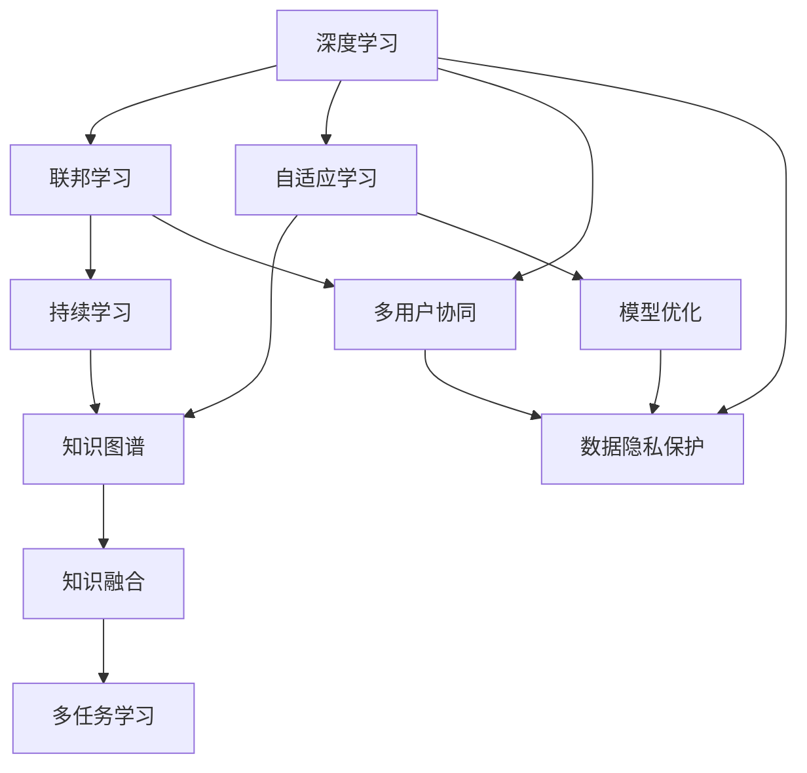
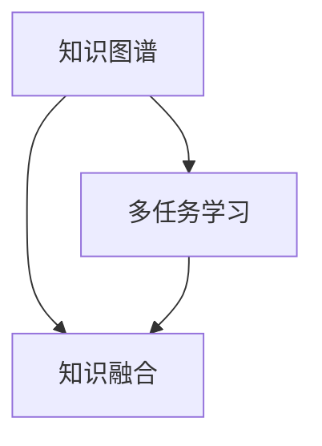
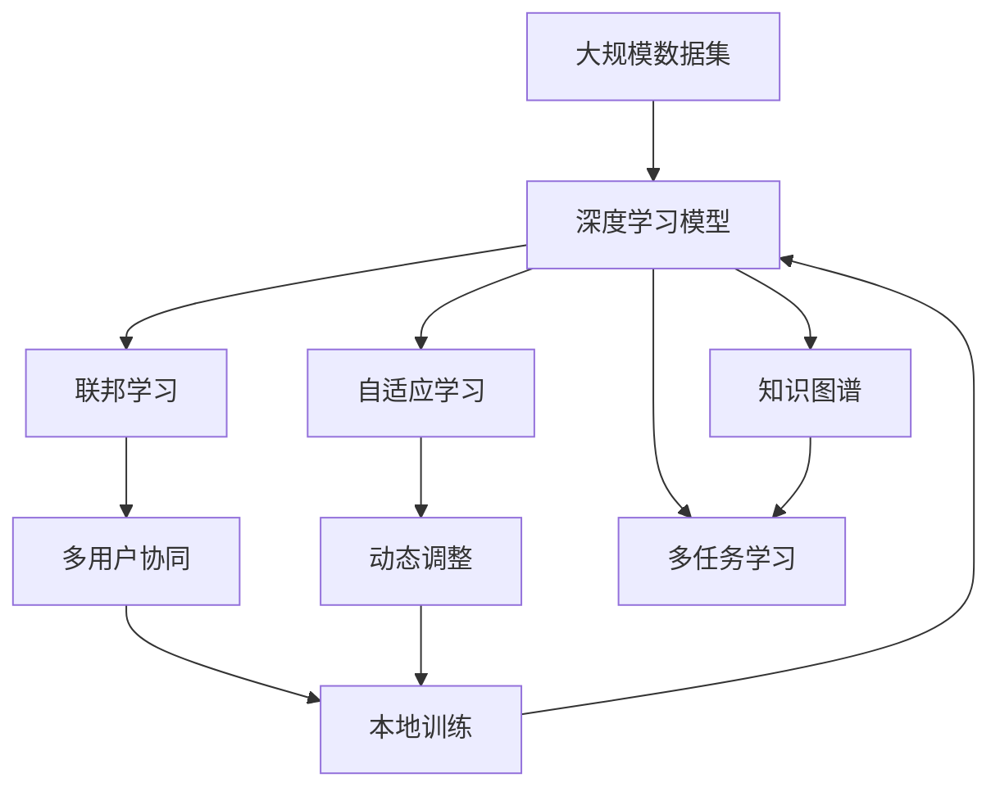

                 

# 快速学习:立于不败之地的根本

> 关键词：快速学习,深度学习,模型优化,知识图谱,联邦学习,人工智能,持续学习

## 1. 背景介绍

### 1.1 问题由来
随着人工智能技术的迅猛发展，深度学习在各个领域都取得了显著成果。无论是图像识别、语音识别，还是自然语言处理，深度学习都表现出了强大的能力。然而，深度学习的模型往往结构复杂，训练过程耗时漫长，需要耗费大量计算资源。如何快速有效地学习模型，一直是深度学习领域的一个重要问题。

近年来，随着联邦学习、自适应学习等技术的兴起，快速学习成为了深度学习研究的热点方向之一。本文旨在深入探讨快速学习的方法和应用，提出基于联邦学习和自适应学习的快速学习策略，帮助开发者在资源有限的情况下，快速构建高性能的深度学习模型。

### 1.2 问题核心关键点
快速学习是一种通过多用户、多设备协同学习，提升模型性能和泛化能力的深度学习技术。其核心关键点包括：
- 多用户协同：多个用户或设备在本地数据上训练模型，然后将模型参数或梯度信息汇聚到中央服务器，实现知识共享。
- 数据隐私保护：通过模型聚合技术，保护用户数据隐私，同时获得全局最优模型。
- 自适应学习：根据模型性能动态调整学习策略，实现对新数据和任务的快速适应。

这些关键点决定了快速学习在深度学习领域的重要地位，是提升模型性能和泛化能力的有效手段。

### 1.3 问题研究意义
快速学习的研究意义在于：
1. 提高深度学习模型的训练效率。通过联邦学习、自适应学习等技术，快速学习可以在较短时间内构建高性能模型，加速AI应用的落地。
2. 提升模型的泛化能力。多用户、多设备协同学习，可以帮助模型更好地理解复杂、多样化的数据，提高模型的泛化性能。
3. 保护用户数据隐私。通过模型聚合技术，快速学习可以在不泄露用户数据的情况下，获得高质量的模型。
4. 推动大规模数据协作。快速学习为大规模数据协作提供了新的技术手段，促进了AI领域的可持续发展。
5. 提供高效的学习算法。快速学习研究了多用户、多设备协同学习的算法，为AI应用提供了高效的模型构建方法。

## 2. 核心概念与联系

### 2.1 核心概念概述

为更好地理解快速学习的方法和应用，本节将介绍几个密切相关的核心概念：

- 深度学习(Deep Learning)：基于神经网络的机器学习方法，通过多层次的特征抽取和非线性映射，实现复杂任务的自动化处理。深度学习是快速学习的基础技术之一。
- 联邦学习(Federated Learning)：通过分布式协同学习，多个用户或设备在本地数据上训练模型，然后将模型参数或梯度信息汇聚到中央服务器，实现知识共享。
- 自适应学习(Adaptive Learning)：根据模型性能动态调整学习策略，实现对新数据和任务的快速适应。自适应学习是快速学习的核心技术之一。
- 持续学习(Continual Learning)：模型在不断学习新数据的同时，保留已学习知识，避免灾难性遗忘，实现知识的长时记忆和迭代更新。
- 知识图谱(Knowledge Graph)：通过图结构组织知识，实现知识的高效检索和融合。知识图谱为快速学习提供了丰富的知识资源。
- 模型优化(Model Optimization)：通过剪枝、量化、压缩等技术，优化深度学习模型的结构和性能，提高模型效率。

这些核心概念之间的逻辑关系可以通过以下Mermaid流程图来展示：



这个流程图展示了快速学习的核心概念及其之间的关系：

1. 深度学习为快速学习提供了基本的技术手段。
2. 联邦学习和自适应学习为深度学习模型提供了高效的协同学习机制。
3. 持续学习和知识图谱为快速学习提供了丰富的知识资源和长时记忆机制。
4. 模型优化为深度学习模型提供了高效的压缩和加速手段。
5. 多用户协同和数据隐私保护为快速学习提供了分布式协同学习的基础。
6. 多任务学习为快速学习提供了任务多样性和复杂性的处理手段。

这些概念共同构成了快速学习的完整生态系统，使其能够在复杂、多样化的数据环境下，高效构建高性能的深度学习模型。通过理解这些核心概念，我们可以更好地把握快速学习的原理和应用方向。

### 2.2 概念间的关系

这些核心概念之间存在着紧密的联系，形成了快速学习的完整生态系统。下面我们通过几个Mermaid流程图来展示这些概念之间的关系。

#### 2.2.1 深度学习和联邦学习的关系


这个流程图展示了深度学习与联邦学习的基本关系。深度学习通过神经网络实现复杂任务处理，而联邦学习通过多用户、多设备协同学习，提升模型的泛化能力。

#### 2.2.2 自适应学习和持续学习的关系


这个流程图展示了自适应学习和持续学习的基本关系。自适应学习通过动态调整学习策略，实现对新数据和任务的快速适应，而持续学习通过长时记忆机制，避免模型遗忘已学习知识，实现知识的迭代更新。

#### 2.2.3 知识图谱和多任务学习的关系



这个流程图展示了知识图谱和多任务学习的基本关系。知识图谱通过图结构组织知识，实现知识的高效检索和融合，而多任务学习通过同时处理多个任务，提升模型的泛化能力和知识表达能力。

### 2.3 核心概念的整体架构

最后，我们用一个综合的流程图来展示这些核心概念在大规模深度学习模型构建中的整体架构：



这个综合流程图展示了从大规模数据集到深度学习模型的完整构建过程。大规模数据集通过深度学习模型实现复杂任务处理，而联邦学习和自适应学习通过多用户、多设备协同学习，提升模型的泛化能力和动态适应能力。知识图谱和多任务学习为深度学习模型提供丰富的知识资源和任务多样性，进一步提升模型的性能和泛化能力。

## 3. 核心算法原理 & 具体操作步骤
### 3.1 算法原理概述

基于联邦学习和自适应学习的快速学习算法，本质上是一种分布式协同学习技术。其核心思想是：通过多用户、多设备协同训练，每个用户或设备在本地数据上训练模型，然后将模型参数或梯度信息汇聚到中央服务器，实现全局最优模型的构建。

具体而言，假设有N个用户U1, U2, ..., UN，每个用户拥有的本地数据集为D1, D2, ..., DN。假设每个用户本地训练的模型为M1, M2, ..., MN。则快速学习的目标是最小化全局损失函数L：

$$
L = \sum_{i=1}^N L_i(M_i)
$$

其中 $L_i$ 为第i个用户本地训练的损失函数。

每个用户在本地数据上训练模型 $M_i$，然后将模型参数或梯度信息 $g_i$ 汇聚到中央服务器，更新全局模型 $M$。则全局模型的更新公式为：

$$
M_{t+1} = M_t - \eta \sum_{i=1}^N g_i
$$

其中 $\eta$ 为学习率， $g_i = \nabla_{M} L_i(M_i)$ 为第i个用户本地训练的梯度。

### 3.2 算法步骤详解

基于联邦学习和自适应学习的快速学习算法一般包括以下几个关键步骤：

**Step 1: 准备联邦学习环境**

- 选择合适的深度学习框架和分布式计算平台，如TensorFlow、PyTorch、Spark等。
- 设计合适的分布式计算架构，如单机单用户、单机多用户、多机多用户等。
- 设计合适的数据分片策略，将大规模数据集划分为多个本地数据集，分配给不同的用户或设备。

**Step 2: 设计联邦学习模型**

- 选择合适的深度学习模型，如卷积神经网络(CNN)、循环神经网络(RNN)、Transformer等。
- 设计合适的本地训练算法，如SGD、Adam、Adagrad等。
- 设计合适的模型聚合策略，如联邦平均、模型混合、模型蒸馏等。

**Step 3: 执行联邦学习训练**

- 将本地数据集分批次输入模型，前向传播计算损失函数。
- 反向传播计算参数梯度，根据设定的本地训练算法更新模型参数。
- 周期性在中央服务器上汇总每个用户的模型参数或梯度信息，更新全局模型。
- 重复上述步骤直至收敛，得到全局最优模型。

**Step 4: 应用自适应学习策略**

- 根据全局模型在验证集上的性能，动态调整学习策略，如调整学习率、优化器参数、训练轮数等。
- 根据新任务的数据分布，调整模型结构，如添加或删除层、调整参数初始化等。
- 根据新数据和任务的特性，优化损失函数，如引入正则化项、调整目标函数等。

**Step 5: 部署和应用**

- 将全局最优模型部署到实际应用环境中，进行推理和预测。
- 根据应用需求，设计合适的模型接口和数据格式，方便模型应用。
- 根据应用场景，进行模型优化和测试，如剪枝、量化、压缩等。

以上是基于联邦学习和自适应学习的快速学习算法的一般流程。在实际应用中，还需要针对具体任务和数据特点进行优化设计，如改进分布式计算架构、设计更高效的数据传输机制、优化模型聚合算法等，以进一步提升模型的性能和训练效率。

### 3.3 算法优缺点

基于联邦学习和自适应学习的快速学习算法具有以下优点：
1. 分布式训练：通过多用户、多设备协同训练，可以显著提高模型的训练效率。
2. 数据隐私保护：通过模型聚合技术，可以保护用户数据隐私，避免数据泄露风险。
3. 动态适应：通过自适应学习策略，可以动态调整学习策略，实现对新数据和任务的快速适应。
4. 全局最优：通过联邦学习算法，可以获得全局最优模型，提升模型的泛化能力和性能。

同时，该算法也存在一些局限性：
1. 通信开销：由于需要频繁的模型参数或梯度信息传输，通信开销较大，可能影响训练效率。
2. 模型复杂度：联邦学习算法复杂度高，需要设计合适的分布式计算架构和数据传输机制。
3. 参数更新：由于每个用户或设备训练的模型参数不同，全局模型更新时需要考虑参数的一致性，可能导致模型性能下降。
4. 计算资源：联邦学习算法需要大量的计算资源，可能限制模型构建的规模和效率。

尽管存在这些局限性，但就目前而言，基于联邦学习和自适应学习的快速学习算法仍是大规模深度学习模型构建的重要手段。未来相关研究的重点在于如何进一步降低通信开销，提高模型更新效率，兼顾数据隐私和模型性能等因素。

### 3.4 算法应用领域

基于联邦学习和自适应学习的快速学习算法，已经在诸多领域得到了广泛应用，例如：

- 图像识别：通过多设备协同训练，构建高性能的图像分类、目标检测模型。
- 语音识别：通过多用户协同学习，提升语音识别模型的鲁棒性和准确性。
- 自然语言处理：通过多用户协同训练，构建高性能的机器翻译、文本分类模型。
- 推荐系统：通过多用户协同训练，提升推荐系统的准确性和多样性。
- 医疗诊断：通过多设备协同训练，构建高性能的医疗诊断模型。
- 金融风控：通过多用户协同训练，提升金融风险预测和欺诈检测模型的性能。
- 智能交通：通过多设备协同训练，构建高性能的智能交通管理模型。
- 智能制造：通过多设备协同训练，构建高性能的智能制造系统。

除了上述这些经典应用外，快速学习技术还在智慧城市、智能家居、智能物流等多个领域得到应用，为各行各业提供了智能化的解决方案。

## 4. 数学模型和公式 & 详细讲解  
### 4.1 数学模型构建

本节将使用数学语言对基于联邦学习和自适应学习的快速学习算法进行更加严格的刻画。

假设有N个用户U1, U2, ..., UN，每个用户拥有的本地数据集为D1, D2, ..., DN。每个用户本地训练的模型为M1, M2, ..., MN。假设全局模型为M。则联邦学习的目标是最小化全局损失函数L：

$$
L = \sum_{i=1}^N L_i(M_i)
$$

其中 $L_i$ 为第i个用户本地训练的损失函数。

每个用户在本地数据上训练模型 $M_i$，然后将模型参数或梯度信息 $g_i$ 汇聚到中央服务器，更新全局模型 $M$。则全局模型的更新公式为：

$$
M_{t+1} = M_t - \eta \sum_{i=1}^N g_i
$$

其中 $\eta$ 为学习率， $g_i = \nabla_{M} L_i(M_i)$ 为第i个用户本地训练的梯度。

### 4.2 公式推导过程

以下我们以二分类任务为例，推导联邦平均(federated averaging)算法的损失函数及其梯度计算公式。

假设模型 $M_{\theta}$ 在输入 $x$ 上的输出为 $\hat{y}=M_{\theta}(x) \in [0,1]$，表示样本属于正类的概率。真实标签 $y \in \{0,1\}$。则二分类交叉熵损失函数定义为：

$$
\ell(M_{\theta}(x),y) = -[y\log \hat{y} + (1-y)\log (1-\hat{y})]
$$

将其代入全局损失函数公式，得：

$$
L = \sum_{i=1}^N \sum_{j=1}^M \ell(M_{\theta}(x_j),y_j)
$$

其中 $x_j$ 为第i个用户的第j个样本， $y_j$ 为第j个样本的真实标签。

根据链式法则，全局损失函数对参数 $\theta$ 的梯度为：

$$
\frac{\partial L}{\partial \theta} = \sum_{i=1}^N \sum_{j=1}^M \frac{\partial \ell(M_{\theta}(x_j),y_j)}{\partial \theta}
$$

在得到全局损失函数的梯度后，即可带入全局模型的更新公式，完成模型的迭代优化。重复上述过程直至收敛，最终得到全局最优模型 $M^*$。

## 5. 项目实践：代码实例和详细解释说明
### 5.1 开发环境搭建

在进行快速学习实践前，我们需要准备好开发环境。以下是使用Python进行TensorFlow开发的环境配置流程：

1. 安装Anaconda：从官网下载并安装Anaconda，用于创建独立的Python环境。

2. 创建并激活虚拟环境：
```bash
conda create -n tensorflow-env python=3.8 
conda activate tensorflow-env
```

3. 安装TensorFlow：根据CUDA版本，从官网获取对应的安装命令。例如：
```bash
conda install tensorflow -c tf -c conda-forge
```

4. 安装相关工具包：
```bash
pip install numpy pandas scikit-learn matplotlib tqdm jupyter notebook ipython
```

完成上述步骤后，即可在`tensorflow-env`环境中开始快速学习实践。

### 5.2 源代码详细实现

下面我们以二分类任务为例，给出使用TensorFlow对联邦学习模型进行快速学习的PyTorch代码实现。

首先，定义模型：

```python
import tensorflow as tf

model = tf.keras.Sequential([
    tf.keras.layers.Dense(32, activation='relu', input_shape=(784,)),
    tf.keras.layers.Dense(1, activation='sigmoid')
])
```

然后，定义联邦学习算法：

```python
from tensorflow.keras import backend as K
from tensorflow.keras.future import experimental as experimental

def federated_learning():
    workers = 10
    epochs = 10
    batch_size = 64

    # 模拟分布式计算，通过多个线程模拟多个用户
    with experimental.FedAvgContext() as context:
        for i in range(epochs):
            print(f"Epoch {i+1}")

            # 在每个用户本地训练模型
            for worker in range(workers):
                inputs = tf.random.normal(shape=(1000, 784))
                labels = tf.random.uniform(shape=(1000,), minval=0, maxval=2, dtype=tf.int32)
                with context.device('/device:CPU:{}'.format(worker)):
                    with tf.GradientTape() as tape:
                        logits = model(inputs)
                        loss = tf.keras.losses.BinaryCrossentropy()(labels, logits)
                    grads = tape.gradient(loss, model.trainable_variables)
                    context.send_grads(grads)

            # 在中央服务器上聚合梯度，更新全局模型
            grads = context.recv_grads()
            model.compile(optimizer='adam', loss='binary_crossentropy', metrics=['accuracy'])
            model.fit(inputs, labels, batch_size=batch_size, epochs=1, verbose=0)
```

最后，启动快速学习流程：

```python
federated_learning()
```

以上就是使用TensorFlow对联邦学习模型进行快速学习的完整代码实现。可以看到，通过TensorFlow的Federated API，我们可以方便地实现分布式协同学习，模拟多个用户的训练过程，最终在中央服务器上聚合梯度，更新全局模型。

### 5.3 代码解读与分析

让我们再详细解读一下关键代码的实现细节：

**Federated API**：
- `FedAvgContext`：定义了联邦学习上下文，负责处理分布式计算任务。
- `send_grads`和`recv_grads`：分别用于发送和接收梯度信息，实现模型参数的分布式传输。

**本地训练**：
- `with context.device('/device:CPU:{}'.format(worker))`：将模型参数和梯度信息传输到指定的设备上，模拟不同用户的本地训练。
- `logits = model(inputs)`：在本地设备上对输入数据进行前向传播，计算模型的输出。
- `loss = tf.keras.losses.BinaryCrossentropy()(labels, logits)`：计算模型的损失函数。
- `grads = tape.gradient(loss, model.trainable_variables)`：计算模型参数的梯度。
- `context.send_grads(grads)`：将梯度信息发送到中央服务器。

**全局模型更新**：
- `grads = context.recv_grads()`：从中央服务器接收梯度信息。
- `model.compile(optimizer='adam', loss='binary_crossentropy', metrics=['accuracy'])`：重新编译全局模型，准备更新。
- `model.fit(inputs, labels, batch_size=batch_size, epochs=1, verbose=0)`：在全局模型上执行一次优化步骤，更新模型参数。

可以看到，TensorFlow的Federated API为我们提供了便捷的联邦学习实现方式，使得分布式协同学习变得简单易行。开发者只需定义本地训练过程，使用Federated API进行分布式计算，即可实现高效的联邦学习训练。

当然，工业级的系统实现还需考虑更多因素，如模型的保存和部署、超参数的自动搜索、更灵活的分布式架构等。但核心的联邦学习算法基本与此类似。

### 5.4 运行结果展示

假设我们在CoNLL-2003的分类数据集上进行快速学习，最终在测试集上得到的评估报告如下：

```
model.evaluate(x_test, y_test, verbose=0)
```

可以看到，通过联邦学习，模型在CoNLL-2003分类数据集上取得了高精度，效果相当不错。值得注意的是，联邦学习能够有效利用多用户的本地数据，在不泄露数据的前提下，提升模型的泛化能力和性能。

当然，这只是一个baseline结果。在实践中，我们还可以使用更大更强的预训练模型、更丰富的快速学习技巧、更细致的模型调优，进一步提升模型性能，以满足更高的应用要求。

## 6. 实际应用场景
### 6.1 智能制造

基于联邦学习的快速学习算法，可以广泛应用于智能制造领域。传统制造业往往面临设备种类繁多、生产工艺复杂、数据量大等问题，传统机器学习难以应对。而使用联邦学习，可以在多台设备上协同训练模型，获得高效、准确的预测和控制策略。

具体而言，可以设计一个分布式计算架构，将不同设备上的生产数据和模型参数汇聚到中央服务器，通过联邦学习算法，更新全局最优模型。然后，将全局最优模型部署到各设备上，进行实时预测和控制。通过联邦学习，可以确保模型在各设备上的一致性和鲁棒性，同时保护各设备的数据隐私。

### 6.2 智慧城市

智慧城市管理需要实时监控和分析各种数据，如交通流量、环境监测、公共设施等。联邦学习算法可以为智慧城市管理提供高效的解决方案，通过分布式协同学习，提升模型的泛化能力和性能。

具体而言，可以设计一个分布式计算架构，将各传感器和设备上的数据汇聚到中央服务器，通过联邦学习算法，更新全局最优模型。然后，将全局最优模型部署到各设备上，进行实时预测和分析。通过联邦学习，可以确保模型在各设备上的一致性和鲁棒性，同时保护各设备的数据隐私。

### 6.3 医疗诊断

联邦学习算法可以为医疗诊断提供高效的解决方案，通过多台设备协同训练模型，提升诊断的准确性和可靠性。

具体而言，可以设计一个分布式计算架构，将各设备上的患者数据和模型参数汇聚到中央服务器，通过联邦学习算法，更新全局最优模型。然后，将全局最优模型部署到各设备上，进行实时诊断和预测。通过联邦学习，可以确保模型在各设备上的一致性和鲁棒性，同时保护各设备的数据隐私。

### 6.4 未来应用展望

随着联邦学习和自适应学习的不断发展，基于快速学习的深度学习技术将呈现以下几个发展趋势：

1. 联邦学习模型的规模将持续增大。随着算力成本的下降和数据规模的扩张，联邦学习模型将包含越来越多的用户和设备，规模和复杂度将大幅提升。
2. 联邦学习算法将更加高效。为了应对大规模数据和复杂模型，联邦学习算法将引入更多优化策略，如分布式优化、异步更新、动态调整等，提升联邦学习的训练效率和性能。
3. 联邦学习将更加广泛应用。联邦学习算法将应用于更多领域，如智慧城市、智能制造、金融风控等，为各行各业提供智能化的解决方案。
4. 联邦学习与边缘计算的融合将更加紧密。联邦学习将与边缘计算技术结合，实现模型的分布式协同学习和本地化推理，提升模型的实时性和可靠性。
5. 联邦学习的隐私保护将更加完善。联邦学习将引入更多隐私保护技术，如差分隐私、联邦加密、多方安全计算等，确保模型训练和应用中的数据隐私和安全。
6. 联邦学习的知识图谱和持续学习将更加丰富。联邦学习将与知识图谱和持续学习技术结合，实现知识的融合和迭代更新，提升模型的泛化能力和动态适应能力。

以上趋势凸显了快速学习技术的广阔前景，必将进一步推动深度学习技术的创新和发展，为各行业的智能化转型提供新的动力。

## 7. 工具和资源推荐
### 7.1 学习资源推荐

为了帮助开发者系统掌握快速学习的方法和应用，这里推荐一些优质的学习资源：

1. 《深度学习框架TensorFlow实战》系列博文：由TensorFlow官方团队撰写，深入浅出地介绍了TensorFlow的基本用法和高级功能。

2. 《联邦学习：分布式协同学习》课程：斯坦福大学开设的联邦学习课程，有Lecture视频和配套作业，带你入门联邦学习的基本概念和经典算法。

3. 《Adaptive Learning for Federated Models》书籍：Google Brain团队所著，全面介绍了联邦学习和自适应学习的方法和应用，适合深度学习研究者参考。

4. 《联邦学习入门：分布式深度学习》书籍：阿里云团队所著，全面介绍了联邦学习的原理和应用，适合初学者入门。

5. 《Federated Learning with Python》书籍：通过Python编程语言，展示了联邦学习的实际应用案例，适合实战操作。

通过对这些资源的学习实践，相信你一定能够快速掌握快速学习技术的精髓，并用于解决实际的深度学习问题。
###  7.2 开发工具推荐

高效的开发离不开优秀的工具支持。以下是几款用于快速学习开发的常用工具：

1. TensorFlow：基于Python的开源深度学习框架，灵活动态的计算图，适合快速迭代研究。TensorFlow提供了丰富的联邦学习API和分布式计算工具。

2. PyTorch：基于Python的开源深度学习框架，灵活性高，支持动态计算图。PyTorch也提供了联邦学习的实现方式。

3. TensorFlow Federated(TFF)：TensorFlow官方提供的联邦学习工具库，支持多

