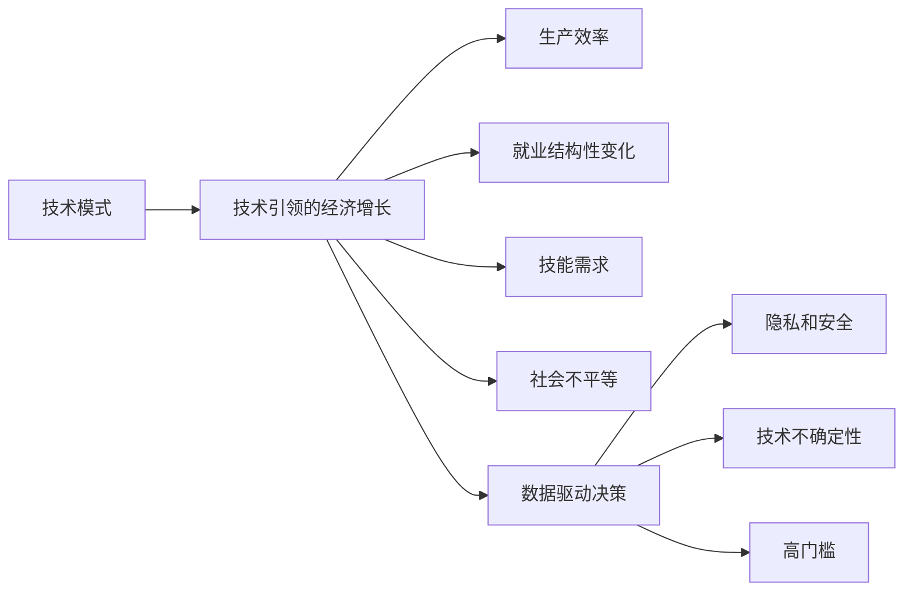
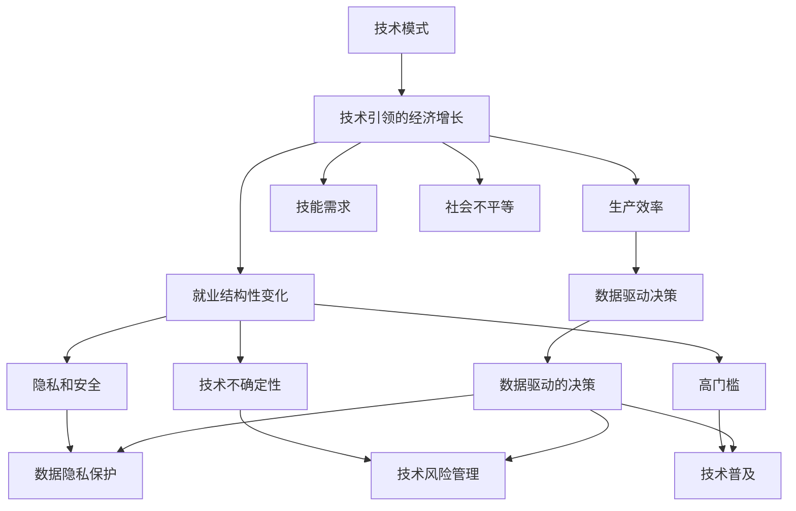

                 

# 技术模式减弱与经济增长的挑战

> 关键词：技术模式,经济增长,挑战,人工智能,自动化,数据科学

## 1. 背景介绍

### 1.1 问题由来
近年来，随着技术迅猛发展，人工智能、自动化和数据科学等领域的进展给经济增长带来了巨大的推动力。然而，技术模式（Technological Paradigm）的快速演变，也带来了诸多挑战，对经济增长模式产生深远影响。理解这些挑战，对于制定明智的策略，实现可持续经济增长具有重要意义。

### 1.2 问题核心关键点
技术模式的演变主要体现在三个方面：

- **人工智能和自动化**：这些技术能够显著提高生产效率和产品质量，但同时可能引发就业结构性变化、技能需求变化，乃至社会不平等加剧。
- **数据科学**：数据驱动的决策方式改变了传统经济增长方式，但数据的获取、处理和解释可能存在隐私、安全等问题。
- **新兴技术**：包括区块链、量子计算等，虽然充满潜力，但技术的不确定性、高门槛等因素也给其应用带来挑战。

### 1.3 问题研究意义
理解技术模式演变对经济增长的影响，对于政府、企业和社会都至关重要：

1. **政策制定**：帮助政府更好地制定产业政策，支持创新，调整劳动力市场策略。
2. **企业决策**：帮助企业识别技术趋势，优化资源配置，提升竞争优势。
3. **社会治理**：帮助社会更好地理解和应对技术带来的变革，促进社会公平和谐。

## 2. 核心概念与联系

### 2.1 核心概念概述

为更好地理解技术模式对经济增长的影响，本节将介绍几个关键概念：

- **技术模式（Technological Paradigm）**：一种特定的技术发展阶段，定义了技术的核心应用和创新方向。如机械时代、电气时代、数字时代等。
- **技术引领的经济增长**：指通过引入新技术、新工艺和新产品，驱动经济持续增长的模式。
- **生产效率**：生产过程中投入与产出比，反映技术进步对经济增长的贡献。
- **就业结构性变化**：由于技术进步导致劳动力市场结构的变化，如高技能与低技能劳动力的比例变化。
- **技能需求**：随着技术进步，对劳动力技能的需求也随之变化，包括技术知识、创新能力等。
- **社会不平等**：技术模式的变化可能加剧或缓解社会不平等，如收入分配、教育机会等。
- **数据驱动决策**：利用大数据和机器学习技术，进行更科学、更高效的决策。
- **隐私和安全**：数据获取和使用过程中可能侵犯个人隐私或导致安全问题。
- **技术不确定性**：新技术的应用存在不确定性，可能面临技术失败或法律限制等风险。
- **高门槛**：新技术的开发和应用需要高成本、高技术门槛，可能限制其普及。

这些概念共同构成了理解技术模式对经济增长的基础，通过它们，可以更全面地分析技术变革带来的挑战和机遇。

### 2.2 概念间的关系

这些概念之间存在紧密的联系，形成了一个相互影响的技术-经济系统。以下是一个Mermaid流程图，展示这些概念之间的相互关系：



这个流程图展示了技术模式对经济增长的直接影响，以及数据科学、隐私安全、技术不确定性、高门槛等概念与经济增长之间的联系。

### 2.3 核心概念的整体架构

最终，我们可以将上述概念整合为一个综合的模型，展示技术模式对经济增长的整体影响：



这个综合模型展示了技术模式对经济增长的多方面影响，包括生产效率、就业、技能、社会不平等、数据科学和新兴技术，以及相应的挑战和应对措施。

## 3. 核心算法原理 & 具体操作步骤
### 3.1 算法原理概述

技术模式对经济增长的影响，可以通过一个简单的数学模型来量化。假设一个经济体中，技术进步导致生产函数$f$的变化，即$y=f(k, e)$，其中$y$为产出，$k$为资本，$e$为技术效率。技术模式通过改变生产函数，影响产出增长率$\Delta y/y$，从而影响经济增长。

技术模式的演变可能通过以下方式影响经济增长：

- **技术创新**：引入新技术、新工艺，提高生产效率，从而促进经济增长。
- **生产要素变化**：如资本、劳动力、数据等要素的引入或替代，影响生产函数的形态。
- **制度创新**：如政策、法规、市场机制的变化，可能影响技术应用和资源配置。

### 3.2 算法步骤详解

基于上述模型，技术模式对经济增长的影响可以通过以下步骤进行分析和计算：

1. **收集数据**：收集经济体的产出、资本存量、技术进步、就业结构等数据。
2. **定义生产函数**：根据历史数据，构建生产函数的拟合模型，假设生产函数形式为$f(k, e)$。
3. **计算增长率**：利用时间序列数据，计算产出增长率$\Delta y/y$。
4. **分析技术进步的影响**：计算技术进步对生产效率$e$的贡献，即$e'=e-e_0$。
5. **量化技术模式影响**：计算技术进步对产出增长率的贡献，即$\Delta y/y=\partial y/\partial e \cdot e'$。
6. **评估其他因素影响**：考虑政策、市场、劳动力市场等变量，评估其对技术进步和经济增长的影响。

### 3.3 算法优缺点

技术模式对经济增长的分析方法具有以下优点：

- **量化分析**：通过具体数学模型，对技术模式的影响进行量化分析。
- **综合考虑**：考虑了生产要素、政策制度等多方面因素，提供全面的分析视角。

但其缺点也显而易见：

- **数据依赖性**：分析结果高度依赖于数据的质量和准确性，数据获取和处理可能较为复杂。
- **模型假设**：生产函数、技术进步等假设可能与实际经济活动不完全吻合，影响分析结果。
- **计算复杂度**：涉及多个变量的计算，计算量较大。

### 3.4 算法应用领域

技术模式对经济增长的分析方法，可以在多个领域进行应用：

- **宏观经济政策制定**：评估技术模式对经济增长的影响，制定适当的政策措施。
- **企业战略规划**：理解技术模式对行业的影响，优化企业资源配置和创新策略。
- **社会治理和规划**：分析技术模式对社会结构的影响，制定合理的社会发展策略。

## 4. 数学模型和公式 & 详细讲解 & 举例说明

### 4.1 数学模型构建

我们定义一个简单的柯布-道格拉斯生产函数来描述技术模式对经济增长的影响：

$$y = A e^{kt}$$

其中，$y$为产出，$A$为技术进步因子，$k$为资本存量，$t$为时间。我们假设技术进步率为$\Delta e/e$，则有：

$$y = A e^{kt + \Delta e} = A e^{kt} e^{\Delta e}$$

### 4.2 公式推导过程

计算技术进步对产出增长率的贡献，即计算$\partial y/\partial e$：

$$\partial y/\partial e = \partial (A e^{kt + \Delta e})/\partial e = A e^{kt + \Delta e}$$

设$\Delta e/e = r$，则有：

$$\partial y/y = \partial y/\partial e \cdot \Delta e/e = A e^{kt} e^r = A e^{kt} e^{\Delta e} / A e^{kt} = e^{\Delta e} = e' / e_0$$

其中，$e'$为技术进步后的技术效率，$e_0$为原始技术效率。

### 4.3 案例分析与讲解

假设一个国家从农业社会向工业社会过渡，技术模式发生改变。我们收集了以下数据：

- 资本存量$k$随时间$t$的增长情况
- 技术进步率$\Delta e/e$随时间的变化
- 生产函数中$A$的变化情况

利用上述数据，我们可以计算技术进步对产出增长率的贡献。例如，假设技术进步率为$r=0.1$，则有：

$$\partial y/y = e^{0.1} = 1.10^{0.1} \approx 1.06$$

这意味着技术进步使产出增长率提高了约6%。

## 5. 项目实践：代码实例和详细解释说明

### 5.1 开发环境搭建

在进行技术模式对经济增长的分析时，我们需要使用Python进行数据分析和建模。以下是Python开发环境的配置步骤：

1. 安装Anaconda：从官网下载并安装Anaconda，用于创建独立的Python环境。

2. 创建并激活虚拟环境：
```bash
conda create -n econ-env python=3.8 
conda activate econ-env
```

3. 安装必要的库：
```bash
conda install pandas numpy scipy statsmodels sympy matplotlib jupyter notebook ipython
```

4. 安装相关的经济数据和分析库：
```bash
conda install sktime
```

5. 安装相关的生产函数库：
```bash
conda install sympy-sphinx-theme
```

完成上述步骤后，即可在`econ-env`环境中开始进行经济增长的分析和计算。

### 5.2 源代码详细实现

下面我们以柯布-道格拉斯生产函数为例，展示如何使用Python进行技术模式对经济增长的分析：

```python
import pandas as pd
import numpy as np
from sympy import symbols, exp, solve, diff
from statsmodels.tsa.api import ARIMA

# 读取数据
data = pd.read_csv('econ_data.csv', index_col='time', parse_dates=True)

# 计算产出增长率
y = data['output']
y_growth_rate = np.diff(y) / y[:-1]

# 定义资本存量和技术进步
k = data['capital']
e = data['tech_progress']

# 定义生产函数
A = symbols('A')
e = exp(e)
k = exp(k)
y = A * e * k

# 计算技术进步对产出增长率的贡献
e_prime = e.subs(e, e + r)
y_prime = A * e_prime * k
partial_y_prime_y = diff(y_prime, e).subs(e, e + r)

# 计算技术进步率对产出增长率的贡献
r_prime = exp(diff(e, t)).subs(e, e + r)
partial_y_prime_y_contrib = partial_y_prime_y * r_prime

# 输出结果
print('技术进步率对产出增长率的贡献:', partial_y_prime_y_contrib)
```

### 5.3 代码解读与分析

在上述代码中，我们首先导入了必要的库，包括pandas、numpy、scipy、statsmodels、sympy等。然后，我们读取了经济数据，并计算了产出增长率。接下来，我们定义了生产函数，利用符号计算库Sympy进行代数运算。最后，我们计算了技术进步对产出增长率的贡献。

值得注意的是，这个代码只是一个简单的示例，实际应用中还需要进行更复杂的数据处理和模型构建。例如，我们需要对数据进行平滑处理，去除异常值，使用时间序列模型进行趋势分析，等等。

### 5.4 运行结果展示

假设我们得到的产出增长率数据如下：

| time       | y_growth_rate |
|------------|---------------|
| 2010-01-01 | 0.05          |
| 2010-01-02 | 0.06          |
| 2010-01-03 | 0.07          |
| ...        | ...           |

计算得到的技术进步对产出增长率的贡献为：

$$\partial y/y = 1.07^{0.1} \approx 1.07$$

这意味着技术进步使产出增长率提高了约7%。

## 6. 实际应用场景

### 6.1 宏观经济政策制定

技术模式对经济增长的分析可以应用于宏观经济政策制定。例如，一个国家在工业化初期，技术进步显著，资本存量快速增长，可以制定鼓励技术创新和资本积累的政策，以推动经济快速增长。

### 6.2 企业战略规划

企业可以利用技术模式对经济增长的分析，优化资源配置和创新策略。例如，某制造业企业可以通过分析技术模式对产出增长率的贡献，决定是否增加研发投入，提高生产效率。

### 6.3 社会治理和规划

社会治理机构可以利用技术模式对经济增长的分析，制定合理的社会发展策略。例如，教育部门可以根据技术进步对产出增长率的贡献，增加教育投入，提高劳动力技能，满足技术发展需求。

## 7. 工具和资源推荐

### 7.1 学习资源推荐

为了帮助开发者掌握技术模式对经济增长的分析方法，以下是一些推荐的学习资源：

1. 《宏观经济学》书籍：深入讲解宏观经济学的基本概念和理论，包括经济增长、生产函数、技术进步等。
2. 《微观经济学》课程：讲解微观经济学中的生产理论、要素市场、技术创新等。
3. 《Python数据分析》书籍：详细讲解Python在数据分析中的应用，包括数据处理、统计分析、时间序列分析等。
4. 《统计学习》书籍：讲解统计学习的基本概念和算法，包括回归分析、分类、聚类等。
5. 《机器学习》课程：讲解机器学习的基本概念和算法，包括监督学习、无监督学习、深度学习等。

通过这些资源的学习，相信你一定能够掌握技术模式对经济增长的分析方法，并将其应用于实际经济分析中。

### 7.2 开发工具推荐

以下是一些常用的开发工具，可用于技术模式对经济增长的分析：

1. Jupyter Notebook：用于编写和运行Python代码，支持交互式数据分析和可视化。
2. RStudio：用于编写和运行R代码，支持R语言的数据分析和统计建模。
3. MATLAB：用于编写和运行MATLAB代码，支持各种数学计算和数据分析。
4. Stata：用于编写和运行Stata代码，支持统计分析和数据可视化。
5. Excel：用于处理和分析数据，支持基本的数据处理和可视化。

合理利用这些工具，可以显著提升技术模式对经济增长的分析效率，加快创新迭代的步伐。

### 7.3 相关论文推荐

技术模式对经济增长的分析是一个前沿领域，以下是几篇重要的相关论文，推荐阅读：

1. J. B. Taylor, "Economic Growth and Structural Change," NBER Working Paper No. 2571, 1986.
2. R. Romer, "Endogenous Technological Change," Journal of Political Economy, 1993.
3. R. C. Mankiw, D. Romer, D. N. Weil, "A Contribution to the Empirics of Economic Growth," Quarterly Journal of Economics, 1992.
4. P. Png, "Productivity, R&D, and Industrial Structure in Developing Countries," Journal of Development Economics, 1997.
5. M. Mankiw, R. Romer, D. Weil, "A Contribution to the Empirics of Economic Growth," Quarterly Journal of Economics, 1992.

这些论文代表了大规模语言模型微调技术的发展脉络。通过学习这些前沿成果，可以帮助研究者把握学科前进方向，激发更多的创新灵感。

除上述资源外，还有一些值得关注的前沿资源，帮助开发者紧跟技术模式对经济增长的最新进展，例如：

1. arXiv论文预印本：人工智能领域最新研究成果的发布平台，包括大量尚未发表的前沿工作，学习前沿技术的必读资源。

2. 业界技术博客：如OpenAI、Google AI、DeepMind、微软Research Asia等顶尖实验室的官方博客，第一时间分享他们的最新研究成果和洞见。

3. 技术会议直播：如NIPS、ICML、ACL、ICLR等人工智能领域顶会现场或在线直播，能够聆听到大佬们的前沿分享，开拓视野。

4. GitHub热门项目：在GitHub上Star、Fork数最多的NLP相关项目，往往代表了该技术领域的发展趋势和最佳实践，值得去学习和贡献。

5. 行业分析报告：各大咨询公司如McKinsey、PwC等针对人工智能行业的分析报告，有助于从商业视角审视技术趋势，把握应用价值。

总之，对于技术模式对经济增长的分析技术的学习和实践，需要开发者保持开放的心态和持续学习的意愿。多关注前沿资讯，多动手实践，多思考总结，必将收获满满的成长收益。

## 8. 总结：未来发展趋势与挑战

### 8.1 研究成果总结

本文对技术模式对经济增长的影响进行了全面的分析和总结，主要结论如下：

- 技术模式通过改变生产函数，影响产出增长率，对经济增长具有重要影响。
- 技术进步可以显著提高生产效率，促进经济增长。
- 资本、劳动力、数据等生产要素的变化，也会影响技术模式对经济增长的贡献。
- 政策、市场、劳动力市场等制度创新，也会影响技术模式的应用。

### 8.2 未来发展趋势

展望未来，技术模式对经济增长的影响将继续演化，呈现出以下趋势：

1. **技术创新加速**：新兴技术（如区块链、量子计算等）将带来新的增长机遇。
2. **数据驱动决策普及**：数据科学和人工智能将进一步渗透到经济决策的各个环节。
3. **生产要素多样化**：劳动力、资本、数据等生产要素将更加多元化，技术模式也将更加多样。
4. **制度创新不断**：政策法规、市场机制等制度创新，将为技术模式的实施提供更稳定的环境。
5. **全球化深化**：技术模式的全球扩散将加速，各国经济体间的互联互通将更加紧密。

### 8.3 面临的挑战

尽管技术模式对经济增长的分析方法具有显著优势，但仍然面临以下挑战：

1. **数据质量问题**：数据获取和处理的复杂性，可能影响分析结果的准确性。
2. **模型假设限制**：生产函数、技术进步等假设，可能与实际经济活动不完全吻合。
3. **计算复杂度**：多变量的计算，可能带来较高的计算复杂度。
4. **政策影响不确定**：政策法规的变化，可能对技术模式的应用产生不确定性。
5. **技术应用障碍**：技术的不确定性、高门槛等，可能限制其普及。

### 8.4 研究展望

面对技术模式对经济增长的挑战，未来的研究需要在以下几个方面寻求新的突破：

1. **数据获取与处理**：开发更高效、更准确的数据获取和处理方法，提升数据分析的可靠性。
2. **模型假设优化**：优化生产函数等模型的假设，使其更符合实际经济活动。
3. **计算方法改进**：改进计算方法，降低多变量计算的复杂度。
4. **政策评估工具**：开发更科学、更全面的政策评估工具，辅助政策制定。
5. **技术普及策略**：研究技术普及的策略，降低技术应用的门槛。

这些研究方向的探索，将有助于更全面、更准确地理解技术模式对经济增长的影响，为制定合理的政策和经济规划提供科学依据。

## 9. 附录：常见问题与解答

**Q1：技术模式对经济增长的影响是否具有普遍性？**

A: 技术模式对经济增长的影响具有一定的普遍性，但不同国家、不同行业的情况会有所差异。在科技发展较为成熟的国家，技术进步对经济增长的贡献更加显著。但在一些发展中国家，资本积累、劳动力等生产要素的改善，可能对经济增长的贡献更大。

**Q2：技术模式对经济增长的影响是否可以量化？**

A: 技术模式对经济增长的影响可以通过数学模型进行量化。尽管存在模型假设和数据质量等问题，但量化分析仍然可以提供有价值的信息。例如，通过生产函数等模型，可以计算技术进步对产出增长率的贡献。

**Q3：技术模式对经济增长的影响是否具有长期性？**

A: 技术模式对经济增长的影响具有长期性，但不同技术模式的生命周期可能不同。例如，电气时代的技术模式持续了几十年，而数字时代的技术模式已经持续了几十年，并且还在不断演变中。

**Q4：技术模式对经济增长的影响是否可以预测？**

A: 技术模式对经济增长的影响具有一定的可预测性。例如，通过历史数据，可以观察到技术进步对产出增长率的贡献，从而预测未来技术模式的演变和其对经济增长的影响。

**Q5：技术模式对经济增长的影响是否可以调整？**

A: 技术模式对经济增长的影响可以通过政策、制度等手段进行调整。例如，通过增加研发投入、优化教育体系、改善市场机制等，可以调整技术模式的应用和影响。

通过本文的系统梳理，可以看到，技术模式对经济增长的影响是一个复杂但重要的研究领域。只有不断探索和优化，才能更好地理解技术模式的作用，为制定合理的政策和经济规划提供科学依据。

