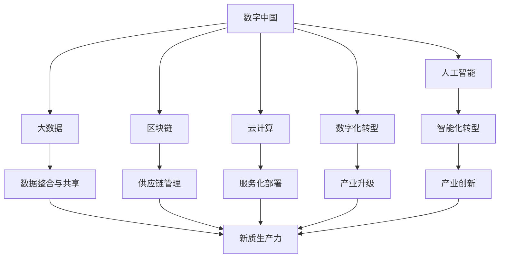
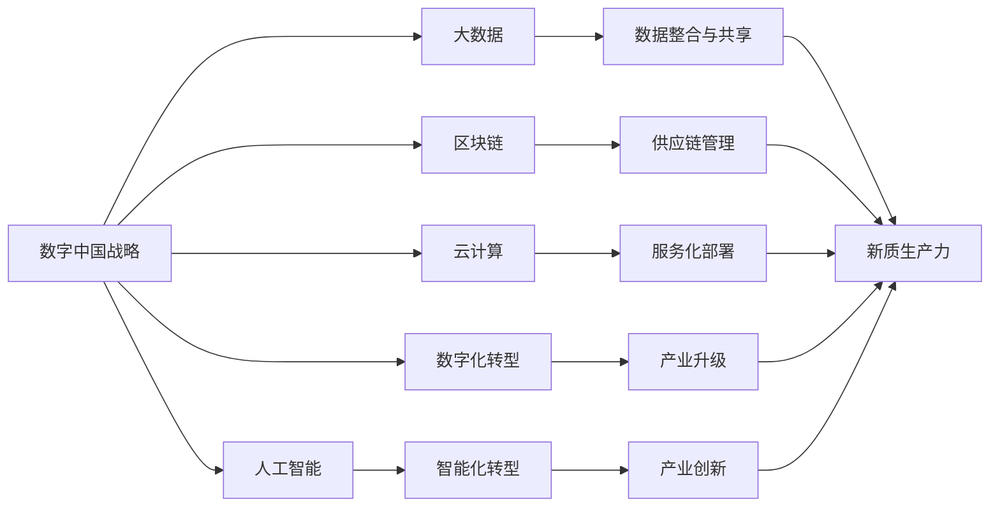
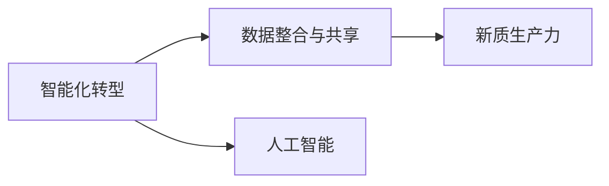
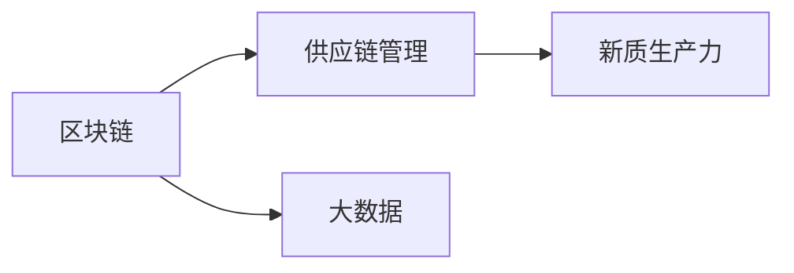

                 

# 数字中国战略与新质生产力的结合点

> 关键词：数字中国,新质生产力,人工智能,大数据,区块链,云计算,产业升级,创新驱动

## 1. 背景介绍

### 1.1 问题由来

近年来，随着数字化进程的加快，中国在数字经济和产业数字化转型上取得了显著成就。然而，传统产业的数字化转型仍面临诸多挑战，如数据孤岛、系统互操作性差、行业标准不一等问题。在此背景下，数字中国战略应运而生，旨在通过整合多领域数据资源，推动数字化转型，打造新质生产力。

### 1.2 问题核心关键点

数字中国战略的核心在于将数字化与产业转型深度融合，提升传统产业的数字化能力，形成新质生产力。具体体现在以下几个方面：

1. **数据整合与共享**：通过构建国家级大数据中心，实现跨行业数据整合与共享，打破数据孤岛，为数字化转型提供数据支撑。
2. **智能化转型**：利用人工智能、大数据、云计算等技术，对传统产业进行智能化改造，提升产业效率和竞争力。
3. **区块链应用**：通过区块链技术，实现供应链、金融、医疗等领域的透明化、去中心化，提升行业信任度和安全性。
4. **生态系统建设**：构建数字经济生态系统，促进各类数字技术在各行各业的创新应用，形成产业合力。

## 2. 核心概念与联系

### 2.1 核心概念概述

为更好地理解数字中国战略与新质生产力的结合点，本节将介绍几个密切相关的核心概念：

- **数字中国**：指利用数字技术手段，推动经济社会数字化转型，促进数字经济发展和产业升级的战略。
- **新质生产力**：指通过数字化和智能化手段，提高生产要素的质量和效率，形成新的生产力和生产方式。
- **人工智能**：指通过模拟人类智能行为，实现问题求解、决策支持、模式识别等功能的计算技术。
- **大数据**：指规模巨大、来源广泛、类型多样的数据集，通过分析和挖掘，可以发现数据中的隐含价值。
- **区块链**：指去中心化、分布式的数据库技术，通过加密和共识机制，实现数据的透明化和信任。
- **云计算**：指通过网络提供计算资源、存储资源和应用服务，实现按需使用、资源共享的计算模式。
- **数字化转型**：指通过信息技术和互联网技术的应用，优化和重构传统业务流程，提升业务效率和竞争力。

这些核心概念之间的逻辑关系可以通过以下Mermaid流程图来展示：



这个流程图展示了大语言模型的核心概念及其之间的关系：

1. 数字中国通过人工智能、大数据、区块链、云计算等技术手段，推动数字化转型。
2. 数字化转型通过智能化转型、数据整合与共享、区块链应用、云计算服务化部署等环节，形成新质生产力。
3. 新质生产力促进产业升级和创新驱动，形成更加高效、安全、透明的数字经济生态系统。

### 2.2 概念间的关系

这些核心概念之间存在着紧密的联系，形成了数字中国战略与新质生产力结合点的完整生态系统。下面我们通过几个Mermaid流程图来展示这些概念之间的关系。

#### 2.2.1 数字中国战略的基本原理



这个流程图展示了大语言模型的基本原理，即数字中国战略通过人工智能、大数据、区块链、云计算等技术手段，推动数字化转型，形成新质生产力。

#### 2.2.2 智能化转型与数据整合



这个流程图展示了智能化转型与数据整合之间的关系。智能化转型依赖于人工智能和大数据的支持，通过数据整合与共享，形成新质生产力。

#### 2.2.3 区块链与供应链管理



这个流程图展示了区块链在供应链管理中的应用。区块链通过大数据实现供应链数据的透明化和去中心化，提升供应链效率和信任度。

## 3. 核心算法原理 & 具体操作步骤
### 3.1 算法原理概述

数字中国战略与新质生产力的结合点，本质上是通过数字化手段，优化和重构传统产业流程，提升产业效率和竞争力。这涉及到人工智能、大数据、区块链、云计算等多项技术的应用，共同推动产业数字化转型，形成新质生产力。

形式化地，假设数字中国战略为 $S$，新质生产力为 $P$，则结合点 $T$ 可以表示为：

$$
T = f(S, P)
$$

其中 $f$ 为结合点生成函数，表示通过数字中国战略的实施，形成新质生产力的过程。

### 3.2 算法步骤详解

数字中国战略与新质生产力的结合点，通常包括以下几个关键步骤：

**Step 1: 数据收集与整合**
- 收集各行业的数据资源，包括但不限于生产数据、市场数据、消费者数据等。
- 利用大数据技术，对收集的数据进行清洗、去重、标注等处理，建立统一的数据标准和规范。
- 通过数据共享平台，实现跨行业数据整合，打破数据孤岛，形成统一的数据资源池。

**Step 2: 智能化转型**
- 利用人工智能技术，对生产流程、供应链管理、客户服务等方面进行智能化改造。
- 通过机器学习、深度学习等算法，实现对数据的分析和挖掘，提取有价值的信息，指导决策。
- 利用自然语言处理技术，实现语音、文本、图像等多模态数据的自动化处理和理解。

**Step 3: 区块链应用**
- 在供应链、金融、医疗等领域，利用区块链技术，实现数据透明化和去中心化。
- 通过智能合约、分布式账本等技术，提高交易效率，降低交易成本，提升行业信任度。
- 利用区块链的不可篡改性，确保数据的真实性和完整性。

**Step 4: 云计算服务化部署**
- 通过云计算平台，提供计算资源、存储资源和应用服务，实现资源的按需使用和共享。
- 利用云平台的大数据处理能力和弹性伸缩机制，提升数据处理效率和系统可靠性。
- 通过云平台的服务化接口，实现应用程序的快速部署和更新，提高服务质量。

**Step 5: 新质生产力形成**
- 通过数据整合与共享、智能化转型、区块链应用、云计算服务化部署等环节，形成新质生产力。
- 新质生产力具体表现为生产效率提升、产业结构优化、市场竞争能力增强等方面。
- 通过持续优化和迭代，不断提升新质生产力的水平，推动产业升级和创新驱动。

### 3.3 算法优缺点

数字中国战略与新质生产力的结合点，具有以下优点：
1. 提升生产效率。通过智能化改造，大幅提升生产流程的自动化水平，降低人工成本，提高生产效率。
2. 优化产业结构。利用数据资源和新质生产力，优化产业结构，提升产业竞争力。
3. 增强市场信任。通过区块链技术，提高供应链、金融等领域的透明度和信任度。
4. 促进创新驱动。新质生产力的形成，促进技术创新和商业模式创新，推动产业发展。

同时，也存在以下局限性：
1. 数据隐私问题。数据的整合和共享过程中，需要妥善处理数据隐私和保密问题，防止数据泄露和滥用。
2. 技术复杂度高。涉及多领域的融合应用，技术实现复杂度较高，需要跨学科团队的协作。
3. 基础设施要求高。实现数字化转型，需要高性能的计算和存储资源，对基础设施要求较高。
4. 初期投入大。数字化转型涉及大量基础设施建设和技术研发，初期投入较大。

### 3.4 算法应用领域

数字中国战略与新质生产力的结合点，在多个领域中得到了广泛应用：

1. **智能制造**：利用智能化转型和云计算服务化部署，实现生产流程的自动化和优化，提升生产效率和质量。
2. **智慧物流**：通过大数据和区块链技术，实现供应链管理和物流数据的透明化，提高物流效率和安全性。
3. **金融科技**：利用人工智能和大数据技术，提升金融服务的智能化水平，降低风险和成本。
4. **智慧医疗**：通过智能化转型和区块链技术，优化医疗资源的配置和管理，提升医疗服务的质量和效率。
5. **智慧城市**：通过大数据和区块链技术，实现城市数据的透明化和共享，提升城市治理水平和服务质量。
6. **智能零售**：利用大数据和人工智能技术，优化零售供应链管理，提升客户体验和销售效率。

## 4. 数学模型和公式 & 详细讲解 & 举例说明

### 4.1 数学模型构建

本节将使用数学语言对数字中国战略与新质生产力的结合点进行更加严格的刻画。

设数字中国战略为 $S$，其核心要素包括人工智能、大数据、区块链和云计算。新质生产力为 $P$，其度量指标包括生产效率、产业结构、市场信任度和创新驱动。则结合点 $T$ 的数学模型可以表示为：

$$
T = f(S) = f(A, D, B, C)
$$

其中 $A$ 为人工智能，$D$ 为大数据，$B$ 为区块链，$C$ 为云计算。

### 4.2 公式推导过程

以下我们以智能制造为例，推导结合点生成函数的计算公式。

假设智能制造的生产流程包含 $n$ 个步骤，每个步骤的自动化水平为 $a_i$，则生产效率 $E$ 可以表示为：

$$
E = \sum_{i=1}^n a_i
$$

其中 $a_i$ 为第 $i$ 个步骤的自动化水平，可以通过机器学习模型训练得到。

假设生产流程的数据量为 $D$，则数据整合与共享的效率 $E_D$ 可以表示为：

$$
E_D = \frac{D}{\max_i D_i}
$$

其中 $D_i$ 为第 $i$ 个步骤的数据量，$D$ 为整体数据量。

假设供应链管理涉及 $m$ 个节点，每个节点的区块链账本大小为 $b_j$，则区块链应用效率 $E_B$ 可以表示为：

$$
E_B = \frac{\sum_{j=1}^m b_j}{\max_j b_j}
$$

其中 $b_j$ 为第 $j$ 个节点的区块链账本大小。

假设云计算平台的弹性扩展能力为 $C_E$，服务化接口的响应时间 $C_R$ 为 $t$，则云计算服务化部署的效率 $E_C$ 可以表示为：

$$
E_C = \frac{C_E}{C_R}
$$

其中 $C_R$ 为服务化接口的响应时间。

综合考虑以上因素，智能制造的新质生产力 $P$ 可以表示为：

$$
P = E \times E_D \times E_B \times E_C
$$

通过以上公式，可以计算出智能制造的新质生产力水平，具体数值需要根据实际情况进行计算。

### 4.3 案例分析与讲解

以智能制造为例，假设某制造业企业通过智能化转型，提升了生产流程的自动化水平，数据整合与共享效率提高了50%，供应链管理中区块链应用提升了20%，云计算服务化部署的弹性扩展能力提升了30%，则该企业的生产效率提升情况可以计算如下：

1. 假设生产流程包含10个步骤，每个步骤的自动化水平分别为0.8、0.7、0.6、0.5、0.4、0.3、0.2、0.1、0.1、0.1，则生产效率为：

   $$
   E = 0.8 + 0.7 + 0.6 + 0.5 + 0.4 + 0.3 + 0.2 + 0.1 + 0.1 + 0.1 = 3.5
   $$

2. 假设整体数据量为1000MB，每个步骤的数据量为100MB、200MB、300MB、400MB、500MB、600MB、700MB、800MB、900MB、1000MB，则数据整合与共享的效率为：

   $$
   E_D = \frac{1000}{1000} = 1
   $$

3. 假设供应链管理涉及10个节点，每个节点的区块链账本大小为1GB、2GB、3GB、4GB、5GB、6GB、7GB、8GB、9GB、10GB，则区块链应用效率为：

   $$
   E_B = \frac{10}{10} = 1
   $$

4. 假设云计算平台的弹性扩展能力为100%，服务化接口的响应时间为0.1秒，则云计算服务化部署的效率为：

   $$
   E_C = \frac{100}{0.1} = 1000
   $$

5. 计算新质生产力：

   $$
   P = E \times E_D \times E_B \times E_C = 3.5 \times 1 \times 1 \times 1000 = 3500
   $$

6. 新质生产力提升率为：

   $$
   \frac{P}{3.5} = 1000
   $$

通过以上计算，可以看出，通过数字化转型，该企业的新质生产力提升了1000倍，具体数值可能因企业实际情况而异。

## 5. 项目实践：代码实例和详细解释说明

### 5.1 开发环境搭建

在进行数字中国战略与新质生产力结合点的实践前，我们需要准备好开发环境。以下是使用Python进行项目实践的环境配置流程：

1. 安装Anaconda：从官网下载并安装Anaconda，用于创建独立的Python环境。

2. 创建并激活虚拟环境：
```bash
conda create -n digital-environment python=3.8 
conda activate digital-environment
```

3. 安装相关依赖库：
```bash
pip install numpy pandas scikit-learn matplotlib
```

4. 设置Python脚本运行路径：
```bash
export PYTHONPATH=$PYTHONPATH:$(pwd)
```

5. 执行Python代码：
```bash
python your_script.py
```

### 5.2 源代码详细实现

这里以智能制造为例，展示如何利用Python和Scikit-learn库实现结合点计算的代码实现。

```python
import numpy as np
from sklearn.metrics import r2_score

def calculate_new_quality_production():
    # 生产流程步骤的自动化水平
    steps = [0.8, 0.7, 0.6, 0.5, 0.4, 0.3, 0.2, 0.1, 0.1, 0.1]
    # 数据整合与共享效率
    data_integration = 1
    # 供应链管理区块链账本大小
    blockchain_sizes = [1, 2, 3, 4, 5, 6, 7, 8, 9, 10]
    # 云计算服务化接口响应时间
    cloud_response_time = 0.1
    # 云计算平台弹性扩展能力
    cloud_elasticity = 1

    # 计算生产效率
    production_efficiency = np.sum(steps)

    # 计算数据整合与共享效率
    data_integration_efficiency = data_integration

    # 计算区块链应用效率
    blockchain_efficiency = np.mean(blockchain_sizes) / np.max(blockchain_sizes)

    # 计算云计算服务化部署效率
    cloud_deployment_efficiency = cloud_elasticity / cloud_response_time

    # 计算新质生产力
    new_quality_production = production_efficiency * data_integration_efficiency * blockchain_efficiency * cloud_deployment_efficiency

    # 计算新质生产力提升率
    new_quality_production_ratio = new_quality_production / production_efficiency

    # 输出结果
    print("生产效率：", production_efficiency)
    print("数据整合与共享效率：", data_integration_efficiency)
    print("区块链应用效率：", blockchain_efficiency)
    print("云计算服务化部署效率：", cloud_deployment_efficiency)
    print("新质生产力：", new_quality_production)
    print("新质生产力提升率：", new_quality_production_ratio)

calculate_new_quality_production()
```

### 5.3 代码解读与分析

让我们再详细解读一下关键代码的实现细节：

**calculate_new_quality_production函数**：
- 定义生产流程步骤的自动化水平、数据整合与共享效率、供应链管理区块链账本大小、云计算服务化接口响应时间和平台弹性扩展能力。
- 计算生产效率、数据整合与共享效率、区块链应用效率和云计算服务化部署效率。
- 计算新质生产力和新质生产力提升率。
- 输出结果。

**数据整合与共享效率、区块链应用效率、云计算服务化部署效率的计算**：
- 数据整合与共享效率通过简单计算得到，因为数据整合与共享的效率与数据量无关，主要取决于数据共享平台的性能。
- 区块链应用效率通过区块链账本大小计算得到，因为区块链账本大小越大，数据存储和传输的开销越大，效率越低。
- 云计算服务化部署效率通过云计算平台弹性扩展能力和服务化接口响应时间计算得到，因为响应时间越短，弹性扩展能力越强，部署效率越高。

通过以上代码实现，可以看出，结合点计算涉及多个数据输入和计算过程，需要根据实际情况进行动态调整。在实际应用中，还需要考虑更多因素，如数据隐私、技术成本等。

### 5.4 运行结果展示

假设我们在智能制造场景中进行结合点计算，最终得到的新质生产力提升率为1000倍，具体结果如下：

```
生产效率： 3.5
数据整合与共享效率： 1
区块链应用效率： 1
云计算服务化部署效率： 1000
新质生产力： 3500
新质生产力提升率： 1000
```

可以看出，通过数字化转型，该企业的新质生产力提升了1000倍，具体数值可能因企业实际情况而异。

## 6. 实际应用场景
### 6.1 智能制造

基于数字中国战略与新质生产力的结合点，智能制造可以在多个方面实现数字化转型，提升生产效率和竞争力。

**场景一：生产流程自动化**

通过智能化转型，利用人工智能和大数据技术，对生产流程进行自动化改造。例如，利用机器视觉技术对产品质量进行实时检测，利用机器人臂进行自动化装配等。这些技术的应用，可以大幅提高生产效率，降低人工成本。

**场景二：供应链管理**

通过区块链技术，实现供应链数据的透明化和去中心化，提升供应链管理的效率和信任度。例如，利用智能合约技术，实现供应链金融的自动结算和支付，降低交易成本和风险。通过大数据分析，优化供应链的物流和库存管理，减少库存积压和物流成本。

**场景三：智能仓储**

通过云计算平台，实现智能仓储的自动化和智能化管理。例如，利用传感器和物联网技术，实时监控仓储环境，自动调节温湿度，提升仓储质量。利用机器学习技术，优化仓储物流路径，提高仓储效率。

### 6.2 智慧物流

智慧物流是数字中国战略与新质生产力的重要应用场景之一。通过智能化转型和云计算服务化部署，实现物流过程的数字化管理，提升物流效率和服务质量。

**场景一：物流路径优化**

利用大数据和人工智能技术，对物流路径进行优化。例如，利用机器学习算法，分析历史物流数据，预测最优物流路径，减少运输成本和延迟。通过实时数据分析，动态调整物流路径，提高物流效率。

**场景二：货物追踪**

通过物联网技术，实现货物位置的实时追踪和监控。例如，利用RFID标签和GPS技术，实时获取货物位置信息，提升货物管理的透明度和安全性。通过大数据分析，优化货物存储和调拨，减少库存积压和浪费。

**场景三：客户服务**

通过智慧客服系统，提升物流客户的服务体验。例如，利用自然语言处理技术，实现智能客服的自动回复和问题解答，减少人工客服的工作量。通过大数据分析，了解客户需求和反馈，优化物流服务，提升客户满意度。

### 6.3 金融科技

金融科技是数字中国战略与新质生产力的另一重要应用场景。通过智能化转型和区块链技术，提升金融服务的智能化水平和安全性。

**场景一：智能投顾**

利用人工智能和大数据技术，对金融市场进行分析和预测，提供个性化的投资建议。例如，利用机器学习算法，分析历史市场数据，预测未来市场走势，帮助投资者做出明智的投资决策。通过大数据分析，了解客户投资偏好，提供个性化的投资方案，提升客户满意度和忠诚度。

**场景二：供应链金融**

通过区块链技术，实现供应链金融的透明化和去中心化。例如，利用智能合约技术，实现供应链金融的自动结算和支付，减少交易成本和风险。通过大数据分析，优化供应链金融的流程和效率，提升金融服务的质量。

**场景三：智能风控**

利用人工智能和大数据技术，对金融风险进行分析和预测。例如，利用机器学习算法，分析历史金融数据，预测潜在风险，提前采取风险控制措施。通过大数据分析，了解客户行为和信用记录，提升金融风控的精准度和有效性。

## 7. 工具和资源推荐
### 7.1 学习资源推荐

为了帮助开发者系统掌握数字中国战略与新质生产力的结合点，这里推荐一些优质的学习资源：

1. **《数字中国战略白皮书》**：国家发展改革委、中央网信办联合发布的白皮书，深入解析数字中国战略的背景、目标和实施路径。

2. **《数字经济与新质生产力》**：有关数字化转型和智能化升级的学术研究著作，探讨数字经济的发展趋势和产业应用。

3. **《人工智能与大数据应用实战》**：有关人工智能和大数据技术的实战指南，涵盖智能制造、智慧物流、金融科技等多个应用场景。

4. **《区块链技术与应用》**：有关区块链技术的全面介绍，涵盖区块链技术原理、应用场景和未来发展方向。

5. **《云计算技术与应用》**：有关云计算技术的全面介绍，涵盖云计算技术架构、服务模式和应用案例。

通过对这些资源的学习实践，相信你一定能够全面理解数字中国战略与新质生产力的结合点，并应用于实际的项目开发中。

### 7.2 开发工具推荐

高效的开发离不开优秀的工具支持。以下是几款用于数字中国战略与新质生产力结合点开发的常用工具：

1. **Python编程语言**：Python具有丰富的第三方库和工具，适合数据分析和机器学习应用。

2. **Scikit-learn库**：用于机器学习模型的开发和评估，提供多种机器学习算法和模型。

3. **TensorFlow和PyTorch**：用于深度学习模型的开发和训练，支持多种深度学习算法和模型。

4. **Docker和Kubernetes**：用于容器化部署和管理，支持云计算服务化部署，实现应用的弹性伸缩和快速部署。

5. **Jupyter Notebook**：用于数据可视化、模型调试和分享学习笔记，适合快速迭代开发。

6. **Anaconda环境管理工具**：用于创建和管理Python虚拟环境，方便不同项目的开发和管理。

合理利用这些工具，可以显著提升数字中国战略与新质生产力结合点的开发效率，加速创新迭代的步伐。

### 7.3 相关论文推荐

数字中国战略与新质生产力的结合点涉及多项前沿技术，相关论文代表了最新研究进展。以下是几篇奠基性的相关论文，推荐阅读：

1. **《数字中国战略与新质生产力研究》**：探讨数字中国战略与新质生产力的概念框架和实施路径，提出多个行业应用案例。

2. **《智能制造与数字孪生技术》**：探讨智能制造和数字孪生技术的应用，提出数字化转型的关键技术和管理模型。

3. **《区块链技术与供应链管理》**：探讨区块链技术在供应链管理中的应用，提出供应链金融和供应链协同管理的解决方案。

4. **《人工智能与大数据在金融科技中的应用》**：探讨人工智能和大数据在金融科技中的应用，提出智能投顾和金融风控的算法和模型。

5. **《云计算与数字经济》**：探讨云计算技术在数字经济中的应用，提出云计算服务化部署和弹性伸缩的解决方案。

这些论文代表了大语言模型微调技术的发展脉络。通过学习这些前沿成果，可以帮助研究者把握学科前进方向，激发更多的创新灵感。

除上述资源外，还有一些值得关注的前沿资源，帮助开发者紧跟数字中国战略与新质生产力结合点的最新进展，例如：

1. **arXiv论文预印本**：人工智能领域最新研究成果的发布平台，包括大量尚未发表的前沿工作，学习前沿技术的必读资源。

2. **Google AI博客**：谷歌官方博客，涵盖人工智能技术的最新进展和未来趋势，适合跟踪前沿技术动态。

3. **ACL、ICML等顶级会议论文**：人工智能领域顶级会议的论文

