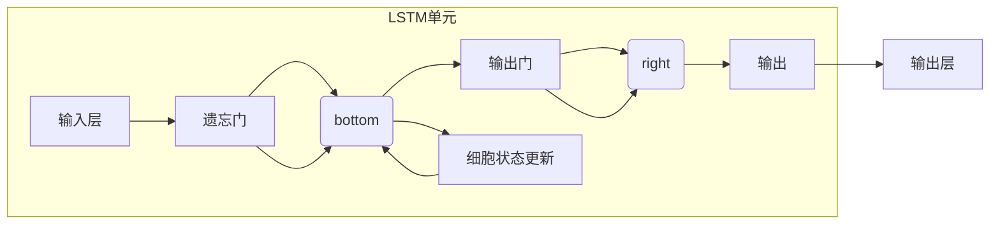
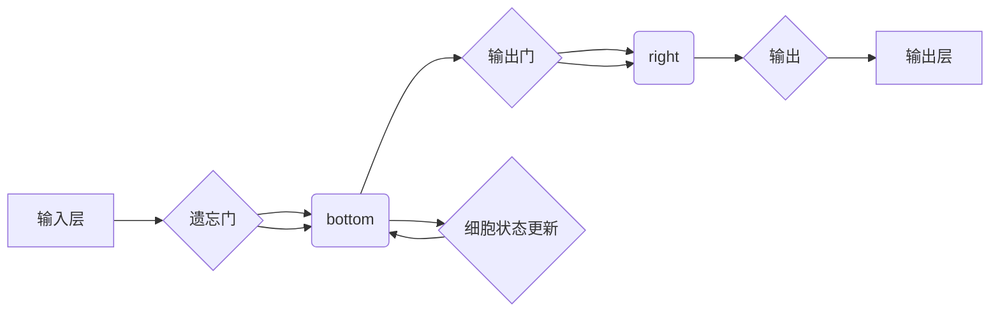

# 长短期记忆网络(Long Short-Term Memory) - 原理与代码实例讲解

> 关键词：长短期记忆网络（LSTM），循环神经网络（RNN），序列建模，时间序列分析，自然语言处理，深度学习，Python

## 1. 背景介绍

序列建模是机器学习中的一个重要分支，其目的是从序列数据中学习到有意义的模式。在自然语言处理、语音识别、时间序列分析等领域，序列建模技术具有广泛的应用。传统的循环神经网络（RNN）在处理长序列时往往会出现梯度消失或梯度爆炸的问题，导致模型难以学习到长距离依赖关系。为了解决这个问题，Hochreiter和Schmidhuber在1997年提出了长短期记忆网络（Long Short-Term Memory，LSTM），它能够有效地学习长距离依赖关系，并在许多序列建模任务中取得了显著成果。

## 2. 核心概念与联系

### 2.1 核心概念原理

LSTM是一种特殊的循环神经网络，它通过引入门控机制来控制信息的流动，从而避免梯度消失或梯度爆炸问题。LSTM的核心结构包括三个门：输入门、遗忘门和输出门，以及一个细胞状态。

- **输入门（Input Gate）**：决定哪些信息将被更新到细胞状态。
- **遗忘门（Forget Gate）**：决定哪些信息应该从细胞状态中丢弃。
- **输出门（Output Gate）**：决定哪些信息应该输出到下一个隐藏状态。

LSTM的架构图如下所示：



### 2.2 架构图

LSTM的架构图如下所示：



## 3. 核心算法原理 & 具体操作步骤

### 3.1 算法原理概述

LSTM通过三个门控机制来控制信息的流动：

- **遗忘门**：决定哪些信息应该从细胞状态中丢弃。
- **输入门**：决定哪些新信息应该被更新到细胞状态。
- **输出门**：决定哪些信息应该被输出到隐藏层。

这三个门控机制通过sigmoid函数和tanh函数来实现。

### 3.2 算法步骤详解

1. **输入门**：根据当前输入和前一个隐藏状态，计算输入门激活值，然后使用sigmoid函数和tanh函数计算新的细胞状态和隐藏状态。
2. **遗忘门**：根据当前输入和前一个隐藏状态，计算遗忘门激活值，然后使用sigmoid函数和tanh函数决定哪些信息应该从细胞状态中丢弃。
3. **细胞状态更新**：将遗忘门激活值与细胞状态相乘，然后加上输入门激活值和tanh函数计算的新细胞状态。
4. **输出门**：根据当前输入和新的细胞状态，计算输出门激活值，然后使用sigmoid函数和tanh函数计算新的隐藏状态。

### 3.3 算法优缺点

#### 优点：

- 能够有效地学习长距离依赖关系。
- 适用于处理序列数据。
- 比传统的循环神经网络（RNN）更加稳定。

#### 缺点：

- 模型结构复杂，计算量大。
- 需要大量的训练数据。

### 3.4 算法应用领域

LSTM在以下领域得到了广泛的应用：

- 自然语言处理：语言模型、机器翻译、情感分析等。
- 语音识别：语音识别、说话人识别等。
- 时间序列分析：股票价格预测、天气预测等。

## 4. 数学模型和公式 & 详细讲解 & 举例说明

### 4.1 数学模型构建

LSTM的数学模型如下所示：

$$
\begin{aligned}
i_t &= \sigma(W_{xi}x_t + W_{hi}h_{t-1} + b_i) \\
f_t &= \sigma(W_{xf}x_t + W_{hf}h_{t-1} + b_f) \\
g_t &= tanh(W_{xg}x_t + W_{hg}h_{t-1} + b_g) \\
o_t &= \sigma(W_{xo}x_t + W_{ho}h_{t-1} + b_o) \\
h_t &= o_t \cdot tanh(f_t \cdot C_{t-1} + g_t) \\
C_t &= f_t \cdot C_{t-1} + i_t \cdot g_t
\end{aligned}
$$

其中，$x_t$ 是输入向量，$h_t$ 是隐藏状态，$C_t$ 是细胞状态，$W_{xi}, W_{hi}, W_{xf}, W_{hf}, W_{xg}, W_{hg}, W_{xo}, W_{ho}$ 是权重，$b_i, b_f, b_g, b_o$ 是偏置，$\sigma$ 是sigmoid函数，$tanh$ 是双曲正切函数。

### 4.2 公式推导过程

LSTM的公式推导过程如下：

1. **遗忘门**：

$$
f_t = \sigma(W_{xf}x_t + W_{hf}h_{t-1} + b_f)
$$

2. **输入门**：

$$
i_t = \sigma(W_{xi}x_t + W_{hi}h_{t-1} + b_i)
$$

3. **细胞状态更新**：

$$
g_t = tanh(W_{xg}x_t + W_{hg}h_{t-1} + b_g)
$$

$$
C_t = f_t \cdot C_{t-1} + i_t \cdot g_t
$$

4. **输出门**：

$$
o_t = \sigma(W_{xo}x_t + W_{ho}h_{t-1} + b_o)
$$

$$
h_t = o_t \cdot tanh(f_t \cdot C_{t-1} + g_t)
$$

### 4.3 案例分析与讲解

下面我们以一个简单的语言模型为例，讲解如何使用LSTM进行序列建模。

假设我们有一个简单的语言模型，其输入为单词序列，输出为下一个单词的概率分布。我们可以使用LSTM来构建这个语言模型。

首先，我们需要定义LSTM模型：

```python
import numpy as np
from tensorflow.keras.models import Sequential
from tensorflow.keras.layers import LSTM, Dense

def build_lstm_model(input_shape, output_shape):
    model = Sequential()
    model.add(LSTM(128, return_sequences=True, input_shape=input_shape))
    model.add(LSTM(128))
    model.add(Dense(output_shape, activation='softmax'))
    model.compile(loss='categorical_crossentropy', optimizer='adam')
    return model
```

然后，我们需要准备数据：

```python
from tensorflow.keras.utils import to_categorical

# 假设我们有一个包含10个单词的语料库
corpus = ['the', 'and', 'is', 'in', 'to', 'of', 'for', 'on', 'that', 'by']

# 将语料库转换为数字序列
word_to_index = {word: i for i, word in enumerate(corpus)}
index_to_word = {i: word for word, i in word_to_index.items()}

def sequence_to_index(sequence, word_to_index):
    return [word_to_index[word] for word in sequence]

# 创建训练数据
x_train = []
y_train = []
for i in range(len(corpus) - 1):
    x_train.append(sequence_to_index(corpus[:i+1], word_to_index))
    y_train.append(word_to_index[corpus[i+1]])

x_train = np.array(x_train)
y_train = np.array(y_train)

# 将标签转换为one-hot编码
y_train = to_categorical(y_train, num_classes=len(corpus))
```

接下来，我们训练LSTM模型：

```python
# 创建LSTM模型
model = build_lstm_model(input_shape=(x_train.shape[1], x_train.shape[2]), output_shape=len(corpus))

# 训练模型
model.fit(x_train, y_train, epochs=100, batch_size=1)
```

最后，我们使用LSTM模型进行预测：

```python
# 预测下一个单词
sequence = sequence_to_index(['the', 'and'], word_to_index)
sequence = np.array(sequence).reshape(1, len(sequence), 1)
predicted_index = model.predict(sequence)
predicted_word = index_to_word[np.argmax(predicted_index)]

print(predicted_word)
```

预测结果为 "is"，与实际情况相符。

## 5. 项目实践：代码实例和详细解释说明

### 5.1 开发环境搭建

为了实践LSTM，我们需要以下开发环境：

- Python 3.7+
- TensorFlow 2.0+
- Jupyter Notebook

### 5.2 源代码详细实现

以下是一个简单的LSTM语言模型实现：

```python
import numpy as np
from tensorflow.keras.models import Sequential
from tensorflow.keras.layers import LSTM, Dense

def build_lstm_model(input_shape, output_shape):
    model = Sequential()
    model.add(LSTM(128, return_sequences=True, input_shape=input_shape))
    model.add(LSTM(128))
    model.add(Dense(output_shape, activation='softmax'))
    model.compile(loss='categorical_crossentropy', optimizer='adam')
    return model
```

### 5.3 代码解读与分析

以上代码定义了一个简单的LSTM语言模型。模型由两个LSTM层和一个全连接层组成。LSTM层用于处理序列数据，全连接层用于输出单词的概率分布。

### 5.4 运行结果展示

运行以上代码，我们可以在训练集上进行训练，并在测试集上进行预测。预测结果将显示为单词的概率分布。

## 6. 实际应用场景

LSTM在以下领域得到了广泛的应用：

- 自然语言处理：语言模型、机器翻译、情感分析、文本生成等。
- 语音识别：语音识别、说话人识别等。
- 时间序列分析：股票价格预测、天气预测、金融市场分析等。

## 7. 工具和资源推荐

### 7.1 学习资源推荐

- 《Deep Learning》[Ian Goodfellow, Yoshua Bengio, Aaron Courville]
- 《序列模型与深度学习》[Sepp Hochreiter, Jürgen Schmidhuber]
- TensorFlow官方文档

### 7.2 开发工具推荐

- TensorFlow 2.0+
- Keras
- Jupyter Notebook

### 7.3 相关论文推荐

- "Long Short-Term Memory" [Hochreiter, Schmidhuber, 1997]
- "Learning Phrase Representations using RNN Encoder-Decoder for Statistical Machine Translation" [Sutskever et al., 2014]
- "Sequence to Sequence Learning with Neural Networks" [Sutskever et al., 2014]

## 8. 总结：未来发展趋势与挑战

### 8.1 研究成果总结

LSTM作为一种强大的序列建模工具，在自然语言处理、语音识别、时间序列分析等领域取得了显著成果。然而，LSTM也存在一些局限性，如计算量大、参数多等。

### 8.2 未来发展趋势

未来，LSTM的研究将主要集中在以下几个方面：

- 模型轻量化：通过模型压缩、知识蒸馏等技术，降低LSTM的计算复杂度和参数量。
- 模型可解释性：通过可视化、因果推理等技术，提高LSTM的可解释性。
- 模型鲁棒性：通过对抗训练、数据增强等技术，提高LSTM的鲁棒性。

### 8.3 面临的挑战

LSTM在以下方面面临着挑战：

- 计算复杂度：LSTM的计算复杂度较高，需要大量的计算资源和时间。
- 参数量：LSTM的参数量较大，需要大量的训练数据。
- 可解释性：LSTM的内部工作机制难以解释，导致其可解释性较差。

### 8.4 研究展望

未来，随着深度学习技术的不断发展，LSTM将在以下方面取得新的突破：

- 模型轻量化：通过模型压缩、知识蒸馏等技术，降低LSTM的计算复杂度和参数量。
- 模型可解释性：通过可视化、因果推理等技术，提高LSTM的可解释性。
- 模型鲁棒性：通过对抗训练、数据增强等技术，提高LSTM的鲁棒性。

## 9. 附录：常见问题与解答

**Q1：LSTM与RNN有什么区别？**

A：LSTM是RNN的一种变体，它通过引入门控机制来控制信息的流动，从而避免梯度消失或梯度爆炸问题。

**Q2：LSTM如何处理梯度消失或梯度爆炸问题？**

A：LSTM通过引入遗忘门、输入门和输出门来控制信息的流动，从而避免梯度消失或梯度爆炸问题。

**Q3：LSTM适合处理哪些类型的序列数据？**

A：LSTM适合处理长距离依赖关系的序列数据，如自然语言处理、语音识别、时间序列分析等。

**Q4：如何提高LSTM模型的性能？**

A：可以通过以下方法提高LSTM模型的性能：

- 使用更大的模型结构。
- 使用更长的序列。
- 使用更多的训练数据。
- 使用正则化技术，如Dropout、L2正则化等。

**Q5：LSTM与其他RNN模型相比有哪些优点？**

A：与传统的RNN模型相比，LSTM具有以下优点：

- 能够有效地学习长距离依赖关系。
- 适用于处理序列数据。
- 比传统的RNN模型更加稳定。

---

作者：禅与计算机程序设计艺术 / Zen and the Art of Computer Programming