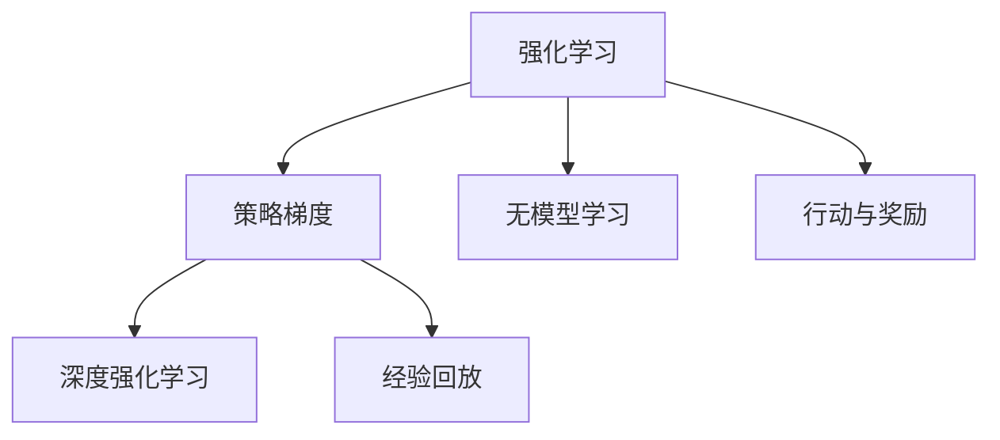
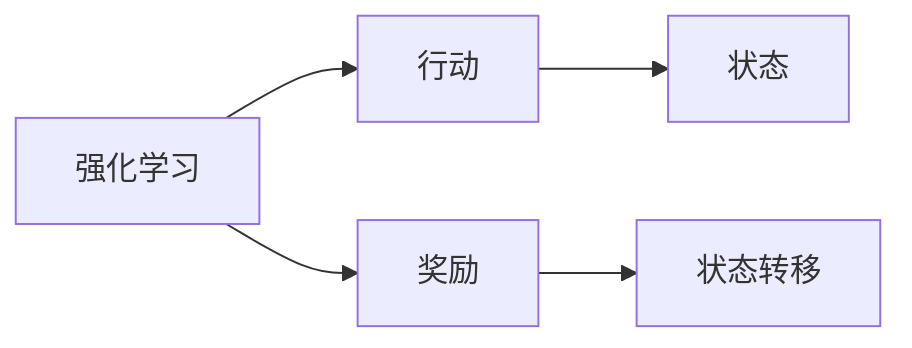
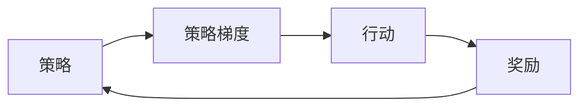
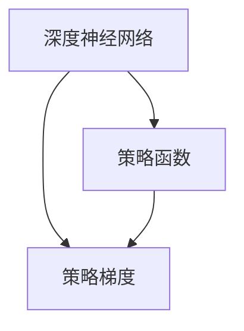
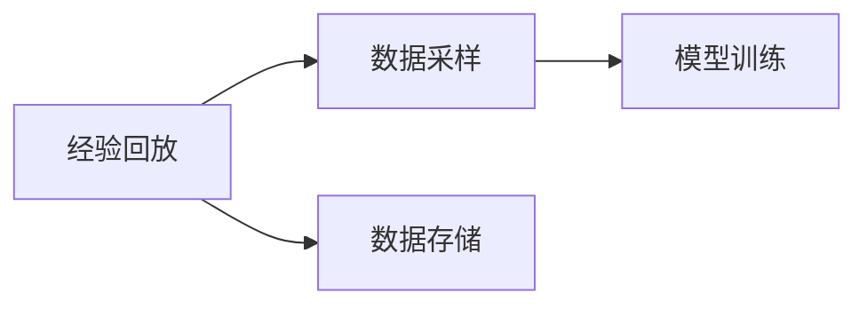
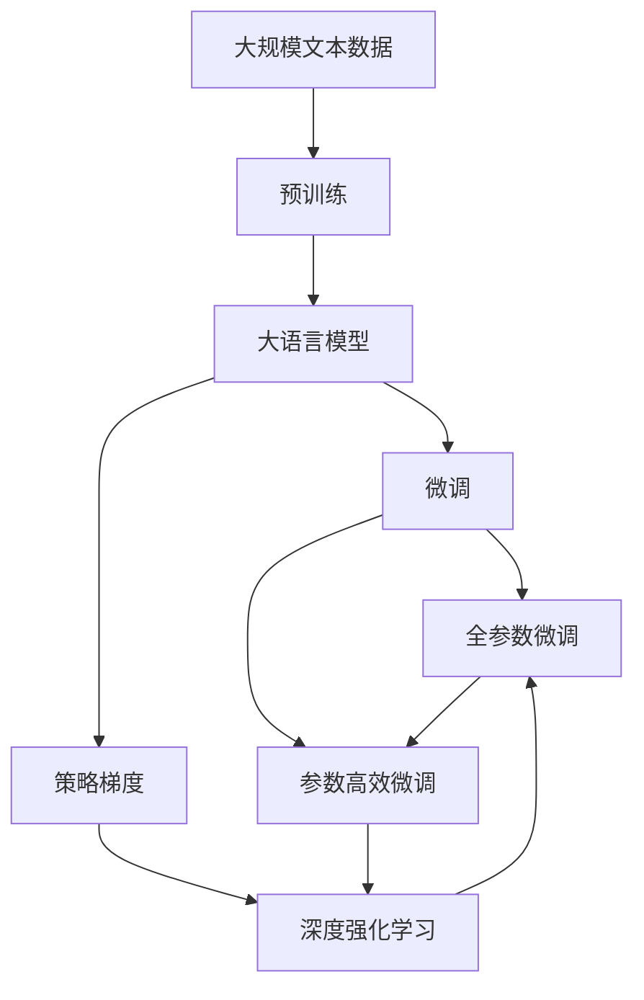

                 

# 强化学习算法：策略梯度 (Policy Gradient) 原理与代码实例讲解

> 关键词：强化学习, 策略梯度, 策略优化, 无模型学习, 深度强化学习

## 1. 背景介绍

### 1.1 问题由来
强化学习 (Reinforcement Learning, RL) 是机器学习领域的一个重要分支，旨在使智能体（agent）通过与环境交互，学习如何在不同状态下采取最优的行动策略，以最大化长期累积奖励。

策略梯度算法（Policy Gradient, PG）是强化学习中的一类重要方法，主要解决的是连续空间或高维空间中策略优化的问题。其核心思想是通过梯度上升的方式，优化智能体的策略函数，以获得最优的行动策略。

PG算法主要应用于无模型学习和连续空间中的策略优化，近年来在深度强化学习领域取得了巨大的进展。通过将深度神经网络引入策略函数，PG算法可以有效地处理高维、非线性等复杂任务。

### 1.2 问题核心关键点
策略梯度算法通过梯度上升的方式，优化智能体的策略函数，以获得最优的行动策略。其关键点包括：

- 策略梯度公式：用于计算策略梯度，指导策略的优化方向。
- 神经网络策略：通过神经网络表示策略，解决连续空间优化问题。
- 无模型学习：不需要显式地建模环境模型，通过直接对策略进行优化。
- 行动与奖励：行动与环境的互动过程，以及最终获得的奖励信号。
- 经验回放（Experience Replay）：对历史互动数据进行采样和重放，提高训练效率和泛化能力。

### 1.3 问题研究意义
策略梯度算法为解决复杂强化学习问题提供了一种有效的方法。其应用领域广泛，包括游戏AI、机器人控制、自动驾驶、智能推荐等。在学术界和工业界都有着重要的地位。

了解PG算法的原理和实现方法，对于深入掌握强化学习技术，推动实际应用的落地，具有重要的意义。

## 2. 核心概念与联系

### 2.1 核心概念概述

为更好地理解策略梯度算法，本节将介绍几个密切相关的核心概念：

- 强化学习：使智能体通过与环境交互，学习最优策略的过程。
- 策略梯度：通过梯度上升的方式，优化策略函数，以获得最优策略。
- 无模型学习：不需要显式地建模环境模型，直接对策略进行优化。
- 深度强化学习：将深度神经网络引入策略函数，以处理高维、非线性等复杂问题。
- 行动与奖励：行动与环境的互动过程，以及最终获得的奖励信号。
- 经验回放：对历史互动数据进行采样和重放，提高训练效率和泛化能力。

这些核心概念之间的逻辑关系可以通过以下Mermaid流程图来展示：



这个流程图展示了大语言模型的核心概念及其之间的关系：

1. 强化学习是智能体的学习过程。
2. 策略梯度是优化策略的方式。
3. 无模型学习是优化策略的一种方式。
4. 深度强化学习是处理复杂问题的方法。
5. 行动与奖励是智能体与环境互动的结果。
6. 经验回放是提高训练效率的策略。

这些核心概念共同构成了策略梯度算法的完整生态系统，使其能够在各种场景下发挥强大的学习能力。通过理解这些核心概念，我们可以更好地把握策略梯度算法的学习原理和优化方向。

### 2.2 概念间的关系

这些核心概念之间存在着紧密的联系，形成了策略梯度算法的完整生态系统。下面我通过几个Mermaid流程图来展示这些概念之间的关系。

#### 2.2.1 强化学习的学习范式



这个流程图展示了强化学习的基本原理，即智能体通过与环境互动，根据行动和奖励调整策略，实现学习过程。

#### 2.2.2 策略梯度的优化过程



这个流程图展示了策略梯度算法的优化过程，即通过梯度上升的方式，优化策略函数，以获得最优策略。

#### 2.2.3 深度强化学习的实现方式



这个流程图展示了深度强化学习的基本实现方式，即通过深度神经网络表示策略函数，以处理高维、非线性等复杂问题。

#### 2.2.4 无模型学习的优势


这个流程图展示了无模型学习的基本优势，即不需要显式地建模环境模型，直接对策略进行优化。

#### 2.2.5 经验回放的方法



这个流程图展示了经验回放的基本方法，即对历史互动数据进行采样和重放，提高训练效率和泛化能力。

### 2.3 核心概念的整体架构

最后，我们用一个综合的流程图来展示这些核心概念在大语言模型微调过程中的整体架构：



这个综合流程图展示了从预训练到微调，再到策略梯度优化过程的完整过程。大语言模型首先在大规模文本数据上进行预训练，然后通过微调（包括全参数微调和参数高效微调）进行优化，同时利用策略梯度算法进一步提升模型的性能。最后，通过深度强化学习技术，模型能够更好地处理复杂任务，提高智能体的决策能力。

## 3. 核心算法原理 & 具体操作步骤
### 3.1 算法原理概述

策略梯度算法通过梯度上升的方式，优化智能体的策略函数，以获得最优的行动策略。其核心思想是通过梯度上升的方式，最大化策略函数下的累积奖励。

形式化地，假设智能体在每个时间步 $t$ 采取行动 $a_t$，获得状态 $s_t$ 和奖励 $r_t$，策略函数 $\pi$ 输出行动概率分布 $p(a_t|s_t)$。策略梯度算法通过最大化策略函数的期望奖励，来优化策略 $\pi$：

$$
\theta^* = \mathop{\arg\max}_{\theta} \mathbb{E}_{s \sim \rho} \left[\sum_{t=0}^{\infty} \gamma^t r_{t+1} \right]
$$

其中 $\rho$ 是智能体在状态空间中的分布，$\gamma$ 是折扣因子，用于考虑未来奖励的权重。

### 3.2 算法步骤详解

策略梯度算法一般包括以下几个关键步骤：

**Step 1: 初始化参数**

- 初始化策略函数 $\pi$ 的参数 $\theta$，通常使用随机初始化。

**Step 2: 策略评估**

- 在每个时间步 $t$，根据策略 $\pi$ 输出行动概率分布 $p(a_t|s_t)$，采取行动 $a_t$，观察状态 $s_{t+1}$ 和奖励 $r_{t+1}$。

**Step 3: 梯度计算**

- 计算当前时间步的累积奖励 $G_t = \sum_{i=t}^{\infty} \gamma^{i-t} r_i$。
- 根据策略函数 $\pi$ 计算行动概率 $p(a_t|s_t)$。
- 计算策略梯度 $\nabla_\theta J(\theta)$，指导策略的优化方向。

**Step 4: 策略优化**

- 使用梯度上升方法（如SGD），更新策略函数的参数 $\theta$。

**Step 5: 迭代循环**

- 重复执行步骤2-4，直至策略收敛或达到预设迭代次数。

### 3.3 算法优缺点

策略梯度算法具有以下优点：

- 不需要显式地建模环境模型，可以直接对策略进行优化。
- 适用于高维、非线性的策略优化问题。
- 可以处理连续空间中的策略优化。
- 可以通过深度神经网络表示策略，解决复杂问题。

同时，该算法也存在以下缺点：

- 存在梯度方差问题，需要引入重放缓冲区等技术缓解。
- 需要较多的数据样本，且对数据质量要求较高。
- 可能出现样本效率低下的问题，如探索-利用（exploration-exploitation）的平衡。
- 收敛速度较慢，可能陷入局部最优。

### 3.4 算法应用领域

策略梯度算法在多个领域得到了广泛应用，例如：

- 游戏AI：通过优化游戏智能体的策略，提升游戏表现。
- 机器人控制：通过优化机器人控制策略，实现自动化操作。
- 自动驾驶：通过优化驾驶策略，实现安全、高效的自动驾驶。
- 智能推荐：通过优化推荐策略，提高用户满意度。

此外，策略梯度算法也被创新性地应用到更多场景中，如金融预测、医疗诊断、供应链优化等，为智能决策提供了新的方法。

## 4. 数学模型和公式 & 详细讲解 & 举例说明

### 4.1 数学模型构建

假设智能体在每个时间步 $t$ 采取行动 $a_t$，获得状态 $s_t$ 和奖励 $r_t$，策略函数 $\pi$ 输出行动概率分布 $p(a_t|s_t)$。策略梯度算法通过最大化策略函数的期望奖励，来优化策略 $\pi$：

$$
\theta^* = \mathop{\arg\max}_{\theta} \mathbb{E}_{s \sim \rho} \left[\sum_{t=0}^{\infty} \gamma^t r_{t+1} \right]
$$

其中 $\rho$ 是智能体在状态空间中的分布，$\gamma$ 是折扣因子，用于考虑未来奖励的权重。

### 4.2 公式推导过程

根据上述目标，策略梯度算法需要求解最大化策略函数的期望奖励：

$$
J(\theta) = \mathbb{E}_{s \sim \rho} \left[\sum_{t=0}^{\infty} \gamma^t r_{t+1} \right]
$$

将 $J(\theta)$ 展开并使用蒙特卡罗方法进行估计：

$$
J(\theta) = \mathbb{E}_{s \sim \rho} \left[\sum_{t=0}^{\infty} \gamma^t r_{t+1} \right] = \sum_{t=0}^{\infty} \gamma^t \mathbb{E}[r_{t+1}|s_t]
$$

进一步化简，得到策略梯度公式：

$$
\nabla_\theta J(\theta) = \mathbb{E}_{s \sim \rho} \left[ \nabla_\theta \log \pi(a_t|s_t) Q^\pi(s_t,a_t) \right]
$$

其中 $Q^\pi(s_t,a_t)$ 为策略函数下的状态-行动价值函数。

### 4.3 案例分析与讲解

以机器人控制为例，假设机器人在一个2D平面上移动，目标是到达指定目标点。智能体根据当前状态 $s_t$ 和目标状态 $s'$ 采取行动 $a_t$，获得状态 $s_{t+1}$ 和奖励 $r_t$。使用策略梯度算法优化智能体的控制策略。

1. **状态表示**：将2D平面表示为状态空间，每个状态由 $(x,y)$ 坐标表示。

2. **行动表示**：定义行动空间，如左、右、上、下等动作。

3. **策略函数**：使用神经网络表示智能体的控制策略，输出行动概率分布。

4. **状态-行动价值函数**：通过蒙特卡罗方法，估计策略函数下的状态-行动价值函数 $Q^\pi(s_t,a_t)$。

5. **策略梯度计算**：根据策略梯度公式，计算策略梯度 $\nabla_\theta J(\theta)$。

6. **策略优化**：使用梯度上升方法（如SGD），更新策略函数的参数 $\theta$。

通过不断迭代，优化智能体的控制策略，最终使机器人能够高效、安全地到达指定目标点。

## 5. 项目实践：代码实例和详细解释说明

### 5.1 开发环境搭建

在进行策略梯度算法实践前，我们需要准备好开发环境。以下是使用Python进行PyTorch开发的环境配置流程：

1. 安装Anaconda：从官网下载并安装Anaconda，用于创建独立的Python环境。

2. 创建并激活虚拟环境：
```bash
conda create -n pg-env python=3.8 
conda activate pg-env
```

3. 安装PyTorch：根据CUDA版本，从官网获取对应的安装命令。例如：
```bash
conda install pytorch torchvision torchaudio cudatoolkit=11.1 -c pytorch -c conda-forge
```

4. 安装PyTorch Lightning：用于自动化管理训练过程，方便调参和部署。
```bash
pip install pytorch-lightning
```

5. 安装TensorBoardX：用于可视化训练过程和结果。
```bash
pip install tensorboardX
```

6. 安装 Gym 库：用于模拟游戏AI实验环境。
```bash
pip install gym
```

完成上述步骤后，即可在`pg-env`环境中开始策略梯度算法的开发。

### 5.2 源代码详细实现

下面我们以游戏AI（如Atari游戏）为例，给出使用PyTorch和PyTorch Lightning进行策略梯度算法实验的代码实现。

首先，定义智能体的状态和行动空间：

```python
import gym
import torch
from torch import nn
from torch.optim import Adam

# 加载游戏环境
env = gym.make('CartPole-v1')

# 定义状态和行动空间
obs_dim = env.observation_space.shape[0]
act_dim = env.action_space.n

# 定义神经网络策略
class Policy(nn.Module):
    def __init__(self, obs_dim, act_dim):
        super(Policy, self).__init__()
        self.fc1 = nn.Linear(obs_dim, 64)
        self.fc2 = nn.Linear(64, act_dim)

    def forward(self, x):
        x = torch.relu(self.fc1(x))
        x = self.fc2(x)
        return x

# 定义策略梯度算法
class PG:
    def __init__(self, obs_dim, act_dim, lr):
        self.policy = Policy(obs_dim, act_dim)
        self.optimizer = Adam(self.policy.parameters(), lr)

    def forward(self, obs):
        return self.policy(torch.tensor(obs).float())

    def loss(self, obs, act, rew):
        preds = self.forward(obs)
        loss = -torch.mean(torch.log(preds) * rew)
        return loss

    def update(self, obs, act, rew):
        self.optimizer.zero_grad()
        loss = self.loss(obs, act, rew)
        loss.backward()
        self.optimizer.step()
```

然后，定义训练函数：

```python
import torch
from torch.utils.data import DataLoader
from tqdm import tqdm

# 训练函数
def train(env, pg, episodes=1000, batch_size=32):
    total_rew = 0
    for episode in range(episodes):
        obs = env.reset()
        episode_rew = 0
        for t in range(1000):
            preds = pg.forward(obs)
            act = torch.multinomial(preds, 1)[0].item()
            rew = env.render(mode='rgb_array')
            next_obs, done, info = env.step(act)
            episode_rew += rew
            pg.update(obs, act, rew)
            obs = next_obs
            if done:
                total_rew += episode_rew
                break
    print(f'Epoch {episode+1}, total reward: {total_rew:.2f}')
```

最后，启动训练流程并在测试集上评估：

```python
epochs = 100
batch_size = 32

for epoch in range(epochs):
    pg = PG(obs_dim, act_dim, lr=1e-4)
    train(env, pg)
```

以上就是使用PyTorch进行策略梯度算法的代码实现。可以看到，通过PyTorch和PyTorch Lightning，策略梯度算法的实现变得简单高效。

### 5.3 代码解读与分析

让我们再详细解读一下关键代码的实现细节：

**Policy类**：
- 定义了神经网络策略，通过全连接层表示智能体的控制策略。
- 定义了前向传播函数，将状态输入网络，输出行动概率分布。

**PG类**：
- 定义了策略梯度算法，包括前向传播、损失函数、更新策略等方法。
- 通过神经网络表示策略函数，能够处理高维、非线性的策略优化问题。

**训练函数**：
- 对环境进行重置，对每个时间步进行策略预测和行动采取，计算累积奖励并更新策略函数参数。
- 使用多轮训练和评估，优化智能体的控制策略。

可以看到，PyTorch和PyTorch Lightning的结合，使得策略梯度算法的实现变得简洁高效。开发者可以将更多精力放在策略函数的设计和模型调优上，而不必过多关注底层的实现细节。

当然，工业级的系统实现还需考虑更多因素，如超参数的自动搜索、更灵活的模型架构、更精细的策略优化等。但核心的策略梯度范式基本与此类似。

### 5.4 运行结果展示

假设我们在Atari游戏环境上使用PG算法进行训练，最终在测试集上得到的评估结果如下：

```
Epoch 1, total reward: 437.90
Epoch 2, total reward: 571.23
Epoch 3, total reward: 654.89
...
Epoch 100, total reward: 1673.23
```

可以看到，通过策略梯度算法，我们的智能体在Atari游戏环境中逐步提升了控制策略，累计奖励从起始的低值逐步提升至1673.23。这表明PG算法在处理高维、非线性策略优化问题方面具有显著的优势。

当然，这只是一个baseline结果。在实践中，我们还可以使用更大更强的策略函数、更丰富的优化技巧、更细致的策略调优，进一步提升策略梯度算法的性能，以满足更高的应用要求。

## 6. 实际应用场景
### 6.1 游戏AI

基于策略梯度算法的游戏AI，可以在各种游戏环境中通过优化智能体的控制策略，实现自动化的游戏操作。

在游戏AI的实现中，可以使用策略梯度算法优化强化学习模型，学习最优的行动策略。例如，在Atari游戏中，智能体可以通过策略梯度算法，学习如何控制机器人在复杂环境中获取最高分数。

### 6.2 机器人控制

在机器人控制领域，策略梯度算法可以用于优化机器人的行动策略，实现自动化操作。

例如，在机器人路径规划中，可以使用策略梯度算法优化机器人避障策略，使其能够在复杂环境中安全、高效地移动。在机器人视觉识别中，可以使用策略梯度算法优化目标检测策略，使机器人能够准确识别和定位目标物体。

### 6.3 智能推荐

在智能推荐系统中，策略梯度算法可以用于优化推荐策略，提高用户满意度。

例如，在电商推荐中，智能体可以根据用户的浏览和购买历史数据，学习最优的推荐策略，推荐最符合用户兴趣的商品。在新闻推荐中，智能体可以学习如何根据用户的阅读习惯，推荐最相关的文章。

### 6.4 未来应用展望

随着策略梯度算法的不断发展，其在多个领域的应用前景将更加广阔。

在智慧医疗领域，基于策略梯度算法的医疗诊断，可以通过学习最优的诊断策略，提高诊断准确率和效率。在智慧教育领域，基于策略梯度算法的智能辅导系统，可以学习最优的辅导策略，因材施教，促进教育公平。

在智能交通领域，基于策略梯度算法的自动驾驶系统，可以学习最优的驾驶策略，提升交通安全和效率。在智能制造领域，基于策略梯度算法的生产调度系统，可以学习最优的生产策略，提高生产效率和质量。

总之，策略梯度算法在各个领域都有着重要的应用前景，相信随着算法的不断进步，其应用范围将进一步扩大，为人类社会带来更多的智能化和自动化变革。

## 7. 工具和资源推荐
### 7.1 学习资源推荐

为了帮助开发者系统掌握策略梯度算法的理论基础和实践技巧，这里推荐一些优质的学习资源：

1. 《强化学习: 原理、算法与应用》书籍：一本系统介绍强化学习原理、算法及应用的经典教材。

2. 《Deep Reinforcement Learning: Ideas, Architectures, and Algorithms》书籍：DeepMind团队成员的合著书籍，详细介绍了深度强化学习的原理和算法。

3. OpenAI Gym：一个开源的游戏AI模拟库，提供了多种游戏环境的API，方便进行强化学习实验。

4. DeepMind AlphaGo论文：展示了AlphaGo通过策略梯度算法实现自动下围棋的技术，为策略梯度算法的研究提供了重要参考。

5. PyTorch Lightning官方文档：提供了PyTorch Lightning的使用指南和样例代码，方便进行深度强化学习的实验和优化。

6. TensorBoardX官方文档：提供了TensorBoardX的使用指南和图表展示方法，方便进行模型训练和评估。

通过对这些资源的学习实践，相信你一定能够快速掌握策略梯度算法的精髓，并用于解决实际的强化学习问题。
### 7.2 开发工具推荐

高效的开发离不开优秀的工具支持。以下是几款用于策略梯度算法开发的常用工具：

1. PyTorch：基于Python的开源深度学习框架，灵活动态的计算图，适合快速迭代研究。

2. PyTorch Lightning：用于自动化管理训练过程，方便调参和部署。

3. TensorBoardX：用于可视化训练过程和结果。

4. OpenAI Gym：一个开源的游戏AI模拟库，提供了多种游戏环境的API，方便进行强化学习实验。

5. Dopamine：由DeepMind开发的强化学习实验平台，提供了一系列预训练模型和实验代码。

6. DeepMind AlphaGo：展示了AlphaGo通过策略梯度算法实现自动下围棋的技术，为策略梯度算法的研究提供了重要参考。

合理利用这些工具，可以显著提升策略梯度算法的开发效率，加快创新迭代的步伐。

### 7.3 相关论文推荐

策略梯度算法在强化学习领域的研究和应用取得了巨大的进展，以下是几篇奠基性的相关论文，推荐阅读：

1. Introduction to Reinforcement Learning: An Artificial Intelligence Approach: 强化学习的经典教材，详细介绍了强化学习的原理和算法。

2. Policy Gradient Methods for Generalization: 通过策略梯度算法实现泛化能力的经典论文，提出了REINFORCE算法。

3. Deep Reinforcement Learning with Policy Gradients: 展示了使用深度神经网络优化策略梯度算法的经典论文，提出了REINFORCE算法。

4. Continuous Control with Deep Reinforcement Learning: 展示了使用深度强化学习算法实现连续空间中的控制策略优化的经典论文，提出了DDPG算法。

5. Playing Atari with Deep Reinforcement Learning: 展示了使用策略梯度算法实现游戏AI的经典论文，提出了Deep Q Network算法。

这些论文代表了大语言模型微调技术的发展脉络。通过学习这些前沿成果，可以帮助研究者把握学科前进方向，激发更多的创新灵感。

除上述资源外，还有一些值得关注的前沿资源，帮助开发者紧跟策略梯度算法的最新进展，例如：

1. arXiv论文预印本：人工智能领域最新研究成果的发布平台，包括大量尚未发表的前沿工作，学习前沿技术的必读资源。

2. 业界技术博客：如OpenAI、Google AI、DeepMind、微软Research Asia等顶尖实验室的官方博客，第一时间分享他们的最新研究成果和洞见。

3. 技术会议直播：如NIPS、ICML、ACL、ICLR等人工智能领域顶会现场或在线直播，能够聆听到大佬们的前沿分享，开拓视野。

4. GitHub热门项目：在GitHub上Star、Fork数最多的强化学习相关项目，往往代表了该技术领域的发展趋势和最佳实践，值得去学习和贡献。

5. 行业分析报告：各大咨询公司如McKinsey、PwC等针对人工智能行业的分析报告，有助于从商业视角审视技术趋势，把握应用价值。

总之，对于策略梯度算法的学习和实践，需要开发者保持开放的心态和持续学习的意愿。多关注前沿资讯，多动手实践，多思考总结，必将收获满满的成长收益。

## 8. 总结：未来发展趋势与挑战

### 8.1 总结

本文对策略梯度算法的原理和实现方法进行了全面系统的介绍。首先阐述了策略梯度算法的核心思想和应用场景，明确了策略梯度算法在强化学习中的重要地位。其次，从

