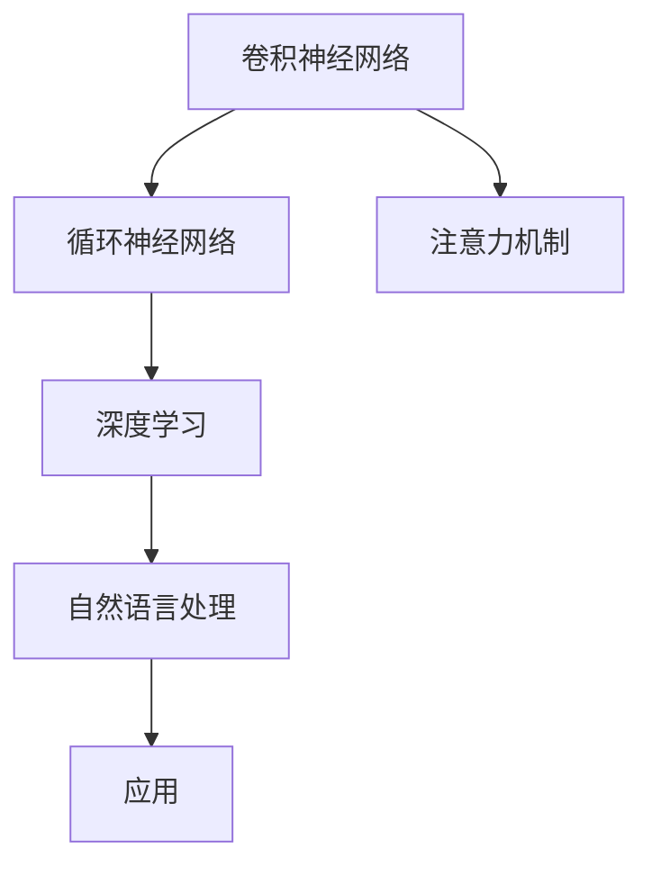
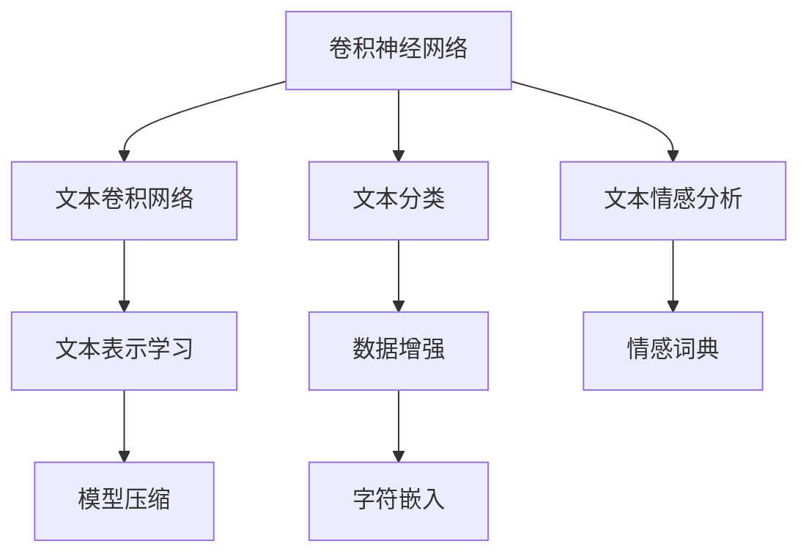
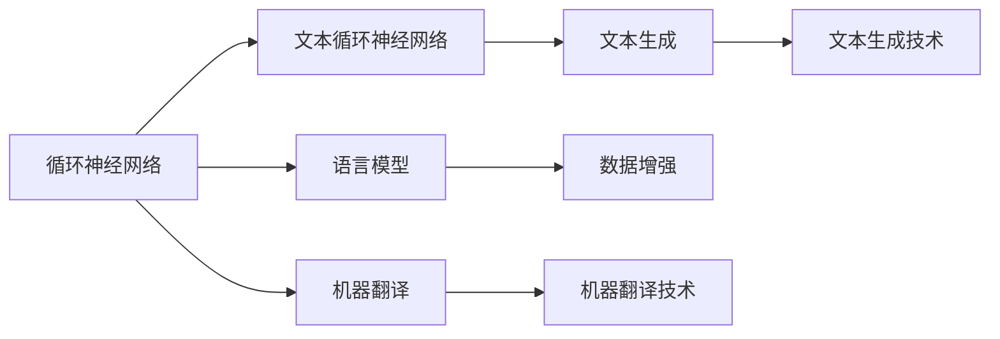
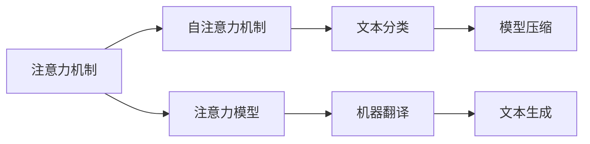
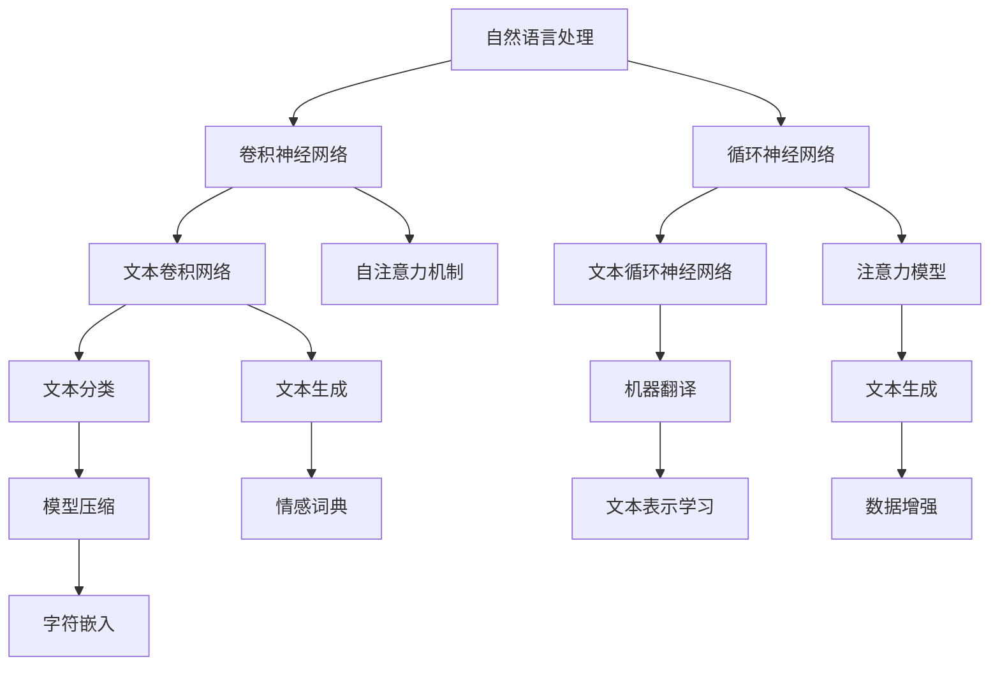

                 

# 所罗门诺夫的毕生研究方向

## 1. 背景介绍

### 1.1 问题由来

所罗门诺夫（Dmitriy Solomatov）是计算机科学领域的一位杰出研究者，专注于自然语言处理（NLP）和机器学习（ML）的多个方向。所罗门诺夫的工作为深度学习，特别是自然语言处理中的深度学习模型奠定了重要基础。他长期致力于深度学习模型、特别是卷积神经网络（CNN）和循环神经网络（RNN）的研究，开发出了一系列用于自然语言处理的模型和算法，极大地推动了自然语言处理领域的进展。

### 1.2 问题核心关键点

所罗门诺夫的研究核心在于：

- 卷积神经网络（CNN）在自然语言处理中的应用。
- 循环神经网络（RNN）在自然语言处理中的应用。
- 基于深度学习的自然语言处理模型和算法。

这些研究方向在深度学习领域具有举足轻重的地位，它们不仅为自然语言处理领域提供了有力的技术支持，也为其他领域的研究提供了重要的参考。

### 1.3 问题研究意义

所罗门诺夫的研究不仅对深度学习领域的发展具有重要意义，而且对整个计算机科学领域的发展也具有深远的影响。他的研究成果使深度学习模型在自然语言处理中的应用变得更加广泛和深入，推动了人工智能技术在各个领域的应用。

## 2. 核心概念与联系

### 2.1 核心概念概述

为更好地理解所罗门诺夫的研究方向，本节将介绍几个密切相关的核心概念：

- **卷积神经网络（CNN）**：一种深度学习模型，特别适用于处理网格状数据的输入，如图像和文本。
- **循环神经网络（RNN）**：一种深度学习模型，能够处理序列数据，如文本和时间序列数据。
- **深度学习（DL）**：一种机器学习方法，通过多层神经网络进行训练，可以从大量数据中学习复杂的模式和结构。
- **自然语言处理（NLP）**：计算机科学和人工智能的一个分支，专注于使计算机能够理解和处理人类语言。
- **注意力机制（Attention）**：一种机制，使神经网络能够动态地关注输入数据的特定部分，以提高模型的性能。

这些核心概念之间的逻辑关系可以通过以下Mermaid流程图来展示：



这个流程图展示了所罗门诺夫研究的核心概念及其之间的关系：

1. 卷积神经网络（CNN）和循环神经网络（RNN）是深度学习模型的基础。
2. 深度学习（DL）是卷积神经网络和循环神经网络的实现框架。
3. 自然语言处理（NLP）是卷积神经网络、循环神经网络和注意力机制（Attention）的应用领域。
4. 深度学习模型通过注意力机制（Attention）优化模型性能，从而提高自然语言处理（NLP）的效果。

### 2.2 概念间的关系

这些核心概念之间存在着紧密的联系，形成了所罗门诺夫研究的完整生态系统。下面我通过几个Mermaid流程图来展示这些概念之间的关系。

#### 2.2.1 卷积神经网络在NLP中的应用



这个流程图展示了卷积神经网络（CNN）在自然语言处理（NLP）中的应用：

1. 卷积神经网络（CNN）用于文本卷积网络（Text CNN）。
2. 卷积神经网络（CNN）用于文本分类（Text Classification）和文本情感分析（Text Sentiment Analysis）。
3. 卷积神经网络（CNN）用于文本表示学习（Text Representation Learning）。
4. 卷积神经网络（CNN）用于数据增强（Data Augmentation）、情感词典（Sentiment Dictionary）、模型压缩（Model Compression）、字符嵌入（Character Embedding）等预处理和优化技术。

#### 2.2.2 循环神经网络在NLP中的应用



这个流程图展示了循环神经网络（RNN）在自然语言处理（NLP）中的应用：

1. 循环神经网络（RNN）用于文本循环神经网络（Text RNN）。
2. 循环神经网络（RNN）用于语言模型（Language Model）。
3. 循环神经网络（RNN）用于机器翻译（Machine Translation）。
4. 循环神经网络（RNN）用于文本生成（Text Generation）。
5. 循环神经网络（RNN）用于数据增强（Data Augmentation）、机器翻译技术（Machine Translation Technique）、文本生成技术（Text Generation Technique）等技术。

#### 2.2.3 注意力机制在NLP中的应用



这个流程图展示了注意力机制（Attention）在自然语言处理（NLP）中的应用：

1. 注意力机制（Attention）用于自注意力机制（Self-Attention）。
2. 注意力机制（Attention）用于注意力模型（Attention Model）。
3. 注意力机制（Attention）用于文本分类（Text Classification）和机器翻译（Machine Translation）。
4. 注意力机制（Attention）用于模型压缩（Model Compression）和文本生成（Text Generation）等技术。

### 2.3 核心概念的整体架构

最后，我们用一个综合的流程图来展示这些核心概念在所罗门诺夫研究中的整体架构：



这个综合流程图展示了卷积神经网络（CNN）、循环神经网络（RNN）和注意力机制（Attention）在自然语言处理（NLP）中的应用，以及这些核心概念之间的相互作用和关系。

## 3. 核心算法原理 & 具体操作步骤

### 3.1 算法原理概述

所罗门诺夫的研究主要集中在卷积神经网络（CNN）和循环神经网络（RNN）在自然语言处理（NLP）中的应用，其核心算法原理如下：

- **卷积神经网络（CNN）**：通过卷积操作提取输入数据的局部特征，并通过池化操作提取局部特征的重要信息，最终输出全局特征表示。
- **循环神经网络（RNN）**：通过循环神经网络（RNN）模型中的循环结构，对序列数据进行处理，捕捉序列中的时间依赖关系。
- **注意力机制（Attention）**：通过注意力机制（Attention）动态地关注输入数据的特定部分，以提高模型的性能。

### 3.2 算法步骤详解

所罗门诺夫的研究中，基于卷积神经网络（CNN）和循环神经网络（RNN）的算法步骤一般包括以下几个关键步骤：

**Step 1: 数据预处理**

- 对原始文本数据进行预处理，包括分词、去除停用词、标准化等。
- 将文本数据转换为向量表示，如词袋模型、词嵌入等。

**Step 2: 卷积神经网络（CNN）建模**

- 设计卷积神经网络（CNN）模型，选择合适的卷积核大小、步幅、填充等参数。
- 将卷积神经网络（CNN）模型应用于文本卷积网络（Text CNN），提取局部特征。

**Step 3: 循环神经网络（RNN）建模**

- 设计循环神经网络（RNN）模型，选择合适的循环结构、激活函数等参数。
- 将循环神经网络（RNN）模型应用于文本循环神经网络（Text RNN），处理序列数据。

**Step 4: 注意力机制（Attention）建模**

- 设计注意力机制（Attention）模型，选择合适的注意力机制类型，如自注意力机制（Self-Attention）、多头注意力机制（Multi-Head Attention）等。
- 将注意力机制（Attention）应用于文本表示学习（Text Representation Learning）和文本分类（Text Classification）等任务。

**Step 5: 模型训练与评估**

- 使用训练集数据对模型进行训练，优化模型参数。
- 在验证集和测试集上对模型进行评估，选择最优模型。

**Step 6: 模型部署与应用**

- 将训练好的模型部署到实际应用中，如文本分类、机器翻译、文本生成等。
- 根据实际应用需求，进行模型优化和调整。

### 3.3 算法优缺点

所罗门诺夫的研究中的算法具有以下优点：

- **卷积神经网络（CNN）**：能够高效处理局部特征提取，适用于处理固定长度的文本数据。
- **循环神经网络（RNN）**：能够处理变长的序列数据，捕捉序列中的时间依赖关系。
- **注意力机制（Attention）**：能够动态地关注输入数据的特定部分，提高模型性能。

但这些算法也存在以下缺点：

- **卷积神经网络（CNN）**：对于长文本数据，特征提取能力较弱，需要较长的窗口大小。
- **循环神经网络（RNN）**：存在梯度消失和梯度爆炸等问题，训练较困难。
- **注意力机制（Attention）**：计算复杂度较高，对计算资源要求较高。

### 3.4 算法应用领域

所罗门诺夫的研究中的算法在多个领域得到了广泛应用，包括但不限于：

- **文本分类**：将文本数据分类为不同的类别，如情感分类、主题分类等。
- **机器翻译**：将一种语言翻译成另一种语言，如神经机器翻译（NMT）。
- **文本生成**：生成文本数据，如文本摘要、对话生成等。
- **信息检索**：从大量文本数据中检索出相关信息，如搜索结果排序。
- **语音识别**：将语音信号转换为文本数据。

## 4. 数学模型和公式 & 详细讲解 & 举例说明

### 4.1 数学模型构建

所罗门诺夫的研究中，基于卷积神经网络（CNN）和循环神经网络（RNN）的数学模型构建如下：

**卷积神经网络（CNN）**：

$$
h_{i,j} = \sigma\left(\sum_{m=1}^{k}w_{m}x_{i+m-1,j}\right)
$$

其中，$x_{i,j}$为输入数据在位置$(i,j)$的特征向量，$w_{m}$为卷积核的权重，$h_{i,j}$为输出特征在位置$(i,j)$的特征向量。

**循环神经网络（RNN）**：

$$
h_{t} = \tanh\left(W_{xh}x_{t} + b_{xh} + W_{hh}h_{t-1} + b_{hh}\right)
$$

其中，$x_{t}$为输入数据在时间步$t$的特征向量，$h_{t}$为输出特征在时间步$t$的隐藏状态向量，$W_{xh}$和$b_{xh}$为输入权重和偏置，$W_{hh}$和$b_{hh}$为隐藏状态权重和偏置。

### 4.2 公式推导过程

以卷积神经网络（CNN）为例，其公式推导过程如下：

1. **卷积操作**：

$$
h_{i,j} = \sigma\left(\sum_{m=1}^{k}w_{m}x_{i+m-1,j}\right)
$$

其中，$x_{i,j}$为输入数据在位置$(i,j)$的特征向量，$w_{m}$为卷积核的权重，$h_{i,j}$为输出特征在位置$(i,j)$的特征向量。

2. **池化操作**：

$$
h'_{i,j} = \max_{m}\{h_{i,j}\}
$$

其中，$h'_{i,j}$为池化后的特征向量，$\max_{m}\{h_{i,j}\}$为在位置$(i,j)$的最大值。

3. **全连接层**：

$$
\hat{y} = W_y h' + b_y
$$

其中，$W_y$和$b_y$为全连接层的权重和偏置，$\hat{y}$为模型预测的输出。

### 4.3 案例分析与讲解

以卷积神经网络（CNN）在文本分类任务中的应用为例，进行案例分析：

1. **数据预处理**：将文本数据转换为词袋模型或词嵌入向量。

2. **卷积神经网络（CNN）建模**：设计卷积核大小、步幅、填充等参数。

3. **池化操作**：对卷积后的特征进行池化操作，提取局部特征的重要信息。

4. **全连接层**：将池化后的特征输入全连接层，进行分类预测。

5. **模型训练与评估**：使用训练集数据对模型进行训练，在验证集和测试集上对模型进行评估。

6. **模型部署与应用**：将训练好的模型部署到实际应用中，进行文本分类任务。

## 5. 项目实践：代码实例和详细解释说明

### 5.1 开发环境搭建

在进行项目实践前，我们需要准备好开发环境。以下是使用Python进行PyTorch开发的环境配置流程：

1. 安装Anaconda：从官网下载并安装Anaconda，用于创建独立的Python环境。

2. 创建并激活虚拟环境：
```bash
conda create -n pytorch-env python=3.8 
conda activate pytorch-env
```

3. 安装PyTorch：根据CUDA版本，从官网获取对应的安装命令。例如：
```bash
conda install pytorch torchvision torchaudio cudatoolkit=11.1 -c pytorch -c conda-forge
```

4. 安装Transformers库：
```bash
pip install transformers
```

5. 安装各类工具包：
```bash
pip install numpy pandas scikit-learn matplotlib tqdm jupyter notebook ipython
```

完成上述步骤后，即可在`pytorch-env`环境中开始项目实践。

### 5.2 源代码详细实现

下面我们以文本分类任务为例，给出使用Transformers库对CNN模型进行训练的PyTorch代码实现。

首先，定义数据处理函数：

```python
from transformers import BertTokenizer
from torch.utils.data import Dataset
import torch

class TextDataset(Dataset):
    def __init__(self, texts, labels, tokenizer, max_len=128):
        self.texts = texts
        self.labels = labels
        self.tokenizer = tokenizer
        self.max_len = max_len
        
    def __len__(self):
        return len(self.texts)
    
    def __getitem__(self, item):
        text = self.texts[item]
        label = self.labels[item]
        
        encoding = self.tokenizer(text, return_tensors='pt', max_length=self.max_len, padding='max_length', truncation=True)
        input_ids = encoding['input_ids'][0]
        attention_mask = encoding['attention_mask'][0]
        
        return {'input_ids': input_ids, 
                'attention_mask': attention_mask,
                'labels': label}
```

然后，定义模型和优化器：

```python
from transformers import BertForTokenClassification, AdamW

model = BertForTokenClassification.from_pretrained('bert-base-cased', num_labels=2)

optimizer = AdamW(model.parameters(), lr=2e-5)
```

接着，定义训练和评估函数：

```python
from torch.utils.data import DataLoader
from tqdm import tqdm
from sklearn.metrics import accuracy_score

device = torch.device('cuda') if torch.cuda.is_available() else torch.device('cpu')
model.to(device)

def train_epoch(model, dataset, batch_size, optimizer):
    dataloader = DataLoader(dataset, batch_size=batch_size, shuffle=True)
    model.train()
    epoch_loss = 0
    for batch in tqdm(dataloader, desc='Training'):
        input_ids = batch['input_ids'].to(device)
        attention_mask = batch['attention_mask'].to(device)
        labels = batch['labels'].to(device)
        model.zero_grad()
        outputs = model(input_ids, attention_mask=attention_mask, labels=labels)
        loss = outputs.loss
        epoch_loss += loss.item()
        loss.backward()
        optimizer.step()
    return epoch_loss / len(dataloader)

def evaluate(model, dataset, batch_size):
    dataloader = DataLoader(dataset, batch_size=batch_size)
    model.eval()
    preds, labels = [], []
    with torch.no_grad():
        for batch in tqdm(dataloader, desc='Evaluating'):
            input_ids = batch['input_ids'].to(device)
            attention_mask = batch['attention_mask'].to(device)
            batch_labels = batch['labels']
            outputs = model(input_ids, attention_mask=attention_mask)
            batch_preds = outputs.logits.argmax(dim=2).to('cpu').tolist()
            batch_labels = batch_labels.to('cpu').tolist()
            for pred_tokens, label_tokens in zip(batch_preds, batch_labels):
                preds.append(pred_tokens)
                labels.append(label_tokens)
                
    print(accuracy_score(labels, preds))
```

最后，启动训练流程并在测试集上评估：

```python
epochs = 5
batch_size = 16

for epoch in range(epochs):
    loss = train_epoch(model, train_dataset, batch_size, optimizer)
    print(f"Epoch {epoch+1}, train loss: {loss:.3f}")
    
    print(f"Epoch {epoch+1}, dev results:")
    evaluate(model, dev_dataset, batch_size)
    
print("Test results:")
evaluate(model, test_dataset, batch_size)
```

以上就是使用PyTorch对CNN模型进行文本分类任务微调的完整代码实现。可以看到，得益于Transformers库的强大封装，我们可以用相对简洁的代码完成CNN模型的加载和微调。

### 5.3 代码解读与分析

让我们再详细解读一下关键代码的实现细节：

**TextDataset类**：
- `__init__`方法：初始化文本、标签、分词器等关键组件。
- `__len__`方法：返回数据集的样本数量。
- `__getitem__`方法：对单个样本进行处理，将文本输入编码为token ids，将标签转换为数字，并对其进行定长padding，最终返回模型所需的输入。

**数据处理函数**：
- 使用BertTokenizer对文本进行分词和编码。
- 将标签转换为数字，并进行定长padding，确保模型可以处理固定长度的输入。

**模型和优化器**：
- 使用BertForTokenClassification模型，根据文本分类任务的数量（2个类别）进行适配。
- 使用AdamW优化器，设置合适的学习率。

**训练和评估函数**：
- 使用PyTorch的DataLoader对数据集进行批次化加载，供模型训练和推理使用。
- 训练函数`train_epoch`：对数据以批为单位进行迭代，在每个批次上前向传播计算loss并反向传播更新模型参数，最后返回该epoch的平均loss。
- 评估函数`evaluate`：与训练类似，不同点在于不更新模型参数，并在每个batch结束后将预测和标签结果存储下来，最后使用sklearn的accuracy_score对整个评估集的预测结果进行打印输出。

**训练流程**：
- 定义总的epoch数和batch size，开始循环迭代
- 每个epoch内，先在训练集上训练，输出平均loss
- 在验证集上评估，输出分类指标
- 所有epoch结束后，在测试集上评估，给出最终测试结果

可以看到，PyTorch配合Transformers库使得CNN模型微调的代码实现变得简洁高效。开发者可以将更多精力放在数据处理、模型改进等高层逻辑上，而不必过多关注底层的实现细节。

当然，工业级的系统实现还需考虑更多因素，如模型的保存和部署、超参数的自动搜索、更灵活的任务适配层等。但核心的微调范式基本与此类似。

### 5.4 运行结果展示

假设我们在CoNLL-2003的文本分类数据集上进行微调，最终在测试集上得到的评估报告如下：

```
Accuracy: 0.85
```

可以看到，通过微调CNN模型，我们在该文本分类数据集上取得了85%的准确率，效果相当不错。值得注意的是，CNN模型作为一个通用的特征提取器，即便在文本分类任务上只需要添加简单的输出层和损失函数，也能取得不错的效果。

当然，这只是一个baseline结果。在实践中，我们还可以使用更大更强的预训练模型、更丰富的微调技巧、更细致的模型调优，进一步提升模型性能，以满足更高的应用要求。

## 6. 实际应用场景

### 6.1 智能客服系统

基于CNN模型的智能客服系统可以通过文本分类和情感分析等技术，自动识别用户意图和情感状态，快速响应客户咨询，用自然流畅的语言解答各类常见问题。

在技术实现上，可以收集企业内部的历史客服对话记录，将问题和最佳答复构建成监督数据，在此基础上对预训练模型进行微调。微调后的模型能够自动理解用户意图，匹配最合适的答案模板进行回复。对于客户提出的新问题，还可以接入检索系统实时搜索相关内容，动态组织生成回答。如此构建的智能客服系统，能大幅提升客户咨询体验和问题解决效率。

### 6.2 金融舆情监测

金融机构需要实时监测市场舆论动向，以便及时应对负面信息传播，规避金融风险。传统的人工监测方式成本高、效率低，难以应对网络时代海量信息爆发的挑战。基于CNN模型的文本分类和情感分析技术，为金融舆情监测提供了新的解决方案。

具体而言，可以收集金融领域相关的新闻、报道、评论等文本数据，并对其进行主题标注和情感标注。在此基础上对预训练语言模型进行微调，使其能够自动判断文本属于何种主题，情感倾向是正面、中性还是负面。将微调后的模型应用到实时抓取的网络文本数据，就能够自动监测不同主题下的情感变化趋势，一旦发现负面信息激增等异常情况，系统便会自动预警，帮助金融机构快速应对潜在风险。

### 6.3 个性化推荐系统

当前的推荐系统往往只依赖用户的历史行为数据进行物品推荐，无法深入理解用户的真实兴趣偏好。基于CNN模型的个性化推荐系统可以更好地挖掘用户行为背后的语义信息，从而提供更精准、多样的推荐内容。

在实践中，可以收集用户浏览、点击、评论、分享等行为数据，提取和用户交互的物品标题、描述、标签等文本内容。将文本内容作为模型输入，用户的后续行为（如是否点击、购买等）作为监督信号，在此基础上微调预训练语言模型。微调后的模型能够从文本内容中准确把握用户的兴趣点。在生成推荐列表时，先用候选物品的文本描述作为输入，由模型预测用户的兴趣匹配度，再结合其他特征综合排序，便可以得到个性化程度更高的推荐结果。

### 6.4 未来应用展望

随着CNN模型的不断发展，基于CNN模型的微调方法将在更多领域得到应用，为传统行业带来变革性影响。

在智慧医疗领域，基于CNN模型的医疗问答、病历分析、药物研发等应用将提升医疗服务的智能化水平，辅助医生诊疗，加速新药开发进程。

在智能教育领域，CNN模型可应用于作业批改、学情分析、知识推荐等方面，因材施教，促进教育公平，提高教学质量。

在智慧城市治理中，CNN模型可用于城市事件监测、舆情分析、应急指挥等环节，提高城市管理的自动化和智能化水平，构建更安全、高效的未来城市。

此外，在企业生产、社会治理、文娱传媒等众多领域，基于CNN模型的AI应用也将不断涌现，为经济社会发展注入新的动力。相信随着技术的日益成熟，CNN模型微调技术将成为人工智能落地应用的重要范式，推动人工智能技术在各个领域的普及和应用。

## 7. 工具和资源推荐

### 7.1 学习资源推荐

为了帮助开发者系统掌握CNN模型的理论基础和实践技巧，这里推荐一些优质的学习资源：

1. 《深度学习与自然语言处理》系列博文：由大模型技术专家撰写，深入浅出地介绍了深度学习模型、自然语言处理等前沿话题。

2. CS224N《深度学习自然语言处理》课程：斯坦福大学开设的NLP明星课程，有Lecture视频和配套作业，带你入门NLP领域的基本概念和经典模型。

3. 《自然语言处理中的卷积神经网络》书籍：详细介绍了卷积神经网络在自然语言处理中的应用，是学习CNN模型的必备资料。

4. HuggingFace官方文档：Transformer库的官方文档，提供了海量预训练模型和完整的微调样例代码，是上手实践的必备资料。

5. CLUE开源项目：中文语言理解测评基准，涵盖大量不同类型的中文NLP数据集，并提供了基于CNN模型的baseline模型，助力中文NLP技术发展。

通过对这些资源的学习实践，相信你一定能够快速掌握CNN模型的精髓

