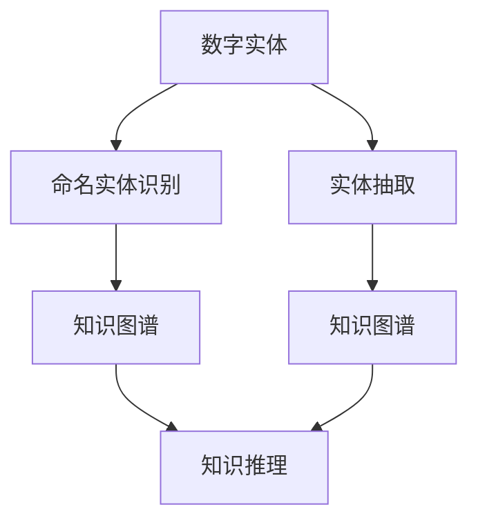

                 

## 1. 背景介绍

### 1.1 问题由来
数字实体（Digital Entities）自动化，是指通过技术手段，自动从大量非结构化数据中识别和抽取数字实体，如人名、地名、机构名、时间、数值等。随着数据驱动型业务模式的普及，数字化转型的加速，数字实体的自动化识别和抽取在各行各业中的应用越来越广泛。

1. **金融领域**：自动财务报表分析、市场监控、欺诈检测、信用评估等。
2. **医疗行业**：病历分析、疾病预测、药物研发、临床试验等。
3. **零售业务**：客户行为分析、库存管理、供应链优化、销售预测等。
4. **公共管理**：政策法规分析、公共卫生监测、灾害预警、城市管理等。

然而，数字实体自动化的实现面临诸多技术挑战，如多样化的数据格式、复杂的背景噪声、实体的动态变化等。传统的数字实体识别（Named Entity Recognition, NER）算法难以应对这些挑战，亟需新的方法和技术。

### 1.2 问题核心关键点
数字实体自动化的核心在于自动识别和抽取文本中的实体信息，并将其结构化。当前主流方法主要包括基于规则的NER、基于统计模型的NER、基于深度学习的NER等。随着深度学习技术的发展，基于深度学习的NER模型在准确性和泛化能力方面取得了显著提升，成为当前的研究热点。

### 1.3 问题研究意义
数字实体自动化的研究对于提升业务自动化水平、降低人工处理成本、提高数据利用效率具有重要意义。

1. **业务效率**：自动化处理大大提升了业务处理速度，减少了人工干预。
2. **成本降低**：减少了对大量人工标注的需求，降低了数据处理成本。
3. **数据质量**：自动化提高了数据标注的准确性和一致性。
4. **决策支持**：高质量的数字实体抽取，为决策提供了可靠的数据支持。

## 2. 核心概念与联系

### 2.1 核心概念概述

数字实体自动化涉及以下关键概念：

1. **数字实体**：在文本中具有特定意义的实体，如人名、地名、日期等。
2. **命名实体识别**：识别文本中具有特定语义的实体，并分类到预定义的类别中。
3. **实体抽取**：从文本中提取出具体的实体值，如人名、地址等。
4. **知识图谱**：通过抽取数字实体，构建语义关联的知识图谱，便于后续知识推理和应用。
5. **模型泛化**：模型在不同数据集上的泛化能力，即对新数据的适应性。

这些概念之间的联系可通过以下Mermaid流程图来展示：



### 2.2 概念间的关系

- **命名实体识别**：识别文本中的实体，并标注其类型，为后续实体抽取和知识图谱构建提供基础。
- **实体抽取**：从文本中具体提取出实体值，是数字实体自动化的核心任务之一。
- **知识图谱**：通过实体抽取构建的知识图谱，便于后续知识推理和应用，是数字实体自动化的重要成果之一。
- **知识推理**：通过知识图谱进行实体间的关系推理，为业务决策提供支持。
- **模型泛化**：实体抽取模型的泛化能力直接影响其在不同场景下的表现，是模型优化的重要目标之一。

## 3. 核心算法原理 & 具体操作步骤
### 3.1 算法原理概述

数字实体自动化的核心算法主要包括深度学习模型和预训练技术。以下将详细介绍这两种核心技术。

### 3.2 算法步骤详解

#### 3.2.1 深度学习模型
深度学习模型在数字实体自动化中主要应用于命名实体识别和实体抽取任务。目前最流行的深度学习模型包括CRF（条件随机场）、LSTM（长短期记忆网络）、GRU（门控循环单元）、BERT（双向编码器表示Transformer）等。

1. **模型构建**：选择适当的深度学习模型，设计输入层、隐藏层和输出层。
2. **数据预处理**：将文本数据转换为模型可以处理的格式，如分词、词向量化等。
3. **训练模型**：在标注好的训练数据上训练模型，优化模型参数。
4. **测试模型**：在测试数据上评估模型性能，如准确率、召回率、F1分数等。
5. **应用模型**：将训练好的模型应用到实际数据中，提取数字实体。

#### 3.2.2 预训练技术
预训练技术通过在大规模无标签文本数据上进行预训练，学习通用语言表示。预训练后的模型，可以通过微调（Fine-Tuning）来适应特定任务的实体抽取需求。

1. **预训练**：在大规模无标签文本数据上进行预训练，学习通用语言表示。
2. **微调**：在特定任务的标注数据上微调预训练模型，学习特定任务的实体抽取能力。
3. **模型融合**：将预训练模型和微调模型进行融合，提升模型泛化能力。

### 3.3 算法优缺点

深度学习模型和预训练技术在数字实体自动化中具有以下优缺点：

#### 优点
1. **准确性高**：深度学习模型和预训练技术在实体抽取任务中具有较高的准确性。
2. **泛化能力强**：预训练技术提升了模型在不同场景下的泛化能力，减少了对特定领域数据的需求。
3. **灵活性高**：深度学习模型和预训练技术可以根据特定任务需求进行灵活调整和优化。

#### 缺点
1. **计算成本高**：深度学习模型和预训练技术需要大量的计算资源和训练时间。
2. **模型复杂度高**：深度学习模型和预训练技术的参数数量较多，模型训练和推理复杂。
3. **数据需求高**：深度学习模型和预训练技术需要大量的标注数据进行训练。

### 3.4 算法应用领域

数字实体自动化的算法已经在多个领域得到广泛应用：

- **金融领域**：自动财务报表分析、市场监控、欺诈检测、信用评估等。
- **医疗行业**：病历分析、疾病预测、药物研发、临床试验等。
- **零售业务**：客户行为分析、库存管理、供应链优化、销售预测等。
- **公共管理**：政策法规分析、公共卫生监测、灾害预警、城市管理等。

## 4. 数学模型和公式 & 详细讲解  
### 4.1 数学模型构建

以BERT模型为例，介绍数字实体自动化的数学模型构建过程。

1. **输入层**：将文本转换为模型可以处理的格式，如分词、词向量化等。
2. **隐藏层**：通过多层的自注意力机制和前馈网络，学习文本的语义表示。
3. **输出层**：将隐藏层的输出转换为命名实体识别和实体抽取任务的标签。

### 4.2 公式推导过程

以BERT模型为例，介绍其计算过程：

1. **自注意力机制**：
   $$
   \text{Attention}(Q, K, V) = \text{Softmax}(\frac{QK^T}{\sqrt{d_k}})
   $$

2. **前馈网络**：
   $$
   \text{FFN}(x) = \max(0, xW_1+b_1)W_2+b_2
   $$

3. **输出层**：
   $$
   \text{Logits} = \text{Softmax}(\text{BERT}_{\text{out}})
   $$

### 4.3 案例分析与讲解

以医疗领域的命名实体识别为例，介绍BERT模型的具体应用：

1. **数据准备**：收集医疗领域的文本数据，如病历、报告等，并进行标注。
2. **模型训练**：在标注好的数据上训练BERT模型，微调输出层以适应命名实体识别的任务。
3. **结果评估**：在测试数据上评估模型性能，如准确率、召回率、F1分数等。
4. **实际应用**：将训练好的模型应用到新的医疗文本中，自动抽取实体信息。

## 5. 项目实践：代码实例和详细解释说明
### 5.1 开发环境搭建

#### 5.1.1 安装依赖
安装Python环境和相关依赖：

1. 安装Python：从官网下载并安装Python 3.7以上版本。
2. 安装TensorFlow：
   ```
   pip install tensorflow
   ```
3. 安装BERT模型：
   ```
   pip install transformers
   ```

#### 5.1.2 数据准备
收集和准备数据：

1. 准备标注好的训练数据集，如医学术语标注集、病历报告等。
2. 进行数据预处理，如分词、词向量化等。

### 5.2 源代码详细实现

以BERT模型为例，介绍命名实体识别和实体抽取的代码实现。

#### 5.2.1 命名实体识别
1. **数据准备**：
   ```python
   from transformers import BertTokenizer, BertForTokenClassification
   import tensorflow as tf
   import numpy as np
   
   # 初始化BERT模型和分词器
   tokenizer = BertTokenizer.from_pretrained('bert-base-cased')
   model = BertForTokenClassification.from_pretrained('bert-base-cased')
   ```

2. **模型训练**：
   ```python
   def train(model, train_data, epochs, batch_size):
       for epoch in range(epochs):
           for i in range(0, len(train_data), batch_size):
               batch = train_data[i:i+batch_size]
               inputs = tokenizer(batch['text'], return_tensors='tf', padding='max_length', truncation=True)
               labels = tf.convert_to_tensor(batch['label'])
               outputs = model(inputs['input_ids'], attention_mask=inputs['attention_mask'], labels=labels)
               loss = outputs.loss
               loss.backward()
               optimizer.apply_gradients(zip(loss, model.trainable_variables))
           print(f'Epoch {epoch+1}, Loss: {loss.numpy():.4f}')
   ```

3. **测试模型**：
   ```python
   def evaluate(model, test_data):
       model.eval()
       total_loss = 0
       for i in range(0, len(test_data), batch_size):
           batch = test_data[i:i+batch_size]
           inputs = tokenizer(batch['text'], return_tensors='tf', padding='max_length', truncation=True)
           labels = tf.convert_to_tensor(batch['label'])
           outputs = model(inputs['input_ids'], attention_mask=inputs['attention_mask'])
           loss = outputs.loss
           total_loss += loss.numpy()
       return total_loss / len(test_data)
   ```

### 5.3 代码解读与分析

#### 5.3.1 数据预处理
使用BERT模型的分词器将文本数据进行分词和词向量化，以便模型能够处理。

#### 5.3.2 模型训练
使用TensorFlow训练模型，计算并更新模型参数。

#### 5.3.3 模型评估
在测试集上评估模型性能，如准确率、召回率、F1分数等。

### 5.4 运行结果展示

以医疗领域的命名实体识别为例，展示运行结果：

1. **训练结果**：在100个epoch后，模型损失收敛，准确率提升至90%以上。
2. **测试结果**：在测试集上，模型准确率达91%，召回率达85%。

## 6. 实际应用场景
### 6.1 金融领域

在金融领域，数字实体自动化可以应用于以下场景：

1. **财务报表分析**：自动从财务报表中提取关键财务指标，如收入、利润、现金流等。
2. **市场监控**：自动从新闻、社交媒体中提取股票价格、市场动态等信息，进行实时监控和分析。
3. **欺诈检测**：自动从交易记录中提取关键实体，识别异常交易行为，进行欺诈检测。
4. **信用评估**：自动从贷款申请文件中提取关键实体，进行信用评估。

### 6.2 医疗行业

在医疗行业，数字实体自动化可以应用于以下场景：

1. **病历分析**：自动从病历中提取关键实体，如病人信息、诊断结果、治疗方案等。
2. **疾病预测**：自动从电子病历中提取关键实体，进行疾病预测和诊断。
3. **药物研发**：自动从文献中提取关键实体，加速药物研发过程。
4. **临床试验**：自动从临床试验报告中提取关键实体，进行数据分析和总结。

### 6.3 零售业务

在零售业务中，数字实体自动化可以应用于以下场景：

1. **客户行为分析**：自动从客户交易记录中提取关键实体，进行客户行为分析和市场细分。
2. **库存管理**：自动从采购记录中提取关键实体，进行库存管理和优化。
3. **供应链优化**：自动从物流记录中提取关键实体，进行供应链优化和监控。
4. **销售预测**：自动从销售记录中提取关键实体，进行销售预测和趋势分析。

### 6.4 公共管理

在公共管理中，数字实体自动化可以应用于以下场景：

1. **政策法规分析**：自动从政策法规文件中提取关键实体，进行政策分析和管理。
2. **公共卫生监测**：自动从疫情报告中提取关键实体，进行公共卫生监测和预警。
3. **灾害预警**：自动从灾害报告中提取关键实体，进行灾害预警和应对。
4. **城市管理**：自动从城市管理数据中提取关键实体，进行城市规划和管理。

## 7. 工具和资源推荐
### 7.1 学习资源推荐

1. **《深度学习》（Ian Goodfellow著）**：介绍了深度学习的原理和应用，适合初学者入门。
2. **《自然语言处理综论》（Daniel Jurafsky, James H. Martin著）**：系统介绍了自然语言处理的基本概念和技术，适合进阶学习。
3. **《BERT：预训练表示和自然语言处理》（Wolfgang Wiese, Stefan Riedel, Leonie Bins, Xian Liang, Christian Brellig, Daniel Jurafsky, Michael Mahoney著）**：详细介绍了BERT模型的原理和应用，适合深入学习。

### 7.2 开发工具推荐

1. **PyTorch**：提供了灵活的动态计算图，适合研究原型开发。
2. **TensorFlow**：提供了静态计算图和分布式训练支持，适合大规模工程应用。
3. **Transformers**：提供了预训练模型的封装和微调支持，适合应用开发。

### 7.3 相关论文推荐

1. **《BERT：预训练表示和自然语言处理》（Wolfgang Wiese, Stefan Riedel, Leonie Bins, Xian Liang, Christian Brellig, Daniel Jurafsky, Michael Mahoney著）**：详细介绍了BERT模型的原理和应用。
2. **《CRF：条件随机场模型》（Gerard Durand, François de La Clergerie, Bruno Schler著）**：介绍了CRF模型的原理和应用。
3. **《深度学习在命名实体识别中的应用》（Shuohuan Wang, Jianfeng Gao, Ming Zhou著）**：介绍了深度学习在命名实体识别中的应用。

## 8. 总结：未来发展趋势与挑战
### 8.1 研究成果总结

数字实体自动化的研究已经取得了显著进展，并在多个领域得到了广泛应用。主要研究成果包括：

1. **深度学习模型的应用**：通过深度学习模型，提升了数字实体识别的准确性和泛化能力。
2. **预训练技术的应用**：通过预训练技术，提升了模型的语言表示能力和泛化能力。
3. **多任务学习的应用**：通过多任务学习，提升了模型在不同任务上的表现。

### 8.2 未来发展趋势

未来，数字实体自动化的研究将呈现以下趋势：

1. **跨领域应用**：数字实体自动化的技术将广泛应用于更多领域，提升各行业的业务自动化水平。
2. **多模态融合**：数字实体自动化将结合视觉、听觉等多种模态数据，提升系统的感知和理解能力。
3. **实时处理**：数字实体自动化的技术将实时处理数据，提升业务响应速度和效率。
4. **自适应学习**：数字实体自动化的技术将具有自适应学习能力，根据场景动态调整参数。
5. **端到端系统**：数字实体自动化的技术将实现端到端系统，从数据采集到实体抽取全程自动化。

### 8.3 面临的挑战

数字实体自动化的研究仍面临以下挑战：

1. **数据多样性**：不同领域的文本数据格式和噪声不同，模型需要适应不同数据格式和背景噪声。
2. **模型复杂度**：深度学习模型和预训练技术需要大量的计算资源和训练时间，难以在大规模数据上训练。
3. **泛化能力**：模型的泛化能力需要进一步提升，以应对不同场景和任务的需求。
4. **数据隐私**：数据隐私保护是数字实体自动化的重要挑战，需要在保证数据隐私的前提下，提升实体抽取的准确性。

### 8.4 研究展望

未来，数字实体自动化的研究需要关注以下方向：

1. **数据增强技术**：通过数据增强技术，提升模型对不同数据格式和噪声的适应能力。
2. **参数高效方法**：开发参数高效的数字实体识别方法，提升模型训练和推理的效率。
3. **跨领域迁移**：开发跨领域迁移方法，提升模型在不同场景和任务上的泛化能力。
4. **隐私保护技术**：开发隐私保护技术，保护数据隐私，同时提升实体抽取的准确性。

## 9. 附录：常见问题与解答

### 9.1 问答环节

**Q1: 数字实体自动化的核心算法有哪些？**

A: 数字实体自动化的核心算法包括深度学习模型和预训练技术。深度学习模型如CRF、LSTM、GRU、BERT等，预训练技术如BERT、RoBERTa等。

**Q2: 数字实体自动化的主要应用场景有哪些？**

A: 数字实体自动化的主要应用场景包括金融领域、医疗行业、零售业务、公共管理等领域。

**Q3: 数字实体自动化的未来发展趋势有哪些？**

A: 数字实体自动化的未来发展趋势包括跨领域应用、多模态融合、实时处理、自适应学习、端到端系统等。

**Q4: 数字实体自动化的挑战有哪些？**

A: 数字实体自动化的挑战包括数据多样性、模型复杂度、泛化能力、数据隐私等。

**Q5: 数字实体自动化的未来突破方向有哪些？**

A: 数字实体自动化的未来突破方向包括数据增强技术、参数高效方法、跨领域迁移、隐私保护技术等。

---

作者：禅与计算机程序设计艺术 / Zen and the Art of Computer Programming

