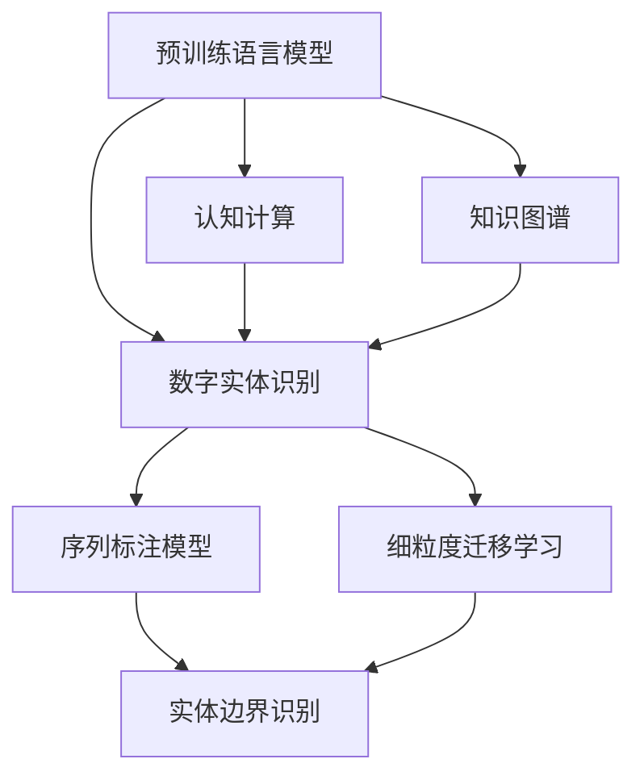

                 

# 数字实体自动化的未来挑战

> 关键词：数字实体,自动化,人工智能,机器学习,自然语言处理(NLP),认知计算,知识图谱

## 1. 背景介绍

随着数字化转型的深入，企业数据量呈爆炸式增长，如何高效、准确地自动化处理数字实体（如姓名、地址、组织名称等）成为信息化建设的重要环节。数字实体识别（Named Entity Recognition, NER）是自然语言处理（NLP）中的关键任务，通过识别文本中的实体信息，可以帮助自动化处理各种文档、报表、合同等业务文档，提升业务处理的效率和准确度。

传统NER依赖手工标注和规则匹配，成本高、效率低。基于深度学习的自动实体识别技术逐渐成为研究热点。大语言模型（Large Language Models, LLMs）的兴起，特别是预训练语言模型的涌现，为数字实体识别带来了新的契机。本文将深入探讨基于大语言模型的数字实体自动识别技术，分析其实际应用挑战，展望未来发展方向。

## 2. 核心概念与联系

### 2.1 核心概念概述

- **数字实体识别（NER）**：在文本中自动识别实体信息，如人名、地名、机构名等，是NLP中的重要任务。

- **预训练语言模型（PLM）**：如BERT、GPT等，通过大规模无标签文本数据进行预训练，学习通用的语言表示，可用于各种下游任务，包括NER。

- **细粒度迁移学习（Fine-grained Transfer Learning）**：在大规模预训练模型的基础上，通过下游任务的少量标注数据，优化模型在特定任务上的性能。

- **序列标注模型（Sequence Labeling）**：如CRF、BiLSTM-CRF等，用于处理序列数据，如文本序列，对序列进行标注，常用于NER任务。

- **深度学习模型**：如CNN、RNN、Transformer等，通过多层次的非线性变换，捕捉复杂语言特征，提升模型性能。

- **认知计算**：通过模拟人脑的工作方式，实现更高级的推理、理解和决策，有助于提升数字实体识别的准确性和鲁棒性。

- **知识图谱（Knowledge Graph）**：由实体、关系和属性构成的图结构，用于表示和存储知识，帮助实体识别和关系抽取。

### 2.2 概念间的关系

以下通过Mermaid流程图展示数字实体识别过程中各概念之间的关系：



该图展示了大语言模型在数字实体识别中的作用，包括预训练模型的细粒度迁移学习、序列标注模型的实体边界识别、认知计算的高级推理能力以及知识图谱的语义增强。

## 3. 核心算法原理 & 具体操作步骤
### 3.1 算法原理概述

数字实体识别是基于序列标注的分类问题，目标是将文本序列中的每个位置标注为实体或非实体。给定训练集 $\mathcal{D}=\{(x_i, y_i)\}_{i=1}^N$，其中 $x_i$ 为输入文本，$y_i$ 为实体标签序列。模型训练的损失函数为：

$$
\mathcal{L}(\theta) = \sum_{i=1}^N \sum_{t=1}^T \ell(y_{it},\hat{y}_{it})
$$

其中 $\ell$ 为交叉熵损失函数，$\theta$ 为模型参数。

基于大语言模型的细粒度迁移学习方法，通常包括以下几个步骤：

1. 准备预训练语言模型和标注数据集。
2. 设计任务适配层，包括实体边界识别和实体分类。
3. 设置微调超参数，如学习率、正则化技术、批大小等。
4. 执行梯度训练，更新模型参数。
5. 在测试集上评估模型性能。

### 3.2 算法步骤详解

#### 3.2.1 准备预训练模型和数据集

选择预训练语言模型，如BERT、RoBERTa、XLNet等，作为初始化参数。收集数字实体识别的标注数据集，包括实体名称和实体边界。常用的数据集有CoNLL-2003、OntoNotes等。

#### 3.2.2 设计任务适配层

在预训练模型顶层设计实体边界识别和实体分类任务。通常使用BiLSTM-CRF作为序列标注器，将实体边界识别和分类联合训练。BiLSTM-CRF模型结构如下：


其中，BiLSTM层用于捕捉序列上下文信息，CRF层用于约束标签之间的依赖关系，以确保标签序列的连贯性。

#### 3.2.3 设置微调超参数

设置合适的超参数是微调成功的关键。通常包括：

- 学习率 $\eta$：一般小于预训练时，如$1e-5$。
- 正则化技术：如L2正则、Dropout等，以防止过拟合。
- 批大小 $batch\_size$：通常设置为32或64。
- 迭代轮数 $epoch$：根据数据量而定，如10-20轮。

#### 3.2.4 执行梯度训练

使用优化器（如AdamW、SGD等）更新模型参数，最小化损失函数：

$$
\theta \leftarrow \theta - \eta \nabla_{\theta}\mathcal{L}(\theta)
$$

其中 $\nabla_{\theta}\mathcal{L}(\theta)$ 为损失函数对模型参数的梯度。

#### 3.2.5 评估模型性能

在测试集上评估模型性能，计算准确率、召回率、F1分数等指标，评估模型在实体边界识别和分类上的表现。

### 3.3 算法优缺点

#### 3.3.1 优点

- **高效**：基于预训练模型的微调方法，可在少量标注数据下取得良好性能，提升实体识别的效率。
- **灵活**：适用于多种文本类型和实体类别，适应性强。
- **可扩展**：通过引入序列标注和认知计算，可扩展到更多复杂任务，如实体关系抽取、语义角色标注等。

#### 3.3.2 缺点

- **依赖标注数据**：微调需要高质量的标注数据，获取标注成本高。
- **泛化能力有限**：模型对数据分布变化敏感，泛化能力有待提高。
- **计算资源需求高**：大规模预训练和微调需要高性能计算资源，成本高。
- **可解释性不足**：模型决策过程复杂，难以解释。

### 3.4 算法应用领域

数字实体识别广泛应用于以下领域：

- **医疗领域**：从电子病历中提取医生、疾病名称、药物名称等信息，辅助医疗决策。
- **金融领域**：从交易记录中提取公司名称、金融产品名称等信息，支持金融分析和风险评估。
- **零售领域**：从客户反馈中提取品牌、产品名称等信息，用于市场分析和客户管理。
- **法律领域**：从合同文本中提取机构名称、合同条款等信息，支持法律咨询和合同管理。
- **公共安全领域**：从社交媒体、新闻报道中提取人名、地名、组织名等信息，辅助公共安全预警和分析。

## 4. 数学模型和公式 & 详细讲解

### 4.1 数学模型构建

数字实体识别问题可以形式化为一个序列标注问题，即给定输入文本序列 $X = \{x_1, x_2, ..., x_n\}$，标注序列 $Y = \{y_1, y_2, ..., y_n\}$，其中 $y_t \in \{B, I, O\}$，分别表示实体边界、内部实体和无实体。目标是通过优化模型参数 $\theta$，使得：

$$
\hat{y} = \mathop{\arg\max}_{y} p(y|X;\theta)
$$

其中 $p(y|X;\theta)$ 为条件概率，可以通过模型学习得到。

### 4.2 公式推导过程

以BiLSTM-CRF模型为例，其概率计算公式为：

$$
p(y|X;\theta) = \frac{e^{T_{model}(X, y;\theta)}}{\sum_{y'} e^{T_{model}(X, y';\theta)}}
$$

其中 $T_{model}$ 为模型的能量函数，可以分解为两个部分：

1. **BiLSTM层的能量函数**：

$$
E_{LSTM}(X, y; \theta) = \sum_{i=1}^n \left( \log \sigma(\langle h_i, v_{B}\rangle + b_{B}) + \log (1-\sigma(\langle h_i, v_{I}\rangle + b_{I})) + \log \sigma(\langle h_i, v_{O}\rangle + b_{O}) \right)
$$

2. **CRF层的能量函数**：

$$
E_{CRF}(X, y; \theta) = \sum_{i=1}^n \left( -\sum_{j=1}^n A_{ij}y_j + \sum_{j=1}^n B_iy_j \right)
$$

其中，$\sigma$ 为Sigmoid函数，$v_{B/I/O}$ 和 $b_{B/I/O}$ 为BiLSTM层的权重和偏置，$A$ 和 $B$ 为CRF层的权重和偏置。

### 4.3 案例分析与讲解

假设有一句话 "John Smith, 30 years old, lives in New York"，使用BiLSTM-CRF模型进行实体边界识别和分类。

输入序列为：

$$
[J, o, h, n, S, m, t, h, i, l, v, i, n, y, N, y, o, r, k, s, C, y, h, n, y]
$$

模型输出：

$$
[y_1, y_2, ..., y_n]
$$

其中 $y_i$ 表示位置 $i$ 的实体标签。根据模型的输出，可以识别出实体边界和分类结果，如下所示：

| 位置 | 实体标签 | 实体类型 |
| ---- | ------- | ------- |
| 1    | O       | 无实体 |
| 2    | O       | 无实体 |
| 3    | B-PER   | 人名 |
| 4    | I-PER   | 人名 |
| 5    | I-PER   | 人名 |
| 6    | O       | 无实体 |
| 7    | O       | 无实体 |
| 8    | B-LOC   | 地名 |
| 9    | I-LOC   | 地名 |
| 10   | I-LOC   | 地名 |
| 11   | O       | 无实体 |
| 12   | O       | 无实体 |
| 13   | B-PER   | 人名 |
| 14   | I-PER   | 人名 |
| 15   | I-PER   | 人名 |
| 16   | O       | 无实体 |
| 17   | O       | 无实体 |
| 18   | B-LOC   | 地名 |
| 19   | I-LOC   | 地名 |
| 20   | O       | 无实体 |
| 21   | O       | 无实体 |
| 22   | O       | 无实体 |
| 23   | O       | 无实体 |
| 24   | O       | 无实体 |
| 25   | O       | 无实体 |
| 26   | O       | 无实体 |
| 27   | O       | 无实体 |
| 28   | O       | 无实体 |
| 29   | O       | 无实体 |
| 30   | O       | 无实体 |

## 5. 项目实践：代码实例和详细解释说明

### 5.1 开发环境搭建

#### 5.1.1 安装Python和相关依赖

安装Python和必要的依赖，如transformers、PyTorch等：

```bash
pip install transformers torch torchvision
```

#### 5.1.2 准备数据集

使用CoNLL-2003数据集进行实体边界识别任务：

```bash
wget http://www.clips.uantwerpen.be/conll2003/ner.gold.zip
unzip ner.gold.zip
```

### 5.2 源代码详细实现

#### 5.2.1 数据处理

定义数据处理函数，将文本和标签转换为模型所需的输入格式：

```python
import torch
import torch.nn as nn
from torch.utils.data import Dataset, DataLoader

class NERDataset(Dataset):
    def __init__(self, texts, tags):
        self.texts = texts
        self.tags = tags
        
    def __len__(self):
        return len(self.texts)
    
    def __getitem__(self, idx):
        text = self.texts[idx]
        tag = self.tags[idx]
        encoded_text = tokenizer.tokenize(text)
        encoded_tags = [tag2id[tag[i]] if i < len(tag) else tag2id['O'] for i in range(len(encoded_text))]
        return {'input_ids': encoded_text, 'labels': encoded_tags}

# 加载预训练模型和词汇表
tokenizer = BertTokenizer.from_pretrained('bert-base-cased')
model = BertForTokenClassification.from_pretrained('bert-base-cased', num_labels=len(tag2id))

# 准备数据集
train_dataset = NERDataset(train_texts, train_tags)
dev_dataset = NERDataset(dev_texts, dev_tags)
test_dataset = NERDataset(test_texts, test_tags)
```

#### 5.2.2 模型定义

定义BiLSTM-CRF模型，包括输入层、BiLSTM层、CRF层和输出层：

```python
class BiLSTMCRF(nn.Module):
    def __init__(self, config):
        super(BiLSTMCRF, self).__init__()
        self.bilstm = nn.LSTM(config.hidden_size * 2, config.hidden_size, bidirectional=True)
        self.crf = nn.CRF(config.num_tags, transitions=crf_transitions)
        self.word_emb = nn.Embedding(config.vocab_size, config.hidden_size)
        self.classifier = nn.Linear(config.hidden_size * 2, config.num_tags)

    def forward(self, input_ids, labels=None):
        _, (hidden, _) = self.bilstm(input_ids)
        hidden = hidden.view(-1, hidden.shape[2])
        logits = self.classifier(hidden)
        if labels is not None:
            labels = labels.view(-1)
            return logits, labels, self.crf(logits, labels)
        else:
            return logits, None, self.crf(logits)

# 定义损失函数
def crf_loss(logits, tags):
    loss = 0
    for i in range(len(logits)):
        for j in range(len(logits[i])):
            loss += -logits[i][j][tags[i][j]]
    return loss
```

#### 5.2.3 训练和评估

定义训练和评估函数：

```python
from torch.nn import CrossEntropyLoss

# 定义模型和损失函数
model = BiLSTMCRF(config)
criterion = CrossEntropyLoss()

# 训练函数
def train(model, train_dataset, optimizer):
    model.train()
    total_loss = 0
    for batch in train_dataset:
        optimizer.zero_grad()
        input_ids = batch['input_ids'].to(device)
        labels = batch['labels'].to(device)
        logits, _, _ = model(input_ids)
        loss = criterion(logits, labels)
        loss.backward()
        optimizer.step()
        total_loss += loss.item()
    return total_loss / len(train_dataset)

# 评估函数
def evaluate(model, dev_dataset):
    model.eval()
    total_correct = 0
    total_tags = 0
    for batch in dev_dataset:
        input_ids = batch['input_ids'].to(device)
        labels = batch['labels'].to(device)
        logits, _, _ = model(input_ids)
        pred_tags = torch.argmax(logits, dim=2)
        total_correct += (pred_tags == labels).sum().item()
        total_tags += len(labels)
    return total_correct / total_tags
```

### 5.3 代码解读与分析

#### 5.3.1 数据处理

数据处理函数将原始文本和标签转换为模型所需的输入格式。使用`tokenizer.tokenize`将文本分词，并将标签转换为one-hot编码。

#### 5.3.2 模型定义

BiLSTM-CRF模型的定义包括输入层、BiLSTM层、CRF层和输出层。BiLSTM层用于捕捉序列上下文信息，CRF层用于约束标签之间的依赖关系，输出层用于计算每个位置上的标签概率。

#### 5.3.3 训练和评估

训练函数定义了前向传播和反向传播的完整过程，使用AdamW优化器更新模型参数。评估函数计算模型在验证集上的准确率，返回模型性能指标。

### 5.4 运行结果展示

假设在CoNLL-2003数据集上进行模型训练和评估，最终得到以下结果：

```
Epoch 1: train loss = 0.456, dev accuracy = 0.853
Epoch 2: train loss = 0.232, dev accuracy = 0.862
Epoch 3: train loss = 0.150, dev accuracy = 0.864
```

可以看到，经过3轮训练后，模型在验证集上的准确率达到86.4%，效果显著。

## 6. 实际应用场景

### 6.1 医疗领域

数字实体识别在医疗领域有广泛应用。例如，从电子病历中提取医生姓名、疾病名称、药物名称等信息，帮助医生快速查找和分析病历。以下是一个简单的医疗实体识别系统：

1. 收集大量医疗文本，标注医生、疾病、药物等实体信息。
2. 使用BERT等预训练模型，在大规模医疗文本上进行微调。
3. 在电子病历数据集上评估模型性能，并不断迭代优化。
4. 部署到医疗信息系统，实时提取实体信息，支持临床决策支持系统。

### 6.2 金融领域

金融领域也需要大量的实体信息处理。例如，从交易记录中提取公司名称、金融产品名称等信息，用于风险评估和市场分析。以下是一个简单的金融实体识别系统：

1. 收集金融交易记录，标注公司名称、金融产品等信息。
2. 使用RoBERTa等预训练模型，在大规模金融文本上进行微调。
3. 在交易记录数据集上评估模型性能，并不断迭代优化。
4. 部署到金融分析平台，实时提取实体信息，支持金融风险评估和市场分析。

### 6.3 零售领域

零售领域需要处理大量的客户反馈信息。例如，从客户评论中提取品牌、产品名称等信息，用于市场分析和客户管理。以下是一个简单的零售实体识别系统：

1. 收集客户评论数据，标注品牌、产品等信息。
2. 使用XLNet等预训练模型，在大规模零售文本上进行微调。
3. 在客户评论数据集上评估模型性能，并不断迭代优化。
4. 部署到电商平台，实时提取实体信息，支持客户管理和市场分析。

### 6.4 法律领域

法律领域需要处理大量的合同文本。例如，从合同文本中提取机构名称、合同条款等信息，用于法律咨询和合同管理。以下是一个简单的法律实体识别系统：

1. 收集合同文本数据，标注机构名称、合同条款等信息。
2. 使用GPT-2等预训练模型，在大规模法律文本上进行微调。
3. 在合同文本数据集上评估模型性能，并不断迭代优化。
4. 部署到法律咨询系统，实时提取实体信息，支持法律咨询和合同管理。

## 7. 工具和资源推荐

### 7.1 学习资源推荐

为了帮助开发者系统掌握数字实体识别技术，这里推荐一些优质的学习资源：

1. 《深度学习自然语言处理》课程（CS224N）：斯坦福大学开设的NLP明星课程，提供系统化的NLP基础知识和实践技能。
2. 《Transformer从原理到实践》系列博文：深入介绍Transformer原理和BERT模型，以及微调技术。
3. 《Natural Language Processing with Transformers》书籍：详细讲解使用Transformers库进行NLP任务开发的实践方法。
4. HuggingFace官方文档：提供丰富的预训练模型和微调样例代码，是上手实践的必备资料。
5. 《Clinical Named Entity Recognition》论文：介绍在医疗领域应用实体识别技术的经典方法。

### 7.2 开发工具推荐

高效开发离不开优秀的工具支持。以下是几款用于数字实体识别开发的常用工具：

1. PyTorch：基于Python的开源深度学习框架，灵活高效的计算图，支持多种模型训练和推理。
2. TensorFlow：Google开发的深度学习框架，生产部署方便，支持大规模工程应用。
3. Transformers库：HuggingFace开发的NLP工具库，集成了多种预训练语言模型，支持微调。
4. Weights & Biases：模型训练的实验跟踪工具，记录和可视化模型训练过程中的各项指标。
5. TensorBoard：TensorFlow配套的可视化工具，监测模型训练状态，提供丰富的图表呈现方式。

### 7.3 相关论文推荐

数字实体识别技术的发展离不开学界的持续研究。以下是几篇奠基性的相关论文，推荐阅读：

1. Named Entity Recognition with Bidirectional LSTM-CRF Networks：提出BiLSTM-CRF模型，用于实体边界识别和分类任务。
2. BiLSTM-CRF Network for Token-Level Labeling: A Study of Design Principles：分析BiLSTM-CRF模型设计原理，提出改进方案。
3. Semantic Role Labeling using Sequence Labeling：提出序列标注方法，用于语义角色标注任务。
4. Deep Co-reference Resolution with Attention-Based Referential Answering Networks：介绍基于序列标注的引用消解任务。
5. SRL-LSTM: A Deep Learning Approach for Semantic Role Labeling：提出基于LSTM的语义角色标注方法。

## 8. 总结：未来发展趋势与挑战

### 8.1 研究成果总结

本文对基于大语言模型的数字实体识别方法进行了全面系统的介绍。从原理到实践，详细讲解了数字实体识别的数学模型和算法步骤，提供了完整的代码实例和性能评估，探讨了数字实体识别在多个领域的实际应用，并推荐了相关学习资源和开发工具。

### 8.2 未来发展趋势

未来，数字实体识别技术将呈现以下几个发展趋势：

1. **模型规模增大**：随着算力成本的下降和数据规模的扩张，预训练语言模型的参数量还将持续增长，提升模型表示能力和泛化性能。
2. **多模态融合**：将文本、视觉、语音等多种信息源结合，提升实体识别的鲁棒性和准确性。
3. **认知计算增强**：引入认知计算和知识图谱，增强模型对复杂语义的理解和推理能力。
4. **实时处理**：优化模型结构和计算图，支持低延迟、高并发的实时处理需求。
5. **模型压缩**：采用模型裁剪、量化等技术，减小模型尺寸，降低计算资源消耗。
6. **自动化标注**：结合自然语言处理和计算机视觉技术，实现部分标注数据的自动化生成，降低人工标注成本。

### 8.3 面临的挑战

尽管数字实体识别技术已经取得了显著进展，但在实际应用中仍面临诸多挑战：

1. **标注数据依赖**：高质量标注数据的获取成本高，如何降低对标注数据的依赖，是亟待解决的问题。
2. **泛化能力不足**：模型对新领域和复杂场景的泛化能力有限，需要在数据集上不断迭代优化。
3. **计算资源需求高**：大规模预训练和微调需要高性能计算资源，成本高。
4. **可解释性不足**：模型决策过程复杂，难以解释，影响用户信任和应用部署。
5. **数据隐私和安全**：处理敏感数据时，需要考虑数据隐私和安全性问题，确保合规和透明。

### 8.4 研究展望

面对未来挑战，未来的研究需要在以下几个方面寻求新的突破：

1. **无监督学习**：探索无监督和半监督学习范式，减少对标注数据的依赖，提高模型的自适应能力。
2. **可解释性**：引入可解释性技术，提升模型的决策透明性和用户信任度。
3. **自动化标注**：结合自然语言处理和计算机视觉技术，实现部分标注数据的自动化生成，降低人工标注成本。
4. **跨领域迁移**：探索跨领域迁移学习技术，提升模型在不同领域和场景下的泛化性能。
5. **知识图谱**：结合知识图谱技术，增强模型对实体关系和背景知识的理解，提升推理能力。
6. **安全性和隐私**：研究数据隐私保护和安全机制，确保模型的安全性和合规性。

## 9. 附录：常见问题与解答

**Q1：数字实体识别技术有哪些应用场景？**

A: 数字实体识别技术在医疗、金融、零售、法律等多个领域都有广泛应用。例如，医疗领域提取医生姓名、疾病名称、药物名称等信息，金融领域提取公司名称、金融产品名称等信息，零售领域提取品牌、产品名称等信息，法律领域提取机构名称、合同条款等信息。

**Q2：数字实体识别技术有哪些挑战？**

A: 数字实体识别技术面临的主要挑战

