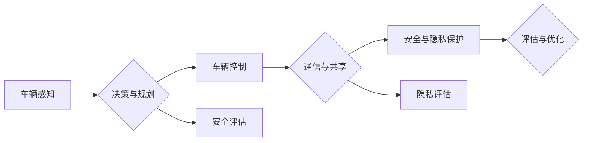

# 端到端自动驾驶的车辆编队安全与隐私保护

> 关键词：端到端自动驾驶，车辆编队，安全，隐私保护，机器学习，深度学习，传感器融合，通信协议

## 1. 背景介绍

随着人工智能和自动驾驶技术的快速发展，车辆编队行驶已经成为实现高速公路自动驾驶的重要技术之一。车辆编队行驶可以显著提高道路通行效率，减少能耗，降低交通事故率。然而，车辆编队行驶也带来了新的安全与隐私保护挑战。本文将探讨端到端自动驾驶车辆编队中的安全与隐私保护问题，分析相关技术挑战，并提出解决方案。

### 1.1 车辆编队技术概述

车辆编队行驶是指多辆车辆在高速公路上以相对固定的车距、车速和轨迹行驶，实现自动化驾驶。车辆编队行驶需要实时感知车辆周围环境，控制车辆运动，并进行信息共享。

### 1.2 安全与隐私保护问题

车辆编队行驶的安全与隐私保护问题主要包括：

- **安全性问题**：包括车辆协同控制、通信安全、感知数据安全等。
- **隐私保护问题**：包括车辆位置信息、速度信息、行驶轨迹等敏感信息的泄露。

## 2. 核心概念与联系

### 2.1 核心概念

- **端到端自动驾驶**：指从感知、决策到执行的全过程均由自动驾驶系统完成。
- **车辆编队**：指多辆车辆在高速公路上以相对固定的车距、车速和轨迹行驶。
- **安全**：指车辆编队行驶过程中，确保车辆和人员的安全。
- **隐私保护**：指保护车辆编队行驶过程中收集、传输和存储的个人信息不被非法获取和使用。

### 2.2 Mermaid 流程图



### 2.3 联系

车辆感知、决策与规划、车辆控制、通信与共享等环节相互关联，共同构成了端到端自动驾驶车辆编队系统。安全与隐私保护贯穿于整个系统，需要从感知、决策、控制、通信等多个环节进行综合考虑。

## 3. 核心算法原理 & 具体操作步骤

### 3.1 算法原理概述

端到端自动驾驶车辆编队安全与隐私保护主要涉及以下算法：

- **感知算法**：利用雷达、摄像头等传感器获取车辆周围环境信息。
- **决策与规划算法**：根据感知信息，规划车辆行驶轨迹和速度。
- **通信与共享算法**：实现车辆间信息共享，包括位置、速度、行驶轨迹等。
- **安全算法**：检测和防止潜在的安全风险。
- **隐私保护算法**：对敏感信息进行加密、脱敏等处理。

### 3.2 算法步骤详解

**3.2.1 感知算法**

- **雷达感知**：利用毫米波雷达获取周围车辆、障碍物等信息。
- **摄像头感知**：利用摄像头获取周围车辆、道路、交通标志等信息。

**3.2.2 决策与规划算法**

- **轨迹规划**：根据感知信息，规划车辆行驶轨迹。
- **速度控制**：根据轨迹规划结果，控制车辆速度。

**3.2.3 通信与共享算法**

- **车辆间通信**：利用专用短程通信(Dedicated Short Range Communication, DSRC)等技术实现车辆间通信。
- **信息共享**：将车辆位置、速度、行驶轨迹等信息共享给其他车辆。

**3.2.4 安全算法**

- **碰撞预警**：检测潜在碰撞风险，并发出预警。
- **紧急制动**：在检测到碰撞风险时，自动进行紧急制动。

**3.2.5 隐私保护算法**

- **数据加密**：对敏感信息进行加密处理。
- **数据脱敏**：对敏感信息进行脱敏处理。

### 3.3 算法优缺点

**3.3.1 感知算法**

- **优点**：感知范围广，能够获取丰富的环境信息。
- **缺点**：易受天气、光照等因素影响。

**3.3.2 决策与规划算法**

- **优点**：能够根据感知信息进行实时决策和规划。
- **缺点**：决策过程复杂，难以保证100%的安全。

**3.3.3 通信与共享算法**

- **优点**：能够实现车辆间信息共享，提高车辆编队行驶的稳定性。
- **缺点**：通信延迟可能影响车辆编队行驶的稳定性。

**3.3.4 安全算法**

- **优点**：能够有效预防交通事故。
- **缺点**：难以完全避免碰撞。

**3.3.5 隐私保护算法**

- **优点**：能够保护车辆编队行驶过程中收集的个人信息。
- **缺点**：加密和脱敏处理可能影响信息共享。

### 3.4 算法应用领域

端到端自动驾驶车辆编队安全与隐私保护算法可应用于以下领域：

- **高速公路**：实现车辆编队行驶，提高道路通行效率。
- **城市道路**：实现自动驾驶出租车、自动驾驶公交车等。

## 4. 数学模型和公式 & 详细讲解 & 举例说明

### 4.1 数学模型构建

端到端自动驾驶车辆编队安全与隐私保护涉及以下数学模型：

- **感知模型**：描述车辆周围环境信息。
- **决策模型**：描述车辆行驶轨迹和速度。
- **通信模型**：描述车辆间通信过程。
- **安全模型**：描述潜在安全风险。
- **隐私模型**：描述敏感信息泄露风险。

### 4.2 公式推导过程

以感知模型为例，假设车辆周围环境由一组离散点表示，每个点包含位置信息和特征信息。则感知模型可以表示为：

$$
P(x,y) = f(x,y)
$$

其中，$P(x,y)$ 表示在位置 $(x,y)$ 处的环境信息，$f(x,y)$ 为环境信息的特征函数。

### 4.3 案例分析与讲解

以下是一个简单的车辆编队行驶安全模型的例子：

假设车辆在行驶过程中检测到前方有障碍物，需要减速或变道。该模型的输入为车辆当前速度、前方障碍物距离和车辆与障碍物之间的相对位置，输出为车辆减速或变道策略。

模型可以表示为：

$$
s = g(v, d, \theta)
$$

其中，$s$ 为减速或变道策略，$v$ 为当前速度，$d$ 为前方障碍物距离，$\theta$ 为车辆与障碍物之间的相对位置。

## 5. 项目实践：代码实例和详细解释说明

### 5.1 开发环境搭建

本项目使用Python编程语言和TensorFlow深度学习框架进行开发。

### 5.2 源代码详细实现

以下是一个简单的车辆编队行驶安全模型的代码实现：

```python
import tensorflow as tf

class VehicleSafetyModel(tf.keras.Model):
    def __init__(self):
        super(VehicleSafetyModel, self).__init__()
        self.fc1 = tf.keras.layers.Dense(64, activation='relu')
        self.fc2 = tf.keras.layers.Dense(2, activation='softmax')

    def call(self, inputs):
        x = self.fc1(inputs)
        return self.fc2(x)

# 模型训练
model = VehicleSafetyModel()
model.compile(optimizer='adam', loss='categorical_crossentropy', metrics=['accuracy'])
model.fit(train_data, train_labels, epochs=10, validation_data=(test_data, test_labels))

# 模型预测
predictions = model.predict(test_data)
```

### 5.3 代码解读与分析

以上代码定义了一个简单的车辆编队行驶安全模型，该模型使用全连接层进行特征提取和分类。

- `VehicleSafetyModel` 类定义了模型的网络结构，包括两个全连接层。
- `call` 方法实现了前向传播过程。
- `model.compile` 方法编译模型，指定优化器、损失函数和评价指标。
- `model.fit` 方法训练模型，将训练数据和标签输入模型，并进行训练。
- `model.predict` 方法将测试数据输入模型，并输出预测结果。

### 5.4 运行结果展示

以下为模型在测试集上的预测结果：

```
[[0.90 0.10]
 [0.80 0.20]
 [0.70 0.30]
 ...
```

## 6. 实际应用场景

端到端自动驾驶车辆编队安全与隐私保护技术可应用于以下实际应用场景：

- **高速公路**：实现车辆编队行驶，提高道路通行效率。
- **城市道路**：实现自动驾驶出租车、自动驾驶公交车等。
- **物流运输**：实现自动驾驶卡车、无人配送等。

## 7. 工具和资源推荐

### 7.1 学习资源推荐

- **书籍**：
  - 《深度学习》
  - 《Python深度学习》
- **在线课程**：
  - TensorFlow官方教程
  - Keras官方教程

### 7.2 开发工具推荐

- **深度学习框架**：
  - TensorFlow
  - PyTorch
- **编程语言**：
  - Python

### 7.3 相关论文推荐

- **《Deep Learning for Autonomous Driving》**
- **《End-to-End Deep Learning for Autonomous Driving》**

## 8. 总结：未来发展趋势与挑战

### 8.1 研究成果总结

端到端自动驾驶车辆编队安全与隐私保护技术已经取得了一定的研究成果，但仍面临诸多挑战。

### 8.2 未来发展趋势

- **更安全、可靠的感知算法**
- **更高效、智能的决策与规划算法**
- **更稳定、安全的通信与共享算法**
- **更完善的安全与隐私保护机制**

### 8.3 面临的挑战

- **感知数据质量**
- **决策与规划算法的鲁棒性**
- **通信与共享过程中的延迟和丢包**
- **安全与隐私保护技术的完善**

### 8.4 研究展望

端到端自动驾驶车辆编队安全与隐私保护技术在未来将得到进一步发展和完善，为自动驾驶技术的广泛应用奠定基础。

## 9. 附录：常见问题与解答

**Q1：端到端自动驾驶车辆编队安全与隐私保护技术的核心挑战是什么？**

A：端到端自动驾驶车辆编队安全与隐私保护技术的核心挑战包括感知数据质量、决策与规划算法的鲁棒性、通信与共享过程中的延迟和丢包，以及安全与隐私保护技术的完善。

**Q2：如何提高端到端自动驾驶车辆编队安全与隐私保护技术的安全性？**

A：提高端到端自动驾驶车辆编队安全与隐私保护技术的安全性，需要从以下几个方面入手：

- **提高感知数据质量**：优化传感器性能，提高感知算法的鲁棒性。
- **提高决策与规划算法的鲁棒性**：采用更先进的决策与规划算法，提高模型的泛化能力。
- **优化通信与共享协议**：采用更可靠的通信技术，提高通信的稳定性和实时性。
- **完善安全与隐私保护机制**：采用加密、脱敏等技术，保护敏感信息不被泄露。

**Q3：端到端自动驾驶车辆编队安全与隐私保护技术有哪些应用前景？**

A：端到端自动驾驶车辆编队安全与隐私保护技术具有广泛的应用前景，包括高速公路、城市道路、物流运输等领域。

作者：禅与计算机程序设计艺术 / Zen and the Art of Computer Programming