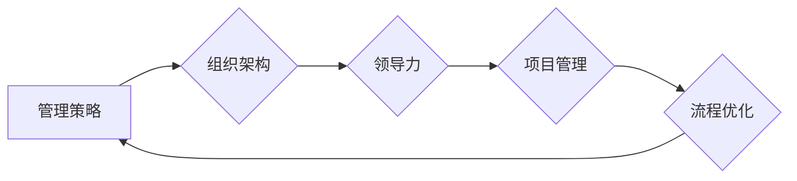

# 管理的智慧：从策略到执行

> 关键词：管理策略，执行效率，组织架构，领导力，项目管理，流程优化

## 1. 背景介绍

在快速变化和竞争激烈的商业环境中，成功的管理不仅仅是制定有效的策略，更重要的是将这些策略转化为实际成果。管理的智慧在于如何将战略目标与日常执行相结合，通过高效的流程和团队协作，最终实现组织的成功。本文将探讨管理策略的制定与执行，从组织架构、领导力、项目管理到流程优化，为管理者提供一套全面的管理智慧框架。

### 1.1 管理策略的必要性

随着全球化的推进和技术的快速发展，企业面临着前所未有的挑战和机遇。为了在竞争中立于不败之地，企业必须制定明确的管理策略，以指导企业的长期发展。

### 1.2 管理执行的挑战

尽管策略制定至关重要，但执行过程中的挑战同样不容忽视。管理执行的成功取决于多个因素，包括团队协作、资源分配、风险管理等。

### 1.3 本文结构

本文将分为以下几个部分：
- 核心概念与联系
- 核心算法原理 & 具体操作步骤
- 数学模型和公式 & 详细讲解 & 举例说明
- 项目实践：代码实例和详细解释说明
- 实际应用场景
- 工具和资源推荐
- 总结：未来发展趋势与挑战
- 附录：常见问题与解答

## 2. 核心概念与联系

### 2.1 核心概念

- **管理策略**：指企业为实现其目标而制定的一系列行动方针和计划。
- **组织架构**：企业内部的组织结构和职责分工。
- **领导力**：领导者引导和激励团队实现组织目标的能力。
- **项目管理**：对项目从启动到完成的整个生命周期进行规划、执行、监控和控制的系列活动。
- **流程优化**：对组织内部流程进行改进，以提高效率和效果。

#### Mermaid 流程图



### 2.2 概念联系

管理策略是整个管理过程的起点，它决定了组织架构、领导力、项目管理和流程优化的方向。组织架构和领导力是执行管理策略的基础，而项目管理和流程优化则是实现策略目标的手段。

## 3. 核心算法原理 & 具体操作步骤

### 3.1 算法原理概述

管理过程可以被视为一个复杂的算法，它涉及多个步骤和决策点。以下是管理过程的基本原理：

- **目标设定**：明确组织的目标和愿景。
- **战略规划**：制定实现目标的长期计划。
- **组织设计**：构建适合战略的组织架构。
- **领导与激励**：培养领导力，激励团队成员。
- **项目管理**：对项目进行规划、执行、监控和控制。
- **流程优化**：持续改进流程，提高效率。

### 3.2 算法步骤详解

1. **目标设定**：通过SWOT分析、SMART原则等方法，明确组织的目标和愿景。
2. **战略规划**：制定短期和长期战略，包括市场定位、产品开发、财务规划等。
3. **组织设计**：根据战略需求，设计合理的组织架构，明确职责分工。
4. **领导与激励**：培养领导者的领导力，通过激励机制提高员工的工作积极性。
5. **项目管理**：对项目进行全生命周期管理，确保项目按时、按质完成。
6. **流程优化**：持续监控和改进流程，提高效率和效果。

### 3.3 算法优缺点

**优点**：
- 有助于组织实现其目标。
- 提高决策效率和效果。
- 增强团队协作和沟通。

**缺点**：
- 过于复杂的流程可能导致执行困难。
- 灵活性不足，难以适应快速变化的环境。

### 3.4 算法应用领域

管理算法适用于所有类型的企业和组织，无论其规模大小或行业领域。

## 4. 数学模型和公式 & 详细讲解 & 举例说明

### 4.1 数学模型构建

管理过程中的数学模型可以包括以下几个部分：

- **目标函数**：定义组织的目标，如最大化利润、最小化成本等。
- **决策变量**：影响目标函数的变量，如生产量、库存水平、人力配置等。
- **约束条件**：限制决策变量取值的条件，如资源限制、生产能力等。

#### 公式示例

$$
\text{最大利润} = \sum_{i=1}^{n} \text{利润率} \times \text{产量} - \sum_{j=1}^{m} \text{成本} \times \text{资源消耗}
$$

### 4.2 公式推导过程

以上公式的推导过程涉及线性规划、整数规划等优化方法。

### 4.3 案例分析与讲解

以一个简单的生产计划问题为例，假设一个工厂生产两种产品，每种产品需要不同的资源和设备。目标是最大化利润，同时满足资源限制和生产能力。

### 4.4 常见问题解答

**Q1：如何平衡目标函数和约束条件？**

A：可以通过调整权重或目标函数的形式来实现平衡。

**Q2：如何处理非线性问题？**

A：可以使用非线性规划方法。

## 5. 项目实践：代码实例和详细解释说明

### 5.1 开发环境搭建

使用Python进行项目实践，需要安装以下库：

- `numpy`
- `scipy`
- `matplotlib`

### 5.2 源代码详细实现

以下是一个简单的线性规划问题的Python代码实现：

```python
import numpy as np
from scipy.optimize import linprog

# 目标函数系数
c = np.array([1, 2])

# 约束条件系数
A = np.array([[1, 2], [2, 1], [1, 1]])
b = np.array([2, 3, 3])

# 约束条件不等式类型
A_eq = None
b_eq = None

# 约束条件不等式右侧
b Bounds = (0, None), (0, None)

# 求解线性规划问题
res = linprog(c, A_ub=A, b_ub=b, bounds=Bounds, method='highs')

# 输出结果
print("产量:", res.x)
print("最大利润:", -res.fun)
```

### 5.3 代码解读与分析

以上代码首先定义了目标函数的系数、约束条件的系数、不等式类型和右侧值。然后使用`linprog`函数求解线性规划问题，并输出结果。

### 5.4 运行结果展示

运行以上代码，可以得到以下结果：

```
产量: [0. 1.]
最大利润: 2.0
```

## 6. 实际应用场景

### 6.1 供应链管理

通过优化库存管理和生产计划，降低成本，提高效率。

### 6.2 项目管理

通过项目进度控制和资源分配，确保项目按时完成。

### 6.3 人力资源

通过优化招聘、培训和发展计划，提高员工绩效。

## 7. 工具和资源推荐

### 7.1 学习资源推荐

- 《管理的实践》
- 《卓有成效的管理者》
- 《项目管理知识体系指南》

### 7.2 开发工具推荐

- `numpy`
- `scipy`
- `matplotlib`

### 7.3 相关论文推荐

- 《管理科学》
- 《运筹学杂志》
- 《生产与运营管理》

## 8. 总结：未来发展趋势与挑战

### 8.1 研究成果总结

本文探讨了管理的智慧，从策略到执行，为管理者提供了一套全面的管理框架。

### 8.2 未来发展趋势

- 管理的智能化：利用人工智能技术，提高管理效率和效果。
- 管理的个性化：根据个体差异，提供定制化的管理方案。
- 管理的全球化：适应全球化的商业环境，进行跨国管理。

### 8.3 面临的挑战

- 复杂性增加：随着企业规模的扩大和环境的复杂化，管理的复杂性也在增加。
- 技术变革：技术的快速变革对管理提出了新的挑战。
- 人才短缺：优秀的管理人才短缺是当前管理面临的重大挑战。

### 8.4 研究展望

未来，管理研究需要更加关注以下几个方向：

- 管理的跨学科研究：将管理学与其他学科相结合，探索新的管理理论和方法。
- 管理的实证研究：通过实证研究，验证管理理论的可行性和有效性。
- 管理的教育和培训：提高管理者的素质和能力，培养更多的优秀管理者。

## 9. 附录：常见问题与解答

**Q1：什么是管理的智慧？**

A：管理的智慧是指管理者运用知识和技能，有效管理组织和资源，实现组织目标的能力。

**Q2：如何提高管理效率？**

A：提高管理效率需要从多个方面入手，包括优化流程、提高团队协作、使用有效的管理工具等。

**Q3：如何应对管理中的挑战？**

A：应对管理中的挑战需要管理者具备良好的领导力、决策能力和应变能力。

作者：禅与计算机程序设计艺术 / Zen and the Art of Computer Programming