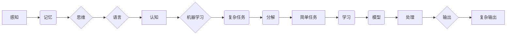

# 认知发展中的简单与复杂

> 关键词：认知发展，简单化，复杂性，算法，机器学习，人工智能，人脑，信息处理

## 1. 背景介绍

人类认知发展始终伴随着对复杂世界的不断理解和简化。从婴儿学习识别简单图形到成人处理复杂的社会关系，认知发展过程揭示了从简单到复杂的信息处理机制。随着人工智能技术的飞速发展，机器学习模型在处理复杂任务时展现出惊人的能力，但其背后的原理是否与人脑的认知发展有相似之处？本文将探讨认知发展中的简单与复杂，分析人类认知和机器学习模型在这方面的共性与差异。

### 1.1 认知发展的起源

人类认知发展始于婴儿期，通过感知、记忆、思维等过程，逐步建立起对周围世界的理解。这一过程经历了从简单到复杂的变化，如下所述：

- **感知阶段**：婴儿通过视觉、听觉、触觉等感官，初步感知周围环境。
- **记忆阶段**：婴儿开始记忆简单的声音、图像和事件。
- **思维阶段**：婴儿逐渐发展出基本的思维能力，如分类、比较、推理等。
- **语言阶段**：婴儿开始学习语言，通过语言表达自己的思想和情感。

### 1.2 人工智能与认知发展

人工智能技术，尤其是机器学习模型，在处理复杂任务时展现出惊人的能力。然而，这些模型的设计和训练是否遵循了人类认知发展的规律呢？

## 2. 核心概念与联系

### 2.1 简单与复杂

**简单**通常指信息处理过程中易于理解和操作的特征，如线性、规则、模式等。**复杂**则指信息处理过程中包含多种因素、多层次结构、非线性关系等特征。

在认知发展中，人类通过将复杂信息分解为简单的组成部分，逐步建立起对世界的理解。同样，机器学习模型也遵循这一原则，通过将复杂任务分解为简单的学习任务，实现高效的信息处理。

### 2.2 Mermaid 流程图

以下是一个Mermaid流程图，展示了人类认知发展和机器学习模型在处理信息时，从简单到复杂的转变过程：



### 2.3 核心概念联系

从流程图中可以看出，人类认知发展和机器学习模型在处理信息时都经历了从简单到复杂的过程。以下是几个核心概念之间的联系：

- **感知与记忆**：感知是获取信息的基础，记忆是信息处理的关键。
- **思维与语言**：思维是对信息的加工和整合，语言是信息的表达和传播。
- **机器学习与任务**：机器学习是处理信息的方法，任务是实现目标的具体应用。
- **简单任务与复杂输出**：通过将复杂任务分解为简单任务，机器学习模型能够实现复杂输出。

## 3. 核心算法原理 & 具体操作步骤

### 3.1 算法原理概述

机器学习模型通常遵循以下原理，实现从简单到复杂的信息处理：

- **特征提取**：从原始数据中提取有用的特征，降低数据维度。
- **模式识别**：在特征空间中寻找模式，进行分类、回归等任务。
- **模型优化**：通过调整模型参数，提高模型性能。

### 3.2 算法步骤详解

以下是一个简单的机器学习模型训练流程，展示了从简单到复杂的信息处理过程：

1. **数据收集**：收集用于训练的数据集。
2. **数据预处理**：对数据进行清洗、归一化等处理，提高数据质量。
3. **特征提取**：从数据中提取有用的特征。
4. **模型选择**：选择合适的机器学习模型。
5. **模型训练**：使用训练数据训练模型，调整模型参数。
6. **模型评估**：使用测试数据评估模型性能。
7. **模型部署**：将模型应用到实际任务中。

### 3.3 算法优缺点

- **优点**：机器学习模型能够高效地处理复杂任务，具有强大的泛化能力。
- **缺点**：模型训练需要大量的数据和计算资源，且模型的解释性较差。

### 3.4 算法应用领域

机器学习模型在各个领域都有广泛的应用，如：

- **图像识别**：通过图像特征识别物体、场景等。
- **语音识别**：将语音信号转换为文本。
- **自然语言处理**：理解和处理自然语言。
- **推荐系统**：为用户推荐感兴趣的内容。

## 4. 数学模型和公式 & 详细讲解 & 举例说明

### 4.1 数学模型构建

以下是一个简单的线性回归模型，用于预测房价：

$$
y = \beta_0 + \beta_1 x_1 + \beta_2 x_2 + \cdots + \beta_n x_n + \epsilon
$$

其中，$y$ 为目标变量，$x_1, x_2, \cdots, x_n$ 为特征变量，$\beta_0, \beta_1, \beta_2, \cdots, \beta_n$ 为模型参数，$\epsilon$ 为误差项。

### 4.2 公式推导过程

线性回归模型的目的是通过最小化误差平方和来估计模型参数。误差平方和公式如下：

$$
\text{RSS} = \sum_{i=1}^n (y_i - \hat{y}_i)^2
$$

其中，$y_i$ 为实际值，$\hat{y}_i$ 为预测值。

为了最小化误差平方和，我们对模型参数进行求导，并令导数为0，得到以下公式：

$$
\beta_k = \frac{\sum_{i=1}^n (y_i - \hat{y}_i) x_k}{\sum_{i=1}^n x_k^2}
$$

### 4.3 案例分析与讲解

假设我们有一组包含房价和面积的数据，如下表所示：

| 面积（平方米） | 房价（万元） |
| --- | --- |
| 50 | 100 |
| 80 | 150 |
| 100 | 200 |
| 120 | 250 |

我们可以使用线性回归模型来预测未知面积的房价。首先，我们将数据转换为矩阵形式：

$$
\mathbf{X} = \begin{bmatrix} 1 & 50 \\ 1 & 80 \\ 1 & 100 \\ 1 & 120 \end{bmatrix}, \quad \mathbf{y} = \begin{bmatrix} 100 \\ 150 \\ 200 \\ 250 \end{bmatrix}
$$

然后，使用最小二乘法求解模型参数：

$$
\mathbf{\beta} = (\mathbf{X}^\top \mathbf{X})^{-1} \mathbf{X}^\top \mathbf{y}
$$

计算得到：

$$
\mathbf{\beta} = \begin{bmatrix} \beta_0 \\ \beta_1 \end{bmatrix} = \begin{bmatrix} -3.3333 \\ 2.3333 \end{bmatrix}
$$

因此，线性回归模型的预测公式为：

$$
\hat{y} = -3.3333 + 2.3333 x
$$

当面积为150平方米时，预测房价为：

$$
\hat{y} = -3.3333 + 2.3333 \times 150 = 216.6667
$$

## 5. 项目实践：代码实例和详细解释说明

### 5.1 开发环境搭建

使用Python和Scikit-learn库进行线性回归模型训练。

### 5.2 源代码详细实现

```python
import numpy as np
from sklearn.linear_model import LinearRegression
from sklearn.model_selection import train_test_split

# 创建数据
X = np.array([[1, 50], [1, 80], [1, 100], [1, 120]])
y = np.array([100, 150, 200, 250])

# 划分训练集和测试集
X_train, X_test, y_train, y_test = train_test_split(X, y, test_size=0.2, random_state=42)

# 创建模型
model = LinearRegression()

# 训练模型
model.fit(X_train, y_train)

# 预测
predictions = model.predict(X_test)

# 评估模型
print("Mean squared error:", np.mean((y_test - predictions) ** 2))

# 输出模型参数
print("Model coefficients:", model.coef_)
```

### 5.3 代码解读与分析

- 首先，我们导入必要的库。
- 然后，创建包含房价和面积的数据。
- 接着，将数据划分为训练集和测试集。
- 创建线性回归模型并训练。
- 最后，使用测试集评估模型性能，并输出模型参数。

## 6. 实际应用场景

### 6.1 房价预测

线性回归模型可以用于预测房价，为购房者提供参考。

### 6.2 销售预测

线性回归模型可以用于预测产品销量，为企业制定销售策略提供支持。

### 6.3 信用评分

线性回归模型可以用于评估客户信用等级，为金融机构风险控制提供依据。

## 7. 工具和资源推荐

### 7.1 学习资源推荐

- 《Python数据分析实战》
- 《机器学习实战》
- Scikit-learn官方文档

### 7.2 开发工具推荐

- Jupyter Notebook
- Scikit-learn

### 7.3 相关论文推荐

- "Introduction to Statistical Learning" by Gareth James, Daniela Witten, Trevor Hastie, and Robert Tibshirani
- "The Elements of Statistical Learning" by Trevor Hastie, Robert Tibshirani, and Jerome Friedman

## 8. 总结：未来发展趋势与挑战

### 8.1 研究成果总结

本文探讨了认知发展中的简单与复杂，分析了人类认知和机器学习模型在信息处理方面的共性与差异。通过构建Mermaid流程图，展示了从简单到复杂的信息处理过程。同时，以线性回归模型为例，详细讲解了机器学习算法的原理和实现。

### 8.2 未来发展趋势

随着人工智能技术的不断发展，未来机器学习模型在信息处理方面的能力将得到进一步提升。以下是一些可能的发展趋势：

- **更复杂的模型**：随着计算资源的提升，机器学习模型将更加复杂，能够处理更复杂的任务。
- **更高效的学习算法**：开发更高效的学习算法，降低模型训练成本。
- **更可解释的模型**：提高模型的可解释性，方便用户理解和信任。

### 8.3 面临的挑战

尽管机器学习模型在信息处理方面取得了显著进展，但仍面临以下挑战：

- **数据质量问题**：模型性能依赖于数据质量，如何获取高质量的数据是一个挑战。
- **可解释性问题**：如何提高模型的可解释性，让用户理解模型的决策过程。
- **计算资源限制**：模型训练和推理需要大量的计算资源，如何降低资源消耗是一个挑战。

### 8.4 研究展望

未来，机器学习模型将在信息处理方面发挥更加重要的作用。以下是一些可能的研究方向：

- **跨领域迁移学习**：提高模型在不同领域的迁移能力。
- **少样本学习**：减少对大量标注数据的依赖。
- **可解释人工智能**：提高模型的可解释性，让用户信任和接受。

## 9. 附录：常见问题与解答

**Q1：机器学习模型是否能够完全模拟人类认知？**

A：目前，机器学习模型还不能完全模拟人类认知。虽然机器学习模型在处理复杂任务时表现出色，但其背后的原理和人类认知仍存在差异。

**Q2：如何提高机器学习模型的性能？**

A：提高机器学习模型性能的方法包括：
- 使用更复杂的模型结构
- 收集更多高质量的数据
- 使用更有效的训练方法

**Q3：机器学习模型是否具有通用性？**

A：机器学习模型具有一定的通用性，但通常需要针对特定任务进行调整和优化。

**Q4：如何评估机器学习模型的性能？**

A：评估机器学习模型性能的方法包括：
- 交叉验证
- 模型集成
- 指标评估

**Q5：机器学习模型是否会取代人类？**

A：机器学习模型是辅助人类工作的工具，不能完全取代人类。在处理复杂任务时，人类仍然具有不可替代的优势。

作者：禅与计算机程序设计艺术 / Zen and the Art of Computer Programming