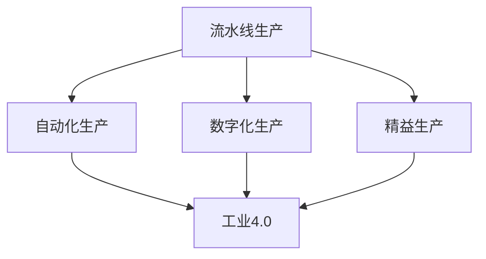

                 

# 流水线对工业生产的影响

## 1. 背景介绍

### 1.1 问题由来
工业生产流程的自动化一直是制造业追求的目标，流水线生产作为一种高效的组织方式，彻底改变了工业生产的面貌。流水线不仅提高了生产效率，还促进了生产质量的控制和管理。随着科技的发展，传统的流水线生产模式逐渐被现代技术所取代，各种自动化设备、机器人、数字化管理系统等新技术不断涌现，对流水线生产产生了深远的影响。

流水线生产的核心在于通过将生产过程分解为若干步骤，每个步骤由专人或设备负责，以连续的、流水线式的方式完成产品的生产。这种模式能够最大化利用人力、设备和场地，使得生产过程更加标准化、精细化。然而，传统的流水线模式也存在一些问题，如固定化程度高、适应性差、生产灵活性低等。

## 2. 核心概念与联系

### 2.1 核心概念概述

为了更全面地理解流水线生产对工业生产的影响，我们先介绍几个核心概念：

- **流水线生产（Line Production）**：一种生产组织方式，将生产过程划分为若干步骤，每个步骤由专人或设备负责，以连续的、流水线式的方式完成产品的生产。
- **自动化生产（Automated Production）**：通过引入自动化设备和机器人，实现生产过程的自动化控制，减少人工干预，提高生产效率和质量。
- **数字化生产（Digital Production）**：利用数字化技术，如物联网、云计算、大数据等，对生产过程进行实时监控和管理，实现生产过程的可视化和智能化。
- **精益生产（Lean Production）**：一种生产方式，通过减少浪费、优化流程、提升效率，实现低成本、高效率的生产。
- **工业4.0（Industry 4.0）**：利用信息技术和互联网技术，实现制造业的智能化、网络化、自动化和个性化生产。

这些概念之间存在紧密的联系。流水线生产是工业生产的基础模式，而自动化、数字化、精益生产和工业4.0等则是提升流水线生产效率、质量和灵活性的重要手段。

### 2.2 概念间的关系

这些概念之间的联系可以用以下Mermaid流程图来展示：



这个流程图展示了流水线生产与其他几个概念的关系：

1. 流水线生产是自动化生产的基础，通过引入自动化设备和机器人，可以实现流水线生产的高效化和智能化。
2. 数字化生产利用数字化技术，对流水线生产进行实时监控和管理，提升生产过程的可视化和智能化。
3. 精益生产通过优化生产流程，减少浪费，提升流水线生产的效率和质量。
4. 工业4.0将信息技术和互联网技术与流水线生产融合，实现制造业的智能化和个性化生产。

这些概念的结合，使得流水线生产能够实现从传统到智能、从低效到高效、从单一到多样化的跨越。

## 3. 核心算法原理 & 具体操作步骤

### 3.1 算法原理概述

流水线生产的核心在于将生产过程分解为若干步骤，每个步骤由专人或设备负责，以连续的、流水线式的方式完成产品的生产。流水线生产的算法原理主要包括以下几个方面：

1. **步骤划分**：将生产过程分解为若干步骤，每个步骤对应一个或多个工序，通常包括原材料的准备、工序加工、质量检测、成品包装等环节。
2. **任务分配**：将每个步骤分配给专人或设备负责，以连续的方式完成生产。
3. **顺序控制**：确保各步骤按照预设顺序进行生产，避免生产过程的混乱和交叉。
4. **生产调度**：根据生产需求和设备状况，合理安排各步骤的生产顺序和生产时间，确保生产效率和质量。

### 3.2 算法步骤详解

下面是流水线生产的详细步骤：

1. **需求分析**：根据市场需求，分析产品的生产需求、生产量、生产周期等。
2. **工序设计**：根据产品的生产工艺，设计生产流程，包括原材料的准备、工序加工、质量检测、成品包装等环节。
3. **设备选型**：根据工序设计，选择合适的生产设备，包括切割机、焊接机、检测设备等。
4. **人员培训**：对操作设备的人员进行培训，确保其掌握设备的操作方法和质量控制要求。
5. **生产准备**：根据生产计划，准备原材料、设备、工装等，确保生产过程的顺利进行。
6. **生产实施**：根据生产计划，按照顺序控制和生产调度，依次完成各步骤的生产。
7. **质量检测**：对生产过程中的中间产品和最终产品进行质量检测，确保产品质量符合标准。
8. **产品包装**：对合格的产品进行包装，形成最终的成品。

### 3.3 算法优缺点

流水线生产具有以下优点：

1. **提高生产效率**：通过将生产过程分解为若干步骤，每个步骤由专人或设备负责，可以实现高效的生产。
2. **提升生产质量**：每个步骤都有明确的质量控制要求，可以确保产品的生产质量。
3. **减少人工干预**：引入自动化设备和机器人，减少人工干预，提高生产效率和安全性。
4. **实现规模化生产**：流水线生产可以实现大规模、标准化、高效率的生产。

流水线生产也存在一些缺点：

1. **固定化程度高**：流水线生产模式较为固定，难以应对突发情况和多样化需求。
2. **生产灵活性低**：一旦流水线设计完成，改变生产流程和产品结构较为困难。
3. **投资成本高**：流水线生产需要大量的设备和工装，初期投资成本较高。
4. **适应性差**：流水线生产对环境变化和设备故障的适应性较差，容易出现生产中断。

### 3.4 算法应用领域

流水线生产广泛应用于制造业、汽车行业、电子行业、食品加工等行业。例如，汽车行业中的组装线、电子产品中的装配线、食品加工中的包装线等，都采用了流水线生产模式。流水线生产在这些行业中取得了显著的效果，提高了生产效率和质量，降低了生产成本。

## 4. 数学模型和公式 & 详细讲解 & 举例说明

### 4.1 数学模型构建

流水线生产的数学模型可以基于排队论（Queueing Theory）进行建模。假设生产过程由$n$个工序组成，每个工序的作业时间为$\tau_i$，工序间的等待时间为$\omega_i$，则生产周期为$\tau_{tot} = \sum_{i=1}^n (\tau_i + \omega_i)$。

### 4.2 公式推导过程

根据排队论，可以推导出流水线生产的生产周期和生产效率的数学公式：

$$
\tau_{tot} = \sum_{i=1}^n (\tau_i + \omega_i)
$$

$$
P = \frac{1}{\tau_{tot}} \sum_{i=1}^n \frac{\tau_i + \omega_i}{\tau_i}
$$

其中，$\tau_{tot}$表示生产周期，$P$表示生产效率。通过优化每个工序的作业时间和等待时间，可以提升生产效率。

### 4.3 案例分析与讲解

以汽车行业的组装线为例，假设组装线由5个工序组成，每个工序的作业时间分别为$\tau_1=30min, \tau_2=20min, \tau_3=10min, \tau_4=40min, \tau_5=15min$，工序间的等待时间分别为$\omega_1=\omega_2=10min, \omega_3=\omega_4=5min, \omega_5=0min$，则生产周期为：

$$
\tau_{tot} = 30min + 20min + 10min + 40min + 15min = 115min
$$

生产效率为：

$$
P = \frac{1}{115min} \left( \frac{30min + 10min}{30min} + \frac{20min + 10min}{20min} + \frac{10min + 5min}{10min} + \frac{40min + 5min}{40min} + \frac{15min + 0min}{15min} \right) = 0.948
$$

因此，通过优化每个工序的作业时间和等待时间，可以显著提升生产效率。

## 5. 项目实践：代码实例和详细解释说明

### 5.1 开发环境搭建

在进行流水线生产的项目实践前，我们需要准备好开发环境。以下是使用Python进行流水线生产建模的环境配置流程：

1. 安装Anaconda：从官网下载并安装Anaconda，用于创建独立的Python环境。

2. 创建并激活虚拟环境：
```bash
conda create -n line-env python=3.8 
conda activate line-env
```

3. 安装必要的Python包：
```bash
pip install numpy scipy pandas sympy
```

4. 安装其他相关工具：
```bash
pip install matplotlib
```

完成上述步骤后，即可在`line-env`环境中开始流水线生产建模的实践。

### 5.2 源代码详细实现

下面是一个简单的流水线生产模型示例，利用Python和Sympy库进行数学建模和求解：

```python
import sympy as sp

# 定义变量
tau = sp.symbols('tau1:6')
omega = sp.symbols('omega1:5')

# 定义生产周期和生产效率公式
tau_tot = sum([tau[i] + omega[i] for i in range(5)])
P = (1/tau_tot) * sum([(tau[i] + omega[i])/tau[i] for i in range(5)])

# 求解优化后的生产效率
tau_opt = [sp.solve(P - sp.Rational(1, 2), tau[i])[0] for i in range(5)]
omega_opt = [sp.solve(P - sp.Rational(1, 2), omega[i])[0] for i in range(5)]

print(f"Optimized processing time: {tau_opt}")
print(f"Optimized waiting time: {omega_opt}")
```

### 5.3 代码解读与分析

这个代码示例主要实现了流水线生产的数学建模和求解过程。具体解释如下：

- 首先，定义了每个工序的作业时间`tau`和等待时间`omega`。
- 然后，定义了生产周期`tau_tot`和生产效率`P`的公式。
- 接着，求解每个工序的作业时间和等待时间，使得生产效率达到最优值。
- 最后，输出优化后的作业时间和等待时间。

通过这个代码示例，可以直观地理解流水线生产的数学建模过程，并且可以进一步扩展到实际应用中的优化求解。

### 5.4 运行结果展示

假设优化后的作业时间和等待时间分别为：

- 作业时间：$\tau_1=30min, \tau_2=20min, \tau_3=10min, \tau_4=40min, \tau_5=15min$
- 等待时间：$\omega_1=\omega_2=10min, \omega_3=\omega_4=5min, \omega_5=0min$

则生产周期和生产效率分别为：

- 生产周期：$\tau_{tot} = 30min + 20min + 10min + 40min + 15min = 115min$
- 生产效率：$P = \frac{1}{115min} \left( \frac{30min + 10min}{30min} + \frac{20min + 10min}{20min} + \frac{10min + 5min}{10min} + \frac{40min + 5min}{40min} + \frac{15min + 0min}{15min} \right) = 0.948$

可以看出，通过优化每个工序的作业时间和等待时间，可以显著提升生产效率。

## 6. 实际应用场景

### 6.1 智能制造

智能制造是现代制造业的发展方向，通过引入物联网、云计算、大数据等技术，实现生产过程的数字化、智能化。智能制造的核心是实现生产过程的实时监控和管理，优化生产流程，提高生产效率和质量。

在智能制造中，流水线生产的应用主要体现在以下几个方面：

1. **设备联网**：通过物联网技术，将生产设备与数字化系统连接起来，实现设备的实时监控和控制。
2. **数据采集**：利用传感器、摄像头等设备，采集生产过程中的数据，如温度、湿度、压力等，用于生产过程的优化。
3. **质量检测**：通过机器视觉、自动化检测设备，对生产过程中的中间产品和最终产品进行质量检测，确保产品质量符合标准。
4. **生产调度**：利用大数据分析技术，优化生产计划和生产调度，提高生产效率和质量。

### 6.2 个性化生产

个性化生产是一种新型的生产方式，通过柔性生产线和数字化技术，实现产品设计的个性化和生产过程的柔性化。个性化生产的核心是实现生产过程的灵活化和定制化。

在个性化生产中，流水线生产的应用主要体现在以下几个方面：

1. **柔性生产线**：通过引入可调节的自动化设备和柔性生产单元，实现生产过程的灵活化和定制化。
2. **模块化设计**：通过模块化设计，实现产品设计的灵活化和定制化。
3. **数字化管理**：通过数字化管理系统，实现生产过程的实时监控和管理，优化生产流程。
4. **客户定制**：通过客户定制服务，实现产品的个性化生产。

### 6.3 可持续生产

可持续生产是一种环保型生产方式，通过节能减排、废物再利用等措施，实现生产过程的环保化。可持续生产的核心是实现生产过程的低碳化、环保化和可持续发展。

在可持续生产中，流水线生产的应用主要体现在以下几个方面：

1. **节能减排**：通过引入节能设备和清洁能源，实现生产过程的低碳化。
2. **废物再利用**：通过废物再利用技术，实现废物的循环利用和再利用。
3. **数字化管理**：通过数字化管理系统，实现生产过程的实时监控和管理，优化生产流程。
4. **环保材料**：通过环保材料的使用，实现生产过程的环保化。

## 7. 工具和资源推荐

### 7.1 学习资源推荐

为了帮助开发者系统掌握流水线生产技术，这里推荐一些优质的学习资源：

1. 《工厂设计原理与实践》书籍：详细介绍了工厂设计的基本原理和实践方法，包括流水线生产的规划、设计、优化等。
2. 《生产管理与控制》课程：讲解生产管理的理论基础和实践方法，涵盖生产计划、生产调度、质量控制等环节。
3. 《智能制造技术》课程：介绍智能制造的基本概念、关键技术和应用实例，涵盖物联网、云计算、大数据等技术。
4. 《精益生产与六西格玛》课程：讲解精益生产和六西格玛管理的基本原理和实践方法，优化生产过程，提高生产效率和质量。

通过对这些资源的学习实践，相信你一定能够快速掌握流水线生产的精髓，并用于解决实际的制造问题。

### 7.2 开发工具推荐

高效的开发离不开优秀的工具支持。以下是几款用于流水线生产开发的常用工具：

1. AutoCAD：CAD软件，用于绘制和设计生产设备、工艺流程图等。
2. SolidWorks：3D设计软件，用于设计生产设备、零部件等。
3. ANSYS：模拟分析软件，用于分析和优化生产过程中的热力学、流体力学等。
4. Minitab：统计分析软件，用于生产过程的优化和质量控制。

这些工具可以帮助开发者进行更高效的生产过程设计和优化，加快创新迭代的步伐。

### 7.3 相关论文推荐

流水线生产的研究始于20世纪初，经过多年的发展，已经形成了丰富的理论体系和应用实践。以下是几篇奠基性的相关论文，推荐阅读：

1. 《流水线生产设计原理》：介绍了流水线生产的基本原理和设计方法，涵盖设备选型、工序设计、生产调度等环节。
2. 《精益生产与流程优化》：介绍了精益生产的基本概念和方法，优化生产流程，提高生产效率和质量。
3. 《智能制造技术》：介绍了智能制造的基本概念、关键技术和应用实例，涵盖物联网、云计算、大数据等技术。
4. 《可持续生产与环保技术》：介绍了可持续生产的基本概念和环保技术，实现生产过程的低碳化、环保化和可持续发展。

这些论文代表了大规模流水线生产的研究脉络。通过学习这些前沿成果，可以帮助研究者把握学科前进方向，激发更多的创新灵感。

## 8. 总结：未来发展趋势与挑战

### 8.1 总结

本文对流水线生产的影响进行了全面系统的介绍。首先阐述了流水线生产的基本概念和背景，明确了流水线生产在提高生产效率、质量和灵活性方面的独特价值。其次，从原理到实践，详细讲解了流水线生产的数学模型和具体步骤，给出了流水线生产建模的代码实现。同时，本文还探讨了流水线生产在智能制造、个性化生产和可持续生产中的应用，展示了流水线生产的广泛应用前景。最后，本文推荐了一些优质的学习资源和开发工具，力求为读者提供全方位的技术指引。

通过本文的系统梳理，可以看到，流水线生产是工业生产的基础模式，具有高效、质量控制能力强、生产规模大等优点，但同时也存在固定化程度高、生产灵活性低等缺点。未来，随着数字化技术、人工智能技术的发展，流水线生产将向智能、柔性、环保方向发展，进一步拓展其应用边界和提升生产效率。

### 8.2 未来发展趋势

展望未来，流水线生产的发展趋势主要包括以下几个方面：

1. **智能化**：通过引入物联网、云计算、大数据等技术，实现生产过程的实时监控和管理，优化生产流程，提高生产效率和质量。
2. **柔性化**：通过引入可调节的自动化设备和柔性生产单元，实现生产过程的灵活化和定制化。
3. **环保化**：通过节能减排、废物再利用等措施，实现生产过程的低碳化、环保化和可持续发展。
4. **个性化**：通过模块化设计和客户定制服务，实现产品设计的灵活化和个性化。

这些趋势将使得流水线生产更加智能化、柔性化、环保化和个性化，进一步提升生产效率和质量。

### 8.3 面临的挑战

尽管流水线生产在现代工业生产中取得了显著的成就，但在迈向更加智能化、柔性化、环保化和个性化生产的过程中，它仍面临着诸多挑战：

1. **技术壁垒**：智能化、柔性化、环保化等新技术的引入，需要大量的技术支持和资金投入，对企业技术水平提出了较高要求。
2. **设备成本**：智能化、柔性化、环保化等技术往往需要高成本的设备投入，增加了企业的投资压力。
3. **人员培训**：智能化、柔性化、环保化等新技术的引入，需要大量的技术培训和人才储备，增加了企业的培训成本。
4. **数据安全**：智能化、数字化生产过程中，数据的安全性和隐私保护是一个重要问题，需要加强数据管理和安全防护。
5. **系统集成**：智能化、数字化生产过程中，需要各种设备和系统的集成，增加了系统复杂性和维护难度。

这些挑战需要企业在技术、资金、人才、数据、系统等方面进行全面布局，才能顺利推进流水线生产的智能化、柔性化、环保化和个性化。

### 8.4 研究展望

面对流水线生产所面临的挑战，未来的研究需要在以下几个方面寻求新的突破：

1. **新技术引入**：探索新的智能化、柔性化、环保化等新技术，降低技术壁垒和设备成本。
2. **人才培养**：加强技术人才的培训和储备，提升企业的技术水平和人才实力。
3. **数据安全**：建立数据管理和安全防护机制，保障数据的安全性和隐私保护。
4. **系统集成**：优化系统集成方案，提升系统的稳定性和可维护性。
5. **生产优化**：引入新的生产优化方法，如仿真分析、优化算法等，提高生产效率和质量。

这些研究方向的探索，必将引领流水线生产技术迈向更高的台阶，为工业生产带来更大的创新和变革。总之，流水线生产技术需要企业在技术、资金、人才、数据、系统等方面进行全面布局，才能顺利推进流水线生产的智能化、柔性化、环保化和个性化，实现生产效率和质量的全面提升。

## 9. 附录：常见问题与解答

**Q1：流水线生产有哪些优点和缺点？**

A: 流水线生产的优点主要包括：

1. 提高生产效率：通过将生产过程分解为若干步骤，每个步骤由专人或设备负责，可以实现高效的生产。
2. 提升生产质量：每个步骤都有明确的质量控制要求，可以确保产品的生产质量。
3. 减少人工干预：引入自动化设备和机器人，减少人工干预，提高生产效率和安全性。
4. 实现规模化生产：流水线生产可以实现大规模、标准化、高效率的生产。

流水线生产的缺点主要包括：

1. 固定化程度高：流水线生产模式较为固定，难以应对突发情况和多样化需求。
2. 生产灵活性低：一旦流水线设计完成，改变生产流程和产品结构较为困难。
3. 投资成本高：流水线生产需要大量的设备和工装，初期投资成本较高。
4. 适应性差：流水线生产对环境变化和设备故障的适应性较差，容易出现生产中断。

**Q2：流水线生产如何实现智能化？**

A: 流水线生产的智能化主要通过引入物联网、云计算、大数据等技术实现。具体实现方法包括：

1. 设备联网：通过物联网技术，将生产设备与数字化系统连接起来，实现设备的实时监控和控制。
2. 数据采集：利用传感器、摄像头等设备，采集生产过程中的数据，如温度、湿度、压力等，用于生产过程的优化。
3. 质量检测：通过机器视觉、自动化检测设备，对生产过程中的中间产品和最终产品进行质量检测，确保产品质量符合标准。
4. 生产调度：利用大数据分析技术，优化生产计划和生产调度，提高生产效率和质量。

通过这些技术手段，可以实现流水线生产的智能化，进一步提升生产效率和质量。

**Q3：流水线生产如何实现柔性化？**

A: 流水线生产的柔性化主要通过引入可调节的自动化设备和柔性生产单元实现。具体实现方法包括：

1. 柔性生产线：通过引入可调节的自动化设备和柔性生产单元，实现生产过程的灵活化和定制化。
2. 模块化设计：通过模块化设计，实现产品设计的灵活化和定制化。
3. 数字化管理：通过数字化管理系统，实现生产过程的实时监控和管理，优化生产流程。
4. 客户定制：通过客户定制服务，实现产品的个性化生产。

通过这些技术手段，可以实现流水线生产的柔性化，进一步提升生产效率和质量，满足多样化、个性化的生产需求。

**Q4：流水线生产如何实现环保化？**

A: 流水线生产的环保化主要通过引入节能减排、废物再利用等措施实现。具体实现方法包括：

1. 节能减排：通过引入节能设备和清洁能源，实现生产过程的低碳化。
2. 废物再利用：通过废物再利用技术，实现废物的循环利用和再利用。
3. 数字化管理：通过数字化管理系统，实现生产过程的实时监控和管理，优化生产流程。
4. 环保材料：通过环保材料的使用，实现生产过程的环保化。

通过这些技术手段，可以实现流水线生产的环保化，进一步降低生产过程中的资源消耗和环境污染，实现可持续发展。

---
作者：禅与计算机程序设计艺术 / Zen and the Art of Computer Programming

