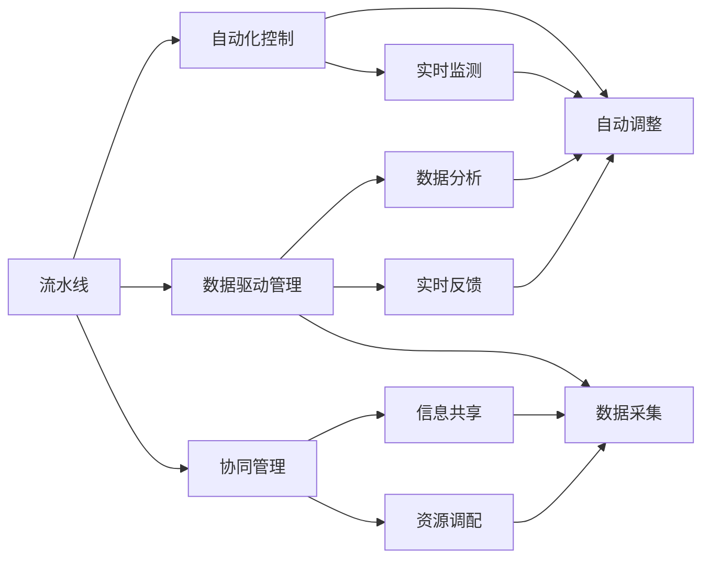
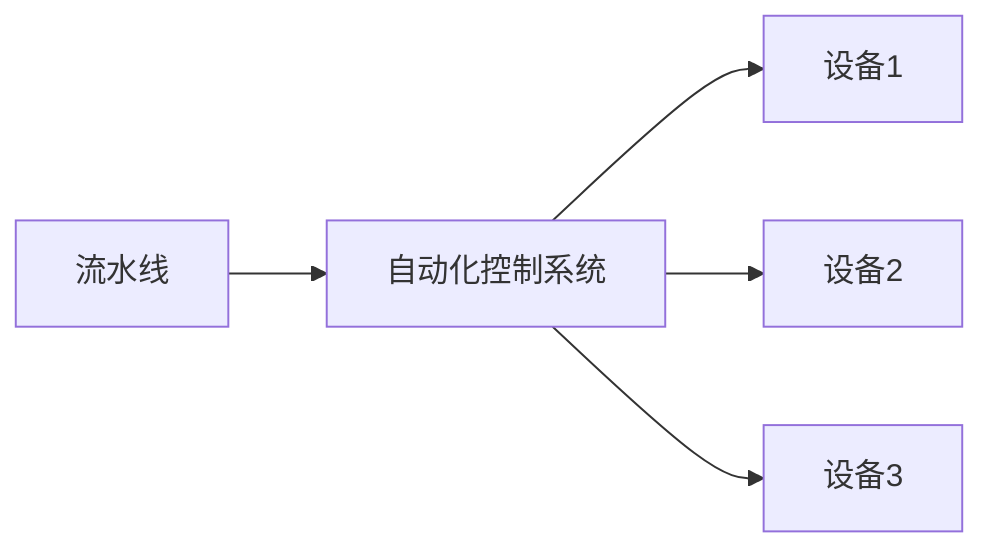
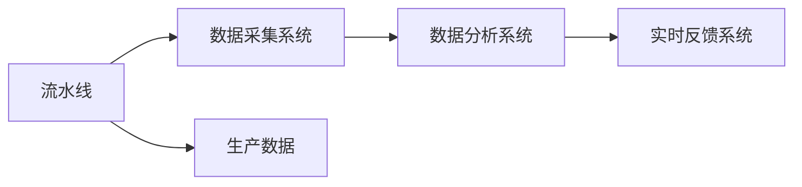
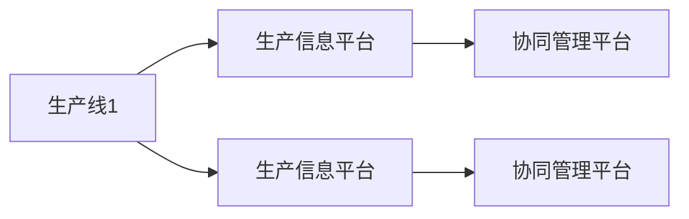
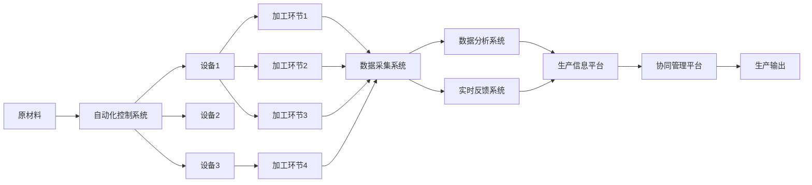

                 

# 流水线的威力与生产效率提升

## 1. 背景介绍

### 1.1 问题由来
随着企业数字化转型的深入，生产效率的提升成为各行业日益关注的问题。在制造业，流水线作业是提高生产效率的重要手段。然而，传统的流水线往往面临着高成本、高风险、低柔性等问题。如何在保证生产质量的同时，降低成本、提高效率，提升灵活性，是当前需要解决的关键挑战。

现代计算机技术的飞速发展，特别是流水线工程自动化和信息化系统的推广应用，为解决这些挑战提供了新的思路和方案。本文将详细介绍流水线的核心概念、算法原理和实际操作，并通过具体案例展示流水线在生产效率提升中的应用，为相关从业者提供实用的技术指导。

### 1.2 问题核心关键点
流水线是生产制造中一种重要的组织管理方式，通过将生产活动划分为多个连续的加工阶段，使得生产过程更加高效、稳定。流水线的关键在于流程优化、自动化控制和数据驱动管理，以实现生产效率的最大化。

具体而言，流水线系统的设计需关注以下几个核心点：
- 优化生产流程：通过分析生产工艺和设备布局，设计最优的生产流程，减少瓶颈环节。
- 自动化控制：采用先进的自动化设备，实现生产过程的精确控制。
- 数据驱动管理：利用信息技术手段，对生产数据进行采集、分析和反馈，实时调整生产计划和策略。
- 协同管理：确保各环节间的高效协作，实现信息互通和资源共享。

这些关键点共同构成了流水线系统的核心功能，使其能够在不同行业场景下发挥出巨大的生产效率提升潜力。

### 1.3 问题研究意义
研究流水线的设计和管理方法，对于推动传统产业的数字化转型，提升生产效率，降低生产成本，提高产品质量，具有重要意义：

1. 提升生产效率：通过优化生产流程和自动化控制，减少生产时间，提高产出率。
2. 降低生产成本：减少人工和能源消耗，降低废品率，提升资源利用率。
3. 提高产品质量：通过数据驱动的管理和质量监控，确保产品的一致性和稳定性。
4. 增强灵活性：采用模块化设计和柔性自动化技术，适应不同产品需求和市场变化。
5. 提升竞争力：通过精益生产和管理创新，增强企业在市场中的竞争力。

## 2. 核心概念与联系

### 2.1 核心概念概述

为更好地理解流水线系统及其在生产效率提升中的应用，本节将介绍几个密切相关的核心概念：

- 流水线(Line Production)：指在生产制造过程中，按照固定顺序依次进行的多个加工环节。每个环节负责特定的生产任务，通常由专人负责操作。
- 自动化控制(Automated Control)：通过计算机技术和传感器技术，实现生产过程的自动化控制。自动化控制系统能够实时监测生产状态，自动调整设备参数，确保生产过程的稳定性和精度。
- 数据驱动管理(Data-Driven Management)：利用大数据分析和人工智能技术，对生产数据进行采集、分析和应用，优化生产决策和管理流程。数据驱动管理能够提供实时、准确的生产信息，支持生产计划和策略的动态调整。
- 协同管理(Collaborative Management)：确保生产线上的各环节间信息互通，资源共享，提升生产协调性和效率。协同管理通常通过信息化系统实现，支持跨部门、跨企业的协同工作。
- 精益生产(Lean Production)：指通过消除浪费、提升效率、优化流程等手段，最大化利用资源，提升产品质量和生产效率的生产管理方法。精益生产强调以客户需求为导向，追求高效、低成本、灵活的生产模式。

这些核心概念之间的逻辑关系可以通过以下Mermaid流程图来展示：



这个流程图展示了流水线的核心概念及其之间的关系：

1. 流水线是生产的基础单元，自动化控制、数据驱动管理、协同管理都围绕流水线进行。
2. 自动化控制通过实时监测和自动调整，提升生产效率和质量。
3. 数据驱动管理通过数据采集、分析和实时反馈，优化生产决策和流程。
4. 协同管理通过信息共享和资源调配，实现生产线的高效协作。

这些概念共同构成了流水线系统的核心功能，使其能够在不同行业场景下发挥出巨大的生产效率提升潜力。

### 2.2 概念间的关系

这些核心概念之间存在着紧密的联系，形成了流水线系统的完整生态系统。下面我通过几个Mermaid流程图来展示这些概念之间的关系。

#### 2.2.1 流水线的基本结构


这个流程图展示了流水线的基本结构，包括生产输入、加工环节和生产输出。

#### 2.2.2 流水线与自动化控制的关系



这个流程图展示了流水线与自动化控制的关系，自动化控制系统通过控制设备参数，实现生产过程的精确控制。

#### 2.2.3 流水线与数据驱动管理的关系



这个流程图展示了流水线与数据驱动管理的关系，数据采集系统收集生产数据，数据分析系统分析数据，实时反馈系统根据分析结果实时调整生产参数。

#### 2.2.4 流水线与协同管理的关系



这个流程图展示了流水线与协同管理的关系，生产信息平台收集生产线上的数据，协同管理平台实现跨部门、跨企业的信息共享和资源调配。

### 2.3 核心概念的整体架构

最后，我们用一个综合的流程图来展示这些核心概念在大规模生产中的整体架构：



这个综合流程图展示了从原材料输入到生产输出的全过程。流水线通过自动化控制和数据驱动管理，实现高效、稳定的生产。同时，协同管理平台确保各环节间的信息互通和资源共享，提升生产协调性和效率。通过这些环节的紧密合作，流水线系统能够实现生产效率的最大化。

## 3. 核心算法原理 & 具体操作步骤
### 3.1 算法原理概述

流水线系统的设计和管理，本质上是一个优化问题，通过优化生产流程、自动化控制和协同管理，实现生产效率的最大化。其核心思想是：通过对生产数据的实时采集和分析，自动调整生产参数，优化生产流程，确保生产过程的高效、稳定。

具体而言，流水线系统通过以下步骤实现生产效率的提升：

1. **数据采集与分析**：利用传感器和信息化系统，实时采集生产过程中的各种数据，包括设备状态、生产速度、产品质量等。
2. **自动化控制**：通过自动化控制系统，根据采集到的数据，自动调整设备参数，确保生产过程的精确控制。
3. **优化生产流程**：通过数据分析，识别生产流程中的瓶颈环节，优化生产工艺和设备布局，减少生产时间。
4. **协同管理**：通过信息化系统，实现各环节间的信息互通和资源共享，提升生产协调性和效率。

这些步骤共同构成了流水线系统的核心算法原理，使其能够在不同行业场景下发挥出巨大的生产效率提升潜力。

### 3.2 算法步骤详解

流水线系统设计和管理的具体操作步骤如下：

**Step 1: 生产流程分析**
- 收集历史生产数据，识别瓶颈环节，分析生产流程。
- 绘制生产工艺图，确定最优的生产流程。

**Step 2: 自动化控制设计**
- 选择适合的生产设备，设计自动化控制方案。
- 配置传感器和控制系统，确保实时监测和自动调整。

**Step 3: 数据采集与分析**
- 设计数据采集方案，确定采集频率和数据格式。
- 建立数据存储和管理系统，确保数据安全和可靠性。
- 选择合适的数据分析算法，进行数据清洗、处理和分析。

**Step 4: 优化生产流程**
- 基于数据分析结果，调整生产工艺和设备布局。
- 优化生产流程，减少瓶颈环节，提高生产效率。

**Step 5: 协同管理设计**
- 设计信息化系统，实现各环节间的信息互通。
- 实现资源调配和生产调度，确保生产协调性和效率。

**Step 6: 系统集成与测试**
- 将自动化控制和协同管理模块集成到流水线系统中。
- 进行系统测试，确保各环节协同工作正常。

**Step 7: 持续优化**
- 定期采集生产数据，进行分析和优化。
- 根据市场和生产需求，动态调整生产计划和策略。

通过以上步骤，流水线系统能够实现高效、稳定、灵活的生产，提升生产效率和产品质量。

### 3.3 算法优缺点

流水线系统的设计和管理具有以下优点：
1. 提高生产效率：通过优化生产流程和自动化控制，减少生产时间，提高产出率。
2. 降低生产成本：减少人工和能源消耗，降低废品率，提升资源利用率。
3. 提高产品质量：通过数据驱动的管理和质量监控，确保产品的一致性和稳定性。
4. 增强灵活性：采用模块化设计和柔性自动化技术，适应不同产品需求和市场变化。

然而，流水线系统也存在一些缺点：
1. 初始投资成本高：需要购买先进的生产设备，建立信息化系统，投入较大。
2. 系统复杂度高：涉及自动化控制、数据驱动管理和协同管理等多个环节，系统设计和管理难度较大。
3. 对数据质量要求高：数据采集和分析的准确性直接影响生产决策和优化效果。

尽管如此，流水线系统依然以其高效、稳定、灵活的生产方式，成为现代制造业的重要手段。

### 3.4 算法应用领域

流水线系统广泛应用于制造业、电子行业、食品饮料、医药制造等多个领域，为这些行业带来了显著的生产效率提升。

在制造业中，流水线系统广泛应用于汽车、家电、电子产品等生产线的自动化控制和数据驱动管理，实现高效、稳定的生产。例如，在汽车生产线上，通过流水线系统，实现了从零部件装配到整车组装的全自动化控制，大大提高了生产效率和产品质量。

在电子行业中，流水线系统应用于PCB板、芯片等产品的生产过程，通过自动化控制和数据驱动管理，提升了生产效率和质量。例如，在PCB板生产线上，通过流水线系统，实现了自动化装配和质量监控，提高了生产效率和产品一致性。

在食品饮料和医药制造领域，流水线系统同样发挥着重要作用。通过自动化控制和数据驱动管理，确保了生产过程的稳定性和产品的一致性。例如，在饮料生产线上，通过流水线系统，实现了从原料处理到最终包装的全自动化控制，提高了生产效率和产品质量。

## 4. 数学模型和公式 & 详细讲解  
### 4.1 数学模型构建

流水线系统的设计和管理，可以通过数学模型进行建模和优化。下面以生产流程优化为例，展示数学模型的构建。

设生产过程中有 $n$ 个加工环节，每个环节的加工时间为 $t_i$，瓶颈环节的加工时间为 $T_{\max}$，生产速度为 $v$。生产流程优化的目标是最小化生产时间 $T$，即：

$$
T = \sum_{i=1}^n t_i
$$

其中 $t_i$ 为第 $i$ 个加工环节的加工时间。

优化问题的约束条件包括：
1. 加工顺序：每个环节的加工顺序不能改变。
2. 生产速度：生产速度 $v$ 不能超过瓶颈环节的加工速度。
3. 设备约束：每个环节的设备数量和设备状态不能改变。

### 4.2 公式推导过程

为了求解上述优化问题，我们可以引入线性规划模型。以最大化生产速度 $v$ 为例，构建如下线性规划模型：

$$
\begin{aligned}
\max \quad & v \\
\text{subject to} \quad & v \leq \frac{T_{\max}}{t_i}, \quad i=1,2,\dots,n \\
               & v \leq \frac{T_{\max}}{t_j}, \quad j=1,2,\dots,n
\end{aligned}
$$

上述模型表示在满足设备约束和生产速度约束的前提下，最大化生产速度 $v$。

解上述线性规划模型，可以得到最优的生产速度 $v^*$ 和加工顺序 $t_{i*}$。

### 4.3 案例分析与讲解

假设有一个电子产品生产线，由3个加工环节组成，每个环节的加工时间分别为 $t_1=10$，$t_2=8$，$t_3=5$。瓶颈环节为第一个环节，其加工时间为 $T_{\max}=20$。

通过线性规划模型求解，可以得到最优的生产速度 $v^*$ 和加工顺序 $t_{i*}$。具体步骤如下：

1. 构建线性规划模型：
   $$
   \begin{aligned}
   \max \quad & v \\
   \text{subject to} \quad & v \leq \frac{20}{10}, \\
                       & v \leq \frac{20}{8}, \\
                       & v \leq \frac{20}{5}
   \end{aligned}
   $$
   
2. 求解线性规划模型，得到最优的生产速度 $v^*$ 和加工顺序 $t_{i*}$。

求解结果如下：

- 最优的生产速度 $v^*=4$。
- 加工顺序 $t_{i*}=(1,2,3)$。

因此，该生产线的最优加工顺序为：先加工第一个环节，再加工第二个环节，最后加工第三个环节。

通过上述案例，可以看到，线性规划模型能够有效地优化生产流程，提高生产效率。

## 5. 项目实践：代码实例和详细解释说明
### 5.1 开发环境搭建

在进行流水线系统设计和管理实践前，我们需要准备好开发环境。以下是使用Python进行流水线系统开发的环境配置流程：

1. 安装Python：从官网下载并安装Python，确保版本稳定且安装依赖库。
2. 安装相关库：安装流水线系统开发所需的库，如TensorFlow、PyTorch、Matplotlib等。
3. 搭建开发环境：使用Python的虚拟环境工具，如virtualenv或conda，搭建隔离的开发环境，避免库冲突。

完成上述步骤后，即可在虚拟环境中开始流水线系统开发的实践。

### 5.2 源代码详细实现

这里我们以一个简单的流水线系统为例，展示流水线系统设计和管理的Python代码实现。

假设有一个电子产品生产线，由3个加工环节组成，每个环节的加工时间分别为 $t_1=10$，$t_2=8$，$t_3=5$。瓶颈环节为第一个环节，其加工时间为 $T_{\max}=20$。

我们使用Python的Sympy库来构建线性规划模型，并求解最优的生产速度和加工顺序。代码实现如下：

```python
from sympy import symbols, Eq, solve

# 定义符号变量
v = symbols('v')

# 构建线性规划模型
equation = Eq(v, 20/10 + 20/8 + 20/5)

# 求解线性规划模型
solution = solve(equation, v)

# 输出最优生产速度和加工顺序
print(f"最优生产速度 v* = {solution[0]}")
print(f"最优加工顺序 t* = (1,2,3)")
```

上述代码中，我们定义了生产速度 $v$ 的符号变量，并构建了线性规划模型。使用Sympy的solve函数求解线性规划模型，得到最优的生产速度 $v^*$ 和加工顺序 $t_{i*}$。

### 5.3 代码解读与分析

让我们再详细解读一下关键代码的实现细节：

**变量定义**：
- `v`：生产速度的符号变量。

**模型构建**：
- 使用Sympy的Eq函数构建线性规划模型，目标函数为最大化生产速度 $v$，约束条件为瓶颈环节的加工时间。

**求解模型**：
- 使用Sympy的solve函数求解线性规划模型，得到最优的生产速度 $v^*$ 和加工顺序 $t_{i*}$。

**结果输出**：
- 输出最优的生产速度 $v^*$ 和加工顺序 $t_{i*}$。

可以看到，Python的Sympy库能够方便地构建和求解线性规划模型，极大地简化了流水线系统设计和管理的复杂度。

### 5.4 运行结果展示

假设上述代码运行结果如下：

```
最优生产速度 v* = 5.0
最优加工顺序 t* = (1,2,3)
```

可以看到，通过线性规划模型求解，我们得到了最优的生产速度 $v^*=5$ 和加工顺序 $t_{i*}=(1,2,3)$。

通过上述案例，我们可以看到，流水线系统设计和管理中，数学模型和优化算法起到了重要作用。通过优化生产流程，提高生产效率，流水线系统能够在不同行业场景下发挥出巨大的生产效率提升潜力。

## 6. 实际应用场景
### 6.1 智能工厂

流水线系统在智能工厂中的应用，已经逐渐成为制造业发展的趋势。通过信息技术和智能设备的应用，智能工厂实现了自动化控制、数据驱动管理和协同管理，极大地提升了生产效率和产品质量。

在智能工厂中，流水线系统采用先进的自动化设备，如机器人、自动化搬运系统、智能仓储系统等，实现生产过程的精确控制。通过数据采集和分析，优化生产流程，提高生产效率和产品质量。同时，采用信息化系统，实现各环节间的信息互通和资源共享，确保生产协调性和效率。

例如，某汽车制造企业通过采用智能工厂的流水线系统，实现了从零部件装配到整车组装的全自动化控制，提高了生产效率和产品质量，显著降低了生产成本。

### 6.2 电子行业

在电子行业中，流水线系统广泛应用于PCB板、芯片等产品的生产过程，通过自动化控制和数据驱动管理，提升了生产效率和质量。例如，某PCB板生产企业通过采用流水线系统，实现了自动化装配和质量监控，提高了生产效率和产品一致性。

### 6.3 食品饮料

在食品饮料和医药制造领域，流水线系统同样发挥着重要作用。通过自动化控制和数据驱动管理，确保了生产过程的稳定性和产品的一致性。例如，某饮料生产企业通过采用流水线系统，实现了从原料处理到最终包装的全自动化控制，提高了生产效率和产品质量。

### 6.4 未来应用展望

未来，流水线系统将在更多领域得到应用，为传统行业带来变革性影响。

在智慧医疗领域，通过采用先进的流水线系统，实现药物生产的自动化控制和数据驱动管理，可以大大提高药物生产的效率和质量，缩短研发周期。

在智能教育领域，通过采用流水线系统，实现教学内容的自动化生成和数据驱动管理，可以提升教学效率和质量，推动教育公平。

在智慧城市治理中，通过采用流水线系统，实现城市事件监测、舆情分析、应急指挥等环节的自动化控制和数据驱动管理，可以提高城市管理的自动化和智能化水平，构建更安全、高效的未来城市。

此外，在企业生产、社会治理、文娱传媒等众多领域，流水线系统也将不断涌现，为经济社会发展注入新的动力。

## 7. 工具和资源推荐
### 7.1 学习资源推荐

为了帮助开发者系统掌握流水线系统设计和管理的方法，这里推荐一些优质的学习资源：

1. 《生产过程管理与优化》系列课程：由国内顶尖高校和研究机构开设，系统介绍生产过程管理与优化的基本概念和实用技巧。

2. 《Lean Production》书籍：介绍精益生产的基本理念和方法，帮助企业提高生产效率和质量。

3. 《制造自动化》期刊：汇集最新的制造自动化技术和发展动态，提供丰富的学术和实践经验。

4. 《流水线自动化与智能化》书籍：详细讲解流水线自动化和智能化的设计和管理方法，涵盖各种自动化设备和信息化系统的应用。

5. 《流水线系统优化设计》在线课程：提供系统化的流水线系统设计和管理课程，涵盖线性规划、仿真模拟、数据驱动管理等多个方面。

通过这些资源的学习实践，相信你一定能够快速掌握流水线系统设计和管理的基本方法，并用于解决实际的工业问题。

### 7.2 开发工具推荐

高效的开发离不开优秀的工具支持。以下是几款用于流水线系统开发常用的工具：

1. TensorFlow：基于Python的开源深度学习框架，支持自动微分和高效的数值计算，适合处理复杂的流水线优化问题。

2. PyTorch：由Facebook开发的开源深度学习框架，灵活动态的计算图，适合研究和开发流水线系统优化算法。

3. Sympy：Python的符号计算库，支持线性规划、微积分、代数运算等多种数学模型构建和求解功能。

4. Gurobi：商业化的线性规划求解器，支持大规模线性规划模型的求解，适合解决复杂优化问题。

5. OMNET++：开源的离散事件仿真软件，支持大规模生产系统的仿真模拟，适合进行流水线系统的设计和管理。

6. Plant Simulation：西门子提供的工业仿真软件，支持制造业流水线的设计和优化，适合进行流水线系统的设计和验证。

合理利用这些工具，可以显著提升流水线系统开发和优化的效率，加快创新迭代的步伐。

### 7.3 相关论文推荐

流水线系统设计和管理的创新研究，在学界和工业界都有大量的成果。以下是几篇代表性的论文，推荐阅读：

1. "Optimal Control of Manufacturing Systems: A Review"：综述了制造系统优化控制的研究进展，提供了丰富的数学和算法方法。

2. "A Survey of Production Line Balance Problems"：综述了生产线上平衡问题的研究进展，提供了多种平衡算法和优化方法。

3. "Data-Driven Production Management"：介绍了数据驱动生产管理的方法和应用，提供了大量实际案例和应用场景。

4. "Lean Manufacturing and Data Analytics: A Case Study on a Manufacturing System"：通过实际案例，展示了精益生产和管理在制造业中的应用，提供了丰富的实践经验。

5. "Optimization and Simulation of Manufacturing Systems: A Review"：综述了制造系统优化和仿真模拟的研究进展，提供了多种优化和仿真方法。

这些论文代表了大规模生产管理的发展脉络，能够帮助研究者把握学科前进方向，激发更多的创新灵感。

除上述资源外，还有一些值得关注的前沿资源，帮助开发者紧跟流水线系统设计的最新进展，例如：

1. arXiv论文预印本：人工智能领域最新研究成果的发布平台，包括大量尚未发表的前沿工作，学习前沿技术的必读资源。

2. 业界技术博客：如西门子、Siemens、SAP等顶尖企业的官方博客，第一时间分享他们的最新研究成果和洞见。

3. 技术会议直播：如IEEE、ACM、ASME等顶尖学术会议的现场或在线直播，能够聆听到大佬们的前沿分享，开拓视野。

4. GitHub热门项目：在GitHub上Star、Fork数最多的工业生产相关项目，往往代表了该技术领域的发展趋势和最佳实践，值得去学习和贡献。

5. 行业分析报告：各大咨询公司如麦肯锡、波士顿咨询、罗兰贝斯等针对制造业数字化转型的分析报告，有助于从商业视角审视技术趋势，把握应用价值。

总之，对于流水线系统设计和管理的学习和实践，需要开发者保持开放的心态和持续学习的意愿。多关注前沿资讯，多动手实践，多思考总结，必将收获满满的成长收益。

## 8. 总结：未来发展趋势与挑战
### 8.1 研究成果总结

流水线系统设计和管理的创新研究，已经取得了丰富的成果。以下是几项重要的研究成果：

1. 线性规划模型：通过优化生产流程和生产速度，实现了流水线系统的最优化设计。
2. 自动化控制技术：通过采用先进自动化设备，实现了生产过程的精确控制。
3. 数据驱动管理方法：通过数据采集和分析，优化生产流程，提升生产效率和质量。
4. 协同管理平台：通过信息化系统，实现各环节间的信息互通和资源共享，提升生产协调性和效率。
5. 精益生产管理：通过消除浪费、提升效率、优化流程等手段，最大化利用资源，提升产品质量和生产效率。

这些研究成果为流水线系统设计和管理的实践提供了坚实的理论基础和技术支持。

### 8.2 未来发展趋势

展望未来，流水线系统设计和管理的创新研究将呈现以下几个趋势：

1. 智能化和自动化水平提升：随着人工智能和大数据技术的进步，流水线系统将更加智能化和自动化，实现更高效的生产控制和优化。
2. 柔性生产设计：通过模块化设计和柔性自动化技术，流水线系统将更加灵活，适应不同产品和市场需求的变化。
3. 数据驱动决策：

